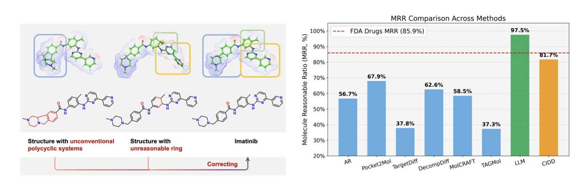
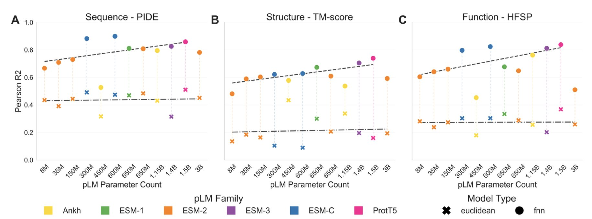
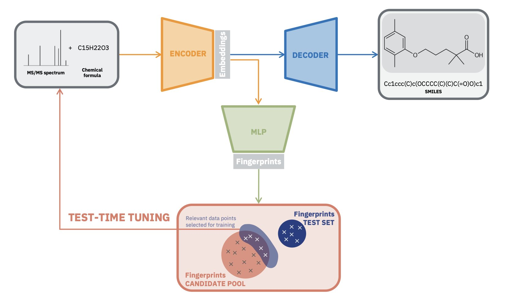
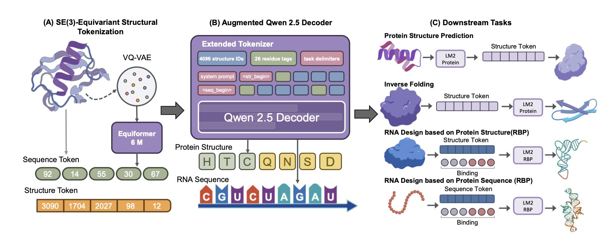
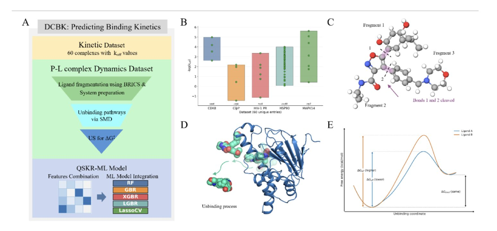

## Table of Contents
1. The CIDD framework mimics a medicinal chemist's thought process to generate molecules with better drug potential and chemical sense, moving AI drug discovery from theory to practice.
2. When choosing a Protein Language Model (pLM), focus on your needs, not just size. Medium-scale models are often sufficient for most tasks.
3. A new AI method based on Large Language Models uses "test-time tuning" to generate molecular structures directly from mass spectrometry data, improving the ability to identify unknown molecules.
4. The LM2Protein model "translates" complex 3D protein structures into text sequences, allowing Large Language Models to process them directly and showing promise in protein and RNA design.
5. Researchers developed the DCBK method, combining molecular dynamics simulations with machine learning to accurately predict the dissociation rates (k_off) of drug molecules.

## 1. The CIDD Framework: Using LLMs to Design Molecules Like a Veteran Medicinal Chemist

In drug discovery, it's common for computers to generate molecules. These molecules might bind perfectly to a target in a simulation, but in the real world, they are often impossible to synthesize or have obvious structural flaws. It's like an architect drawing a cool-looking building without considering structural support or materials.

A paper on the CIDD framework attempts to teach a Large Language Model (LLM) to think like an experienced medicinal chemist.

First, to solve a problem, you have to measure it. The researchers proposed the "Molecule Reasonable Ratio" (MRR) to quantify how chemically "sensible" a molecule is. As expected, most existing models scored poorly, generating a lot of chemical nonsense.

CIDD works by breaking down the drug design process into a few steps that match a chemist's workflow:

1.  **Analyze interactions**: Look at the protein pocket's structure to find key amino acids to target.
2.  **Design a molecule**: Based on the analysis, design a molecular scaffold that fits the pocket.
3.  **Reflect and evaluate**: Examine the molecule. Is it easy to synthesize? Does it have toxic groups? How is its drug-likeness? This step gives the AI a dose of "chemical intuition."
4.  **Filter and decide**: Based on the reflection, decide whether to keep the design, go back and modify it, or start over.

This entire process forms a "Chain-of-Thought," making the AI's decision-making process transparent and logical.

How well does it work? On the CrossDocked2020 benchmark, molecules generated by CIDD maintained competitive binding affinity while showing major improvements in drug-likeness (QED), synthetic accessibility (SA), and the new MRR metric. When combining binding ability with drug-likeness, its success rate was more than double that of the previous best method.

This approach filters out many unworkable molecules from the start, identifying candidates with a better chance of becoming drugs. It moves AI from being just a "molecule generator" a step closer to being an "intelligent partner" that can collaborate with chemists. Of course, the molecules still need to be synthesized and tested in a lab to prove their value. But the idea of building chemical "common sense" and a "workflow" into a machine is a step in the right direction.

📜Title: CIDD: Collaborative Intelligence for Structure-Based Drug Design Empowered by LLMs
🌐Paper: https://openreview.net/pdf/77cb4fc7534bc0e0660ba9931aad895880b93492.pdf

## 2. How to Choose a Protein Language Model?

In protein research, choosing the right protein language model (pLM) is increasingly important. A new study compared the major pLMs on the market and concluded: bigger isn't always better.

The study found that medium-scale pLMs, like ESM2 (650M), are just as effective at directly extracting biological information from proteins as models with far more parameters (such as the 3B or 15B versions). If the goal is to quickly understand a protein's structural features or functional class, a medium-sized model is good enough and avoids unnecessary computational costs.

Large models still have their place. They are like giant libraries full of potential, but you need an effective way to find what you're looking for. Supervised learning is the key to unlocking their potential. By fine-tuning large pLMs for specific tasks, they can achieve top performance on particular problems. So, if you have high-quality labeled data and want the best results for a specific task, you should choose a large model and fine-tune it.

This involves a trade-off. A fine-tuned model becomes an expert in one specific area but may perform poorly in others. The research shows that task-specific training reshapes the pLM's embedding space to better fit that task, but at the cost of generality. This tells us that model selection should start with the actual need: use a pre-trained, medium-sized model for general exploratory analysis, and use a fine-tuned large model to tackle specific challenges.

This research reminds us that instead of just scaling up model parameters, we should focus on the data itself. Improving the quality and diversity of training data is what will lead to more powerful and general pLMs. This may be the way forward.

📜Paper: https://www.biorxiv.org/content/10.1101/2025.10.30.685515v1
💻Code: https://github.com/tsenoner/plm_choice

## 3. AI Deciphers Molecules Directly from Mass Spectra, No Database Needed

Chemists, especially in natural products or metabolomics, often face a tough problem: how to identify a molecule from its mass spectrometry (MS) spectrum. Traditional methods rely on matching the spectrum against a database. If you encounter a new compound not in any database, you have to manually interpret the fragment ion peaks. This *de novo* structure elucidation is like solving a puzzle—it's time-consuming and error-prone.

A new study proposes a method that is like installing a thinking "brain" to solve this problem.

**Here's how it works**

Researchers used a Transformer architecture, similar to a Large Language Model, and pre-trained it on a massive amount of **simulated** mass spectrometry data. This step taught the model the basic rules of molecular fragmentation and patterns, building its "chemical intuition."

The highlight of this method is "test-time tuning."

A pre-trained model is like a medical student who has finished theory but lacks practice. When it sees a real spectrum from an experimental sample, the model quickly fine-tunes its own parameters for that **specific spectrum**. This allows it to adapt to the unique noise and peak intensity distribution, leading to a more accurate interpretation.

This real-time adjustment capability solves the "domain shift" problem, where data varies due to different instruments or experimental conditions. Traditional models use fixed parameters for all data and perform worse on new data. This new method creates a "custom" analysis plan for each spectrum.

**From "Guessing" to "Direct Generation**"

The framework enables end-to-end generation. You input a mass spectrum, and the model directly outputs the most likely molecular structure (as a SMILES string), without needing to annotate fragment peaks or rely on spectral databases.

This is a big deal for discovering new molecules. Because it doesn't depend on known databases, the method can theoretically identify any molecule that follows the laws of chemistry.

**How do you make sure it doesn't "hallucinate**"?

AI generation models often produce results that look plausible but violate chemical rules, such as creating non-existent molecular structures.

To address this, the researchers added a constraint. They trained a separate Multilayer Perceptron (MLP) model designed to predict a molecule's chemical fingerprints directly from its mass spectrum.

When the main model generates a molecular structure, the system calculates its chemical fingerprint in real time and requires it to match the prediction from the MLP model. This mechanism acts like a chemical expert supervisor, ensuring the chemical properties of the generated structure align with the original spectrum. This keeps the output chemically reasonable.

**How well does it work**?

On the NPLIB1 benchmark, the method's performance was double that of the previous top method, DiffMS. On the more complex MassSpecGym test set, its performance improved by 20%.

For researchers, this could dramatically shorten the time from finding a hit in a screen to having an initial structural hypothesis. Even if the AI's top answer isn't perfect, the paper shows that the candidate structures it generates are close to the real one. This can change the work from a "needle in a haystack" search to confirming one of a few good options, saving time and resources on follow-up validation like NMR.

📜Title: Test-Time Tuned Language Models Enable End-to-end De Novo Molecular Structure Generation from MS/MS Spectra
🌐Paper: <https://arxiv.org/abs/2510.23746v1>

## 4. LM2Protein: A Language Model That Turns Protein Structures into "Text"

Traditional computational models need complex graphics or 3D processing pipelines to handle 3D structures like proteins. LM2Protein takes a new approach by "translating" the 3D structure into text.

Researchers developed a neural network similar to a VQ-VAE. It converts the 3D spatial coordinates of each amino acid in a protein into a discrete, standardized "structure token." This turns a complex protein's spatial structure into a long sequence of these "tokens."

This idea transforms 3D structure processing into a sequence processing task, which Large Language Models are good at. It simplifies the model's training and inference, removing the need for complex visual processing modules.

In tests of protein sequence design (predicting the amino acid sequence from a known 3D structure), LM2Protein achieved a sequence recovery rate of 51.00%, outperforming models like ProteinMPNN and PiFold. It can also design RNA sequences that bind to a protein based on the protein's sequence or structure, with recovery rates of 73.7% and 70.7% respectively. This shows the model's potential to understand interactions between different types of molecules.

The model currently has challenges with rare protein topologies and with accurately capturing the global fold of a protein. The path for improvement is clear: incorporate more biophysical prior knowledge into the model, such as inter-atomic forces and energy functions, to help it generate structures that are more consistent with the laws of nature.

📜Title: LM2Protein: A Structure-to-Token Protein Large Language Model
🌐Paper: https://aclanthology.org/2025.findings-emnlp.369.pdf

## 5. Machine Learning Predicts Drug Dissociation Rates: The DCBK Framework Changes Drug Kinetics

How long a drug molecule stays at its target, its "residence time," is directly related to how long its effect lasts. Residence time is determined by the dissociation rate (k_off). The smaller the k_off, the longer the residence time and the more durable the drug's effect. Predicting k_off has traditionally been difficult; existing methods are either slow or inaccurate.

Researchers developed the DCBK framework to solve this.

It works by breaking down a drug molecule into meaningful fragments based on the stability of its chemical bonds. This is like analyzing a race car by studying the performance of its engine, tires, and chassis separately. This allows you to identify which "part" is most important for how tightly the drug binds to its target protein.

In practice, DCBK first uses a technique called Adaptive Biasing Force molecular dynamics to simulate the process of each fragment detaching from the target protein. It calculates the free energy of dissociation, which is the energy barrier that must be overcome for this to happen.

After getting this physics-based simulation data, DCBK feeds it, along with other chemical features of the molecule, into a machine learning model. This model has been trained on a large amount of experimental drug kinetics data. It uses the simulation results to correct and provide a more realistic prediction of k_off. This is like an experienced engineer who can understand component test data and use their experience to accurately judge how the car will perform on a real track.

The researchers validated DCBK on a dataset of 60 drug-target complexes, and the results showed a high correlation of 0.90 between the predicted and experimental values.

This method is very efficient. Generating training data for a new drug molecule takes about 30 GPU hours. Once the model is trained, predicting the k_off for a new molecule is nearly instant. This gives it the potential to be used in large-scale virtual screening, helping scientists to quickly identify long-acting drug candidates from huge libraries of molecules.

📜Paper: Predicting Ligand Dissociation Kinetics with a Fragment-Based Hybrid Simulation and Machine Learning Framework
🌐Paper: https://www.biorxiv.org/content/10.1101/2025.11.01.685950v1
