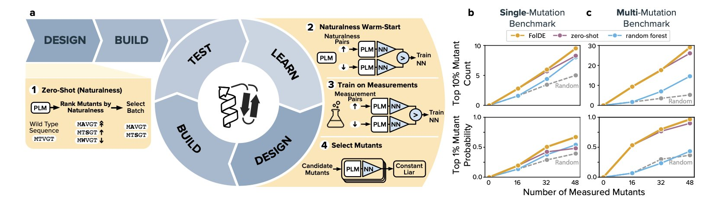
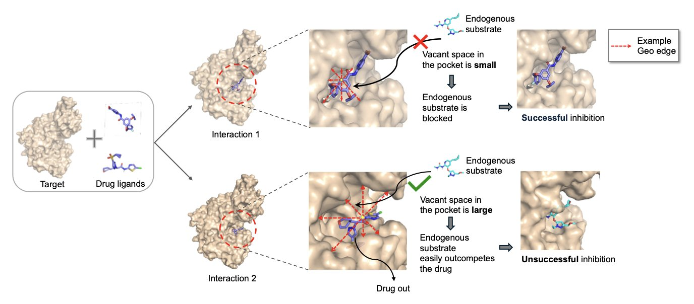
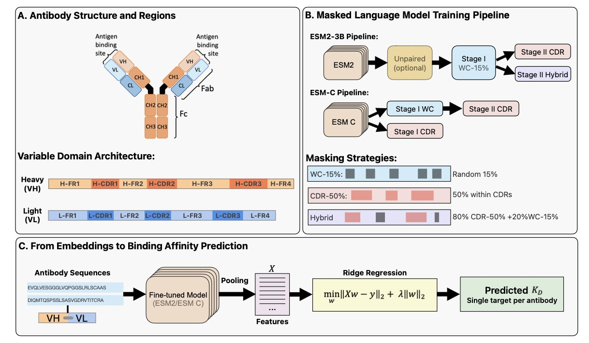
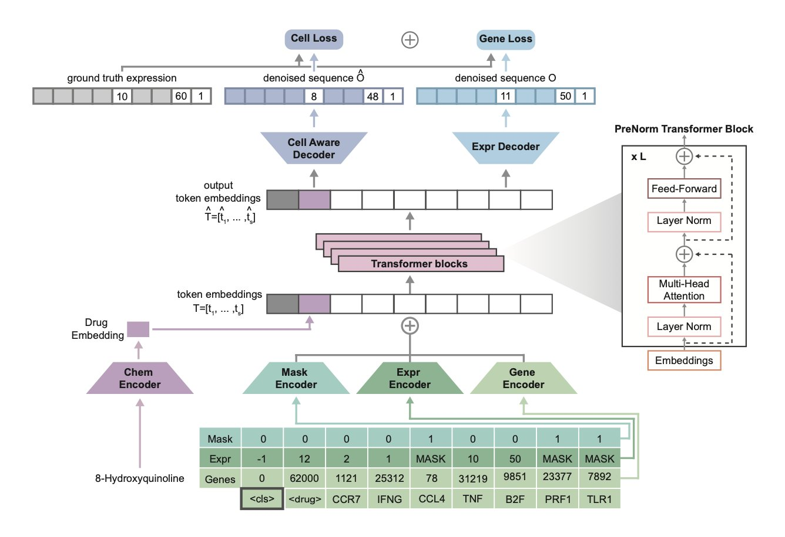
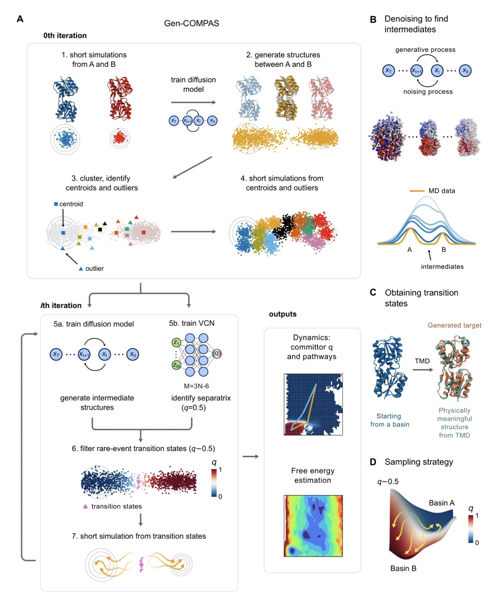

## Table of Contents
1. FolDE is an open-source active learning framework. It combines "naturalness" predictions from protein language models with a small amount of experimental data to address the problem of data scarcity in early-stage directed evolution, improving the efficiency of finding highly active mutants.
2. LigoSpace improves the accuracy of drug activity prediction by quantifying the "emptiness" of binding pockets and integrating information from multiple pockets.
3. A language model specialized for antibody CDR regions outperforms traditional models in predicting antigen-binding affinity.
4. Tahoe-x1, a 3-billion-parameter model trained on a dataset of 100 million cell perturbations, can understand causal relationships between genes to more accurately predict cellular responses to drugs.
5. The Gen-COMPAS framework uses generative AI to construct molecular conformational transition paths, reducing the time for simulating rare events from months to days and tackling a computational bottleneck in drug development.

## 1. FolDE: Efficiently Optimizing Protein Activity with Limited Data

Directed evolution is a key technique in protein engineering, but it is expensive and time-consuming. Finding a few high-performing molecules often requires screening thousands of mutants. This process is like finding a needle in a haystack, especially at the beginning of a project when experimental data is scarce. The selection of the next batch of mutants relies heavily on intuition and luck.

Active Learning (AL) aims to let machines select the most promising candidate molecules. But traditional methods perform poorly when initial data is too limited, as the model cannot learn effective patterns. This is the "low-N" or "cold start" problem.

The FolDE framework offers a practical solution.

Its core idea is that while *activity data* is scarce, vast amounts of *sequence data* are available. A Protein Language Model, pre-trained on millions of natural protein sequences, already has a sense of which amino acid combinations are more "natural" and more likely to fold into a stable structure.

Here is how FolDE works:

**Step 1: Pre-warm the model with "naturalness**."
Before the first round of experiments without any activity data, FolDE uses the language model's "naturalness" score to select the initial batch of mutants. The logic is that more "natural" sequences are more likely to fold correctly and be functional. This gives the model a warm-up, avoiding a random start.

**Step 2: Smoothly transition from "naturalness" to real data**.
After obtaining the first batch of experimental data, FolDE combines the activity data with the "naturalness" scores to jointly train a neural network predictive model. The model evolves from a novice that only understands "general rules" (naturalness) into an expert that understands the project's "specific patterns" (activity data).

**Step 3: Ensure diversity with "pessimism**."
Directed evolution often falls into a trap: once a model finds an effective mutation region, it only recommends similar sequences, missing other potential areas. FolDE solves this with a "constant-liar" batch selector. It works counter-intuitively: after the model selects an optimal mutant, it immediately assumes in its internal calculations that this mutant performs poorly. This "pessimistic" assumption forces the model to explore other parts of the sequence space to find the next candidate. As a result, the list of mutants for the next round of experiments is diverse, increasing the chances of discovering entirely new, highly active molecules.

This strategy is effective. Simulations on 20 protein targets show that FolDE finds 23% more of the top 10% most active mutants and is 55% more likely to find the top 1% mutants compared to other methods. For a real project, this means reaching goals faster and more cheaply.

FolDE has been packaged as an open-source Python software. Any lab can use it directly, regardless of machine learning expertise. This lowers the barrier to efficient protein optimization, making computational tools accessible to bench scientists.

📜**Paper Title**: Low-N Protein Activity Optimization with FolDE
🌐**Paper**: https://arxiv.org/abs/2510.24053v1
💻**Code**: https://github.com/jbei/foldy

## 2. LigoSpace: Adding Spatial Awareness to Drug Activity Prediction

The core of drug discovery is the biological activity of compounds. Traditional computational models that predict activity often focus on atomic interactions. This ignores the empty space within a protein's binding pocket that is not occupied by the small molecule, and this space greatly influences drug activity.

An ideal ligand should not only bind to the target but also fit snugly into the pocket. If too much empty space remains, water molecules or other endogenous small molecules could enter and interfere with the drug's effect. The LigoSpace method aims to address this issue.

Its core idea is to give the model a "sense of space." The researchers developed the GeoREC tool to calculate the "emptiness" around each atom in a protein-ligand complex. This allows the model to perceive the ligand's posture in the pocket and judge its spatial utilization.

Another innovation is the UnionPocket. The same protein target may bind to multiple different ligands in similar but non-overlapping locations. Traditional methods analyze each complex independently, which can lead to information loss. LigoSpace overlays these different binding pockets to form a "union pocket." This enables the model to compare different ligands within a unified coordinate system and capture subtle differences in their binding modes.

LigoSpace also introduces a "pairwise loss function" in its training. Traditional models focus on the absolute difference between predicted and experimental activity values. LigoSpace not only requires accurate predictions but also demands the correct ranking of compound activities. For example, if compound A is more active than B, the model's prediction must reflect this order. This design is closer to the practical needs of drug screening, where the relative ranking of compounds is often more important than their exact activity values.

Experimental results show that LigoSpace outperforms existing models on several public datasets. This demonstrates that considering the spatial geometry and global information of the binding pocket is an effective approach for drug activity prediction.

📜**Title**: Enhancing Bioactivity Prediction via Spatial Emptiness Representation of Protein-ligand Complex and Union of Multiple Pockets
🌐**Paper**: https://openreview.net/pdf/8f52991ce31617440e836fd786d0bf32d38c4e7e.pdf

## 3. A New Approach to Antibody Language Models: Focus on CDRs for Better Predictions

Antibody drug development is a difficult process of searching for specific molecules among hundreds of millions of antibody sequences. Traditional screening methods are costly and inefficient, making computational biology, especially Large Language Models (LLMs), a new direction. But general protein models still have a limited understanding of the key issue of antibody-antigen binding.

A recent study proposes that instead of having the model analyze the entire antibody sequence, it should focus directly on the most critical part: the Complementarity-Determining Regions (CDRs). An antibody has six CDRs, three on the heavy chain and three on the light chain, which together determine its binding specificity to an antigen.

The researchers adapted the training methods of existing protein language models, ESM2 and ESM-C. During the pre-training phase, they did not mask random parts of the sequence. Instead, they only masked amino acids in the CDR regions, guiding the model to focus on learning key information about antibody binding.

The results show that this "CDR-aware" training significantly improved the model's understanding of binding mechanisms. On the task of predicting antibody-antigen binding affinity, the new model's R² value—a measure of predictive accuracy—increased by 27%. This means the model's predictions have a stronger correlation with experimental data.

A compact 600-million-parameter model (AbCDR-ESMC), trained with the new method, performed as well as much larger models with billions of parameters, and even better on some tasks. This suggests that an optimized training strategy can be more effective than simply increasing computational resources.

This research shows that integrating biological knowledge into model design is key for AI-driven drug discovery. By aligning the training objective with a biological function, such as the role of CDRs in antigen recognition, models can learn more efficiently.

The researchers have made their trained models (AbCDR-ESM2 and AbCDR-ESMC) open-source. For scientists working on antibody engineering, this new tool will help screen and design antibody drugs faster.

📜**Title**: CDR-aware masked language models for paired antibodies enable state-of-the-art binding prediction
🌐**Paper**: https://www.biorxiv.org/content/10.1101/2025.10.31.685149v1

## 4. Tahoe-x1: Training AI on Perturbation Data to Predict Anti-Cancer Drug Efficacy

The field of biology has many foundation models, but most are trained on vast amounts of static sequencing data. This is like reading books without ever doing an experiment. Tahoe-x1 takes a different approach.

While traditional models observe snapshots of gene expression in cells under normal conditions, Tahoe-x1 observes how cells react after being "poked." This "poke" is a perturbation, such as treatment with a small molecule drug or a gene knockout. The research team built the Tahoe-100M dataset for this purpose, which contains the results of over 100 million perturbation experiments.

This method allows the model to learn causal relationships. Static data might show that the expression levels of gene A and gene B change together, but it cannot determine if A affects B, B affects A, or if both are regulated by another gene, C. If inhibiting A with a drug leads to a decrease in B's expression, the causal link becomes clear. By learning from millions of such "causal experiments," Tahoe-x1 builds a deep understanding of cellular mechanics.

The model's technical implementation is a masked-expression generative objective. This is similar to a "fill-in-the-blank" task: it randomly masks some gene expression data and prompts the model to predict the missing values based on information like cell type and drug perturbation.

To help the model understand drugs, the researchers introduced "drug tokens." Each drug is assigned a unique numerical identity. When filling in the blanks, the model must consider both the cell type and the drug used to treat the cell. This way, the model learns a unified representation that connects genes, cells, and compounds. This design makes it more flexible for downstream applications, like predicting the effects of new drugs or identifying drug targets.

Scaling the model to 3 billion parameters required significant engineering optimizations, such as using more efficient Transformer training methods and I/O-friendly data formats. Its computational efficiency is 3 to 30 times higher than previous models.

Tahoe-x1 has achieved top results on multiple cancer research benchmarks, such as predicting genes essential for cancer cell survival (gene essentiality) and identifying hallmark genes associated with cancer development. This shows that pre-training on large-scale perturbation data gives the model strong generalization capabilities that extend beyond its training data.

For drug development, this model provides a powerful tool for generating and validating hypotheses. In precision oncology, clinical or experimental data is often limited. Models like Tahoe-x1 can use their generalization abilities to make valuable predictions for drug-cell combinations that have not been tested experimentally.

The research team has open-sourced the pre-trained model, code, and evaluation pipeline, which will accelerate development in the field. In the future, we can expect to see more models based on the "perturbation training" idea, helping to find new ways to combat diseases.

📜**Paper Title**: Tahoe-x1: Scaling Perturbation-Trained Single-Cell Foundation Models to 3 Billion Parameters
🌐**Paper Link**: <https://www.biorxiv.org/content/10.1101/2025.10.23.683759v1>

## 5. AI Speeds Up Simulations 100-Fold: Gen-COMPAS Decodes Molecular Rare Events

Those of us in computational drug discovery have a love-hate relationship with Molecular Dynamics (MD) simulations. We love MD because it is the only tool that lets us "see" protein movement and drug binding or unbinding at the atomic level. We hate it because it is incredibly slow.

Imagine watching a drug molecule unbind from its target protein. In the real world, this might take milliseconds or even seconds. But for an MD simulation, each computational step is on the femtosecond (10⁻¹⁵ seconds) timescale. Simulating a single unbinding event requires running an astronomical number of steps, which can take months or even years. This is the "timescale barrier." We spend most of our time waiting for a "rare event" to happen, like waiting by a highway hoping to photograph a specific colored car—it's all about luck and time.

The Gen-COMPAS framework could end this long wait. It uses a different approach that does not rely on brute-force computation.

Here is how it works. Traditional MD is like a blindfolded person wandering in a valley, hoping to find a path over a mountain (an energy barrier). Gen-COMPAS gives this person a GPS and a guide.

First, it uses a generative model—specifically a diffusion model, similar to the technology behind current AI image generation—to directly "generate" a series of physically plausible intermediate conformations between a known start point (like the drug-bound state) and an endpoint (the drug-unbound state). This is like an experienced mountain guide drawing several possible routes on a map, saving the time spent wandering aimlessly in the valley.

Second, it introduces a "committor" function to evaluate these generated paths. This function acts like a referee, judging the "fate" of each intermediate conformation: from this state, is it more likely to return to the start or proceed to the end? Using this probability judgment, Gen-COMPAS can select conformations that are truly on a "successful path" and discard those that deviate.

The entire process is an iterative cycle of "generate-filter-regenerate." After a few rounds, it quickly converges to build an ensemble of high-probability transition paths from the start to the end. From this, it can calculate the free energy barrier and reaction rate.

The paper shows a few examples:
1.  **Trp-cage protein folding**: This is a well-studied "fast-folding" small protein, a gold standard for testing new algorithms. Gen-COMPAS successfully reproduced its folding pathway and free-energy landscape.
2.  **Ribose-binding protein**: This system is more complex, involving the coupled process of ligand binding and protein conformational change (binding-upon-folding). This type of process is common in drug design and much harder to simulate. Gen-COMPAS also solved it efficiently.
3.  **Mitochondrial ADP/ATP carrier**: This is a transporter protein that works by undergoing large-scale conformational changes between two states. Simulating such changes in a large molecule is a nightmare for traditional MD. Gen-COMPAS successfully captured this process, showcasing its potential.

The most exciting part of this method is that it does not require a pre-defined reaction coordinate. In the past, using enhanced sampling methods like Metadynamics or Umbrella Sampling required first guessing one or more key variables to describe the entire process, such as the distance between the ligand and the protein pocket. A wrong guess could waste months of computation. Gen-COMPAS bypasses this guesswork, letting the data speak for itself. This fundamentally improves the research methodology.

This method is not a silver bullet. The training of the generative model and the accuracy of the committor function are still challenges. But it points to a new direction: using AI's "imagination" to explore the most inaccessible corners of the molecular world, rather than relying on computational brute force. If this method matures and becomes widely adopted, our ability to understand drug mechanisms, predict drug residence times, and design entirely new functional proteins will take a major leap forward.

📜**Title**: Breaking the Timescale Barrier: Generative Discovery of Conformational Free-Energy Landscapes and Transition Pathways
🌐**Paper**: https://arxiv.org/abs/2405.14797
