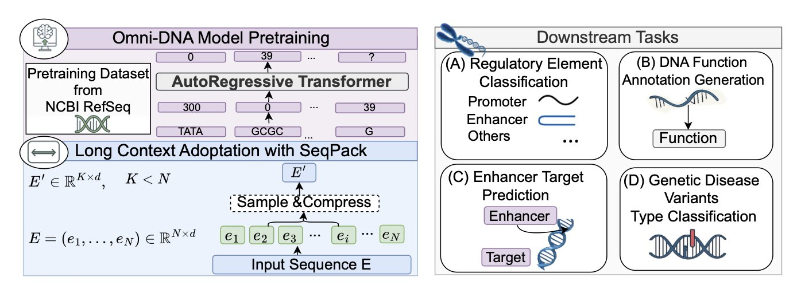
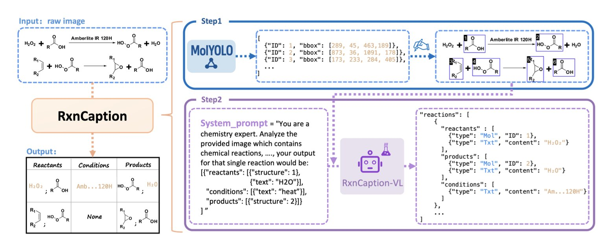
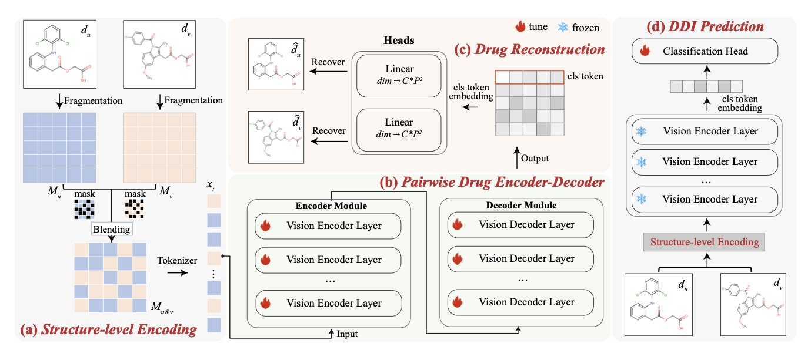
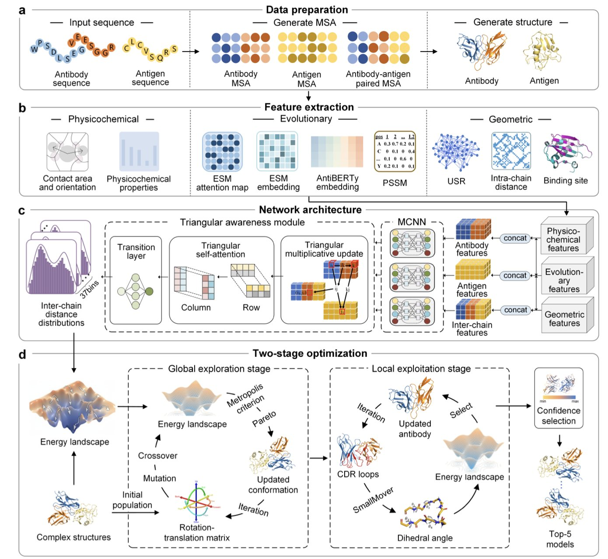
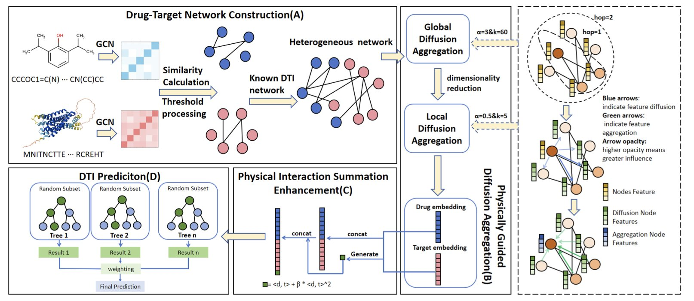

## 目录  
1. Omni-DNA 模型将自然语言处理技术与 DNA 序列分析结合，既能「阅读」超长基因组，也能「写出」其功能注释，为基因组学研究开辟了新路径。
2. RxnCaption 框架将分子检测与大视觉语言模型结合，把复杂的化学反应图解析任务，转变为更简单的「看图说话」问题，提升了准确性和泛化能力。
3. S2VM 框架将药物分子视为图像，利用自监督学习融合其结构信息，为预测药物相互作用提供了更准确、更可解释的新方法。
4. 深度学习结合构象采样，DeepAAAssembly 在抗体 - 抗原复合物结构预测的精度和可靠性上，超越了 AlphaFold3。
5. 新框架 PDDMA-DTI 借鉴物理学扩散原理，通过模拟信息在网络中的传播，更准确、可靠地预测药物与靶点的相互作用。

## 1. Omni-DNA：AI 读懂 DNA，解锁基因组的长篇叙事  
  
  

做药物研发，常与各种靶点、序列打交道。Omni-DNA 这篇论文让 AI 在基因组学领域又前进了一步：让机器像理解人类语言一样理解 DNA。  
  
**DNA 序列的「压缩」新方法**  
  
过去，分析超长 DNA 序列是个难题，如同阅读一本没有标点和章节的超长小说，容易「迷路」，且计算资源消耗大。此前的模型，如 Nucleotide Transformer，处理长序列时仍显不足。  
  
Omni-DNA 的开发者提出了一种名为 SEQPACK 的压缩方法。它能高效「打包」超长基因序列（超过 45 万个碱基对）而不丢失关键信息。这样，模型能用更少计算资源处理更长序列，捕捉远距离基因调控元件间的相互作用，例如增强子与其调控的目标基因。这对于理解复杂基因调控网络至关重要。  
  
**当 DNA 序列遇上自然语言**  
  
Omni-DNA 的亮点在于真正将 DNA 与人类语言联系起来。研究者把 DNA 当作一种有语法、有语义的语言对待，而不只是 A、T、C、G 的排列。  
  
他们构建了 SEQ2FUNC 数据集，作为 DNA 序列的「翻译词典」，将 DNA 片段与功能描述文本对应。借助该数据集，Omni-DNA 可以学习「翻译」DNA 序列。输入一段 DNA，它不仅能识别其类型（如是否为增强子），还能直接生成一段文本来描述其潜在功能。  
  
这个功能让模型从做「选择题」（分类任务）升级为做「问答题」（生成任务）。它能从序列中提炼生物学意义，并用人类语言表达。这对功能基因组学研究价值巨大。例如，发现新基因突变时，可让模型预测并生成文本，描述突变可能如何影响基因功能，为后续实验验证提供方向。  
  
**多任务学习的力量**  
  
模型还利用了多任务学习策略。研究者让 Omni-DNA 同时在多个相关生物学任务上微调，比如同时预测调控元件和增强子 - 靶基因相互作用。如同学生同时学习代数与几何，知识可以相互促进。通过这种方式，模型能捕捉到不同任务背后共通的生物学信号，提升了在各项任务上的表现和泛化能力。  
  
从研发科学家的视角看，Omni-DNA 是一个性能更高的模型，也代表了一种新的研究范式：将成熟的自然语言处理技术（Natural Language Processing）深度融合到基因组学分析中，让我们离「读懂生命天书」的目标更近一步。  
  
📜Title: Omni-DNA: A Genomic Model Supporting Sequence Understanding, Long-context, and Textual Annotation  
🌐Paper: https://openreview.net/pdf/e038f294ab29cc597ce4e261209e5e765c2069f9.pdf  

## 2. AI 新范式：像看图说话一样解析化学反应  
  
  

从化学文献中自动提取反应方程式，是化学信息学领域的一个难题。传统方法要求 AI 模型同时完成两项任务：在复杂的反应图中框出每个分子，并识别出其角色，如反应物或产物。这对 AI 来说很困难，即便是大视觉语言模型 (Large Vision-Language Model, LVLM)，也更擅长理解图像内容，而非精确定位。  
  
**一个巧妙的解法**  
  
北京大学的研究者提出了一个名为 RxnCaption 的新方法。其核心思想是让 LVLM 专注于自己擅长的部分。  
  
具体分为两步：  
1.  **定位分子**：首先，训练一个专门识别化学结构的目标检测模型 MolYOLO。该模型能快速准确地在反应图上框出所有分子并进行编号。  
2.  **描述关系**：然后，将这张标好分子的图提供给 LVLM。任务变得简单，LVLM 只需观察图像，用自然语言描述反应过程，例如：「1 号和 2 号是反应物，箭头指向 3 号，所以 3 号是产物。」  
  
这种「先标框，再描述」的策略，将复杂的视觉定位任务，转化成了 LVLM 擅长的图像描述任务。  
  
**更大的数据集与更真实的挑战**  
  
为验证该方法，研究者构建了新数据集 RxnCaption-11k。它直接从已发表的化学论文中提取，规模比以往的数据集大一个数量级，并包含各种复杂的排版布局。  
  
过去的数据集布局规整，而 RxnCaption-11k 中的反应图布局多样，横向、纵向或环形排列都有，更能考验模型的泛化能力。  
  
实验结果显示，RxnCaption 模型在各项指标上都超越了之前的最优模型（如 RxnScribe）。尤其在更具挑战性的新数据集上，其优势更明显，证明了新方法的准确性与处理复杂真实场景的能力。  
  
**未来的方向**  
  
该方法目前主要依赖视觉信息。研究者认为，未来需要将化学知识更深度地融入模型。如果 AI 能理解反应的化学原理，例如识别反应中心，解析的准确性将进一步提升。  
  
📜Title: RxnCaption: Reformulating Reaction Diagram Parsing as Visual Prompt Guided Captioning  
🌐Paper: https://arxiv.org/abs/2511.02384  
💻Code: https://github.com/songjhPKU/RxnCaption  

## 3. AI 预测药物相互作用：S2VM 新框架解读  
  
  

预测两种药物共同服用时的相互作用，即药物 - 药物相互作用（Drug-Drug Interactions, DDIs），是药物研发和临床用药的核心难题。错误的相互作用可能导致药效降低，甚至引发严重毒副作用。传统方法或依赖昂贵耗时的实验筛选，或依赖精度与泛化能力不足的计算模型。一个名为 S2VM 的新框架为此提供了巧妙的解决方案。  
  
不同于使用 SMILES 序列或分子图表示药物的常规方法，S2VM 首先将每个药物分子渲染成一张二维图像，就像为分子拍摄「证件照」，直观保留了分子的空间构象和官能团的相对位置。  
  
它的核心步骤是「视觉融合」 (Visual Blending)。S2VM 并非独立处理两个药物分子再合并信息，而是从两张分子「证件照」中随机提取片段，像拼图一样将它们融合成一张新的输入图像。  
  
这种方法迫使模型在处理这张「混合图像」时，必须同时关注两个分子的内部结构（如特定的环或官能团）以及它们之间可能形成的新空间关系。这好比将两个人的照片剪开重拼，促使观察者注意那些可能产生关联的细微特征。  
  
S2VM 使用自监督学习（Self-supervised Learning）进行预训练，因此无需依赖大量已标记的 DDI 数据。它能通过「看」海量的无标签药物分子对，在类似「拼图 - 还原」的任务中自主学习药物的结构语言。例如，模型需要根据一张打乱的「混合图像」，预测原始分子片段的归属或它们在原始分子中的相对位置。  
  
通过这种预训练，模型学会了从视觉层面理解单个分子的结构，以及不同分子结构组合时可能产生的模式。之后，仅需少量已知的 DDI 数据进行微调，它就能准确判断任意两种药物的相互作用。  
  
在多个主流 DDI 预测基准数据集上，S2VM 的表现优于多数现有方法，尤其在处理数据稀疏或全新的药物时，其优势更加突出。自监督学习赋予了它更强的泛化能力，使其在面对未见过的药物组合时依然有效。  
  
此外，该模型具备一定的可解释性。由于基于图像，我们可以通过可视化技术观察模型在预测时重点关注了分子的哪些区域。例如，模型可能高亮显示一个分子的羟基和另一个分子的羧基，暗示二者间可能形成氢键并引发相互作用。这有助于理解 DDI 的作用机制，并为后续的药物设计提供指导。  
  
尽管将分子视为图像无法完美捕捉三维空间信息，但 S2VM 作为一个新思路，为解决 DDI 预测问题提供了高效、直观的工具。  
  
📜Title: Self-supervised Blending Structural Context of Visual Molecules for Robust Drug Interaction Prediction  
🌐Paper: https://openreview.net/pdf/8c8be03ed80289c37107d98f38f490b948870f50.pdf  

## 4. DeepAAAssembly：AI 预测抗体 - 抗原结构，超越 AlphaFold3  
  
  

预测抗体如何结合其抗原，是一个棘手的难题。抗体的互补决定区（Complementarity-Determining Region, CDR）环路像柔软的面条一样灵活，让传统的物理对接方法难以处理。AlphaFold2/3 等 AI 模型虽然带来了希望，但在预测蛋白质 - 蛋白质相互作用（protein-protein interaction, PPI）时表现不稳，处理抗体这类高度柔性的系统尤其困难。  
  
研究者开发了一种新方法 DeepAAAssembly，融合了两者的优点。  
  
它的核心思路是：首先用深度学习预测抗体和抗原之间哪些氨基酸残基会相互靠近，相当于获得了一份「接触点」地图。这些距离预测被转换成一个能量函数，作为后续结构搜索的导航。  
  
接下来是两步走的构象采样：  
  
1.  **全局定位**：程序粗略探索抗体相对于抗原的各种可能朝向，快速筛选出几个最有希望的结合姿态。  
2.  **局部精修**：确定大致方向后，程序精细调整高度灵活的 CDR 环路构象，确保它们与抗原表面完美贴合。  
  
在一个包含 67 个已知结构的抗体 - 抗原复合物测试集上，DeepAAAssembly 与 AlphaFold3 进行了比较。  
  
结果显示，DeepAAAssembly 的平均 DockQ 分数比 AlphaFold3 高出 12.9%。DockQ 是评估蛋白质对接模型质量的黄金标准，分数越高，模型越接近真实结构。DeepAAAssembly 成功将许多被 AlphaFold3 预测为「错误」的模型提升到「可接受」或「中等」质量，处理难题时更可靠。  
  
该方法还内置筛选机制，能从生成的多个结构模型中，自动选出结构最合理、能量最稳定的最佳模型。  
  
DeepAAAssembly 巧妙地将深度学习的模式识别能力与传统对接方法的物理采样优势结合。AI 提供高层级的「情报」（残基距离），构象采样则在物理规则约束下进行精细的「实地勘探」。这种混合策略为解决抗体 - 抗原这类复杂灵活的相互作用系统，提供了强有力的框架。  
  
📜Title: High-accuracy structure modeling for antibody-antigen complexes  
🌐Paper: https://www.biorxiv.org/content/10.1101/2025.11.03.686275v1  

## 5. 物理扩散模型预测药物靶点，AI 新框架提升精准度  
  
  

预测药物与体内哪个蛋白质靶点结合，是药物发现的核心问题。图神经网络（Graph Neural Networks, GNN）在处理这类问题时，难以同时捕捉全局信息和局部特征。信息传递层数太少，模型视野有限；层数太多，节点特征又会趋同，产生「过平滑」问题，失去独特性。  
  
为了解决这个问题，研究者从物理学中获得灵感，开发了 PDDMA-DTI 框架。其核心思想模拟了墨水在清水中的扩散过程。  
  
这个框架分两步工作：  
  
首先，它设计了一个双层扩散方案。第一层是「全局扩散」，利用图拉普拉斯算子（graph Laplacian）模拟信息在整个药物 - 靶点网络中的远距离传播。这如同墨水滴入水中后向四周散开，让信息跨越药物、靶点等不同类型的节点。  
  
第二层是「局部扩散」，在节点的邻近区域进行信息平滑。这就像墨水扩散时，先均匀染黑周围的小片区域。为确保过程稳定可控，研究者采用了隐式欧拉方法（implicit Euler method）来规避数值计算问题。  
  
该框架最巧妙的设计是自适应停止规则。模型会监测每个节点的信息是否达到稳定的「平衡态」（steady-state），一旦达到，扩散就停止。这既保证了全局信息的充分流动，又避免了局部特征因过度混合而模糊，找到了一个平衡点。  
  
最后，为让模型更敏锐地识别真实的药物 - 靶点相互作用，研究者加入了一个「物理相互作用求和增强」（Physical Interaction Summation Enhancement）模块。这个模块通过一个包含线性和二次项的能量模型，专门放大了高度相关的药物 - 靶点对的信号。这好比在一群人里，用聚光灯照亮关系密切的两个人，使他们更突出。  
  
在多个标准数据集上的测试结果显示，PDDMA-DTI 的准确性和稳健性超过了当前主流方法。在处理数据不平衡的场景时，它的优势尤其明显。这一点对真实的药物研发至关重要，因为现实中绝大多数药物和靶点并无相互作用。  
  
📜论文：Physics-Diffusion-Driven Multiscale Aggregation for Drug-Target Interaction Prediction  
🌐链接：https://www.biorxiv.org/content/10.1101/2025.11.03.686185v2
