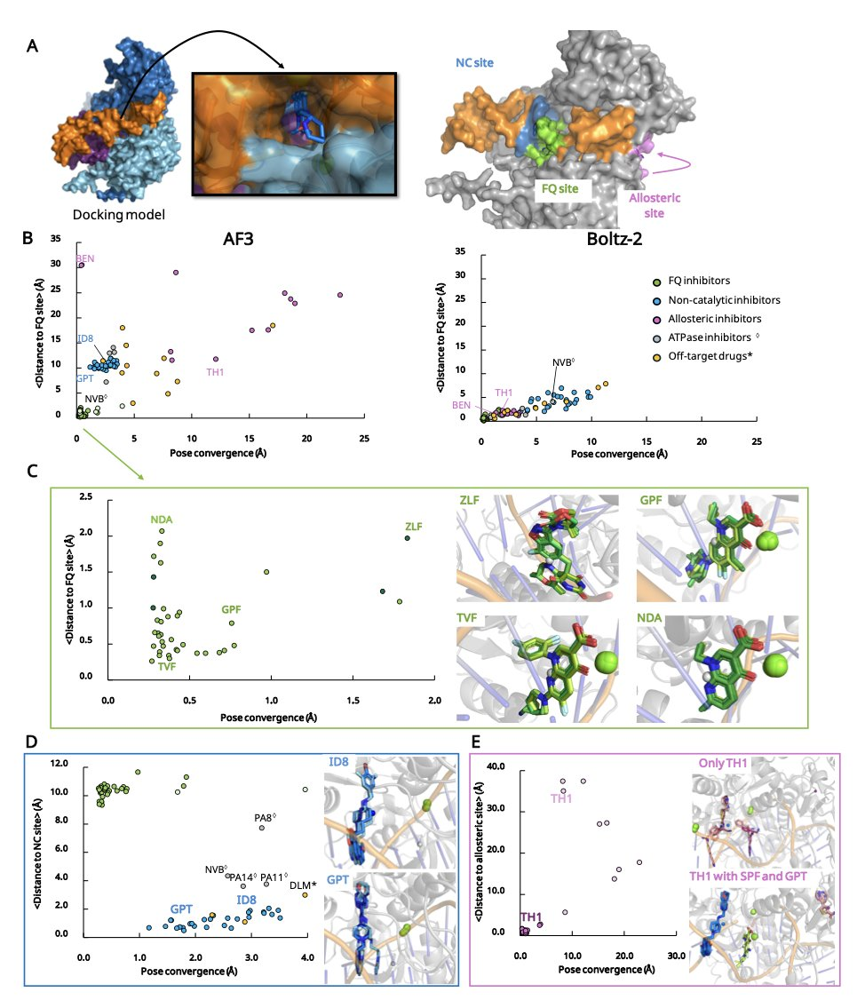
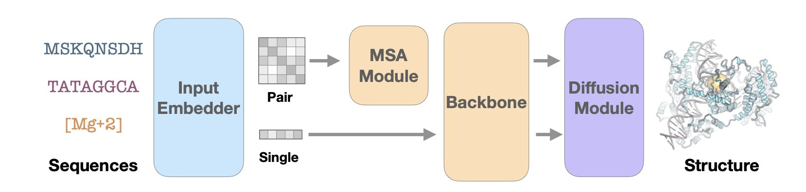
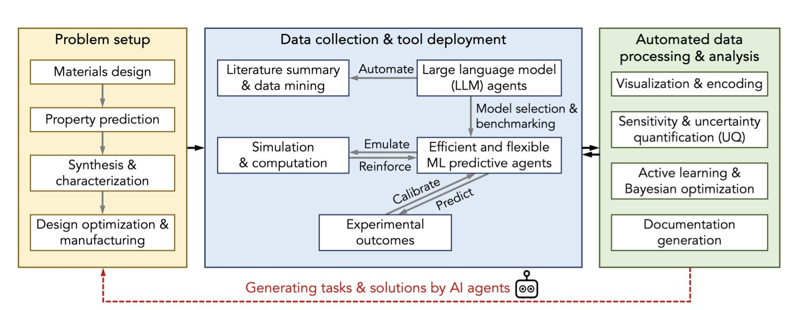
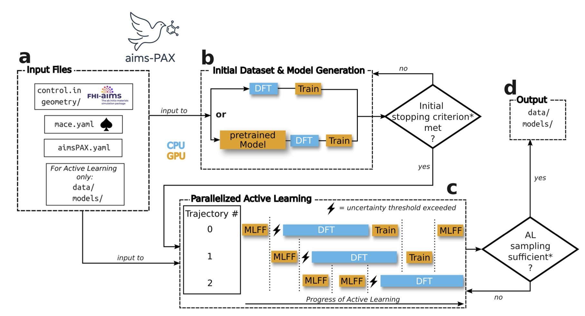
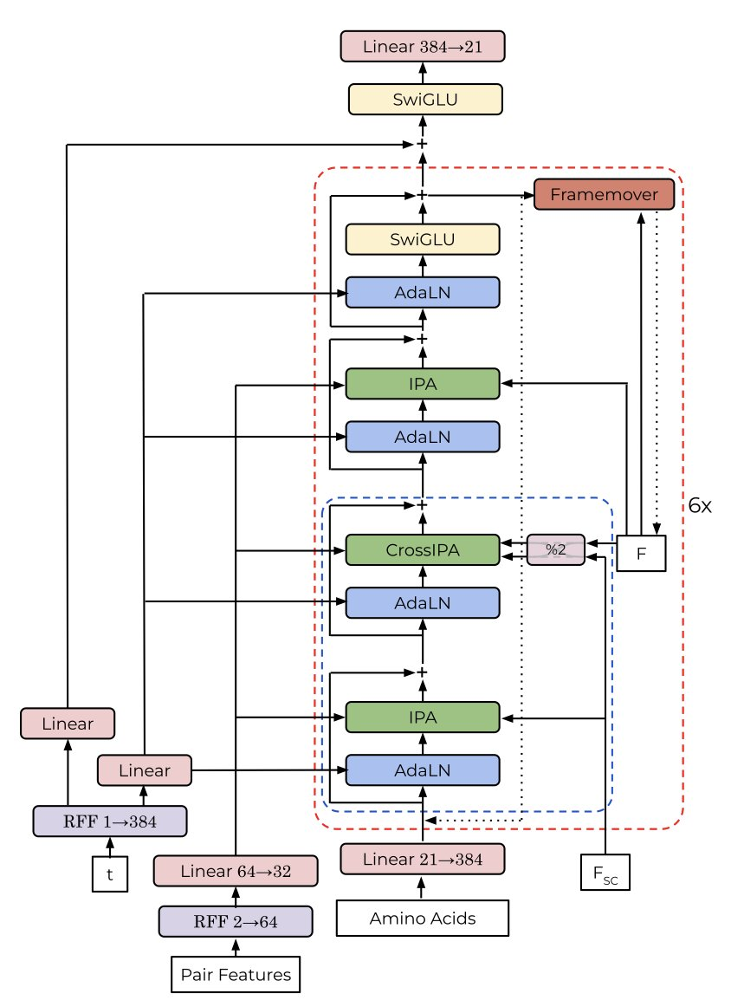

## Table of Contents
1. A new method predicts which drug molecule is the true winner by making them compete for a target's binding pocket, solving a long-standing ranking problem in virtual screening.
2. Pairmixer replaces costly triangle attention with simple triangle multiplication, boosting the efficiency of biomolecular structure prediction without sacrificing accuracy.
3. AI and automation are reshaping chemical R&D, moving from tedious trial-and-error to intelligent design, where collaboration between humans and machines is key.
4. AIMS-PAX uses parallel active learning to cut the cost of building machine learning force fields by three orders of magnitude, making it possible to accurately simulate complex systems with thousands of atoms.
5. A new protein generation model spontaneously learned to create symmetric protein structures without being explicitly taught, revealing how AI models can learn complex biological principles on their own.

## 1. A New Paradigm in AI Drug Discovery: Competitive Docking Accurately Predicts Molecular Potency

In computer-aided drug design (CADD), a major pain point in virtual screening is the scoring function. It’s used to evaluate how a molecule binds to a target, but its predictions for ranking molecular potency often don't match experimental data.

This paper proposes a new idea: directly compare molecule A and molecule B to see which one wins the competition to bind to the target. It's like a molecular-level game of musical chairs.

This method is called "competitive docking" and can be done in two ways. "Pairwise competitive docking" places two candidate molecules and one target protein into the same simulation system to see which one stably occupies the active site. "All-at-Once docking" puts an entire series of inhibitors in at the same time, letting them compete for the active site. The final winner is the strongest binding molecule.

The success of this method is thanks to the emergence of tools like AlphaFold3. Older docking software struggled to accurately handle protein conformations, but AlphaFold3 provides high-precision protein structures, setting a reliable stage for this "molecular fight club." The study also used tools like Boltz-1/2 to further improve simulation accuracy.

Researchers tested the method on a series of classic targets, including tyrosine kinases, protein tyrosine phosphatases, and bacterial DNA gyrase. The results showed that their "Competitive Docking Score" (CDS) correlated highly with experimentally measured inhibitory activity (like IC50). This suggests the computational ranking can reflect the actual drug efficacy of the molecules. In some test systems, this method performed better than models that directly predict binding affinity with AI.

The method has already been put into practice. Based on fluoroquinolone drugs, researchers designed several new molecules through competitive docking. The computational results indicate these new molecules have better drug-like properties, marking the method's transition from explaining phenomena to predicting and designing.

The core value of this strategy lies in avoiding the difficult problem of calculating absolute binding free energy. By turning an "absolute value" problem into a "relative value" ranking problem, the robustness of the calculation is improved. It provides a new tool for screening and optimizing compounds, especially for targets that are difficult for traditional scoring functions to handle, offering a new approach for drug design in the age of AI.

📜Paper Title: AI-guided competitive docking for virtual screening and compound efficacy prediction
🌐Paper Link: https://www.biorxiv.org/content/10.1101/2025.10.28.685112v1

## 2. Pairmixer: Cutting Triangle Attention to Speed Up AlphaFold-like Models by 4x

Since AlphaFold appeared, the field of structure prediction has remained hot. But these models are computationally expensive, making them costly and time-consuming for large molecules or high-throughput screening. The problem lies in the model's core component, the Evoformer block, specifically its triangle attention mechanism.

Think of it this way: to determine the relative spatial positions of three amino acid residues i, j, and k, triangle attention is like having the three of them in a real-time conference call. Information from residue i to j affects the i-to-k relationship, and information from j to k also influences i to j. This global information exchange is crucial for accurately capturing 3D geometry, but it's computationally expensive and the bottleneck of the whole process.

A clever idea was: maybe such a complex "conference call" isn't necessary. A more direct calculation might be enough.

This is the core idea of Pairmixer: replace complex triangle attention with simple triangle multiplication. The principle is that to update the relationship between i and k, you just need to multiply the information matrix from i to j with the one from j to k. It's like inferring the relationship between i and k through a mutual friend j, without all three needing to stay on the line.

When processing long sequences, Pairmixer's inference speed increases up to 4 times, and training costs are reduced by 34%. This makes it possible to complete more tasks in less time, like screening more drug candidates or designing proteins for larger targets.

At the same time, accuracy didn't drop. In standard folding and docking tests, Pairmixer performed on par with top models. Compared to a more basic Transformer architecture, it achieved a higher lDDT score on 93.7% of test complexes, showing that this simplification didn't sacrifice the ability to capture key pairwise interactions.

The efficiency gains also open up new applications. BindFast, a protein binder design framework built on Pairmixer, has significantly lower run times and memory usage compared to BoltzDesign, which relies on Pairformer. This makes it possible to design binders for larger, more biologically relevant targets, and design iterations are faster. For example, long sequences that were previously impossible to handle due to memory limits can now be processed with 30% more length.

This work found a point of high leverage. It made a substitution at the most critical computational bottleneck of the existing architecture. This change suggests that for the specific problem of biomolecular structure, the complex attention mechanisms in general Transformer architectures may not be necessary. A more focused and efficient geometric reasoning module is sufficient.

This is good news for the entire field of computer-aided drug discovery. It lowers the barrier to entry for advanced structure prediction and design tools, enabling more labs to tackle more complex biological problems.

📜Title: Triangle Multiplication Is All You Need for Biomolecular Structure Representations
🌐Paper: https://arxiv.org/abs/2510.18870

## 3. AI x Chemistry: A New R&D Paradigm for the Lab of the Future

Most work in a lab is essentially "trial and error," involving many repetitive experiments to adjust reaction conditions, swap functional groups, or screen for new materials. This "Design-Build-Test-Learn" (DBTL) cycle is the fundamental bottleneck in developing new drugs and materials. Today, that is changing.

AI and Machine Learning (ML) act like a continuously learning assistant, helping chemists calculate the best direction for the next experiment and moving experimental design away from guesswork.

**Using Data to Guide Experiments**

AI's core ability is pattern recognition. To use this ability, chemical structures must first be converted into numerical features that a computer can process, using cheminformatics tools. Then, ML models can learn from massive amounts of data to establish correlations between structure and properties.

For example, in small-molecule organic synthesis, optimizing reactions used to rely on a chemist's intuition and experience. Now, Bayesian Optimization algorithms can take over. After each experiment, the algorithm updates its model based on the results and decides on the most valuable next experimental point, efficiently finding the optimal reaction conditions with the fewest experiments.

In materials science, identifying the phase of block copolymers used to require researchers to spend a great deal of time and effort reviewing electron microscopy images. A trained AI model can now do this job automatically, quickly, and accurately. When screening for fluorescent DNA-stabilized silver nanoclusters, researchers used an ML model for virtual screening first. This reduced the number of compounds that needed to be synthesized and tested, directly improving R&D efficiency.

**LLMs: The "Translator" for Chemists and Data Scientists**

Large Language Models (LLMs) act as a communication bridge here. Chemists and data scientists have different professional backgrounds, and collaboration can often be difficult. A chemist might not be familiar with Python programming, and a data scientist may not understand chemical reaction mechanisms.

LLMs are like a translator between them. A chemist can use natural language to have an AI assistant generate data analysis code, and a data scientist can have an LLM explain complex chemical concepts. This interaction lowers the barrier for cross-disciplinary collaboration.

**Challenges Remain**

AI relies on high-quality, standardized, machine-readable data. A handwritten lab notebook is useless to an AI. A key step in lab automation is therefore digitizing data collection and management.

📜Title: Synergizing chemical and AI communities for advancing laboratories of the future
🌐Paper: https://arxiv.org/abs/2510.16293v1

## 4. AIMS-PAX: A 1000x Faster Way to Build Force Fields, and a New Paradigm for AI Simulation

Molecular Dynamics simulations have always faced a trade-off between accuracy and speed. Classical force fields like AMBER or CHARMM are fast but have limited accuracy. Quantum chemistry methods, such as Density Functional Theory (DFT), give precise results but are extremely computationally expensive. Simulating a system of a few hundred atoms for a few picoseconds can consume massive computing resources.

Machine Learning Force Fields (MLFFs) aim to combine the accuracy of quantum chemistry with the speed of classical force fields. But training MLFFs requires vast amounts of DFT calculation data, and this process itself is a bottleneck—time-consuming, laborious, and dependent on manual effort.

The AIMS-PAX framework was designed to solve this training bottleneck.

Its working principle can be explained with an analogy. The traditional method is like sending people to survey an entire mountain range on foot—a huge amount of work. AIMS-PAX is like sending out multiple drones at once, flying to different unknown areas. These drones carry a preliminary terrain model. Their goal is not to create a complete map, but to specifically find areas where the model's predictions are least accurate, like cliffs or deep valleys. Once found, they send the coordinates back to headquarters, where a high-precision satellite (equivalent to a DFT calculation) performs a detailed scan of these small areas.

The core of this strategy is "Active Learning," where the model autonomously identifies its knowledge gaps. AIMS-PAX takes it a step further by introducing a "Parallel" mechanism, sending out many "drones" simultaneously to explore the vast conformational space.

This brings two benefits:
1.  **Increased Efficiency**: Parallel exploration speeds up the process of finding "knowledge gaps" by a factor of ten.
2.  **Data Savings**: Since expensive DFT calculations are performed only on the most valuable conformations, the number of data points needed is reduced by up to three orders of magnitude compared to traditional methods. A task that might have required 1 million calculations could now need only 1,000, making the computational cost manageable instead of prohibitive.

The framework's utility has been proven in several complex systems, such as flexible peptide chains, mixtures of various small organic molecules, and perovskite materials (CsPbI3) containing over a thousand atoms. These systems, which are highly challenging in drug discovery and materials science, were nightmares for traditional methods. AIMS-PAX has demonstrated its ability to handle them.

In drug development, this means you can quickly customize a high-precision force field for a specific target and lead compound. For example, when simulating how a PROTAC molecule connects a target protein and an E3 ligase, the conformation of its flexible linker is critical, and classical force fields struggle to describe it accurately. With AIMS-PAX, researchers could potentially generate a reliable MLFF in a few days for more trustworthy binding free energy calculations or conformational analysis.

The entire workflow is fully automated, open-source, and seamlessly integrated with the mainstream *ab initio* software FHI-AIMS. This means developing high-quality MLFFs is no longer a tool exclusive to a few top theoretical computation teams. It becomes a practical tool for a broad range of computational chemists and drug designers, greatly lowering the technical barrier and enabling more labs to solve previously intractable complex molecular simulation problems.

📜Title: AIMS-PAX: Parallel Active eXploration Enables Expedited Construction of Machine Learning Force Fields for Molecules and Materials
🌐Paper: https://doi.org/10.26434/chemrxiv-2025-kzrjn-v2

## 5. AI Model Spontaneously Discovers Symmetry, a Breakthrough for Protein Design

Designing new proteins used to be like giving a machine a detailed instruction manual. Through explicit constraints and complex algorithms, models were forced to generate specific structures like symmetric complexes.

A new paper shows a different approach. Researchers let a generative model called ChainStorm learn structural patterns on its own from the Protein Data Bank (PDB). Its training objective included no instructions about "symmetry."

The result was that ChainStorm not only learned to build plausible protein backbones but also spontaneously generated a large number of protein structures with complex symmetries.

After analyzing the model's internal mechanisms, the researchers found the secret lies in a specific attention head. During the protein-building process, this attention head scans all amino acid residues to find similar pairs on different chains or in different regions of the same chain.

Once it finds these matching residue pairs, it marks a strong correlation between them. This signal guides the subsequent generation process, ensuring these paired residues are in spatially symmetric positions. The entire process is data-driven, not based on human-set rules.

The emergence of symmetry seems to be decided early in the generation process. The researchers found that if the input peptide chains have similar lengths, the model is more likely to generate symmetric structures. This indicates the model can infer the possibility of symmetry from basic information like chain length.

To verify this, they conducted an experiment: they disabled that key attention head. Afterward, ChainStorm lost its ability to generate symmetric proteins. This confirmed that the attention head is the "switch" for the model's spontaneous learning of symmetry.

This discovery reveals that complex models like Transformers can spontaneously learn fundamental laws of the physical and biological world from massive amounts of data. We don't have to pre-program all the rules. Instead, we can create the right environment and let the model explore and discover on its own.

This opens up new avenues for protein engineering. In the future, we might be able to design smarter models that can more precisely control protein design by guiding these spontaneously emerging behaviors, creating self-assembling nanomaterials or more efficient multimeric drugs.

📜Title: Spontaneous Emergence of Symmetry in a Generative Model of Protein Structure
🌐Paper: https://www.biorxiv.org/content/10.1101/2025.11.03.686219v1
💻Code: https://github.com/MurrellGroup/ChainStorm.jl
