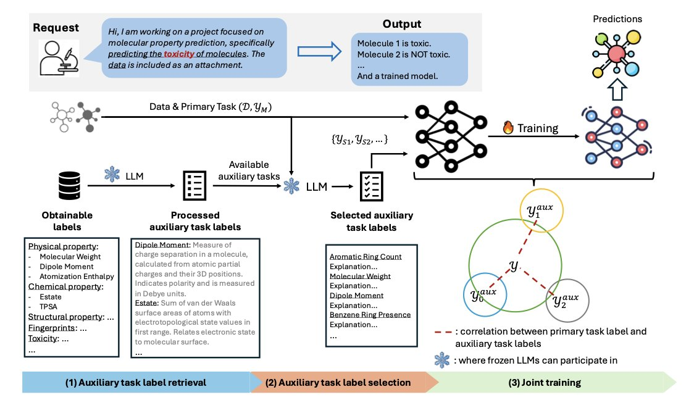
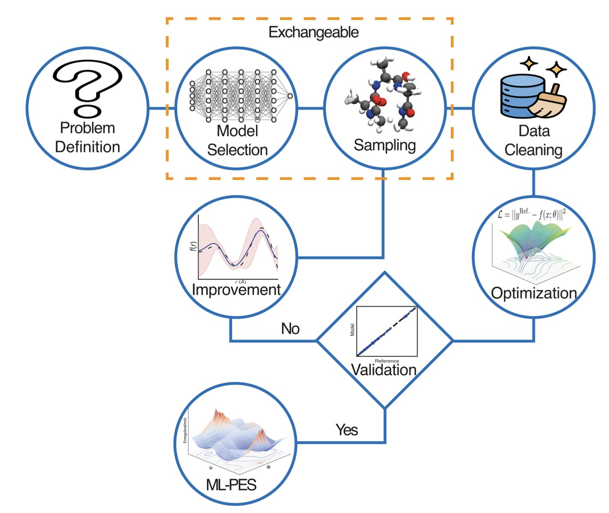
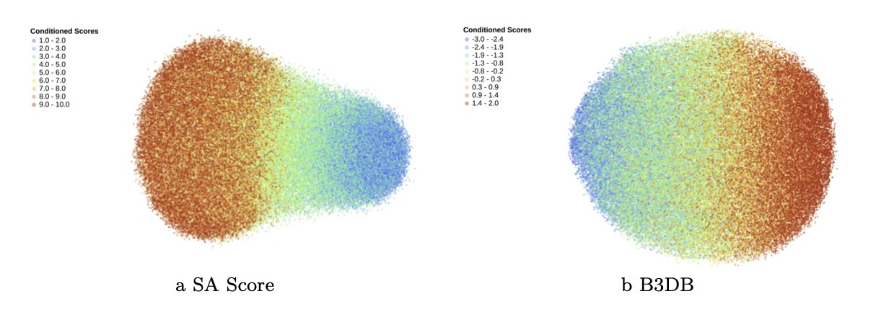
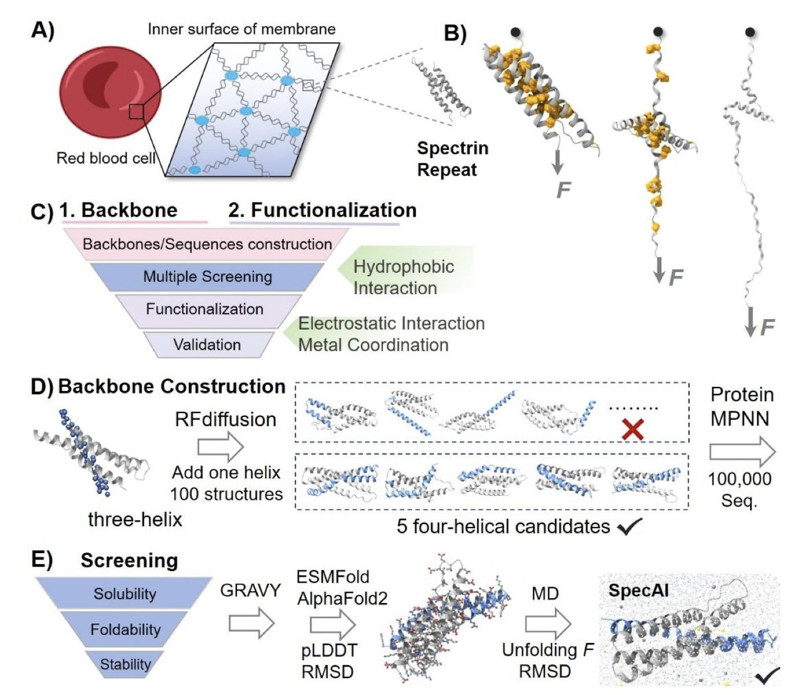
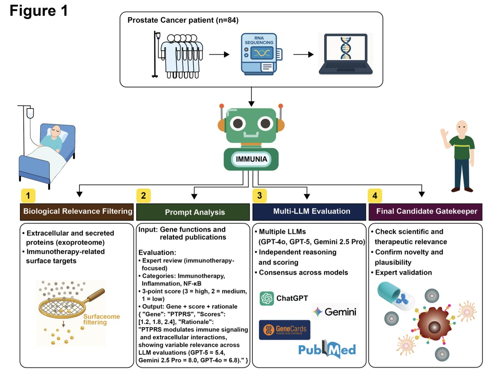

Here's the rewritten text.

---
title: "Machine Learning Potential Energy Surfaces: From Alchemy to Trustworthy Molecular Dynamics"
description: |
  A practical guide from researchers in Basel and Berlin on how to turn the construction of Machine Learning Potential Energy Surfaces (ML-PES) from a 'black box' process into a rigorous scientific practice. The article covers model selection (like SchNet, MACE), best practices for data handling (such as using 64-bit double precision), and how transfer learning with a small amount of high-accuracy data can significantly improve simulation accuracy. It offers a clear roadmap for computational chemists to build stable and reliable molecular dynamics models.
date: "2025-11-16"
categories: ["Machine Learning Potential Energy Surfaces", "ML-PES", "Molecular Dynamics", "Computational Chemistry", "Transfer Learning"]
image: "post_all_image/design_assessment_2025_11_09_image_1.jpg"
image-alt: |
  A diagram shows the key steps and considerations in building a machine learning potential energy surface. On the left, a title 'ML-PES: Best Practices' is followed by three core stages: Data Generation & Curation, Neural Network Model Training, and Evaluation & Application. On the right is a complex molecular structure, representing the subject of a molecular dynamics simulation. The image illustrates that building a reliable ML-PES requires a systematic approach and attention to detail to achieve accurate molecular simulations, as discussed in the article.
toc-depth: 3
---

## Table of Contents
1. The AUTAUT framework uses a large language model to automatically select and weigh auxiliary tasks, addressing the challenge of limited molecular data and improving the accuracy of molecular property prediction.
2. A paper from researchers in Basel and Berlin provides a roadmap for building reliable Machine Learning Potential Energy Surfaces (ML-PES), emphasizing model selection, data handling, and training details. The goal is to transform this process from a "black box" operation into a rigorous scientific practice.
3. The STAR-VAE model combines a Transformer and LoRA to pre-train on large-scale molecular data, then fine-tunes quickly with a small dataset to achieve controllable and efficient molecule generation.
4. Researchers have combined AI deep learning with chemical engineering principles to successfully transform fragile protein α-helical structures into extremely stable molecular scaffolds.
5. The IMMUNIA framework uses multiple large language models for collaborative reasoning, successfully identifying promising new immunoregulatory targets like PTPRS, VCAN, and MXRA5.

## 1. AI Automatically Selects Auxiliary Tasks to Improve Molecular Property Prediction
  
  

A common problem in drug discovery is the scarcity of labeled molecular data. To solve this, researchers often introduce "auxiliary tasks" to help models learn more. But figuring out which tasks are helpful, which are distracting, and how to balance them with the main task usually takes a lot of experience and trial-and-error.
  
The AUTAUT framework automates this process using a Large Language Model (LLM).
  
**How It Works**
  
First, the LLM scours the web for a large number of potentially relevant tasks. Then, through a multi-step prompting process, it evaluates and filters these down to the ones most relevant to the main task. This saves researchers the time of doing it manually.
  
Next, AUTAUT integrates the selected auxiliary tasks into the training workflow and uses a dynamic weighting strategy. This strategy adjusts the weight of each auxiliary task in real-time during training, ensuring its knowledge helps the main task and avoids "negative transfer."
  
**The Results**
  
Researchers tested AUTAUT on several public datasets for both classification and regression tasks in molecular property prediction. The results showed that AUTAUT outperformed top-tier molecular property prediction models and also surpassed methods that require manual selection of auxiliary tasks.
  
The value of this method is that it improves prediction accuracy while being easier to use. Non-experts in machine learning can use the framework to let an AI automatically find the best auxiliary tasks for their molecular property prediction work, helping to speed up drug discovery. This offers a practical new way to use AI to address data scarcity.
  
📜**Title**: Automatic Auxiliary Task Selection and Adaptive Weighting Boost Molecular Property Prediction  
🌐**Paper**: https://openreview.net/pdf/11a8ed826be6d6df5e5a8a128cc0a9e04172688e.pdf  

## 2. Machine Learning Potential Energy Surfaces: From Alchemy to Trustworthy Molecular Dynamics
  
  

When people talk about AI disrupting pharma, computational chemists on the front lines are thinking about more specific questions: How can machine learning (ML) actually solve our problems? A paper from a team of researchers in Basel and Berlin offers a practical guide for building stable and reliable Machine Learning Potential Energy Surfaces.
  
The paper reads like a recipe, guiding you through every step from data generation and neural network architecture selection to final validation and deployment.
  
The paper stresses that there is no one-size-fits-all model. Whether you choose SchNet, MACE, or ANI depends on the problem you're trying to solve. If you have a large system and need speed, some models are better. If you need to accurately describe the many-body interactions of a chemical reaction, you need a higher-precision model. It all depends on your data budget; you don't need a sledgehammer to crack a nut.
  
The article also offers a practical tip: use 64-bit double precision when training your models. Many GPUs default to 32-bit single precision for speed, but the researchers found that the force fields calculated by single-precision models have flaws. In NVE simulations where precise energy conservation is critical, these models quickly fall apart. The difference of a single line of code can save months of re-running simulations.
  
When it comes to data handling, the authors are as rigorous as crystallographers. They point out that about 10% of raw quantum chemistry calculation data is unreliable and must be filtered out, especially outliers involving multi-reference states. This data cleaning is fundamental to ensuring model stability.
  
The most exciting parts of the paper are two case studies. In the first, they built a PhysNet potential energy surface for the tripeptide alanine-lysine-alanine (Ala-Lys-Ala) using only 17,000 data structures. The results showed that the model was better at predicting the peptide's conformational equilibrium than the classic CGenFF force field.
  
The second case demonstrates the power of transfer learning. To accurately simulate proton transfer in GC/AT base pairs within a DNA double helix, the researchers took a base model and added just 2,300 data points calculated at the MP2 level. This brought the accuracy of the key energy barrier up to the level of expensive CCSD(T) calculations. This means it's possible to simulate biochemical processes that depend on quantum tunneling, which were previously out of reach, at a relatively low cost.
  
Finally, the researchers challenge the entire field: Can we develop new methods for Uncertainty Quantification (UQ) that accurately assess model uncertainty without a major increase in computational cost? Can we fine-tune "foundation models" to perform millisecond-scale protein folding simulations with CCSD(T)-level accuracy? The race is just getting started.
  
📜**Title**: Design, Assessment, and Application of Machine Learning Potential Energy Surfaces  
🌐**Paper**: https://arxiv.org/abs/2511.00951  
💻**Code**: https://github.com/MMunibas/practice  

## 3. STAR-VAE: Using a Transformer and LoRA for Efficient Generation of New Molecules
  
  

Developing new drugs is like searching for a specific planet in a vast universe; the chemical space is enormous. Traditional generative models often produce invalid structures or rely on huge amounts of labeled data that are hard to get in the real world.
  
The STAR-VAE model offers a solution. It first has the model learn broadly, then trains it for specific tasks.
  
**Step 1: Large-Scale Pre-training**
  
The model first learned the "language rules" of 79 million molecules. These molecules were represented using SELFIES, which guarantees that any combination the model generates will result in a chemically valid molecule, avoiding basic errors like incorrect atom valencies.
  
The model's architecture includes a Transformer encoder and an autoregressive Transformer decoder. The encoder compresses an input molecule into a mathematical vector, its representation in the Latent Space. The decoder then reconstructs the molecule from this vector. The process is similar to machine translation and is designed to give the model a deep understanding of molecular structure.
  
**Step 2: Fast Fine-Tuning with a Small Amount of Data**
  
The pre-trained model already has general knowledge, but drug discovery requires an "expert" that can generate molecules with specific properties, like high affinity for a certain protein target. This requires fine-tuning.
  
Traditional fine-tuning requires updating all of the model's parameters, which is computationally expensive and needs a lot of labeled data. STAR-VAE introduces Low-Rank Adaptation (LoRA). LoRA acts like a lightweight "plug-in." During fine-tuning, only these plug-ins are trained, while the main model's parameters stay fixed.
  
The advantage of this approach is that it's fast and requires less data. It's like an experienced chef who gets a new recipe; they only need to adjust a few key steps to master the new dish, rather than learning to cook from scratch.
  
**How well does it work**?
  
On standard molecule generation benchmarks like GuacaMol and MOSES, STAR-VAE's performance was on par with existing top models.
  
Its performance was even better in conditional generation tasks. In the Tartarus protein-ligand design test, the model was asked to generate molecules that bind more tightly to a target protein. The results showed that the distribution of docking scores for molecules generated by the fine-tuned STAR-VAE shifted significantly toward higher scores, proving that the model successfully learned to optimize molecular properties.
  
The model's design is practical. It combines large-scale unsupervised learning with efficient supervised fine-tuning, solving the core problem of "expensive and scarce data" in drug discovery. This allows frontline researchers to explore and optimize lead compounds more quickly, putting AI to practical use in drug development.
  
📜**Title**: STAR-VAE: Latent Variable Transformers for Scalable and Controllable Molecular Generation  
🌐**Paper**: https://arxiv.org/abs/2511.02769v1  

## 4. AI and Chemistry Combine to Create Unprecedentedly Stable Proteins
  
  

In the world of proteins, the α-helix is a common structure, but it's not very sturdy. A slight disturbance or a bit of heat can cause it to fall apart, which is a problem for drug development and biomaterial design.
  
A team of researchers has developed a new method that combines artificial intelligence (AI) and chemical engineering to address this. They first use AI to design a robust protein backbone, then use chemistry to add multiple "locks" to it.
  
Here's how it works: First, the researchers used AI tools like RFdiffusion and ProteinMPNN to design a four-helix bundle structure, which is more stable than a single helix. Then, through molecular dynamics simulations, they screened for candidate designs that remained stable under extreme virtual conditions, like high temperature and pressure.
  
The experimental results confirmed that these AI-optimized protein backbones are incredibly tough. They could only be pulled apart by a mechanical force of over 200 piconewtons (pN), a point at which normal α-helical proteins would have long since unraveled. They also remained stable at temperatures above 100°C and were highly resistant to chemical denaturants.
  
To make them even stronger, the researchers brought in chemical engineering. Using AI like AlphaFold3, which can accurately predict protein structures, they introduced chemical bonds like salt bridges and metal coordination sites at key positions in the protein. This added more internal connections, increasing overall stability.
  
This layered strategy, from AI-driven macro-design to chemical micro-tuning, is very efficient. It allows researchers to quickly screen millions of virtual designs down to a few top candidates for lab validation, shortening the development cycle. This paves the way for developing new biomaterials, drug delivery vehicles, and even tiny molecular machines.
  
📜**Paper**: Transforming a Fragile Protein Helix into an Ultrastable Scaffold via a Hierarchical AI and Chemistry Framework  
🌐**Paper**: https://www.biorxiv.org/content/10.1101/2025.11.03.686355v1  

## 5. IMMUNIA: An AI Agent for Discovering New Immunotherapy Targets
  
  

How to use large language models for reliable scientific reasoning has been a challenge in biomedicine. A preprint paper introduces a new method called IMMUNIA, which organizes multiple different large language models to work together like a committee of experts, specifically to find new immunotherapy targets.
  
A single model can have biases in its knowledge or reasoning. IMMUNIA has multiple models, such as GPT-4 and Claude, simultaneously analyze vast amounts of literature and molecular data. It then cross-validates the results to reach a consensus, improving the reliability of the conclusions.
  
The researchers first set the rules through structured prompting, instructing the models to focus on genes related to immunotherapy, inflammatory responses, and the NF-κB signaling pathway. This gave the models a clear scope for their search, preventing aimless analysis.
  
To test IMMUNIA's reliability, the researchers benchmarked it with known immunoregulatory genes (positive controls) and unrelated genes (negative controls). The results showed that IMMUNIA could accurately tell them apart, proving its reasoning was effective.
  
Among the high-confidence candidate genes identified, PTPRS, VCAN, and MXRA5 stood out. IMMUNIA's analysis suggested that they might act like immune checkpoints in the stromal cells of the tumor microenvironment, helping tumors evade the immune system.
  
While we are familiar with PD-1/PD-L1, which primarily acts on T cells, these new targets could open up new ways to regulate the immunosuppressive functions of stromal cells.
  
The IMMUNIA framework is flexible. Researchers can adjust the prompts for different cancer types, allowing it to focus on specific biological questions. This customizability gives it the potential to become a universal target discovery tool across different cancers.
  
This work shows how to harness large language models to extract valuable scientific insights from massive amounts of information.
  
📜**Title**: IMMUNIA: A Multi-LLM Reasoning Agent for Immunoregulatory Surfaceome Discovery  
🌐**Paper**: https://www.biorxiv.org/content/10.1101/2025.11.02.686138v1
