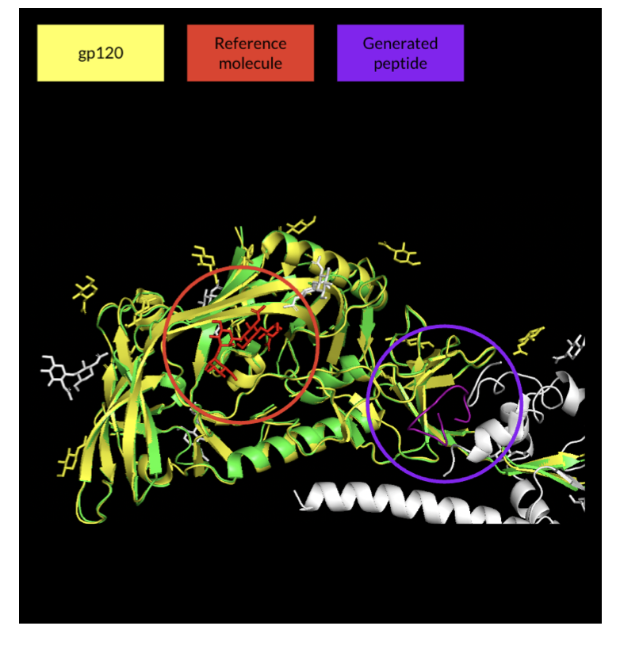
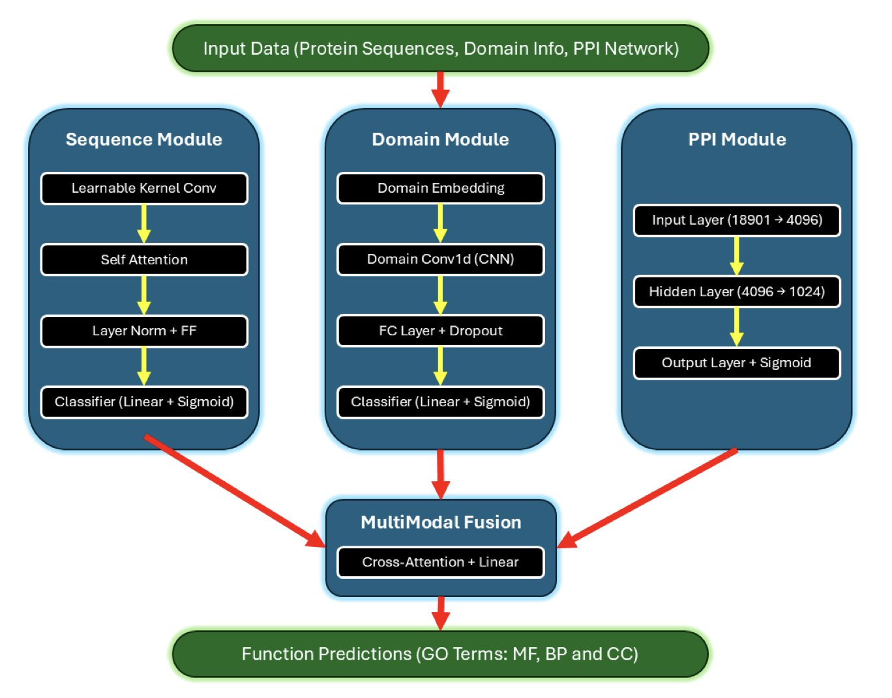
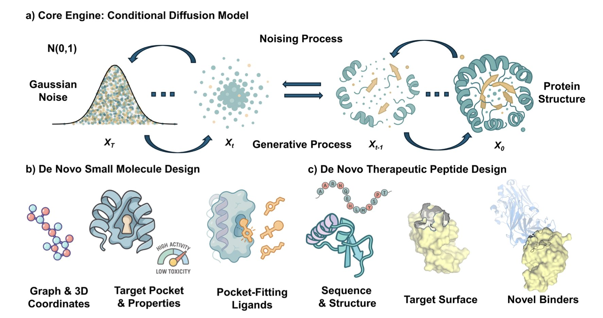
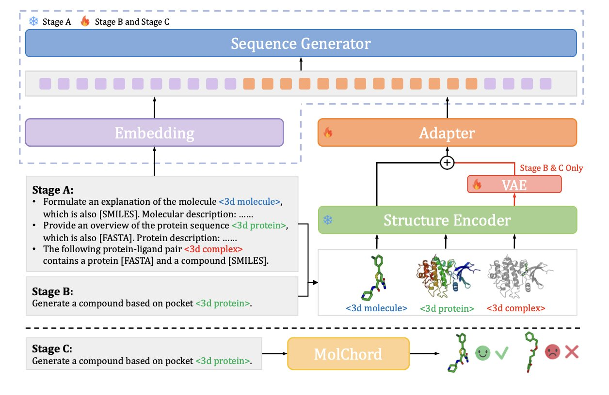
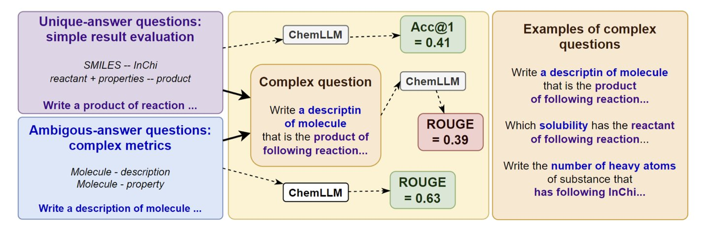

## Table of Contents
1. Researchers "tamed" AlphaFold by introducing custom loss functions and spatial constraints, achieving high-precision design of cyclic peptides for HIV targets.
2. The new model MkAtt-SDN2GO combines multi-kernel convolution and attention mechanisms to predict protein functions more accurately, providing a new tool for functional genomics.
3. Diffusion models are changing small molecule and peptide drug discovery. Challenges remain, but they have the potential to shift drug discovery from "finding a needle in a haystack" to "precision creation."
4. The MOLCHORD framework improves AI's performance in drug design through structure-sequence alignment, offering a new tool for developing molecules with high affinity, diversity, and drug-like properties.
5. Existing large chemical language models perform poorly on multi-step reasoning tasks, revealing their reliance on surface pattern matching rather than true chemical understanding.

## 1. Tuning AlphaFold: Precisely Designing Cyclic Peptides to Hit HIV Targets

Cyclic peptides are a favorite in the world of drug discovery. Their chemical properties fall somewhere between small molecules and antibodies. They can target protein-protein interaction (PPI) interfaces that are tough for traditional small molecules to handle, and they are smaller than antibodies, making them better drug candidates. But designing a cyclic peptide that binds precisely to a specific target is very difficult.

After AlphaFold came out, many people tried to use it for inverse protein design, and cyclic peptides were part of that effort. The basic idea is to give the model a target and a random sequence and let it predict a structure that can bind. This approach is like throwing darts blindfolded—luck plays a big role. When faced with a complex target like HIV's gp120, the generated peptides were often low-confidence, useless structures that also failed to hit the intended binding site.

The authors of this study decided to put a bridle on this "wild horse," AlphaFold, to make it work in a directed way.

The first step was to **define a bullseye**. Using a method called "proximity-based hotspot mapping," they directly marked the target for the model on the vast surface of gp120—a few key amino acids in the CD4 binding site. This set a clear target for the generation process.

With a bullseye in place, they still needed to keep the peptide chain in the target area. To do this, they introduced **centroid distance penalization**. This mechanism acts like a rubber band connecting the geometric center of the cyclic peptide to the center of the target. If the peptide generated by the model strays from the target, the rubber band stretches, creating a penalty signal. To reduce the penalty, the model has to pull the peptide back into the correct position.

After controlling the position and conformation, the next step was to **optimize binding ability**. The researchers developed several custom loss functions, such as the pDockQ score and logIF. pDockQ assesses docking quality, while logIF calculates the contact area between the peptide and the target. These functions tell the model: don't just stay in the right place, bind tightly. At the same time, they increased the weight of pLDDT (AlphaFold's confidence score) in the total loss function to emphasize that the model should only output high-quality, high-confidence structures.

Finally, the optimized model, which integrated all these strategies, successfully generated multiple high-confidence cyclic peptides. The structures of these peptides were similar to a known reference molecule, BMS-818251, and they fit precisely into the CD4 binding site of HIV. This shows that with precise engineering, AlphaFold can become an effective tool for cyclic peptide design.

The researchers also mentioned future directions, such as applying these methods to AlphaFold3 or introducing disulfide bonds to stabilize the peptide structures. This approach of applying precise constraints to an AI model opens up new paths for computer-aided drug design.

📜Title: Precision Design of Cyclic Peptides using AlphaFold  
🌐Paper: https://arxiv.org/abs/2510.13127v1  
💻Code: Not available

## 2. Deep Learning Predicts Protein Function, New Model Boosts Performance by 14.8%

Predicting protein function is a core challenge in bioinformatics. We have vast amounts of protein amino acid sequences, like countless instruction manuals written in an unknown language. The task is to figure out what they do. The deep learning model MkAtt-SDN2GO brings a new approach to this task.

The model's core features are multi-kernel convolution and an attention mechanism.

Multi-kernel convolution solves the problem of a fixed field of view in traditional convolutional networks. Functional motifs on a protein sequence vary in length, and a fixed window can easily miss information. MkAtt-SDN2GO's multi-kernel convolution layer learns to scan the sequence with "windows" of different sizes, allowing it to capture key patterns of various lengths. This is like a detective examining a scene with lenses of different focal lengths to ensure no clue is missed.

The attention mechanism helps the model understand the collaborative nature of protein function. A protein's function depends on coordination between different parts of its own sequence and its interactions with other proteins (Protein-Protein Interaction, PPI). MkAtt-SDN2GO uses two types of attention mechanisms:
1.  **Self-attention**: This captures long-range dependencies between amino acids within the protein sequence, which is critical for understanding which regions interact after the protein folds.
2.  **Cross-attention**: This merges information from different sources like the sequence, protein domains, and PPI networks. If one data source is incomplete or noisy, the model intelligently reduces its weight and relies more on reliable information. This is like a team making a decision where more capable members have a greater say to ensure the quality of the outcome.

In benchmark tests, MkAtt-SDN2GO improved the F-max score for Molecular Function (MF) prediction by 14.8% compared to its predecessor, SDN2GO. It also ranked among the top performers for Biological Process (BP) and Cellular Component (CC) predictions.

These results show that we have a more accurate tool for predicting the roles of unknown proteins in the cell. This can speed up functional genomics research and provide clues for discovering new drug targets and understanding disease mechanisms.

📜Title: MkAtt-SDN2GO: Multi-kernel Attentive-SDN2GO Network for Protein Function Prediction in Humans  
🌐Paper: https://www.biorxiv.org/content/10.1101/2025.11.02.686093v1

## 3. AI-Generated Molecules: New Opportunities for Diffusion Models in Drug Discovery

A recent review on the use of Diffusion Models in drug discovery systematically compares their application in two areas: small molecules and therapeutic peptides. This provides a unique perspective.

In small molecule drug development, diffusion models excel at structure-based drug design. The models can precisely design molecular structures that fit perfectly into the "pockets" of specific protein targets. Given a target structure, they can generate a large number of candidate molecules while simultaneously optimizing physicochemical properties like solubility or membrane permeability. This is like custom-making a key rather than searching through countless existing keys. However, the molecules generated by these models are often difficult to synthesize in reality. A current bottleneck is figuring out how to make AI consider synthesizability while creating new molecules.

The situation is different for therapeutic peptides. Designing peptide drugs requires generating a functional amino acid sequence and designing a 3D structure that folds correctly. So, diffusion models face the dual task of generating a sequence and designing a structure. The challenges here are more complex. For instance, the generated peptide must remain stable in the body to avoid degradation, fold into a specific 3D shape to function, and avoid triggering an immune response.

Although the challenges differ for small molecules and peptides, they also share common problems. First, there is a scarcity of high-quality experimental data. AI models rely on large amounts of data for training, but biological experimental data is expensive and time-consuming to acquire, limiting model performance. Second, scoring functions are not accurate enough. Current evaluation methods cannot perfectly judge the quality of AI-generated molecules. Finally, all computer-designed candidates must be validated by experiments. Building an efficient automated experimental platform to create a rapid "Design-Build-Test-Learn" (DBTL) loop is key to whether this technology will succeed.

By integrating diffusion models into an automated DBTL cycle, drug discovery could become a highly targeted process of precisely creating new therapies.

📜Title: Diffusion Models at the Drug Discovery Frontier: A Review on Generating Small Molecules versus Therapeutic Peptides  
🌐Paper: https://arxiv.org/abs/2511.00209v1

## 4. MOLCHORD: Guiding Drug Design with Structure-Sequence Alignment

Drug discovery is about finding small molecules that can bind to specific protein targets. Traditional screening methods are not very efficient, and AI offers more precise tools. But getting AI to understand the 3D structure of a protein and the chemical sequence of a small molecule, and then match them accurately, has always been a challenge. The MOLCHORD framework has made a breakthrough here.

MOLCHORD first uses a diffusion-based structure encoder to analyze the 3D structural information of a protein, capturing the detailed features of the target's pocket. Then, an autoregressive sequence generator uses the information learned from the protein structure to build the most likely molecular sequence that will bind to it.

This process aligns the geometric features of the protein with the sequence features of the molecule in the same dimension, achieving a "structure-sequence" unity.

To ensure the generated molecules have good drug-like properties, the researchers introduced Direct Preference Optimization (DPO) technology. They fine-tuned the model on a high-quality dataset, teaching it how to generate molecules that not only bind more strongly but also maintain good drug-likeness and structural diversity. This allows the model to design molecules that bind tightly to the target while avoiding the generation of byproducts that lack therapeutic potential.

Test results on the CrossDocked2020 dataset showed that the molecules generated by MOLCHORD were superior to existing methods in terms of binding affinity, design success rate, and generalization ability. It can provide reliable design solutions even for new targets not seen during training, which is valuable in drug development.

📜Paper: *MOLCHORD: Structure-Sequence Alignment for Protein-Guided Drug Design*  
🌐Link: https://arxiv.org/abs/2510.27671v1

## 5. Chemical Large Language Models Stumble: Two Steps Are Too Many

In chemical research, problems are rarely solved in a single step. Usually, A leads to B, and B leads to C. For example, first you predict the product of a chemical reaction, and then you predict the biological activity of that product. This ability to chain together multiple independent reasoning steps to solve a complex problem is called compositionality, and it is crucial for fields like drug discovery and materials science.

How do Chemical Large Language Models (ChemLLMs) perform at this? A recent paper introduced a new benchmark called STEP to specifically test the compositional reasoning abilities of these models. The benchmark's design is straightforward: it combines standard single-step chemistry tasks, like predicting reaction products or describing molecular properties, into two-step problems.

The results, as the paper's title "Two Steps from Hell" suggests, were not good. Even models that performed well on single-step tasks saw their performance collapse when faced with a compositional task that required two consecutive steps of thinking.

This indicates that these models likely haven't grasped the underlying principles of chemistry. Instead, they act more like a student who solves single-step problems by memorizing patterns from training data. When faced with a new problem that requires connecting two pieces of knowledge, they fail. For example, a model might know that reaction A produces product B, and it might also know that molecule B' has a certain property. But when asked, "What is the property of the product from reaction A?", it cannot link these two steps together.

The study also found that the diversity of pre-training data is important. Models trained on a broad range of scientific literature showed better generalization than those trained only on specific chemical datasets. However, even fine-tuning on compositional tasks provided only limited improvement. This suggests that getting models to learn logical reasoning instead of simply memorizing surface patterns may require new model architectures or training strategies.

📜Title: Two Steps from Hell: Compositionality on Chemical LMs  
🌐Paper: https://aclanthology.org/2025.findings-emnlp.55.pdf
