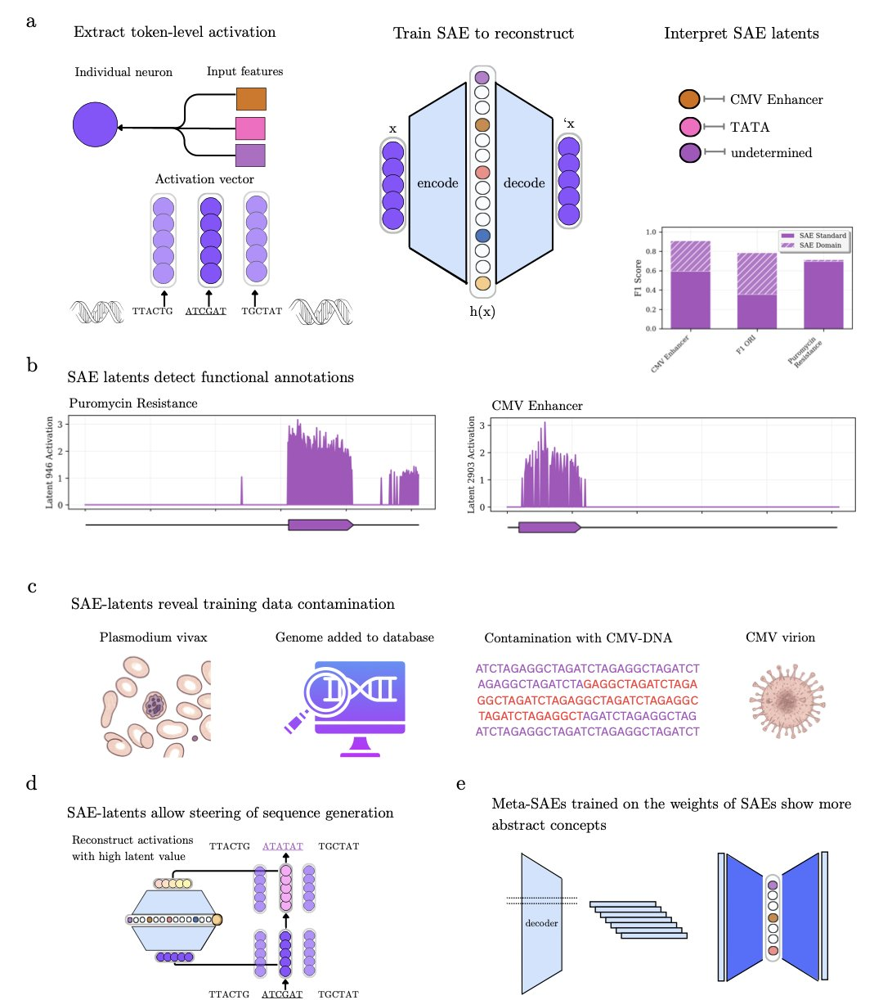
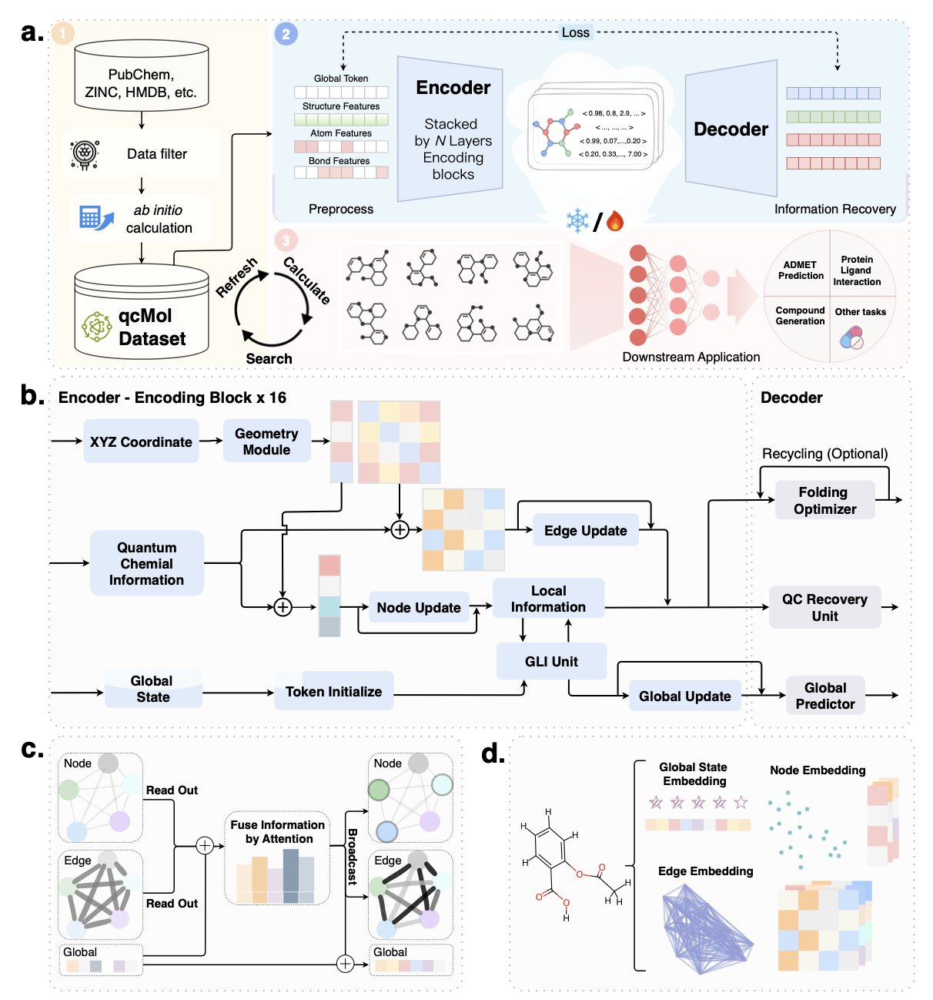
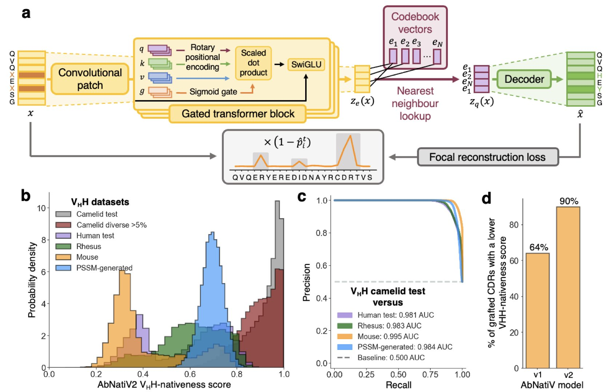
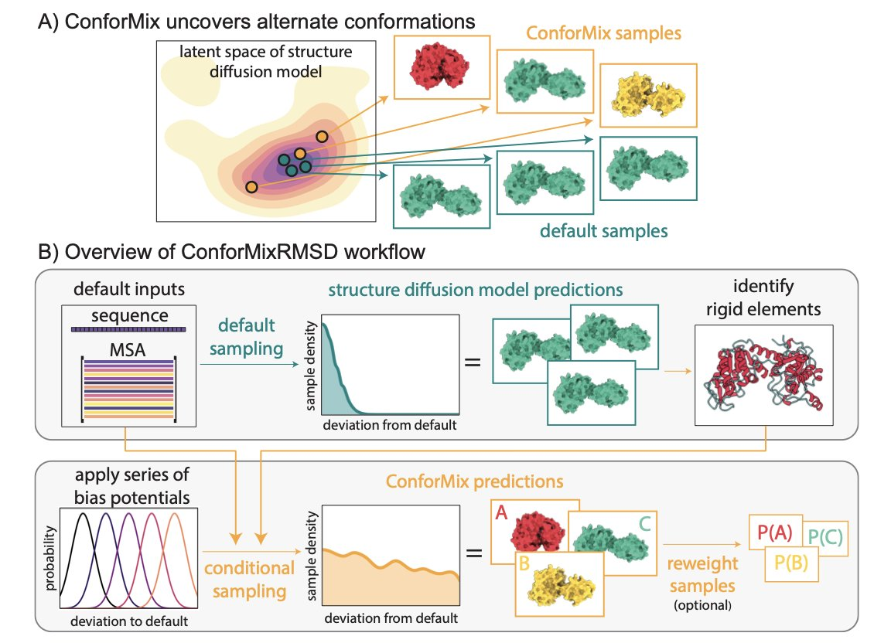
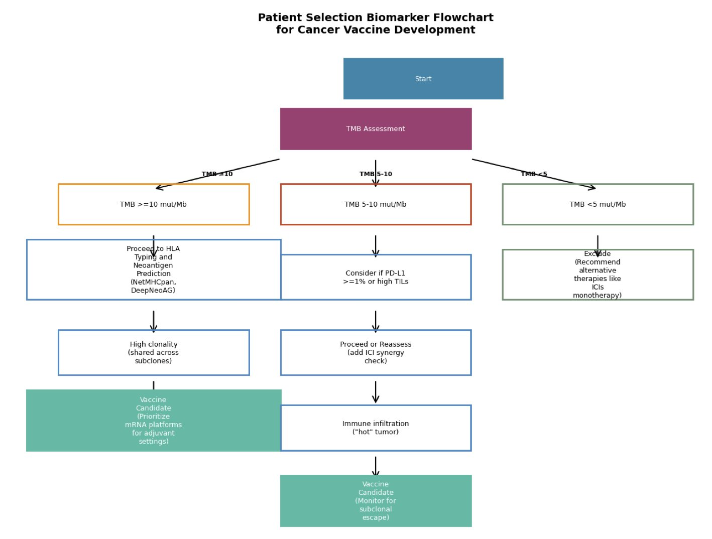

## Table of Contents
1. Sparse Autoencoders (SAEs) can dissect, audit, and steer genomic large language models, improving AI transparency.
2. qcGEM integrates quantum chemistry information into graph neural networks, creating more accurate and interpretable molecular representations. It outperformed existing models in 71 tasks, offering a new direction for AI drug discovery.
3. AbNatiV2 is an AI model that assesses the "nativeness" and pairing likelihood of antibody sequences, helping scientists design more stable and effective antibody drugs.
4. Researchers at Stanford developed the ConforMix algorithm. It guides AI diffusion models at the inference stage to efficiently explore hidden conformational states of biomolecules without retraining the model.
5. A study proposes the "Algorithm-to-Outcome Concordance" (AOC) metric to quantify the consistency between AI-predicted tumor neoantigens and clinical outcomes in cancer immunotherapy.

## 1. Decoding Genomic Large Language Models: Seeing Inside AI's "Brain" with Sparse Autoencoders

The genomic language models we train are getting more powerful, but how they make decisions is often a black box. A new study offers a "scalpel" to dissect their inner workings: sparse autoencoders.

The method, called Decode-gLM, works like this: an encoder compresses the model's complex neural activity into a few key features, and a decoder then uses these features to rebuild the original activity. To purify the features, the researchers added a sparsity constraint, forcing the encoder to select only the most important information.

The results show that the SAE model automatically learned over 100 features with clear biological meaning from the genomic model, without human supervision. These features include "signatures" for promoters, enhancers, and specific gene families. It acts like a translator, turning the computer's binary language into a genetic language that biologists can understand.

With this "translator," we can thoroughly audit the model. The researchers found a feature strongly related to the Cytomegalovirus (CMV) enhancer, even though viruses were explicitly excluded from the training data. Tracing it back, they discovered the human reference genome database was contaminated with viral sequences. Without SAEs, this kind of hidden data leakage might never have been found.

The researchers also trained a "Meta-SAE" on top of these features to explore how they relate to each other. The results showed that several independent features related to the Human Immunodeficiency Virus (HIV) were linked by a single, higher-level abstract feature. This suggests the model not only identifies individual genetic elements but is also starting to understand the biological processes where they work together.

This "scalpel" can also directly manipulate the model. The researchers identified a feature linked to antibiotic resistance. By "enhancing" it, they successfully guided the model to locate a known aminoglycoside resistance mutation on the 16S rRNA gene. This is like directly telling the AI: "Go look for resistance mutations in that direction."

Decode-gLM brings sparse autoencoders to genomics, allowing us to interpret, audit, and even steer these complex AI models. This greatly increases our trust in them. For developers, this isn't just a technical step forward. It marks the start of a new era where we can work alongside AI, not just use it as a black box tool.

📜Title: Decode-gLM: Tools to Interpret, Audit, and Steer Genomic Language Models
🌐Paper: https://www.biorxiv.org/content/10.1101/2025.10.31.685860v2.full.pdf

## 2. A New Step in AI Drug Discovery: qcGEM Blends Quantum Chemistry to Reshape Molecular Representation

In AI-aided drug discovery, a central problem has always been how to accurately describe a molecule to a computer. Traditional methods, like fingerprints or simple graph structures, focus mainly on how atoms are connected. But this is not enough. A molecule's actual behavior is determined by complex physicochemical properties, such as its 3D shape and electron cloud distribution.

A new method called qcGEM tries to solve this problem from the ground up. It feeds detailed information from quantum chemistry calculations into the model. It's like giving the model a high-resolution "snapshot" of the molecule's physical properties, telling it deep information that goes beyond simple connections.

The core idea of qcGEM is to combine localized quantum descriptors with the molecule's 3D geometry to build a more informative molecular graph. The model learns from this quantum chemistry data during a pre-training phase. This allows the molecular embeddings it generates—a compact mathematical format computers can understand—to naturally carry physicochemical "genes." A molecule's representation is thus transformed from a flat connection diagram into a three-dimensional entity with electron-cloud coloring.

The benefits of this approach were proven in testing. The paper's data shows that qcGEM systematically beat 29 existing methods, including 2D, 3D, and pre-trained models, across 71 different tasks. These tasks cover key challenges in drug development, from predicting molecular solubility and identifying "activity cliffs"—where a tiny structural change causes a dramatic shift in activity—to simulating protein-ligand interactions.

A highlight of qcGEM is its interpretability. For example, it can accurately tell apart a pair of stereoisomers that differ only in their 3D shape. To a traditional model, these two molecules might look identical. But qcGEM can capture this subtle difference. In the body, such differences often determine a drug's effectiveness and even its safety.

The team also considered computational efficiency. They introduced a lightweight version, qcGEM-Hybrid. This version maintains high accuracy while significantly increasing calculation speed, making large-scale virtual screening practical. Researchers can first use it to quickly screen millions of molecules for potential candidates and then use the full qcGEM model for detailed analysis.

The thinking behind qcGEM reminds us that AI models should be built on solid principles of physics and chemistry. Incorporating first-principles knowledge, like quantum chemistry, into data-driven models may be the key to advancing AI in drug discovery.

📜Title: qcGEM: a graph-based molecular representation with quantum chemistry awareness
🌐Paper: https://www.biorxiv.org/content/10.1101/2025.11.02.686183v1

## 3. AbNatiV2: Using AI to Judge an Antibody's "Naturalness"

When developing antibody drugs, a common problem is that carefully designed molecules can be unstable or get cleared by the immune system. This often happens because their sequences are too different from natural antibodies. AbNatiV2 is a tool that can assess the "nativeness" of a sequence ahead of time to reduce later trouble.

The model uses deep learning, trained on a massive dataset of real antibody sequences, to learn the features of a "natural antibody." The researchers expanded the training data to over 20 million sequences, including those from humans and alpacas. This improves the model's ability to evaluate various antibodies, especially nanobodies.

AbNatiV2's technology was also upgraded with two new techniques: rotary positional embeddings and focal reconstruction loss. The first helps the model better understand long-range interactions between amino acid residues. The second prevents the model from being biased by common sequence patterns, making its assessments more objective.

The researchers also released a paired model, p-AbNatiV2. A traditional antibody is made of a heavy chain (VH) and a light chain (VL), which must pair correctly to function. But in many cases, researchers may only have information for one chain or be unsure if the two chains are a match. p-AbNatiV2 uses a cross-attention mechanism, allowing the model to consider information from the other chain when evaluating one, to judge if they are a good pair. Experiments show its pairing prediction is better than existing tools.

For drug developers, AbNatiV2 is a powerful tool, whether they are screening candidate molecules, optimizing existing antibodies, or designing new ones from scratch. It helps researchers rule out non-ideal sequences early, so they can focus resources on the most promising molecules. The team has made the web tool and source code available for researchers to use.

📜Title: Deep learning assessment of nativeness and pairing likelihood for antibody and nanobody design with AbNatiV2
🌐Paper: https://www.biorxiv.org/content/10.1101/2025.10.31.685806v1
💻Code: https://gitlab.developers.cam.ac.uk/ch/sormanni/abnativ

## 4. ConforMix: Unlocking Hidden Biomolecular Shapes at AI Inference Time

Computer-Aided Drug Design (CADD) faces a challenge: proteins are not rigid. They are like flexible machines that change shape to perform their functions. The pockets where drugs need to bind are often closed, opening up only in specific conformations. These are called "cryptic pockets." Molecular Dynamics (MD) simulations can capture these dynamic processes, but they are computationally expensive. Simulating a few hundred nanoseconds can take days or weeks.

AI, particularly Diffusion Models, has offered a new way to predict protein structures. These models can generate 3D structures of molecules, but they typically produce only the most stable and common shapes. It's like asking an AI to draw a cat, and it always draws one sleeping. We want to see it jumping and hunting. The rare but functionally important shapes get ignored.

Researchers at Stanford developed the ConforMix algorithm to address this. It doesn't require retraining massive diffusion models. Instead, it guides them as they generate structures, a process known as inference.

ConforMix works using a "classifier guidance" technique. As the model generates a conformation, the algorithm constantly checks how different the new shape is from a known default shape. This difference is measured by Root Mean Square Deviation (RMSD). If the new and old shapes are too similar, the algorithm "pushes" the model to explore in a different direction.

The researchers applied this algorithm to an existing diffusion model (BioEmu) and significantly improved the efficiency of finding new conformations. For rare shapes already confirmed by experiments, ConforMix discovered them more effectively than traditional sampling methods. It can also quickly estimate the free energy difference between different conformations, which helps in understanding how difficult it is for the shape to change.

The algorithm is broadly applicable and can handle proteins, multi-protein complexes, and RNA. Whether for studying enzyme catalysis mechanisms or designing drugs that target allosteric sites, ConforMix can help. It can even be combined with models like AlphaFold 3, allowing them not just to predict static structures but also to show how molecules change dynamically. This "plug-and-play" feature lets scientists immediately apply the technology to explore new opportunities hidden in the dynamic movements of molecules.

📜**Title**: Unlocking Hidden Biomolecular Conformational Landscapes in Diffusion Models at Inference Time
🌐**Paper**: https://openreview.net/pdf/dd8aa97e8cf000d81066d7d22c7bb772b167e328.pdf

## 5. AI Predictions and Clinical Outcomes: How to Quantify Their Agreement?

The development of personalized cancer vaccines faces a key question: are the "good" neoantigens predicted by AI algorithms actually effective in patients?

To quantify the relationship between predictions and treatment efficacy, researchers have proposed the "Algorithm-to-Outcome Concordance" (AOC) framework.

This framework combines three key factors into one formula: the AI model's predictive performance (AUC), the actual effectiveness of the vaccine in clinical trials (such as the hazard ratio, HR), and the variability between different clinical trials (the I² statistic). The AOC metric acts like a ruler, measuring the translational fidelity of different AI models in a real-world clinical setting.

To test the framework, the research team reviewed data from six melanoma vaccine clinical trials between 2017 and 2025. These trials covered various technology platforms, including mRNA, peptides, and dendritic cells.

The data showed that for patients with a high Tumor Mutational Burden (TMB) and a predominance of clonal neoantigens, the agreement between AI predictions and clinical outcomes was better. TMB and the clonality of neoantigens could potentially serve as biomarkers to help select patients most likely to benefit from personalized vaccines.

The study also built an economic model, which showed that if an AI model's AOC value exceeds 0.7, the corresponding personalized vaccine therapy could potentially lower the incremental cost-effectiveness ratio (ICER) to an acceptable level. This is critical for gaining market access and insurance coverage for innovative therapies.

Currently, the AOC framework is still a hypothesis-generating tool, with calculations relying on simulations or public summary data. The next step is for researchers to rigorously validate the metric using real individual patient data.

The AOC framework provides a quantifiable and reproducible standard for evaluation. It directly links the predictive power of AI algorithms with their real-world clinical translation. This helps optimize the design of personalized vaccines and also gives regulatory agencies a scientific basis for evaluating and approving such therapies.

📜Title: A Proposed Framework for Quantifying AI-to-Clinical Translation: The Algorithm-to-Outcome Concordance (AOC) Metric
🌐Paper: https://arxiv.org/abs/2510.26685v1
