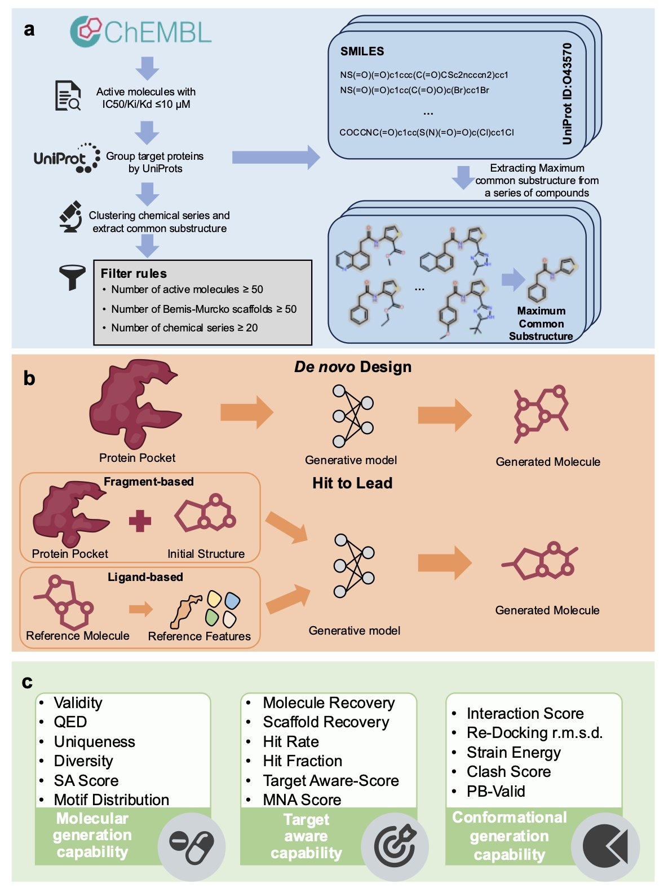
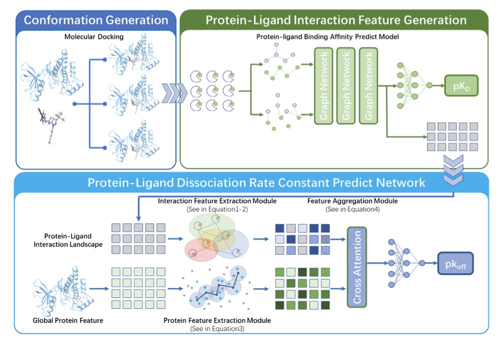
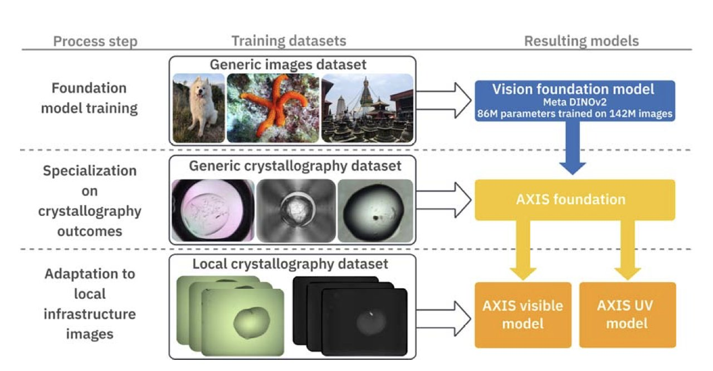
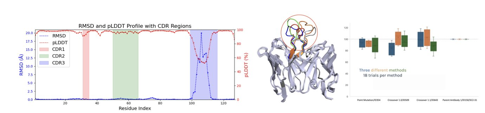
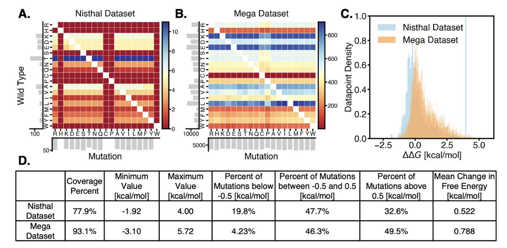

## 目录  
1. MolGenBench 揭示了当前基于结构的分子生成模型与真实药物研发需求间的巨大鸿沟，亟需更贴近实际的评估标准和模型设计。
2. STELLAR-koff 模型通过分析药物分子在靶点口袋中的多种构象，能更准确地预测药物停留在靶点上的时间。
3. AXIS 系统结合 AI 与「人在环路」，能够自动精准地识别大分子晶体，解决了结构生物学的一个长期难题。
4. 这个新框架为蛋白质的不同构象分别建模，解决了 AI 抗体预测的一个核心难题：它能够区分模型的预测误差和蛋白质自身的构象变化。
5. 结合蛋白质语言模型与物理计算，可以利用两种方法相互弥补的偏见，更精准地筛选出能增强蛋白质稳定性的突变。

## 1. MolGenBench：为 AI 制药设立更严格的评估基准  
  
  

每当一个新的 AI 制药模型发布，总会伴随着漂亮的指标和图表，宣称其能设计出新颖、高活性的分子。但一线研发人员总会思考：这些模型在真实的药物发现项目中到底能发挥多大作用？最近发布的 MolGenBench 基准测试，就像一场药物发现领域的「高考」，给出了一个颇为冷静的答案。  
  
MolGenBench 的核心是建立一个更接近真实世界的评估体系。以往的基准测试，好比只考学生解几道刁钻的数学题，而 MolGenBench 则是一场综合性考试。它不仅考察模型生成全新分子的能力（`de novo design`），还引入了一个关键环节：苗头到先导化合物的优化（Hit-to-Lead, H2L）。这是药物研发中至关重要的一步，需要对一个已知的活性分子精细打磨，提升其活性、选择性等成药性。我们一直缺乏一个统一的标准来衡量模型在 H2L 场景下的表现。  
  
MolGenBench 的数据集规模很大，包含了 120 个蛋白靶点和 22 万个经过实验验证的活性分子，如同为考生提供了一套覆盖所有知识点的高质量真题库。研究者们还设计了两个新颖的评估指标：靶点感知分数（Target-Aware Score）和平均归一化亲和力分数（Mean Normalized Affinity, MNA）。前者评估模型生成的分子是否只对目标靶点有效，后者则衡量模型在优化任务中提升分子活性的实际能力。  
  
研究者们用这个新基准系统地评估了 10 种从头设计方法和 7 种 H2L 优化方法，涵盖了自回归模型、扩散模型（Diffusion Model）和贝叶斯流网络（Bayesian Flow Networks）等主流技术。  
  
结果并不乐观。  
  
在重新发现已知活性分子这个基础任务上，大多数模型表现挣扎。它们生成的分子虽然看起来新颖，但往往偏离了已知的有效化学空间。这就像建筑师设计了一堆天马行空的房子，却没几个能真正盖起来住人。  
  
模型利用蛋白结构信息的能力也有限。一个让人意外的发现是，用实验解析的晶体结构数据训练出的模型，在某些任务上比用模拟对接复合物数据训练的模型表现更好。这说明训练数据的质量至关重要，高质量的输入才能带来可靠的输出。当前的算法似乎还不能完全从模拟的、带有噪声的结构数据中提炼出有用信息。  
  
这项工作给整个领域敲响了警钟。我们不能再满足于在旧的、过于简化的基准上刷高分数。药物发现是一个复杂的系统工程，AI 工具必须在更接近真实的场景下接受检验。MolGenBench 提供了一个很好的起点，它告诉我们，未来的模型需要更强的任务导向性设计和更普适的优化能力。只有这样，AI 制药才能真正从学术概念走向临床应用的货架。  
  
📜Title: MolGenBench: A Comprehensive Benchmark for Structure-Based Molecular Generation  
🌐Paper: https://www.biorxiv.org/content/10.1101/2025.11.03.686215v1  
💻Code: https://github.com/CAODH/MolGenBench  

## 2. AI 如何预测药物与靶点的结合时长？STELLAR-koff 模型带来新思路  
  
  

药物研发不仅要评估药物分子与靶点蛋白的结合能力，还要关注其结合时长。这个时长由解离速率常数（koff）衡量，koff 越小，药物离开靶点越慢，药效可能越持久。传统计算方法通常只分析药物与靶点结合的单个静态构象，但实际上，分子在口袋中会不断运动。  
  
**从静态快照到动态影像**  
  
传统方法如同通过单张照片判断关系，而 STELLAR-koff 模型则像观看一段互动视频。它不孤立看待单个构象，而是将药物分子在蛋白口袋中的多种可能构象视为一个整体，构建出「相互作用景观 (interaction landscape)」。这个景观描绘了分子在口袋里的一系列动态构象，提供了更丰富的信息。  
  
**利用已有知识**  
  
由于高质量的 koff 数据稀少，直接训练理解这种复杂景观的模型很容易导致过拟合。研究者采用了迁移学习 (transfer learning) 策略，先用一个成熟的亲和力预测模型，将每个构象转化为机器可读的特征。这就像先教孩子认识轮子、车灯等基本部件，再教他识别整车，从而提高学习效率。  
  
**以图神经网络理解空间关系**  
  
获得所有构象的特征后，模型使用等变图神经网络 (EGNN) 处理这些信息。EGNN 擅长理解三维空间中物体的相对位置和关系，能捕捉不同构象间的空间排布，从而更精准地预测最终的解离速率。  
  
该方法效果显著。在一个包含 1062 个蛋白 - 配体复合物的数据集上，其预测结果与实验值的相关性达到 0.729，优于以往方法。AI 不仅能辅助筛选潜在有效药物，还能从动力学角度预测哪种分子的药效更持久，这对优化药物设计有重要意义。  
  
📜**Title**: STELLAR-koff: A Transfer Learning Model for Protein-Ligand Dissociation Rate Constant Prediction Based on Interaction Landscape  
🌐**Paper**: https://arxiv.org/abs/2511.01171v1  

## 3. AI 赋能晶体识别，AXIS 终结「看走眼」  
  
  

在结构生物学与药物研发中，获得高质量晶体是关键的第一步。传统方法依赖研究员耗费大量时间在显微镜下寻找针尖大小的晶体，这个过程枯燥且易出错，是整个流程的瓶颈。  
  
一个名为 AXIS 的新系统将人工智能（AI）引入了这一过程。它的核心是 DINOv2 计算机视觉模型，该模型在最大的晶体学图像数据库 MARCO 上训练后，识别晶体的准确度高于此前的 AI 模型。  
  
该系统的独特之处在于「实验室内环路」（Lab-in-the-Loop）机制。AI 首先对图像做出初步判断，然后人类专家通过 CRIMS 软件进行确认或修正。AI 会学习每一次人工干预，从而快速适应特定实验室的实验条件与样品类型，实现个性化进化。  
  
AXIS 还利用了紫外光（UV）图像。蛋白质晶体在特定波长的紫外光下会发出荧光，这是一个强烈的信号。通过结合可见光与紫外光信息，AXIS 的分类器性能得到提升，尤其在识别微小晶体时效果明显。  
  
在实际测试中，AXIS 的表现可以媲美甚至超过人类专家，不仅识别准确，还能发现一些曾被忽略或错误标记的晶体。这种自动化的精准识别能力，将加速从基础研究到新药设计的研发流程。研究人员已在英国钻石光源（Diamond Light Source）的 VMXi 光束线上验证了其可扩展性与适应性，显示了它在各类高通量结构生物学平台中的应用潜力。  
  
📜Paper: AXIS: A Lab-in-the-Loop Machine Learning Approach for Generalized Detection of Macromolecular Crystals  
🌐Paper: https://www.biorxiv.org/content/10.1101/2025.11.03.685844v1  
💻Code: Not available  

## 4. AI 抗体发现新思路：搞定蛋白质的「变形」不确定性  
  
  

在计算辅助的抗体药物发现中，一个难题始终存在。蛋白质并非刚性结构，它在溶液中会不断运动变形，存在多种构象 (conformation)。因此，当 AI 模型给某个抗体打低分时，我们难以判断是分子本身不佳，还是模型「错杀」了一个处于不利构象的潜力分子。  
  
传统方法通常只考虑蛋白质最稳定的构象，或将所有构象的预测结果取平均值，但这会丢失关键信息。一个分子可能在 90% 的构象下结合能力弱，但在 10% 的优势构象下表现优异，平均化的方法会将其埋没。  
  
这篇论文提出的「构象秩条件委员会」(Rank-Conditioned Committee, RCC) 框架提供了一个解决方案。  
  
它的工作原理如下：  
首先，通过分子动力学模拟，为目标抗体生成一系列可能构象。  
然后，根据能量高低对这些构象排序，并分为不同等级。例如，能量最低、最稳定的一组为「一等」，次稳定的一组为「二等」。  
接着，框架为每个等级的构象都单独训练一个深度神经网络「委员会」。这样，就有了专门学习「一等」构象结合模式的模型，和专门学习「二等」构象模式的另一个模型。  
  
这种设计分解了问题，让模型可以区分两种不确定性。如果一个分子在所有构象等级的模型中预测得分都很分散，这说明模型本身对它的预测能力不足，属于认知不确定性 (epistemic uncertainty)。如果一个分子仅在某个优势构象下得分高，而在其他构象下得分低，则说明不确定性主要源于分子自身的柔性，即构象不确定性 (conformational uncertainty)。  
  
这种区分在药物发现的「主动学习」 (active learning) 循环中价值巨大，有助于更智能地平衡探索与利用。我们不会因构象不确定性而轻易放弃一个分子，反而能识别它在特定构象下的潜力。  
  
作者在新冠病毒 (SARS-CoV-2) 抗体对接案例中验证了该方法。数据显示，经过多轮计算筛选，候选分子的平均结合分数持续提升。使用 RCC 框架的深度神经网络 (DNN ensemble) 不仅提升幅度最大，方差也控制得很好，表明它在高效探索新分子的同时，也能精准优化已有方案。  
  
目前这还只是计算层面的验证，最终效果需要更精细的结合模拟和湿实验数据来确认。但作为一个计算策略，它解决了该领域一个长期存在的痛点，让 AI 辅助的定向进化更可靠、更高效。  
  
📜Title: Conformational Rank Conditioned Committees for Machine Learning-Assisted Directed Evolution  
🌐Paper: https://arxiv.org/abs/2510.24974  

## 5. 蛋白质设计新范式：AI 与物理的强强联合  
  
  

蛋白质的稳定性是药物研发的关键。不稳定的分子会缩短药物半衰期、降低生产收率、增加储存成本。为了让蛋白质更稳定，研究人员需要对其进行改造。传统实验方法如同大海捞针，而计算方法能缩小筛选范围，主要有两条路径。  
  
第一条路径是基于物理的计算 (Physics-Based Method, PBM)，例如本研究使用的 MM/GBSA。它把蛋白质当成一个三维结构，用经典力学公式计算氨基酸突变后的能量变化（ΔΔG）。能量降低，则结构可能更稳定，就像工程师计算建筑的结构受力。但这种模型过于简化，尤其在处理水分子和带电氨基酸时，结果不够准确，导致其偏爱涉及带电残基的突变。  
  
第二条路径是蛋白质语言模型 (Protein Language Model, PLM)，如 Meta 的 ESM 系列。它像一个生物「语言学家」，通过学习数亿条天然蛋白质序列，掌握了进化的「语法规则」。模型会判断一个突变是否「合乎语法」，即在进化中是否常见。PLM 捕捉了进化的规律，但它不懂物理，无法判断突变在特定三维结构中的物理合理性，因此偏爱那些能增强疏水核心的常见稳定策略。  
  
研究者发现，这两种路径虽然各有缺陷，但缺陷的类型不同。物理模型在处理电荷时出错，语言模型则对疏水性突变有偏见。将二者结合，恰好可以互补。  
  
在一个包含 180 种蛋白、近 17.5 万个突变的数据集上的测试结果显示：  
  
这一提升证明了两种方法的信息互补性。如果一个突变同时得到「物理工程师」和「进化语言学家」的认可，它大概率是有效的。如果只有一方给出高分，则可能落入了该模型的偏见区。  
  
对于药物研发，这提供了一个更可靠的蛋白质工程计算工具。在投入昂贵的湿实验前，可以用这种混合方法进行计算筛选，过滤掉大量假阳性候选突变，将实验资源集中在成功率最高的分子上，从而加快研发速度、降低成本。  
  
📜Title: Prioritizing Stability-enhancing Mutations using a Protein Language Model in conjunction with Physics-Based Predictions  
🌐Paper: https://www.biorxiv.org/content/10.1101/2025.10.28.683791v1
