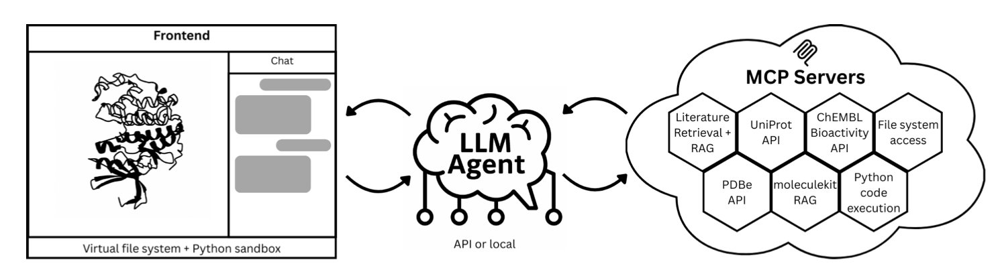
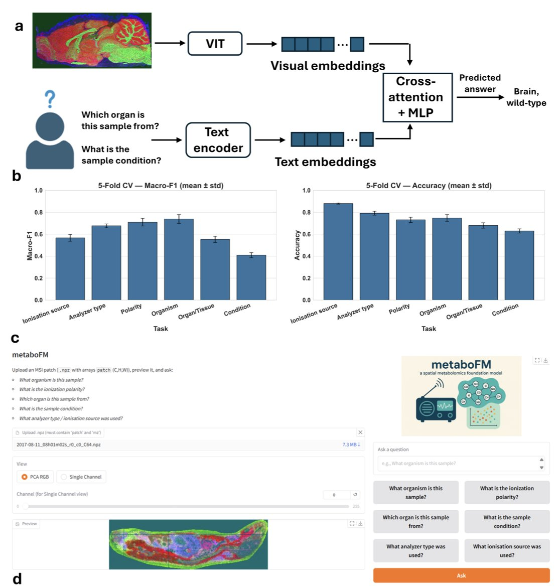
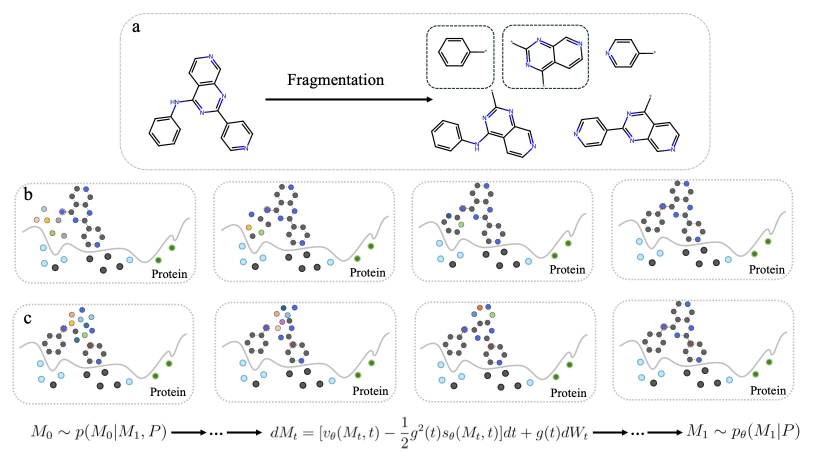
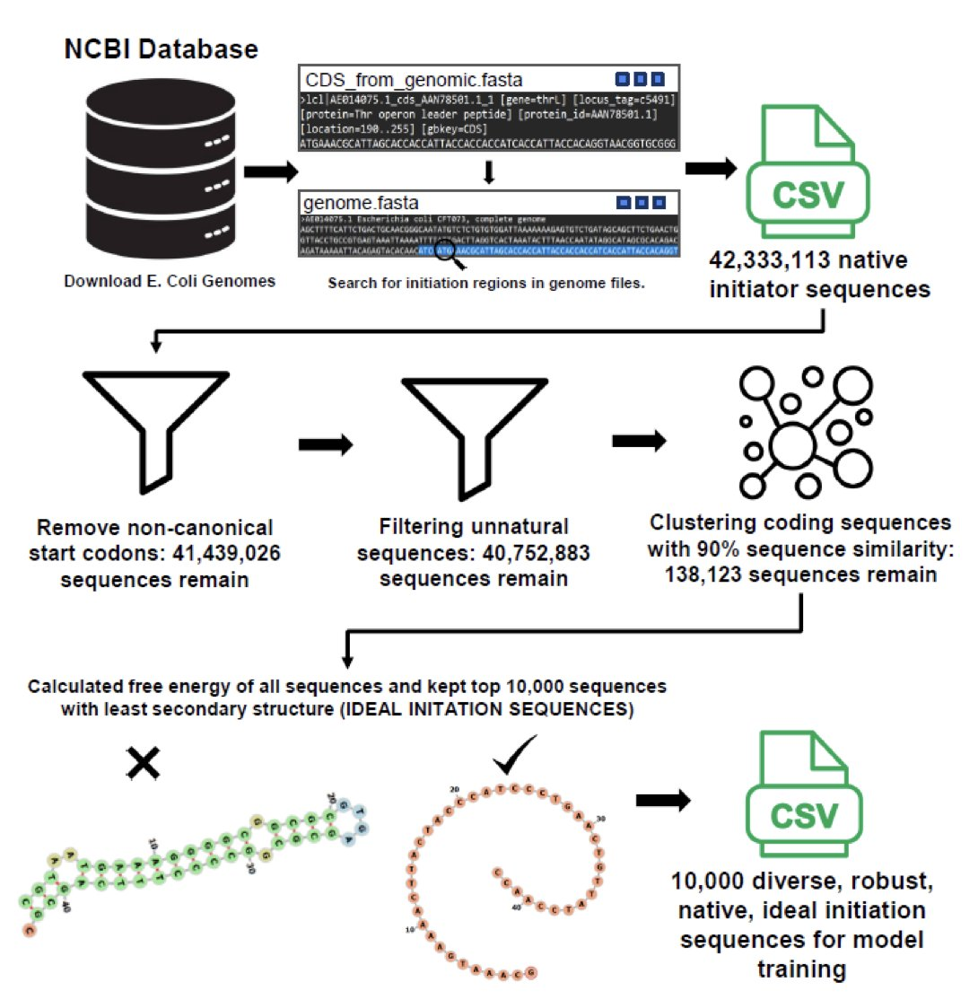
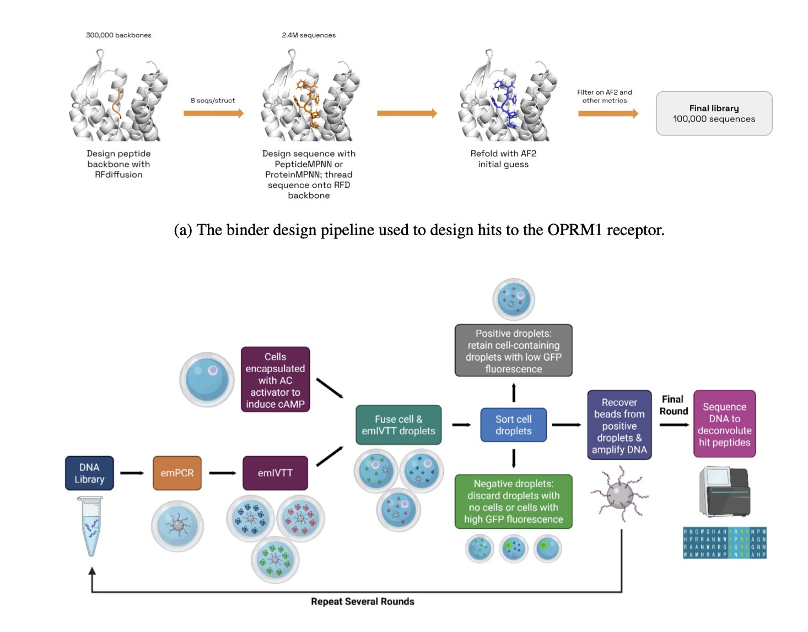

## Contents
1. An AI system called "Speak to a Protein" combines natural language, 3D visualization, and code execution to make complex protein structure analysis as intuitive as a chat.
2. MetaboFM integrates thousands of separate mass spectrometry imaging datasets into a single vision foundation model. This allows a machine to understand spatial metabolite data like a picture and discuss the data using natural language.
3. Researchers developed a new fragment-based generative AI method that unifies diffusion models and flow matching through stochastic interpolation, enabling more efficient generation of high-quality drug molecules.
4. A new deep learning model called TOM improves protein expression levels by optimizing the secondary structure of the mRNA initiation region.
5. The PeptideMPNN model raises the success rate of de novo peptide design to a new level by prioritizing the generation of key sequences at the binding interface.

## 1. New AI Tool: Analyze Proteins Like a Conversation with Real-Time 3D Interaction

The workflow for structural biology analysis is usually cumbersome. You download a structure from the PDB database, open it with software like PyMOL or Chimera, and then perform alignments, coloring, and measurements through manual operations or scripts. This process requires expert knowledge and has a high barrier to entry for researchers who are not computationally skilled.

The "Speak to a Protein" system was created to solve this problem. It is a research assistant that you can talk to, much like a knowledgeable colleague. You state your request in natural language, and it handles all the tedious technical operations.

Here is how it works.

First, the user types a question in natural language into a web interface. For example: "Show the dopamine D3 receptor and superimpose its known antagonists."

Next, the system's Large Language Model (LLM) parses the instruction and breaks the task down into several steps:
1.  Retrieve the dopamine D3 receptor structure from the PDB database.
2.  Find known antagonists from databases like ChEMBL or from scientific literature.
3.  Generate Python code to load the structure, align the molecules, and perform the visualization.

This code runs automatically in a secure sandbox environment. To ensure scientific accuracy, the system uses Retrieval-Augmented Generation (RAG). It builds a library of literature related to the target protein, making sure the AI's responses are supported by publications and not fabricated.

Finally, all results are displayed in real-time in an interactive 3D window. The user can see the protein structure, the superimposed ligands, and text explanations of key interactions with references.

The value of this workflow is its tight integration of language, code, and 3D graphics.

For instance, a synthetic chemist wants to know if a molecule they designed can form hydrogen bonds with the hinge region of CDK2. Instead of learning PyMOL commands, they can just ask: "Dock my molecule into the CDK2 active site and highlight hydrogen bonds with the hinge region." The system will immediately provide a visual result.

This instant feedback accelerates the cycle of proposing and testing hypotheses. The paper's authors use the dopamine D3 receptor and CDK2 as examples to show how the system can quickly complete analysis tasks that used to take hours or even days.

This is still an early-stage system. Its capabilities are limited by the reasoning power of the large model and the completeness of the databases. But it points to a future direction where scientific tools will be more conversational, allowing scientists to focus on scientific questions rather than on software operation.

📜Title: Speak to a Protein: An Interactive Multimodal Co-Scientist for Protein Analysis
🌐Paper: https://arxiv.org/abs/2510.17826v1

## 2. MetaboFM: First AI Foundation Model to Unify Spatial Metabolomics, Reading Molecules Like a Picture

Spatial metabolomics research faces a difficult data problem. Mass Spectrometry Imaging (MSI) data from different labs, instruments, and experiments are like mutually unintelligible dialects. They are hard to compare and integrate directly, leaving vast amounts of data siloed and unused.

MetaboFM's approach is to treat MSI data as a kind of "molecular picture." It uses AI models from the field of image processing to learn their common language, breaking down these data barriers.

#### How does it work?

Step one is gathering the raw material. The research team collected nearly 4,000 MSI datasets from the public METASPACE database. The scale and diversity of this collection, covering different species, tissues, instruments, and ionization modes, provided rich material for training the model.

Step two is standardization. They processed this raw data into a uniform format of "spatial-spectral tensors," which is like creating a standard set of phonetics for machine learning.

Step three involves using a Vision Transformer (ViT) to learn the underlying patterns in these "molecular pictures." After training, the ViT model can identify patterns in complex mass spectrometry signals that are invisible to the human eye.

#### What can it actually do?

The model's predictive power is strong. In a test involving six metadata prediction tasks, the pre-trained model achieved an average macro F1 score of 0.74 and an accuracy of 0.80 using only a simple linear probe. In contrast, models based on principal component analysis (PCA) or trained from scratch performed over 20% worse. This shows that large-scale pre-training taught the model generalizable knowledge about spatial metabolomics.

AI models are often limited by their "black box" nature. MetaboFM addresses this with a method called "spectral attribution analysis." It can trace back to identify the key mass-to-charge ratio (m/z) signals the model focused on when making a decision. For example, when distinguishing between healthy and tumor tissue, the model can highlight specific m/z values. This provides direct clues for drug developers looking for biomarkers or drug targets.

The researchers also developed a Visual Question Answering (VQA) framework that enables the model to understand questions in natural language. A user can directly ask, "What organ is this sample from?" or "Which ion source was used for this image?" The model analyzes the molecular picture and provides an answer, achieving an average macro F1 score of 0.61. The team also created an interactive interface, allowing biologists who are not proficient in programming to easily "talk" to their data.

This work shows that a foundation model is a viable path forward for advancing spatial metabolomics. Future directions include self-supervised pre-training on MSI data and integrating multi-omics data like histology and proteomics. The ultimate goal is to build a unified molecular panorama at the tissue level, which could change how we analyze diseases.

📜Title: MetaboFM: A Foundation Model for Spatial Metabolomics
🌐Paper: <https://www.biorxiv.org/content/10.1101/2025.10.23.684227v1>

## 3. AI in Drug Discovery: From Molecular Fragments to Candidate Drugs

The core of new drug development is finding small molecules that bind precisely to a target protein. Traditional methods are not very efficient. Fragment-Based Drug Design (FBDD) offers a more effective approach. First, it uses small molecular fragments to probe the target and find promising ones that bind. Then, these fragments are "grown" or "linked" into a complete drug molecule. This method is efficient, but the challenge is how to explore novel and promising molecular structures starting from a single fragment.

Generative AI, especially diffusion models, brings a new solution to this problem. These models can generate a completely new molecule from a random cloud of atoms. But this process cannot be directed to start from a specific fragment.

The work in this paper solves this issue. The new model developed by the researchers can be directly instructed: "Start with this fragment and grow it into a complete molecule that can bind to the target."

The core technology that makes this possible is **Stochastic Interpolants**. It acts like a bridge between two points. One end of the bridge is the starting fragment and a collection of random atoms. The other end is a complete molecule with a known structure. The model learns countless paths of transformation from the start to the end of this bridge. This allows it to master the ability to efficiently "grow" a complete, structurally sound, and chemically viable molecule from any given fragment.

The study also found that among the many ways to build this "bridge," **Flow Matching** is more efficient than the traditional **Diffusion** model. The paths in Flow Matching are more direct and smooth, allowing the model to converge faster and generate high-quality molecules in fewer computational steps. If a diffusion model is like crossing a river by feeling for stones, flow matching is like driving on a highway.

To test the method's real-world capability, the researchers used PLK3 inhibitors as a target. The results showed that the model could not only generate known active molecules but also create new and competitive candidate molecules. This demonstrates the method's potential to explore chemical spaces that human chemists have not yet reached.

The success of the method also depends on a high-quality "molecule-cutting" tool. For this, the researchers designed a **Cleavable Fragmentation algorithm**. It ensures that the resulting fragments are both diverse and representative, providing the model with excellent learning material.

This work equips fragment-based drug design with a powerful AI engine. It allows drug developers to build on known fragments to discover new drug candidates faster and more accurately.

📜**Title**: Coupled Fragment-Based Generative Modeling with Stochastic Interpolants
🌐**Paper**: https://doi.org/10.26434/chemrxiv-2025-1wtdx

## 4. AI in New Drug Development: TOM Model Revolutionizes mRNA Translation Efficiency

During protein synthesis, translation initiation is a key rate-limiting step. The mRNA molecule folds on itself. If complex hairpin structures form near the start codon, they can block ribosome binding and reduce the efficiency of protein production.

Past research has mainly focused on Codon Optimization, based on the idea that using codons favored by the cell will increase protein yield. The authors of this paper argue that the real key is to resolve structural "congestion" in the translation initiation region.

To address this, the researchers developed the deep learning model TOM. They screened over 40 million natural gene sequences from *E. coli* to select 10,000 ideal sequences for training. TOM's core task is to optimize the minimum free energy (MFE) of the mRNA translation initiation region, making this segment as unfolded as possible to reduce the likelihood of forming stable secondary structures.

The TOM model considers both the 5' untranslated region (5' UTR) and the coding sequence (CDS). This holistic optimization approach is more aligned with the actual translation mechanism inside *E. coli* than traditional tools that focus only on the Codon Adaptation Index (CAI).

The model performed well in theory. The next step is to experimentally verify whether the optimized sequences can actually lead to higher protein yields. If successful, this technology could have potential applications in producing therapeutic proteins like insulin or in developing enzymes that can degrade plastics.

📜Title: TOM: Transformer Neural Network Optimization of mRNA initiator region
🌐Paper: https://www.biorxiv.org/content/10.1101/2025.10.30.685412v1

## 5. A New Paradigm in AI Peptide Design: Starting from Key Contact Points Doubles the Hit Rate

A common problem in the de novo design of computational drugs is that most ideal molecules created in simulations are ineffective when tested in the lab. This issue is even more pronounced in peptide design. Peptides are flexible and only adopt a specific conformation when bound to a target. Therefore, the success of the design depends almost entirely on the few key amino acid residues that make direct contact with the target.

Traditional inverse folding models like ProteinMPNN perform well in designing protein sequences but are less effective when handling specialized problems like peptide design. They typically generate the entire amino acid sequence sequentially or randomly, without prioritizing the crucial residues at the binding interface. This is like carving the handle of a key first and then relying on luck to shape the critical teeth.

The PeptideMPNN model takes a more direct approach. First, it uses data from peptide-protein complexes to fine-tune the base model. This is like giving a general practitioner specialized training to focus on peptide-protein interactions. Its core is a "contact-based decoding" strategy. The model first identifies the direct contact points on the peptide backbone with the target protein. It then concentrates its computational resources on generating the amino acid sequences for these key positions first, before generating the sequences for the remaining, less critical parts. This is equivalent to precisely crafting the key's teeth before making the handle.

This strategy aligns with chemical intuition: prioritizing the most important interactions increases the likelihood that the molecule will bind to the target. The data shows that this optimization alone increased the hit rate in computer simulations by 16% to 30%.

To validate the model's practical effectiveness, the research team applied it to the μ-opioid receptor (OPRM1), a real drug target, to design a batch of new peptide agonists from scratch. The in vitro experimental results showed that PeptideMPNN designed more than twice the number of highly active agonists compared to the standard method.

PeptideMPNN is a practical tool that can discover effective molecules in the lab. It proves that a clever strategy based on biochemical principles can be more effective than simply increasing computational power. A tool that can directly improve screening efficiency is of great significance for drug development.

📜Title: Improved De Novo Peptide Binder Design with Target-Conditioned Inverse Folding
🌐Paper: <https://www.biorxiv.org/content/10.1101/2025.10.28.685072v1>
