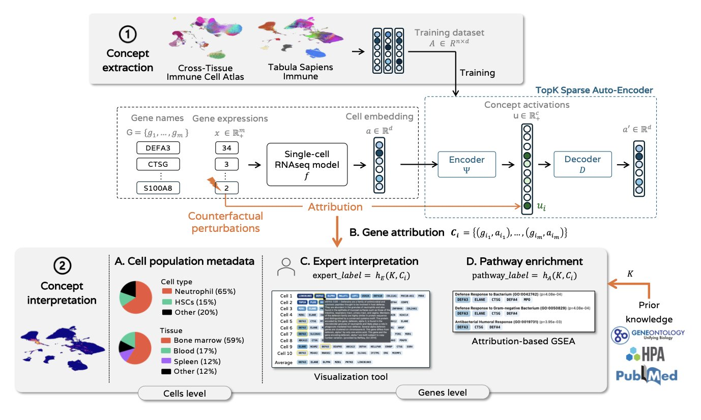
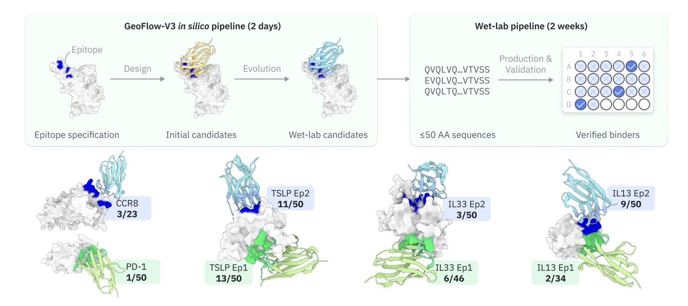
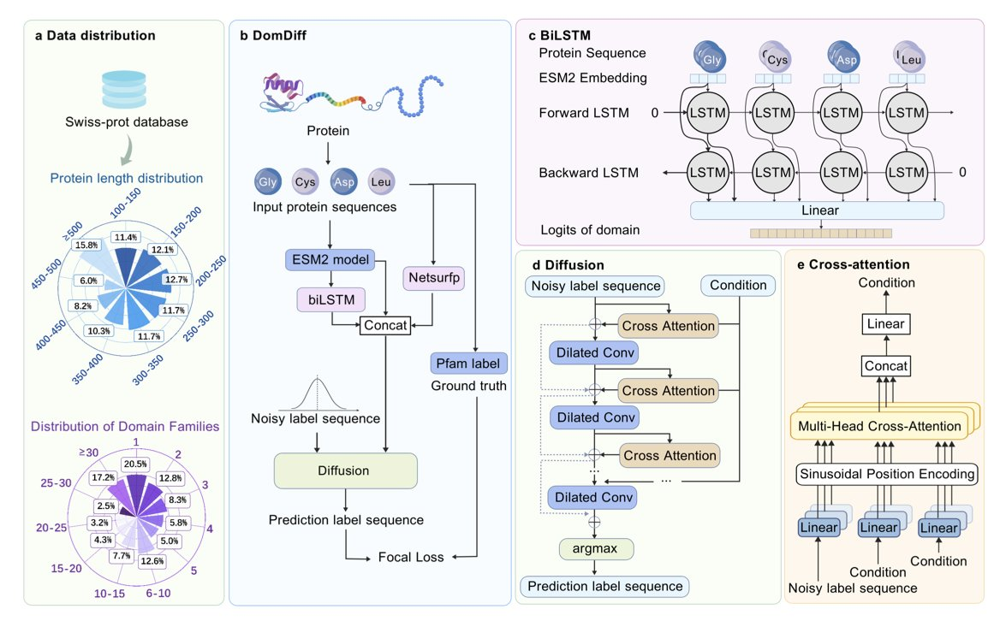
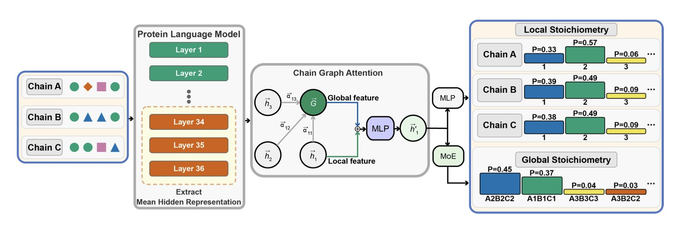
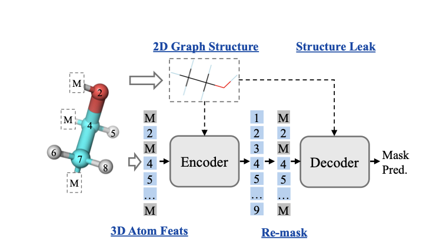

## 目录  
1. 研究人员开发了一套方法，通过稀疏自编码器，让单细胞 RNA 测序的基础模型更易理解，从而揭示模型学到的生物学知识。
2. GeoFlow-V3 用 AI 直接生成高亲和力抗体，命中率达到 15.5%，将需要数月筛选的工作缩短至几周。
3. DomDiff 应用扩散模型识别蛋白结构域，通过从噪声生成标签，提升了边界预测和家族分类的准确性。
4. StoPred 结合蛋白质语言模型与图注意力网络，能直接从序列或结构预测蛋白复合物的化学计量，准确率和效率均优于现有方法。
5. 3D-GSRD 设计了一种巧妙的选择性重掩码机制，能阻止模型通过二维图谱「作弊」，从而引导它真正学习分子的三维结构。

## 1. 单细胞基础模型解释性新突破：稀疏自编码器揭示生物学概念  
  
  

使用深度学习模型分析单细胞测序数据时，常会遇到模型预测效果好，但其内部工作机制难以理解的「黑箱问题」。这给希望利用模型发现新生物学知识的科学家带来挑战。一项新研究为此提供了解决方案。  
  
研究的核心是引入稀疏自编码器。它能将单细胞基础模型内部复杂的神经元活动，转换为一组组可理解的「生物学概念」。每个「概念」可能对应一群功能相似的基因，如参与特定代谢通路或决定细胞身份的基因集合。  
  
与分析单个神经元相比，这些「概念」更清晰、更符合生物学逻辑。研究证明，提取出的概念与细胞类型、生物学过程等已知生物信号高度吻合，显著提升了模型的可解释性。  
  
为确定每个概念由哪些基因主导，研究人员采用了反事实扰动归因分析。传统差异基因表达分析只能揭示相关性，而该方法能推断因果关系。通过在计算中模拟「敲除」特定基因，并观察哪个「概念」的激活受到最直接影响，研究人员得以精准识别驱动每个概念的核心基因。  
  
这套可解释性框架并未牺牲模型性能。测试表明，在细胞分类、细胞周期判断等下游任务中，使用这些「概念」与使用整个模型的潜藏空间（Latent Space）效果相当。这说明我们可以在不损失预测准确性的前提下，获得宝贵的可解释性。该方法使模型变得透明，为利用 AI 工具探索生物学奥秘开辟了新路径。  
  
📜Title: Discovering Interpretable Biological Concepts in Single-Cell RNA-Seq Foundation Models  
🌐Paper: https://arxiv.org/abs/2510.25807  

## 2. GeoFlow-V3: AI 从头设计抗体，命中率 15.5%  
  
  

抗体发现如同在巨大的钥匙库中，寻找一把能精确开锁的钥匙。噬菌体展示等传统方法类似「暴力破解」，需从海量分子中筛选，费时费力。业界一直希望用计算方法直接「设计」抗体，但过去计算设计的分子在实验中命中率很低。  
  
GeoFlow-V3 将生成与结构验证紧密结合。这好比一位建筑师（生成模型）和一位结构工程师（复合物建模）协同工作：建筑师画出草图，工程师立刻分析其结构可行性。这种实时反馈确保了生成的抗体序列在三维结构上合理且稳定。  
  
GeoFlow-V3 还引入了「计算机内进化」（in silico evolution）策略。它模拟定向进化过程：模型生成一批初始抗体序列，用置信度分数评估其与靶点的结合潜力，然后对高分序列进行微小「突变」并再次评估，保留更优结果，循环往复。这个过程在广阔的序列 - 结构空间中高效搜索，将候选分子推向高亲和力方向。  
  
研究团队针对 8 个不同的治疗靶点（包括细胞因子、GPCR 和免疫检查点等难点靶点）进行了实验验证。平均 15.5% 的命中率，相当于每测试不到 7 个 AI 设计的分子，就可能找到一个能结合靶点的。相比之下，以往的计算方法可能要测试成百上千个分子才能成功一次，效率提升了两个数量级。  
  
在一些靶点上，仅一轮湿实验就找到了纳摩尔（nanomolar）级别亲和力的分子。发现周期从数月缩短到几周。AI 直接提供了一小批高成功率的候选物，避免了大海捞针式的筛选。  
  
这项工作推动药物发现从「AI 辅助」转向「AI 驱动」，AI 从筛选工具转变为创造者。该框架扩展性强，可用于设计双特异性抗体、多肽、大环分子乃至酶，为生物大分子药物的研发提供了新的可能性。  
  
📜Title: Rapid De Novo Antibody Design with GeoFlow-V3  
🌐Paper: https://www.biorxiv.org/content/10.1101/2025.10.20.682964v1  

## 3. AI 新工具 DomDiff：精准解析蛋白结构域  
  
  

要理解蛋白质的功能，首先要确定其结构域（domain）的边界，就像读懂一本书需要先分清章节。传统方法在处理边界模糊或遇到稀有蛋白家族时，常常力不从心。DomDiff 为此提供了一个全新的解法。  
  
DomDiff 将结构域识别重构为一个「生成」任务。  
  
想象一张充满雪花点的屏幕（高斯噪声），模型能一步步将噪声调整为清晰的图像。这就是扩散模型（diffusion model）的思路。DomDiff 借鉴此法，从一组随机的结构域标签开始，通过迭代「去噪」，最终生成准确的结构域划分。  
  
这个过程如下：  
  
首先，模型输入蛋白质序列，并利用强大的蛋白质大语言模型 ESM2（Evolutionary Scale Modeling 2）提供的嵌入（embedding）。ESM2 嵌入为每个氨基酸提供了丰富的序列语境信息。  
  
然后，模型还融合了 NetSurfP 预测的二级结构信息（如 α-螺旋和 β-折叠）和双向长短期记忆网络（biLSTM）提供的先验知识。这让模型在理解氨基酸的同时，也掌握了蛋白质的局部结构模式。  
  
在每一步去噪中，DomDiff 参考这些信息修正随机标签。初期修正大范围的划分错误，后续则逐步精调，最终将边界定位到单个氨基酸。  
  
这种生成式方法能更好地处理边界模糊的区域，因为它通过渐进优化来处理不确定性。  
  
它在处理稀有蛋白家族时也表现突出。DomDiff 学习生成结构域的底层规则，因此能更好地泛化到数据稀疏的「少样本」情况，这对注释新基因组至关重要。  
  
在公开数据集上，DomDiff 的边界检测准确率比现有顶尖模型提升了 12.6%，分类准确率提升了 4.2%。  
  
更准确的结构域注释有助于更清晰地理解功能。当设计分子以抑制或激活某个蛋白时，精确的催化域和调控域划分能让药物设计更有针对性，提高效率。  
  
未来的方向是整合三维结构信息。如果说目前的 DomDiff 在绘制一张精准的蛋白质「楼层平面图」，那么加入三维结构后，它就能生成一份完整的「建筑蓝图」。  
  
📜Title: DomDiff: Protein Family and Domain Annotation via Diffusion Model and ESM2 Embedding  
🌐Paper: https://www.biorxiv.org/content/10.1101/2025.10.28.685005v1  
💻Code: https://github.com/zhangchao162/DomDiff.git  

## 4. StoPred：AI 精准预测蛋白复合物的「配方」  
  
  

在药物研发中，许多蛋白质靶点并非「独行侠」，而是组成蛋白复合物团队来执行生物功能。明确团队由几个成员（亚基）组成，以及每种成员各有多少个，是理解其功能的起点。这个「团队配方」就是化学计量 (Stoichiometry)。如果搞错配方，比如将本应是 A2B2 的复合物按 A3B3 研究，后续的结构解析、功能研究和药物设计就可能是在「错误的大楼里装修」。  
  
传统方法预测配方，依赖于寻找结构相似的已知复合物作为模板。但如果目标蛋白没有现成的模板，预测就会变得困难。  
  
StoPred 工具提供了一个新思路。它首先使用蛋白质语言模型 (pLM, protein language model) 「阅读」每个候选亚基的氨基酸序列。pLM 像一个读遍了海量蛋白质序列的 AI，理解蛋白质的「语法」，能从序列中提取出关于折叠与功能的深层信息。  
  
得到每个候选「队员」的资料后，再由图注意力网络 (GAT, graph attention network) 决定如何组队。GAT 如同团队教练，审视所有队员并模拟相互作用，重点关注决定团队稳定性的关键互动，最终计算出最合理的团队构成。  
  
整个过程完全基于序列或结构特征，无需模板，也无需预设可能的组合。  
  
StoPred 的表现出色。在同源复合物（所有亚基相同）的预测上，其 Top-1 准确率比之前最优方法高出 16%。在更复杂且更常见的异源复合物（包含不同亚基）上，这一优势扩大到 41%，是一项显著提升。  
  
与 AlphaFold3 的对比揭示了 StoPred 的独特价值。AlphaFold3 的评分系统（如 pLDDT）旨在评估结构模型的准确度，而非化学计量的正确性。因此，AlphaFold3 可能为一个结构看似完美的错误复合物（如 A2B2）打出高分。而 StoPred 的训练目标就是预测化学计量，使其能更准确地判断出正确的配方（如 A3B3）。  
  
StoPred 的运行速度快，可以作为高效的预筛选工具。在投入大量计算资源用 AlphaFold-Multimer 等工具建模前，可先用 StoPred 快速确定最可能的化学计量。这有助于避免在错误的模型上浪费时间和算力，从而提高研发效率。  
  
未来的方向包括优化结构特征提取、整合多源信息（序列、结构、模板）到统一模型，以及将应用扩展到蛋白质 - 核酸复合物。  
  
📜Title: StoPred: Accurate Stoichiometry Prediction for Protein Complexes Using Protein Language Models and Graph Attention  
🌐Paper: https://www.biorxiv.org/content/10.1101/2025.10.20.683515v1  

## 5. 3D-GSRD：一种更懂分子 3D 结构的 AI 新模型  
  
  

AI 辅助药物发现需要能理解分子三维（3D）结构的工具，因为分子的生物活性，如与靶蛋白的结合，完全取决于其 3D 构象。但让 AI 模型从一维或二维数据中学习 3D 信息，向来是个挑战。  
  
许多自监督学习模型采用「掩码图建模」 (Masked Graph Modeling, MGM) 策略，类似做完形填空：遮住分子的一部分，让模型预测。但模型常常会走「捷径」，仅根据周围的二维化学键就能猜出被遮住的原子，根本不去学习复杂的三维空间排布。这种「作弊」行为绕开了真正的三维学习任务。  
  
这篇论文提出的 3D-GSRD 模型，就是为了解决这个「作弊」问题。  
  
其核心机制是「选择性重掩码解码」 (Selective Re-mask Decoding, SRD)。训练分为两步。编码阶段，模型看到一个部分被掩码的分子。解码阶段，研究者向解码器展示完整的二维分子图谱，但*再次*遮住被掩码部分的三维坐标。  
  
如此一来，解码器必须完全依赖编码器的输出来重建原子的三维坐标，因为它无法再从二维结构中找到捷径。这迫使编码器必须将关键的三维几何信息，压缩进对分子的表征里。这好比工程师不能只看蓝图上的位置来安放零件，还必须理解该零件在整体三维结构中的精确朝向与功能。  
  
为实现这一目标，整个架构也经过了精心设计。  
  
新方法的效果在 MD17 基准上得到验证。MD17 专门评估模型预测分子能量和力等三维属性的能力。测试结果显示，3D-GSRD 在 8 个任务中的 7 个上取得了最好成绩，证明了这种强制学习三维信息的方法行之有效。  
  
作者也指出了模型的局限。例如，预训练数据集相对较小，若使用如 PubChemQC 等更大数据集，模型潜力有望进一步提升。未来，该预训练范式除了属性预测，还有望用于三维分子生成，这对药物设计是更激动人心的前景。  
  
📜Title: 3D-GSRD: 3D Molecular Graph Auto-Encoder with Selective Re-mask Decoding  
🌐Paper: https://arxiv.org/abs/2510.16780v1  
💻Code: https://github.com/WuChang0124/3D-GSRD
