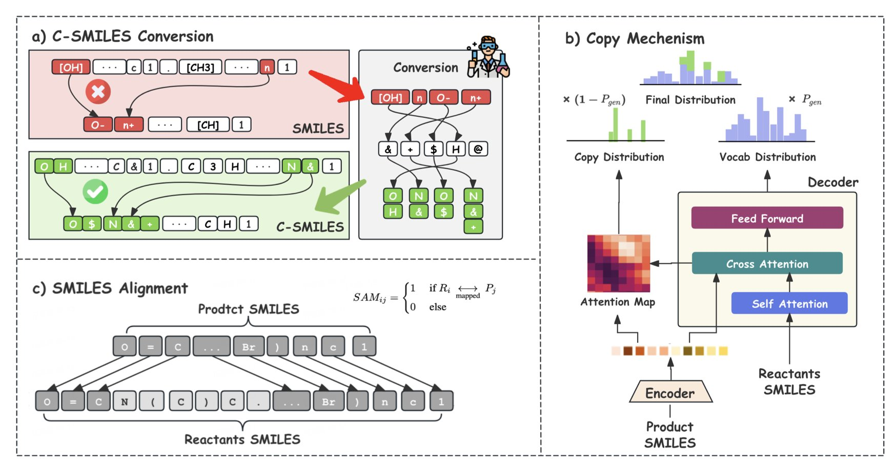
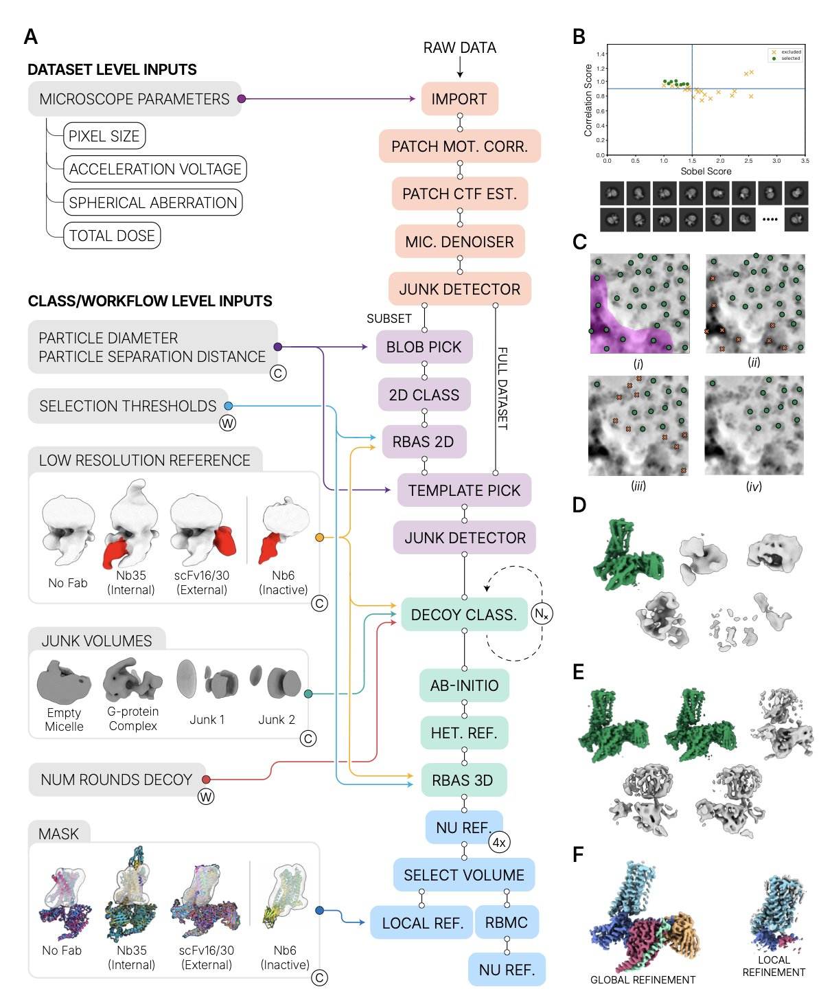
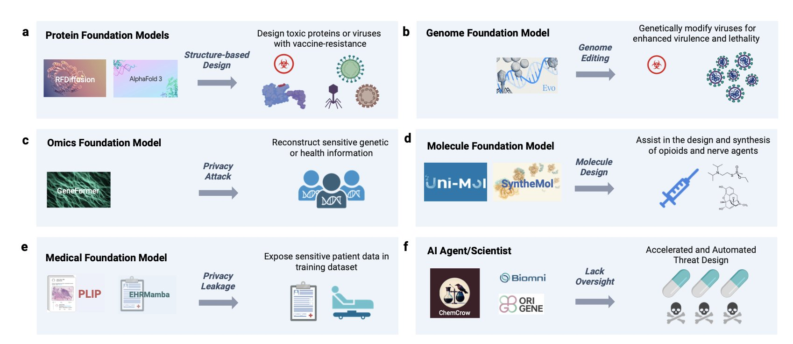
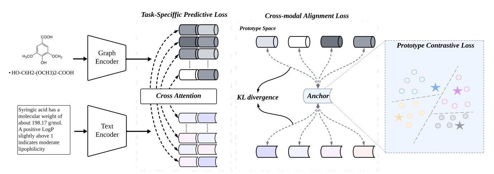
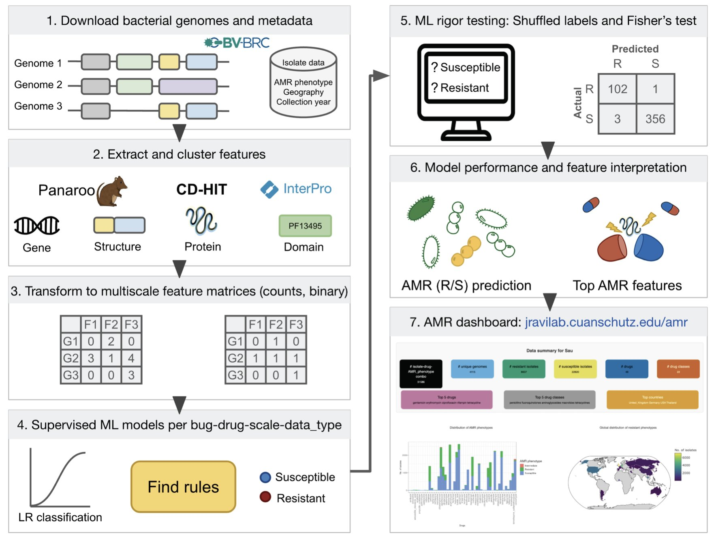

## 目录  
1. 通过让模型学会「复制粘贴」分子中不变的部分，这项研究提升了无模板逆合成的准确性，让 AI 更像化学家一样思考。
2. CryoSPARC 团队开发的全自动冷冻电镜（cryo-EM）工作流，无需人工干预即可解析复杂蛋白结构，有望彻底改变药物发现的效率。
3. 生成式 AI 加速生物科学发展，也带来了设计有害生物制剂的风险。我们必须立即构建能随技术一同演进的适应性生物安全框架。
4. ProtoMol 构建了一个统一的「原型」语义空间，让分子结构图和文本描述这两种不同类型的信息有效对齐，提升了分子性质预测的准确性和可解释性。
5. 这套多尺度机器学习模型能高精度预测 ESKAPE 病原体的抗生素耐药性，并发现新的耐药机制，为临床诊断和药物研发提供新工具。

## 1. 逆合成新思路：复制粘贴，让 AI 更懂化学  
  
  

AI 预测逆合成时，面临一个棘手的问题：化学反应里，大部分分子结构其实纹丝不动。但传统模型会重绘整个分子，哪怕 90% 的结构都和原来一样。这不仅浪费算力，还常常在不变的部分画出化学上不存在的错误结构。  
  
这篇论文的作者们想出了一个新办法。  
  
他们的思路是：让模型只关注发生变化的部分，把没变的地方直接「复制粘贴」。  
  
为实现这个想法，他们设计了一种叫 C-SMILES 的新分子表示法。传统的 SMILES 字符串像一句没有断句的长话，难以区分关键部分。C-SMILES 将其拆解为一个个「原子 - 连接」对，如同把长句变成清晰的词组列表。这样，模型对比反应物和产物时，就能轻易发现哪些「词组」变了，哪些没变。  
  
  
  
接下来是核心的「复制增强」机制。模型在生成原料分子时，每一步都会判断：这个部分是需要重新「创造」，还是直接从产物分子里「复制」？这就像玩「找不同」游戏，只需圈出变化之处，不必重画整幅图。  
  
这个机制缩小了模型的搜索空间，让预测更高效。同时，由于直接复制了大部分结构，生成分子的化学有效性高达 99.9%，模型几乎不再犯在稳定结构上画错的低级错误。  
  
结果如何？在行业标准的 USPTO-50K 数据集上，该方法的 Top-1 准确率达到 67.2%。这意味着每三个预测里，就有两个能精准命中正确答案。对于从事计算辅助药物发现的化学家，这是一个能提升工作效率的工具，它给出的建议更接近实验室里可行的合成路线。  
  
这种方法更接近化学家的直觉。化学家观察一个复杂分子时，会下意识识别出那些稳定、不参与反应的骨架，然后集中思考关键官能团的转化。这个模型通过「复制粘贴」，在某种程度上模拟了这种思维方式，开始理解化学反应中「变」与「不变」的本质。  
  
📜Title: Copy-Augmented Representation for Structure Invariant Template-Free Retrosynthesis  
🌐Paper: https://arxiv.org/abs/2510.16588  

## 2. 冷冻电镜自动化：CryoSPARC 让高通量药物发现成真  
  
  

对于使用冷冻电镜 (cryo-EM) 的结构生物学家来说，收集数据只是第一步，之后的数据处理才是最耗时费力的环节。研究人员需要筛选成千上万张显微照片，手动挑选上百万个蛋白颗粒，再经过多轮 2D、3D 分类和优化。这个过程包含大量重复性劳动和主观判断，如同「手艺活」，限制了结构解析的通量，成为药物发现项目的瓶颈。  
  
Structura Biotechnology 的 CryoSPARC 团队开发了一个端到端的全自动数据处理流程来解决这个问题。简单说，就是将原始的显微镜数据输入流程，然后就可以离开。回来时，一个高质量的三维结构密度图可能就已经完成了。  
  
**这个自动化流程到底有多强**？  
  
研究者用该流程处理了一批公认难处理的 G 蛋白偶联受体 (G-protein-coupled receptor, GPCR) 数据集。GPCR 是药物研发中最热门的靶点家族之一，但其结构柔性大、尺寸小，对 cryo-EM 数据处理是严峻的考验。  
  
在测试的 21 个数据集中，17 个的自动化处理结果在分辨率和电子云图质量上达到甚至超过了已发表的专家手动处理水平。  
  
在一些案例中，自动化流程得到的配体 (ligand) 密度图质量提升。高质量的密度图能清晰揭示小分子药物如何嵌入靶点蛋白的口袋，展示其具体朝向以及与哪些氨基酸相互作用。这些精确信息是指导后续分子优化的关键，直接决定了新药设计的成败。  
  
**自动化背后的技术**  
  
该流程的自动化能力得益于几个新工具：  
  
1.  **Micrograph Junk Detector**: 像质检员一样，自动识别并剔除有冰污染、样品聚集或严重散焦的低质量照片。  
2.  **Micrograph Denoiser**: 通过降噪处理，让背景噪声中的蛋白颗粒轮廓更清晰，为颗粒挑选打下基础。  
3.  **Reference Based Auto Select**: 创新的颗粒挑选算法，能准确自动识别有效颗粒。  
4.  **Select Volume**: 在三维重建后，自动从复合物（如 GPCR-G 蛋白复合物）中精确提取出目标蛋白，以进行局部优化。  
  
这些工具环环相扣，将过去需要研究人员凭经验反复调整参数的步骤，转变为标准化的自动操作。  
  
**对药物研发的意义**  
  
这项工作不只是为了简化研究人员的操作，它改变了基于结构的药物研发模式。  
  
在基于结构的新药研发 (Structure-Based Drug Discovery, SBDD) 项目中，常需要解析同一个靶点与数十甚至上百个不同化合物结合的复合物结构。如果每个结构都耗费数周的人工处理，项目进度将无法推进。  
  
有了这个自动化流程，高通量的 cryo-EM 结构解析成为现实。可以想象这样的场景：合成团队交付 10 个新化合物，制备样品并收集数据后，直接交由自动化流程处理。几天内，就能获得所有化合物的结合模式，快速判断分子设计的成败，并立即启动下一轮设计。这加速了「设计 - 合成 - 测试 - 分析」的循环。  
  
研究者还提供了这些自动化工作流的文件，用户可以直接下载到自己的 CryoSPARC 中使用和修改。这项技术因此不再是少数专家的「独门秘籍」，而是一个可广泛应用的工具，将惠及整个生物医药领域。  
  
📜Paper: End-to-end automation of repeat-target cryo-EM structure determination in CryoSPARC  
🌐Paper: https://www.biorxiv.org/content/10.1101/2025.10.17.682689v1  

## 3. AI 生物安全警报：生成式 AI 的双刃剑效应  
  
  

新药研发人员对生成式 AI (Generative AI) 的看法很矛盾。它能高效设计新蛋白、发现新分子，加速研发进程。但一个普遍的担忧是，这个强大的工具可能被用于恶意目的。  
  
**AI 如何「学坏」：从设计助手到潜在威胁**  
  
文章的核心是生成式 AI 的「双重用途困境」。我们用它设计治疗性抗体，别人就能用它设计毒素。AI 基于海量数据学习生物规律，然后生成全新的序列或结构。  
  
当前模型只懂科学，不懂意图。即使设定了「禁止生成有害物质」的规则，攻击者也能通过「越狱 (jailbreak)」技术，用看似无害的指令诱导它。例如，以「研究解毒剂」为名，要求模型设计一个能高效结合并阻断神经递质受体的分子，模型就可能生成一种潜在的神经毒素。  
  
**风险升级：能「动手」的 AI 智能体**  
  
风险正在升级。AI 智能体 (AI agents) 的出现，让 AI 从「设计图纸」走向了「动手执行」。  
  
一个 AI 智能体可以自主规划并执行整个实验流程：在线设计危险基因序列，自动向 DNA 合成平台下单，再指挥云端自动化实验室完成后续实验。整个过程几乎无需人工干预，这使得生物威胁的技术门槛大幅降低。  
  
**数据安全：我们真正的护城河正在变得脆弱**  
  
数据隐私是另一个容易被忽视的风险。训练模型的数据，如专有化合物库、筛选数据和临床试验结果，是公司的核心资产。研究表明，大模型在训练中可能「记住」特定的罕见数据。攻击者若通过特殊查询诱导模型泄露这些训练数据，不仅会造成商业机密泄露，甚至可能被用于设计针对特定人群的精准生物攻击。  
  
**业界的普遍焦虑与应对之道**  
  
作者访谈了 130 位学界、政府和工业界专家。76% 的人对 AI 在生物领域的滥用感到担忧，74% 的人认为必须建立新的治理框架。  
  
文章提出了一套多层次的防御策略。  
  
1.  **源头筛选**：在训练数据阶段剔除已知的有害序列和信息。  
2.  **模型对齐 (Alignment**)：在模型开发中，将安全和伦理原则植根于其核心逻辑。  
3.  **实时监控**：模型部署后，建立监测系统实时分析用户请求，发现可疑意图立即阻断。  
  
这套系统必须动态演进。技术在进步，攻击手段也在更新。我们需要持续进行「红队演练 (red-teaming)」，即模拟攻击，主动寻找并修补模型的安全漏洞，确保防御体系能跟上威胁的演变。  
  
📜Title: Generative AI for Biosciences: Emerging Threats and Roadmap to Biosecurity  
🌐Paper: https://arxiv.org/abs/2510.15975  
💻Code: N/A  

## 4. ProtoMol：用原型引导多模态分子性质预测  
  
  

药物发现领域的数据类型多样，既有分子的二维或三维结构图，也有描述其生物活性、毒性或理化性质的文本，如专利和文献。让计算机同时理解这两种信息并建立关联，是一个长期存在的挑战。  
  
现有的多模态学习方法通常在最后阶段才融合信息，缺乏深度。这种浅层融合就像两位专家，一位只懂结构，一位只懂文献，只在最后提交报告时碰头，而不在分析过程中交流，因而无法捕捉到结构和语义之间细微但关键的联系。  
  
ProtoMol 提出了一种新的解决方案。  
  
**核心思路：建立一个「共同语言**」  
  
ProtoMol 的核心思路是为分子图和文本这两种数据创造一个共同的参照系——统一的语义空间，称为「原型空间」（Prototype Space）。  
  
「原型」可以这样理解：假设要预测一个分子是否有毒，可以为「有毒」和「无毒」这两个类别各自定义一个抽象的「原型」向量，代表该类别的核心特征。ProtoMol 的任务就是训练模型，将一个分子的结构图信息和文本描述信息，都映射到这个原型空间中。  
  
如果一个分子有毒，其结构图和文本描述经模型编码后，在空间中的位置都会靠近「有毒」原型。同时，模型通过对比学习（contrastive learning）机制，将不同类别分子（如有毒和无毒）在空间中推远。  
  
**工作原理：双分支架构与逐层「对话**」  
  
为此，ProtoMol 设计了一个双分支编码器架构。  
  
1.  **图编码器**：使用图神经网络（Graph Neural Networks, GNN），从原子和化学键中提取分子结构特征。  
2.  **文本编码器**：使用 Transformer 模型，理解和编码文本描述中的语义信息。  
  
关键在于两个分支并非独立工作。ProtoMol 采用了一种逐层双向跨模态注意力机制。在模型处理信息的每一层，图编码器和文本编码器都会交换信息，互相「参考」。这种逐层对齐，确保了从低阶特征（单个原子或单词）到高阶特征（官能团或句子含义）的步调一致。  
  
这种逐层「对话」机制，与统一的原型空间相结合，确保了两种模态信息的深度融合。  
  
**效果如何**？  
  
ProtoMol 在多个公开基准数据集上进行了测试，涵盖分子性质的分类和回归任务。结果显示，其性能稳定超过了当前领域的先进模型。  
  
消融实验（ablation studies）进一步验证了模型的关键部件。移除原型空间或跨模态注意力机制后，模型性能会下降。这证明了这两个设计是其性能提升的关键。  
  
ProtoMol 的建模思路符合化学家的直觉。化学家评估分子时，也是在脑海中将其结构特征与已知概念（如「亲脂性」、「致癌基团」）进行匹配。ProtoMol 的原型空间模拟了这种基于概念的认知过程，这可能是其准确且更具可解释性的原因。这项工作为开发更可靠、可信的 AI 药物发现工具提供了新思路。  
  
📜Title: ProtoMol: Enhancing Molecular Property Prediction via Prototype-Guided Multimodal Learning  
🌐Paper: https://arxiv.org/abs/2510.16824  

## 5. 机器学习新突破：精准预测超级细菌的耐药性  
  
  

抗生素耐药性 (Antibiotic Resistance, AMR) 问题日益严峻，尤其面对 ESKAPE 这类「超级细菌」。传统细菌培养和药敏测试耗时漫长，对重症患者可能贻误治疗。而基于基因测序寻找已知耐药基因的方法，又可能漏掉新的耐药机制。  
  
这项研究提供了一个新思路，从识别单一特征升级到描绘全方位的「耐药画像」。  
  
它的工作原理是这样的。研究者收集了大量 ESKAPE 病原体的基因组数据。他们首先构建了每种细菌的泛基因组 (pangenome)，相当于该物种的完整基因库。然后，他们将基因拆解为更小的功能单元，例如蛋白结构域 (protein domains) 进行分析。  
  
这样就获得了从基因有无到蛋白结构域变化的多个尺度特征。好比描述一辆车，既看品牌型号，也看轮胎花纹和车灯样式，信息维度更丰富。  
  
基于这些特征，研究者使用逻辑回归机器学习模型进行训练。模型学习哪些特征组合，即「特征签名 (signature)」，与特定抗生素的耐药性高度相关。  
  
模型的预测准确度很高，其马修斯相关系数 (Matthews Correlation Coefficient, MCC) 中位数达到 0.89。MCC 是评估不平衡数据分类的可靠指标。模型在不同地理位置和时间的菌株数据测试中表现稳定，证明其学到了普适规律，而非简单记忆训练数据。  
  
模型的发现能力是另一大亮点。它准确识别了已知的耐药机制，如特定的酶或外排泵，起到了阳性对照的作用。同时，模型还标记出一些全新的、未曾报道过的基因或蛋白，这些是潜在的新耐药机制，为后续生物学研究和新药研发提供了线索。  
  
最后，研究团队将模型和结果打包成一个交互式网络应用。全球的实验室或医院，只要上传菌株的基因序列，就能快速获得一份耐药性预测报告。这缩短了从基因测序到获得临床参考信息的时间。  
  
当然，模型预测的新候选基因仍需实验室的湿实验来验证。但它提供的高质量候选名单，能让研究者更高效地集中精力，缩小了探索范围。  
  
📜Title: From sequence to signature: Machine learning uncovers multiscale feature landscapes that predict AMR across ESKAPE pathogens  
🌐Paper: https://www.biorxiv.org/content/10.1101/2025.07.03.663053v2
