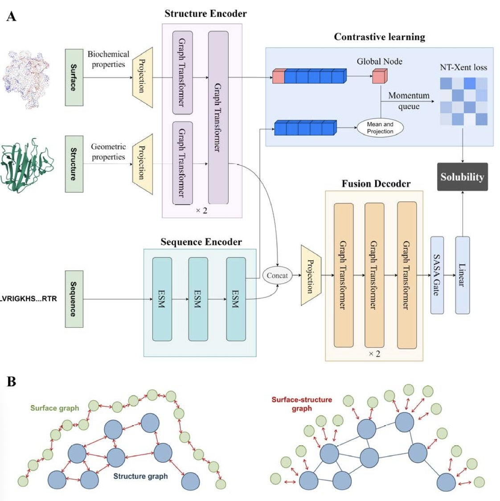
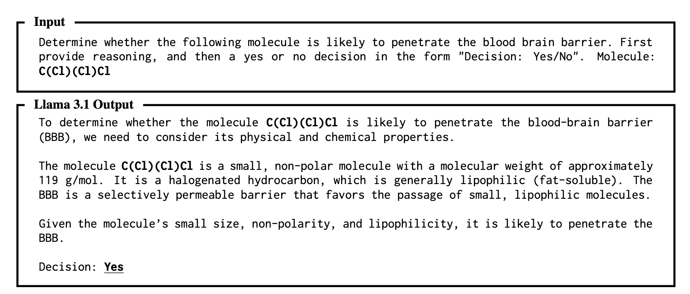
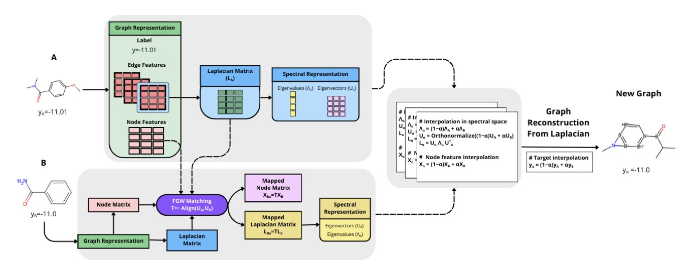
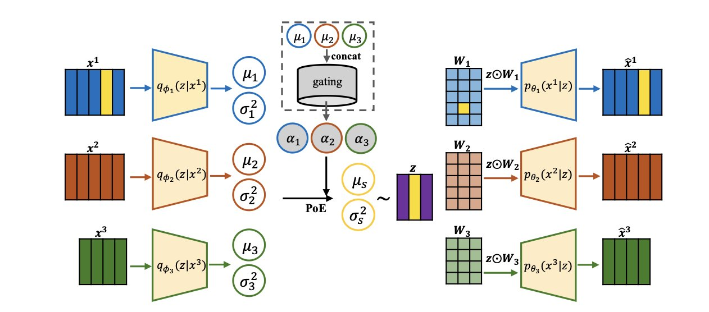
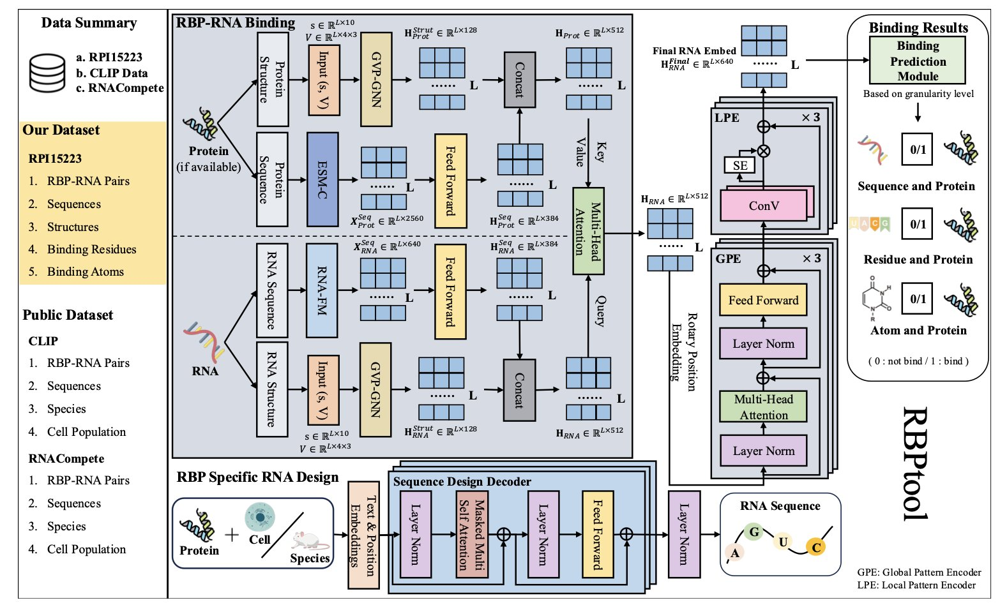

## 目录  
1. 复旦大学的研究者开发了多模态模型 Pro4S，它融合蛋白质的序列、结构和表面特征，能更准确地预测蛋白质溶解度，为理性设计和筛选高表达蛋白质提供了高效工具。
2. 在分子属性预测任务中，大语言模型（LLM）对 InChI 和 IUPAC 名称的处理效果优于传统的 SMILES，这可能因为 InChI 和 IUPAC 包含更明确的原子信息，并且在训练数据中出现得更频繁。
3. SPECTRA 框架通过在谱域中「内插」分子，创造出化学上合理但现实中不存在的分子，以填补数据稀疏的区域，提升模型在关键属性区间的预测精度。
4. POEMS 模型通过稀疏解码和专家乘积（Product of Experts）设计，在保证预测性能的同时，解决了多组学数据整合的可解释性难题，使发现跨组学生物标志物成为可能。
5. RBPtool 融合了大语言模型和几何深度学习，能精准预测 RNA 与蛋白的结合，并根据特定目标反向设计 RNA 分子。

## 1. Pro4S：融合序列、结构与表面信息，AI 预测蛋白质溶解度  
  
  

蛋白质溶解度是蛋白质项目中一个关键的决定因素。蛋白质表达后若形成沉淀，后续的功能研究和结构解析便难以进行。传统的试错法来筛选高溶解度的突变体或序列，既耗时又费力。计算方法的出现提供了新途径，但其预测准确性仍有待提升。复旦大学团队近期开发的 Pro4S 模型，为此问题提供了新的解决方案。  
  
该模型的核心思路是综合利用多维度信息。许多现有方法仅关注氨基酸序列或三维结构，未能充分利用全部信息。Pro4S 则对蛋白质进行全面分析，它同时处理三个层面的数据：  
  
1.  **序列信息**：通过大语言模型 (Large Language Model) ESM，提取蛋白质序列中蕴含的进化与功能规律。  
2.  **结构特征**：利用图神经网络 (Graph Neural Networks) 解析蛋白质的 3D 结构，如原子间的距离和角度。  
3.  **表面特征**：计算对溶解度至关重要的蛋白质表面静电势、疏水性等描述符。  
  
融合这三类信息后，Pro4S 能够更准确地判断蛋白质的溶解性（定性分类），并能给出具体的溶解度数值（定量回归）。这种统一处理定性与定量任务的策略，是其与以往模型的区别之一。  
  
研究者在多个公开数据集上测试了 Pro4S 的性能。在定性分类任务中，其 AUC 达到 0.725；在定量回归任务中，R² 值为 0.558。这些指标均优于目前领域内的顶尖预测工具。  
  
Pro4S 也能指导新的蛋白质设计。研究者将其应用于从头设计的蛋白质，发现模型预测的溶解度分数与实验测得的蛋白质表达水平高度相关。通过 Pro4S 进行筛选，不表达的蛋白质比例可降低 52.7%，同时保留 96.7% 的高表达蛋白质。这证明了该模型能高效过滤掉可能失败的设计，从而提升研发效率。  
  
这项工作为计算蛋白质工程提供了新思路。在药物研发中，无论是设计抗体药物还是开发新型酶制剂，可靠的溶解度预测工具都能节约实验成本，加速项目进程。  
  
📜Title: Pro4S: prediction of protein solubility by fusing sequence, structure, and surface  
🌐Paper: https://www.biorxiv.org/content/10.1101/2025.11.05.686869v1  
💻Code: https://github.com/TEKHOO/Pro4S  

## 2. 大语言模型更喜欢哪种分子表示法？InChI 和 IUPAC 表现更优  
  
  

在药物研发领域，寻找更高效的工具是持续的目标。大语言模型（LLM）带来了新的可能性，但也提出了一个基础问题：如何向模型描述分子，才能让它更好地理解并预测其性质？传统方法是使用简洁的 SMILES 字符串，但新研究表明，这或许不是大语言模型的最佳输入方式。  
  
一项研究考察了分子领域的几种主流表示法：SMILES、更规范的 InChI（国际化学标识符），以及化学家熟悉的 IUPAC（国际纯粹与应用化学联合会）命名。研究人员让 GPT-4o、Gemini 1.5 Pro 等多个大语言模型完成药物发现中的经典任务，例如预测分子能否穿过血脑屏障或其水溶性。  
  
结果显示，在不进行额外训练（零样本）或只提供少量示例（少样本）的场景下，InChI 和 IUPAC 的表现常常优于 SMILES。  
  
研究者分析了两个可能的原因。  
  
首先，InChI 和 IUPAC 名称的结构包含了更直接的信息。例如，InChI 字符串会明确列出分子式，让大语言模型能立刻获取关键的原子数量信息。SMILES 则更抽象，模型需要花费更多计算资源来推理其代表的化学结构。  
  
其次，这与模型的训练数据有关。研究者发现，在许多生物医学文献数据库中，IUPAC 名称的出现频率远高于 SMILES。大语言模型在海量文本数据上进行预训练，如果训练数据中反复出现 IUPAC 名称，它自然对这种表达方式更熟悉，处理效率也更高。  
  
这项研究表明，将大语言模型应用于化学领域时，不能简单沿用过去的习惯。选择一种模型能更好理解的分子表示法很重要。这不仅是改变输入格式，更是思考如何利用这些通用模型的推理能力，使其成为药物研发中可解释、可信赖的工具。未来的研究可以探索更适合大语言模型的分子表示方法，进一步释放它们在药物设计领域的潜力。  
  
📜Title: Molecular String Representation Preferences in Pretrained LLMs: A Comparative Study in Zero- & Few-Shot Molecular Property Prediction  
🌐Paper: https://aclanthology.org/2025.emnlp-main.56.pdf  

## 3. AI 新药研发：用「幽灵分子」补全稀疏数据  
  
  

在药物研发中，使用计算模型预测分子性质时常面临数据不平衡的挑战。大部分数据集中在特定范围，而性质独特的「黄金分子」数据却很稀少。这导致模型在关键数据区域的预测能力不足。  
  
SPECTRA 框架为此提供了一个巧妙的思路：创造「幽灵分子」来填补数据空白。这些「幽灵分子」在现实中不存在，但其化学结构与性质完全合理。  
  
SPECTRA 在一个抽象的数学空间——谱域 (spectral domain) 中创造分子。每个分子可视为一个由原子（节点）和化学键（边）构成的网络图，其结构信息能通过拉普拉斯矩阵 (Laplacian matrix) 的特征值与特征向量（即「谱」）来完整描述。  
  
首先，SPECTRA 运用格罗莫夫 - 瓦瑟斯坦耦合 (Gromov–Wasserstein couplings) 这一数学工具，在谱域中对齐两个真实分子图，找到它们的最佳对应关系。随后，通过对这两个分子的拉普拉斯特征值和节点特征进行线性插值，平滑地生成一系列介于两者之间的全新「谱」。最后，从这些新「谱」反向构建出对应的分子图。此过程确保了生成分子的化学合理性。  
  
SPECTRA 并非盲目生成分子，而是引入了「稀有度感知」机制。它先用核密度估计 (kernel density estimation) 分析整个数据集，找出分子数量最少、数据最稀疏的性质区间。然后，它会集中在这些稀疏区域创造「幽灵分子」，实现靶向数据增强。  
  
研究者在多个经典分子性质预测数据集（如溶解度 ESOL、水合自由能 FreeSolv 和脂水分配系数 Lipo）上验证了 SPECTRA 的效果。结果表明，该方法显著提高了模型在数据稀少区间的预测准确率，且未增加整体的平均绝对误差 (MAE)。与大型 Transformer 模型相比，SPECTRA 在保持高预测性能的同时，运行速度更快，在准确性与效率间取得了平衡。  
  
SPECTRA 提供了一种精准、高效的数据增强方法。它生成的分子不仅提升了模型性能，其过程也具有可解释性，帮助我们理解模型表现改善的原因。这种针对性「补数据」的思路，为解决药物发现中的数据不平衡问题开辟了新路径。  
  
📜Title: Spectra: Spectral Target-Aware Graph Augmentation for Imbalanced Molecular Property Regression  
🌐Paper: https://arxiv.org/abs/2511.04838  

## 4. POEMS：用稀疏解码实现可解释的多组学整合  
  
  

多组学研究常面临一个困境：模型要么预测精准但难以解释，要么足够透明但预测能力不足。POEMS，一个新的深度生成框架，为这一问题提供了平衡的解决方案。  
  
它的核心思路是建立一个可解释的潜在空间（latent space）。这个潜在空间如同一个信息中转站，汇集了所有不同来源的组学数据，如基因、蛋白和代谢物。POEMS 的第一个设计是**稀疏解码（sparse decoding**）。它不让所有特征进入模型，而是通过稀疏映射，让潜在空间里的每个「因子」只与少数最相关的组学特征关联。当某个因子被激活时，便可立刻追溯到是哪些具体的基因或蛋白在起作用，直接识别出生物标志物。  
  
为有效融合不同来源的数据，POEMS 运用了**专家乘积（Product of Experts, PoE**）模型。每个组学数据源就像一位「专家」，根据自身数据给出一个判断，即后验分布。PoE 的作用是综合这些专家的意见，形成一个更全面的共识。这个过程不仅增强了模型对疾病亚型等复杂生物学问题的理解，也让我们能清晰地看到不同组学如何协同作用，共同描绘出疾病的全貌。  
  
POEMS 还有一个**门控机制（gating mechanism**）。这个机制像一个智能调音台，能自动判断当前分析任务中哪个组学数据源的信息量最关键，并赋予其更高权重。例如，在分析某种癌症时，如果基因突变是主要驱动因素，基因组学的权重就会被调高。这种动态调整的能力，为我们深入理解不同分子层在疾病发生发展中的贡献度提供了新维度。  
  
研究者在乳腺癌和肾癌数据集上验证了 POEMS 的能力。结果显示，它在聚类和分类任务中的表现不逊于当前顶尖方法。它挖掘出的潜在结构不仅在生物学上合理，还揭示了跨组学间的关联和各组学的贡献度，这对设计更具针对性的治疗方案是重要的一步。  
  
POEMS 仍有改进空间，未来的工作可以优化潜在空间的结构，并减少模型对超参数设置的依赖性。  
  
📜**论文标题**: POEMS: Product of Experts for Interpretable Multi-omics Integration using Sparse Decoding  
🌐**论文地址**: https://arxiv.org/abs/2511.03464v1  

## 5. AI 精准预测 RNA-蛋白互作，还能反向设计 RNA  
  
  

RNA 药物是当前的热点，但设计能精准结合靶蛋白的 RNA 分子仍充满挑战。核心难题在于精确预测 RNA 分子与其目标蛋白如何相互识别并结合。一个名为 RBPtool 的新计算框架为此提供了新思路。  
  
RBPtool 的工作方式融合了大语言模型 (Large Language Model, LLM) 和几何深度学习两种 AI 技术。  
  
预测 RNA-蛋白质相互作用 (RNA-Protein Interactions, RPIs) 好比让 AI 同时阅读一本书（RNA 序列信息）并看懂一张地图（RNA 三维结构）。传统方法往往只侧重其一，导致信息不全面。  
  
RBPtool 建立了一个双通道信息处理系统。第一个通道使用 RNA 基础大语言模型「阅读」RNA 序列，捕捉其中隐藏的全局模式。第二个通道则由几何向量感知器模块解读 RNA 分子的三维空间结构，捕捉原子和残基层面的局部几何特征。  
  
两个通道的信息最终汇合，使 RBPtool 能对 RNA 与蛋白质的结合潜力做出全面判断。这种结合全局与局部的策略，使其预测精度超越了以往的方法。  
  
RBPtool 还是一个 RNA 设计师。研究者为其加入了反向设计模块。用户只需设定目标蛋白质和作用的细胞类型，它就能自动生成符合要求的全新 RNA 序列。实验验证表明，这些设计的 RNA 序列在功能性和序列相似性上表现出色，为从头设计 RNA 药物开辟了新途径。  
  
研究者在 CLIP、RNAcompete 等多个公开数据集上测试，证明了 RBPtool 的强大性能和泛化能力。消融研究 (ablation study) 也证实，大语言模型和全局模式编码器是其实现高性能的关键。  
  
RBPtool 将 RNA 序列作为一种语言来理解，同时结合其复杂的三维结构，最终在多个精度层面实现了精准预测和智能设计，为开发高效、精准的 RNA 疗法提供了有力的计算工具。  
  
📜Title: RBPtool: A Deep Language Model Framework for Multi-Resolution RBP-RNA Binding Prediction and RNA Molecule Design  
🌐Paper: https://aclanthology.org/2025.emnlp-main.110.pdf
