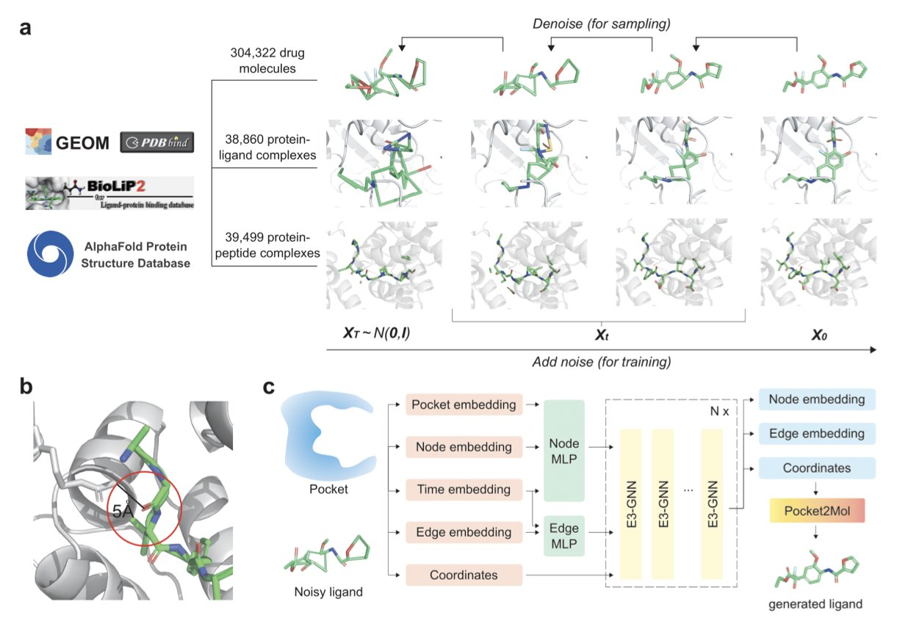
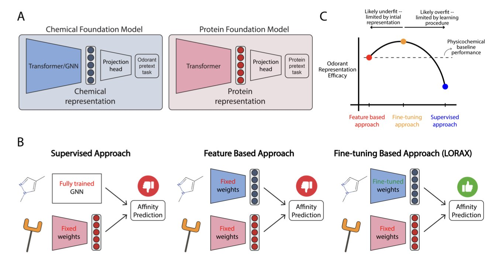
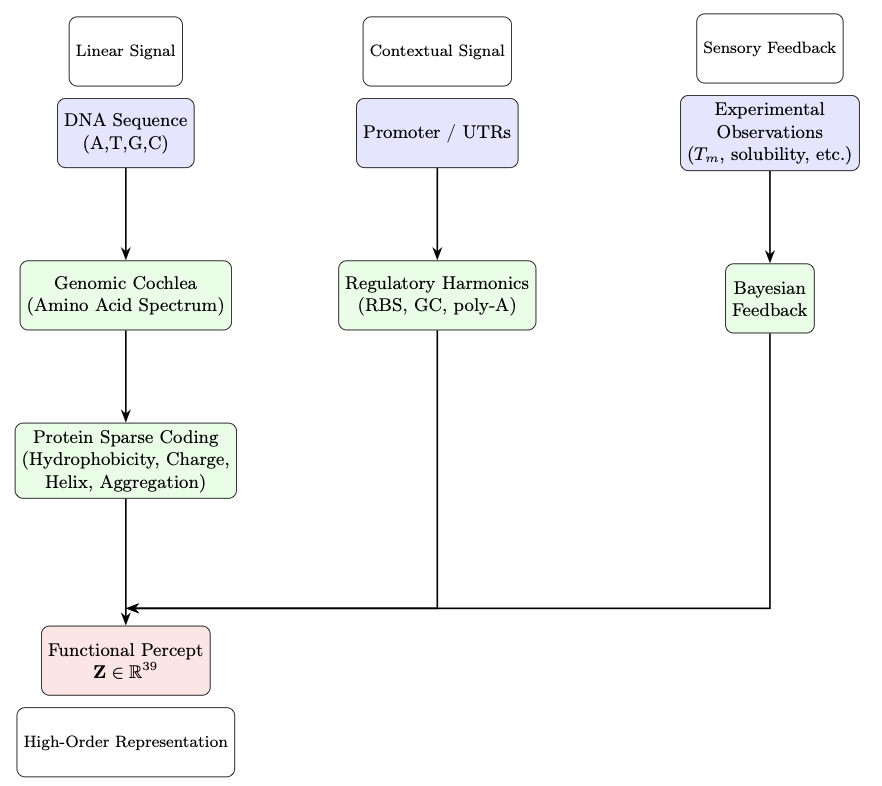
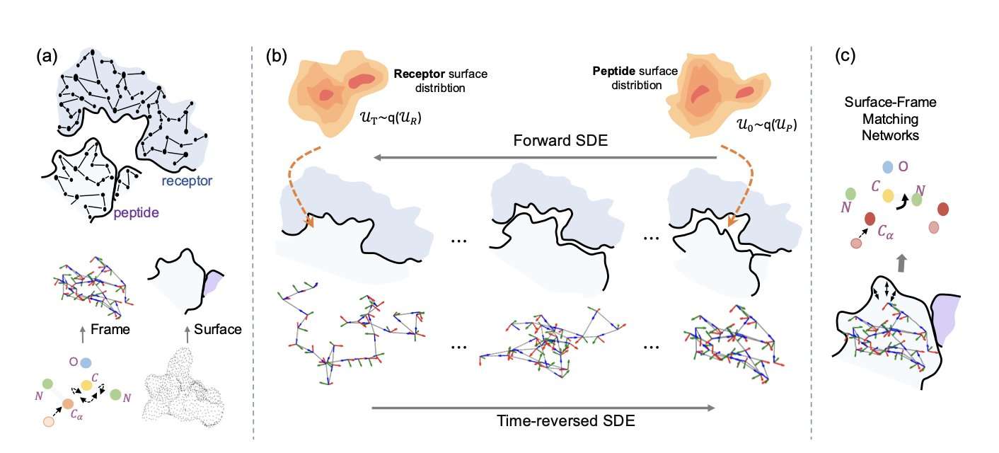
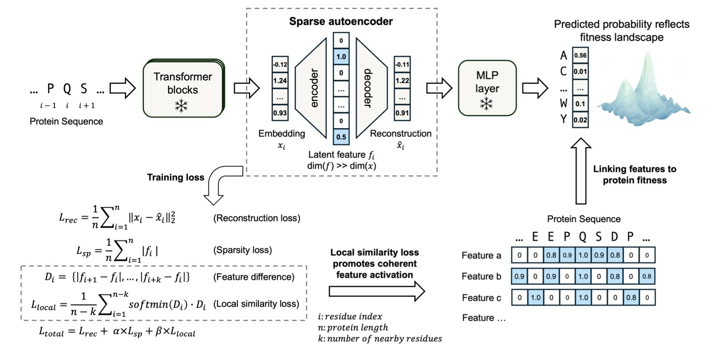

## Table of Contents
1. The Peptide2Mol model uses a diffusion model to directly generate small molecules that can mimic natural peptides and bind to their targets, offering a new path for converting peptide drugs into small molecules.
2. LORAX fine-tunes chemical foundation models to more accurately create an "odor profile" for scent molecules, providing a new tool for understanding olfaction.
3. A new algorithm called Genomic Perception Fusion (GPF) treats DNA sequences as biophysical signals, providing a transparent, computationally efficient, and lightweight solution for protein engineering.
4. The PepBridge framework uses a diffusion bridge model to directly generate structurally diverse protein ligands that are precisely complementary to the surface geometry and biochemical features of a target receptor, addressing a core challenge in "top-down" protein design.
5. The MotifAE framework can unsupervisedly mine functional motifs from Protein Language Models (PLMs) and successfully predict protein properties, offering a new approach for rational design.

## 1. Peptide2Mol: AI Directly Generates Small Molecules that Mimic Peptides for Targeted Protein Binding

Turning peptide drugs into small molecules you can take as a pill is a long-standing goal in medicinal chemistry. Peptides are great at binding to their targets precisely, but they generally make poor drugs. They have low oral absorption and are easily broken down in the body. Traditional methods, like screening compound libraries, often miss the key information about how the original peptide interacts with its target protein. This makes the process inefficient. Researchers from the Moscow Institute of Physics and Technology (MIPT), Yandex, and Johns Hopkins University (JHU) developed Peptide2Mol to solve this problem.

The idea behind Peptide2Mol is to have an AI learn how a peptide binds to its target, and then generate a small molecule that can do the same job. The model uses a Diffusion Model, specifically an E(3) equivariant graph neural network that accounts for 3D spatial symmetry. This process is like a craftsman watching how a key (the peptide) opens a lock (the protein target). The craftsman then uses a pile of parts (atoms and chemical bonds) to build a new key (the small molecule) that has a different shape but works just as well.

To train the model, the researchers used a large amount of data, including 3D conformations of small molecules, small molecule-protein complex structures, and peptide-protein interaction data. This comprehensive training allows Peptide2Mol to understand the rules of chemistry and grasp the key features of how peptides bind to their targets.

The small molecules generated by Peptide2Mol are chemically valid and show promise as potential drugs. The researchers also found that a "local refinement" strategy (a partially masked autoregressive step) improved the molecules' docking scores and structural validity in tests like PoseBusters. This shows the model can perform fine-tuned structural optimizations.

One of the model's most useful features is its ability to suggest which chemical group should replace a specific amino acid residue in the peptide. For example, it might suggest using a benzene ring to mimic the peptide's phenylalanine to preserve a key hydrophobic interaction with the target. This ability turns a vague "mimicry" problem into a concrete chemical design problem. For medicinal chemists, this is extremely valuable and helps speed up the development process.

For now, the model's performance is evaluated mainly by docking scores. The researchers plan to combine it with physics-based simulation methods, like molecular dynamics, to get a more realistic assessment of the generated molecules' stability and binding ability. As work continues in this direction, the prospect of AI-designed small-molecule peptide mimics will only grow.

📜Title: Peptide2Mol: A Diffusion Model for Generating Small Molecules as Peptide Mimics for Targeted Protein Binding
🌐Paper: https://arxiv.org/abs/2511.04984v1

## 2. LORAX: Giving Chemical Models a Nose to Sniff Out the Secrets of Smell

Drug development is all about finding the link between a molecule's structure and its biological activity. Olfaction research asks a similar question: what molecular structure produces what smell? This is more complex than it sounds.

The field of chemistry has several pre-trained foundation models, which are like the "Large Language Models (LLMs)" of the chemical world. They understand the general language of molecules. But when researchers tested these models on the specific task of predicting smell, they showed no decisive advantage over traditional methods that use physicochemical descriptors. This suggests that general chemical knowledge alone is not enough to understand smell; specialized training for olfaction is needed.

To address this, the researchers introduced LORAX, a method based on Low-Rank Adaptation (LoRA). LoRA acts like a lightweight "plugin." Instead of changing the huge base model, it attaches a small number of trainable parameters to its side. By training only these new parameters, the model's capabilities can be fine-tuned for smell prediction. The method is efficient and doesn't compromise the model's original general chemistry knowledge.

After training, the molecular representations that LORAX generated—essentially a "portrait" for each odorant molecule—changed significantly. Research showed that this new set of portraits correlated more strongly with the actual responses of neurons in the olfactory system. LORAX not only learned to predict smell but also gained some understanding of the brain's logic for identifying odors. This helps us better understand the underlying mechanisms of smell perception.

This work shows how clever fine-tuning can adapt existing foundation models to solve problems like olfaction, where data is limited but the chemical space is vast. As new chemical foundation models continue to emerge, methods similar to LORAX can be used to explore the mysteries of smell even further.

📜Title: Low Rank Adaptation of Chemical Foundation Models Generates Effective Odorant Representations
🌐Paper: https://www.biorxiv.org/content/10.1101/2025.11.04.686628v1

## 3. GPF: A Lightweight, Interpretable, and Efficient New Algorithm for Protein Design

Protein design usually relies on large, complex deep learning models. These models often work like "black boxes"—they produce excellent results, but their internal decision-making process is not transparent. A recent paper on an algorithm called Genomic Perception Fusion (GPF) offers a different path.

The core idea of GPF is to treat a DNA sequence as a complex biophysical signal. To do this, GPF uses a layered process to capture different dimensions of the signal.

First, the "Genomic Cochlea" module analyzes amino acid composition. Next, the "Protein Sparse Coding" module extracts key biophysical features. Finally, the "Regulatory Harmonics" module incorporates contextual information from gene expression. Through this process, GPF converts a protein sequence into a 39-dimensional functional numerical representation.

This 39D representation can directly predict key protein properties like stability, solubility, and expression level. And it can do all this in milliseconds on standard hardware, without needing to be trained on any private datasets.

To validate the algorithm, researchers used it to predict the effects of surface mutations on Green Fluorescent Protein (GFP). The results showed that GPF was highly accurate in predicting how these mutations would affect protein stability and solubility. The algorithm also has a built-in Bayesian updating mechanism, allowing it to continuously improve its predictive power with small amounts of new experimental data.

GPF's strength is its complete interpretability. Unlike black-box models, scientists can see the physicochemical reasons behind each prediction. This is valuable for experimental scientists who need fast, transparent guidance. They can see exactly which amino acid change affected solubility or which sequence region impacted stability.

GPF is not a silver bullet. It's best suited for optimizing existing protein backbones, not creating entirely new ones from scratch. This makes it more of a precision "tuning" tool that can complement generative design methods.

In an era dominated by large models, GPF is a reminder that lightweight, interpretable, physics-based methods still have a place in protein engineering. It proves that a good tool doesn't have to be the biggest or most complex; what matters is solving problems clearly and efficiently.

📜Title: Genomic Perception Fusion: A Lightweight, Interpretable Kernel for Protein Functional Tuning
🌐Paper: https://www.biorxiv.org/content/10.1101/2025.11.06.686961v1

## 4. A New Approach to AI Protein Design: PepBridge Precisely Customizes the Binding Interface

Traditional protein design methods usually start by building a rough backbone, then modifying it to fit a target receptor.

The PepBridge framework flips this process around. It first analyzes the shape and chemical properties of the target receptor—the "lock"—and then directly designs a "key"—the protein ligand—that perfectly matches it.

**Here's how it works:**

The first step in PepBridge is to use Denoising Diffusion Bridge Models (DDBMs). This model acts like a translator. It reads the geometric and chemical information of the receptor's surface—like bumps, grooves, charge distribution, and hydrophobic areas—and translates it into the corresponding surface features that the ligand should have. In this way, the ligand's surface is designed for binding from the very beginning.

Once this precise ligand surface "mold" is created, it needs to be filled with atoms. PepBridge runs three specialized diffusion models at the same time:
1.  **SE(3) diffusion model:** Generates the protein's rigid main-chain backbone, setting the position of atoms in 3D space.
2.  **Torus Diffusion model:** Fine-tunes the torsional angles in the backbone, folding the peptide chain into the correct conformation.
3.  **Logit-Normal diffusion model:** Selects the most suitable amino acid for each position based on the established structure, determining the protein sequence.

These three models work together through a "Shape-Frame Matching Network," ensuring that every step—from surface information to backbone structure to amino acid sequence—is aligned and compatible. This guarantees the final protein molecule is both geometrically and chemically self-consistent.

Computational validation showed that the proteins generated by PepBridge are superior to those from existing methods in terms of diversity, affinity, stability, and geometric precision. This confirms the advantage of designing from the receptor surface outward.

The framework still has room for improvement. It currently assumes the receptor is rigid, whereas real proteins are flexible. Integrating receptor flexibility and combining the method with experimental validation will allow PepBridge to play an even greater role in peptide drug development.

📜Title: Joint Design of Protein Surface and Structure Using a Diffusion Bridge Model
🌐Paper: https://openreview.net/pdf/f1279f7d02db36b5fa80332e4f86e4a98dc23ef7.pdf

## 5. MotifAE: Mining Functional Motifs from Protein Language Models

Proteins are the tiny machines inside living organisms. Their 3D structure and function are largely determined by specific segments in their sequence called "motifs." These motifs are responsible for correct protein folding, binding with other molecules, and catalyzing chemical reactions. Finding these motifs with traditional experimental methods is slow and labor-intensive.

Protein Language Models (PLMs), like ESM2, capture evolutionary sequence patterns by learning from massive amounts of protein data. But this knowledge is encoded in complex "embeddings," which are difficult to interpret and apply directly.

To solve this, researchers developed the unsupervised framework MotifAE. At its core is a Sparse Autoencoder (SAE) that takes the high-dimensional embeddings from ESM2 and compresses them through a "bottleneck" layer into sparse, interpretable features.

A key innovation in MotifAE is the introduction of a "local similarity loss." This design encourages amino acids that are close together in the sequence to also remain close in the encoded feature space. As a result, the identified features are more likely to represent continuous functional motifs.

Experimental results confirmed MotifAE's performance. When benchmarked against known motifs in the ELM database, it achieved a median AUROC of 0.88, outperforming the 0.80 of a standard sparse autoencoder. This shows MotifAE can identify functional motifs more accurately.

The researchers also developed MotifAE-G, which combines the features learned by MotifAE with experimental data, such as protein folding stability data. This helps screen for the features most relevant to a specific function, improving the accuracy of protein stability predictions and offering a path to designing stronger proteins by modifying their sequences.

MotifAE can also capture information about homodimerization interfaces and align them with functional sites in the 3D structure. This is important for understanding how proteins interact and form complexes.

MotifAE allows us to understand the deep knowledge learned by protein language models and translate it into actionable biological insights. It opens up new avenues for protein engineering and drug discovery.

📜Title: MotifAE Reveals Functional Motifs from Protein Language Model: Unsupervised Discovery and Interpretability Analysis
🌐Paper: https://www.biorxiv.org/content/10.1101/2025.11.04.686576v1
💻Code: https://github.com/CHAOHOU-97/MotifAE.git
