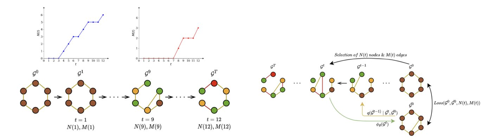
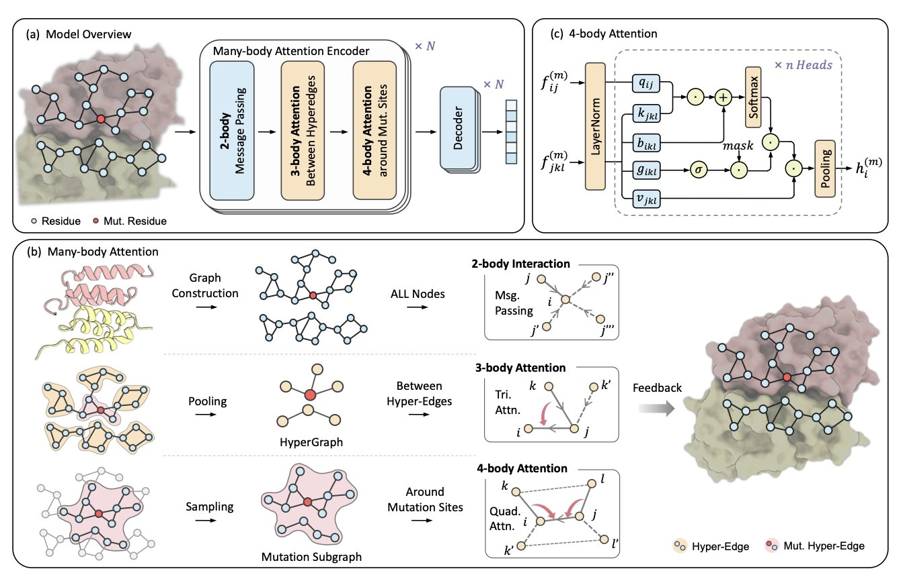
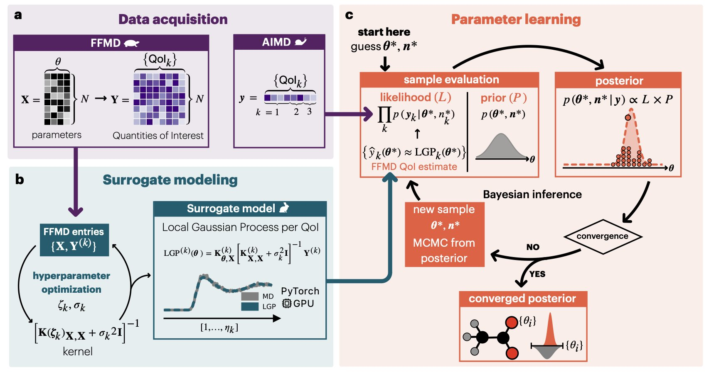
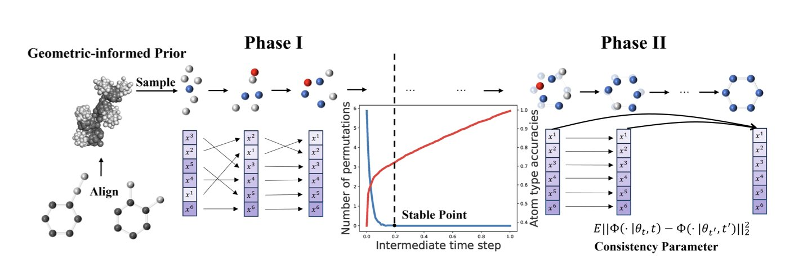
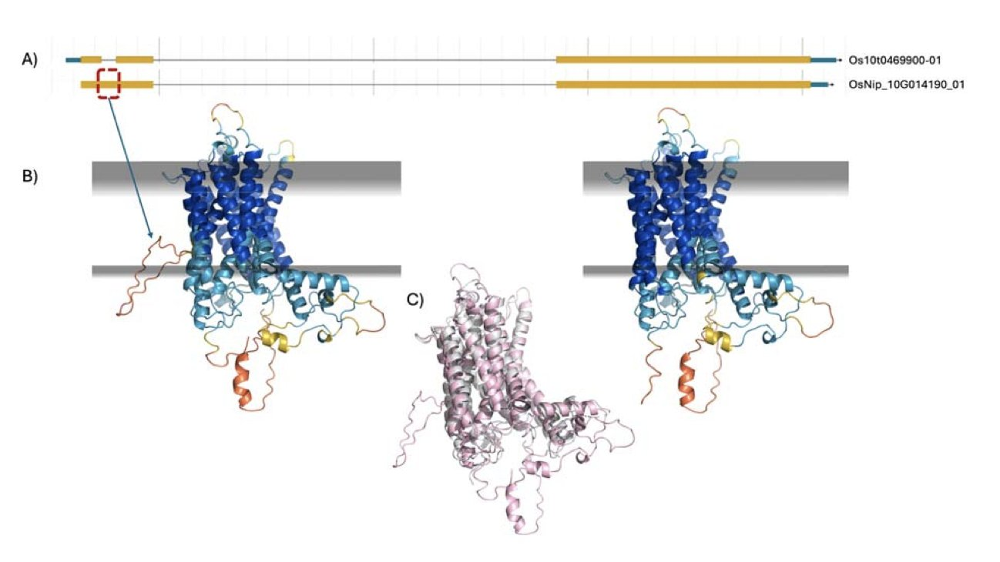

## 目录  
1. DMol 通过图扩散模型和基序压缩技术，将分子生成速度提升 10 倍，同时保留了关键化学基序，在效率和化学合理性上表现出色。
2. H3-DDG 模型通过模拟蛋白质内部多层次、多体间的复杂相互作用，实现了对蛋白质突变后结合自由能变化（∆∆G）的精准预测，尤其在多点突变场景下表现卓越。
3. 贝叶斯学习框架为分子力场优化提供了新思路，通过概率方法提升准确性与稳健性，尤其能更好地描述带电荷的复杂生物系统。
4. MolTD 模型通过优化原子排列和特征调整，将 3D 分子生成速度提高了近百倍，同时保证了高质量的分子结构。
5. AlphaFold 3 的结构预测评分能有效区分基因模型的优劣，为缺乏实验数据的基因组注释提供了一个新工具。

## 1. DMol：10 倍速生成分子并保留关键化学基序  
  
  

药物发现领域持续寻找更快、更好的新分子设计方法，其中生成模型提供了新的可能。图扩散模型（graph diffusion model）是当前的热点，但普遍存在生成速度过慢的问题。一个分子从无到有需要数百甚至上千步扩散，对于需要筛选海量分子的药物研发，这是一个效率瓶颈。  
  
DMol 平台旨在解决此问题。它的核心思路是在保证分子质量的同时，大幅减少扩散步骤。DMol 将扩散步骤减少到几十步，比主流方法快了约 10 倍。  
  
实现这一目标的关键在于两项创新。  
  
首先，DMol 采用混合噪声添加方式。传统扩散模型通常随机地破坏分子图结构，再学习复原。DMol 结合了确定性（deterministic）和随机性（random）两种破坏方式，使模型能更好地控制扩散过程，从而在更少的步骤里学会生成合理的分子。  
  
其次，「基序压缩」（motif compression）技术。分子由许多具备特定功能的化学基序（motif）构成，如苯环、羧基。这些基序决定了分子的基本性质。  
  
DMol 识别出这些化学基序，将它们「压缩」成一个「超级节点」（supernode）。在扩散模型中，一个复杂的苯环和一个普通的碳原子节点在处理上没有太大区别。这样，模型在生成分子骨架时，这些重要的功能团可以保持完整。最后，模型再将这些「超级节点」解压，还原成原始的基序结构。  
  
该方法简化了模型的学习任务，提升了计算效率，也保证了生成分子的化学合理性。实验结果在 QM9 和 MOSES 等行业标准数据集上验证了这一点。DMol 生成的分子在有效性、独特性和新颖性上表现优异，其类药性（QED）等指标比现有模型 DeFoG 和 DiGress 高出 4%。  
  
此外，DMol 支持基于分子骨架的条件生成。研究者可以指定一个核心骨架，让模型在此基础上「生长」出具备特定性质的新分子，这在药物优化中很有用。  
  
DMol 为分子生成过程提升了速度，并通过基序压缩技术保证了化学的准确性。这种兼顾速度和质量的工具对一线研发人员很有吸引力。  
  
📜Title: DMol: A Highly Efficient and Chemical Motif-Preserving Molecule Generation Platform  
🌐Paper: https://openreview.net/pdf/0f1d8aa866eb76c5f8a65f0847079723262ef2aa.pdf  

## 2. AI 精准预测蛋白质突变，H3-DDG 模型革新药物设计  
  
  

预测蛋白质突变引起的结合自由能变化（∆∆G）是蛋白质工程和药物研发中的核心难题。单个氨基酸的替换，就可能改变蛋白质的结合能力，决定药物分子的成败。传统计算方法难以处理蛋白质内部复杂的相互作用网络，尤其在多个氨基酸同时突变时。  
  
研究者开发了名为 H3-DDG 的新计算框架来应对这个挑战。该方法将蛋白质视为一个多层次的复杂系统。  
  
H3-DDG 首先构建一个超图（hypergraph）来表示蛋白质结构。超图能够描述更高阶的相互作用，例如一个水分子连接两个氨基酸残基形成的氢键网络，或几个芳香环堆叠形成的π-π相互作用。这好比从二维的社交网络图谱升级到能展示多人小团体互动的立体模型，信息更丰富。  
  
接着，模型采用分层多体注意力机制（hierarchical many-body attention），在不同尺度上审视突变带来的影响。它既能聚焦于突变位点周围几埃（Å）范围内的化学环境变化，也能观察这个局部变化如何通过相互作用链，影响到几十埃外的另一个功能区域。准确预测多点突变需要兼顾局部精细结构和全局长程效应，因为多个突变的影响并非简单相加。  
  
H3-DDG 的预测能力在多个行业标准数据集上得到验证。在 SKEMPI v2 数据集上，其预测结果与实验数据的皮尔逊相关系数达到 0.75，在多点突变预测方面，比之前最好的方法提升了 12.10%。在更具挑战性的 BindingGYM 数据集上，性能提升高达 34.26%。  
  
为了证明模型设计的合理性，研究者进行了一系列拆解实验（ablation studies）。结果显示，移除多体注意力机制后，模型的预测准确性会下降 5.4%，说明精确捕捉氢键网络这类高阶相互作用对模型的成功至关重要。  
  
理论上的成功需要落实到应用。研究者将 H3-DDG 用于优化针对新冠病毒（SARS-CoV-2）的抗体。模型的预测可以筛选出能增强抗体与病毒刺突蛋白结合力的突变，为设计更有效的治疗性抗体提供了指导。这展示了 H3-DDG 在加速药物发现和蛋白质工程领域的潜力。  
  
研究者也指出，H3-DDG 还需在更大规模的数据集上检验，并与高通量实验工作流结合，以便在多样化的真实研发场景中发挥作用。  
  
📜Title: Accurately Predicting Protein Mutational Effects via a Hierarchical Many-Body Attention Network  
🌐Paper: https://openreview.net/pdf/d224adc934a88117d29e0bbc68a2334d4b96fdbb.pdf  

## 3. 贝叶斯学习：分子力场的未来？  
  
  

分子模拟的根基是力场。传统的力场开发依赖经验和试错，过程不透明，结果常不理想，处理复杂生物大分子时尤其如此。一项新研究提出了一个贝叶斯学习框架，让力场开发更科学、透明。  
  
该方法将力场参数和实验数据都视为概率分布，从而量化了模型的不确定性。最终得到一系列可能的参数组合及其对应概率，如同观看一部记录系统所有可能状态的影片，而不是一张静态照片。  
  
研究者们使用 18 个有生物学意义的分子片段，包括蛋白质、核酸和脂质的组成部分，来展示该框架的能力。他们发现，优化后的参数在描述带电荷体系时，表现优于现有力场。  
  
为了证明方法的实用性，他们模拟了钙离子与心肌肌钙蛋白的结合过程，这是心脏收缩的关键步骤。传统模拟难以准确捕捉此相互作用。贝叶斯方法提供了更准确的模拟结果，并通过多组参数集揭示了模型预测的稳健性和可变性。  
  
为解决概率方法带来的高计算量，研究者引入机器学习中的局部高斯过程来加速贝叶斯推理，使该方法在计算上能够处理复杂的大分子体系。  
  
可迁移性是药物研发的关键。研究证实，从小分子片段优化得到的参数，可以成功迁移到更大的生物分子系统中。他们通过模拟水溶液和蛋白质 - 配体相互作用验证了这一点，展示了该框架的应用前景。  
  
📜Paper: Bayesian Learning for Accurate and Robust Biomolecular Force Fields  
🌐Paper: https://arxiv.org/abs/2511.05398v1  

## 4. 3D 分子生成大提速：MolTD 模型效率提升近百倍  
  
  

药物发现需要快速获得高质量的 3D 分子结构。当前生成模型在处理分子三维几何结构时，速度是一个瓶颈。清华大学一个团队开发的新方法 MolTD，加速了这一过程。  
  
3D 分子生成的速度瓶颈在于确定原子排列顺序，之后才能精修其坐标和化学特征。  
  
MolTD 将生成过程拆分为两步来加速。  
  
第一步，原子排列 (*Permutation*)。模型不再从零开始预测，而是参考数据集中有代表性的分子结构。这种「几何信息先验」 (*geometric-informed prior*) 帮助模型更快规划原子的大致位置，形成稳定的分子骨架，减少了达到稳定结构所需的计算步数。  
  
第二步，特征调整 (*Adjustment*)。分子骨架搭建完成后，需要精修每个原子的细节。研究者为此设计了「一致性参数目标函数」 (*consistency parameter objective*)，这项技术让原子特征的调整过程更快、更准。  
  
在 QM9 和 GEOM-DRUG 数据集上，MolTD 仅用 10 个采样步骤就达到了顶尖性能，速度比之前的模型快约 7.5 倍，比主流扩散模型快近 100 倍。这一速度提升对需要大规模生成和筛选分子的药物研发意义重大。  
  
MolTD 的适用性广，在从头药物设计或基于靶点结构的药物设计任务中，都能用更少的计算量取得更好的效果，展现了它在药物发现和新材料设计等真实世界应用中的潜力。  
  
📜Title: Accelerating 3D Molecule Generative Models with Trajectory Diagnosis  
🌐Paper: https://openreview.net/pdf/9b6d2adfb4ba64950f7ce5bdfa7c078e3013c8a7.pdf  
💻Code: https://github.com/GenSI-THUAIR/MolTD  

## 5. AlphaFold 评分，基因模型的新「金标准」？  
  
  

基因组注释，就是在长长的 DNA 序列上，标出基因的位置和边界。自动化流程速度快，但常出错；人工校正则相反，虽准确却极慢，面对海量的新物种测序数据，力不从心。  
  
一种新思路利用了生物学的基本原理：正确的基因模型，其翻译出的氨基酸序列能折叠成稳定的蛋白质三维结构；错误的模型则会产生一串无法稳定折叠的多肽链。AlphaFold 正好可以用来判断蛋白质结构的好坏。  
  
**用结构预测来做「裁判**」  
  
研究人员在三种真菌和原生动物上验证了这个想法，这些物种拥有大量专家手动校正的基因数据。他们将机器自动生成的基因模型与专家精修过的模型进行对比，让 AlphaFold 3 分别预测它们对应的蛋白质结构并打分。  
  
结果显示，AlphaFold 3 的评分倾向于专家精修过的模型。  

这相当于用蛋白质能否正确折叠这一物理化学原理，作为评判基因注释质量的标准，其判断与人类专家高度一致。  
  
**组合拳效果更好**  
  
将 AlphaFold 3 与结构比对工具 Foldseek 结合，可以进一步提升筛选基因模型的精确度。  
  
工作原理如下：  
1.  **AlphaFold 3 负责打分**：评估氨基酸序列能否折叠成合理的结构。  
2.  **Foldseek 负责比对**：将预测的结构与已知的蛋白质结构数据库进行比对，寻找相似结构。  
  
如果一个基因模型翻译出的蛋白质，既能获得 AlphaFold 高分（结构合理），其结构又能被 Foldseek 在数据库中找到相似的同源物，那么这个模型正确的可能性就很高。这个组合策略，好比鉴定一件文物，既要看其自身工艺，也要考证其风格出处。  
  
**挑战依然存在：无序区域**  
  
此方法的主要挑战来自蛋白质的固有无序区域（Intrinsically Disordered Regions, IDRs）。  
  
这些区域在生理状态下本就没有固定的三维结构。AlphaFold 旨在寻找稳定结构，因此在预测这类区域时会给出低分。这可能导致一个正确的基因模型，仅因其编码的蛋白质包含大段 IDR，而被错误地判定为低质量。  
  
如何让模型区分「无法折叠的错误序列」和「本身就无序的正确序列」，是下一步需要解决的关键问题。  
  
对于海量缺少人工校正的新测序基因组，这种基于蛋白质结构的自动化评估方法，有望提升基因数据的整体质量。高质量的基因数据是后续所有功能研究，包括药物靶点发现的基础。  
  
📜Title: The Promise of AlphaFold for Gene Structure Annotation  
🌐Paper: https://www.biorxiv.org/content/10.1101/2025.10.21.683479v1
