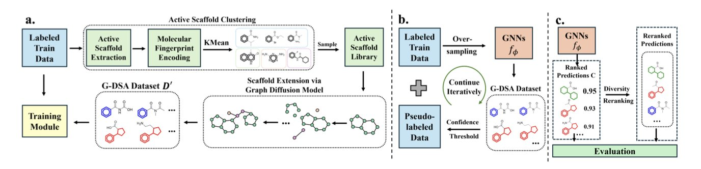
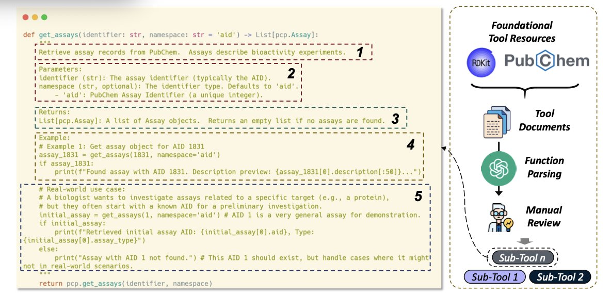
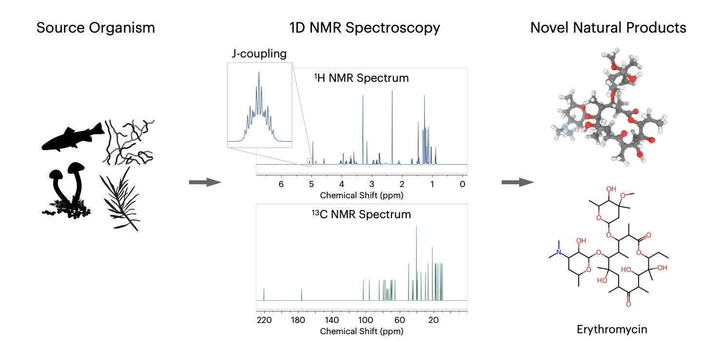
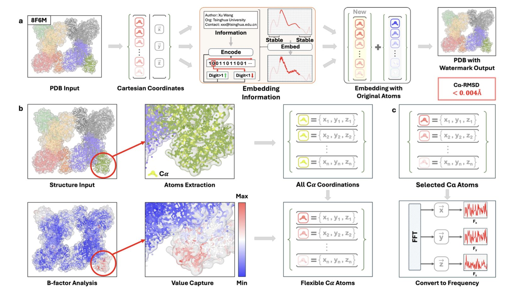
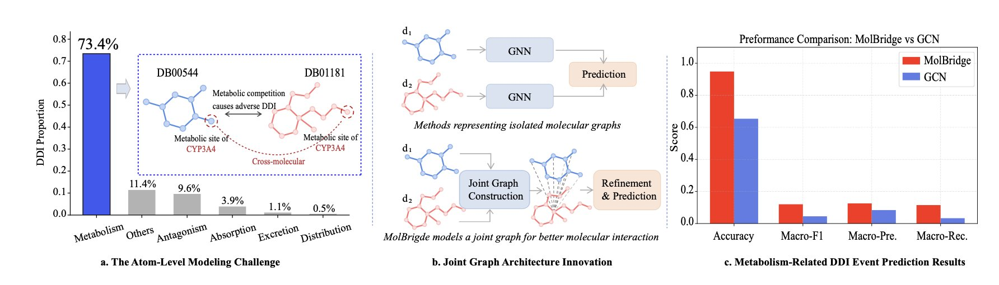

## Table of Contents
1. The ScaffAug framework uses generative AI to intelligently augment data for rare chemical scaffolds and then reranks the results, providing more diverse, high-quality candidate molecules for drug discovery.
2. The ChemOrch framework addresses the lack of specialized data for large language models in chemistry by generating high-quality, diverse chemical task instructions, improving the models' ability to handle chemistry problems.
3. Deep learning again shows its potential to solve classic chemistry problems. The CHEFNMR model can directly generate a molecule's 3D structure from its 1D NMR spectrum and chemical formula, with an accuracy of over 65%.
4. StrucTrace adds a traceable, reversible, and function-preserving digital watermark to biomolecules like proteins by making subtle adjustments to their structure in the Fourier domain.
5. MolBridge creates an atom-level joint graph to directly model interactions between drugs, improving the accuracy and mechanistic interpretability of drug-drug interaction (DDI) predictions.

## 1. ScaffAug: AI-Driven Virtual Screening That Focuses on Scaffold Diversity

Virtual screening often runs into a problem: after processing millions of molecules, the top-ranking hits tend to have very similar chemical scaffolds. It's like casting a net and only catching one type of fish. This limits the chance of discovering entirely new molecules and can create problems for patenting.

The ScaffAug framework was designed to solve this problem. It gets to the root of the issue by focusing on the diversity of chemical scaffolds.

The whole process has three steps.

The first step is **smart data augmentation**.
When a database has too few molecules with a promising active scaffold, it's hard for a model to learn its features. ScaffAug uses a Graph Diffusion Model to fix this. You just input a rare scaffold, and the model keeps the core structure intact while "decorating" it with various plausible side chains. This generates a batch of new molecules that all share that scaffold. This solves two problems: "class imbalance," where there are too few active molecule samples, and "structural imbalance," where there are too few samples of a valuable scaffold.

The second step is **careful self-training**.
How do you combine real data with AI-generated data to train a model? Just mixing them can introduce noise. ScaffAug uses a "self-training" strategy. First, it trains a preliminary model on real data. Then, it uses that model to assign "pseudo-labels" to the new AI-generated molecules, filtering for the most reliable ones. Finally, it combines these high-quality generated molecules with the original data to train the final model. It's like having an experienced master train an apprentice before they work together on the job.

The third step is **reranking to improve diversity**.
After the model screens molecules, it outputs a list ranked by predicted activity score. But the highest-scoring molecules might be structurally very similar. To address this, ScaffAug uses a reranking module based on the Maximal Marginal Relevance (MMR) algorithm. When selecting molecules, this module balances both the predicted score and structural differences, prioritizing molecules that have high predicted activity and a novel structure. It's like having a personal shopper with great taste who picks out things that are not only good but also aren't all the same style.

Researchers tested ScaffAug on five drug targets. The results showed that it finds more active compounds of greater variety than existing methods.

The use of generative AI in drug discovery is shifting from "creating from nothing" to "customizing on demand." It can serve as a precision tool to solve specific and critical bottlenecks in the development pipeline. This method of providing diverse, high-quality candidate molecules is highly valuable to frontline researchers.

📜Title: Scaffold-Aware Generative Augmentation and Reranking for Enhanced Virtual Screening
🌐Paper: https://arxiv.org/abs/2510.16306v1

## 2. ChemOrch: Training Large Language Models for Chemistry with Synthetic Data

Large Language Models (LLMs) have shown powerful abilities in many fields, but in highly specialized areas like chemistry, they often perform poorly due to a lack of high-quality training data. It's like asking a literature student to solve an organic chemistry problem—the outcome is predictable.

The ChemOrch framework was created to give LLMs a proper chemistry education. Its core idea is simple: if high-quality, real-world chemistry data is rare and expensive, just create it yourself.

**How ChemOrch Works**

The framework is designed in two steps.

The first step is **task-controlled instruction generation**. Researchers first define various types of chemistry tasks, such as predicting molecular properties, analyzing chemical reactions, or describing molecular structures. Then, they have a powerful base model (like GPT-4) use preset templates to generate thousands of specific and diverse chemistry questions. This is like giving the model a guide to write its own chemistry question bank, allowing it to control the difficulty and scope of the questions.

The second step is **tool-aware answer construction**. Questions aren't enough; you also need correct answers. In chemistry, many answers require precise calculations or queries to specialized databases. Having an LLM generate answers directly can lead to errors. So, ChemOrch introduces the concept of "tools." Before answering a question, the model plans which specialized chemistry tools to use (like software libraries for molecular structure conversion or property calculation), executes them to get an accurate result, and then integrates that result into a fluent, natural-language answer. This process includes a "self-repair" step: if a tool fails, the model tries to fix the problem and run it again until it gets the right answer.

**How well does it work?**

The results show this method is effective. Compared to existing chemistry instruction datasets, the data generated by ChemOrch is superior in both diversity and chemical validity. Researchers used two metrics, APS and Remote-Clique, to measure data diversity, and the scores showed that ChemOrch's data has broader coverage and avoids concentrating on just a few types of questions.

After using this synthetic data to fine-tune existing LLMs, their chemistry capabilities improved. Whether predicting molecular solubility, describing molecular structures, or answering various chemistry questions, the models trained with ChemOrch performed better.

**This is more than just a data generator**

Another important value of ChemOrch is that it can serve as an evaluation framework. By generating specific types of chemistry tasks, including ones that are rare in current datasets, researchers can pinpoint exactly where an LLM is lacking. This points the way for future model improvements, making the entire process scalable and efficient.

ChemOrch is like an experienced chemistry tutor. It can write a custom, high-quality textbook and workbook for an LLM, and also give it mock exams to find and fix its weak spots.

📜Title: ChemOrch: Empowering LLMs with Chemical Intelligence via Synthetic Instructions
🌐Paper: https://openreview.net/pdf/23e4294ab38fe1690b33c8e77141dc83898cdfc4.pdf

## 3. A New Way for AI to Read NMR: The CHEFNMR Atomic Diffusion Model

For chemists in drug development, determining the structure of an unknown compound, especially a complex natural product, is a delicate challenge. Nuclear Magnetic Resonance (NMR) is one of the most powerful tools for structure elucidation, but interpreting the spectra is time-consuming, difficult, and relies heavily on specialized experience. Researchers at the Mittermaier lab and Stanford University have developed an AI tool called CHEFNMR to help automate this process.

The goal of the method is to feed the AI model a 1D NMR spectrum and the compound's molecular formula, and have the model directly generate the molecule's 3D structure.

To achieve this, the researchers used a technique called an "atomic diffusion model." The process starts with a random cloud of atoms. The model then gradually guides these atoms into their correct positions within the molecule, eventually forming a stable 3D structure. A non-equivariant Transformer architecture guides this process, learning the complex relationship between the spectral data and the spatial positions of the atoms.

Training an AI model requires a huge amount of data. Because existing datasets were either too small or contained overly simple molecules, the research team created SpectraNP. This dataset includes over 110,000 natural product structures and their corresponding simulated 1D NMR spectra, providing the necessary foundation to train CHEFNMR.

When dealing with complex natural products, CHEFNMR's accuracy exceeds 65%, outperforming all previous methods. It also demonstrates good "zero-shot generalization" when processing real experimental NMR data, meaning it can make reliable predictions without having previously seen experimental data for that specific molecule.

Ablation studies in the research confirmed the effectiveness of the model's design. The results showed that a convolutional tokenizer and a smooth LDDT loss function were critical for improving the model's performance.

CHEFNMR offers a new path toward automating molecular structure elucidation. While it can't completely replace chemists yet, it will become a powerful assistant, speeding up the discovery and development of new drugs.

📜Title: Atomic Diffusion Models for Small Molecule Structure Elucidation from NMR Spectra
🌐Paper: https://openreview.net/pdf/c657f3724243fdae6e7cfbbfd793eba4aae2eeb6.pdf

## 4. StrucTrace: A Traceable Watermark for Biomolecular Assets

A well-designed protein structure is a core asset in drug development and biotechnology. As these assets are shared digitally, especially with the rise of AI-designed proteins, it has become hard to protect and prove their origin.

The StrucTrace framework offers a solution: adding a digital watermark to 3D biomolecular structures. The idea is similar to adding copyright information to a picture, but the challenge is that it must be done at the atomic scale without disrupting the molecule's biological function.

StrucTrace's method operates in the Fourier domain. Directly adjusting atomic positions would risk damaging critical functional areas like active sites, so the researchers took a more subtle approach.

A protein's 3D structure can be viewed as a spatial signal. The researchers convert it into the Fourier domain, turning it into a series of waves at different frequencies. They then add a specific, weak, high-frequency signal to this spectrum as a digital watermark. Finally, they convert the watermarked spectrum back into 3D space.

The benefit of this is that the watermark information is distributed throughout the entire molecular structure, causing only tiny disturbances to the positions of individual atoms.

StrucTrace only perturbs atoms on the protein backbone that are already flexible. These regions naturally move and wiggle, so the tiny adjustments fall within the range of normal fluctuations. It's like making a nearly inaudible change to the background strings in a symphony—the main melody and rhythm are unaffected. This protects the functional core of the molecule. The encoding process is deterministic, and decoding achieves 100% bit accuracy.

The researchers validated this on a large scale with over 10,000 protein structures. The results showed that the structural deviation (RMSD) after adding the watermark was below the margin of error for biological experiments. Thermodynamic and kinetic analyses also confirmed that the molecule's function and stability were not affected. The embedded watermark could be read accurately.

This technology provides an infrastructure for managing biomolecular assets. The authors propose a three-layer framework for academia (source tracking), industry (security and confidentiality), and business (licensing and authorization).

In the future, the PDB file for an AI-generated therapeutic antibody or an engineered enzyme could contain an embedded digital identity. This would allow you to know which institution or AI model it came from, and who has the right to use or modify it.

This provides a foundation for resolving intellectual property ownership and building a trustworthy AI ecosystem, turning biomolecules into traceable and auditable digital assets.

📜Title: StrucTrace: Fourier Watermarking for Traceable Bio-molecular Assets
🌐Paper: https://www.biorxiv.org/content/10.1101/2025.10.18.683214v1

## 5. MolBridge: A New Paradigm for Predicting Drug Interactions with Atomic Graphs

Predicting Drug-Drug Interactions (DDIs) is a difficult problem in drug development. When two drugs are used together, they might increase efficacy or cause toxicity, and the metabolic mechanisms behind this are complex. Past computational models typically analyzed the features of two drugs separately and then tried to infer how they would affect each other. This is like trying to judge if two people will be friends based only on their personality profiles, which misses key information about how they actually interact.

The MolBridge framework takes a different approach: to predict how two drugs will interact, you have to look at them together.

It merges the atomic structures of two drug molecules to build a "Joint Graph." In this graph, all atoms are nodes, and the model can directly learn at the atomic level how an atom from one molecule influences an atom from the other.

Graph Neural Networks (GNNs) are well-suited for handling this kind of graph data, but they suffer from a problem called "over-smoothing." This is like repeatedly adding filters to a photo until all the details become blurry and the pixels start to look the same. After many layers of information passing in a GNN, the features of different nodes can become too similar, causing the model to lose critical local information from the molecular structure.

To fix this, MolBridge introduces a "Structure Consistency Module" (SCM). It acts like an image processor that, while the GNN is refining features, also references the original global structure of the molecules. This way, the SCM preserves the local interaction information captured by the GNN while maintaining the overall structure of the molecules, preventing key features from being "smoothed out."

On two well-recognized benchmark datasets, MolBridge performed better than existing top models. It is particularly good at handling "long-tail" scenarios, meaning it can predict interactions for uncommon or data-sparse drug combinations. This is important for clinical safety, as dangerous drug interactions are often unexpected.

MolBridge's interpretability is another advantage. It doesn't just predict that two drugs will interact; it can also highlight the key parts of the molecular structures that are responsible for the interaction. For example, the model can identify functional groups like N-nitrosourea as key drivers of a specific DDI. This kind of insight is valuable for medicinal chemists, as it can guide them in modifying molecular structures to avoid risks and design safer drugs.

📜Title: MolBridge: Atom-Level Joint Graph Refinement for Robust Drug-Drug Interaction Event Prediction
🌐Paper: https://arxiv.org/abs/2510.20448v1
