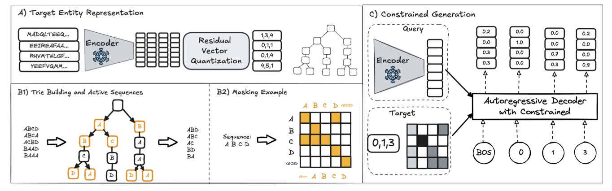
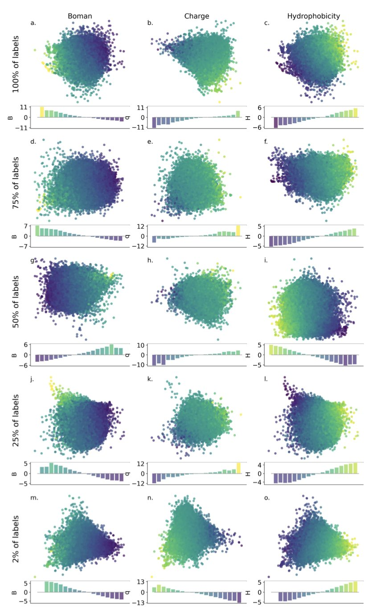
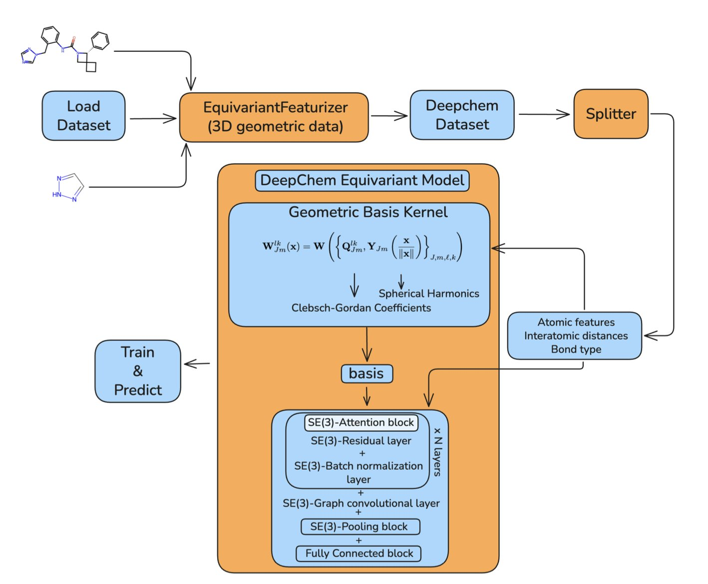
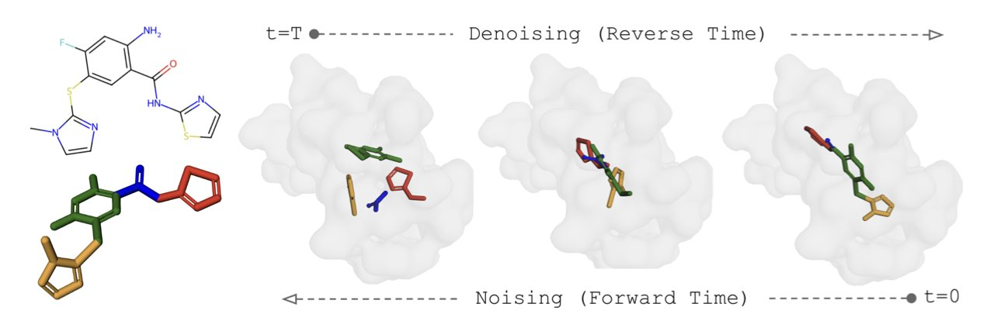
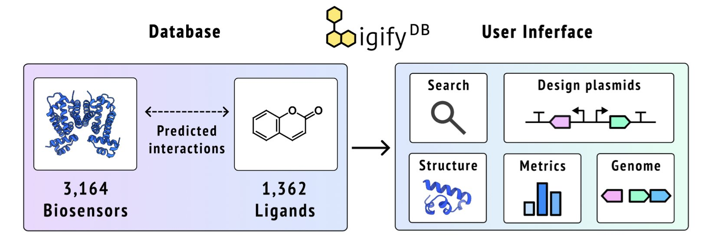
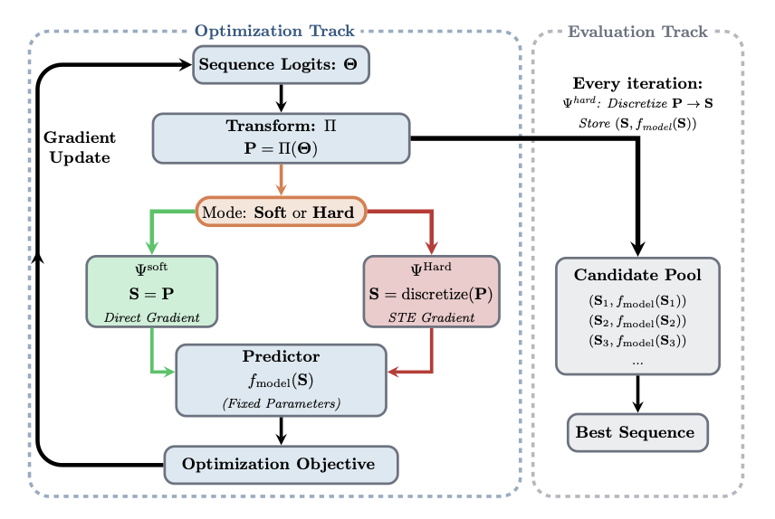

## 目录  
1. BioCG 将生化反应预测转化为一个有明确选项的生成任务，提升了模型在真实世界场景中的准确性和效率。
2. 在数据稀疏的情况下，先用 PCA 降低 VAE 潜空间的维度，再进行贝叶斯优化，是一种发现新抗菌肽的高效策略。
3. DeepChem 内置 SE(3) 等变神经网络，简化了分子的 3D 几何结构处理，让高级建模更易用、更可靠。
4. SIGMADOCK 采用基于片段的 SE(3) 扩散模型，将配体分解为刚性片段进行对接，提升了分子对接的准确性和效率，其性能超越了现有方法。
5. LigifyDB 是一个交互式预计算数据库，它系统性地预测了转录因子与小分子的相互作用，为快速开发生物传感器提供了新工具。
6. ID3 框架利用梯度优化设计离散的 mRNA 序列，解决了关键约束，效率超越传统方法。

## 1. BioCG：用生成式 AI 预测生化反应  

    

在药物研发中，预测分子间的相互作用，例如药物与靶点蛋白的相互作用（DTI）或药物间的相互作用（DDI），是一个核心挑战。过去的 AI 模型通常在巨大的可能性空间中寻找答案，这种方式常导致模型产生现实中不存在的「幻觉」结果。  

BioCG 模型采用了一种新的方法。  

研究者将所有已知的蛋白和药物构建成一个「答案库」，将预测任务重新定义为从有限选项中选择正确答案的生成任务。这保证了模型的任何输出都是一个真实存在的生化实体。  

为实现这一构想，研究者开发了两项关键技术。  

第一项是**迭代残差矢量量化** (Iterative Residual Vector Quantization, I-RVQ)。它为每个已知分子（如靶点蛋白）分配一个由离散数字序列构成的唯一标识符。模型只需学习这个标识符，而非分子复杂的化学结构，降低了学习难度。  

第二项是 **trie 树引导的约束解码**。该技术在模型生成标识符的过程中进行实时引导，确保每一步都朝向一个有效的答案。如果模型生成的序列前缀不存在于答案库中，该机制会立即纠正，使模型的计算资源集中于区分有意义的生化选项。  

这套新方法的表现出色。在经典的 BioSNAP DTI 测试中，当面对训练中未见过的蛋白质时，BioCG 的 AUC 指标达到 89.31%，比之前的最优方法高出 14.3%。这表明 BioCG 在接近真实研发场景的「冷启动」情况下具有更高的可靠性。  

此外，研究者还设计了一种信息加权的训练方法，让模型优先学习关键的决策点，从而在数据有限时也能高效学习。  

BioCG 的思路转变提升了预测准确性，并使 AI 模型的生成过程更加可靠，其输出的每一步都有据可查，这在严谨的药物发现领域很有价值。  

📜**Title**: BioCG: Constrained Generative Modeling for Biochemical Interaction Prediction  
🌐**Paper**: https://openreview.net/pdf/e888694d2a8f7af2d08c2e095aab2d544eaae072.pdf  

## 2. PCA 压缩潜空间：AI 设计抗菌肽的新思路  

  

药物发现需要在一个巨大的化学空间中搜寻。以抗菌肽（Antimicrobial Peptides, AMPs）为例，几十个氨基酸的排列组合，其数量比宇宙中的原子还多。在这里寻找有效分子，如同大海捞针。  

近年来，使用生成式 AI 模型，特别是变分自编码器（Variational Autoencoder, VAE），来绘制这个化学空间的「地图」成为一种趋势。VAE 能将庞大的肽序列空间压缩成一个低维、连续的「潜空间」（Latent Space），可以理解为一张浓缩了所有肽序列信息的地图。理论上，只要在这张地图上找到「宝藏」的位置，再解码回具体的肽序列，就完成了分子设计。  

接下来的问题是如何在这张地图上高效寻宝。一种常用方法是贝叶斯优化（Bayesian Optimization）。它像一个探险家，每在一个点测试一次（做一次实验），就会根据结果更新对整张藏宝图的认知，然后决定下一个最值得探索的点。  

但 VAE 生成的「地图」维度过高，地形复杂。让贝叶斯优化直接在上面运行，就像在云雾缭绕的巨大山脉里寻找最高峰，容易迷路，效率不高。  

研究者使用主成分分析（Principal Component Analysis, PCA）来简化这张复杂的地图。PCA 的作用，好比把一张复杂的三维地形图拍扁成二维平面图，同时保留了山脉走向、主峰和山谷等关键信息。研究者先用 PCA 处理 VAE 生成的高维潜空间，将其压缩成维度更低、结构更简化的「投影空间」，然后让贝叶斯优化在这个简化版地图上寻宝。  

这种方法有几个优点。首先，搜索空间变小，优化算法的运行速度和找到全局最优解的可能性都得到提升。  

其次，这个方法解决了药物发现中标记数据稀缺的核心问题。测试一个分子的活性耗时费钱。如果只有少量活性数据，VAE 学到的潜空间地图质量可能不高，导致不同分子混杂，结构混乱。  

研究发现，可以使用电荷、疏水性等易于计算的物理化学性质，来预先为潜空间「划定区域」。这就像在地图上预先标注出「水源区」、「森林区」和「沙漠区」。即便不知道宝藏的具体位置，这些基本参照也能让寻宝更有方向。实验证明，使用「电荷」这一性质来组织潜空间，后续的贝叶斯优化表现最好。  

该策略在只有 2% 标记数据的条件下依然有效。  

在 PCA 投影空间里搜索，模型还表现出更强的探索性。它不会只在一个看似不错的区域深入挖掘，而是更愿意探索未曾到过的新区域。在药物发现早期，理想的结果是发现几个结构各异、具备潜力的候选分子家族，而不是大量结构相似但效果平平的分子。这种更广泛的探索，增加了发现全新分子骨架的机会。  

这项工作表明，AI 制药的进步不只依赖于更大、更复杂的模型。结合 PCA 这类经典统计工具对 AI 生成的表征空间进行预处理，并利用基本的化学知识（如物理化学性质），可以用更少的实验数据高效解决问题。这种思路对资源有限的团队或新靶点探索项目很有价值。  

📜Title: Semi-supervised latent Bayesian optimization for designing antimicrobial peptides  
🌐Paper: https://arxiv.org/abs/2510.17569  

## 3. DeepChem 集成 SE(3) 等变网络，赋能 3D 分子建模  

  

在分子模拟和药物发现中，处理分子的三维空间信息是一大挑战。分子的物理属性（如能量、偶极矩）不应随其在空间中的旋转或平移而改变，但许多机器学习模型无法理解这一定律。当输入一个旋转后的分子坐标时，模型可能将其误判为新分子，导致预测结果偏差。  

为此，开源库 DeepChem 集成了 SE(3) 等变神经网络（SE(3)-Equivariant Neural Networks）。  

SE(3) 是描述三维空间旋转与平移的数学语言。「等变」指当输入分子旋转时，网络学习到的原子化学环境等特征，也会以可预测的方式随之旋转。最终，模型能对能量这类不随旋转变化的属性，给出一致的预测。模型的架构本身就遵循了物理定律。  

新模块的核心技术是球谐函数（spherical harmonics）和不可约表示（irreducible representations）。球谐函数好比在球面上描述形状的基石，类似于傅里叶变换用正弦波和余弦波构建信号。网络借此高效编码和处理原子周围的 3D 空间信息，并保证其在坐标变换下行为正确。DeepChem 实现了 SE(3)-Transformer 和张量场网络（Tensor Field Networks）等经典模型，并将其模块化，让非深度学习专家也能调用。  

研究者在标准的小分子量子化学属性预测数据集 QM9 上进行了测试。结果显示，DeepChem 中模型的性能与该领域的顶尖方法相当，证明了代码实现的质量。模型还融合了注意力机制，能更好地捕捉原子间的相互作用。  

未来的优化方向包括引入 LieConv 提升计算效率，以及通过缓存预计算的基函数来加速训练。这些工程考量体现了对实际应用中计算效率和可扩展性的重视。  

📜Title: DeepChem Equivariant: SE(3)-Equivariant Support in an Open-Source Molecular Machine Learning Library  
🌐Paper: https://arxiv.org/abs/2510.16897  

## 4. SIGMADOCK：用片段扩散模型革新分子对接  

  

分子对接是药物发现的基石，它寻找能与蛋白质靶点结合的药物分子。传统对接方法，无论是基于物理力场还是深度学习模型，都面临配体分子柔性的挑战。配体分子拥有多个可旋转的化学键，构象空间（Conformation Space）庞大复杂。  

为解决这个问题，一些模型尝试一次性生成整个分子的三维坐标，但难度高，效果不佳。另一些模型考虑了分子的可旋转键，但在处理扭转角度时，扩散过程复杂且训练动态不稳定。  

SIGMADOCK 提出新思路，将配体拆分为多个内部结构固定的刚性片段，简化了问题。SIGMADOCK 对这些片段应用 SE(3) 黎曼扩散模型。该模型首先将片段随机放置在蛋白靶点周围，然后逐步引导它们到达正确的位置和朝向。这个过程利用几何先验知识，使学习过程更高效稳定。  

该方法的优势在于，通过分解配体减少了需要处理的自由度，显著降低了计算复杂度。在 PoseBusters 测试集上，模型的 Top-1 成功率达到 79.9%，这意味着它预测的最优构象在多数情况下最接近真实结构。这一成绩不仅超越了其他深度学习方法，也优于一些经典的物理对接软件。  

SIGMADOCK 的学习效率很高，它使用较少的训练数据和计算资源就达到了高性能，并对未见过的蛋白质靶点表现出良好的泛化能力。这证明了其方法的可行性与高效性，为深度学习在药物发现领域的应用可靠性树立了新标杆。  

📜Title: SIGMADOCK: Untwisting Molecular Docking with Fragment-Based SE(3) Diffusion  
🌐Paper: https://arxiv.org/abs/2511.04854  

## 5. LigifyDB: 快速发现小分子生物传感器  

  

在合成生物学和代谢工程中，常需要一种能感知特定小分子并调控基因表达的「开关」，即生物传感器。寻找合适的生物传感器通常费时费力，充满试错，需要查阅文献或从头筛选。  

LigifyDB 这个新工具改变了这一现状。它像一个庞大的预计算「分子匹配目录」。  

这个目录的核心是小分子配体与转录因子（Transcription Factors, TFs）的对应关系。转录因子是一类能结合 DNA 特定位点、调控基因表达的蛋白质。当小分子配体与其结合，会改变其构象，进而影响其调控功能，这便是生物传感器的工作原理。  

为构建这个目录，研究团队从 Rhea 酶反应数据库出发，这是一个包含上万种已知生物化学反应的资源库。他们系统性地评估了其中的 10,965 种小分子，并使用 Ligify 工作流预测了可能与这些分子结合的转录因子。  

关键在于「预计算」。传统工具在你提交查询后才开始计算，需要等待。LigifyDB 则提前算好了 1,362 种小分子和 3,164 个转录因子的所有可能组合。就像一本释义已经写在旁边的字典，查询时只需翻到对应页面，即刻得到结果。  

LigifyDB 网站不只是一个数据列表。搜索一种小分子（如氨基酸），系统会返回可能与之结合的转录因子列表。点击其中一项，即可查看详细信息：  

平台还内置了质粒设计器。  

找到潜在传感器后，必须在实验室中验证。这个设计器能快速生成实验所需的报告质粒基因序列。用户可以选择启动子、报告基因（如绿色荧光蛋白 GFP），并自动插入强终止子等调控元件，以确保传感线路的稳定和模块化。设计完成后，可直接下载 GenBank 格式文件用于基因合成。这个功能连接了计算预测与实验验证。  

该数据库可以持续扩展。随着酶数据库更新和预测算法的进步，LigifyDB 的内容将更丰富和准确。对于需要为特定代谢物寻找传感器的研究者，它是一个宝贵的资源。  

📜Title: LigifyDB: An interactive platform for predicted small molecule biosensors  
🌐Paper: <https://www.biorxiv.org/content/10.1101/2025.10.20.683484v1>  

## 6. mRNA 优化新范式：梯度下降搞定序列设计  

  

设计一条稳定、高效表达的 mRNA 序列，就像在由 A、U、C、G 四个字母构成的天文数字般的密码本里寻找最优解。我们希望找到的序列既能高效翻译成目标蛋白质，又能保持自身稳定。遗传算法等传统方法如同蒙眼寻宝，效率有限，也无法保证找到的是最优解。  

ID3 框架为这个问题带来了新思路。  

#### 梯度下降如何处理离散的碱基序列？  

梯度下降 (Gradient-based methods) 是强大的优化工具，它像盲人下山，每一步都选择最陡峭的方向，从而高效找到谷底。但这个方法要求路面是连续平滑的「山坡」，而由离散碱基组成的 mRNA 序列则像一级级的「台阶」，无法直接计算梯度。  

ID3 框架的核心就是为这个盲人造了一个平滑的坡。  

它通过「解耦优化 - 评估」架构实现这一点。优化器直接调整每个位置上密码子出现的「概率分布」，而不是操作离散的 A/U/C/G 序列。例如，对于编码亮氨酸的位置，优化器会调整六种同义密码子各自出现的概率。这些连续的概率值构成了一个平滑的优化空间，让梯度下降得以应用。  

随后，评估模块根据这个概率分布，采样生成具体的、离散的 mRNA 候选序列。这些序列被送入现有的深度学习模型，预测其稳定性或表达效率。预测结果再反馈给优化器，指导下一步的概率调整。  

#### 如何确保蛋白质序列不「跑偏」？  

优化 mRNA 的同时，必须遵守一条铁律：最终翻译的氨基酸序列必须正确。如果为了提高 mRNA 稳定性，而错误地改变了编码的氨基酸，整个分子就失效了。  

为此，作者设计了三个约束机制：  

1.  **密码子配置文件约束 (Codon Profile Constraint**)：这是一种预设的偏好，用于引导优化器倾向于使用某些特定密码子。  
2.  **氨基酸匹配 Softmax (Amino Matching Softmax**)：这是关键防线。它强制将概率只分配给编码同一氨基酸的同义密码子，其他密码子的概率则设为零。这确保优化器只在允许的选项内选择，不会选错氨基酸。  
3.  **拉格朗日乘数 (Lagrangian Multipliers**)：这个数学工具通过引入惩罚项来处理硬性约束。任何试图改变氨基酸序列的优化行为都会受到惩罚，从而被修正。  

#### 为什么说它更好用？  

在优化 mRNA 可及性 (accessibility) 和密码子适应指数 (Codon Adaptation Index, CAI) 的任务中，ID3 的表现优于遗传算法和模拟退火等传统方法，能更快、更准确地找到全局最优解。  

ID3 框架可以直接与现有的深度学习预测模型对接，无需重新训练，降低了使用门槛，加速了实际应用。  

此外，ID3 框架具备严格的收敛性证明。在计算生物学中，许多算法虽然有效但缺乏理论支撑，而 ID3 的数学保证使其结果更可靠。  

ID3 框架为 mRNA 序列设计提供了高效、可靠的计算工具。它解决了离散序列与连续优化之间的矛盾，有望在 mRNA 疫苗和疗法开发中，加速发现表现优异的分子。  

📜Title: Gradient-based Optimization for mRNA Sequence Design  
🌐Paper: https://www.biorxiv.org/content/10.1101/2025.10.22.683691v1
