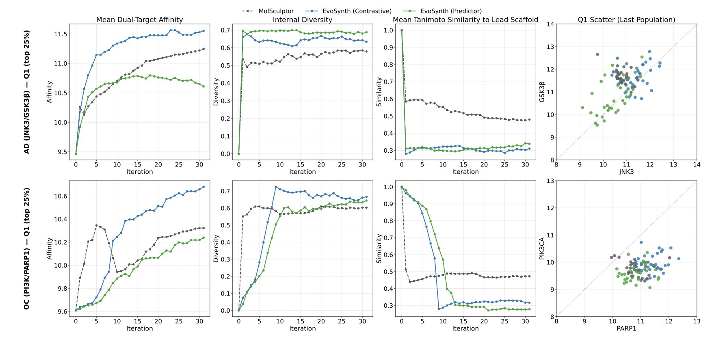
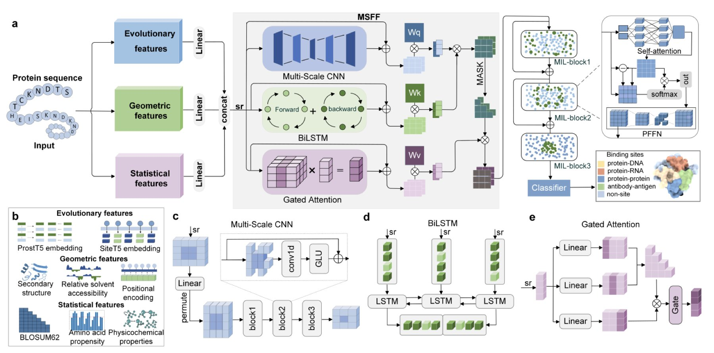
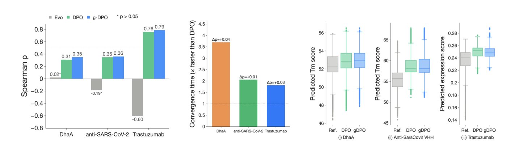
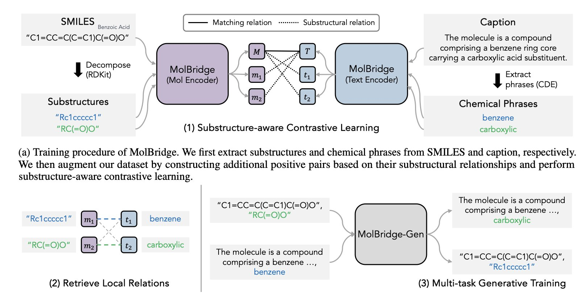
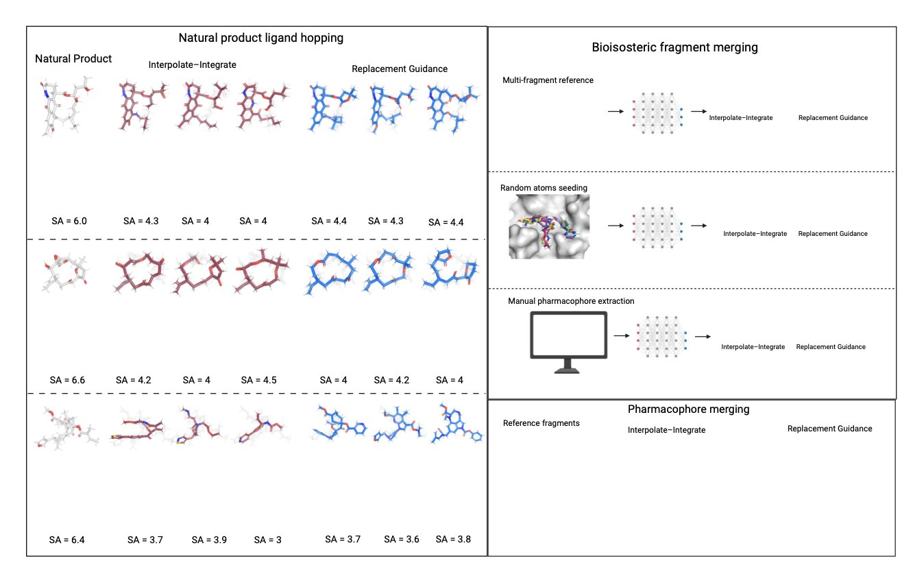

## Table of Contents
1. EVOSYNTH uses a unique evolutionary algorithm and synthesizability screening to design highly active, easy-to-produce drug candidates for multiple disease targets at once, solving the common problem of AI designing molecules that can't be made.
2. ProSiteHunter predicts various protein binding sites from sequence alone, combining a language model with multi-source features. It outperforms existing methods and can fill the gaps in AlphaFold3's predictions for flexible regions.
3. The g-DPO framework solves the scalability problem of preference optimization for protein language models through clustering and grouped approximation. It boosts training speed by nearly 4x while maintaining performance comparable to standard DPO.
4. By finely aligning molecules with their text descriptions at the substructure level, the MolBridge model improves an AI's ability to understand the complex relationships between them.
5. This paper introduces two methods to control generative models during inference. These allow flow-matching models to precisely design bioisosteres without retraining, making the process both efficient and flexible.

## 1. A New AI Framework for Multi-Target Drug Discovery: Balancing High Activity and Synthesizability

Multi-target drug discovery is a bit like a juggler tossing multiple balls at once. Traditional drug development focuses on one target at a time, but treating complex diseases like cancer or Alzheimer's requires hitting several spots simultaneously. AI tools can generate lots of molecules, but many of the designs either can't be made in a lab or lack activity once synthesized.

The EVOSYNTH framework was built to address this core conflict between a drug's activity and its real-world feasibility.

Its workflow has two steps.

The first step is to cast a wide net. Researchers built a "Latent Space" that encodes both the chemical structure of a molecule and its functional information related to target binding. Then, an Evolutionary Optimization algorithm "breeds" and "mutates" candidates within this space. Through repeated cycles, the algorithm keeps molecules that show high potential to bind to multiple targets, such as JNK3 and GSK3β, while discarding the ones that don't perform well. Because the search happens in a space where information has already been processed, the whole process is very efficient.

The second step is careful selection. From the large pool of candidates generated in the first step, EVOSYNTH activates its "Synthesis-Aware Prioritization" module. This module acts like an experienced chemist. It scores each molecule by analyzing its synthesis steps, the availability of starting materials, and the overall cost. Molecules with high theoretical activity but complex and expensive synthesis routes are eliminated. The ones that come out on top are strong performers in both activity and synthesizability.

Researchers applied the framework to two real-world cases: a dual-target approach for Alzheimer's disease (JNK3/GSK3β) and another for ovarian cancer (PI3K/PARP1). The results showed that compared to existing models like MolSculptor, EVOSYNTH generated molecules with better predicted binding activity, more diverse chemical scaffolds, and lower synthesis costs. This suggests its discoveries have the potential to become entirely new drugs, not just minor tweaks of existing ones.

The team also ran an ablation study. They removed some of the pharmaceutical property constraints from the algorithm, like ADMET (Absorption, Distribution, Metabolism, Excretion, and Toxicity). They found that the efficiency and quality of the evolutionary search dropped. This shows that introducing these practical constraints early actually guides the algorithm to find clinically viable paths faster.

The framework still has room for improvement. The researchers plan to expand it to design drugs for even more targets and train the model with more real-world experimental data to improve its predictive accuracy. EVOSYNTH offers a workable path for balancing efficacy and production from the very start of multi-target drug discovery.

📜**Title**: EVOSYNTH: Enabling Multi-Target Drug Discovery through Latent Evolutionary Optimization and Synthesis-Aware Prioritization
🌐**Paper**: https://www.biorxiv.org/content/10.1101/2025.11.04.686584v1
💻**Code**: https://github.com/HySonLab/EvoSynth

## 2. ProSiteHunter: Predicting Protein Binding from Sequence, Complementing AlphaFold

A key step in drug discovery is finding the binding sites on a target protein. Traditional methods rely on experimentally determined 3D structures. Tools like AlphaFold are powerful, but they usually provide only one of the protein's most stable conformations, like a single static photograph. Proteins in the body are dynamic, and some binding sites are located in flexible regions that a static structure might miss.

ProSiteHunter offers a new approach, starting directly from the most basic information: the amino acid sequence.

**Here's how it works**

The model is built on a pre-trained Protein Language Model (PLM) called SiteT5. A PLM is like an AI that specializes in reading the "language" of proteins. By learning from vast numbers of sequences, it understands the patterns in amino acid arrangements, which contain evolutionary information.

The model also incorporates features from other dimensions, such as geometric and statistical properties predicted from the sequence. This is like getting to know a person not just by reading their resume (evolutionary information), but also by observing their posture (geometric features) and habits (statistical features). Fusing information from multiple dimensions creates a more complete picture of the protein.

**A Three-Track Analysis Network**

To efficiently process these fused features, ProSiteHunter uses a network with three parallel tracks.

1.  **Multi-Scale CNN (Convolutional Neural Network)**: This captures local, conserved patterns in the sequence, like finding keywords and phrases in a piece of text.
2.  **BiLSTM (Bidirectional Long Short-Term Memory network)**: This "reads" the entire sequence forward and backward to understand the meaning of each amino acid in its full context.
3.  **Gated Attention**: This finds amino acids that are far apart in the sequence but functionally related. When a protein folds, two distant amino acids might end up right next to each other in 3D space. This mechanism is designed to spot these long-range collaborations.

**What were the results**?

The method improved the PRAUC metric by an average of 39.1% on protein-DNA, protein-RNA, and protein-protein binding site prediction tasks. In the more challenging task of predicting antibody-antigen interactions, its accuracy also increased by 7.4%.

**The most interesting part: It complements AlphaFold3**

ProSiteHunter and AlphaFold3 work well together. The research found that epitope information predicted by ProSiteHunter improved the performance of downstream models for predicting antibody-antigen interactions.

AlphaFold3 excels at predicting high-accuracy static structures but can struggle with dynamic, flexible regions (like many antigen epitopes). ProSiteHunter, being sequence-based, is well-suited to pick up signals from these very regions. One captures the static blueprint, while the other provides insight into dynamic behavior. Combining them can lead to more accurate predictions.

This is valuable for researchers developing antibody drugs or vaccines. Without an experimental structure, they can get reliable clues about antigen epitopes from sequence alone, speeding up early-stage screening and design. It shows that even in the age of structure prediction, deep analysis of sequence information can still lead to breakthroughs.

📜**Title**: ProSiteHunter: A unified framework for sequence-based prediction of protein-nucleic acid and protein-protein binding sites
🌐**Paper**: https://www.biorxiv.org/content/10.1101/2025.10.22.683834v1

## 3. g-DPO: Speeding Up Preference Optimization for Protein Language Models by Nearly 4x Without Losing Performance

Direct Preference Optimization (DPO) is an effective way to fine-tune protein language models. It works by showing the model pairs of "good" and "bad" sequences to teach it what to aim for. But a major drawback of DPO is its computational cost.

DPO requires pairwise comparisons, so for a dataset of size N, the number of comparisons grows on the order of N-squared. With large protein datasets, this creates a huge computational burden that can make training impractical.

The g-DPO framework solves this scalability problem with two engineering optimizations.

The first optimization is **sequence space clustering**.

Many mutant sequences are highly similar, perhaps differing by only one or two amino acids. Repeatedly comparing these similar sequences offers little new information. g-DPO first clusters these sequences and then focuses on comparing sequences from different clusters. This approach removes many redundant, low-information training pairs, allowing the model to concentrate on more significant differences and improving the quality of the training signal.

The second optimization is **grouped approximation**.

Calculating the likelihood for each sequence in DPO is time-consuming. g-DPO bundles multiple sequences within the same cluster into a group and evaluates the entire group in a single forward pass. This is like checking out a full cart of groceries at once instead of scanning each item individually. By distributing the computational cost, the expense per sequence pair is significantly reduced.

Tests on three protein engineering tasks showed that g-DPO converges 1.8 to 3.7 times faster than standard DPO, with no drop in performance. Whether in computer simulations or in real-world lab experiments for two of the tasks, the proteins generated by g-DPO and DPO were functionally indistinguishable. This demonstrates that g-DPO's optimization strategies save computational resources while preserving the essential learning process.

Ablation studies revealed that if the clustering is too coarse, valuable training signals are lost, leading to worse performance. And if only grouped computation is used, it doesn't work as well for tasks with a wide range of mutations. Combining "moderate clustering" with "grouped computation" achieves the best balance between efficiency and performance.

This work makes preference optimization methods like DPO practical for larger-scale protein design tasks. It paves the way for handling bigger and more diverse protein datasets and for optimizing multimodal foundation models.

📜**Title**: g-DPO: Scalable Preference Optimization for Protein Language Models
🌐**Paper**: https://arxiv.org/abs/2510.19474

## 4. MolBridge: Precisely Aligning Molecular Structures with Text

In drug development, it's a challenge to get an AI to understand both the structural language of molecules and the natural language of patent documents, and to make precise connections between them. Previous models often performed a rough match between an entire molecular structure and a whole block of text, which can miss key details.

The MolBridge framework takes a more refined approach. It breaks the big problem down into smaller ones, focusing on smaller units: "substructures" and "chemical phrases." For example, the model learns to accurately map a "phenyl group" structure on a molecule to the phrase "phenyl group" in the text.

To achieve this precise matching, MolBridge uses two key techniques.

The first is **substructure-aware contrastive learning**. This is like a teacher training a model to recognize pairs. The teacher shows the model a correct pair, like "this phenyl ring structure" and the phrase "phenyl group," telling the model they are related. At the same time, it shows an incorrect pair, like "this phenyl ring structure" and the phrase "amide linker," telling the model they are unrelated. Through extensive training, the model learns to pull the correct image-text pairs closer together in its internal representation space and push the incorrect ones apart.

The second is a **self-refinement mechanism**. Scientific descriptions can be "noisy." For example, a general term like "heterocycle" might be used to describe a specific structure. This ambiguity can interfere with learning. The self-refinement mechanism acts like a filter, identifying and removing these low-confidence, ambiguous pairs. This ensures the model learns only from high-quality, precise correspondences, building a more solid knowledge base.

This fine-grained learning approach has proven valuable in several applications.

First, it improves the accuracy of molecular property prediction. When the model understands the relationship between a functional group (like a trifluoromethyl group) and its functional description (like "improves metabolic stability"), it can make more accurate predictions about the pharmacokinetic (ADME) properties of new molecules.

In information retrieval, it allows chemists to search patent or literature databases with more precise language. For example, a user could ask: "Find all molecules containing a central pyrazole ring, where the ring is connected to a substituted pyridine ring via an amide bond." MolBridge has the potential to understand this kind of structured query, going beyond simple keyword matching.

Its potential in molecule generation is especially notable. A derivative version, MolBridge-Gen, can generate new molecules from text descriptions. Because it understands the correspondence between substructures and text, researchers can give more detailed instructions, such as: "Design a kinase inhibitor that has a pyrimidine ring to bind the hinge region and a sulfone group that extends toward the solvent-exposed region." This moves AI-assisted drug design in a more controllable and chemically intuitive direction.

📜**Title**: Bridging the Gap Between Molecule and Textual Descriptions via Substructure-aware Alignment
🌐**Paper**: https://arxiv.org/abs/2405.16751v1

## 5. A New Tool for AI Drug Design: Generating Bioisosteres Without Retraining

A common task in drug discovery is Bioisosteric Replacement. Simply put, it involves swapping a part of a known active molecule with a chemically similar but structurally different fragment. The goal is to maintain or improve activity while optimizing properties like solubility or metabolic stability. This work has traditionally relied on the experience and intuition of chemists.

AI generative models have brought new ideas to this task, but they come with a problem: how to get the model to understand the design intent precisely? Many models produce random results or require time-consuming fine-tuning or even complete retraining for each new task.

This preprint paper proposes a solution. It's based on a type of model called E(3)-equivariant Flow Matching. You can think of this model as a master artist that has learned how to turn a random collection of atoms (noise) into a well-structured 3D molecule. The model learns the exact path of this transformation.

The authors' core idea is to give the model clear instructions during the creation process—at inference time—to avoid retraining. They designed two different instruction strategies.

The first is called **Interpolate–Integrate**.
Here’s how it works: you take a known molecule (a seed molecule) and have the model "rewind" it a few steps toward "noise," creating a semi-finished product. Then, you let the model complete the generation process from that point. The degree of "rewinding" is controllable: a small step back means the new molecule will be very similar to the seed; a larger step back leads to more diversity. This is useful for "ligand hopping," a strategy for finding new scaffolds starting from a known natural product.

The second is called **Replacement Guidance**.
This method goes a step further. It allows you to input several important molecular fragments and tell the model: "Please generate a new molecule, but make sure it preserves the key interaction features of these fragments in 3D space." The model doesn't need to keep the exact atoms of the fragments but rather understands and reproduces their pharmacophore pattern. It's like giving a designer a few key elements and letting them create a completely new piece that incorporates them. This strategy performs very well in fragment merging tasks.

The authors tested these two methods on three drug design tasks: ligand hopping from natural products, bioisosteric fragment merging, and pharmacophore merging. The results showed that they have a high success rate in generating valid, synthesizable molecules that meet the design goals. On some key metrics, they even outperformed more complex models that were specifically trained for those tasks.

The value of this work lies in its "plug-and-play" nature. It eliminates the need for expensive model retraining, maintains the high-speed inference of the base model, and works even without protein structure information (purely ligand-based design). This allows frontline researchers to iterate on design ideas faster and integrate AI generation tools more seamlessly into the daily design-make-test-analyze (DMTA) cycle.

The two methods have different strengths: *Replacement Guidance* is more successful at generating diverse and highly synthesizable molecules, while *Interpolate–Integrate* excels at making fine adjustments while maintaining high similarity to a reference molecule. This flexible toolkit makes AI-assisted drug design more efficient and controllable.

📜**Title**: Interpolation-Based Conditioning of Flow Matching Models for Bioisosteric Ligand Design
🌐**Paper**: https://www.biorxiv.org/content/10.1101/2025.10.20.683377v1
