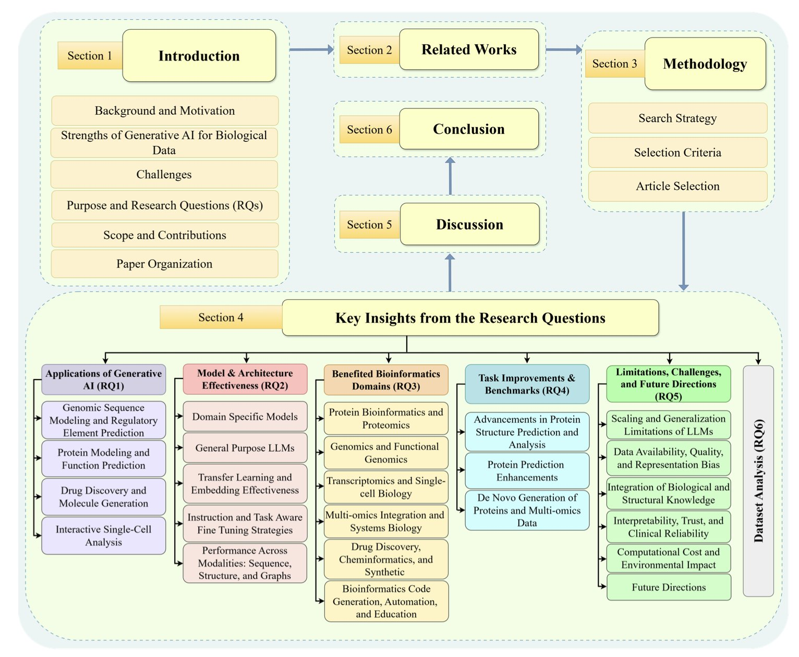
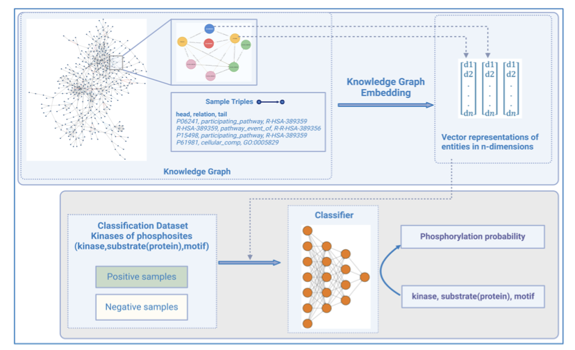
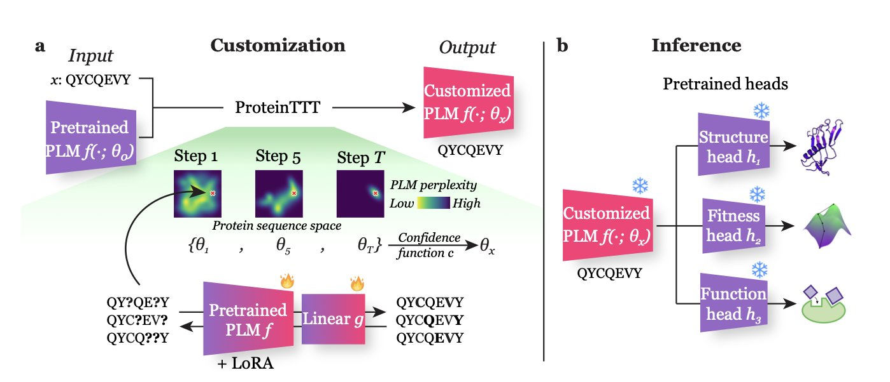
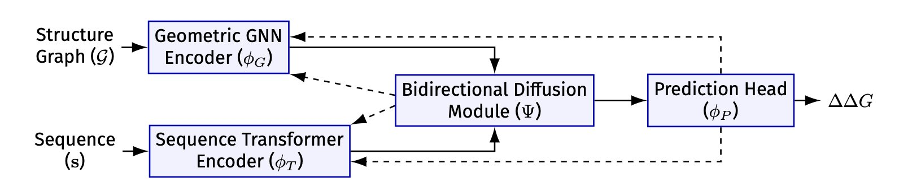

## Table of Contents
1. Generative AI is transforming bioinformatics by creating entirely new biological data, showing potential in drug development and protein design.
2. The EXPRESSO framework uses tumor transcriptome data to predict treatment response. It works well for some targeted monoclonal antibodies but also shows that supervised learning and target expression alone have limits for predicting the efficacy of small-molecule or chemotherapy drugs.
3. To predict a kinase's substrate, a protein's "social network" is more critical than its amino acid sequence, and knowledge graphs provide a powerful framework for this.
4. ProteinTTT improves the prediction accuracy of general protein language models by performing self-supervised fine-tuning on a single target protein at the time of prediction.
5. The DGTN model fuses protein structure and sequence information through a bidirectional diffusion mechanism, significantly improving the accuracy of enzyme stability prediction at speeds 100 times faster than previous methods.

## 1. Breakthroughs in Bioinformatics with Generative AI

Researchers in bioinformatics and drug development have likely felt the impact of Generative AI (GenAI). A recent review systematically covers its applications in genomics, proteomics, and drug discovery. I'll share some thoughts from a research scientist's perspective.

GenAI's core ability is "generation." Traditional discriminative models can only classify or regress, like determining a molecule's activity. GenAI can create new, biologically plausible data from scratch. For example, it can design entirely new protein sequences or generate synthetic omics data for model training. This helps solve the problem of small datasets due to limited experimental data.

The protein field is where GenAI has seen significant success. Models like AlphaFold2 changed how we predict protein structures, and models like ESMFold go a step further. ESMFold doesn't rely on traditional Multiple Sequence Alignments, predicting structures directly from a single sequence, which is faster and highly accurate. This is thanks to the Transformer architecture, which effectively captures long-range dependencies between amino acids in a sequence.

This progress also directly fuels drug discovery. Researchers can use GenAI to design new small-molecule drugs. It works by learning the chemical language and structural rules of existing drug molecules and then generating new ones with desirable pharmacological properties, like high activity and low toxicity. This is more efficient than traditional screening methods.

Of course, challenges remain.

First is the "black box" problem. The model's decision logic is not transparent, which is a barrier in high-stakes fields like drug development. If you can't explain why a molecule is considered effective, it's hard to convince a team to invest resources in its synthesis and testing.

Second is data bias. A model's performance depends on the quality and diversity of its training data. For instance, if a training database (like UniProtKB or ProteinNet12) mainly contains certain protein families, the model's performance might drop when dealing with entirely new ones.

Last is scale and computational resources. Training large models requires immense computing power, which is a barrier for many research institutions.

GenAI opens up new possibilities for bioinformatics and drug development. It improves the efficiency and accuracy of existing tasks and creates new methods, like de novo design of functional proteins. While technical and theoretical issues still need to be solved, it's a direction worth watching and investing in over the next few years.

📜Generative Artificial Intelligence in Bioinformatics: A Systematic Review of Models, Applications, and Methodological Advances
🌐Paper: https://arxiv.org/abs/2511.03354v1

## 2. Using AI and Tumor Transcriptomes to Predict Treatment Efficacy: The Potential and Limits of EXPRESSO

In precision medicine, we've always wanted a "crystal ball" to predict if a specific drug will work for a particular patient before treatment. Tumor transcriptomics, which captures all the RNA information in tumor tissue, is an information goldmine that many studies have explored for answers.

#### How EXPRESSO Works
A new AI framework called EXPRESSO was designed for this purpose. It uses a LASSO regression model, which acts like a smart "feature selector."

The model first takes a patient's pre-treatment tumor transcriptome data, a massive dataset with tens of thousands of gene expression levels. Then, using known biological information like drug targets, it filters out the gene signals most relevant to drug response and builds a predictive model.

The researchers designed two versions:
1.  **EXPRESSO-T**: Uses only the expression levels of drug target genes as features.
2.  **EXPRESSO-B**: Includes other known biomarkers in addition to the targets.

The results showed that both versions performed better than existing baseline models and 20 published gene signatures.

#### The Real Story: Why It Works for Monoclonal Antibodies but Not Small Molecules
The most interesting finding, which aligns with firsthand R&D experience, is how predictability differs across drug types.

For some monoclonal antibody drugs, especially those that directly block cell-surface targets like HER2, EXPRESSO's predictions were very good. This makes biological sense. If a drug works by "locking" a "lock" on the cell surface, then the number of "locks" (the target's gene expression level) naturally becomes a key factor in the drug's effectiveness.

For small-molecule inhibitors and chemotherapy drugs, the story is completely different. EXPRESSO's predictive models were almost useless. These drugs have much more complex mechanisms. They enter the cell and trigger a cascade of downstream signaling changes, and tumors have countless ways to develop resistance. Looking only at the target gene's expression level is like trying to predict a whole city's traffic by looking at a single car—there just isn't enough information.

#### A Sobering Reminder About Performance Plateaus
The study also found something else: for certain therapies, as the amount of patient data for training increased, the model's prediction accuracy hit a plateau and stopped improving.

This is a reminder that when dealing with complex biological problems, the bottleneck is often the model itself and the dimensionality of the data, not just a lack of data. Current supervised learning models are essentially finding correlations, but they don't truly "understand" the underlying biological mechanisms. When a system reaches a certain complexity, simple "input-output" mappings fail.

EXPRESSO shows the potential of AI models but also highlights their limits. It tells us in which scenarios we can trust transcriptome-based predictions and where we must be cautious and seek more complex solutions.

📜Title: AI-based supervised treatment response prediction from tumor transcriptomics: A large-scale pan-cancer study
🌐Paper: https://www.biorxiv.org/content/10.1101/2025.10.24.684491v1

## 3. KSMoFinder: Knowledge Graphs Predict Kinases, Outperforming Large Protein Models

A core challenge in developing kinase inhibitors is accurately predicting which substrate proteins a specific kinase will phosphorylate. The kinase family is vast, and their substrate choices overlap, complicating the prediction of off-target effects and the discovery of new targets.

In the past, predictions relied mainly on sequence motifs, which is like trying to identify a person by their hairstyle—it has limited accuracy. The arrival of protein language models like ProtT5 and the ESM series, which can learn deep features from the entire protein sequence, was a big step forward. But they still ignore the fact that proteins don't exist in isolation.

This paper on KSMoFinder offers a smarter approach. The researchers built a "social network" for proteins using Knowledge Graph technology. This network integrates proteins, kinases, phosphorylation site motifs, and their biological connections (like signaling pathways they participate in or known interactions).

Here's how it works:
1.  First, a large knowledge graph is constructed. The nodes in the graph can be proteins, kinases, or motifs, and the links between them represent known relationships.
2.  Next, a graph embedding algorithm learns from this network, generating a vector for each node (like kinase A and substrate B). This vector encodes not just the node's own information but also its position and context within the entire "social network."
3.  Finally, these context-rich vectors are fed as features into a deep learning classifier. The classifier determines if the vector combination for a given kinase and substrate phosphorylation site looks like a real phosphorylation event.

The results show this method is effective. KSMoFinder achieved a ROC-AUC of 0.851 on the test set, outperforming mainstream prediction tools and also beating protein language models that only look at sequences. This offers a lesson for computational drug discovery: for complex biological problems, well-organized biological knowledge can sometimes be more valuable than massive amounts of raw sequence data. A protein's context is critical.

I appreciate how the researchers built their negative sample set. Instead of randomly pairing kinases and substrates, they used biologically informed negative samples, like known non-interacting protein pairs. This makes the model's evaluation more realistic and reliable.

Interestingly, the researchers tried adding more features, like the sequence of the kinase's catalytic domain or protein structure information, but found no improvement in performance. This suggests the knowledge graph they built had already captured the core information needed to solve the problem.

For drug developers, tools like KSMoFinder are very valuable. They can help us more accurately predict the off-target effects of kinase inhibitors and discover new substrates for specific kinases, opening the door to exploring new biological functions and therapeutic targets. This is a great example of using a computational method to solve a tricky biological problem.

📜Title: KSMoFinder - Knowledge graph embedding of proteins and motifs for predicting kinases of human phosphosites
🌐Paper: https://www.biorxiv.org/content/10.1101/2025.10.21.683733v1
💻Code: https://github.com/manju-anandakrishnan/KSMoFinder

## 4. ProteinTTT: A Custom Prediction Model for Each Protein

Existing large Protein Language Models, like ESMFold, are generalists with broad knowledge. But when faced with unique or difficult proteins, their general abilities can fall short.

The ProteinTTT (Protein Test-Time Training) method offers a solution. Its core idea is this: before making a prediction for a specific protein, let the model do a quick, custom "cram session" just for that protein.

Here's how it works: When you get a target protein sequence, ProteinTTT freezes the model's task-prediction module and has the core language model repeatedly "read" that single amino acid sequence until the model's "perplexity" for that sequence is minimized.

This is like a student repeatedly working through a tough problem before an exam until they've mastered its logic. Through this self-supervised learning, the model fine-tunes its parameters to better understand the internal patterns and grammar of that specific protein sequence.

After this "review," the protein representation generated by the model is more precise. Feeding this optimized representation into a downstream prediction module (like a structure prediction head) yields more accurate results. The entire process uses only the target protein itself, with no need for extra labeled data.

The method has shown excellent results on several difficult tasks.

For example, in protein fitness prediction, it achieved state-of-the-art performance. It also improved accuracy in predicting the structure of the key loop regions in antibody-antigen interactions, which directly helps in developing antibody drugs.

In a test on the Big Fantastic Virus Database, which contains a large number of viral proteins, the general model's performance was average. But after optimization with ProteinTTT, the structure predictions for 19% of the proteins improved.

The advantage of this method is its simplicity and efficiency. It provides a lightweight, on-the-fly optimization on top of existing models without needing to train from scratch. For researchers who often work with atypical proteins, this is a practical tool. The authors have open-sourced the code, making it easy to integrate into existing workflows.

📜Title: One Protein Is All You Need
🌐Paper: https://arxiv.org/abs/2411.02109v2
💻Code: https://github.com/anton-bushuiev/ProteinTTT

## 5. DGTN: AI Predicts Protein Mutations with 20% Less Error

Predicting the effect of single-point amino acid mutations on protein stability (the ∆∆G value) is a challenge in drug development and protein engineering. Traditional physics-based calculations are accurate but slow, often taking hours or even days. AI methods are faster, but effectively integrating two different types of information—the protein's 3D structure and its amino acid sequence—has been a technical hurdle.

A new paper introducing the DGTN model offers a solution.

A protein's structure is like a network graph of amino acid nodes, while its sequence is a linear string of text. Past models usually analyzed one or the other, or simply added them together, which wasn't very effective. A protein's function and stability are determined by the interplay between its local structure and its global sequence.

The cleverness of DGTN's design lies in enabling a two-way information exchange between the graph neural network (GNN) processing structural information and the Transformer model processing sequence information.

Here's an explanation of how it works: First, the GNN analyzes the protein's local 3D structure and generates a "structural fingerprint" for each amino acid. This "fingerprint" then guides the Transformer's attention mechanism through a "diffusion mechanism" module. This is like giving the Transformer a pair of "structural glasses," allowing it to focus on functionally important amino acids that are close to each other in 3D space when analyzing the sequence.

Conversely, after the Transformer understands the global information of the entire sequence, it generates a "sequence summary." This summary then guides the GNN in passing information between nodes, allowing the GNN's analysis to go beyond local constraints and gain a global perspective.

The researchers call this a "bidirectional diffusive gating mechanism." Theoretical analysis shows that this method helps the model converge faster and find the best way to combine structural and sequence information.

On ProTherm and SKEMPI, two established datasets, DGTN outperformed previous models. Its predictions achieved a Pearson correlation of 0.87 with experimental values, and its root mean square error was only 1.21 kcal/mol. This represents a 9% improvement in prediction accuracy and a 20% reduction in error. The bidirectional diffusion mechanism alone contributed 4.8 percentage points to the correlation improvement.

DGTN is 100 times faster than traditional physics-based methods, transforming it from a theoretical model into a practical engineering tool. For example, it can be used to quickly screen for mutations that increase the stability of antibody drugs or to find ways to repair disease-causing protein mutations.

DGTN is a technical innovation and also shows the potential of AI in solving complex biological problems, opening up new possibilities for future protein design and drug discovery.

📜Paper Title: DGTN: Graph-Enhanced Transformer with Diffusive Attention Gating Mechanism for Enzyme ∆∆G Prediction
🌐Paper: <https://arxiv.org/abs/2511.05483v1>
