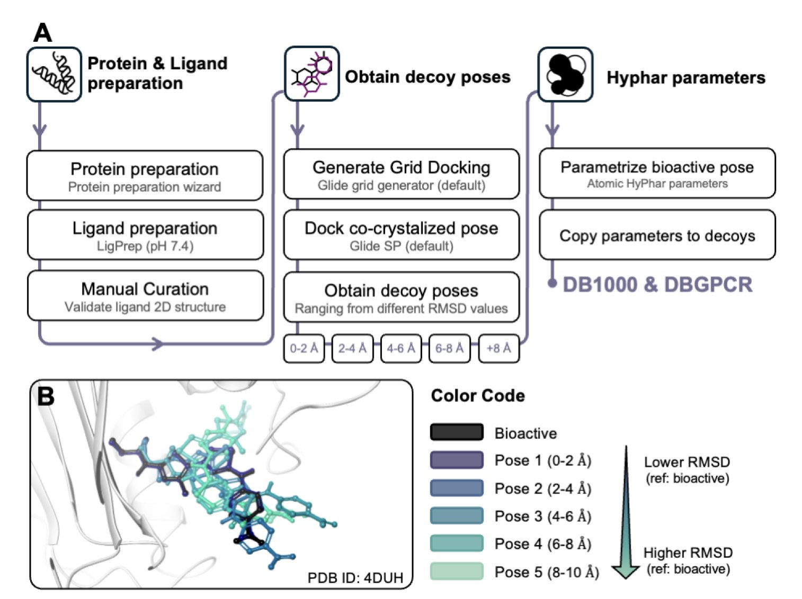
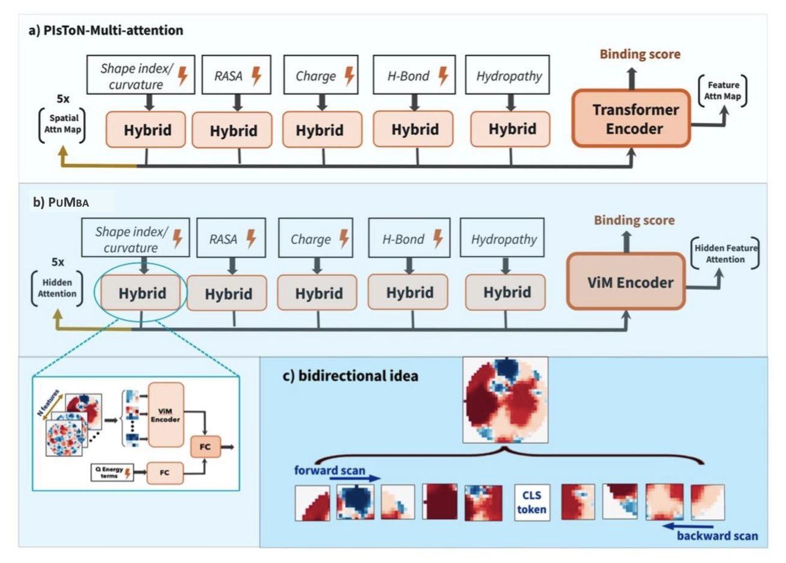
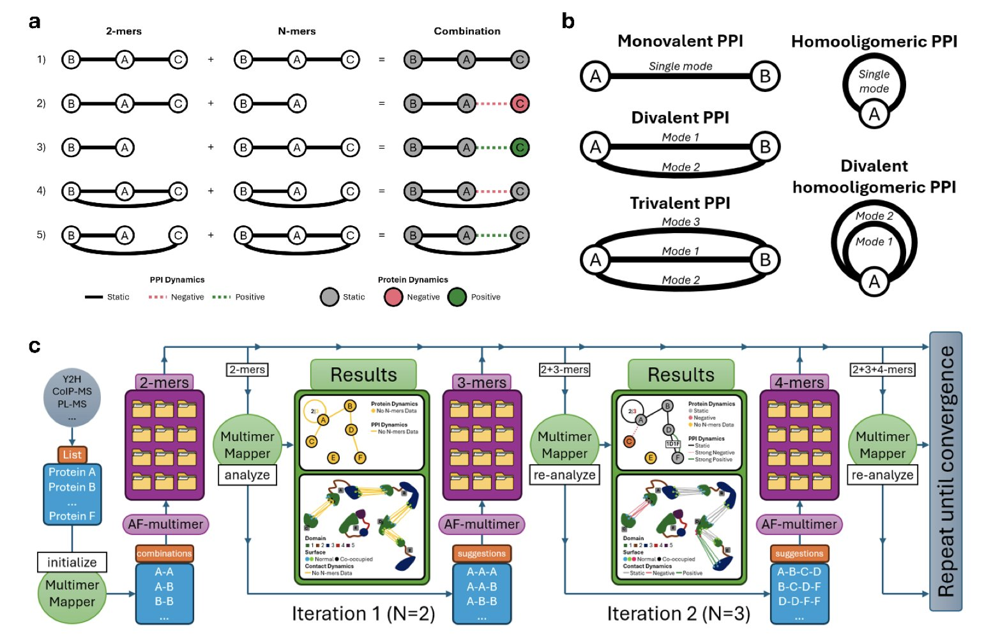
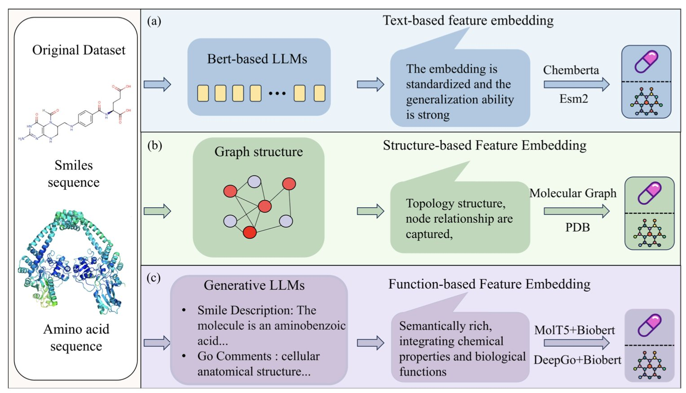
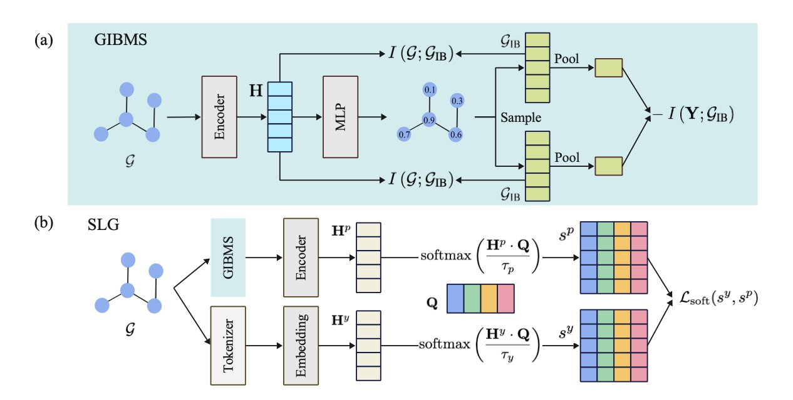

## 目录  
1. 研究者开发了一种基于量子力学的疏水性评分函数，通过精确模拟水分子作用并结合配体构象能，将药物分子结合构象的预测准确率提高到约 90%。
2. PUMBA 利用 Mamba 架构，能更准确、更透明地评估蛋白对接模型，提升了现有评估方法的性能。
3. MultimerMapper 解决了 AI 蛋白结构预测的一大难题。它通过分析复合物的动态组装过程，推断出其精确的组分比例。
4. CDI-DTI 框架通过融合多种数据并保证结果可解释，解决了新药或新靶点的相互作用预测难题，让计算预测更接近真实研发场景。
5. DyCC 框架通过动态调整遮蔽策略和引入化学先验知识，提升了分子图自编码器的性能和泛化能力。

## 1. 量子力学算水，药物对接构象预测新突破  
  
  

计算药物设计领域有个长期难题：分子对接软件能生成上千个看似合理的配体结合构象，但哪一个最接近真实情况？成败的关键在于「评分函数」。许多评分函数对水的作用处理得过于粗糙，导致我们常被一些高分却错误的构象误导。  
  
传统评分函数，如经典的 HINT，通常依赖经验性的原子参数来估算疏水相互作用。这好比用一把固定的尺子去测量各种形状的物体，虽简单快速，但精度有限，无法捕捉特定化学环境下原子电子云分布变化带来的细微影响。  
  
这项工作另辟蹊径，直接运用量子力学（Quantum Mechanics, QM）来解决问题。  
  
**工作原理**  
  
研究者没有使用预设的经验参数，而是对每个原子进行 QM 计算，得出一个更根本的物理量：溶剂化自由能。该数值能精确反映将原子从水中移入蛋白口袋的能量得失。基于这些 QM 计算出的原子描述符，他们构建了一个新的疏水性评分函数。这个函数的核心是评估「疏水性互补」：配体上疏水的区域是否对准了蛋白口袋里疏水的区域，亲水区域亦然。  
  
**画龙点睛的一笔**  
  
该方法的一个亮点，是整合了配体的「构象应力能」。药物小分子如同一个灵活的体操运动员，为在蛋白口袋里找到最佳落脚点，它可能需要扭曲成一个能量很高的姿态。尽管这个构象让它与口袋的疏水性匹配得分很高，但维持构象本身消耗巨大能量，使其无法稳定存在。  
  
许多评分函数忽略了这一点。新方法通过引入惩罚项，筛掉了那些「扭曲」过度的构象。增加这一项后，预测准确率提升至 90% 左右。这说明，好的结合既要看配体和蛋白的「外部」匹配度，也要考虑配体自身的「内部」舒适度。  
  
**数据验证**  
  
为验证方法的有效性，研究者在一个包含 1000 个蛋白 - 配体复合物的大型基准数据集（DB1000）上进行测试，结果优于传统经验方法。  
  
他们还在一个外部的 G 蛋白偶联受体（G Protein-Coupled Receptor, GPCR）数据集上进行验证。GPCR 是一类重要且结构复杂的药物靶点，其结合口袋性质各异。在这个高难度测试中，新方法依然取得了 80.3% 的准确率，表明其具有相当的普适性，并非只能处理特定类型的靶点。  
  
**有趣的发现**  
  
研究还发现，该评分函数在极性基团较多的结合口袋里表现更好，这符合化学直觉。口袋里需要一些氢键给体或受体作为「锚点」先将配体大致固定，然后疏水作用力再进行精细贴合。如果口袋只是一个纯粹的疏水「油坑」，配体在其中「漂浮」的方式过多，就很难精确锁定唯一正确的构象。  
  
这项工作提供了一个更接近物理真实的评分工具。它提醒我们，在药物设计中，水的作用远比想象的复杂和关键。用 QM 这种更底层的物理原理指导药物发现，正推动我们从「经验炼丹」向「精确设计」迈进。  
  
📜Title: Assessing the ligand native-like pose using a quantum mechanical-derived hydropathic score for protein-ligand complementarity  
🌐Paper: https://www.biorxiv.org/content/10.1101/2025.10.20.683430v1  

## 2. Mamba 架构革新蛋白对接，PUMBA 模型评估更精准  
  
  

计算辅助药物发现面临一个经典难题：蛋白 - 蛋白对接（protein-protein docking）。计算机可以生成成千上万种可能的蛋白复合物拼接方式，即「诱饵」（decoy）。但挑战在于，如何从大量构象中识别出唯一正确的天然构象。这项任务由对接打分函数（scoring function）完成。  
  
过去的打分函数工具各不相同，近年来也出现了基于 Transformer 的模型。但 Transformer 模型在处理蛋白序列时，会同时分析所有氨基酸残基，这导致计算开销大，且在捕捉长距离相互作用时效率不高。  
  
PUMBA 模型采用了 Mamba 架构来解决这个问题。  
  
Mamba 的工作方式不同于 Transformer。它像人阅读一样，按顺序扫描序列，并携带上下文信息。这种状态空间机制让它在捕捉长距离依赖关系时效率更高，计算成本也更低。  
  
PUMBA 将 Mamba 架构应用于评估蛋白对接界面。它将蛋白质复合物的相互作用界面信息转换为类图像数据进行分析。利用 Mamba 的优势，PUMBA 能同时捕捉局部的化学作用（如氢键和疏水作用）与界面的全局形状互补性。  
  
在多个公开基准测试集上，PUMBA 的性能稳定超过了前代模型 PIsToN，在一些公认的难点数据集上优势尤其突出。这表明该模型掌握了更普适的蛋白质相互作用物理化学规律。  
  
PUMBA 的一大亮点是其可解释性。不同于黑箱模型，PUMBA 通过数学重构，能生成「隐式注意力矩阵」。这个矩阵可以揭示模型做出判断的依据，即哪些氨基酸残基之间的相互作用是其评分的关键。  
  
这种可解释性对药物研发有直接价值。例如，在开发旨在破坏特定蛋白相互作用的药物时，PUMBA 不仅能评估对接结果，还能高亮出相互作用界面上的关键区域。这为药物设计提供了靶点，使模型从打分工具转变为能提供洞见的分析工具。  
  
PUMBA 的成功展示了 Mamba 等新架构在生物信息学领域的应用潜力。这为解决序列和结构问题，提供了 Transformer 之外的有效新思路。  
  
📜论文：Evaluating protein binding interfaces with PUMBA  
🌐地址：<https://arxiv.org/abs/2510.16674>  

## 3. AI 蛋白复合物预测：从静态快照到动态电影  
  
  

AlphaFold 等工具的出现，改变了我们预测单一蛋白结构的方式，如同拥有了一台能拍出分子高清照片的相机。但生物学的功能主体常是各种蛋白质复合物 (complexes)，它们在细胞内不断结合、分离，像一场拥挤的舞会。  
  
AlphaFold-Multimer 这类工具能预测复合物的结构，但需要用户预先指定复合物的「配方」，也就是化学计量 (stoichiometry)。例如，输入「两个 A 蛋白和一个 B 蛋白」，才能预测 A₂B₁ 复合物。现实中，我们常常不清楚这个精确的配方。  
  
更复杂的是，蛋白质的行为具有「情境依赖 (context-dependent)」。A 蛋白与 B 蛋白结合时的构象，可能在 C 蛋白加入后发生改变。就像一个人在两人对话和三人讨论中的姿态角色会不同。现有工具难以捕捉这种动态变化。  
  
**MultimerMapper 的工作方式**  
  
MultimerMapper 旨在解决「配方」和「情境」的难题。它像一个侦探，通过分析大量 AI 预测的潜在复合物结构，拼凑出全貌。  
  
它的工作流程如下：  
1.  **系统性测试**：它不预设配方，而是测试所有可能的组合，如 A+B、A+C、A+A+B、A+B+C 等，生成一个包含各种可能性的结构集合 (ensemble)。  
2.  **模式分析**：利用图论和统计学分析这个集合。如果 A 和 B 的接触界面 (interface) 在所有预测中都稳定出现，就标记为核心的静态相互作用。如果只在 C 蛋白存在时才出现，则为依赖情境的动态相互作用。  
3.  **推断与可视化**：通过分析这些相互作用模式，MultimerMapper 推断出最可能的复合物组成和化学计量，并将其可视化，清晰展示出核心亚基 (subassembly) 与外围或瞬时成员。  
  
**在药物研发中的应用**  
  
要开发一款破坏 A 蛋白和 B 蛋白结合的药物，就需要确定这种结合在细胞内的真实发生条件。如果这种结合需要 C 蛋白的参与，那么只靶向 A-B 界面就可能无效。MultimerMapper 提供的动态视图，能帮助研究者识别出有生物学意义的、适合作为靶点的复合物形态。  
  
研究者利用 MultimerMapper 分析了锥虫 (trypanosomatid) 的核内复合物，一个以动态和复杂著称的系统，其组分和数量都未知。结果证明该工具能处理这类复杂问题。  
  
这个工具在 AlphaFold 等预测引擎之上，增加了一个分析与推理层，让我们从观察静态的结构快照，迈向理解蛋白质复合物动态组装与工作的「电影模式」。  
  
📜Title: Context-Dependent Protein Structure Prediction Analysis and Stoichiometry Inference with MultimerMapper  
🌐Paper: https://www.biorxiv.org/content/10.1101/2025.10.24.684463v1  
💻Code: https://github.com/elviorodriguez/MultimerMapper  

## 4. 新 AI 框架 CDI-DTI 攻克药物发现「冷启动」难题  
  
  

在药物发现中，面对一个全新的靶点或一个结构新颖的分子，过去的计算模型常常会失灵。这种无法处理新数据的难题，就是「冷启动」（Cold-Start）问题，它阻碍了计算辅助药物设计的进程。  
  
CDI-DTI 框架为此提供了解决方案。  
  
该模型的工作方式类似侦探破案，会整合多个维度的信息。具体来说，CDI-DTI 整合了关于药物和靶点的三种关键信息：  
1.  **结构信息**：分子的 2D/3D 结构和蛋白质的一级序列，即最基础的化学与生物学蓝图。  
2.  **功能信息**：蛋白质的功能注释，例如其参与的生物通路。  
3.  **文本信息**：从海量科研文献中提取的相关描述。  
  
模型成功的关键，在于融合这些不同来源的信息（多模态特征）。研究者采用了一种两步融合策略。  
  
第一步是「早期融合」。模型使用多源交叉注意力机制（multi-source cross-attention），让不同维度的信息相互关联。这好比在项目初期，让化学家、生物学家和临床医生共同讨论，确保对目标有全面、统一的认识。  
  
第二步是「后期融合」。在建立了宏观认识后，模型通过一个双向交叉注意力层（bidirectional cross-attention layer）捕捉更精细的相互作用。这就好比进入具体的分子设计阶段，需要精确找出药物分子的哪个基团与靶点蛋白的哪个氨基酸残基相互作用。  
  
除了预测准确，药物研发更关心「为什么」。一个无法解释的「黑箱」模型在实际应用中价值有限。CDI-DTI 在可解释性上下了功夫。它通过 Gram Loss 对齐不同特征，并用一个深度正交融合模块剔除冗余信息，让模型的决策过程更清晰。  
  
为了验证模型是否理解了药物与靶点的相互作用机制，研究者测试了两个经典案例：EGFR 激酶与吉非替尼（Gefitinib），以及 BACE1 蛋白与 Verubecestat。结果显示，模型的可视化分析准确标记出了那些已被实验证实的、对结合起关键作用的氨基酸残基。  
  
与湿实验（wet lab）结果相互印证的能力，是计算模型建立信任的基础。这表明 CDI-DTI 学习到了底层的生物物理化学原理，超越了单纯在数据中寻找统计规律。  
  
📜Title: CDI-DTI: A Strong Cross-domain Interpretable Drug-Target Interaction Prediction Framework Based on Multi-Strategy Fusion  
🌐Paper: https://arxiv.org/abs/2510.19520v1  

## 5. DyCC：让分子图自编码器更懂化学  
  
  

在分子表示学习领域，图自编码器（Graph Autoencoders）是一种常用技术，但传统方法存在一些局限。标准的做法是随机遮蔽分子图的一部分，让模型预测还原。然而，对所有分子——无论结构简单还是复杂——都采用固定的遮蔽比例，这种「一刀切」的方式并不合理。  
  
此外，分子中的原子重要性各不相同，例如苯环上的碳原子与侧链末端的碳原子对分子性质的影响就有差异。传统的随机遮蔽策略忽略了这一点。同时，要求模型精确预测被遮蔽的原子，任务本身可能过于严苛。在化学实践中，性质相似的原子有时可以互相替换而对分子整体功能影响不大，但模型会因为未能给出「标准答案」而受到惩罚。  
  
论文提出的动态与化学约束（Dynamic and Chemical Constraints, DyCC）框架旨在解决上述问题，其核心是 GIBMS 和 SLG 两个模块。  
  
GIBMS（Graph Information Bottleneck-based Masking Strategy）为遮蔽策略引入了智能。它利用图信息瓶颈（Graph Information Bottleneck, GIB）理论分析分子，识别出决定其性质的核心子结构。在遮蔽过程中，GIBMS 会保留这些关键部分，而优先遮蔽相对次要的原子。这样，模型在重建时能集中学习重要的化学模式。每个分子的遮蔽比例和内容都动态变化，更加智能化。  
  
SLG（Soft Label Generator）模块负责优化重建目标。传统方法要求模型做出非黑即白的预测，例如必须准确判断被遮蔽的原子是碳。SLG 则将这种硬标签（Hard Label）转化为软标签（Soft Label）。它通过一组可学习的原型（learnable prototypes），将重建目标定义为不同原子的可能性分布，例如「高概率是碳，低概率是氮」。这种方式更贴近化学现实，原子替换遵循一定的规律。这不仅降低了模型的学习难度，也使自监督信号更合理。  
  
DyCC 框架整合了 GIBMS 和 SLG，并且具有模型无关（model-agnostic）的特性，可以作为即插即用模块，与主流的分子图自编码器模型结合。实验证明，集成了 DyCC 的模型在多个分子性质预测任务上性能获得提升，达到了新的最优水平。这表明，在预训练阶段引入动态调整和化学知识，能有效提升模型的性能。  
  
📜Title: Dynamic and Chemical Constraints to Enhance the Molecular Masked Graph Autoencoders  
🌐Paper: https://openreview.net/pdf/f6bfb8aa8ea6896b6d4ebfccada7e051c176fa2c.pdf
