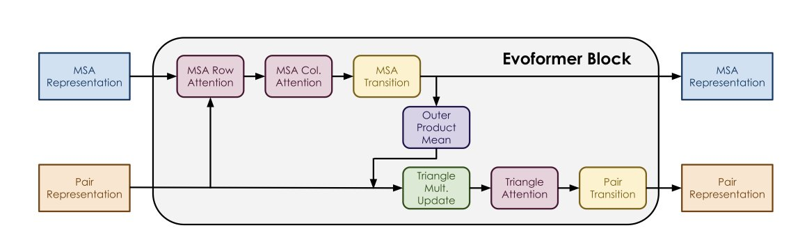
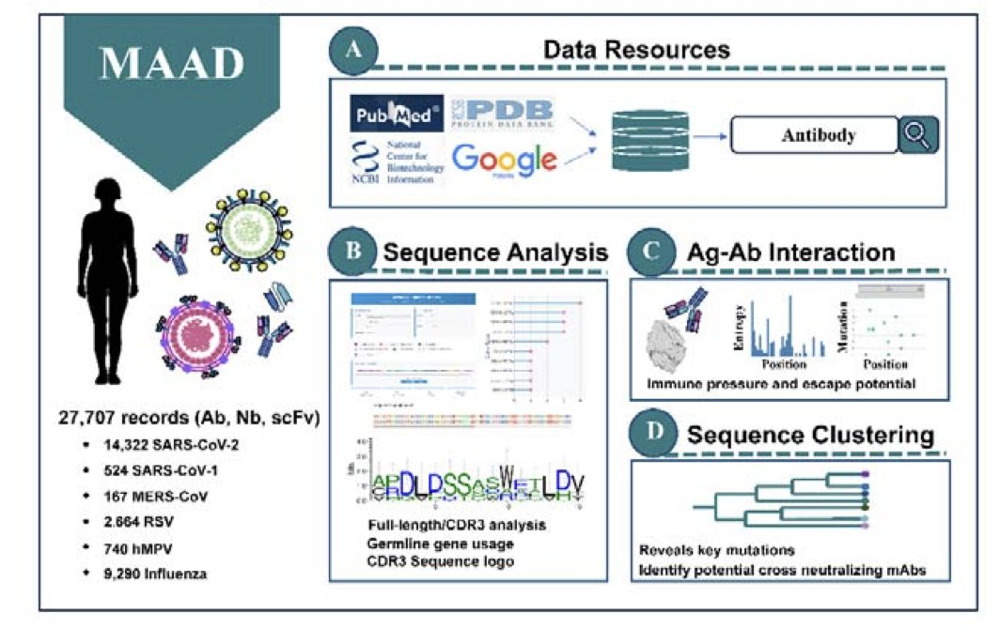
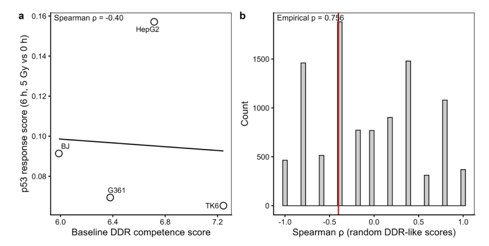
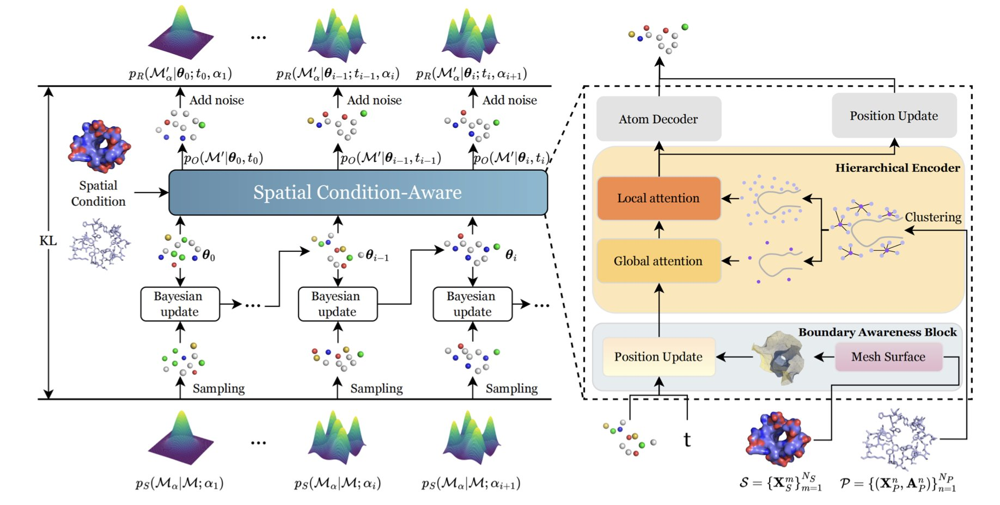
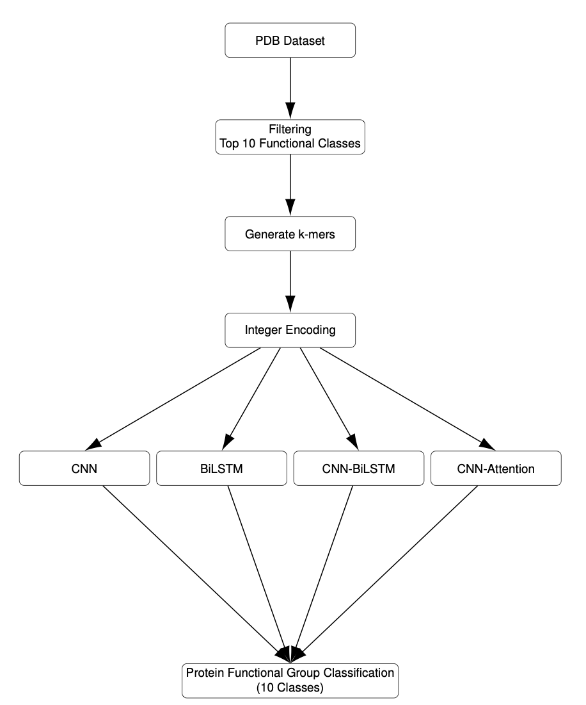

## Table of Contents
1. Knockout tests show that MSA column attention is the core pillar of OpenFold. Protein length determines how much the model relies on geometric reasoning versus evolutionary information.
2. This study integrates multi-omics data with machine learning to achieve high-precision, real-time prediction of gene networks and disease biomarkers.
3. KOSMOS can unearth gems like CDO1 but also fails on fundamental tests like p53. Rigorous "falsification-based auditing" is the key to using AI effectively.
4. SculptDrug uses Bayesian Flow Networks to generate high-affinity, clash-free, drug-like ligands by sensing protein surface boundaries and multi-level structural features.
5. A CNN model, combined with Explainable AI, achieves 91.8% accuracy in protein function classification. It independently "learned" to focus on key catalytic residues like histidine, demonstrating the algorithm's biological validity.

## 1. Dissecting OpenFold: What Determines Prediction Accuracy?

AlphaFold and OpenFold are now widely used, but for most people, their inner workings are still a "black box." Tyler L. Hayes and Giri P. Krishnan at the Georgia Institute of Technology have opened the hood on OpenFold to find out which parts are really driving the machine.

**Performing a "Gene Knockout" on the Model**

The researchers used an intuitive method similar to a "gene knockout" in biology. They systematically skipped or "zeroed out" specific components in the Evoformer module to see how prediction accuracy changed. The experiment used a subset of proteins from the CAMEO dataset with fewer than 700 residues, ensuring the results covered a range of common protein structures.

**MSA is the Main Workhorse**

Despite the model's complexity, three parts largely determine its accuracy: **MSA Column Attention**, the **MLP transition layer**, and the final **Pair representation**.

MSA Column Attention was especially dominant. The data showed that for many proteins, keeping only this component was enough to achieve near-baseline performance. This confirms an industry consensus: current structure prediction models are essentially extracting evolutionary information contained in multiple sequence alignments (MSAs).

**Long and Short Proteins Have Different Needs**

Protein length influences which model components it prefers:

*   **Short proteins and peptides (<100 residues)** depend more on the model’s geometric reasoning capabilities.
*   **Longer proteins** rely heavily on the evolutionary information from the MSA.

**Directions for Optimization**

This work reveals how OpenFold "thinks" and points to ways it can be optimized. For proteins known to rely mainly on MSA, improving the computational efficiency of that part could lead to more lightweight models. For short peptides where predictions fail, the focus should be on checking the geometric reasoning modules, not just blindly increasing the MSA depth.

📜Title: Quantifying the Role of OpenFold Components in Protein Structure Prediction
🌐Paper: <https://arxiv.org/abs/2511.14781v1>

## 2. Multi-omics + AI: A New Paradigm for High-Precision Analysis of Gene Networks

*   **Multi-omics fusion**: Integrates genomic, transcriptomic, and proteomic data to reveal hidden regulatory pathways.
*   **AI-driven high-precision prediction**: Uses machine learning to significantly improve the accuracy of identifying gene functions and disease biomarkers.
*   **Dynamic real-time monitoring**: Capable of real-time analysis to capture cellular responses to drugs or environmental changes.

Drug development is often held back by complex gene networks. Traditional experiments focus on single targets or pathways, making it hard to see the big picture. This study aims to build that global view.

The authors developed a computational framework that integrates **Genomics**, **Transcriptomics**, and **Proteomics**. This panoramic perspective pieces together fragmented cellular processes into a coherent whole. It reveals previously hidden regulatory pathways and gets to the root causes of cellular dysfunction.

**Machine Learning** here genuinely improves prediction accuracy. The model identifies disease biomarkers more reliably than traditional methods, which can help lower early-stage drug screening costs and improve the precision of diagnostic tools.

The framework is also capable of real-time analysis. A cell’s response to its environment or a drug is dynamic, and this tool can monitor changes in gene networks as they happen. By observing how a network is perturbed after a compound is introduced, researchers can effectively analyze its **Mechanism of Action**.

The method's robustness has been validated with extensive simulations and experimental data. If this tool becomes widely available, it will provide clearer guidance for target discovery and validation.

📜Title: New Insights in Computational Biology: A Breakthrough Approach to Understanding Genetic Networks
🌐Paper: <https://www.biorxiv.org/content/10.1101/2025.11.18.688681v1>

## 3. Putting KOSMOS to the Test: Is the AI Scientist a Genius or Just Guessing?

Since everyone is talking about whether an "AI scientist" can do independent research, let's look at how one performs in practice. This study put the autonomous AI system KOSMOS to work on three complex problems in **Radiation Biology**. The results showed it has both surprising intuition and the clumsiness of a novice.

**Striking Gold**

When predicting cellular radiation response, KOSMOS showed a keen sense of discovery. It hypothesized that the CDO1 gene is a key predictor of radiation response in breast cancer cells. Subsequent validation showed that the data did indeed support this idea. This is exactly what we hope for from AI: to spot clues in massive datasets that humans miss and to offer new biological perspectives.

**The Crash Site**

KOSMOS hallucinated when it tried to link the treatment outcomes of prostate cancer patients to their baseline DNA damage response and p53 response. It confidently generated a hypothesis about a correlation, but the actual data showed the link was not there.

This is a wake-up call for drug developers: AI is good at finding patterns, but it doesn't care if those patterns are biologically meaningful or statistically sound. Blindly trusting its output can lead you down the wrong path.

**Falsification-Based Auditing**

The core value of this paper is its proposal of a "falsification-based auditing" method.

The main idea is to test AI-generated hypotheses against "null models." If a hypothesis cannot beat a random or baseline model in a rigorous statistical test, it should be discarded.

**An Insider's View**

For drug discovery practitioners, KOSMOS's performance is not surprising. It acts like an energetic but inexperienced junior researcher: it generates a high volume of ideas, mixing brilliant insights with nonsense.

The key is not just to build a "smarter" AI, but to establish an auditing mechanism. We must "interrogate" the AI with rigorous experimental design and statistical methods to turn it into a powerful research tool.

📜Title: When AI Does Science: Evaluating the Autonomous AI Scientist KOSMOS in Radiation Biology
🌐Paper: <https://arxiv.org/abs/2511.13825v1>

## 4. SculptDrug: Sculpting the Perfect Ligand with Bayesian Flow

Structural biologists and medicinal chemists know that the hardest part of **Structure-Based Drug Design (SBDD)** is making the molecule fit. Many generative models produce ligands that have serious steric clashes with the protein backbone or ignore the chemical environment inside the pocket.

**SculptDrug**, as its name suggests, is designed to "sculpt" a molecule that fits within a confined space.

**Giving the Generation Process a "Parking Sensor"**

The research team chose **Bayesian Flow Networks (BFN)** as the underlying framework to handle continuous data like atomic coordinates. The core innovation is the **Boundary Awareness Block**.

If you think of the protein surface as a wall, this block feeds geometric information into the generative model, forcing it to "watch where it's going" as it generates the ligand. This effectively reduces **steric clashes**, making the molecule follow the contours of the protein surface instead of just blindly filling the space.

**Seeing the Forest and the Trees**

In **Docking**, the binding pocket contains charged, hydrophobic, or polar amino acid residues. A macro-level outline isn't enough to align key interactions like hydrogen bonds or salt bridges.

SculptDrug solves this with a **Hierarchical Encoder**. It captures the pocket's global shape to ensure the right size, while also zooming in to the micro-level to capture the atomic environment. This dual-scale view ensures the generated ligand not only has the right shape but also has chemical properties that can properly dock with the residues inside the pocket.

**From Noise to Drug**

The generation strategy uses **progressive denoising**, like a fine polishing process. The model starts with disordered noise and iteratively adjusts atom positions and types. This fine-grained control ensures the final product has a reasonable spatial geometry, avoiding unrealistic bond lengths or distorted angles.

**Performance in Practice**

Tests on the CrossDocked dataset show that SculptDrug outperforms current leading models on **Binding Affinity** and **Drug-likeness**. Ablation studies confirmed that both the boundary awareness and the hierarchical encoder are essential.

Currently, SculptDrug still treats the protein as a rigid body. In a real biological system, there is **induced-fit**, where the protein is in a dynamic state. Incorporating dynamic conformations is a future challenge. But this work is a solid step toward "AI that generates usable molecules."

📜Title: SculptDrug: A Spatial Condition-Aware Bayesian Flow Model for Structure-based Drug Design
🌐Paper: <https://arxiv.org/abs/2511.12489v1>

## 5. XAI Helps Deep Learning Understand Proteins: Moving Beyond the "Black Box"

AI-assisted drug discovery often faces a trust problem: does the model truly understand biology, or is it just playing a statistical game? The reasons behind a high accuracy score are often a mystery. This paper unpacks the "black box" to reveal the decision-making logic of a deep learning model.

**Who's the Winner?**

The study set up a function classification task using the PDB database to compare four architectures: a CNN, a BiLSTM, a CNN-BiLSTM, and a CNN with Attention. The **Convolutional Neural Network (CNN) came out on top with 91.8% validation accuracy**.

Protein function is often determined by specific local amino acid sequences (motifs). A CNN's convolutional kernels act like a sliding "microscope," making it good at capturing local spatial features. The BiLSTM, which is designed for long-sequence memory, had its focus spread too thin for this task and struggled to lock onto the key areas.

**What Did the AI See?**

The authors used two techniques, **Grad-CAM** and **Integrated Gradients**, to visualize the model's "attention."

**The model locked onto Histidine (His), Aspartic acid (Asp), Glutamic acid (Glu), and Lysine (Lys).**

Anyone who studies enzyme chemistry will recognize these names. These amino acids are the "workhorses" of enzyme active sites, responsible for proton transfer, metal ion binding, and catalysis. Without any hard-coded rules, the AI discovered the importance of these residues for protein function on its own. The features it learned were highly consistent with known biochemical mechanisms.

**The "Personalities" of Different Architectures**

**Explainable AI (XAI)** revealed the decision-making styles of the different models:
*   The **Attention model** was aggressive, tending to put all its weight on very short subsequences, which gave it low fault tolerance.
*   The **BiLSTM** spread its focus across the entire sequence, which diluted the important signals.
*   The **CNN** was balanced. It was able to focus on multiple local motifs in the sequence at the same time, which aligns with the biological reality of how multiple protein domains work together.

In the field of AI for drug discovery, high accuracy alone is not convincing enough. By using XAI to confirm that a model is focusing on real pharmacophores or catalytic centers, its computational results can be used with much more confidence in wet lab experiments.

📜Title: XAI-Driven Deep Learning for Protein Sequence Functional Group Classification
🌐Paper: <https://arxiv.org/abs/2511.13791v1>
