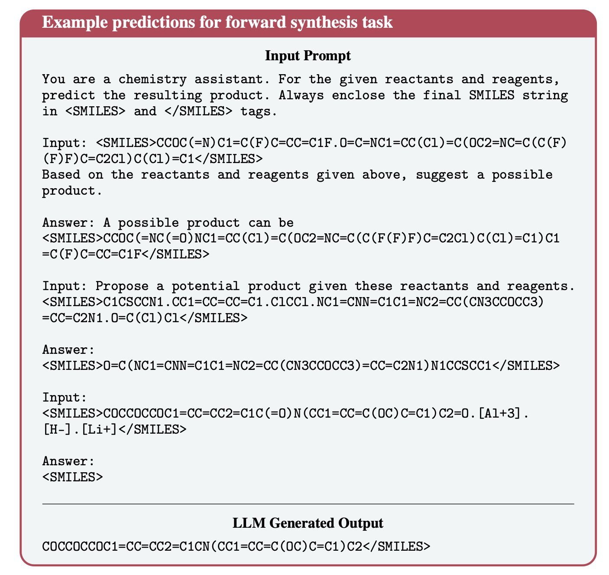
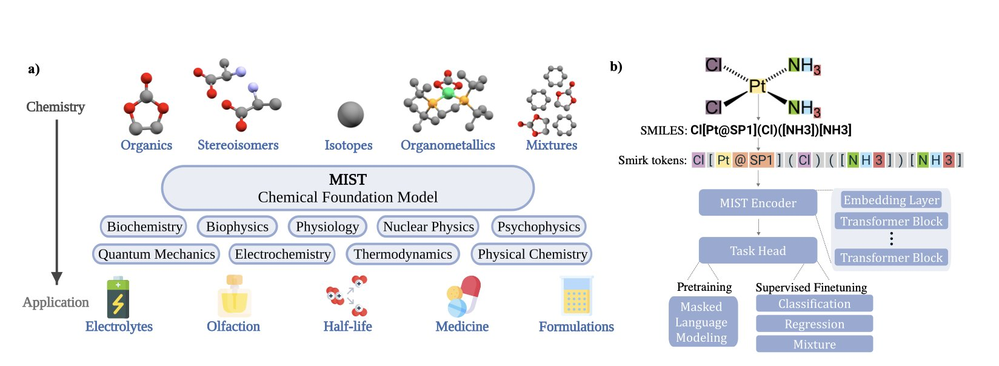
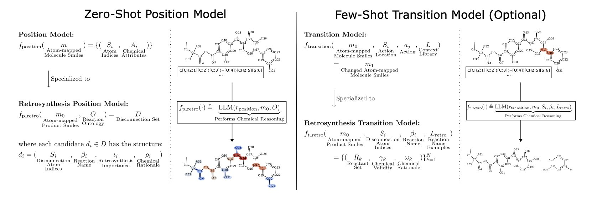
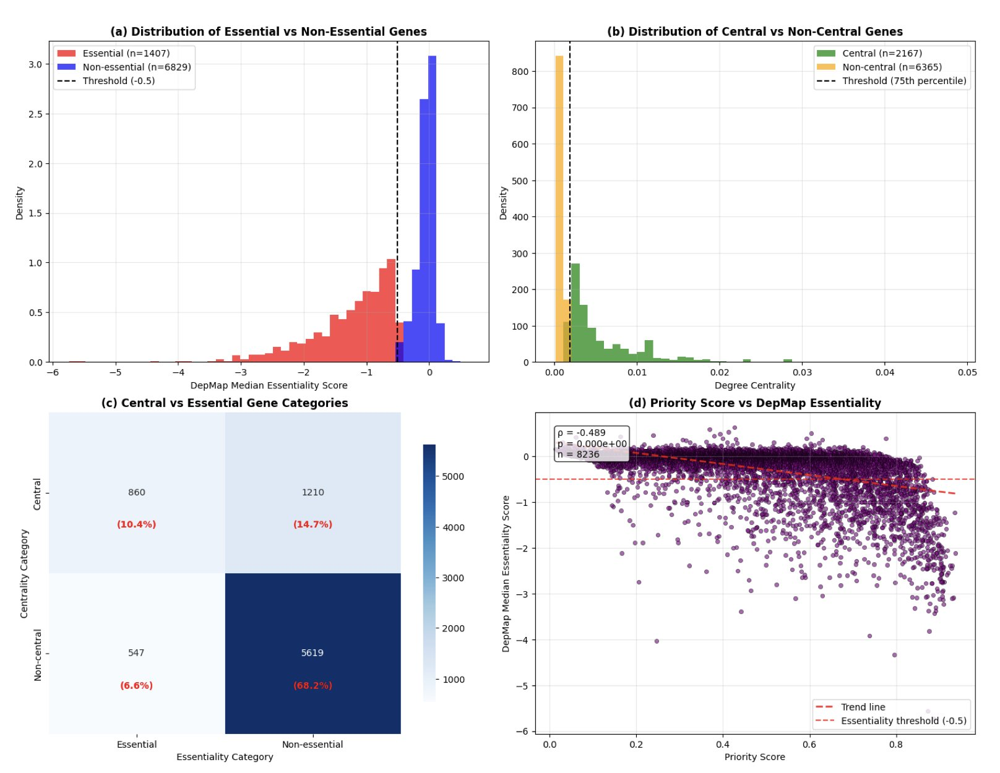
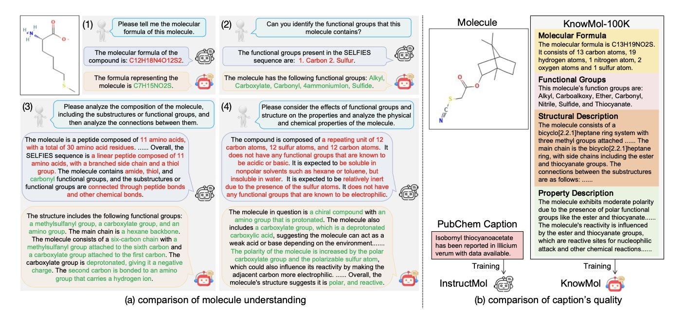

## 目录  
1. 给通用大语言模型（LLM）补充化学专用词汇，使其像阅读文章一样理解 SMILES，显著提升药物合成路线设计与性质预测能力。
2. MIST 刷新了规模和性能记录。它通过一种新的分子表示方法，开始理解化学的底层规律，超越了简单的模式匹配。
3. 给分子中的每个原子一个唯一编号，大语言模型就能像化学家一样思考如何拆解分子，几乎无需专门的反应数据训练。
4. 结合蛋白质 - 蛋白质相互作用（PPI）网络中心性与节点嵌入，该研究不仅实现了 0.930 的高准确率，还利用 GradientSHAP 揭示了「度中心性」是预测基因必要性的核心指标。
5. KnowMol 用一套精心构建的化学知识，教会了大语言模型如何像化学家一样思考，让它不仅能识别分子，更懂得分子背后的原理。

## 1. LLM 懂化学？扩展词表打破 SMILES 瓶颈  
  
  

将大语言模型（LLM）置于化学场景时，往往面临「文盲」窘境。标准 LLM 面对分子的 SMILES 字符串，犹如面对乱码。通用分词器（Tokenizer）基于文本训练，处理 `c1ccccc1` 这类化学语言时，机械地将其切分为无意义的字符碎片。这导致模型只能识别字符而无法理解逻辑，即所谓的「分词瓶颈」（Tokenization Bottleneck）。  
  
针对这一痛点，无需调整模型架构，只需重构词表。该研究避开了复杂的双编码器（Dual-Encoder）或外挂图神经网络，直接教模型学习「化学单词」。通过数据驱动分析，研究从海量 SMILES 字符串中提取出 17,795 个新 Token。  
  
扩展词表改变了模型观察分子的方式。过去被切分为孤立字符的苯环，现在被视为具有化学意义的完整子结构。这种处理方式大幅降低了信息的碎片化程度。  
  
为使模型内化这些新词，研究团队实施了持续预训练。通过混合化学领域文本与通用语料，模型在掌握专业化学知识的同时，保留了原有的通用语言能力，有效避免了灾难性遗忘。  
  
实验结果显示，在逆合成分析、正向合成预测、分子描述生成及性质预测等核心任务中，这种「扩充词表」后的模型表现均优于原始基座模型及仅做简单继续训练的模型。  
  
这项工作表明，SMILES 本质上即为一种语言。分子结构无需作为特殊模态处理，只要词表适配，LLM 便能在同一语义空间内统一理解「苯环」一词及其化学结构。这为构建统一、通用的化学基础模型奠定了基础。  
  
📜Title: The Tokenization Bottleneck: How Vocabulary Extension Improves Chemistry Representation Learning in Pretrained Language Models  
🌐Paper: <https://arxiv.org/abs/2511.14365v1>  

## 2. MIST 化学大模型：AI 开始理解化学第一性原理  
  
  

过去，教计算机学习化学的方法，如分子指纹、SMILES 字符串或图表示法，都是对分子的高度抽象，损失了大量信息，就像只用身份证号描述一个人。  
  
MIST 的研究者把分子拆解为最基本的信息：原子核（元素种类）、电子云（化学反应的关键）、三维几何构象（决定分子如何相互作用）。他们将这些信息打包成一种新的「语言」——token，让模型去学习。  
  
这个做法好比教孩子认识世界。除了给孩子看苹果的照片（二维结构），还要让他触摸形状、感受质地、闻到气味（三维几何和电子信息）。这样学到的知识才更深刻、更通用。  
  
模型在海量数据训练中，自主「发现」了元素周期表的规律。它分析原子核、电子等基础信息，自己总结出了「锂和钠性质相似」这类趋势，虽然并没有人明确教过它。MIST 正在从底层的物理规律理解化学，超越了对输入数据的高级插值。这是从「死记硬背」到「理解」的关键一步。  
  
模型光会「理解」还不够，还得能解决问题。MIST 被用于两个实际问题：筛选电池电解液的溶剂和预测分子的气味。这两个任务都复杂，前者需要预测多种宏观理化性质，后者则触及生物学和化学的交叉边界。MIST 在这些任务上都取得了当前最佳（state-of-the-art）结果。一个好的基础模型，就像基础扎实的化学家，可以被快速「微调」去解决不同领域的具体问题。  
  
训练大模型的一大难题是调参，计算资源消耗巨大。该团队提出了「超参数惩罚贝叶斯神经尺度定律」，这套高效的模型训练方法能将计算成本降低一个数量级，对资源有限的学术界或初创公司是个好消息。  
  
他们公开了所有代码、模型权重和训练方法。任何人都可以站在他们的肩膀上，探索化学空间的未知领域。这才是推动整个领域进步的做法。  
  
MIST 这类工作展现了 AI for Science 的一种未来：AI 将从计算工具转变为研究伙伴，从我们忽视的海量数据中发现新的科学规律。  
  
📜Title: Foundation Models for Discovery and Exploration in Chemical Space  
🌐Paper: https://arxiv.org/abs/2510.18900  

## 3. 大模型新玩法：原子级推理搞定逆合成  
  
  

在合成化学中，规划逆合成路线好比在没有图纸的情况下拆解一块精密手表，需要依靠经验和直觉判断从何处下手。传统的计算方法依赖海量已标注的化学反应数据库，如同让模型去「背菜谱」。这种方法的局限在于，一旦遇到全新的分子或反应，模型就会因缺乏先例而失效。  
  
研究者们为此提出一个新方法，教大语言模型 (Large Language Model, LLM) 像化学家一样，通过推理来分析分子结构。  
  
该方法的核心是「原子锚定」 (Atom-Anchoring)。  
  
通常，分子用 SMILES 字符串表示，例如异丙醇是 `CC(C)O`。在这种表示法中，计算机难以区分不同的碳原子。研究者为此引入一个简单的改动：给每个原子一个唯一编号，如 `C1C2(C3)O4`。  
  
这个改动带来了根本性的变化。  
  
就像指挥机器人组装乐高，指令从模糊的「把红色块和蓝色块连起来」，变成了精确的「把编号 A73 的红色块和编号 B12 的蓝色块连起来」。有了原子编号，大语言模型就获得了精确指代分子中任一部位的工具。它能聚焦到原子和化学键的根本层面，而不是审视一个模糊的整体结构。  
  
基于这个工具，他们设计了一个两步流程来模拟化学家的思考过程。  
  
**第一步：找到断裂点 (Position Model**)  
  
研究者将带有原子编号的分子输入给一个大语言模型 (如 GPT-4)，并用零样本 (zero-shot) 方式提问：「观察这个分子，哪个化学键最适合作为逆合成的断裂点？这可能是什么类型的反应？」  
  
零样本指的是不提供任何相关范例，完全依赖模型从海量文本中学到的化学知识进行推理，如同咨询一位能根据基本原理给出判断的化学系学生。  
  
实验结果显示，模型表现出很强的「化学直觉」。识别合理断裂位点的成功率超过 90%，表明模型已能判断分子中的「薄弱环节」。  
  
**第二步：预测反应物 (Transition Model**)  
  
模型确定断裂点（如切断 `C5` 和 `N2` 之间的键）和可能的反应类型（如酰胺键形成反应）后，进入第二步。  
  
此时，研究者会提供几个简单的例子，即少样本 (few-shot) 提示，好比老师在考前划定重点。然后提问：「在 `C5` 和 `N2` 之间切开，反应类型为酰胺化，那么起始原料是什么？」  
  
模型根据这些信息输出相应的反应物分子。对于一个几乎未经专门化学反应数据训练的模型，超过 74% 的最终成功率是一项显著的成果。  
  
这项工作展示了与大语言模型协作的新范式，将其从一个检索匹配的数据库，转变为一个具备推理能力的「化学助手」。  
  
原子锚定方法使大语言模型能在数据稀少的化学问题上发挥作用，例如预测分子性质或设计新催化剂。它提供了一个通用蓝图，将抽象的化学知识精确映射到具体的分子结构上。模型准确命名反应类型的成功率为 40%，表明其「知识储备」尚有不足，但它已掌握了正确的「思维方法」，这是关键的一步。  
  
📜Title: Atom-Anchored LLMs Speak Chemistry: A Retrosynthesis Demonstration  
🌐Paper: <https://arxiv.org/abs/2510.16590v1>  

## 4. AI 结合 PPI 网络预测癌症靶点  
  
  

药物研发中最昂贵且易失败的环节莫过于靶点筛选（Target Selection）。AI 虽然能辅助筛选，但常伴随「黑盒效应」：机器给出建议，却无法解释原因。对于耗资巨大、周期漫长的研发项目，仅有一个冷冰冰的概率值远远不够。ArXiv 上的一项新研究致力于破解这一难题。  
  
**不仅看「谁」，更看「关系**」  
  
不同于单纯堆砌组学数据，该研究利用高质量 STRING 数据库中的蛋白质 - 蛋白质相互作用（PPI）网络，将传统的网络中心性（Centrality Measures，衡量蛋白枢纽地位）与 Node2Vec 嵌入（Node Embeddings）结合。这相当于既考察蛋白本身，又分析其在网络中的「地位」及「朋友圈」结构。结果显示，模型 AUROC 达到 0.930，处于计算肿瘤学领域顶尖水平（State-of-the-art）。  
  
**SHAP 值揭示真相**  
  
文章核心亮点在于引入 GradientSHAP 分析，反向解析模型决策依据。数据显示，「度中心性」与基因重要性高度相关（相关性 -0.357）。生物学上解释通俗易懂：一个蛋白连接度越高，越可能是维持癌细胞生存的必需品。数据实证了这一生物学直觉。  
  
**更排名方式**  
  
研究提出了混合评分（Blended Scoring）机制，将模型预测概率与 SHAP 归因幅度结合。这种筛选方式如同选秀，既看分数高低，也看打分理由是否充分。生成的靶点列表兼具统计学置信度和明确的机制解释。  
  
**实战检验**  
  
模型在验证阶段准确识别出核糖体蛋白（如 RPS27A, RPS17）和著名癌基因 MYC。这些行业公认的「必需基因」被成功捕获，证明模型掌握了癌症生物学的底层逻辑。  
  
这种透明化、可解释的计算机模拟（In silico）设计，有望逐步减少对动物模型的依赖。对于药物研发，知晓「为何选择该靶点」比单纯的高分更有价值。  
  
📜Title: Explainable deep learning framework for cancer therapeutic target prioritization leveraging PPI centrality and node embeddings  
🌐Paper: <https://arxiv.org/abs/2511.12463>  

## 5. KnowMol：给分子大模型补上一堂化学课  
  
  

在药物研发领域，我们一直在寻找能「理解」化学的 AI。过去的一些分子大语言模型 (Molecular Large Language Models, Mol-LLMs) 擅长寻找规律，就像一个靠刷题拿高分的学生。你给它一个 SMILES 字符串，它能预测属性，甚至生成新分子，但它无法解释化学结构背后的原因。它们能识别模式，却不理解其化学原理。  
  
KnowMol 这项工作，就是给这个「偏科生」补上关键的化学课。  
  
#### 核心思路：用知识喂养，而不只用数据  
许多 AI 模型依赖海量数据训练。但化学是一门有内在逻辑和层级结构的科学。一个分子拥有官能团、骨架和药效团等化学家总结了数百年的知识概念。  
  
KnowMol 的研究者首先将这些化学知识系统地整理成高质量数据集——KnowMol-100K。这个数据集包含 10 万个分子的精细标注，覆盖了从原子、官能团到分子整体属性等多个层次。这如同给 AI 一本带详细注解的化学教科书，而不是让它在海量文献中自行摸索。模型通过学习这些标注，就能将文本描述与具体的化学结构对应起来。  
  
#### 用化学家的语言和 AI 对话  
要让模型更好地理解分子，首先要解决表达方式问题。  
  
常用的 SMILES 字符串虽然简洁，但对机器而言很「脆弱」，微小的改动就可能产生无效或完全不相关的分子，导致模型生成一堆无意义的「乱码」。  
  
KnowMol 采用了更稳健的语言——SELFIES。SELFIES 的设计能保证几乎所有字符串都对应一个有效的化学结构。这好比为模型装上了语法检查器，使其生成的每个分子都基本符合化学规则，提升了生成任务的效率和成功率。  
  
  
  
除了优化一维字符串，研究者还改进了模型对二维图形的理解，设计了一个分层图编码器。普通编码器看分子，看到的是一堆原子和化学键组成的平面图。而这个分层编码器能像化学家一样，识别出图中的「街区」（官能团）和「城市主干道」（分子骨架），并理解它们之间的关系。这种由局部到整体的理解方式，更接近人类化学家的思维。  
  
#### 实际效果怎么样？  
实验结果表明，这套方法效果不错。无论是在分子描述任务，还是根据描述生成分子，KnowMol 的表现都超过了之前的模型。  
  
例如，在问答任务中，它能更准确地识别分子式、官能团，并分析结构和属性。它不仅记住了知识，还学会了应用。对于药物研发，研究人员可以提出更具体的需求，比如「我想要一个能与某个激酶的铰链区结合、同时溶解度好的小分子」，模型更有可能给出一个靠谱的答案。  
  
KnowMol 的实践表明，在 AI 制药领域，单纯追求模型和数据规模或许并非最优解。如何将人类化学家积累的宝贵知识高效地「教」给 AI，让它从模式识别工具变为真正懂化学的合作伙伴，可能是未来更重要的方向。  
  
📜Title: KnowMol: Advancing Molecular Large Language Models with Multi-Level Chemical Knowledge  
🌐Paper: https://arxiv.org/abs/2510.19484
