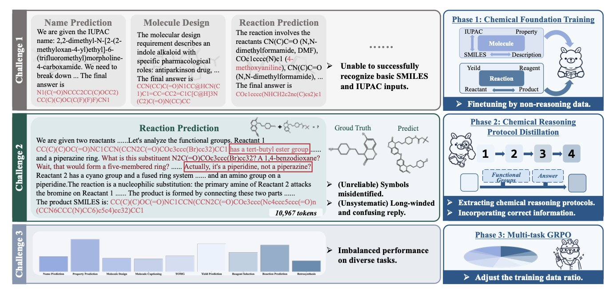
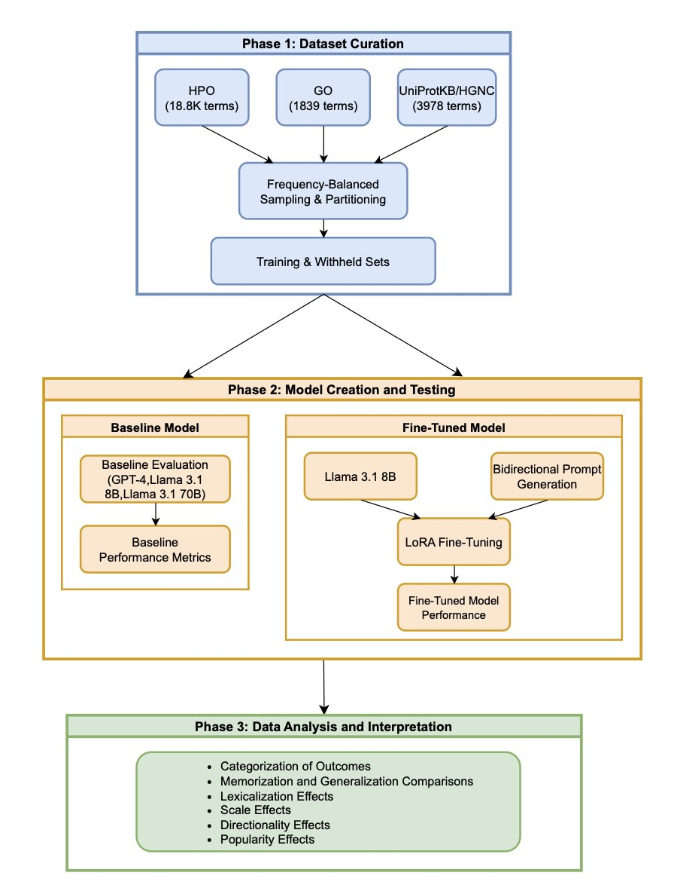
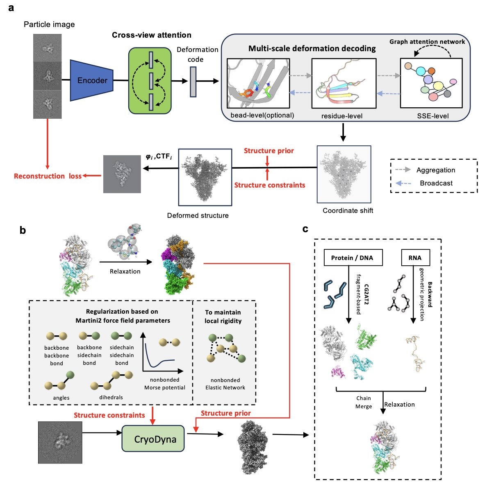
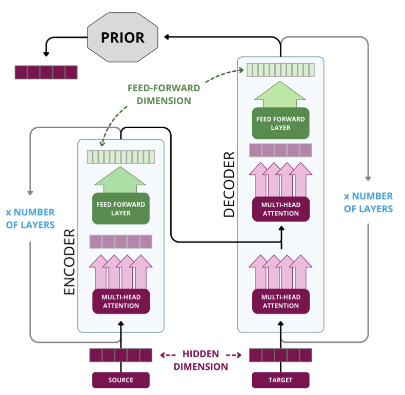
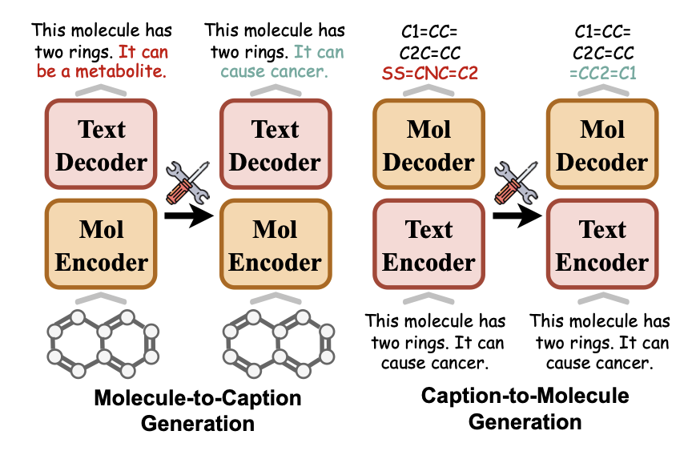

## 目录  
1. Chem-R 模仿化学家的思维，解决大语言模型在化学领域的逻辑谬误，让 AI 从「知识库」向「研发伙伴」转变。
2. 大语言模型微调的效果，取决于它学习的标识符。如果标识符有意义（如基因名），模型就能学会泛化；如果是任意编码（如本体论 ID），模型就只会死记硬背。
3. CryoDyna 将冷冻电镜 (Cryo-EM) 的静态快照转为蛋白质动态的高清电影，直接从 2D 图像重建出原子级别的连续构象变化。
4. 在药物分子生成任务中，提升训练数据的结构多样性，比单纯堆砌模型参数或扩大数据规模，更能产出高质量且多样的苗头化合物。
5. MolEdit 利用多专家适配器和智能开关，实现了对多模态分子语言模型的高精度知识更新，有效解决重训成本高昂与微调引发的「灾难性遗忘」难题。

## 1. Chem-R：教 AI 像化学家一样推理  
  
  

现有的大语言模型 (Large Language Models, LLMs) 在解决化学问题时，常会给出看似专业的错误答案。它们能复述教科书中的反应，但面对一个新分子，它们设计的合成路线可能会出现一个连着五根键的碳原子。这说明，模型学会了化学语言，却没有掌握其背后的物理规律和逻辑。  
  
Chem-R 模型正是为了解决这个问题。它的思路很直接：教会 AI 像训练有素的化学家一样思考。  
  
它的工作原理分为三步。  
  
第一步，**打好化学基础 (Chemical Foundation Training**)。  
这相当于让 AI 上基础化学课。模型首先用海量的分子结构、化学反应等非推理数据进行微调，目的是让它掌握基本的化学语言，例如 SMILES 表达式的写法、官能团的结构，避免犯「碳五键」这类低级错误。这是建立可靠推理能力的基础。  
  
第二步，**学习专家的解题思路 (Chemical Reasoning Protocol Distillation**)。  
这是 Chem-R 的核心。人类解决化学问题时，会遵循一套思维流程。例如，在逆合成分析中，我们会先识别关键官能团，寻找可以断开的化学键，提出可能的合成子，再匹配到相应的合成砌块。Chem-R 就学习这套思维「协议」。它通过模仿一个更强大的「教师模型」生成的高质量、分步推理过程，让自己的输出不再是黑箱式的答案，而是一条有理有据、可供检验的思考路径。  
  
第三步，**做到文理兼修，全面发展 (Multi-task Group Relative Policy Optimization**)。  
优秀的化学家既要懂反应预测，也要懂分子性质。这一步旨在确保模型不会「偏科」。通过一种特殊的优化策略，模型在分子层面任务（如性质预测）和反应层面任务（如产物预测）上的表现得以平衡。这能防止模型在某个任务上表现过强而牺牲其他任务的性能，使其成为一个更全面的「化学家」。  
  
Chem-R 的表现在分子和反应相关任务上，比 Gemini-2.5-Pro 和 DeepSeek-R1 等通用大模型高出 46% 到 66%，也超过了其他为化学领域专门设计的模型。  
  
人类化学专家也对 Chem-R 生成的推理过程进行了评估。结果显示，Chem-R 在化学知识的准确性、逻辑的连贯性和专家洞察力等多个维度上都获得了最高分。这说明，模型的解题思路得到了专业同行的认可。  
  
在药物研发领域，AI 或许很快就能从一个查找文献数据的「图书馆管理员」，转变为能讨论合成路线、分析分子活性、提出优化建议的「虚拟同事」。当 AI 掌握了「是什么」、「为什么」以及「如何做」，它才能在药物研发中真正发挥创造性价值。Chem-R 虽不完美，但它指明了一条正确的道路：教 AI 像专家一样思考，而不只是模仿语言。  
  
📜Title: Chem-R: Learning to Reason as a Chemist  
🌐Paper: <https://arxiv.org/abs/2510.16880>  

## 2. AI 微调揭秘：模型何时死记硬背，何时真正学会？  
  
  

我们希望大语言模型（Large Language Models, LLM）是科研助理，不是只会背书的复读机。在生物医药领域，一项繁琐的基础工作是术语标准化，也就是把「心脏病发作」这类术语，准确对应到 `MeSH ID D009203` 这样的标准标识符上。如果 AI 能真正理解这些术语，研发将大大提速。  
  
一篇论文探究了微调究竟是在教大语言模型「理解」还是「背诵」。研究人员用 Llama 3.1 8B 模型，教它识别三种生物学术语体系：人类表型本体论 (Human Phenotype Ontology, HPO)、基因本体论 (Gene Ontology, GO) 和蛋白质 - 基因符号映射。  
  
结果对比鲜明。  
  
对于 GO 和 HPO，微调提升了模型对训练数据的准确率，但这只是死记硬背。遇到没见过的新术语，模型就无能为力，这叫「记忆」（Memorization）。  
  
但在蛋白质 - 基因符号映射任务上，模型不仅记住了训练数据，还能准确处理从未见过的蛋白质 - 基因对。这才是我们追求的「泛化」（Generalization）能力，说明模型学到了规律。  
  
造成这种差异的原因有两个：**标识符流行度**和**标识符词汇化**。  
  
「流行度」指一个术语 - 标识符对在预训练数据中出现的频率。见得越多，模型印象越深，微调效果越好。  
  
关键在「词汇化」（Lexicalization）。  
  
词汇化的标识符本身就包含语义信息。例如基因符号 `TP53`，它在海量文本中与「肿瘤抑制」、「细胞周期」等概念相关联。模型预训练时，已为 `TP53` 建立了语义网络。微调的作用，就是将这个现有网络与新术语精准连接。有了这个语义「脚手架」，模型就能举一反三。  
  
相比之下，`HPO:HP:0001250`（癫痫发作）或 `GO:0008150`（生物学过程）这类标识符是「非词汇化」的。它们是任意字符串，不携带生物学含义。模型只能死记硬背「输入 A，就输出 B」的映射关系。这种记忆是脆弱的，遇到新术语就会失效。  
  
这好比教一个熟悉各种鱼的人辨认「石斑鱼」，他能很快学会，甚至推断出其他类似鱼类的样貌。但如果你给他一张随机编码的卡片，告诉他这就是「石斑鱼」，他除了背下这张卡片，什么也学不到。  
  
研究还有两个发现：  

因此，在微调模型处理术语标准化任务前，先判断你的目标标识符是像 `TP53` 这样有意义的词，还是像 `GO:0008150` 这样的任意编码。  
  
这个答案决定了你的模型会成为一个助理，还是一个笨拙的复读机。  
  
📜Title: From Memorization to Generalization: Fine-Tuning Large Language Models for Biomedical Term-to-Identifier Normalization  
🌐Paper: https://arxiv.org/abs/2510.19036  

## 3. CryoDyna: 让冷冻电镜「动」起来，看清蛋白质动态电影  
  
  

蛋白质是动态的，而冷冻电镜（Cryo-EM）捕捉到的精美结构，只是其运动过程中的静态快照。仅凭一张发动机的静止照片，难以理解其工作原理，理解蛋白质也是同理。要理解靶点功能及药物的相互作用，必须观察其动态过程。CryoDyna 工具正是为此而设计。  
  
**它的工作原理是什么**？  
  
传统流程需要先对颗粒分类、重建几个离散的静态结构，再将它们联系起来。CryoDyna 采用了一个更直接的端到端深度学习框架：输入数万张不同朝向的 2D 颗粒图像，它能直接输出一个连续的动态模型。  
  
这个过程有两个关键技术。  
  
第一是**交叉视图注意力（cross-view attention）模块**。为确定一个物体的三维形状，需要从不同角度观察。该模块能同时分析来自不同方向的 2D 投影图像，并融合信息。这有助于相互验证、减少噪声，确保最终重建的 3D 动态在几何上自洽。  
  
第二是**多尺度变形预测（multi-scale deformation**）。这个方法好比绘画，先勾勒大的轮廓和动态（粗粒度的整体运动），再添加细节（局部结构的精细变化）。CryoDyna 先学习蛋白质的大范围运动，再逐步精修局部结构。这种由粗到精的策略，使其能准确捕捉从全局到局部的多尺度结构变化。  
  
**它融合了物理规律**  
  
为避免 AI 模型生成不符合物理规律的结果，CryoDyna 引入了基于 MARTINI 的粗粒化模型。它在学习蛋白质运动时，会受到物理规则的约束，确保预测的构象变化在能量上合理。之后，通过「反向映射」过程，将这个符合物理规律的粗粒化动态模型，还原成包含所有原子的精细模型。这样得到的动态模型，不仅分辨率接近原子级别，也具备物理意义。  
  
**它能带来什么**？  
  
研究者在多个复杂系统上验证了 CryoDyna 的能力。例如，他们解析了 RAG 信号末端复合物中一个此前未见区域的动态，并描绘了核糖体在易位过程中的状态变化。它还能揭示蛋白质和 RNA 之间的协同运动。  
  
在药物研发中，CryoDyna 能够展示激酶激活环（activation loop）的开闭过程，或 GPCR 被配体逐步激活的细节。我们还能分析药物分子如何将靶点锁定在失活构象。这些信息对设计更高效、特异的药物至关重要。  
  
CryoDyna 填补了冷冻电镜静态结构分析与分子动力学模拟（Molecular Dynamics, MD）之间的空白，让研究者能更快速、直观地利用实验数据探索蛋白质的动态过程。  
  
📜Paper: CryoDyna: Multiscale end-to-end modeling of cryoEM macromolecule dynamics with physics-aware neural network  
🌐Paper: https://arxiv.org/abs/2510.16510  
💻Code: https://github.com/Qmi3/CryoDyna  

## 4. 化学语言模型：数据多样性胜过盲目扩容  
  
  

AI 制药领域常有一种迷信：模型做大、数据喂多，奇迹就会发生。这在大语言模型（LLM）处理自然语言时或许成立，但在处理化学语言（SMILES）时情况不同。ChemRxiv 上的这项新研究，通过系统性实验否定了这种「大力出奇迹」的思路。  
  
**规模不是万能药**  
  
研究人员评估了基于编码器 - 解码器（Encoder-Decoder）架构的 Transformer 模型。模型参数增加到一定程度后，生成有效苗头化合物（Hits）的能力并未显著提升。单纯增加训练数据量，超过特定点后收益也会持平。制药公司无需无止境购买昂贵算力训练超大模型，化学空间探索有其独特规律。  
  
「**喂养」策略**  
  
既然单纯「吃得多」无用，重点便在于「吃得杂」。研究人员提出**数据多样化**策略：根据分子量对分子聚类，从各簇中采样。  
  
这种做法优势明显。若模型训练时只接触大量相似的苯环衍生物，生成的分子往往千篇一律。强制模型接触化学空间中分布更广、结构差异更大的分子，生成的「苗头化合物」多样性会有质的飞跃。早期药物发现的核心需求，正是不同骨架（Scaffold）的潜在分子。  
  
**别迷信 Loss 曲线**  
  
研究指出，预训练损失无法准确评估模型优劣。在自然语言处理中，Loss 降低通常代表模型变强；但在化学领域，Loss 降低与分子生成、属性优化等下游任务的表现关联不大。  
  
计算辅助药物设计（CADD）从业者需将评估体系回归本质，在真实药物设计场景中测试模型，验证其生成分子的药化学规则符合度、合成可行性及结构新颖性。  
  
这项工作为 AI 制药指明了更经济高效的道路：应当优先清洗和策划高质量、高多样性的化学数据集。寻找新药征途中，见多识广比单纯死记硬背更有价值。  
  
📜Title: Diversity Beats Size Scaling for Chemical Language Models  
🌐Paper: <https://doi.org/10.26434/chemrxiv-2025-k14gv>  

## 5. MolEdit：给分子大模型做「微创手术」的新方案  
  
  

科学领域的 AI 模型常面临「记忆固化」难题。模型一旦训练完成，修正错误或更新实验数据往往代价高昂：要么重头训练，要么通过微调冒着「灾难性遗忘」的风险——修好一个漏洞，却破坏了已有能力。  
  
针对多模态分子语言模型（MoLMs），新方案 MolEdit 应运而生。这类模型需同时理解化学分子结构（如 SMILES）与自然语言描述，两者映射关系复杂。MolEdit 如同一把精准的手术刀，在不破坏模型原有能力的前提下，定向修改特定分子知识。  
  
该系统依赖两大核心设计。  
  
首先是 MEKA（多专家知识适配器）。分子知识涵盖溶解度、毒性、结合靶点等多个维度。MEKA 类似于医院分诊台，将修改指令路由给负责对应领域的「专家模块」。这种策略实现了对多面性分子知识的细粒度控制。  
  
其次是 EAES（专业感知编辑开关）。它为模型加装了一道「保险栓」：仅当用户输入与存储的「补丁」高度吻合时，才激活编辑后的知识；若问题无关，系统保持静默，调用原有知识库。这一机制大幅降低了新知识对模型通用能力的干扰。  
  
为验证效果，研究建立了 MEBench 测试基准。在 MoMu 和 MolFM 两个主流分子多模态模型上的测试表明：MolEdit 修正错误的准确度（可靠性）提升 18.8%，保护无关知识不被破坏的能力（局部性）提升 12.0%。  
  
药物化学家和计算生物学家将由此获得更可控的 AI 助手。发现模型对先导化合物描述有误，或产生新的 SAR（构效关系）数据时，可直接通过 MolEdit 进行「热更新」。这有助于构建数据实时准确、能够长期演进的科学发现引擎。  
  
📜Title: MolEdit: Knowledge Editing for Multimodal Molecule Language Models  
🌐Paper: <https://arxiv.org/abs/2511.12770v1>  
💻Code: <https://github.com/LzyFischer/MolEdit>
