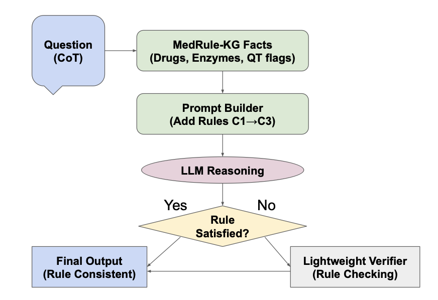
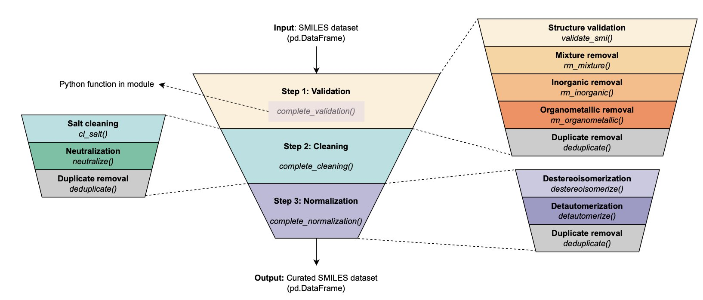
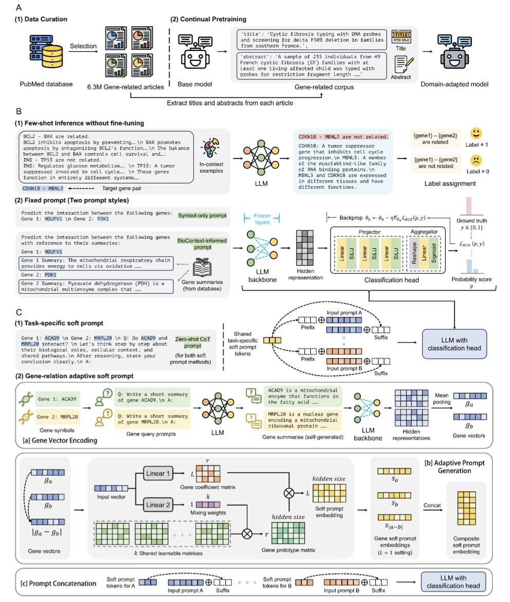
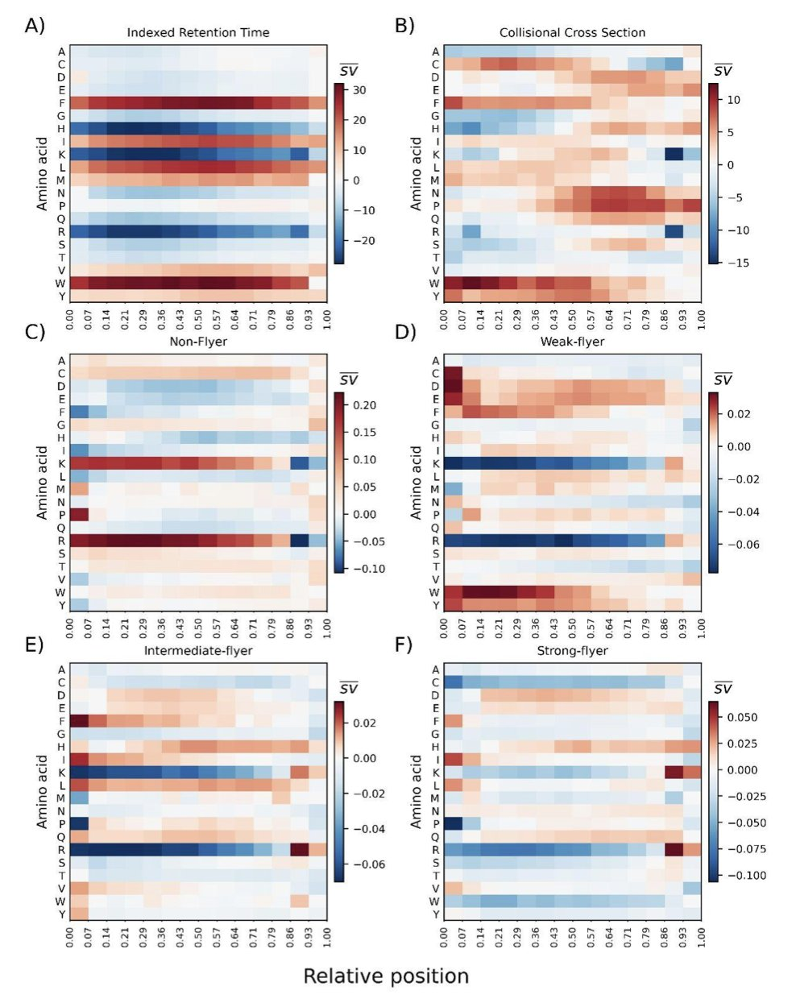
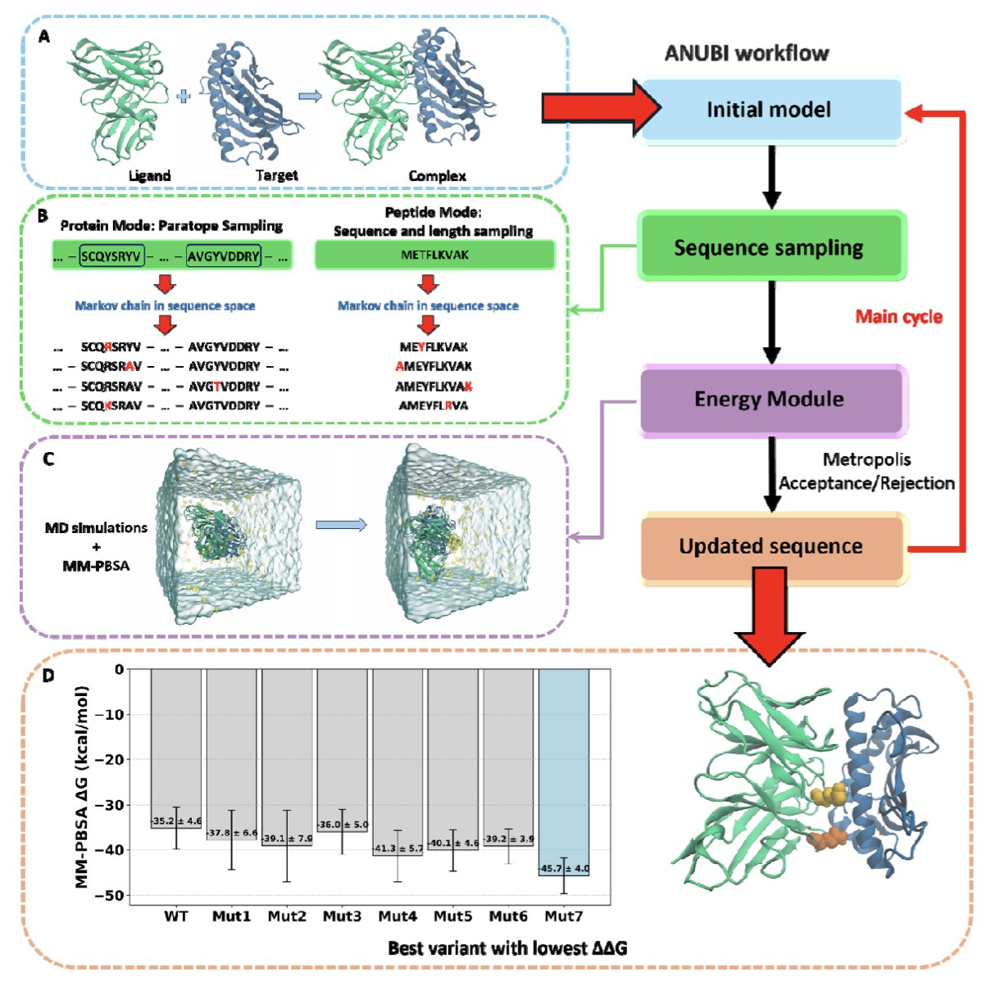

## 目录  
1. MedRule-KG 将知识图谱的「硬逻辑」嵌入大模型生成过程，像给 AI 戴上了紧箍咒，大幅减少了药物设计中的低级科学错误。
2. MEHC-Curation 利用标准化验证、清洗和归一化流程，解决药物发现中「垃圾进，垃圾出」的数据难题，提升 QSAR 模型预测能力。
3. GRASP 框架利用一种巧妙的提示工程方法，让大语言模型能够高效、准确地推断基因间的复杂关系，甚至能跨物种应用。
4. 这项研究利用可解释性 AI（SHAP）证明，深度学习模型真正掌握了多肽保留时间和碎裂规律背后的物理化学机制。
5. ANUBI 将复杂的分子动力学模拟和自由能计算打包成自动化工具，让非计算专家也能快速筛选和优化蛋白质或多肽候选药物。

## 1. MedRule-KG：给 AI 药物研发装上「逻辑护栏」  
  
  

药物研发人员深知大语言模型（LLM）的通病：它能写出漂亮的诗，但预测反应产物或设计分子时常一本正经地胡说八道。在化学生物领域，这种「幻觉」致命——无论 AI 觉得多美，碳原子不可能有五根键。  
  
**MedRule-KG** 试图解决这一痛点。它避开无休止的数据投喂（Retraining），选择给模型装上一套「外骨骼」。  
  
**工作原理**  
  
这就像给才华横溢但爱信口开河的学生立规矩。  
  
首先，引入**轻量级知识图谱**。它如同随身携带的教科书，包含经过验证的生物医学事实。  
  
接着是核心部分——**软约束控制器（Soft Constraint Controller**）。MedRule-KG 干预 LLM 基于概率的生成过程：若下一个词违反知识图谱规则（如代谢兼容性），控制器即刻压低其概率，把模型推回正轨。这既保证逻辑正确，又保留了语言流畅性。  
  
最后是**确定性校验器（Deterministic Verifier**）。这位「审计员」在模型生成后进行复查，发现违反预定义生化规则即直接驳回。  
  
**实际效果**  
  
数据硬核。在反应可行性、代谢兼容性和毒性筛选等关键任务上，该系统比强力基线模型**减少了 83.2% 的规则违反**。我们更有可能得到能真正合成的分子，而非存在于计算机里的怪物。  
  
**速度**也是关键。全流程（提示、生成、校验）处理一个查询不足 200 毫秒，对高通量筛选或交互式药物设计极具实用价值。  
  
「神经符号 AI」（Neuro-symbolic AI）代表了未来方向。单纯依靠神经网络黑盒「猜」化学规律存在极限，将明确的科学规则（符号逻辑）硬编码进去，才是通往可信赖 AI 的正道。  
  
📜Title: MedRule-KG: A Knowledge-Graph–Steered Scaffold for Reliable Mathematical and Biomedical Reasoning  
🌐Paper: <https://arxiv.org/abs/2511.12963v1>  

## 2. QSAR 数据清洗利器：MEHC-Curation 开源框架  
  
  

从事计算辅助药物设计（CADD）或 QSAR 建模的研究者常面临一个困境：从公共数据库下载的分子数据往往包含盐类、溶剂分子、错误 SMILES 格式，甚至同一分子的活性数据自相矛盾。「脏数据」直接导致了「垃圾进，垃圾出」。  
  
**MEHC-Curation** Python 框架为此而生。这是一套完整的自动化处理流水线。  
  
**工作原理**  
  
MEHC-Curation 将数据处理分为三个核心步骤：  
  
1.  **验证（Validation**）：识别并移除无效化学结构。  
2.  **清洗（Cleaning**）：去除盐类和溶剂分子，仅保留核心活性药物成分。  
3.  **归一化（Normalization**）：统一互变异构体和芳香环表示，确保同一分子在计算机中仅有一种标准写法。  
  
框架内置去重功能，可按预设规则（如取活性值平均值）处理重复分子。  
  
**实际效果**  
  
作者在 15 个基准数据集上的测试显示，使用清洗后数据训练的机器学习模型，表现普遍优于未处理数据。这一结果证实了数据质量在 AI 制药中的关键作用。  
  
**使用优势**  
  
针对海量数据，工具支持并行处理以提升效率。其「可追溯性」尤为重要：系统生成详细日志，记录每一个变动。分子被剔除是因格式错误还是结构无效，均清晰可查。  
  
使用简便，只需准备包含 SMILES 字符串的 `.csv` 文件。这为药物研发人员节省了大量预处理时间。  
  
📜Title: MEHC-Curation: A Python Framework for High-Quality Molecular Dataset Curation  
🌐Paper: https://doi.org/10.26434/chemrxiv-2025-3x7gq  

## 3. GRASP：用大模型提示工程推断基因网络  
  
  

推断基因调控网络一直是生物信息学里的一个硬骨头。数据越来越多，但要从海量信息中理清基因之间谁调控谁、谁与谁相互作用，依然挑战巨大。现有的计算方法各有局限。  
  
GRASP (Gene-Relation Adaptive Soft Prompt) 框架为此提供了一个新思路。它不重新训练模型，而是用一种参数高效的方法，调整现有的大语言模型 (Large Language Models, LLM)。  
  
可以这样理解这个过程。一个预训练好的大语言模型，就像一个知识渊博但领域宽泛的专家。如果直接问它两个基因之间有什么关系，它可能会给一个泛泛而谈的答案。GRASP 的做法是，在提问时，给这个专家递上一张高度定制化的「小抄」，也就是「适应性软提示 (adaptive soft prompt)」。  
  
这张「小抄」为每一对基因量身定做，包含了基因各自的特征信息，以及它们之间可能存在的关系「线索」。专家（大语言模型）拿到「小抄」后，就能给出关于这对基因关系的精准判断。整个过程中，预训练模型的参数是锁定的，只需要训练生成「小抄」的模块。这样既利用了大模型的先验知识，又保持了参数效率。  
  
在蛋白质相互作用 (PPI) 的大规模基准测试中，GRASP 的表现超过了所有基线方法，ROC-AUC 值最高达到 0.937。  
  
模型也展现了通用性。用人类数据训练的 GRASP 模型，能直接预测小鼠的基因相互作用。这种跨物种迁移能力在药物研发和转化医学中有应用前景。此外，模型在磷酸化网络等其他生物网络推断中同样表现稳健。  
  
GRASP 的潜力还体现在「纠错」和「发现」上。它能识别出数据库中先前被错误标记的基因相互作用。因此，GRASP 不仅能预测未知关系，还能审视和修正现有知识库，成为一个科学发现的引擎，帮助我们从海量数据中找到新的生物学联系。  
  
📜Title: GRASP: Gene-Relation Adaptive Soft Prompt for Universal Gene Network Inference  
🌐Paper: https://www.biorxiv.org/content/10.1101/2025.10.20.683485v1  

## 4. 打开多肽 AI 黑盒：SHAP 揭示预测模型背后的化学原理  
  
  

深度学习模型在蛋白质组学数据处理上表现优异，能准确预测保留时间、碰撞截面（CCS）甚至碎片强度。核心挑战在于解决「黑盒」问题：我们需要确认模型是基于正确的物理化学规律做出判断，而非仅仅拟合了数据中的偏差。  
  
这项研究利用 SHAP（Shapley Additive Explanations）技术解剖多肽预测模型。结果显示，这些模型确实理解化学原理。  
  
**保留时间：模型学会了疏水性**  
  
分析液相色谱保留时间预测器发现，模型自动给疏水性氨基酸分配正向 SHAP 值（增加保留时间），亲水性氨基酸则为负值。  
  
模型在从未输入 Kyte-Doolittle 疏水性量表的情况下，完全从序列数据中归纳出了这一规律。其推导出的 SHAP 值与经典氨基酸指数对比，皮尔森相关系数高达 0.973。AI 内部构建了一套与化学家通过实验测得几乎一致的「物理化学直觉」。  
  
**碎裂机制：重现移动质子模型**  
  
对串联质谱（MS/MS）碎裂模式的分析显示，模型对精氨酸、赖氨酸等碱性氨基酸极为敏感。  
  
多肽碎裂遵循「移动质子模型」（mobile proton model）：质子移动能力决定肽键断裂难易。SHAP 分析表明，模型捕捉到了强碱性残基隔离（sequestering）质子的现象，预测碎片强度分布随之偏移，并区分了电荷导向（charge-directed）和电荷远程（charge-remote）碎裂途径的细微差别。  
  
**从黑盒到白盒**  
  
定制合成的多肽实验进一步证实，模型对特定位点突变反应敏感。这证明模型正在模拟分子的化学行为。  
  
对于药物研发和蛋白质组学科学家而言，这些工具值得信赖。SHAP 将成为连接数据科学与翻译后修饰（PTM）或电子转移解离（ETD/ECD）等复杂反应机理的重要桥梁。  
  
📜Title: Systematic evaluation of peptide property predictors with explainable AI technique SHAP  
🌐Paper: https://www.biorxiv.org/content/10.1101/2025.11.19.689259v1  

## 5. ANUBI：蛋白质/多肽药物亲和力优化自动化平台  
  
  

在蛋白质或多肽药物的研发中，提升亲和力是关键一步。研发人员需要筛选成百上千种氨基酸突变，寻找能让药物和靶点结合更紧密的「黄金组合」，这个过程耗时且昂贵。  
  
研究人员开发了一款名为 ANUBI 的软件，旨在简化这一流程。你可以把它看作一个虚拟的分子进化引擎。  
  
它的工作原理如下：首先，用户提供蛋白质或多肽候选药物的结构。ANUBI 会在指定区域内，通过蒙特卡洛（Monte Carlo）方法，系统性地尝试替换单个氨基酸，即进行单点突变。  
  
每产生一个新突变，软件都会评估其效果。这个评估是整个工作的核心，也最消耗计算资源。ANUBI 采用分子动力学（Molecular Dynamics, MD）模拟，结合 MMPBSA 方法计算结合自由能。  
  
MD 模拟让分子在计算机中运动，寻找最稳定的结合构象。MMPBSA（Molecular Mechanics/Poisson-Boltzmann Surface Area）则基于这些动态过程的快照，估算结合的紧密程度。MMPBSA 是一种成熟的工具，虽然计算结果可能存在偏差，但在预测趋势和排序候选分子方面很有效。  
  
如果一个突变优化了结合能，ANUBI 会保留它，并在此基础上继续尝试下一个突变。整个流程自动运行，研究人员只需设定初始参数。  
  
为验证其性能，开发者在两个场景中测试了 ANUBI：一个抗体 - 抗原复合物，一个多肽 - 蛋白质相互作用。结果显示，在单块 GPU 上运行约 20 天后，ANUBI 找到了预测结合能提升约 20 kcal/mol 的突变体。  
  
需要指出，20 kcal/mol 是一个很高的理论值。在实际研发中，通过几个点突变达到如此大的亲和力提升很罕见。MMPBSA 的计算结果自身带有误差，因此这个数字主要是一个计算信号，表明这些突变体有优化的潜力。最终效果必须通过合成样品，并利用表面等离子共振（SPR）或等温滴定量热法（ITC）等湿实验技术来验证。  
  
ANUBI 的价值在于，它将一个需要计算化学专家操作的复杂流程，封装成一个易用的工具。药物研发团队可以在计算机上用几周时间，低成本地筛选出十几个有希望的候选分子，然后集中资源进行实验验证，从而节省时间与成本，让后续实验更有针对性。  
  
📜Title: Anubi: A Platform for Affinity Optimization of Proteins and Peptides in Drug Design  
🌐Paper: https://www.biorxiv.org/content/10.1101/2025.10.20.683353v1
