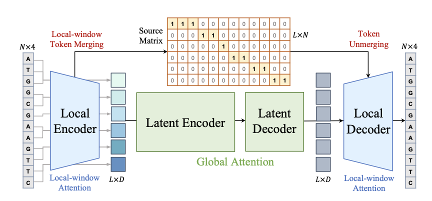
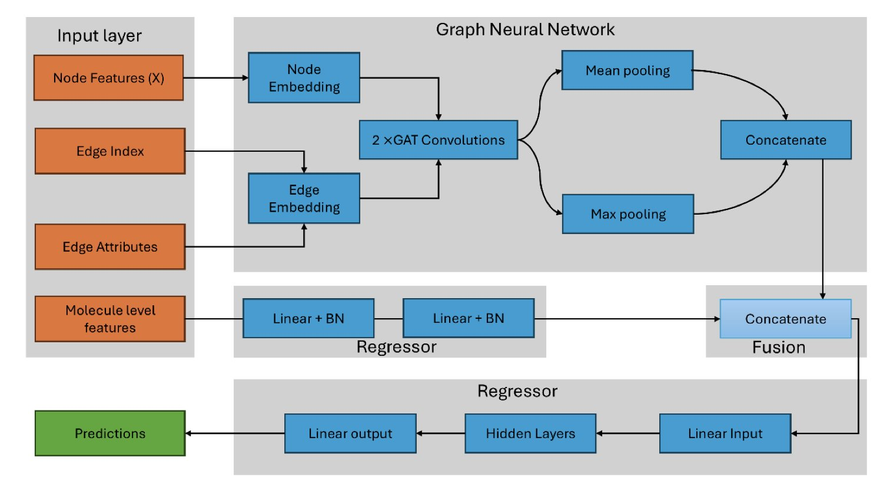
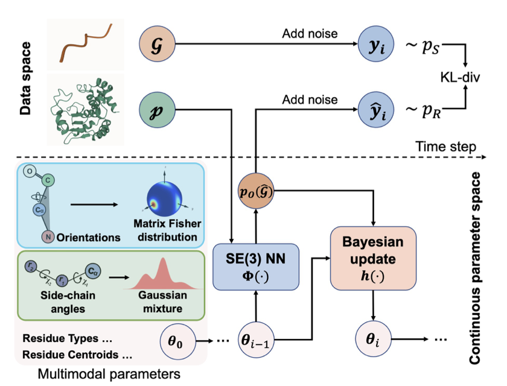
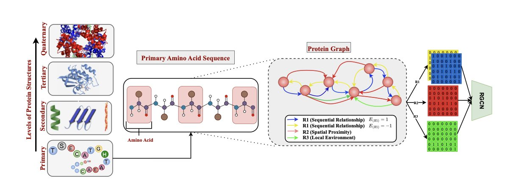
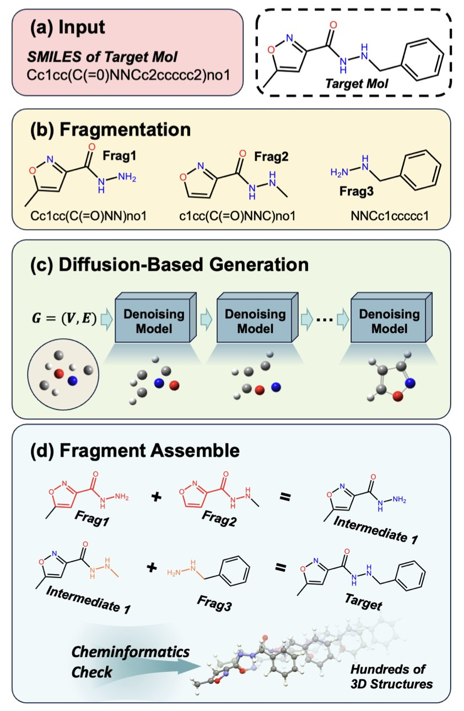

## 目录  
1. MergeDNA 利用动态分词策略适配基因组复杂性，在多组学任务中超越现有 SOTA 模型。
2. 这种新型混合深度学习框架引入原子杂化状态，并结合传统分子描述符，成功突破了单一 GNN 模型难以捕捉全局物化性质的瓶颈。
3. PepBFN 利用黎曼 - 欧几里得贝叶斯流网络，在全连续参数空间统一建模序列与结构，解决侧链旋转异构体的多模态分布难题。
4. SSRGNet 结合序列语言模型与 3D 空间图网络，利用多重关系边和并行融合策略，提升了蛋白质二级结构预测的精度。
5. StoL 通过将大分子拆解为片段，利用扩散模型分别生成 3D 结构后组装，巧妙解决了大分子构象生成中训练数据匮乏的难题。

## 1. MergeDNA：基因组建模的动态分词突破  
  
  

现有的 DNA 大语言模型（DNA Foundation Models）常因处理方式深受人类语言模型影响而陷入困境。主流的 k-mer 或字节对编码（BPE）难以应对基因组极不均匀的信息密度：高密度编码区哪怕一个碱基的变动都至关重要，而大段重复序列则包含极低信息量。用同一把尺子衡量这两类区域并不合理。  
  
**MergeDNA** 引入了「变焦镜头」式的分层架构。它利用局部编码器（Local Encoder）配合可微分的 Token 合并（Token Merging）技术解决这一难题。  
  
遇到高度重复、低信息量序列，模型自动合并 Token，实现「一目十行」；面对复杂的启动子或外显子区域，则保留细粒度 Token，做到「逐字精读」。这种动态调整既能捕捉短程基序（Motifs），又能高效处理长程依赖关系。  
  
训练该架构依赖两个关键预训练任务：  
1.  **合并 Token 重建（Merged Token Reconstruction**）：模型需还原合并后的 Token，迫使其理解被压缩区域的上下文。  
2.  **自适应掩码建模（Adaptive Masked Token Modeling**）：进阶版掩码语言模型，自适应过滤重要 Token 进行掩码预测。  
  
MergeDNA 在多个 DNA 基准测试和多组学任务中达成 SOTA（State-of-the-Art）。在跨物种泛化、RNA 剪接位点预测及零样本蛋白适应性预测（Zero-shot protein fitness prediction）等硬核任务上，表现优于传统大规模模型。  
  
对于计算辅助药物发现（CADD）和合成生物学，这提供了更高分辨率的工具。模型超越了机械的碱基概率统计，真正开始识别基因组中的信号与噪音。  
  
📜Title: MergeDNA: Context-aware Genome Modeling with Dynamic Tokenization through Token Merging  
🌐Paper: <https://arxiv.org/abs/2511.14806v1>  

## 2. 原子杂化赋能 GNN：药物靶点预测精准度大增  
  
  

**给 AI 装上「化学家的眼睛**」  
  
计算辅助药物发现常将分子简化为二维图，原子仅作为节点，忽略了更深层的化学性质。但在药物化学家眼中，苯环上的碳（sp2 杂化）与连着四个单键的碳（sp3 杂化）天壤之别：它们的空间占据、电子云分布及反应活性截然不同。  
  
该研究开发了一种基于原子杂化（Atomic Hybridization）的图神经网络（GNN）模型。模型不再局限于基础原子类型，而是深入电子构型和空间取向层面。这种处理方式让算法能像化学家一样，从电子层面感知分子的局部结构。  
  
**新老结合：GNN 与分子描述符的联姻**  
  
纯 GNN 模型往往过于关注局部连接，容易忽略脂水分配系数 logP 或分子量等整体性质。为解决此问题，研究者设计了一种混合架构：一条支路通过 GNN 处理局部结构，另一条专门处理经典分子描述符。  
  
这如同评估药物分子时，既用显微镜观察官能团细节，又参考宏观物化指标。这种协同效应提升了预测精度，并保留了可解释性——我们可以看到哪些物理化学性质在发挥作用。  
  
**数据与结果：硬碰硬的提升**  
  
研究人员利用 9 个生物靶点、14,316 个化合物进行训练。测试集 R² 达到 0.87，性能较既往方法提升 6% 至 42%。在激酶、核受体等高成药性靶点上，模型展现出优异的 IC₅₀ 预测能力。  
  
**多靶点联合训练**是另一大亮点。针对新靶点数据匮乏的痛点，该模型允许知识在不同蛋白家族间迁移。在数据丰富靶点上学到的规律，可辅助预测数据稀缺靶点，这对仅有少量活性数据的孤儿受体极具实用价值。  
  
若后续引入 3D 构象信息，或利用大规模预训练模型进行微调，该框架的潜力将得到进一步释放。  
  
📜Title: Graph Neural Networks Model Based on Atomic Hybridization for Predicting Drug Targets  
🌐Paper: <https://www.biorxiv.org/content/10.1101/2025.11.19.689219v1>  

## 3. PepBFN：贝叶斯流重塑全原子多肽设计  
  
  

多肽设计长期面临一个痛点：离散的氨基酸序列与连续的三维结构坐标难以协同。PepBFN 引入贝叶斯流网络（Bayesian Flow Networks, BFNs），用一种数学上优雅的方式尝试解决这一难题。  
  
**全连续参数空间**  
  
传统扩散模型处理离散序列时涉及加噪去噪，难免损失信息。PepBFN 将序列和结构统一置于全连续参数空间。这种处理方式类似将数字信号转化为模拟信号，在捕捉细微变化时具备离散模型无法比拟的平滑度与连贯性。  
  
**侧链动态捕捉**  
  
氨基酸侧链并非只有固定姿态，而是存在旋转异构体（rotamers），类似开关的多个档位。传统模型常假设侧链服从单峰高斯分布，这违背物理规律。PepBFN 引入**高斯混合模型（Gaussian mixture-based**）的贝叶斯流，准确识别侧链在空间中的多个潜在稳定状态，而非强行取平均值。这种对多模态（multimodal）特性的捕捉提升了侧链预测精度。  
  
**SO(3) 流形几何归位**  
  
蛋白质骨架取向（Orientation）若用欧几里得几何计算，极易产生偏差且需频繁修正。该模型直接在 **SO(3) 流形**上工作，采用基于 **Matrix Fisher** 分布的黎曼流。这种专门描述旋转的数学语言让贝叶斯更新易于计算，残基方向的变化在数学上自然连续，无需额外几何约束防止结构崩塌。  
  
**实战表现**  
  
理论优势转化为实际性能。在侧链包装（side-chain packing）、反向折叠（reverse folding）及高难度的结合体设计（binder design）任务上，PepBFN 刷新了现有最佳成绩。将旋转异构的多样性、几何空间的非欧几里得性等生物物理特性正确映射到数学模型中，计算辅助药物设计的精度便跃升新台阶。  
  
📜Title: Full-Atom Peptide Design via Riemannian–Euclidean Bayesian Flow Networks  
🌐Paper: <https://arxiv.org/abs/2511.14516>  

## 4. SSRGNet：3D 图神经网络与大语言模型联手预测蛋白质结构  
  
  

*   **双重编码机制**：使用 DistilProtBert 处理序列信息，结合关系型图卷积网络（R-GCN）处理 3D 结构特征。  
*   **多维关系建模**：构建包含序列、空间和局部环境三种边缘类型的蛋白质图，捕捉复杂折叠模式。  
*   **并行融合优势**：并行融合（Parallel Fusion）能比串行或交叉融合更有效地保留多模态信息的互补性。  
*   **性能验证**：在 CB513、TS115 和 CASP12 等基准数据集上，准确率超越现有主流方法。  

蛋白质结构预测领域正在融合自然语言处理（NLP）的大语言模型（LLM）与处理几何结构的图神经网络（GNN）。**SSRGNet** 展示了将「阅读」氨基酸序列与「观察」3D 拓扑结构结合的成果。  
  
**兼顾序列与形状**  
  
蛋白质本质是空间结构，仅关注序列会丢失关键的空间信息。SSRGNet 利用 **DistilProtBert** 提取序列中的上下文语义，同时构建 **3D 蛋白质残基图**，通过图神经网络捕捉空间几何特征。  
  
**三种「关系」定义残基**  
  
模型通过三种不同类型的「边（Edge）」描述残基间关系，而非简单连接相邻残基：  
1.  **序列边（Sequential**）：关注前后相邻的氨基酸。  
2.  **空间边（Spatial**）：连接序列距离远但在 3D 空间折叠后紧邻的氨基酸，捕捉长程相互作用。  
3.  **局部环境边（Local Environment**）：描述残基周围微环境特征。  
  
借助**关系感知消息传递（Relation-Aware Message Passing**），模型能综合分析氨基酸的身份、位置及其邻近环境的影响。  
  
**并行融合策略**  
  
面对序列与结构两类数据，**并行融合（Parallel Fusion**）效果优于串行或交叉融合。这种方式允许独立处理序列与结构特征，最后综合判断，最大程度保留了两种模态的互补信息。  
  
**结果与应用**  
  
CB513 和 CASP12 等数据集的测试结果验证了模型的有效性。消融实验证实，三种关系边对于模型性能缺一不可。后续计划整合更多外部结构数据集进行预训练。对于药物设计或酶工程领域，这种能精细解读蛋白质局部几何结构的模型具有重要实用价值。  
  
📜Title: Protein Secondary Structure Prediction Using 3D Graphs and Relation-Aware Message Passing Transformers  
🌐Paper: <https://arxiv.org/abs/2511.13685v1>  

## 5. StoL：像搭乐高一样用扩散模型构建大分子 3D 构象  
  
  

药物研发始于精准的分子 3D 构象。小分子领域数据充足，处理起来得心应手；但大分子的高质量 3D 训练数据极度匮乏，直接使用端到端深度学习模型效果往往不尽人意。  
  
这项名为 StoL (Small-to-Large) 的研究另辟蹊径：既然大分子数据不够，那就将其拆解，利用小分子领域的优势来解决问题。  
  
**像搭积木一样组装分子**  
  
StoL 的工作逻辑直观且高效。它将复杂的长链分子沿可旋转单键切开，分解为化学上合理的刚性片段。  
  
这一操作将预测整个大分子复杂折叠的难题，转化为多个简单的局部 3D 生成任务。现有的扩散模型在小分子数据上训练充分，能轻松处理这些碎片。系统随后依据连接点信息，将生成好的 3D 碎片重新组装。这种方法有效避开了大分子数据不足的障碍。  
  
**注入「化学常识**」  
  
仅靠数据驱动容易导致模型犯低级错误，例如将本应平面的芳香环扭曲。StoL 为此设计了「化学增强」训练阶段。  
  
模型首先通过大量数据学习分子的总体形态，随后进入第二阶段，接受物理化学规则的专项训练。这种策略强制模型遵守键长、键角和平面性等基本原则。最终生成的结构不仅几何形态合理，能量稳定性也大幅提升。  
  
**超越 RDKit 的搜索能力**  
  
常用的 RDKit 工具虽然速度快，但容易陷入局部最优解，难以找到能量最低的天然状态。  
  
StoL 在这方面表现出色。通过计算化学的金标准——密度泛函理论 (DFT) 对比验证，StoL 生成的构象能量往往更低。这意味着它能探索更广阔的化学空间，发现传统方法遗漏且在生物体内真实存在的分子姿态。对于设计需要精确契合蛋白口袋的药物，这一优势至关重要。  
  
**局限与启示**  
  
StoL 并非完美，在处理难以简单切割的复杂稠环系统时仍显吃力。但这依然是计算化学领域的一次巧妙尝试，它展示了解决复杂问题的有效路径：将其拆解为我们已经能解决的简单问题。  
  
📜Title: Chemistry-Enhanced Diffusion-Based Framework for Small-to-Large Molecular Conformation Generation  
🌐Paper: <https://arxiv.org/abs/2511.12182v1>
