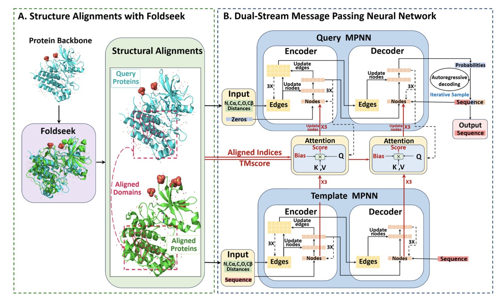
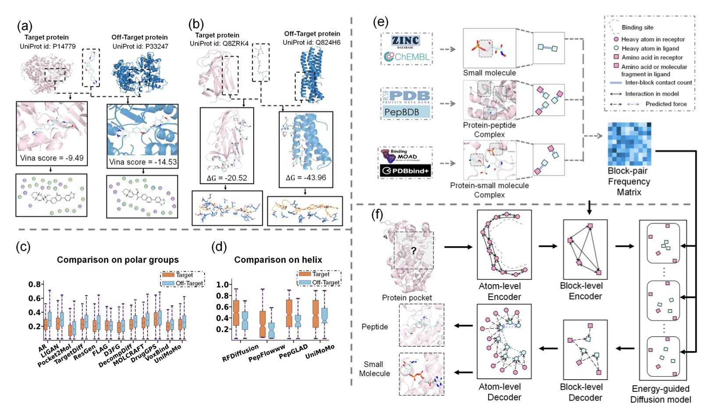
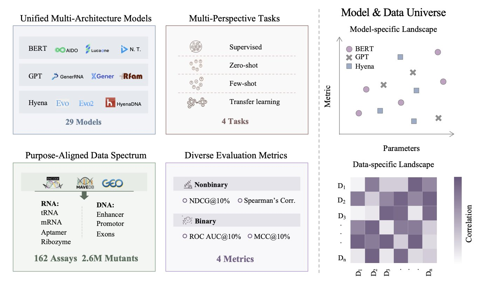
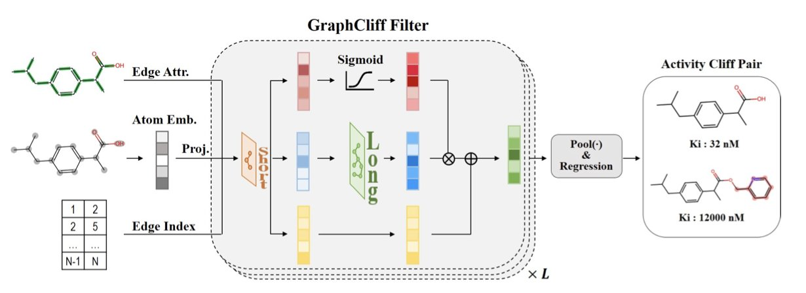
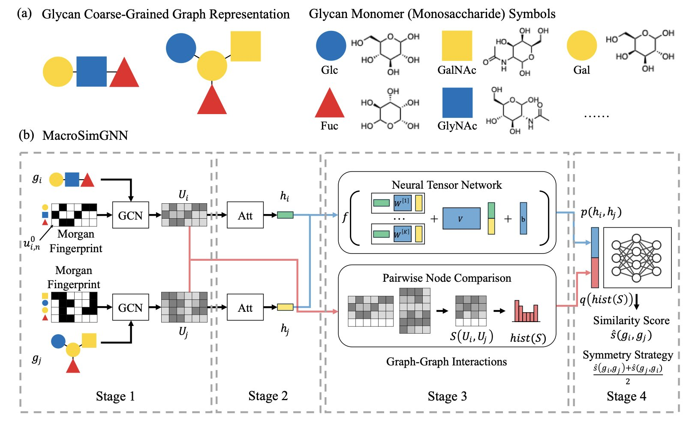

## 目录  
1. DualMPNN 模型借鉴相似蛋白质的结构信息，能更准确地设计出可折叠成特定三维结构的氨基酸序列。
2. SpecLig 框架结合层级图神经网络与能量引导的扩散模型，显著提升了从头设计（*de novo* design）配体的靶点特异性。
3. NABench 通过系统评估 29 个模型，揭示了不同核酸大模型在预测序列功能上的性能差异，为未来的模型优化和应用指明了方向。
4. GraphCliff 模型利用创新的门控机制，同步捕捉分子的局部细节与全局信息，提升了对活性悬崖化合物的预测准确性。
5. 这种专用的图神经网络架构，解决了大分子成对相似性预测中计算效率与准确性难以兼得的难题，是大规模药物筛选的强力工具。

## 1. 双流 MPNN：利用结构比对进行反向蛋白质折叠  
  
  

在蛋白质设计领域，一个核心挑战是反向蛋白质折叠：给定一个特定的三维结构，如何确定能精确折叠成该结构的氨基酸序列？这如同根据建筑蓝图，推导出所需砖块的种类与排列顺序。DualMPNN 为解决这一问题提供了新方法。  
  
设计一把新椅子时，可以参考现有椅子的构造。DualMPNN 的原理与此相似。它不仅分析给定的目标三维结构（查询结构），还会从数据库中寻找结构相似的蛋白质（结构同源物），如同设计新椅子时参考了大量经典案例。  
  
DualMPNN 模型的核心是一个双流信息处理系统。一个流分析目标结构自身的几何特征，另一个流则研究结构同源物的序列与结构规律。模型通过内部机制让两路信息交互，例如，从参考结构中学到的氨基酸排布规律，可用于指导目标结构关键位置的氨基酸选择。  
  
这种方法效果显著。研究者在 CATH、TS50 和 T500 等行业标准测试集上对 DualMPNN 进行了测试。结果显示，其序列恢复率分别达到 65.51%、70.99% 和 70.37%，相比表现优异的 ProteinMPNN 模型，提升了至少 12 个百分点。这一提升意味着设计出的序列有更高概率成功折叠成预想的结构。  
  
为了验证设计的序列在生物学上的可行性，研究者使用 AlphaFold2 和 AlphaFold3 预测了它们的折叠结构。大部分序列都能高精度地折叠回目标结构，证明了 DualMPNN 设计的蛋白质是可靠的。  
  
利用已知相似蛋白质的结构信息，可以简化新蛋白质的设计过程并提高成功率。这为从头设计特定功能蛋白质，尤其是在序列数据稀疏的情况下，开辟了新途径。  
  
📜Title: DualMPNN: Harnessing Structural Alignments for High-Recovery Inverse Protein Folding  
🌐Paper: https://openreview.net/pdf/faba58f19ead837d5a34f3a9aef572473bfd2447.pdf  

## 2. SpecLig：能量引导的 AI 配体设计，开启靶点特异性新篇章  
  
  

药物发现追求一个永恒的目标：如何让药物分子精确结合目标靶点，同时避开不相关的靶点。这好比设计一把钥匙，它必须只能打开正确的锁。脱靶效应（off-target effects）可能引起副作用，甚至严重毒性。  
  
一个名为 SpecLig 的新计算框架，为解决特异性问题带来了新思路。  
  
传统的药物设计方法侧重于提升分子与靶点的结合亲和力（affinity）。SpecLig 更进一步，它要确保分子为靶点「量身定做」，也就是实现特异性（specificity）。  
  
为实现此目标，研究者构建了一个层级模型，避免了直接操作原子层面引入的噪音。他们将蛋白质和配体视为由不同「功能模块」（blocks）组成的图结构。这种方法能更好地捕捉分子的局部化学环境和整体拓扑结构，保留了有意义的化学片段信息。  
  
SpecLig 的核心是一个层级变分自编码器（hierarchical VAE）和一个能量引导的扩散模型（energy-guided diffusion model）。模型首先从海量天然蛋白 - 配体复合物数据中，学习哪些模块间更容易形成稳定相互作用。  
  
在生成新分子的过程中，能量引导的扩散模型会利用统计学上的「能量偏好」来指导分子构建，倾向于生成那些能与目标口袋形成更强几何与化学互补性的构象，从而提升特异性。  
  
研究者在标准的小分子和多肽数据集上测试了 SpecLig。结果显示，与现有方法相比，SpecLig 生成的配体在保持相当亲和力的同时，特异性得分显著提高。案例研究也证明，该方法能有效优化分子的口袋特异性，降低脱靶风险。  
  
设计小分子药物的挑战依然巨大，化学空间的复杂性和敏感性意味着探索之路还很长。研究者也承认，未来可整合更多物理化学信息来进一步提升模型性能。  
  
SpecLig 提供了一个强大的新工具。它证明了通过巧妙的建模和数据利用，可以在药物设计的早期阶段就考虑特异性，为开发更安全、更有效的候选药物铺平道路。  
  
📜名称：SpecLig: Energy-Guided Hierarchical Model for Target-Specific 3D Ligand Design  
🌐论文：https://www.biorxiv.org/content/10.1101/2025.11.06.687093v2  

## 3. NABench：评估核酸大模型的「高考」  
  
  

在蛋白质工程领域，使用基准测试（Benchmark）评估蛋白质大语言模型（Large Language Model, LLM）的性能已是常态。但对于 DNA 和 RNA 等核酸，一直缺少统一全面的评测标准。NABench 填补了这一空白。  
  
理解基因突变如何影响其功能，对药物研发至关重要。一个微小的 DNA 序列变化就可能导致蛋白质功能失常，引发疾病。准确预测这些变化的后果，有助于设计靶向药物或开发基因疗法。NABench 正是为了系统性评估现有核酸基础模型（Nucleotide Foundation Models, NFMs）预测这些功能影响的能力而设计的。  
  
研究者收集整理了 162 个高通量筛选实验的数据，涵盖了启动子、增强子、核酶、RNA 适配体等多种 DNA 和 RNA 家族，汇集了 260 万条带有功能标签的突变序列。有了标准化的数据集和评价指标，不同模型终于可以在同一个平台上进行比较。  
  
这次评测涵盖了 29 个主流核酸模型，评估方式全面，包括零样本（zero-shot）、少样本（few-shot）、有监督（supervised）和迁移学习（transfer learning）四种场景。  
  
在零样本场景下，模型仅依靠从海量序列中学到的知识进行预测，状态空间模型（state-space models）如 Evo 表现最好。这说明这类模型从进化信息中学到的知识更扎实，泛化能力更强。  
  
在有监督学习场景中，模型会针对特定任务进行微调（fine-tuning），此时 BERT 类的模型表现出优势。BERT 类架构擅长吸收利用特定任务的数据，通过微调能更好地适应具体问题。  
  
研究者还引入 SELEX 数据集来测试模型的泛化能力。SELEX 是一种体外筛选技术，能产生大量自然界中不存在的人工合成序列。结果发现，在自然序列上训练的模型，预测这些人工序列功能时表现普遍不佳。这暴露了当前模型的核心短板：它们学到了自然进化的规律，但探索广阔非自然序列空间的能力欠缺。  
  
NABench 为核酸序列研究领域提供了标尺。它展示了现有模型的长处和短板，也为计算辅助药物发现和合成生物学的研究指明了方向：开发既能理解自然进化规律，又能探索人工设计空间的下一代核酸模型。  
  
📜Title: NABench: Large-Scale Benchmarks of Nucleotide Foundation Models for Fitness Prediction  
🌐Paper: https://arxiv.org/abs/2511.02888  

## 4. GraphCliff：一种预测活性悬崖的新图神经网络  
  
  

药物发现中一个棘手的问题是「活性悬崖」（Activity Cliffs）。两个分子结构可能仅有一个原子或官能团的微小差异，生物活性却截然不同。传统的定量构效关系（Quantitative Structure-Activity Relationship, QSAR）模型难以捕捉这种由细微结构变化引起的活性剧变。  
  
为应对此挑战，研究者开发了一种名为 GraphCliff 的图神经网络（Graph Neural Network, GNN）模型。  
  
该模型引入了一种新的门控（gating）机制，如同一个信息调控阀门，帮助模型同时关注两类信息：一是分子的局部细节，如特定化学键或官能团，即「短程信息」；二是分子的整体结构特征，即「长程信息」。  
  
传统 GNN 模型在处理分子图时，信息经过多轮传递后，各节点信息趋于一致，导致「过度平滑」（over-smoothing），这会模糊关键的局部特征。GraphCliff 的门控机制能够平衡局部与全局信息，使模型既能识别局部子结构，又能把握分子全局特征。  
  
在 MoleculeACE 基准测试集上的对比实验显示，GraphCliff 在预测普通化合物，尤其是在预测活性悬崖化合物方面的表现，优于现有模型，证明了其捕捉细微结构差异的有效性。  
  
深入分析表明，GraphCliff 的门控机制发挥了关键作用，它能让模型更好地保留长程信息，并确保分子中不同原子节点的特征在计算中保持清晰。可视化分析也揭示，该模型能准确地将注意力集中在引发活性悬崖的关键子结构上，这不仅提升了预测精度，也增强了我们对模型决策化学意义的理解。  
  
📜论文：GraphCliff: Short-Long Range Gating for Subtle Differences but Critical Changes  
🌐链接：https://arxiv.org/abs/2511.03170  

## 5. GNN 新突破：高效精准预测大分子相似性，加速药物研发  
  
  

计算机辅助药物发现（CADD）在处理小分子方面已相当成熟，但在大分子领域仍面临挑战。如何快速且准确地预测大分子的成对相似性，始终是一个难点。对此，论文作者引入了图神经网络（Graph Neural Network, GNN）来攻克这一关卡。  
  
作者设计了一种适配大分子数据的专用架构。大分子的功能由其三维结构决定，该模型利用大分子的结构属性，深入捕捉分子内部复杂的相互作用和关系。这如同透过外表，直接洞察内部齿轮的咬合逻辑。  
  
在不同数据集的严格验证中，这套方法表现出色。相比传统比对方法，新模型的预测准确率大幅提升，且具备良好的鲁棒性，面对数据微小波动依然保持稳定。  
  
计算效率是工业应用的关键。面对生物学数据的指数级增长，算法的速度决定了其实用价值。该方法能够处理大规模大分子数据，在药物发现和蛋白质工程的早期筛选阶段，帮助研究人员快速处理海量样本，精准锁定关键的结构相似体。  
  
📜Title: Macro-sim-gnn-efficient-and-accurate-prediction-of-macromolecule-pairwise-similarity-via-graph-neural-network  
🌐Paper: https://doi.org/10.26434/chemrxiv-2024-8hs2k-v2
