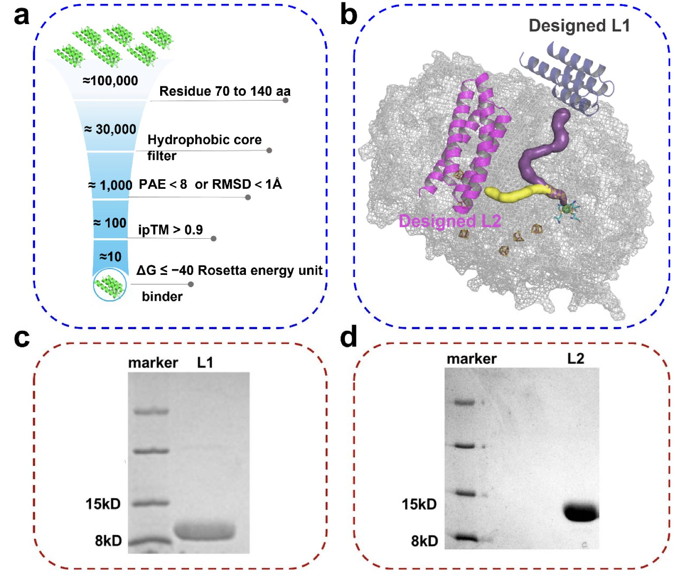
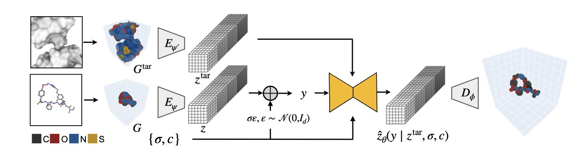
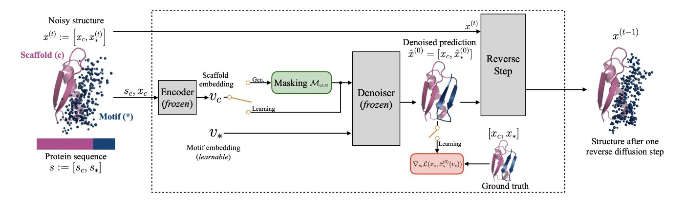
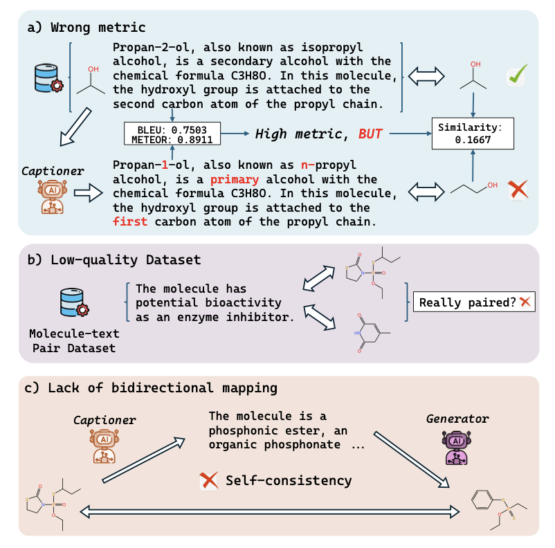
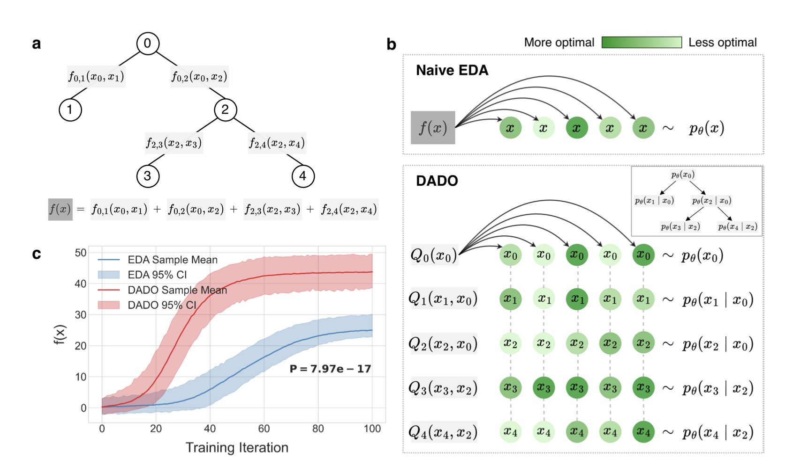

## 目录  
1. 利用 AI 从头设计的蛋白结合体封堵了 [NiFe]-氢化酶的关键氧气通道，将其耐氧性提升三倍，并首次通过实验证实了酶内部气体传输的层级结构。
2. FuncBind 框架利用神经场 (Neural Fields)，将不同类型的分子表示为连续的原子密度，实现了一个能同时生成小分子、大环肽和抗体 CDR 环的统一模型，有望打通不同药物模态间的壁垒。
3. PGEL 框架通过在嵌入空间（embedding space）微调，生成多样化且功能完整的蛋白质。
4. RTMol 利用「往返」学习机制，解决 AI 在分子与文本转换中「语言通顺但结构错误」的顽疾，达成真正的双向一致。
5. DADO 算法将复杂的设计问题拆解成更小的、可管理的部分，为 AI 驱动的蛋白质工程和药物发现开辟了一条新路。

## 1. AI 设计蛋白「塞子」：氢化酶耐氧性提升 3 倍  
  
  

[NiFe]-氢化酶 (Hydrogenase) 是生物能源领域的关键分子，能高效产氢。但它对氧气极度敏感，微量氧气就能使其活性核心「中毒」失效。传统的酶结构改造往往得不偿失，损害催化效率。  
  
研究团队决定为它做一个「外挂」——用 AI 从头设计一个蛋白结合体 (Protein Binder)，像塞子一样堵住氧气入侵的通道。  
  
**AI 如何设计「分子塞子**」  
  
团队利用 AI「三件套」：RFdiffusion 生成骨架，ProteinMPNN 设计序列，AlphaFold 预测结构。从约 100,000 个候选设计中，最终锁定了两个高亲和力结合体 L1 和 L2。  
  
这两个结合体分别针对预测中的不同气体通道。  
  
**破解气体通道之谜**  
  
L1 用于封堵「通道 1」，L2 封堵「通道 2」。实验结果表明：结合了 L1 的氢化酶在有氧环境下稳定性提升了三倍以上；结合 L2 的酶耐氧性几乎无变化。  
  
这一结果解决了气体进出氢化酶内部的长期争论。单纯的晶体结构难以看清动态过程，而这种「阻断 - 锁定」 (Block-and-lock) 策略给出了直接证据：**通道 1 才是氧气进入的主干道，通道 2 对氧气运输贡献微乎其微**。  
  
**像守门人一样的疏水空腔**  
  
分子动力学 (MD) 模拟显示，L1 在通道入口处创造了一个疏水空腔，如同分子层面的「守门人」。氧气分子试图进入时，会被暂时困在这个疏水环境中。这种动态阻滞作用减少了氧气向酶活性中心的扩散，同时保留了酶进行正常催化反应的可能性。  
  
这项工作展示了一种通用方法论：利用 AI 设计高精度蛋白工具，作为探针研究复杂金属酶机理。相比传统的突变方法 (Mutagenesis)，这种方式干扰更小，结论更具说服力。  
  
📜Title: De Novo Design of a Protein Binder to Probe Gas Channel and Enhance the Oxygen Tolerance of [NiFe] Hydrogenase  
🌐Paper: <https://www.biorxiv.org/content/10.1101/2025.11.19.689374v1>  

## 2. 神经场统一分子生成：AI 药物设计的统一理论？  
  
  

### 核心论点：  

药物发现领域通常将分子分为小分子、多肽、抗体等类别，每个类别都有专属的设计规则和计算模型。来自麻省理工学院 (MIT) 和基因泰克 (Genentech) 的研究者开发了 FuncBind 框架，试图用一种统一的方法生成所有类型的分子。  
  
该方法的核心技术是神经场。传统方法描述分子需要定义每个原子的精确坐标，而神经场将整个分子视为一团连续的原子密度云，密度最高处即为原子核的位置。  
  
这种表示方法模糊了不同分子类型的界限。小分子、由氨基酸组成的大环肽，或是更大的抗体蛋白，在神经场视角下都是原子密度分布。研究者因此能用同一个生成模型来训练和设计所有这些分子，如同找到了不同分子语言间的共同语法。  
  
模型在实际测试中表现良好。计算机模拟显示，它生成的小分子、大环肽和抗体互补决定区 (Complementarity-Determining Region, CDR) 环的质量，可与为特定分子类型设计的专用模型相媲美。  
  
研究者利用一个已知的抗体 - 靶蛋白复合物，让 FuncBind 重新设计其中最关键的 CDR H3 环，以进行实验验证。新设计的抗体在体外实验中表现出了与靶点的结合能力，证明 FuncBind 有潜力设计出具备实际功能的新分子。  
  
此外，这项工作还贡献了一个包含约 19 万个合成的大环肽 - 蛋白质复合物结构的数据集。大环肽是介于小分子和抗体之间的新兴药物，相关数据稀缺，该数据集将推动领域发展。  
  
FuncBind 用神经场的统一视角看待分子生成，为跨模态药物设计开辟了新路径。尽管尚处早期阶段，但未来可能拓展至更大的生物分子系统，甚至实现不同类型分子间的「杂交」设计。  
  
📜标题：Unified All-Atom Molecule Generation with Neural Fields  
🌐论文：https://openreview.net/pdf/6635b183138e1f0d25dfd02911c6d87234a8b01e.pdf  

## 3. PGEL: 在嵌入空间里精准拿捏蛋白质设计  
  
  

蛋白质设计常常面临一个两难困境：既要创造新的蛋白质，又要保留最关键的功能部分，例如酶的活性位点或抗体的结合表位。这好比重新设计一把钥匙，你可以随意改变钥匙柄的形状，但决定开锁的齿纹部分必须分毫不差。  
  
RFdiffusion 等现有方法采用局部扩散策略，就像焊死钥匙的齿纹，再让模型在周围自由发挥。这种做法的结果不理想，要么为了迁就固定部分，生成的结构与原始结构相差无几，失去了多样性；要么新旧部分衔接混乱，结构不合理，失去了可设计性。  
  
PGEL (Protein Generation with Embedding Learning) 框架则采用了一种新思路：在更高维度的嵌入空间解决问题。  
  
它的工作原理如下。  
  
首先，它借鉴图像生成领域的「文本反演」技术。蛋白质的功能基序可以被看作一个独特的「概念」或「词汇」，比如「p53 结合界面」。PGEL 先学习这个「词汇」的数学表达，即一个浓缩了其序列和结构信息的高维向量，也叫「嵌入」。  
  
接下来是关键一步。PGEL 直接在这个学习到的嵌入向量上进行微小、可控的「扰动」。这就像用修图软件调整照片，你不是修改百万像素点的 RGB 值，而是拖动「亮度」、「对比度」等滑块。在嵌入空间里操作，就是找到了控制蛋白质性质的「滑块」。每一次微调，都代表着对功能基序在生物学意义上的一次合理探索。  
  
最后，将微调后的嵌入向量作为新「指令」，交给蛋白质扩散模型生成一个全新的完整蛋白质。由于「指令」本身就蕴含了功能基序的精髓，生成的新蛋白质既保留了核心功能，又在整体结构上呈现出所需的多样性。  
  
研究者在三个代表性案例上验证了 PGEL 的能力：一个单体蛋白（钙调蛋白），一个蛋白 - 蛋白结合位点（barnase-barstar），以及一个与癌症相关的转录因子复合物（p53-MDM2）。结果显示，在每个案例中，PGEL 生成的结构库在多样性和可设计性上都优于传统的局部扩散方法。  
  
以 p53-MDM2 这个经典的蛋白间相互作用（PPI）靶点为例，药物研发的目标是找到能阻断其结合的小分子或多肽。利用 PGEL，能以已知的结合基序为起点，生成成千上万种保留了核心结合能力的新型蛋白质或多肽骨架。这拓展了先导化合物的筛选空间，增加了找到高亲和力、高成药性候选药物的机会。  
  
这个方法将蛋白质设计的操作，从「原子级别」的精雕细琢，提升到了「概念级别」的宏观调控，这既是技术的进步，也是思维方式的转变。我们离像编辑文字一样设计蛋白质的未来，又近了一步。  
  
📜Title: Protein Generation with Embedding Learning for Motif Diversification  
🌐Paper: <https://arxiv.org/abs/2510.18790>  

## 4. RTMol：打破幻觉，实现分子与文本的精准双向对齐  
  
  

计算化学和药物研发人员常遇到这种困境：现在的 AI 模型（如 ChatGPT 或专门的 Mol-LLM）描述分子时语法完美、文采斐然，核对结构时却错漏百出——少个甲基或环大小不对是常态。  
  
RTMol 旨在解决这一核心痛点。  
  
现行评价体系过度依赖 BLEU 或 ROUGE 等自然语言处理（NLP）指标。NLP 中 "apple" 和 "fruit" 语义相近，但在化学领域，苯环和吡啶环仅差一个原子，性质却天差地别。传统指标侧重文本重合度，难以识别这种「化学失真」。  
  
RTMol 引入了「往返（Round-trip）」视角。  
  
这如同用谷歌翻译检验准确性：将中文译为英文，再译回中文，若意思改变则翻译存疑。RTMol 将此逻辑应用于分子：  
  
1.  **分子转文本**：模型观察分子结构，生成描述。  
2.  **文本转分子**：模型根据刚才生成的描述，尝试还原结构。  
3.  **对比**：核对还原后的分子与原始分子是否一致。  
  
这不仅是评价指标，更是训练框架。同一个大语言模型分饰两角，既是描述者（Captioner）也是生成者（Generator）。  
  
系统引入强化学习，将奖励信号直接挂钩「化学保真度」。模型必须保证生成的句子能还原出正确结构才能获得奖励。这种机制迫使模型关注决定分子性质的关键特征，而非堆砌辞藻。  
  
高质量「分子 - 文本」对齐数据稀缺，公开数据集常含噪声或注释不全。RTMol 的自监督训练利用模型内部一致性进行自我修正，降低了对完美数据集的依赖。  
  
实验显示，在多个大语言模型上双向对齐性能提升显著，Round-trip 一致性最高提升 47%。  
  
对于药物研发，这代表未来的 AI 助手能真正「读懂」结构。当我们给出复杂的药效团描述时，它生成的分子结构将真实可靠，这才是 AI 辅助药物设计应有的形态。  
  
📜Title: RTMol: Rethinking Molecule-text Alignment in a Round-trip View  
🌐Paper: <https://arxiv.org/abs/2511.12135v2>  

## 5. DADO：巧解复杂设计，AI 药物发现新思路  
  
  

药物发现，尤其在蛋白质工程领域，面临着一个巨大挑战：可能的分子组合数量是一个天文数字。例如，仅改变一个蛋白质中的几个氨基酸，其组合数量就能超过宇宙中的原子总数。传统筛选方法如同大海捞针。  
  
AI 改变了这一领域，但即便使用 AI，在庞大的「解空间」里搜索最佳分子也常常力不从心。传统的估算分布算法（Estimation of Distribution Algorithms, EDA）在处理这类离散且高度结构化的问题时效率不高。它们试图一次性优化所有变量，当变量间相互关联时，计算成本会急剧上升。  
  
DADO (Decomposition-Aware Distributional Optimization) 算法提供了一个巧妙的解决方案。其核心思想可以用一个比喻解释：组装一台复杂的机器，是把所有零件堆在一起凭感觉拼装，还是按部件（如发动机、底盘）分开组装再进行总装更容易？答案显而易见。  
  
DADO 做的就是类似的事。它首先分析问题的「可分解性」，即一个分子的整体性质（如活性）能否看作其不同局部结构性质的总和。蛋白质设计等许多科学问题都符合此特点，蛋白质的最终功能很大程度上取决于其各个结构域 (domain) 的局部功能。  
  
识别出这种结构后，DADO 利用「连接树」 (junction tree) 这种图结构，将整个设计空间分解成一系列更小的、相互关联的子问题。接着，它通过在树状结构上传递信息 (message-passing)，在这些子空间里分别优化，最后将各部分的最优解组合，得到全局的最优设计。  
  
这种「分而治之」的策略降低了计算复杂度。这意味着，可以先优化一个功能域，再优化另一个，同时考虑它们间的相互作用，而无需一次性考虑蛋白质上所有氨基酸的所有可能组合。  
  
研究者们在合成数据集和真实的蛋白质设计任务上验证了 DADO 的有效性。结果显示，与传统的 EDA 算法相比，DADO 能更快、更准确地找到具有目标性质的蛋白质序列，证明了该方法具备解决实际问题的潜力。  
  
从研发科学家的角度看，DADO 的价值在于它提供了一个更符合化学直觉的计算框架。它将问题的内在结构知识（可分解性）融入算法设计中，提升了效率，也让 AI 的决策过程更透明、更可解释。  
  
未来，DADO 还可以与更先进的生成模型或策略优化算法等其他 AI 技术结合，可能在药物设计、新材料发现等领域发挥更大作用。  
  
📜Title: Leveraging Discrete Function Decomposability for Scientific Design  
🌐Paper: https://arxiv.org/abs/2511.03032v1
