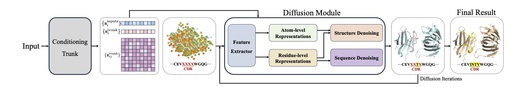
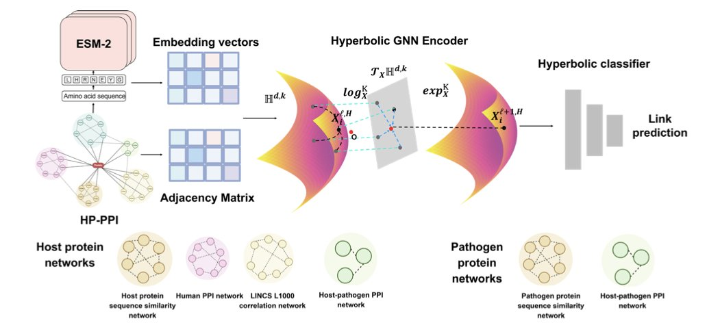
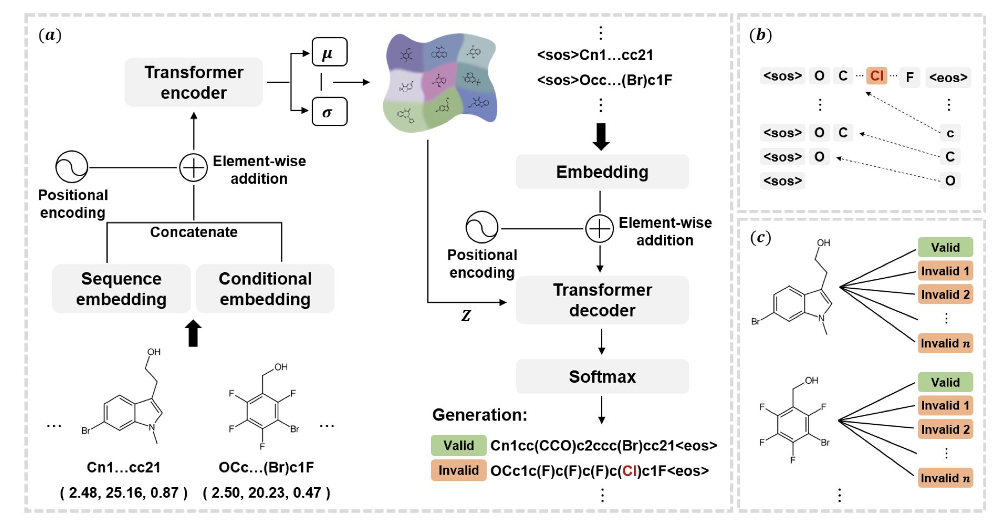
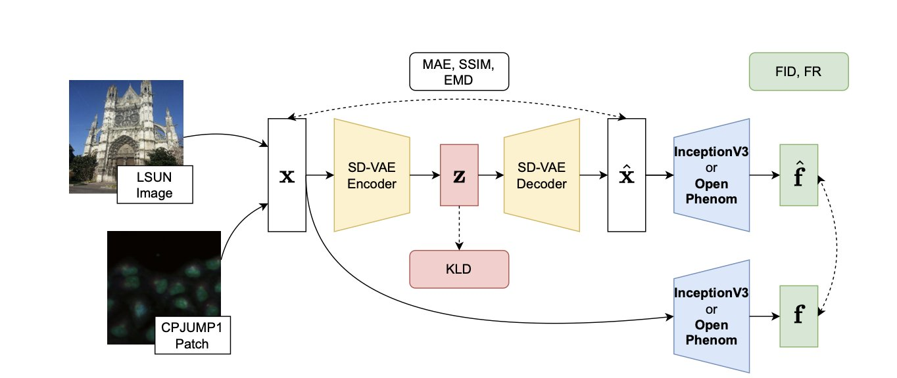
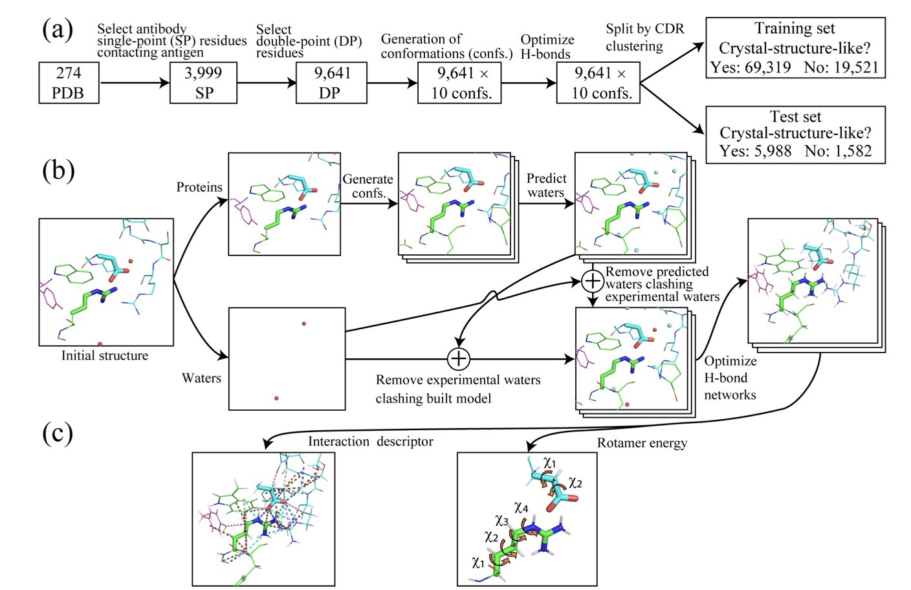
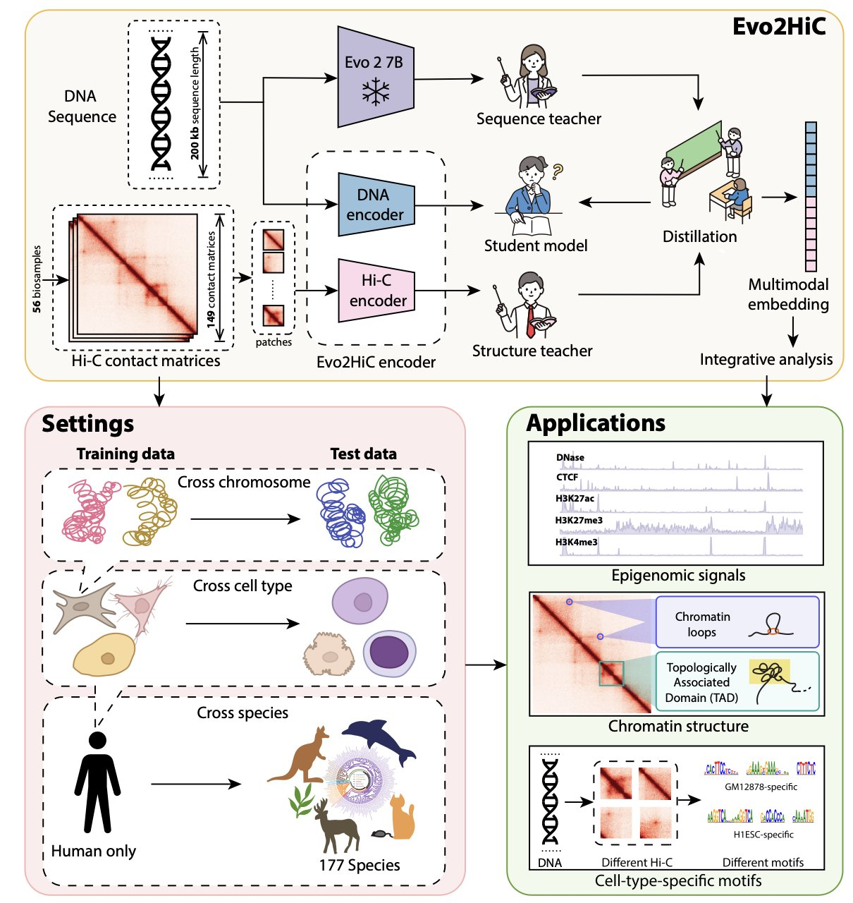

## Table of Contents
1. Researchers modified an AlphaFold3-like model, adding a sequence diffusion head to design antibody sequences and structures simultaneously, addressing the scarcity of antibody-antigen complex data.
2. ApexPPI uses hyperbolic geometry, which fits the hierarchical nature of biological networks, to combine multi-modal data and AlphaFold3 validation to accurately identify key drug targets like GPCRs.
3. ChemFixer uses a BART-like Transformer architecture as a "spell checker" to fix invalid SMILES sequences from AI generative models, recovering lost chemical space while preserving biological activity.
4. Stable Diffusion's image compressor (VAE) can effectively compress complex cell images while retaining key biological signals needed for drug screening, offering a new approach for phenotypic drug discovery.
5. IntDesc-AbMut provides a new quantitative standard for assessing how antibody mutations affect structural stability by quantifying 36 fine-grained intermolecular interactions, including weak hydrogen bonds.
6. Evo2HiC integrates genomic sequence with 3D chromatin structure by distilling a large-scale DNA foundation model, enabling cross-species prediction while lowering computational costs.

## 1. A New AI Paradigm: Generating Antibody Sequence and Structure in One Step with an AlphaFold3 Model

Discovering an antibody drug is like making a key (the antibody) that perfectly fits a specific lock (the antigen). The traditional method is to first design the key's shape (structure) and then find the right material (sequence). This process is slow and inefficient. Now, we can design the perfect key from the start, determining its shape and material all at once. This changes everything.

A recent study did just that. Researchers used AlphaFold3, a model originally built to predict protein structures. They asked: if the model can predict a structure from a sequence, can it also generate a matching sequence and structure based on a target function?

The biggest challenge with this idea is the lack of data. There just isn't much high-quality structural data for antibody-antigen complexes. It's like having only a few examples of keys that successfully opened their locks. If you train a new model on only this data, it won't learn general design principles and will tend to "overfit."

So the researchers decided to modify AlphaFold3 instead. They kept the general knowledge AlphaFold3 had already learned from pre-training on vast amounts of protein data. Then, they added a "sequence diffusion head" to the model.

This new module works together with AlphaFold3's original structure diffusion module. One generates the sequence, and the other generates the structure. They iterate back and forth, starting from random noise and gradually refining their outputs until they produce a valid amino acid sequence and a matching 3D structure.

The new model's performance is impressive. For the Complementarity-Determining Region H3 (CDR-H3), the most critical and difficult-to-predict part of an antibody, its sequence recovery rate reached 65%. For the structurally simpler nanobodies, it was 63%. This is a performance improvement of nearly 87% compared to previous methods.

At the same time, the new model's accuracy in predicting structure is nearly as high as the original AlphaFold3. This ensures that the designed "key" not only has the right material but also the right shape.

This work presents a new paradigm for antibody design. By modifying a powerful pre-trained model, the complex problem of co-designing sequence and structure becomes simple and efficient. It opens up a new path for developing more effective therapeutic antibodies in the future.

📜Title: Repurposing AlphaFold3-like Protein Folding Models for Antibody Sequence and Structure Co-design
🌐Paper: https://openreview.net/pdf/a59b1db60dc172b4054290ba97ec56522872b636.pdf

## 2. ApexPPI: Using Hyperbolic Geometry to Accurately Predict Host-Pathogen Interactions

Anyone who works with biological data for a long time notices a mismatch: complex biological problems are often confined to flat geometric spaces. Most deep learning models process data in standard Euclidean space by default. But biological networks—especially the cascading interactions between a host and a pathogen—have a distinctly hierarchical structure, like a constantly branching tree.

Forcing a dense tree onto a flat piece of paper inevitably loses a lot of topological information. The authors of this paper developed the **ApexPPI** framework, which instead uses **hyperbolic Riemannian space**. The capacity of this geometric space grows exponentially with its radius, just like the branches of a tree extending outward, making it a perfect fit for the way biological networks expand.

Within this hyperbolic space, the model used a multi-task learning strategy and was fed three types of data: protein sequences, gene perturbation data, and existing interaction networks. It achieved an AUROC of 0.905, setting a new record for the field.

Practicality is important in drug development. ApexPPI screened thousands of high-confidence interactions, with a key focus on human G protein-coupled receptors (GPCRs). GPCRs are one of the largest families of drug targets in modern medicine.

For validation, the team used **AlphaFold3** for structural modeling and **Pyrosetta** to calculate binding energy. This step pushes the model's findings from statistical "correlation" to physical "binding possibility." The model no longer just identifies connected dots on a graph; it finds proteins that can physically bind to each other in 3D space with stable energy.

This complete, closed-loop approach—starting from a foundational geometric logic, training on multi-modal data, and ending with structural biology validation—provides a solid tool for understanding infectious diseases and discovering new drug targets.

📜Title: Hyperbolic Graph Embeddings Reveal the Host–Pathogen Interactome
🌐Paper: https://arxiv.org/abs/2511.14669

## 3. ChemFixer: Fixing Invalid Molecules Generated by AI

Practitioners of computer-aided drug design (CADD) are familiar with a common frustration: generative models hallucinate. Whether it's a VAE, GAN, or MolGPT, the output always contains some amount of invalid data.

These invalid SMILES strings often have simple errors—a mismatched parenthesis, an unclosed ring, or an incorrect valence. A single character mistake can cause a computer to discard the entire molecule.

**But there might be gold in that discarded "trash."**

The model might have been trying to generate a highly promising drug molecule, only to have it thrown out because of a simple syntax error in the SMILES output. This doesn't just waste computing power; it also means missing out on unexplored chemical space. ChemFixer was created to solve this exact problem.

#### A "Spell Checker" for Molecules

The idea behind ChemFixer is to give the model a "spell checker." It's a Transformer-based post-processing framework that works without changing the generative model itself.

Inspired by the natural language processing model BART, the researchers built a large dataset of "valid/invalid" molecule pairs. Using masking techniques—hiding parts of a sequence and making the model predict them—ChemFixer learned the deep grammatical logic of SMILES and its common error patterns.

#### Core Advantages

1.  **Plug-and-play**: It's compatible with all kinds of models, like VAEs, AAEs, CharRNNs, or MolGCTs. You can just add ChemFixer to the end of your pipeline without having to retrain complex generative models to get higher validity rates.
2.  **Preserves original intent**: Experiments show that when ChemFixer corrects SMILES errors, it fully preserves the chemical and biological properties of the original output. It's not just fixing the molecule; it's "reviving" it.

#### Performance in Practice

The tool is particularly valuable in situations where data is scarce.

For example, in drug-target interaction (DTI) prediction, limited training data often leads generative models to produce a high percentage of invalid molecules. After adding ChemFixer, the validity of generated ligands increased by over 30%.

This means that for the same amount of computational effort, the number of potential candidate molecules increases significantly. For exploring undruggable targets, this recovered chemical space from the "scrap heap" is critical.

ChemFixer acknowledges the limitations of AI and offers an engineering solution to fix them, providing a real boost to the efficiency of drug discovery screening.

📜Title: ChemFixer: Correcting Invalid Molecules to Unlock Previously Unseen Chemical Space
🌐Paper: <https://arxiv.org/abs/2511.13758>

## 4. The Stable Diffusion VAE: A Data Compression Tool for Phenotypic Screening

Phenotypic drug screening, especially with techniques like Cell Painting, faces a common challenge: the sheer volume of data. A single project can easily generate terabytes or even petabytes of images, creating huge burdens for data storage, transfer, and analysis. This leads to a natural question: can we compress these images like we compress a zip file, without losing the key biological information?

A recent study provides an answer. The researchers looked at the popular Stable Diffusion model, but they weren't interested in its image-generating ability. Instead, they focused on one of its core components: the Variational Autoencoder (VAE).

A VAE works by first "compressing" a high-resolution image into a short string of numbers (its latent space representation) and then "decompressing" that code to reconstruct the image. A well-trained VAE's numerical code captures the essential features of the image.

The researchers' idea was to take the SD-VAE, which was designed for natural images, and apply it directly to highly structured cell images to systematically evaluate its performance.

They tested it on a large dataset containing various cell types and molecular perturbations. Using a metric called "fraction retrieved," they found that even after an image was compressed and reconstructed by the VAE, the system could still accurately match cell images that had been treated with the same drug. While the reconstructed images were different from the originals at the pixel level, the changes in cell shape caused by the drug (the phenotypic signal) were well preserved.

The study also had two other findings.

First, when analyzing image features, general-purpose models pre-trained on massive datasets of natural images (like InceptionV3) performed better than models designed specifically for cell images. This is good news for researchers because it means they can use existing tools without spending resources to train specialized models, lowering the barrier to entry.

Second, by calculating the Kullback–Leibler (KL) divergence, they found that the latent space of cell images is more disordered than that of natural images. If the latent space of natural images is like a well-organized library, the latent space of cell images is more like a messy warehouse. This reflects the inherent complexity and diversity of biological images, which poses a challenge for model learning and compression.

The study has its limitations. For example, the way multi-channel cell images were fed into the three-channel (RGB) InceptionV3 was somewhat arbitrary, which points to a direction for future optimization.

This work validates an efficient and viable approach: using off-the-shelf AI tools to solve data problems in biological research. It offers an attractive new option for data processing workflows in high-throughput phenotypic screening.

📜**Title**: Compressing Biology: Evaluating the Stable Diffusion VAE for Phenotypic Drug Discovery
🌐**Paper**: <https://arxiv.org/abs/2510.19887>

## 5. IntDesc-AbMut: Capturing the Hidden Interactions in Antibody Mutations

In antibody engineering or structural biology, it's common to focus on obvious features like salt bridges, strong hydrogen bonds, or hydrophobic packing. Sometimes, however, a mutation looks right structurally but ends up with poor affinity or stability. The problem often lies in what's being overlooked—the subtle details.

The IntDesc-AbMut tool, developed by a team at RIKEN, digs deeper by analyzing 36 different types of interactions.

**A Deeper Chemical Perspective**

The core of this tool is its focus on "non-mainstream" interactions. The algorithm includes weak hydrogen bonds, orthogonal multipolar interactions, and S...O interactions between sulfur and oxygen. Traditional computer-aided drug design (CADD) workflows often ignore these weak forces, but molecular recognition is frequently the result of these tiny energy contributions adding up.

IntDesc-AbMut calculates the change in the interaction fingerprint before and after a mutation to generate "interaction descriptors." This is like giving a mutant antibody a full physical exam, allowing for a direct data-driven comparison between the wild-type and the mutant.

**Machine Learning Validation: Weak Interactions Aren't So "Weak"**

To test if these descriptors were useful, the researchers built a machine learning model. They wanted to see if the model could determine whether a mutated side chain's conformation was close to the actual crystal structure ("crystal structure-likeness") using only the descriptors.

The results showed the model had an accuracy of 0.855 and a Matthews Correlation Coefficient (MCC) of 0.505. The underlying logic revealed by the model was that weak hydrogen bonds like CH...π and CH...O are what determine the "realness" and "stability" of a side chain's conformation. Strong interactions lock down the overall backbone, while weak interactions act like fine-tuning knobs that determine the final orientation and conformational entropy of the side chain in the binding pocket.

**Future Applications**

The current version is designed for antibody-antigen complexes, but its chemical logic is universal. This method can be extended to other protein-ligand interaction studies or used to analyze molecular dynamics (MD) simulation trajectories. For teams working on affinity maturation or de novo antibody design, this is a helpful tool for seeing the hidden binding forces that guide structural optimization.

📜Paper: <https://www.biorxiv.org/content/10.1101/2025.11.18.688974v1>
💻Code: <https://github.com/riken-yokohama-AI-drug/intDesc/tree/intDesc-AbMut>

## 6. Evo2HiC: A Multi-Modal AI for Precise Prediction of 3D Genome Structure

Accurately inferring the complex 3D folding structure of DNA inside the cell nucleus from its 1D linear sequence is key to understanding gene regulation and disease mechanisms.

**Evo2HiC** offers a new solution to this problem.

**A Small Model with High Accuracy**

The authors used Hi-C data to **distill** the knowledge from a large-scale DNA foundation model, Evo 2, into a compact and efficient encoder.

This approach reduces computational costs and makes the model more sensitive to 3D genomic features. Compared to the benchmark model Orca, Evo2HiC improved the Spearman correlation for predicting chromatin interactions by **10.9%**, a significant technical advance.

**Capturing Universal Rules of Evolution**

The authors tested the model's generalization ability on the **DNA Zoo** dataset, which includes **177 species**. Evo2HiC enhanced the Hi-C resolution for different species, showing that it has learned the underlying physical and biological rules that guide how a DNA sequence folds into a 3D structure. This makes it a powerful tool for comparative genomics research.

**A Bridge from Structure to Function**

Evo2HiC is also highly interpretable. By jointly embedding Hi-C and sequence information, it can accurately predict epigenetic signals associated with DNase, CTCF, and histone modifications like H3K27ac, H3K27me3, and H3K4me3.

By identifying specific sequence motifs, researchers can understand the sequence features that drive chromatin folding and their impact on gene expression. This full-chain analysis from "sequence" to "structure" to "function" helps in understanding disease mechanisms and developing new drugs.

📜Title: Evo2HiC: A Multimodal Foundation Model for Integrative Analysis of Genome Sequence and Architecture
🌐Paper: <https://www.biorxiv.org/content/10.1101/2025.11.18.689171v1>
💻Code: <https://github.com/CHNFTQ/Evo2HiC>
