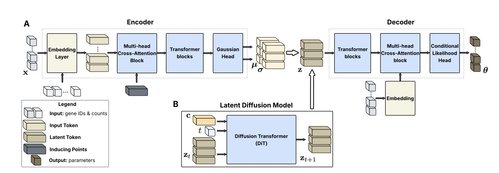
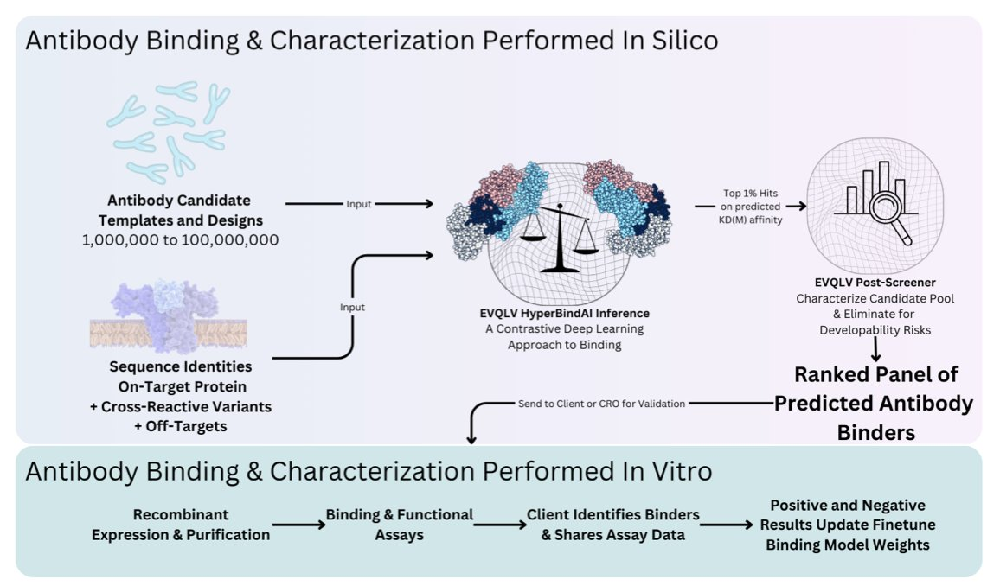
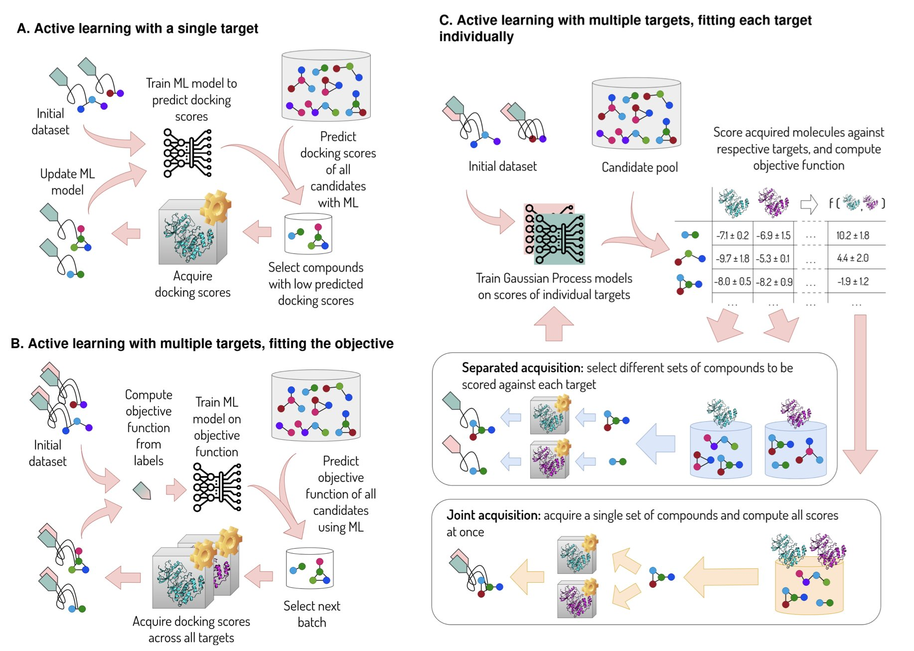
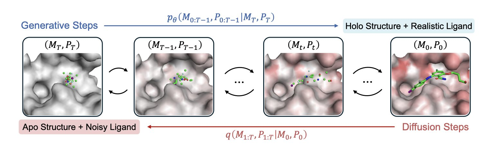

## 目录  
1. 研究者开发了 scLDM，一个新型潜扩散模型，能高质量、可扩展地生成单细胞基因表达数据，解决了现有模型的关键痛点。
2. ForceFM 模型将物理力场引入深度学习，通过力引导的流匹配技术，提升了蛋白质 - 配体对接预测的准确性和物理真实性，并降低了计算成本。
3. HyperBind2 融合计算筛选与实验验证，通过多轮学习（Multi-Shot Learning）迭代，显著提升了计算抗体发现的成功率和效率。
4. 一种新的主动学习方法，为每个靶点训练独立模型并智能分配计算资源，在多靶点药物优化中更高效地找到优质化合物。
5. 蛋白质是动态的。Apo2Mol 利用扩散模型同步生成配体并调整口袋构象，破解基于 Apo 结构设计药物的「刻舟求剑」困局。

## 1. scLDM：用潜扩散模型生成单细胞基因表达谱  
  
  

*   **架构创新**：scLDM 采用全 Transformer 架构和潜扩散框架，通过多头交叉注意力模块（MCAB）解决了基因排序人造性和训练不稳定的问题。  
*   **性能优越**：在多个基准数据集上，scLDM 的数据重建和生成能力优于 scVI 和 CFGen 等现有方法。  
*   **可控生成与应用**：模型支持基于多种属性的条件性生成，能模拟细胞对扰动的响应，其学习到的嵌入向量在下游分类任务中表现出色。  

高质量模拟单细胞基因表达数据是该领域的一个挑战。现有的生成模型通常需要人为设定基因顺序，这种设定缺乏生物学依据，且导致训练过程不稳定。一篇新论文介绍的 scLDM 模型旨在解决这些问题。  
  
scLDM 模型结合了**变分自编码器（Variational Autoencoder, VAE**）和**潜扩散模型（Latent Diffusion Model**）。  
  
第一步，VAE 将高维复杂的单细胞基因表达数据压缩到低维紧凑的「潜空间」。为处理单细胞数据基因「顺序无关」的特性，研究者设计了**多头交叉注意力模块（Multi-head Cross-Attention Block, MCAB**）。编码时，该模块无偏见地汇集所有基因信息；解码时，则能准确将信息还原到每个基因上，尊重了数据的内在生物学特性。  
  
第二步，在信息密集的潜空间里训练一个扩散模型。scLDM 使用一个**扩散 Transformer（Diffusion Transformer**）学习潜空间的复杂结构，而非传统 VAE 所假定的简单高斯分布。模型能通过「无分类器指导（classifier-free guidance）」技术，精准控制生成过程。例如，可以指定生成「某个特定细胞类型」在「受某种药物刺激后」的基因表达谱，甚至可以同时处理多个条件。这对于模拟细胞如何响应遗传或化学扰动等复杂生物学场景至关重要。  
  
在一系列公开数据集上与 scVI、CFGen 等主流模型的比较中，scLDM 在数据重建和生成任务上表现出更高的皮尔逊相关系数和更低的重建误差，生成的数据更逼真。  
  
scLDM 也是一个有效的特征提取工具。它在数据压缩中学到的细胞嵌入表示，对下游生物学发现很有用。例如，在分析新冠病毒感染数据集时，这些嵌入向量能有效识别被感染的细胞；在处理大型细胞图谱 Tabula Sapiens 2.0 时，也能准确分类细胞类型。这说明模型抓住了细胞状态的关键生物学信息。  
  
这项工作为单细胞数据的生成式建模提供了一个扎实且可扩展的框架。这种能精准模拟细胞在不同扰动下状态变化的技术，为药物研发领域理解疾病机理、发现新靶点提供了强有力的计算工具。  
  
📜Title: Scalable Single-Cell Gene Expression Generation with Latent Diffusion Models  
🌐Paper: https://arxiv.org/abs/2511.02986  
💻Code: https://github.com/czi-ai/scLDM  

## 2. AI 分子对接新范式：力引导流匹配模型 ForceFM  
  
  

分子对接（Molecular Docking）旨在为小分子配体在蛋白质的口袋里找到最稳定的结合姿态。传统方法依赖打分函数（Scoring Function）评估构象优劣，而深度学习模型是近年来的研究热点。但许多 AI 模型在生成构象时缺乏物理逻辑，其结果可能不符合能量最低原理。  
  
ForceFM 模型引入「力引导网络」，将物理力场概念与流匹配（Flow Matching）生成模型结合。这好比为一个在复杂山谷中寻找最低点的小球安装了导航系统。这个导航系统（力引导网络）实时指示能量下降最快的方向，引导小球高效地朝向能量最低点，即最稳定的结合构象移动，避免了随机探索。  
  
这种方法的优势在于准确性。在 PDBBind 标准数据集上测试，ForceFM 预测的构象与实验真实构象的均方根偏差（RMSD）值更低，说明其预测结果更接近正确结构。  
  
其次是效率。在物理力场的指引下，模型减少了无效尝试，采样效率得以提高。用更少的计算步数收敛到理想结果，解决了许多深度学习对接方法计算成本高的问题。  
  
ForceFM 的适应性也很强。研究显示，使用不同的打分函数（如 Vina、Glide、Gnina）训练力引导网络，模型均能良好适应，并在各项盲对接和跨域评估中表现出色。这说明其核心框架具有普适性，可作为插件增强不同类型的对接工具。  
  
该模型目前主要处理刚性对接，假定蛋白质口袋的形状固定不变。真实的结合过程涉及蛋白质与配体的相互作用和动态构象变化，这是 ForceFM 下一步需要解决的挑战。未来的研究方向是将分子动力学（Molecular Dynamics）等体现蛋白质柔性的技术整合进来，使模型更贴近生物真实过程。  
  
📜Title: *ForceFM: Enhancing Protein-Ligand Predictions through Force-Guided Flow Matching*  
🌐Paper: https://openreview.net/pdf/ae92f0c9f07e2cab91eda336c624dcc34cb3fd7b.pdf  

## 3. HyperBind2：多轮学习提升抗体发现效率  
  
  

抗体发现好比大海捞针。传统方法如展示技术或高通量筛选，均耗时费力，成本高昂。计算方法被寄予厚望，但预测准确性常不理想，导致大量计算筛选的候选分子在实验中失败。  
  
HyperBind2 为此提供了新思路。它没有追求一步到位找到完美抗体，而是采取了**多轮学习**的策略。  
  
**具体流程如下**：  
  
首先，平台仅根据靶点的氨基酸序列进行大规模计算预筛选。模型将抗体和抗原的序列信息嵌入共享的表示空间，通过学习它们的几何关系来预测结合亲和力。这一步的优势在于，完全无需靶点三维结构，而获取结构正是药物研发中最耗时费力的环节之一。  
  
然后，从海量计算候选分子中挑选一小部分进行实验验证。此阶段规模不大，目的在于收集实验数据——确认哪些分子有效、哪些无效。  
  
最关键的一步，平台将这些新的实验数据反馈给模型，进行再训练与微调。通过学习真实的结合数据，模型能更准确地理解特定靶点的结合偏好，从而提升下一轮预测的性能。  
  
通过「计算预测 -> 实验验证 -> 模型优化」的循环，HyperBind2 的预测能力得以迭代增强。在一个针对高难度多跨膜受体的项目中，仅用三轮优化，实验成功率就达到了 21%。这个数字在计算领域，尤其是针对这类棘手靶点时，是一个巨大飞跃。这意味着研发人员能大幅减少湿实验需要验证的分子数量，节省时间和资源。  
  
**应用前景**  
  
HyperBind2 支持单链抗体 (scFvs)、纳米抗体 (VHHs) 和全长 IgG 等多种抗体格式，因此可以整合到嵌合抗原受体 T 细胞疗法 (CAR-T) 或双特异性 T 细胞衔接器 (BiTE) 等前沿疗法的开发流程中。  
  
目前，该平台已向学术界开源，并为工业界提供商业版。这使得不具备计算背景的实验室也能直接获得优化好的抗体序列，用于后续实验开发。  
  
📜**论文标题**: HyperBind2: Multi-Shot Learning Enables Progressive Improvement in Computational Antibody Discovery  
🌐**论文链接**: <https://www.biorxiv.org/content/10.1101/2025.11.06.687005v2>  

## 4. AI 药物发现新策略：分而治之，各个击破  
  
  

药物研发是一门平衡的艺术。我们希望化合物能强效作用于目标靶点，同时避开所有脱靶靶点。当需要优化的属性超过一个，比如要同时考虑靶点 A 的活性、靶点 B 的选择性以及溶解度时，问题就变得复杂。  
  
传统的计算方法，通常将所有目标打包成一个总的「目标函数」，再让一个机器学习模型去优化这个总分。  
  
**拆分任务，效果更好**  
  
这篇论文的作者们换了思路，采用「分离式采集」（separated acquisition）策略，组建了一个「专家团队」，每个模型负责一个任务。  
  
它的工作原理如下：  
1.  为每个需要优化的属性，训练一个专门的机器学习模型。例如，一个模型预测分子与 JAK2 的结合能力，另一个模型预测它与其他激酶的结合能力。  
2.  在主动学习的每一轮，算法会评估下一步该把计算资源用在哪里，才能让最终的总分最大化。是多计算几个分子在 JAK2 上的得分，还是在脱靶上的得分？  
  
这个决策过程很智能。如果某个属性对总分影响大，或某个模型的预测不确定性高、有提升空间，算法就会向它倾斜更多的计算预算（如昂贵的分子对接或动力学模拟）。这好比项目经理将经费优先投给项目中最关键或最薄弱的环节。  
  
**用真实数据说话**  
  
研究者们使用 DOCKSTRING 公开数据集进行回溯性验证，模拟了两个药物发现场景：  
  
*   **追求选择性**：优化一个 JAK2 抑制剂，要求高活性命中 JAK2，同时避开结构相似的其他激酶。  
*   **追求广谱性**：优化一个 PPAR 激动剂，要求它能同时激活多个 PPAR 亚型。  
  
  
  
结果显示，在两个场景中，「分离式」策略找到的优质化合物命中率都高于传统的「联合」策略。用同样多的计算资源，这套新方法能更快发现有潜力的分子。  
  
**实践价值与展望**  
  
这个方法有几个优点。  
  
首先，它符合药物化学家的工作直觉。实际项目中，研发人员也常聚焦于特定问题，比如先解决活性，再处理选择性。这种「分而治之」的计算策略，模拟并优化了现实研发流程。  
  
其次，它的扩展性好。真实的药物发现要考虑的属性远不止两三个，还包括 ADME（吸收、分布、代谢、排泄）、毒性等。该框架可以方便地加入更多「专家模型」，应对更复杂的优化任务。  
  
作者也指出了方法的局限。例如，需要预先定义一个明确的目标函数。此外，该方法目前未显式考虑分子多样性，可能导致搜索范围局限在较窄的化学空间。  
  
他们接下来的计划是将这套方法用于结合自由能计算。分子对接分数计算成本低但结果粗糙，而基于分子动力学（MD）的自由能计算更准但成本高昂。用这种智能分配策略来决定哪些分子值得进行昂贵的自由能计算，可能会提升先导化合物优化阶段的效率。  
  
📜论文：A Simple Compound Prioritization Method for Drug Discovery Considering Multi-Target Binding  
🌐论文链接：https://doi.org/10.26434/chemrxiv-2025-vqg5k  
💻代码链接：https://github.com/MobleyLab/active-learning-notebooks/blob/main/MultiobjectiveAL.ipynb  

## 5. Apo2Mol：攻克蛋白质柔性难题的 AI 药物设计新路  
  
  

药物化学中我们一定要考虑一个情况：蛋白质并非静止不动的石头。  
  
传统基于结构的药物设计（SBDD）常面临棘手情况：只有蛋白质未结合配体时的**空载结构（Apo structure**）。如同为一只张开的手设计手套，手中却只有握拳时的照片。  
  
药物分子进入蛋白口袋时，会引发构象改变，即「诱导契合（Induced fit）」效应。现有 AI 模型多假设蛋白质为刚性，导致生成的分子理论完美，实际结合时亲和力不足。  
  
**Apo2Mol** 引入**动态口袋感知扩散模型（Dynamic Pocket-Aware Diffusion Model**）解决这一难题。该模型在生成药物分子的同时实时调整蛋白质口袋形状，如同揉面团般让分子与口袋相互适应，最终达到能量最低的结合状态（Holo state）。  
  
团队对 **PDB（蛋白质数据库**）进行深度清洗，整理出超过 **24,000 对**经实验验证的 Apo-Holo 结构对。模型据此学习真实的物理法则，掌握配体进入时残基旋转与侧链避让的规律，从而准确预测新的配体 - 蛋白复合物。  
  
Apo2Mol 在生成高亲和力配体方面表现优异，且能生成逼真的口袋构象。这对针对全新靶点（First-in-class）的药物研发价值巨大——此类靶点通常仅有 Apo 结构，结合后的形态未知。对于面对高柔性、难成药靶点的计算辅助药物设计（CADD）研究，这是一种突破性的解决思路。  
  
📜Title: Apo2Mol: 3D Molecule Generation via Dynamic Pocket-Aware Diffusion Model  
🌐Paper: <https://arxiv.org/abs/2511.14559v1>
