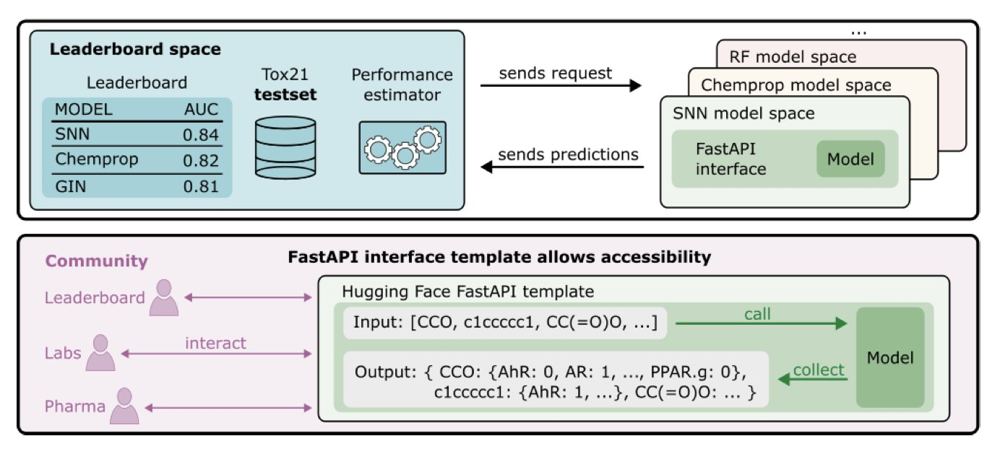
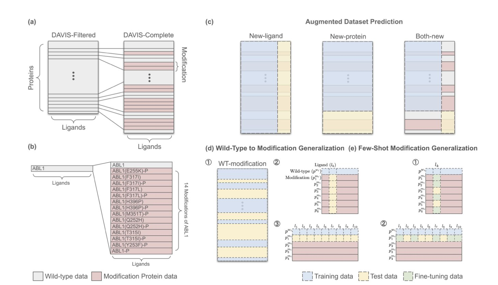
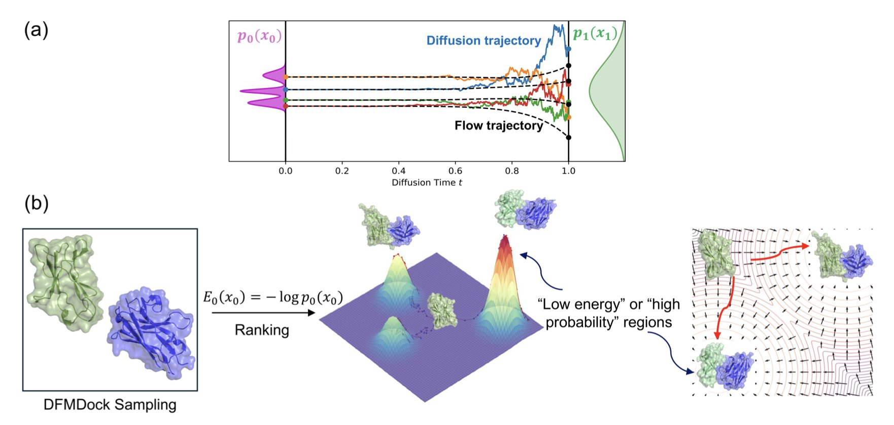
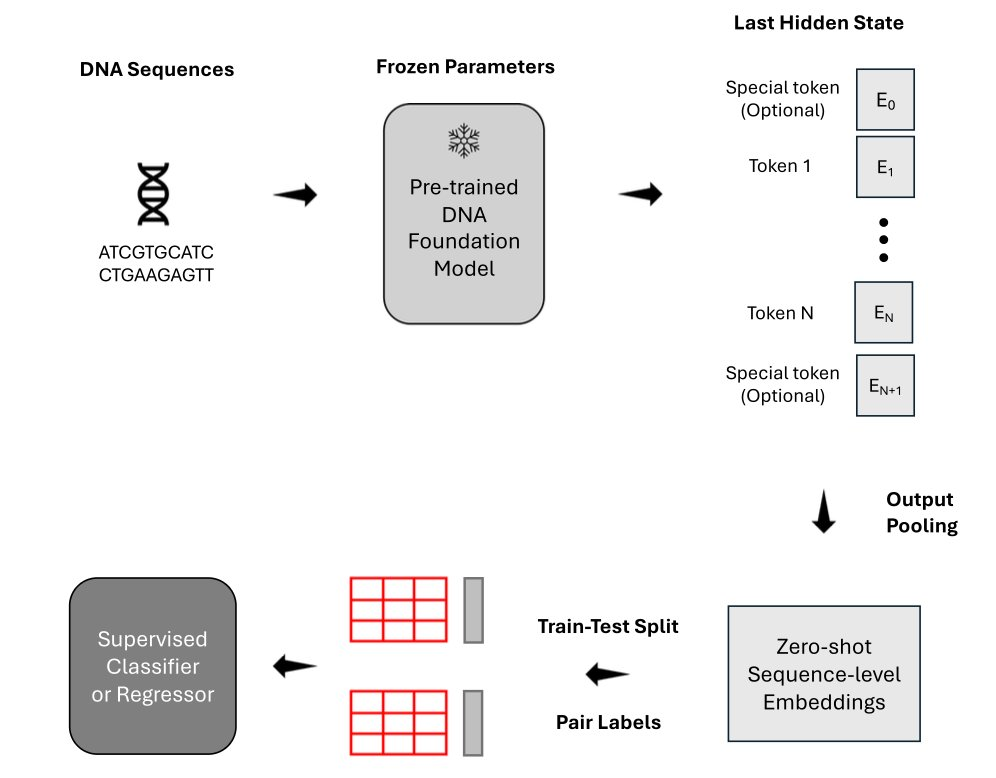
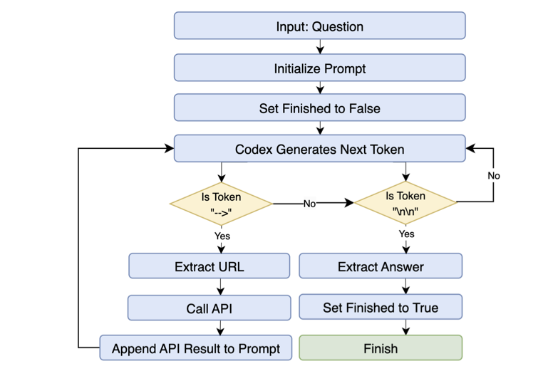

## 目录  
1. 研究人员复原 2014 年 Tox21 挑战赛原始数据与评估协议后发现，过去十年层出不穷的新算法，在毒性预测任务上并未显著超越当年的冠军模型。
2. 引入突变与修饰数据的升级版 DAVIS 数据集揭示，不依赖对接的 AI 模型容易对野生型蛋白过拟合，结构先验知识对预测真实的生物复杂性至关重要。
3. 扩散模型生成的蛋白质结构，其内部数学机制构建了与经典物理引擎（如 Rosetta）高度一致的热力学能量势能面。
4. 通用 DNA 大模型在基因表达预测等特定任务上不及专用模型，但多物种数据训练和平均池化策略能显著提升性能。
5. OpenBioLLM 证明，利用小型开源模型构建分工明确的多智能体系统，在基因组问答任务上效率与准确性均优于单体大模型。

## 1. 还原 Tox21 真容：十年 AI 毒性预测的原地踏步  
  
  

药物化学家若听说「AI 早在十年前就解决了毒性预测」，恐怕会苦笑。但在计算化学论文里，似乎每隔几个月就有新的 SOTA（State of the Art，最先进水平）诞生。这篇论文揭示了这种反差背后的真相：**我们可能一直在原地打转**。  
  
**基准测试的「罗生门**」  
  
2014 年的 Tox21 数据挑战赛旨在用计算方法预测化合物对核受体和应激反应途径的干扰，堪称 AI 制药界的 ImageNet。然而十年过去，大家手里的 Tox21 早已面目全非。  
  
随着各类开源库的迭代，数据集经历了反复的「清洗」、「拆分」与「优化」。如今模型跑出的高分，源于考题变简单或考纲被修改。这种现象即为「基准漂移」。  
  
为探究真实水平，研究者做了一项苦活：**考古**。他们重新挖掘并严格恢复了原始挑战赛的数据集拆分与评估协议。  
  
**令人尴尬的真相**  
  
研究者将那些号称使用自归一化神经网络等先进架构的模型拉回 2014 年原始考场，与当年冠军 DeepTox 同台竞技。  
  
结果显示，花哨的新算法并未展现绝对优势。DeepTox 这个十年前基于基础描述符和传统机器学习构建的方法，依然稳居第一梯队。  
  
毒性预测领域十年来的算法「内卷」，未能转化为解决实际化学问题的能力。单纯改变网络层数，解决不了数据噪音和生物学的复杂性。  
  
**拒绝「我在本地跑通了**」  
  
为终结自说自话，团队在 Hugging Face 搭建了真正的可复现排行榜（Reproducible Leaderboard）。  
  
该系统的核心逻辑十分硬核：**上传容器，而非结果**。  
  
参赛者必须利用 FastAPI 模版将模型封装提交，系统会自动在统一环境下运行推理。这就彻底堵死了「本地特殊预处理」或「评估指标计算方式不同」等借口，回归科学应有的透明、可重复与标准化。  
  
这篇论文向 AI 制药从业者释放了一个信号：停止迷信论文里的高分图表。我们需要更多回归本质的工作，去验证那些昂贵的 AI 模型，是否真比十年前的随机森林懂更多的化学。  
  
📜Title: Measuring AI Progress in Drug Discovery: A Reproducible Leaderboard for the Tox21 Challenge  
🌐Paper: <https://arxiv.org/abs/2511.14744>  

## 2. DAVIS 数据集升级：AI 预测蛋白突变能力的挑战  
  
  

**告别理想化数据：真实世界的蛋白质是复杂的**  
  
药物研发人员普遍知道，常用的基准测试数据集过于理想化。以经典的 DAVIS 数据集为例，它长期作为评估激酶抑制剂亲和力的标准，但其缺陷在于只包含野生型（Wild-Type）蛋白。临床上，医生面对的常常是携带各种耐药突变的激酶，或是经过翻译后修饰（例如磷酸化）的蛋白质。如果 AI 模型只能预测标准蛋白的结合力，距离精准医疗的目标还很远。  
  
**一次彻底的数据升级**  
  
研究者发布了升级版的 DAVIS 数据集。他们从文献和数据库中挖掘了过去被忽略的细节：氨基酸的替换、插入、缺失，以及关键的磷酸化修饰，最终整理出 4032 对新的激酶 - 配体数据。这不仅是数量的增加，更是维度的提升，迫使模型去理解微小的结构变化如何剧烈影响结合活性。  
  
**AI 模型的真实能力检验**  
  
基于这套更具挑战性的「考题」，研究者设立了三个新的测试场景：  
1.  **数据增强预测**：检验模型利用新数据的学习能力。  
2.  **从野生型到突变体的泛化**：模拟真实药物设计中最困难的场景——仅基于正常蛋白的数据，预测其突变后的行为。  
3.  **小样本突变泛化**：为模型提供少量突变样本，观察其触类旁通的能力。  
  
测试结果显示，当前依赖纯序列的 AI 模型面临严峻挑战。  
  
那些不依赖对接的模型在处理野生型蛋白时表现尚可，但在新测试中暴露出问题。它们更多是记住了蛋白名称和序列特征，而非真正理解结合口袋的物理化学性质。一旦序列发生微小突变，这些模型常常无法做出正确反应，预测结果仍停留在野生型的水平，表现出典型的过拟合。  
  
**结构信息是关键**  
  
相比之下，像 Boltz-2 这样明确利用结构信息（Docking-based）的模型，在零样本测试中展现出明显优势。原因在于，突变会改变口袋的空间形状或电荷分布，而基于物理结构的算法能够捕捉到这种空间位阻或相互作用的变化。  
  
这对业界的启示是，要实现精准医疗，特别是针对耐药突变的药物设计，不能仅依赖大语言模型（Large Language Model, LLM）处理序列。必须将结构生物学的先验知识——无论是来自真实的晶体结构还是高质量的预测结构——与模型深度融合。在复杂的生物世界里，脱离物理本质的纯数据驱动方法难以走远。  
  
📜标题：Towards Precision Protein-Ligand Affinity Prediction Benchmark: A Complete and Modification-Aware DAVIS Dataset  
🌐论文：<https://arxiv.org/abs/2512.00708v1>  

## 3. 扩散模型「偷师」热力学：从 AI 提取物理能量  
  
  

扩散模型预测蛋白质结构的效果惊人。但研发人员担心：模型是在「死记硬背」PDB 数据库的几何形状，还是理解分子间作用力的物理法则？若仅是单纯模仿，面对全新靶点时的药物设计风险巨大。  
  
这篇新研究试图揭开黑盒：**扩散模型在训练中学会了热力学**。  
  
**去噪过程即寻找低能态**  
  
研究者提出了底层理论框架。扩散模型的核心是加噪与去噪。论文指出，去噪的数学过程映射了热力学中的玻尔兹曼分布（Boltzmann distribution）。模型认为「概率大」的结构，对应物理上「能量低」的状态。模型中的负对数似然（negative log-likelihood）本质上就是一个伪势能函数。  
  
**绘制「能量漏斗**」  
  
研究者利用蛋白质 - 蛋白质对接模型（DFMDock）进行验证。计算化学中，Rosetta 等经典物理软件的核心指标是「能量漏斗」——正确的结合构象位于能量谷底，周围构象能量如漏斗壁般陡峭。  
  
从 DFMDock 这种纯 AI 模型提取的「能量」也能绘制出清晰的能量漏斗。AI 并非瞎猜，其高分构象对应物理上的稳定状态。在部分测试中，这种 AI 能量评分甚至比 Rosetta 的打分函数更准确地捕捉天然构象。  
  
**打破统计与物理的界限**  
  
这模糊了 AI 与物理学的界限。只要投喂足够多的真实物理结构数据，AI 就能通过统计学「反向工程」出背后的物理规律（能量景观）。  
  
药物研发迎来新机遇。若能直接从 AlphaFold3 等大模型提取物理级精度的能量，便无需单独运行昂贵的分子动力学模拟验证结果。AI 本身就是一个自带物理引擎的计算器。  
  
目前该发现主要验证于刚性对接。未来能否解决柔性侧链或更复杂的构象变化，尚待观察。但可以确定，机器确实学到了物理本质。  
  
📜Title: Can We Extract Physics-like Energies from Generative Protein Diffusion Models?  
🌐Paper: <https://www.biorxiv.org/content/10.1101/2025.11.28.690021v1>  

## 4. 深度测评：5 款 DNA 大模型实战表现如何？  
  
  

将 DNA 视为自然语言，套用 NLP（自然语言处理）领域的 Transformer 架构顺理成章。市面上 DNA 大模型（Foundation Models）层出不穷：DNABERT-2、Nucleotide Transformer V2、HyenaDNA、Caduceus-Ph 和 GROVER。**它们真的好用吗？谁才是这一行的「GPT-4**」？  
  
《Nature Communications》近期一项研究对这五个模型进行了深度横向测评。相比公关稿，这项研究揭示了更有价值的结论。  
  
**怎么读数据？平均分比「班长」靠谱**  
  
在下游分类任务中，需将长 DNA 序列转化为向量。许多人习惯使用模型输出的第一个 Token（类似 BERT 的 [CLS] 标记）代表整条序列。  
  
数据显示：**平均 Token 嵌入（Mean token embedding）效果更佳**。了解班级整体水平，计算全班平均成绩（Mean Pooling）比只问班长（Summary Token）准确。这对搭建模型架构有直接指导意义。  
  
「**通才」的尴尬：杂而不精**  
  
在识别致病变异（Pathogenic Variants）这类宏观任务上，通用大模型表现尚可。  
  
一旦涉及**基因表达预测**或**检测因果数量性状位点（QTLs**）等精细量化任务，这些大模型败给了针对特定任务优化的「老派」专用模型。目前的 DNA 大模型学会了语法，但尚未理解「语义」背后的生物学调控逻辑。药物靶点发现不能盲目迷信大模型，「土办法」有时更管用。  
  
**数据多样性是破局点**  
  
作者使用多物种数据集重新训练 HyenaDNA，性能显著提升，跨物种泛化能力增强。  
  
这符合生物学直觉。进化具有保守性，老鼠、斑马鱼甚至酵母的调控机制与人类通用。给模型输入多样化物种数据，如同语言学家同时学习拉丁语、法语和西班牙语，反推英语词源的能力自然更强。  
  
**看不见的三维世界**  
  
无论处理序列多强，这些模型对**三维基因组结构**（如拓扑关联结构域 TADs）几乎「视而不见」。它们将 DNA 视为一维字符串，未内生理解 DNA 在细胞核内的折叠方式。染色质折叠直接决定基因表达。  
  
**写在最后**  
  
计算效率方面，HyenaDNA 处理长序列扩展性好；Nucleotide Transformer V2 模型较大但稳定性不错。结论是：DNA 大模型潜力巨大，但尚未达到「开箱即用」颠覆一切的程度。多物种数据训练和针对性下游微调，是落地必经之路。  
  
📜Title: Benchmarking DNA Foundation Models for Genomic and Genetic Tasks  
🌐Paper: <https://www.nature.com/articles/s41467-025-65823-8>  

## 5. OpenBioLLM：开源多智能体架构超越 GeneGPT  
  
  

GeneGPT 曾展示了大语言模型（LLM）在生物医药领域的潜力，而 OpenBioLLM 提出了不同于 GeneGPT 单体（Monolithic）架构的方案：组建由「专家」构成的团队。  
  
**专家团队分工协作**  
  
GeneGPT 类似全能员工，兼顾意图识别、API 代码编写和结果检查，计算负担重且易出错。OpenBioLLM 采用多智能体（Multi-Agent）策略，设计了特定角色：路由智能体负责准确分发问题，查询生成智能体编写语句，验证智能体检查准确性。  
  
专业分工效果显著。在 GeneTuring 和 GeneHop 基准测试中，OpenBioLLM 分别取得 0.849 和 0.830 的平均分。超过 90% 的任务中，表现持平或超越 GeneGPT。  
  
**小模型与角色适配**  
  
OpenBioLLM 使用开源小型模型且无需额外微调，打破了「参数量即正义」的逻辑。让智能体专注于特定子任务（Role-faithful），能避开大模型常见的推理捷径。在特定垂直领域，**角色适配度（Role-fit）比单纯的模型规模（Raw scale）更关键**。  
  
**速度与灵活性**  
  
将复杂的基因组问答拆解为并行子任务，系统延迟降低 40% 到 50%。模块化设计带来了灵活性：集成新数据库或工具只需增加相应的工具智能体，无需重构系统或重新训练。这种可扩展性适应快速发展的基因组学研究。  
  
作者分析了主要错误来源：API 选择错误或参数使用不当，为后续优化指明了方向。这项研究表明，**多智能体协作是解决复杂科学问题的优选方案**。  
  
📜Title: Beyond GeneGPT: A Multi-Agent Architecture with Open-Source LLMs for Enhanced Genomic Question Answering  
🌐Paper: <https://arxiv.org/abs/2511.15061v1>
