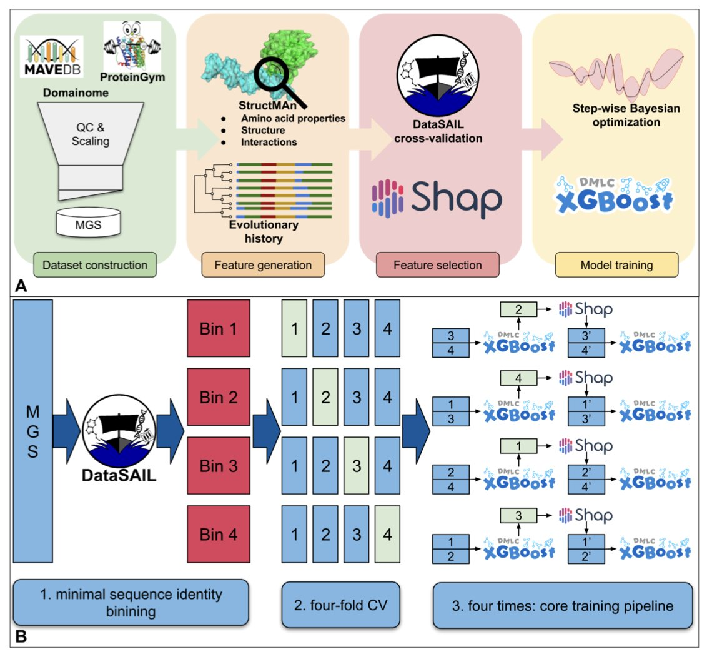
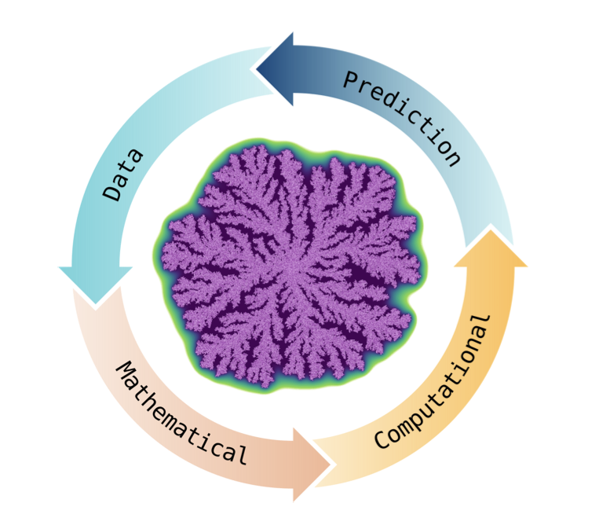
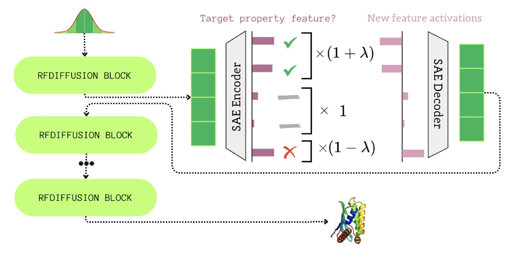
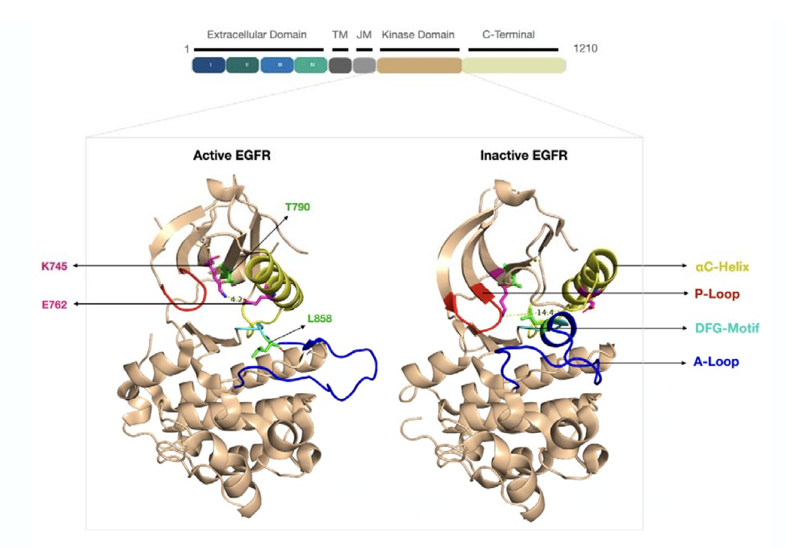
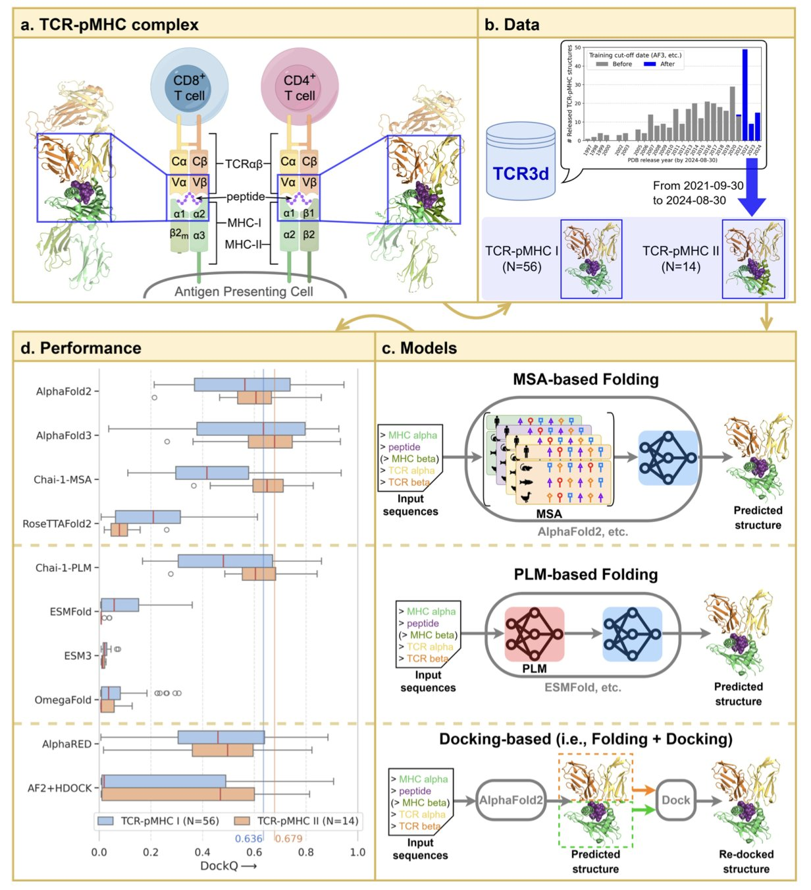

## Table of Contents
1. By strictly preventing data leakage, StructGuy uses gradient boosting trees and structural features to accurately predict the functional effects of unseen protein variants and explain their mechanisms.
2. Existing Agent-Based Models (ABMs) for cells are too rigid, hindering the simulation of complex biological systems. We need a shift to modular, "building block" construction, assembling models as flexibly as we build neural networks.
3. FoldSAE uses a sparse autoencoder to analyze the internal mechanics of RFdiffusion, achieving fine-tuned control over protein secondary structures and turning random generation into a controllable engineering process.
4. By combining machine learning and molecular dynamics simulations, this study reveals the mechanism for locking the inactive state of the EGFR L858R/T790M mutant and screens 10 potential allosteric inhibitors with predicted efficacy superior to EAI001.
5. AlphaFold3 has established its leadership in predicting TCR-pMHC complex structures, where the confidence score of the CDR3 region has become a key indicator for judging binding quality and mutational affinity.

## 1. StructGuy: Solving the Data Leakage Problem in Protein Variant Prediction

AI-based prediction of protein variant effects has a common problem: data leakage. Many models perform well on test sets because they were exposed to similar sequences or homologous proteins during training. When faced with entirely new proteins not seen in the training set, their performance drops sharply. This is unacceptable in innovative drug discovery.

**StructGuy aims to solve this problem.**

The researchers focused on data "purity." They built a dedicated dataset based on MAVE (Multiplexed Assays of Variant Effect) experiments, which they rigorously cleaned and split to ensure no overlap between the training and test sets. A model trained this way can genuinely generalize to unknown proteins.

For the algorithm, StructGuy uses Gradient Boosting Trees. It integrates comprehensive protein structure features (including residue interactions) and evolutionary information, making its predictions **fully interpretable**. A user not only learns that a mutation is harmful but also understands the specific reason, such as which hydrogen bond was broken or which conformation was affected.

The team validated the model on a modified version of the ProteinGym benchmark. The results showed that StructGuy's accuracy is comparable to current state-of-the-art zero-shot methods.

Take **PPARG (Peroxisome Proliferator-Activated Receptor Gamma)**, an important target for metabolic drug development. StructGuy accurately predicted the functional impact of mutations in this case and proposed mechanistic hypotheses at the molecular level. This capability is valuable for medicinal chemists, helping them understand why a mutation causes a loss of function from a structural biology perspective, which in turn guides molecular design and target druggability assessment.

In the field of AI-driven drug discovery, models that can explain mutation mechanisms through 3D structural changes are the practical tools needed in real-world research and development.

📜Title: StructGuy: Data leakage free prediction of functional effects of genetic variants
🌐Paper: <https://www.biorxiv.org/content/10.64898/2025.12.01.691563v1>

## 2. The Cell ABM Modeling Dilemma: Ditching Rigid Parameters for "Building Block" Flexibility

Anyone in computer-aided drug discovery or systems biology has likely felt this frustration: you try to use Agent-Based Models (ABMs) to simulate drug diffusion in tissue or cellular responses, only to find the tools are as rigid as "cast concrete."

A new article by Jonas Pleyer hits this pain point exactly.

**"Hard-coded" Biology**

Existing ABM frameworks often define a "cell" as a fixed, rigid body or presuppose a specific grid environment. It's like wanting to build something creative with Lego bricks, but the manufacturer only sells pre-glued models.

If your research involves cell deformation or special microenvironments, you have to patch the model with a ton of parameters. The model becomes bloated, and parameter estimation turns into a guessing game. It's impossible to verify whether the biological mechanism is at play or if the parameters just happen to fit the data.

**We Need a "PyTorch for Biology"**

Consider mathematical tools. Classic differential equations or Deep Neural Networks (DNNs) are powerful because they provide basic operational logic, not pre-set solutions. When you build a network with PyTorch, you decide the number of layers and how they connect.

Current ABMs lack this fundamental flexibility. We need the ability to build or drastically modify models from scratch, free from the constraints of predefined geometries or rules.

**Breaking Cells Down into Building Blocks**

The core idea is modularity, a building block-based approach.

Instead of modeling the whole cell, we can simulate its components directly. The membrane, cytoskeleton, and receptor distributions can be broken down into independent, reusable mathematical components. When studying an immune cell squeezing through a blood vessel wall, you could call on "deformation" and "adhesion" components. When studying a plant cell, you could add a "cell wall" component.

If this approach works, we would no longer reinvent the wheel for every new problem. We could build a library of general, validated biological components. In drug development, this would allow for the rapid assembly of high-fidelity simulation environments for specific targets, freeing us from commercial software that claims to be "general-purpose" but struggles with precise simulation.

📜Title: Agent-Based Modelling in Cellular Biology: Are we flexible yet?
🌐Paper: <https://arxiv.org/abs/2511.12161v1>

## 3. FoldSAE: Precisely Controlling Protein Folding with a Sparse Autoencoder

RFdiffusion is a major tool in computational protein design, but it works like a black box: you input a prompt and get a structure, with no transparency in between. The authors of this paper tried to open that black box to see how the gears inside turn.

**Sparsity is the Key to Understanding**
The researchers proposed the **FoldSAE** framework. Its core strategy is to use Sparse Autoencoders (SAEs) to process RFdiffusion's internal data. RFdiffusion is filled with highly compressed and entangled dense representations. The authors used an SAE to decompose these dense vectors into sparse, interpretable features. It's like separating a mixed juice back into its original ingredients to identify the key elements.

**Discovering a "Seesaw" for Structure Generation**
After decomposition, the researchers identified "antagonistic" features in the latent space. These features act like a seesaw: strengthening certain features causes the generated proteins to have more helices and fewer strands. This positive-negative correlation reveals the underlying logic of competition between secondary structures during protein folding.

**From "Guesswork" to "Engineering"**
This moves protein design beyond a simple game of probability. The authors turned these features into "control knobs." By amplifying or suppressing specific features, they can fine-tune the generated protein backbone. For example, by adjusting a hyperparameter, they can increase α-helices while maintaining biological plausibility, precisely controlling the secondary structure content.

**Future Possibilities**
FoldSAE advances protein design from "random sampling" to "precision engineering." The logic used to control secondary structures could be extended to more complex properties, like solvent accessibility or the formation of ligand-binding sites. Computer-Aided Drug Design (CADD) is gradually evolving into a rational architectural process.

📜Title: FoldSAE: Learning to Steer Protein Folding Through Sparse Representations
🌐Paper: <https://arxiv.org/abs/2511.22519v1>

## 4. AI+MD: A New Strategy to Tackle Drug-Resistant EGFR Mutations

In small-molecule drug development, EGFR is a well-known "villain" that keeps coming back. From first-generation gefitinib to osimertinib, cancer cells always find a way to escape through mutation. This study focuses on the L858R/T790M double mutant, a primary cause of resistance to first- and second-generation TKIs in non-small cell lung cancer (NSCLC).

**The Nature of the Mutation**

Using microsecond-scale molecular dynamics (MD) simulations, the researchers observed that the L858R/T790M mutation alters the protein's energy landscape. Even without a ligand, the mutated EGFR kinase tends to maintain an "active-like conformation."

An ideal allosteric inhibitor needs to act like a powerful "vise grip," forcing the kinase back into an "inactive state" and locking it there.

**Understanding the Binding Mechanism**

An analysis of the known allosteric inhibitor EAI001 revealed that its binding disrupts a salt bridge between K745 and E762. This triggers a rearrangement of structural elements and increases the population density of the inactive conformation. Static crystal structures alone are not enough to guide drug design; MD simulations are essential to capture the protein's dynamic changes.

**An AI-Assisted Screening Workflow**

The team designed a combined screening approach to find molecules superior to EAI001:

1.  **Initial Screen**: Perform large-scale molecular docking.
2.  **Refinement**: Use a machine learning scoring function (SG-ML-PLAP) to re-rank the results, removing false positives that score high but have unstable binding.
3.  **Validation**: Use MD simulations and MM/GBSA calculations to verify the molecule's ability to stabilize the inactive conformation of EGFR in a dynamic environment.

**Results and Outlook**

This process identified 10 new candidate molecules with predicted efficacy superior to EAI001. Although computational results are still far from clinical application, this work provides a solid structural biology starting point for overcoming EGFR resistance. The strategy of targeting an allosteric site avoids the crowded ATP-binding pocket and may offer a path for developing fourth-generation drugs for patients for whom current therapies are ineffective.

📜Title: Design of Allosteric Inhibitors for Mutant EGFR by Combined use of Machine Learning and Molecular Dynamics Simulations
🌐Paper: <https://www.biorxiv.org/content/10.64898/2025.12.01.691623v1>

## 5. AF3 Dominates TCR-pMHC Prediction, with CDR3 Score as a Key Metric

Understanding the recognition mechanism of the TCR-pMHC (T-cell receptor-peptide-major histocompatibility complex) is fundamental to immunotherapy and vaccine development. Accurately modeling this three-part complex is extremely challenging due to its high flexibility and variability. A recent benchmark study on BioRxiv compared leading structure prediction tools and confirmed that AlphaFold3 (AF3) is currently the best solution.

**AF3's Comprehensive Advantage**
The study selected a test set of 70 TCR-pMHC complexes that the models had never seen before. AlphaFold3 came out on top when compared against MSA-based methods, PLMs, and traditional molecular docking tools. For both Class I and Class II molecules, the structures it generated were superior in both docking quality and atomic-level accuracy, significantly improving our understanding of immune recognition.

**CDR3 pLDDT: A Proxy for Binding Quality**
Usually, pLDDT is just a measure of the model's confidence in its predicted structure. But in the context of TCR-pMHC, the pLDDT score of the CDR3 region is directly correlated with the predicted binding quality.

If the model gives a high score to the structure of this critical recognition loop, the docking of the overall complex is generally reliable. The score is also sensitive enough to capture changes in affinity caused by single-point mutations. In drug design, this score alone can be used for an initial screening of mutations that enhance or disrupt binding, reducing the reliance on expensive wet lab experiments.

**Balancing Speed and Accuracy**
Industrial applications need to balance speed and accuracy. The tests showed that using an accelerated MSA strategy can significantly reduce computation time without sacrificing prediction accuracy. This makes large-scale computational screening of TCR-pMHC libraries a practical possibility.

This research establishes AF3's superiority and provides a set of practical evaluation criteria. When looking at AI-predicted TCR structures, the information contained in the pLDDT score of the CDR3 region is worth close attention.

📜Title: Benchmarking TCR-pMHC structure prediction: A unified evaluation and CDR3-based functional insights
🌐Paper: <https://www.biorxiv.org/content/10.64898/2025.11.30.691400v1>
