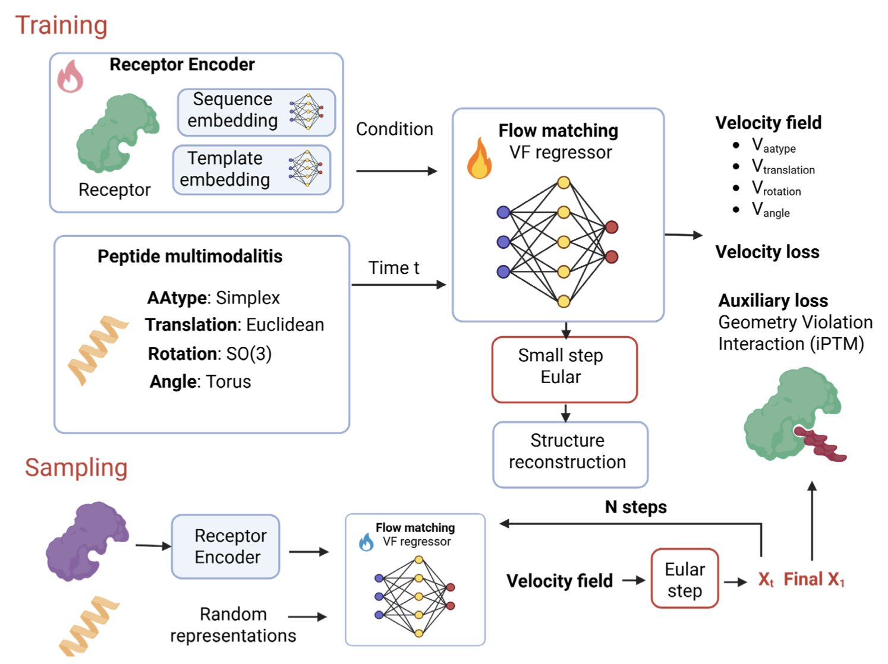
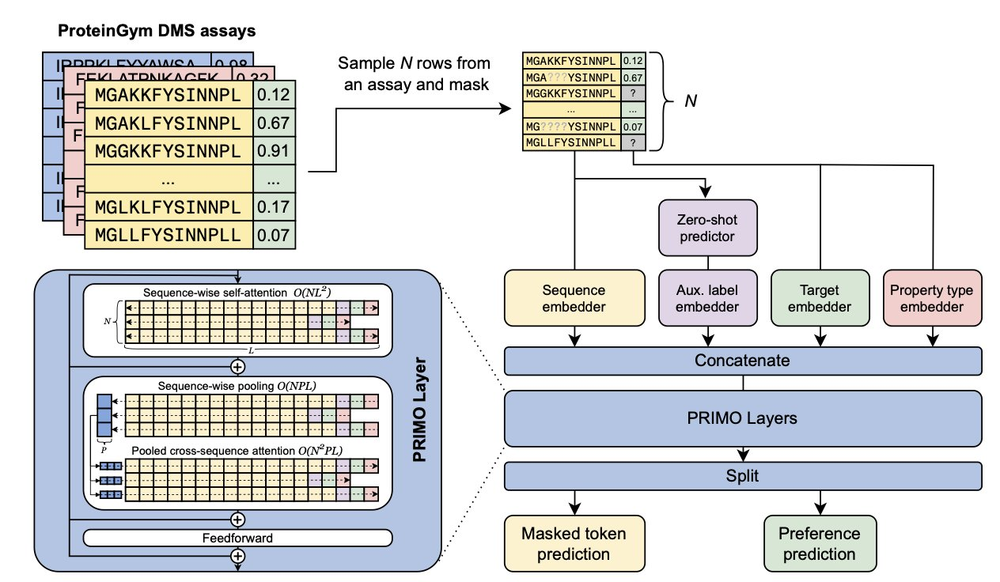
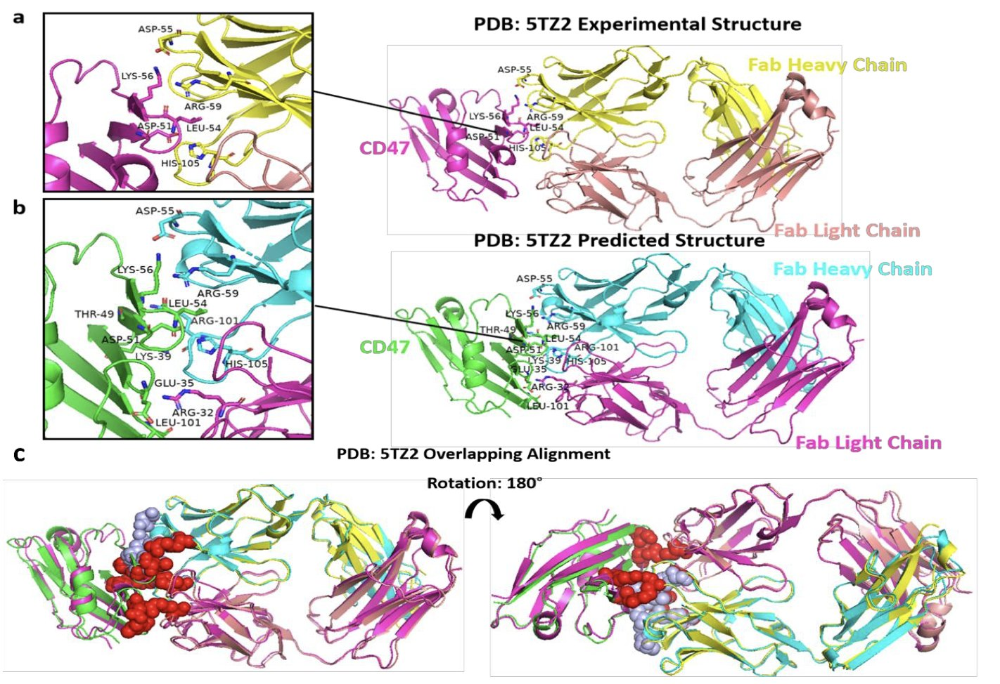
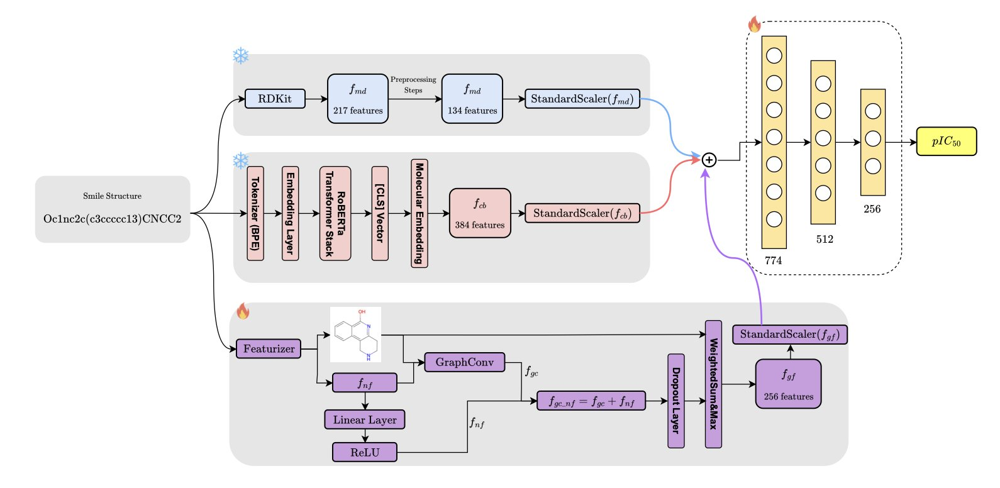
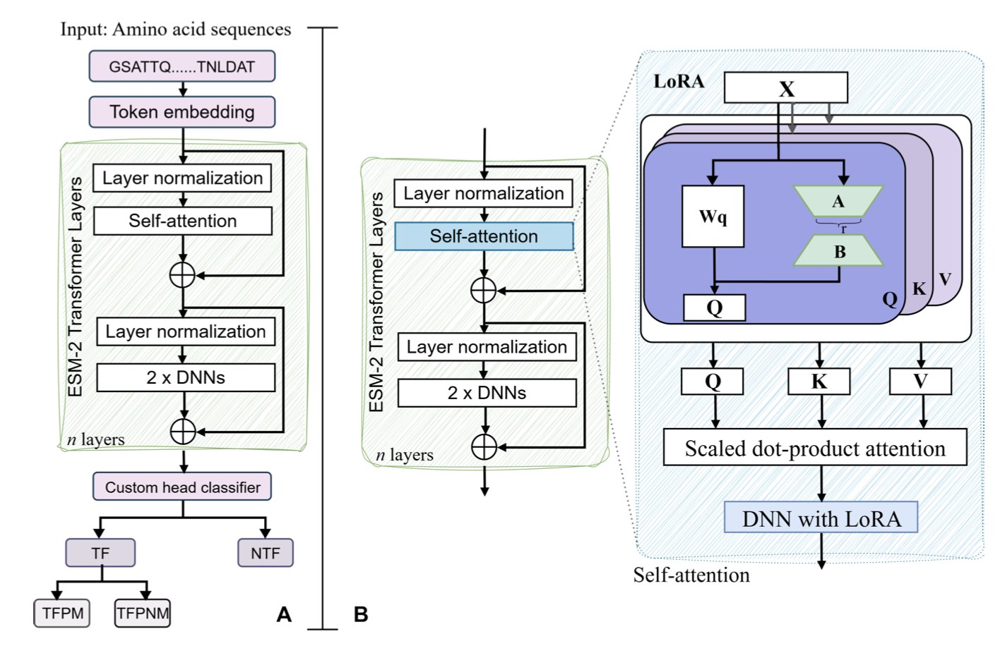

## 目录  
1. ApexGen 利用流匹配技术，在单一确定的过程中同步优化多肽序列与三维结构，解决了传统方法中序列与结构割裂的难题，提升了结合亲和力与物理合理性。
2. PRIMO 框架结合上下文学习与测试时训练，仅需少量实验数据便能预测蛋白质适应性，包括复杂的插入缺失突变。
3. 传统的静态模型难以捕捉基因调控的瞬时互动。这项研究提出了一种新型计算框架，整合多组学数据与时序动态，有效解决了这一难题。
4. Rep3Net 融合分子描述符、ChemBERTa 和图特征，实现了对 PARP-1 抑制剂活性的精准预测，其性能优于单一模态模型。
5. 利用 ESM2 微调构建双层预测框架，准确识别转录因子，并揭示其对 DNA 甲基化的结合偏好及关键序列基序。

## 1. ApexGen：流匹配同步生成多肽序列与结构  
  
  

多肽药物设计长期受困于计算复杂性。传统方法通常将「序列优化」与「结构生成」割裂处理，这种分步策略常导致顾此失彼：看似合理的序列难以折叠出正确形状，或者完美的结构在化学上无法合成。  
  
**ApexGen** 提出了一种全新的 AI 框架来打破僵局。它利用流匹配（flow matching）技术，在「乘积流形」这一数学空间内，协同处理多肽骨架扭转、刚体位置、氨基酸种类及侧链角度。多肽的序列身份与几何结构在同一个过程中实现同步进化。  
  
这种方法的优势在于**几何一致性**。不同于许多生成后需要「修补」才能符合物理定律的模型，ApexGen 产出的结构直接满足物理合理性，无需额外修正。  
  
在与 PepFlow 等现有模型的对比中，ApexGen 展现了强劲的数据表现。其生成结构与天然多肽折叠高度相似，平均 TM-score 达到 0.99，在计算结构生物学领域已逼近理论极限。  
  
**全受体条件化**（whole-receptor conditioning）体现了该模型的设计深度。AI 不再局限于结合口袋，而是感知整个受体蛋白的上下文。这种全局视野确保多肽精准嵌入结合位点，并规避与受体其他区域发生立体化学冲突。  
  
从化学角度审视，生成的多肽真实性极高。它们符合天然拉氏图分布，骨架角度自然，并展现出正确的化学直觉——懂得在关键界面利用极性和芳香族残基增强结合力。Boltz-2 和 PyRosetta 的评估也证实，这些设计在能量上更为有利。  
  
ApexGen 为药物研发提供了一个攻克困难蛋白 - 蛋白相互作用（PPI）靶点的利器。它能快速生成多样且结构合理的候选分子，大幅压缩早期筛选周期。随着非天然氨基酸库的扩展及实验数据的闭环反馈，该工具的实用价值将进一步释放。  
  
📜Title: ApexGen: Simultaneous design of peptide binder sequence and structure for target proteins  
🌐Paper: https://arxiv.org/abs/2511.14663  

## 2. PRIMO：搞定蛋白工程的小样本预测  
  
  

蛋白工程与抗体设计常面临两难：预测突变效果需要大量数据，而手头的湿实验数据往往寥寥无几。深度学习模型通常依赖海量数据训练；依靠进化信息的零样本（Zero-shot）模型虽能运行，却难以捕捉特定实验条件下的细微差别。PRIMO 框架正是为了解决这一「少样本」难题而生。  
  
**核心逻辑：上下文学习与测试时训练**  
  
PRIMO 采用类似 GPT 的上下文学习思路：向模型展示少量「突变 A 活性高，突变 B 活性低」的示例，使其具备预测突变 C 的能力。  
  
在此基础上，PRIMO 引入**测试时训练（Test-time training**）。模型在推理阶段利用手头稀缺的实验数据快速微调，如同考前针对题型突击复习，从而适应当前特定的预测任务。  
  
**工作原理**  
  
研究者设计了一套统一编码方式，将三类信息输入模型：  
1. 蛋白质序列信息。  
2. 辅助零样本预测分数（基于现有进化模型计算的基础值）。  
3. 稀疏的实验标签。  
  
这些信息转换为 Token，在预训练的掩码语言模型（Masked-language modeling）框架下处理。为区分突变优劣，研究者采用基于偏好的损失函数。模型聚焦于突变体的相对排名而非具体数值，这对筛选高活性分子更为实用。  
  
**攻克「插入缺失」突变**  
  
点突变（Substitution）相对容易，涉及序列长度变化的插入和缺失（Indels）常导致基于对齐（Alignment）的模型失效。PRIMO 能有效处理此类复杂的蛋白质结构变化，展现出强大的鲁棒性。  
  
**拒绝「刷榜」：更真实的基准测试**  
  
随机拆分数据集常导致训练集与测试集序列过高相似度，造成分数虚高。研究者引入「自然进化基准」，确保训练与测试序列在空间上保持距离。结果显示，即便在此高难度设定下，PRIMO 的表现依然超越现有的零样本及全监督基准模型。  
  
对于药物研发从业者，面对新靶点且仅有数十个实验数据时，PRIMO 是值得尝试的工具。  
  
📜Title: Few-shot Protein Fitness Prediction via In-context Learning and Test-time Training  
🌐Paper: <https://arxiv.org/abs/2512.02315v1>  

## 3. 多组学结合时序动态：重构基因调控网络分析  
  
  

计算生物学领域长期致力于模拟基因调控网络（Gene Regulatory Networks, GRN）。旧模型如同静态照片，虽能定格分子间的关联，却丢失了互动过程。新研究构建了一个全新计算框架，将这些「照片」连缀成一部连续的「电影」。  
  
**打破数据孤岛**  
  
该框架的核心在于整合多组学（Multi-omics）数据。理解复杂的细胞状态需要这种整体视角。生物学过程错综复杂，遗传因素与表观遗传因素（Epigenetic factors）交织作用。新框架揭示了不同层面的调控因子如何协同工作并影响基因表达。  
  
**时间维度的引入**  
  
传统分析常忽略「转瞬即逝」的信号，而本研究聚焦于基因调控的时间动态（Temporal dynamics）。在发育或疾病进展中，关键调控事件往往是瞬时的。新框架展示了这些短暂相互作用如何引发「蝴蝶效应」，对细胞功能产生长期影响。这种捕捉动态变化的能力，对解析生化机理至关重要。  
  
**从模拟到实战**  
  
算法的落地依赖于处理数据的能力。研究人员优化了框架的可扩展性（Scalability），使其能高效处理 TB 级的高通量测序数据，这对工业应用至关重要。通过模拟实验和真实生物场景（如发育生物学案例）验证，该工具不仅停留在理论层面，更能挖掘此前被忽视的调控机制。  
  
📜Title: A New Approach in Computational Biology: Exploring the Dynamics of Gene Regulatory Networks  
🌐Paper: <https://arxiv.org/abs/2511.14676>  

## 4. Rep3Net：融合多模态信息精准预测 PARP-1 抑制剂活性  
  
  

预测药物活性时，研究者常在不同方法间选择：经典的分子指纹、图神经网络 (GNN, Graph Neural Network) 或是基于 Transformer 的大语言模型 (LLM, Large Language Model)。关于 Rep3Net 的这项研究表明，融合多种方法是更优解。  
  
**多模态视角的必要性**  
  
单一的分子表征方式存在局限。Rep3Net 的架构设计融合了三种信息来源：  
1.  **分子描述符**：捕捉分子的理化性质，如分子量、LogP 等。  
2.  **ChemBERTa 嵌入**：基于 Transformer 的预训练模型，将 SMILES 字符串作为化学语言处理，提取上下文信息。  
3.  **图特征**：直接处理分子的拓扑结构，关注原子间的连接和空间关系。  
  
这种多模态 (Multimodal) 策略旨在弥补单一视角的不足。消融研究 (Ablation Study) 数据证实，移除任一模块都会导致模型预测性能下降，三者结合才能达到最佳效果。  
  
**实战表现：PARP-1 抑制剂**  
  
研究者选择聚腺苷二磷酸核糖聚合酶 -1 (PARP-1, Poly(ADP-ribose) polymerase 1) 作为测试靶点。这是一个在癌症治疗中成熟且重要的靶点，已有大量高质量的活性数据积累，用其进行基准测试很有说服力。  
  
结果显示，Rep3Net 在均方误差、决定系数以及皮尔逊相关系数等指标上，均优于传统的 QSAR 模型。这说明在筛选针对 PARP-1 的新骨架化合物时，其预测的准确性和排序能力更可靠。  
  
**算力与工程的平衡**  
  
Rep3Net 在工程实现上进行了优化。它采用并行架构处理不同的分子表征，在确保模型容量足以捕捉复杂构效关系的同时，维持了合理的计算效率。这对于需要在大型虚拟化合物库中进行快速筛选的早期药物发现工作十分关键。  
  
**下一步是什么**？  
  
目前模型的验证主要集中在 PARP-1 上。未来的挑战是将此架构推广到化学空间更广阔、数据更稀疏的其他靶点。此外，多模态模型常面临可解释性问题，利用可解释性 AI (Explainable AI) 技术阐明模型决策依据，对于提升化学家的信任度至关重要。  
  
📜Title: Rep3Net: An Approach Exploiting Multimodal Representation for Molecular Bioactivity Prediction  
🌐Paper: <https://arxiv.org/abs/2512.00521v1>  

## 5. ESM2 微调：精准识别转录因子与甲基化结合  
  
  

蛋白质语言模型（pLMs）正从通用工具进化为特定领域的专家。bioRxiv 上的一项新研究利用 Meta 的 ESM2 模型，通过微调（Fine-tuning）攻克了一个核心难题：**转录因子（TF）的识别及其对 DNA 甲基化的敏感性**。  
  
**双层预测架构**  
  
转录因子种类繁多，功能各异。研究设计了双层预测框架：  
  
第一层鉴别身份。模型分析蛋白序列，判断其是否为转录因子。相比传统的序列比对，该方法理解序列背后的「语法」，准确率更高。  
  
第二层判定结合偏好。确认转录因子身份后，进一步分析其是否倾向于结合甲基化 DNA。这一特征在表观遗传学和癌症研究中至关重要。  
  
**ESM2-650M 与 LoRA 的平衡**  
  
全参数微调（Full Fine-Tuning）算力成本高昂。作者对比不同规模模型后发现，**ESM2-650M** 在参数规模与表征能力间取得了最佳平衡。  
  
配合 **LoRA（低秩自适应**）技术，研究实现了参数高效微调（PEFT）。这种策略仅需训练少量参数，在保持与全参数微调相当准确率的同时，大幅降低了计算门槛，使本地服务器部署成为可能。  
  
**可解释性验证**  
  
为验证模型是否真正理解生物学机制，作者提取并可视化了注意力权重（Attention Weights）。  
  
结果显示，**模型高度关注的区域与已知的蛋白质序列基序（Sequence Motifs）吻合**。模型准确锁定了 DNA 结合域及决定甲基化偏好的位置，证明其基于生物学规律进行预测，而非依赖统计噪声。  
  
📜Title: Fine-Tuning Protein Language Models Enhances the Identification and Interpretation of the Transcription Factors  
🌐Paper: <https://www.biorxiv.org/content/10.1101/2025.11.27.691010v1>
