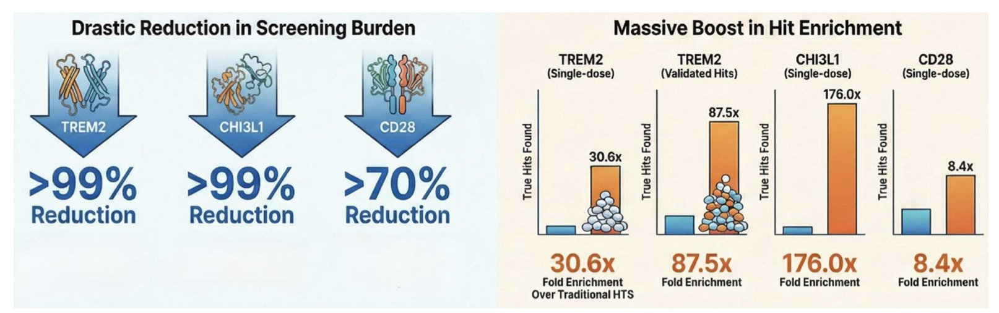
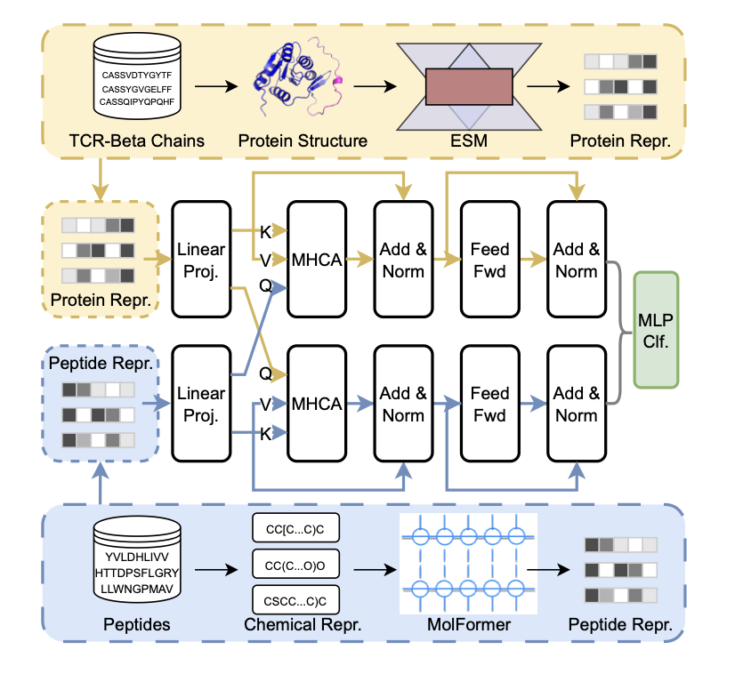
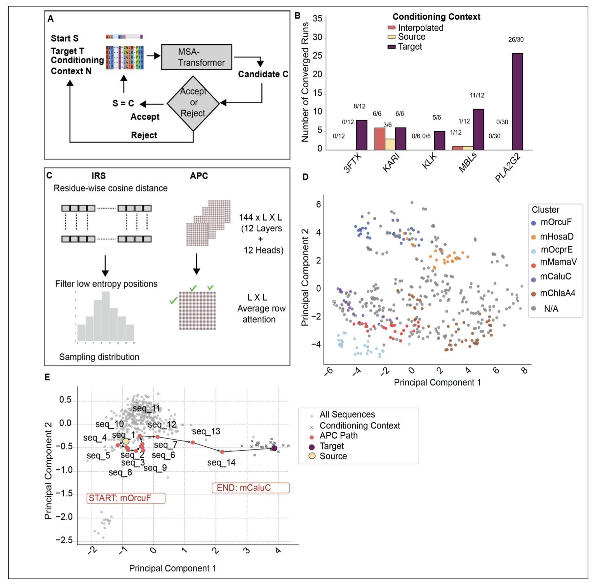
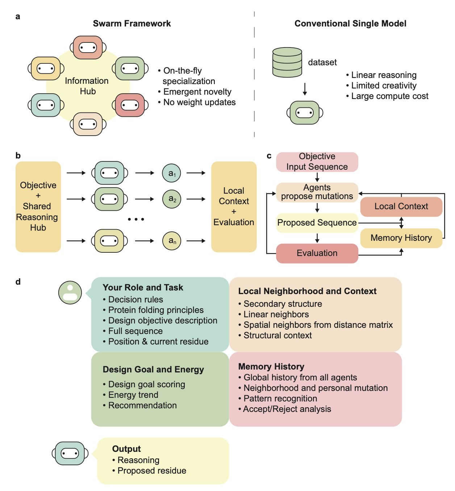
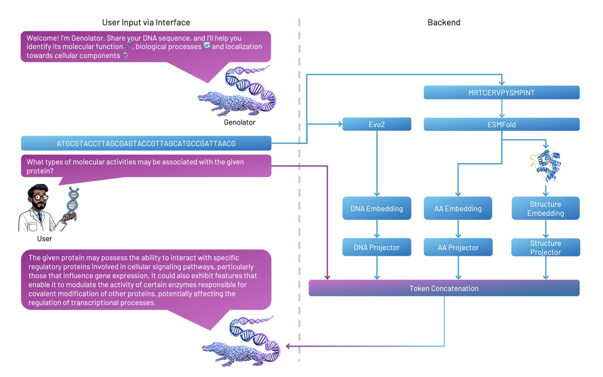

## Table of Contents
1. HTS-Oracle combines a molecular language model with cheminformatics to cut screening experiments by 99% with minimal data, successfully identifying active molecules for "undruggable" targets like TREM2.
2. The TIDE framework fuses two large language models, ESM and MolFormer, using a cross-attention mechanism to improve immune recognition prediction without structural alignment.
3. This framework uses MSA-Transformer to simulate natural evolutionary mutation steps, generating structurally stable "hybrid" proteins with dual properties from two homologous proteins.
4. This study proposes a decentralized framework inspired by "swarm intelligence," where each large language model agent handles one residue, successfully designing experimentally validated proteins at zero training cost.
5. Genolator is a Multimodal Large Language Model designed to interpret protein function. It simultaneously understands natural language, gene sequences, and 3D protein structures, outperforming general models like GPT-4.

## 1. HTS-Oracle: AI-Powered Screening for Undruggable Targets Boosts Hit Rate 176-Fold

Traditional high-throughput screening (HTS) is often expensive and has a low hit rate. **HTS-Oracle** offers an efficient solution.

**Hybrid Architecture: Language Models Meet Chemical Fingerprints**

HTS-Oracle uses a **hybrid architecture**, combining **ChemBERTa**, a Transformer-based molecular language model, with classic **RDKit** molecular fingerprints and physicochemical features.

The language model captures deep structural meaning, while traditional chemical fingerprints ensure the model follows basic physicochemical rules. Together, they significantly improve its predictive power for new targets.

**Real-World Validation: Tackling Tough Immune Targets**

The team tested it on three challenging immune targets: **TREM2, CHI3L1, and CD28**.

TREM2 is a key regulator in Alzheimer's disease and for microglia, and has long lacked effective small-molecule agonists. CD28 is a classic example of an "undruggable" target. Even with very few positive samples (less than 2%) in the CD28 training data, HTS-Oracle boosted the hit rate by 8 times.

**An Efficiency Overhaul: From Haystack to Magnet**

The data shows that HTS-Oracle can **reduce wet-lab screening volume by 99%** while still finding active molecules. A screening process that used to take months and cost a fortune now only requires validating a small core set. With a hit rate improvement of up to **176 times**, it completely changes the logic of screening.

**Tools and Open Source**

The team developed an interactive web app so scientists can upload compound libraries, configure parameters, and see visualized results without writing code. For developers, all code, setup guides, and pre-trained models are open-source.

📜Title: HTS-Oracle: Experimentally validated AI-enabled prioritization for generalizable small molecule hit discovery
🌐Paper: <https://www.biorxiv.org/content/10.1101/2025.11.26.690784v1>
💻Code: <https://github.com/HTS-Oracle/HTS-Oracle-TREM2>

## 2. TIDE: Using a Dual-Encoder Model to Predict TCR-pMHC Binding

Predicting the binding of a T-cell receptor (TCR) to a peptide-MHC complex (pMHC) is a major challenge in computational immunology and drug development. Scarce data and the highly flexible surfaces of proteins make the task difficult. The TIDE framework offers a new solution.

**Treating Antigenic Peptides like Small Molecules**

TIDE's approach is to handle the TCR and the peptide separately. It keeps the TCR as a protein and uses the **ESM (Evolutionary Scale Modeling)** model to extract its evolutionary and sequence features.

For the peptide, TIDE converts it into a **SMILES string**, which is then processed by the **MolFormer** model. Using a SMILES string helps the model better understand the peptide's underlying stereochemistry and electron distribution, turning a biological problem into one of physical chemistry.

**Cross-Attention: Making Two Models Talk**

Encoding them separately produces two independent vectors. The core of TIDE is its **Multi-head Cross-attention** mechanism.

This process is like a conversation between the two models. The TCR encoder might identify a hydrophobic complementarity-determining region (CDR3), while the peptide encoder finds a benzene ring structure via MolFormer. The cross-attention module aligns this information, finds the most relevant parts, and weights them. This design allows the model to capture key binding patterns without relying on scarce 3D crystal structure data.

**Performance: Stronger on New Data**

A key test for any AI model is how it handles new data. In zero-shot and few-shot tests, TIDE performed better than existing methods like TITAN and NetTCR. Its predictions were more reliable when tested on new viral antigens or tumor neoantigens.

The study also tested multiple negative sampling strategies. In immunology prediction, if the "non-binding" data is too simple, the model might not learn the real patterns. Rigorous negative sampling ensures the model truly understands the rules of binding.

The code and datasets for this study are open-source.

📜Title: Modeling TCR–pMHC Binding with Dual Encoders and Cross-Attention Fusion
🌐Paper: <https://www.biorxiv.org/content/10.64898/2025.12.01.691424v1>

## 3. MSA-Transformer Update: Simulating Evolutionary Paths to Design "Hybrid" Proteins

Protein design faces a difficult problem: how do you "hybridize" two different but related proteins so the new molecule folds correctly and has the benefits of both? Simply averaging the two sequences in a computer or interpolating them in a latent space usually produces unfolded junk.

This paper uses **MSA-Transformer** to build a framework that solves this by simulating natural evolution.

**Iterative Mutation and Beam Search**

**Generating intermediate sequences** is the core strategy. Instead of jumping directly from protein A to protein B, the framework uses **iterative randomization**, applying mutations step-by-step using sequence embeddings and attention mechanisms.

The key technique is **Beam Search**. This strategy keeps several "best solutions" at each step, allowing the model to explore multiple mutation paths at once. This approach has a higher convergence rate than random trials and generates more biologically plausible sequences.

**The Non-Linear Geometry of Latent Space**

The authors analyzed the geometric features of the mutation paths in latent space.

The path generated by MSA-Transformer is clearly **non-linear**, not a simple linear interpolation. This shows the model captures the complex dynamics of protein evolution: to maintain function and stability, evolution has to navigate around "lethal" sequence spaces. This adherence to biological rules is why simulating evolution works better than simple interpolation.

**Real-World Validation: Metallo-β-Lactamases**

The authors tested the method on the PLA2G2, 3FTx, and tissue kallikrein families.

The results were particularly clear in experiments with the **B1/B2 Metallo-β-lactamase** family. The generated hybrid proteins kept their core structural fold and successfully merged active site motifs from different subclasses. This offers a viable path for designing new enzymes with broader substrate scopes or higher stability.

**Open-Source Tool**

The authors have made the code available on GitHub. It's an effective tool for researchers exploring protein sequence space or designing dual-function hybrid proteins by using AI to mimic nature's "patching" strategy.

📜Title: Generating Hybrid Proteins with the MSA-Transformer
🌐Paper: <https://www.biorxiv.org/content/10.1101/2025.11.20.689447v1>

## 4. Swarms of Large Language Models: Designing New Proteins Without Training

Traditional protein design methods, like the diffusion-based model RFdiffusion, act like a master architect drawing up a complete blueprint. This study presents a different idea: let each brick think for itself.

That's the core of the "Swarm Intelligence" framework.

**Every "Amino Acid" is an Agent**

The researchers assigned an independent LLM agent to each residue position in the protein sequence. Each agent is only responsible for the amino acid at its own position. It looks at its neighbors, collaborates with other agents, and autonomously decides whether to mutate.

This decentralized approach doesn't rely on known protein motif scaffolds or vast amounts of pre-training data. The agents find the global optimal solution on their own through iterative, local interactions.

**Exploring Unknown Sequence Space**

The data shows the framework can explore sequence spaces that traditional methods haven't reached, striking a balance between exploring novelty and converging on a stable structure. By dynamically adjusting the LLM's behavior, the "swarm" can both boldly try new sequence combinations and quickly converge on solutions with reasonable physicochemical properties. This could lead to the discovery of new, powerful proteins that don't exist in nature.

**Highly Efficient Computation**

This "swarm" framework requires no extra training. The authors note in the paper that the entire design process takes only a few GPU-hours. This not only lowers the computational cost but also allows labs without large computing resources to perform *de novo* protein design.

**Experimental Validation**

The researchers synthesized the designed protein sequences and tested them with circular dichroism. The results confirmed that the sequences fold correctly in solution into the intended secondary structures, like alpha-helices and beta-sheets. This shows that the method generates not just formally correct sequences, but molecules with real physical stability.

For computer-aided drug discovery, this method based on a cluster of LLM agents shows flexibility and utility for rapid prototyping and multi-objective optimization.

📜Title: Swarms of Large Language Model Agents for Protein Sequence Design with Experimental Validation
🌐Paper: <https://arxiv.org/abs/2511.22311v1>

## 5. Genolator: A Multimodal Large Model Fusing Genes and Structures

*   Genolator fuses three data types—natural language, genomes, and protein structures—to achieve a deep interpretation of protein function.
*   Fine-tuned on 370,000 question-answer pairs, Genolator's accuracy on protein function confirmation tasks surpasses that of GPT-4 and other specialized models in the field.

Biology research, especially in protein function, faces a data explosion. We have massive amounts of gene sequences, 3D protein structures, and scientific literature. Linking these different data types so a machine can synthesize information like a scientist—to answer questions like "is this protein linked to a specific cancer?"—is a challenge. General large language models (LLMs), like GPT-4, often fall short on such highly specialized, cross-modal problems.

Genolator was designed for this. It's an expert model trained to understand three "languages" at once: human natural language, the genetic language of A/T/C/G, and the structural language that describes a protein's 3D space.

Here's how it works: the model first extracts features from a DNA sequence, an amino acid sequence, and a protein's 3D structure. It converts these into mathematical vectors that a machine can process, called embeddings. Next, a "Token Projectors" module fuses the vectors from these three sources. This way, when a user asks a question in natural language, the model can connect the question to the genetic and structural information it holds and make a comprehensive judgment.

To train this expert model, the researchers fine-tuned it on a dataset of over 370,000 question-answer pairs about protein function. The results show that this specialized training works. On tasks like determining if a protein has a certain function, Genolator's accuracy was higher than that of GPT-4 and other bioinformatics models.

The researchers also analyzed Genolator's hidden states and found that the model spontaneously clusters functionally related Gene Ontology (GO) terms. This suggests that Genolator is beginning to understand the internal logic between biological concepts, like distinguishing which functions are "metabolic processes" and which are "cell communication."

This research offers a new idea for computer-aided drug discovery: for solving complex problems in a specific field, a "small but specialized" multimodal expert model might be a better choice. Future AI models will need a deeper understanding of specialized knowledge domains.

The researchers plan to release all code and the trained model, which will help the community build more powerful tools on top of it and accelerate exploration in the life sciences.

📜Title: Genolator: A Multimodal Large Language Model Fusing Natural Language, Genomic, and Structural Tokens for Protein Function Interpretation
🌐Paper: <https://www.biorxiv.org/content/10.1101/2025.11.14.688396v1>
