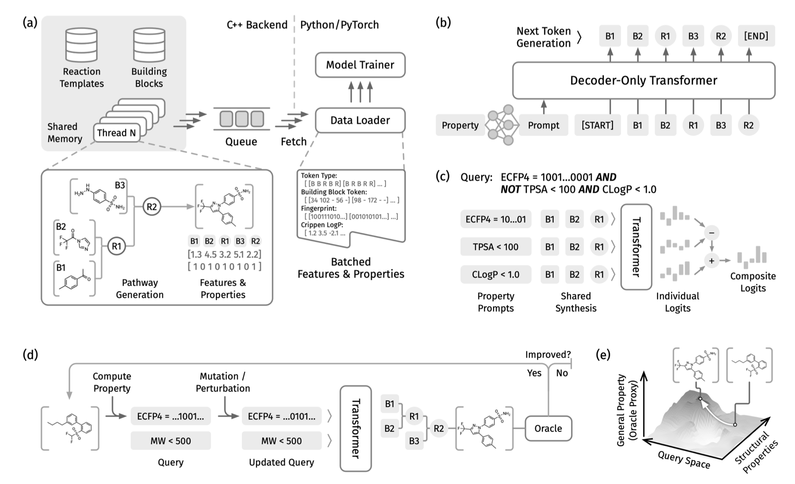
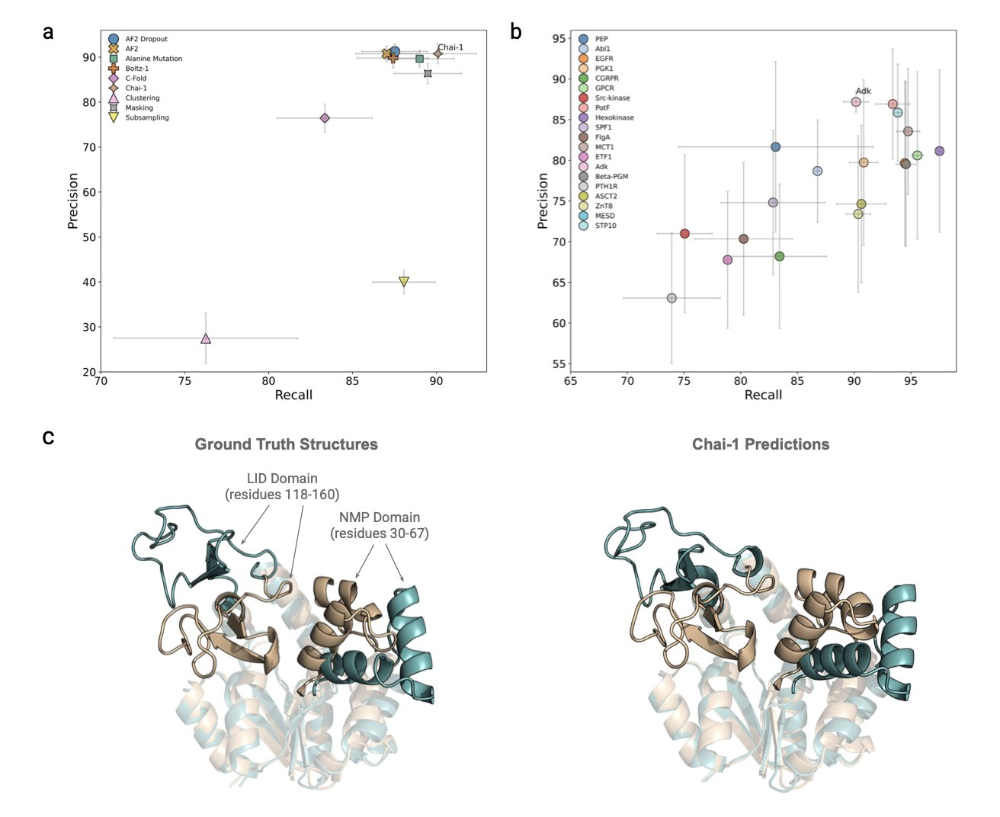
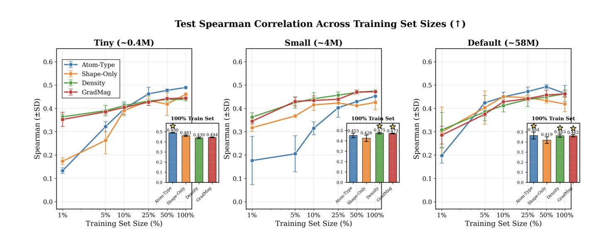
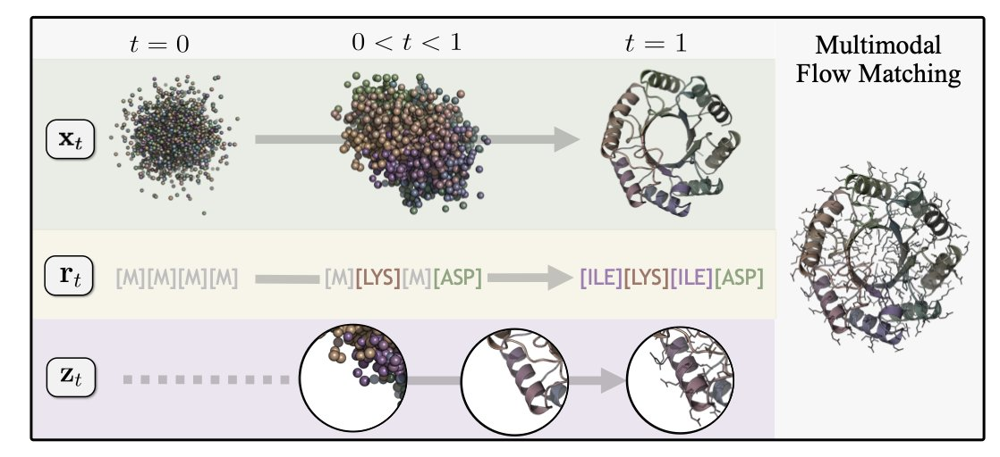
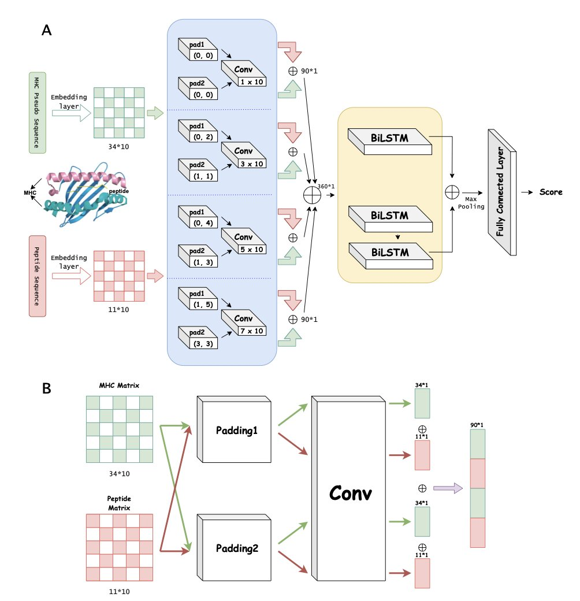

## Table of Contents
1. PrexSyn uses a decoder-only transformer trained on a billion-scale dataset to explore chemical space efficiently and programmatically, ensuring all generated molecules are synthesizable.
2. Generative AI models, especially Chai-1, show strong performance in predicting protein conformational changes, with efficiency and accuracy that could replace molecular dynamics simulations.
3. This research shows that using electron density maps directly as input for 3D convolutional neural networks (CNNs) is often more effective than traditional atom-type representations for predicting protein-ligand affinity and quantum properties, capturing physical interactions more accurately.
4. To unlock the potential of all-atom protein generation models, it is necessary to fix the misalignment between sequences and structures in training data by using tools like ProteinMPNN to generate synthetic sequences.
5. The DPCMHC model uses a dual-padding convolution and BiLSTM architecture to solve the difficult problem of predicting binding affinity for MHC class I molecules with peptides of varying lengths, especially 10- and 11-mers.

## 1. PrexSyn: Efficiently Exploring a Billion-Scale Synthesizable Chemical Space

Drug developers often face a frustrating situation. An AI model generates a molecule that looks perfect—it binds tightly to a protein pocket and gets a high score. But when a synthetic chemist reviews it, they can only shake their head. The molecule is either impossible to make or would require an extremely complex synthesis. This has been a long-standing challenge for generative AI in drug discovery: **synthesizability**.

**PrexSyn** takes a different approach by generating the "synthesis path" directly.

The model uses a decoder-only transformer architecture trained on a dataset of one billion "synthesis path-molecular property" pairs. It works like a translator: you input the desired molecular properties (like a specific LogP range, molecular weight, or target activity), and it outputs a "recipe" to synthesize a molecule that fits.

The core advantage of this method is its **programmability**.

During lead optimization, the goal is often to find a molecule that balances activity, solubility, and low toxicity. PrexSyn allows researchers to define these goals using logical queries. You can set conditions just like writing code: satisfy condition A AND condition B, OR condition C. This ability to handle compound properties makes its sampling efficiency much higher than previous methods, whether they accounted for synthesis or not.

PrexSyn achieved a **94% reconstruction rate** on the **Enamine REAL** database, an industry-standard library of synthesizable compounds. This means the chemical space it explores is grounded in reality, not just abstract mathematics.

The model also showed strong practical performance in scaffold hopping and docking-based optimization tasks. It can discover new, synthesizable scaffolds with better properties while preserving key interactions.

PrexSyn gives computational and medicinal chemists a new workflow. They can start their search within a pool of "synthesizable" candidates, saving them from having to filter out massive numbers of impossible molecules.

📜Title: Efficient and Programmable Exploration of Synthesizable Chemical Space  
🌐Paper: <https://arxiv.org/abs/2512.00384v1>  
💻Code: <https://github.com/luost26/PrexSyn>

## 2. AI Predicts Protein Conformations: A New Benchmark Shows Generative Models' Potential

The traditional method for studying how proteins change shape is molecular dynamics (MD) simulation, but it's slow and resource-intensive. To watch a protein move from one state to another, you need a supercomputer to simulate thousands of atoms over tiny timescales, a process that often takes days or weeks. AI might offer a shortcut.

A recent study created a new benchmark to systematically evaluate how well nine leading protein folding models can predict conformational flexibility. The researchers tested the models on 20 monomeric proteins, focusing on adenylate kinase (AdK). AdK's function depends on a large, lid-like opening and closing motion, and it has been studied extensively, making it an ideal test case for these models.

The researchers developed a new metric to measure how well a model's predicted set of conformations matches reality. The results showed that the properties of the protein itself, like its degree of structural disorder and its amino acid sequence, had a greater impact on the prediction's success than the choice of AI model or sampling method. This suggests that picking the right protein target may be more important than optimizing the model.

Among the models tested, the generative model Chai-1 stood out. It accurately predicted the known open and closed states of AdK and generated many plausible intermediate states between them. These intermediate conformations are critical for understanding how a protein moves step-by-step to perform its function.

To validate the intermediate states generated by Chai-1, the researchers compared them to traditional MD simulations. They found that Chai-1's set of predicted conformations was highly consistent with the known conformational transition pathway of AdK. This shows that generative models have the ability to efficiently explore a protein's conformational space and reveal its functional mechanisms.

Further analysis at the single amino acid residue level showed that Chai-1 could accurately identify high-activity regions in AdK and capture dynamic details important for its function. This capability could be extended to other proteins with complex conformational changes, offering new avenues for drug discovery.

📜Paper: *Exploring the Conformational Landscape of Adenylate Kinase and Beyond: A Benchmark of Protein Folding Models*  
🌐Paper Link: <https://www.biorxiv.org/content/10.1101/2025.11.04.686486v1>  
💻Code: https://github.com/instadeepai/FoldConfBench

## 3. Beyond Atoms: How Electron Density Maps Are Changing AI Drug Discovery

Computational chemists have long faced a basic problem: how do you "feed" a molecule to a computer?

For 3D molecular learning, we used to treat molecules as a collection of labeled spheres—"this is a carbon, that's a nitrogen, at coordinates X, Y, Z." This atom-based representation is simple and direct, like building with blocks. But the real work of chemistry and drug binding happens where electron clouds meet and repel each other. This study tried a new approach: instead of telling the neural network "what atom this is," it feeds the network the **electron density map** directly.

**Moving Past a Pile of Atoms**

The researchers compared traditional atom-type inputs with electron density inputs, feeding both into 3D convolutional neural networks (CNNs).

In the difficult task of predicting **protein-ligand binding affinity**, especially with limited data, the electron density map performed better than the atom-type representation. This aligns with a medicinal chemist's intuition. When a drug molecule squeezes into a protein pocket, the protein first senses **shape complementarity** and **electrostatic distribution** (where electrons are dense and where they are sparse). A continuous map of electron distribution and spatial occupancy carries richer information about these interactions.

**A Simpler Way to Predict Quantum Properties**

The advantage of using electron density was even clearer when predicting a molecule's **quantum properties**. Even when using semi-empirical methods to generate relatively rough and cheap density maps, the accuracy was still better than that of all-atom models. The electron density better reflects the molecule's electronic structure, capturing delocalization effects and electron cloud distortions that atom types alone cannot describe.

**No Silver Bullet, Only Trade-offs**

The paper remains objective: **electron density is not a universal solution**.

The effectiveness of a representation depends heavily on the specific task. For predicting certain quantum properties, knowing "this is an oxygen atom" is more important than "there is a blob of electrons here." For binding affinity, sometimes simple spatial occupancy (shape) is enough to make a good prediction.

Future AI models for drug discovery will likely use hybrid inputs. Instead of arguing about "atoms versus density," the choice will depend on the problem. This work is a reminder to return to first principles—**drug discovery is ultimately a physics problem**. Using more physically realistic representations can improve data efficiency and opens a new, more rigorous path for structure-based drug design (SBDD).

📜Title: Beyond Atoms: Evaluating Electron Density Representation for 3D Molecular Learning  
🌐Paper: <https://arxiv.org/abs/2511.21900v1>

## 4. Fixing Data Mismatch: Synthetic Sequences Unlock All-Atom Protein Design

Protein design often runs into an awkward problem: a model generates a backbone that looks good, but as soon as you add side chains or run a self-consistency check, its flaws are revealed. The paper *Consistent Synthetic Sequences Unlock Structural Diversity in Fully Atomistic De Novo Protein Design* points out that the root of the problem lies in the input data itself.

**The "Noise" in the Data**

In the Protein Data Bank (PDB), the way a sequence folds into a specific structure is not always the physically optimal solution; evolution involves some randomness. When you train an AI on these naturally occurring, imperfectly matched sequence-structure pairs, the model learns fuzzy rules.

The authors focused on data quality. They used ProteinMPNN, one of the best inverse folding tools available, to generate a new set of "synthetic sequences" based on known structures. This is like creating a custom-fit sequence for each structure, rather than using the natural one that doesn't fit perfectly. This highly consistent "synthetic data" was the key to unlocking structural diversity.

**Proteína-Atomística: A Full-Atom Approach**

With high-quality data in hand, the authors developed a unified framework called Proteína-Atomística. Unlike many generative models that compress atomic information into latent variables, this framework directly models the protein backbone, amino acid sequence, and side-chain atoms jointly, preserving every detail.

After training a model called La-Proteína on the synthetic dataset, the structural diversity of generated proteins increased by 54%, and their co-designability (the ability of a generated sequence to fold back to the generated structure) improved by 27%. This shows the model learned the underlying logic connecting structure and sequence.

**Side-Chain Details Are Decisive**

In drug discovery, the position of side chains in a binding pocket is critical. A tiny shift in angle can cause a huge drop in activity. The data shows that the new model generates side chains with very low MolProbity scores, meaning they have fewer spatial clashes and more reasonable geometries. This is valuable for virtual screening and molecular docking, as the generated structures are high-quality from the start and don't need extensive energy minimization to fix them.

This work shows that in AI drug discovery, improving data quality (Data-Centric AI) can be more effective than simply adding more layers to a network.

📜Title: Consistent Synthetic Sequences Unlock Structural Diversity in Fully Atomistic De Novo Protein Design  
🌐Paper: <https://arxiv.org/abs/2512.01976>

## 5. DPCMHC: Dual-Padding Convolution for Better MHC Binding Prediction

Predicting the binding affinity between MHC (Major Histocompatibility Complex) molecules and peptides is central to immunotherapy and vaccine design. While AI is already quite good at handling standard 9-mer peptides, its accuracy often drops significantly for peptides of varying lengths, especially 10-mers or 11-mers. The DPCMHC model was designed to solve this problem.

**Dual-Padding Convolution: More Than Just Adding Zeros**

Traditional convolutional neural networks (CNNs) often use zero-padding to process sequences, but this can cause a loss of key chemical information at the edges. The researchers' "dual-padding convolution" strategy uses a two-part mechanism to better extract features from the **start and end** of the sequence and from **adjacent amino acids**. This is like reading a genetic code while fully considering the context at the beginning and end. For 10-mers and 11-mers, this detailed handling of edge information is crucial.

**BiLSTM: Seeing the Sequence as a Whole**

Convolutions are good at extracting local features (like specific amino acid groups) but struggle to capture long-range logical relationships. Protein folding and binding involve complex, long-range interactions. DPCMHC incorporates a bidirectional long short-term memory (BiLSTM) network. The CNN slices and dices the sequence to extract local features, while the BiLSTM strings these pieces together to understand their dependencies. This combination allows the model to see both the details and the big picture.

**Performance in Practice**

Tests on three benchmark datasets showed that DPCMHC performs reliably on common 9-mers and has significantly improved prediction accuracy for 10-mers and 11-mers. An ablation study, where components were removed one by one, confirmed that removing either the dual-padding module or the BiLSTM led to a drop in performance, proving their effectiveness.

The researchers plan to further optimize the architecture to cover peptides of more lengths and to streamline the BiLSTM and fully connected layers to reduce training time. For scientists working on neoantigen discovery or vaccine development, this model offers a reliable tool for screening potential epitopes of non-standard lengths.

📜Title: DPCMHC: Efficient Prediction of MHC-Peptide Binding Affinity by Deep Learning Based on Dual-Padding Convolution  
🌐Paper: <https://www.biorxiv.org/content/10.64898/2025.12.01.691752v1>
