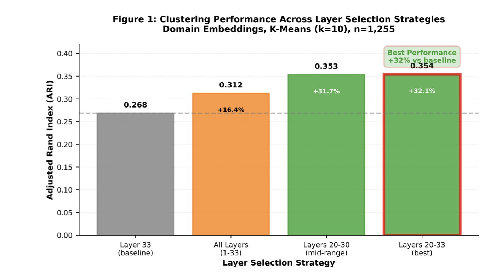
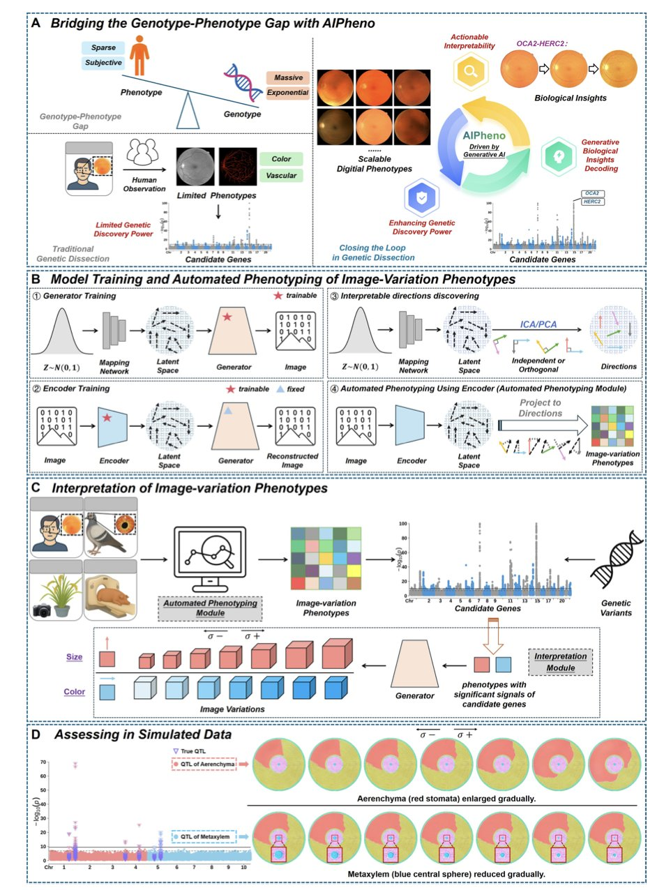
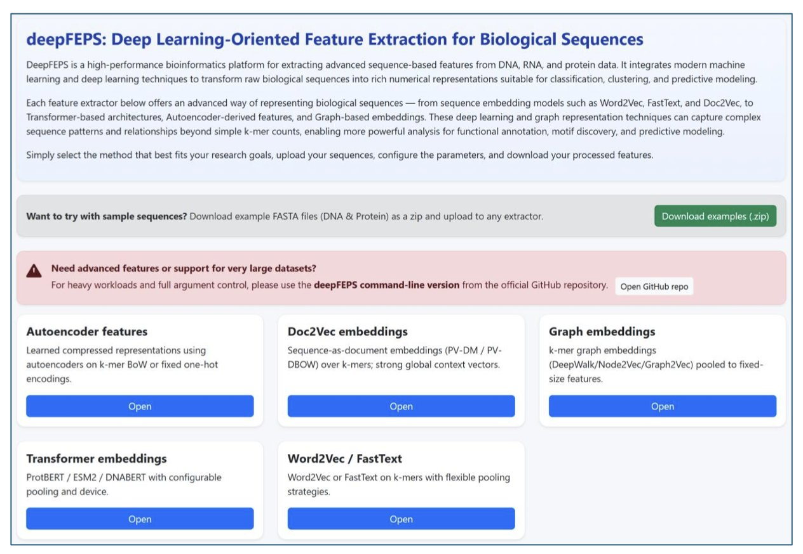
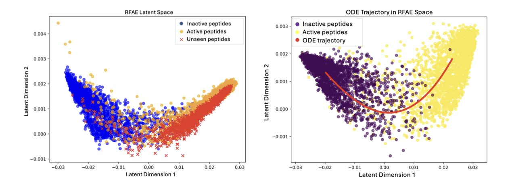
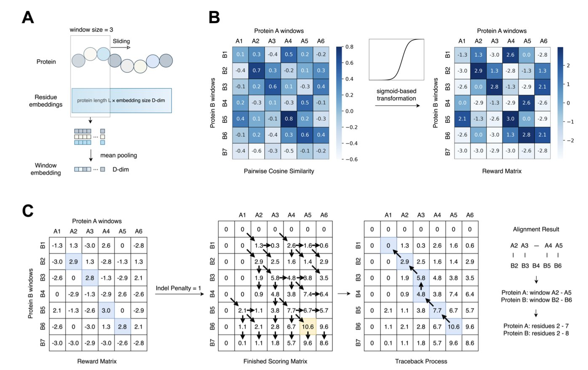
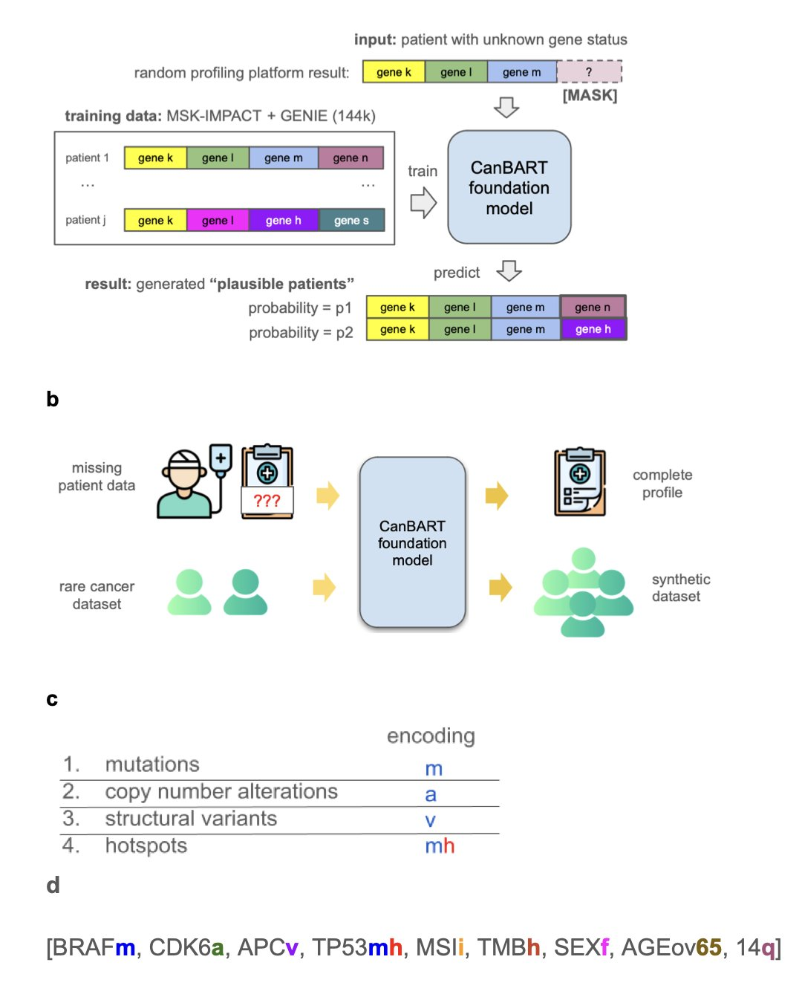

## 目录  
1. 针对激酶功能预测，挖掘蛋白语言模型（ESM-2）的中间层表征，比直接使用最终输出层能带来更准确、更可靠的结果。
2. AIPheno 利用生成式 AI 从图像中高通量提取数字表型，发现新基因位点，并通过生成图像直观展示基因变异如何改变生物特征。
3. DeepFEPS 整合从 Word2Vec 到 Transformer 五大类算法，提供自动质控报告，实现生物序列特征向量化的标准化与高效处理。
4. FDD 利用扩散映射融入任务监督信息，同时保持预训练嵌入几何结构，为抗菌肽设计提供了优于传统微调的高效方案。
5. 加州大学圣地亚哥分校的一项研究表明，利用蛋白质语言模型（protein language models, pLMs），仅凭序列即可精准识别局部结构相似性，无需构建三维（3D）模型。
6. CanBART 模型能像大语言模型（LLM）写句子一样生成癌症患者的基因组数据，解决了罕见癌症研究中数据不足的难题。

## 1. 激酶预测新发现：挖掘蛋白语言模型中间层的宝藏  

  

蛋白语言模型（Protein Language Model, PLM），特别是 Meta AI 的 ESM 系列，已成为计算生物学和 AI 制药领域的标准工具。多数应用直接提取最后一层的输出作为蛋白质的特征表示。但 Ajit Kumar 和 Indra Prakash Jha 的研究指出，对于激酶（Kinase）的功能预测，这种做法可能会忽略模型中最有价值的信息。  

**深入模型中间层**  

研究人员使用 ESM-2 650M 模型进行系统性的层级探测（Layer Probing），发现模型的最后一层虽为预测序列掩码（Masked Token Prediction）而优化，却不一定最适合表征蛋白质功能。  

好比观察汽车组装线，最后一站看到的是为运输优化的成品包装箱，而要了解引擎的内部构造（对应蛋白质功能属性），则需在中间工序观察。数据证实了这一点：当研究者改用模型的第 20 到 33 层特征进行无监督聚类时，性能比使用最后一层提升了 32%。这表明，中间层捕捉到了更多与生物学功能相关的细微特征。  

**提升分类准确率与预测置信度**  

在监督分类任务中，这一策略同样有效。通过对第 20 至 33 层的嵌入向量取平均，模型对激酶功能的分类准确率达到 75.7%，优于仅依赖最后一层的输出。这有助于药物化学家通过计算方法筛选激酶靶点时，降低假阳性率。  

该研究还注重预测的可靠性。模型给出预测结果时，必须明确其把握程度。研究者引入普拉特缩放来校准分类概率，将预期校准误差降低了 28%。校准后，当模型输出「90% 置信度」时，其结果的可信度更高。  

**实用性与启示**  

这项工作建立了一个包含结构域提取（Domain Extraction）和置信度校准的完整流程。他们选用的 ESM-2 650M 模型在性能与计算成本间取得了平衡，算力资源有限的实验室也能运行。  

对于药物研发人员，该结论有直接的应用价值：使用大模型进行下游任务时，不应默认最后一层是最佳选择。深入模型内部，挖掘中间层的表征，可能获得更符合生物学直觉、更准确的预测。  

📜论文标题：Layer Probing Improves Kinase Functional Prediction with Protein Language Models  
🌐论文地址：<https://arxiv.org/abs/2512.00376v1>  
💻代码地址：<https://github.com/jhaaj08/Kinases-Clustering>  

## 2. AIPheno：AI 读图挖掘基因与性状新关联  

  

基因测序（Genotype）成本极低，数据量巨大。真正的挑战在于表型（Phenotype）。虽然拥有海量个体基因组，但描述特征（如叶片卷曲度、视网膜细微结构、体脂分布）仍依赖人工测量或简单图像处理。这种「基因型 - 表型鸿沟」限制了研究深度。  

AIPheno 提出一种基于 AI 的新框架填补这一空白。  

**将图像翻译为数据**  

AIPheno 采用独特的「编码器 - 生成器」架构。它充当翻译官，将复杂的医学影像或生物照片转化为一组经过优化的数字（潜在表型），专门用于与基因数据进行对撞分析。  

这种方法显著提升了遗传发现能力。在人类、家鸽、水稻和猪的实验中，它优于传统深度学习方法，锁定了此前被忽略的位点，如人类的 CCBE1 和家鸽的 KITLG-TMTC3。  

**打开 AI 的黑盒子**  

AIPheno 的核心优势在于「可解释性模块」。传统全基因组关联分析（GWAS）仅指出基因与疾病的相关性，AIPheno 则进一步揭示原因。它能根据特定基因变异反向合成图像，直观呈现突变后的形态。  

以 OCA2-HERC2 基因座为例，AIPheno 通过生成图像分析表明，该基因座通过调节血管可见性（vascular visibility）影响视网膜血管特征。这种从相关性到生物学机制的跨越提供了关键洞察。  

**闭环验证**  

对于育种，这有助于精准筛选优良性状；对于药物研发，这能加速理解靶点突变引发的临床表型变化。AIPheno 构建了从图像到基因、再回归生物学意义的闭环，既提供数据，也阐明机理。  

📜Title: Bridging the Genotype-Phenotype Gap with Generative Artificial Intelligence  
🌐Paper: <https://arxiv.org/abs/2511.13141>  

## 3. DeepFEPS：生物序列特征提取的通用工具箱  

  

处理 DNA、RNA 或蛋白质原始序列数据，是生物信息学与 AI 制药的基础门槛。无论下游模型如何复杂，核心在于将字母序列转化为高质量的数值向量。DeepFEPS 旨在解决特征提取工具碎片化的问题，为研究者提供统一的解决方案。  

**兼容经典与前沿算法**  

DeepFEPS 整合了五类主流方法。其中包括适合快速处理局部特征的经典 k-mer 嵌入（Word2Vec, FastText），以及 DNABERT、ProtBERT 和 ESM2 等当下热门的基于 Transformer 的编码器。  

集成 Transformer 模型后，用户无需单独配置环境即可调用 ESM2 等工具。这对蛋白质结构预测或调控元件识别等需捕捉长距离序列依赖关系的任务至关重要。平台实现了局部特征捕捉与基于自注意力机制的全局观察能力的结合。  

**特征质量体检**  

DeepFEPS 具备自动生成质控报告的功能。特征提取完成后，系统会输出包含维数、稀疏度、方差分布和类别平衡情况的可视化图表。  

模型不收敛常源于输入特征向量过于稀疏或方差为零。在预处理阶段生成这些指标报告，有助于研发人员及早发现数据缺陷，大幅节省后期排错时间。  

**灵活的交互模式**  

该工具设计了两种交互方式：Web 网页版适合生物学家进行探索性分析；命令行版本方便计算化学家和生信工程师将其整合至大规模筛选流程。作为一个开源项目，DeepFEPS 既适用于教学，也能融入工业界研发管线。  

DeepFEPS 预留了接口以整合未来新兴模型，具备良好的扩展性，适合研发人员快速验证想法。  

📜Title: DeepFEPS: Deep Learning-Oriented Feature Extraction for Biological Sequences  
🌐Paper: https://arxiv.org/abs/2511.22821  

## 4. FDD 框架：无需微调，用几何感知扩散重塑抗菌肽设计  

  

利用 Transformer 模型处理蛋白质序列已是常态。核心挑战在于如何将大规模训练好的「大模型」应用于数据稀缺的下游任务，例如设计抗菌肽（Antimicrobial Peptides, AMPs）。传统微调（Fine-tuning）成本高昂，且易破坏模型原有的通用特征。作者提出的 **Freeze, Diffuse, Decode (FDD**) 框架，提供了一种新解法。  

**超越简单的特征提取**  

FDD 的核心逻辑分为三步：  

1.  **Freeze（冻结**）：直接从预训练 Transformer 提取嵌入（Embeddings）。完全不动模型参数，将预训练模型视为固定的特征提取器，节省资源并保证底层特征纯粹。  
2.  **Diffuse（扩散**）：这是框架的核心。引入「有监督的扩散过程」，在嵌入流形（Manifold）上传播信息。数据在潜伏空间并非孤立点，而是具备几何结构。FDD 顺着该结构扩散标签信息，保留原始数据拓扑结构，使模型理解任务需求。  
3.  **Decode（解码**）：将经过几何适应调整后的表示映射为最终输出。  

**实战表现**  

在抗菌肽设计任务中，作者将 FDD 与 t-SNE 和自动编码器等传统降维适配方法对比。结果显示，FDD 在二分类任务中准确率更高。  

针对药物研发关注的**检索能力**，FDD 展现出优异的鲁棒性，能从全新数据集中识别具有抗菌活性的肽段，证明其学到了「抗菌」的生物学本质，而非机械记忆。  

**潜伏空间的平滑插值**  

FDD 支持在潜伏空间进行平滑插值。作者展示了从非抗菌肽到抗菌肽的渐变过程：插值路径上，肽段序列变化连续，预测的抗菌活性逐渐增强。  

药物研发人员可在潜伏空间内定向优化分子性质。这种具有生物学意义的连续性，弥补了许多「黑盒」模型的不足。  

利用大模型无需重训参数。充分利用数据原有的几何结构，即可用轻量级方法挖掘现有模型的价值。  

📜Title: Freeze,Diffuse,Decode: Geometry-Aware Adaptation of Pretrained Transformer Embeddings for Antimicrobial Peptide Design  
🌐Paper: <https://arxiv.org/abs/2511.23120v1>  

## 5. 只用序列就能挖掘蛋白质的局部结构  

  

结构生物学领域在比较两个蛋白质的结构时，通常需要先获得它们的 3D 模型，无论是通过 AlphaFold 预测还是查询蛋白质数据库（PDB），都耗费计算资源和时间。加州大学圣地亚哥分校的研究团队提出了一种新思路：跳过 3D 建模，直接利用蛋白质语言模型。  

**滑动窗口的奥秘**  

研究者开发了一个新框架，其工作方式类似扫描条形码。他们以蛋白质序列为输入，通过「滑动窗口」的方法提取局部的嵌入向量（embeddings），将分析焦点从整个序列转移到局部片段上。  

为了从噪音中提取有效信号，研究者引入了一个基于 Sigmoid 函数的变换步骤。这一步放大了模糊的相似度信号，使真正的结构对齐区域得以凸显，如同在嘈杂环境中使用了定向麦克风。  

**最佳模型**  

在测试的多个模型中，ProtT5 和 ProstT5 表现突出。ProstT5 作为一个折叠感知模型，在训练时已接触过结构信息，因此对结构特征的敏感度很高。相比之下，传统的残基对齐方法或基于预测的 3Di 序列的方法（类似 Foldseek 的逻辑），在处理局部相似性任务时会因信息压缩过度而丢失关键的细微特征。  

**实战检验：MALISAM 基准测试**  

为验证方法的有效性，研究者使用了 MALISAM 数据集。该数据集中的蛋白质没有共同的进化祖先，整体结构也无相似性，但在特定局部区域却有惊人的结构相似性，这对依赖序列同源性的传统方法构成了挑战。  

结果表明，新方法在多种情况下都能精准定位到这些「伪装」的局部区域，其结构相似性评分（TM-score）超过了 0.5。这意味着，即使两个蛋白质在进化上相距甚远，只要它们的某个功能域（如结合口袋）结构相似，这套工具就能识别出来。  

这项技术对药物研发人员是一个实用工具。在寻找脱靶效应来源，或寻找结构新颖但功能相似的骨架时，这种无需 3D 建模即可快速扫描局部结构相似性的能力，可以节约筛选时间。  

📜标题：Inferring Local Protein Structural Similarity from Sequence Alone  
🌐论文：<https://www.biorxiv.org/content/10.1101/2025.11.24.690129v1>  

## 6. CanBART：用语言模型生成虚拟癌症患者数据  

  

癌症药物研发的核心瓶颈是数据。对于罕见癌症，寻找足够多的患者样本进行研究尤其困难，这阻碍了对疾病机理的理解和新药的开发。一项研究为此提出了新的解决方案：用 AI 创造可信的虚拟患者数据。  

这个方案的核心是 CanBART 模型，它被训练来学习癌症的「基因语言」。研究者用超过 14.4 万份癌症患者的基因突变数据训练该模型。这些数据以独特的「分子语言」记录了每位患者的基因变化。CanBART 的任务就是学习这种语言的规律。  

CanBART 的工作方式与大语言模型类似。它将每个基因突变视为一个「词」（token），一份完整的患者基因图谱则构成一个由这些特殊「词」组成的「句子」。通过学习海量的「句子」，CanBART 掌握了不同癌症类型中基因突变组合的规律，例如哪些基因突变倾向于同时出现。  

掌握规律后，CanBART 具备了两项能力。  

首先是补全不完整的基因图谱。临床检测常只能获得部分基因信息，如同一个不完整的句子。CanBART 能依据其学到的规则，推断出缺失的基因突变。在一项真实世界数据测试中，它成功预测了超过三分之一的缺失基因突变，这项能力有助于优化临床试验设计与精准用药。  

其次是创造生物学上合理的虚拟患者数据。模型学会「写句子」后，就能生成全新的、完整的合成患者基因图谱。对于样本量极少的罕见癌症，研究者可以利用 CanBART 生成一个虚拟患者队列。尽管数据是合成的，其基因突变模式与真实情况高度相似。测试表明，使用这些合成数据后，对罕见癌症的分类准确率提升了 66%，证明虚拟数据能有效弥补真实数据的不足，推动对复杂疾病的研究。  

这项工作开辟了新思路：当真实世界数据难以获取时，利用生成式 AI 创造高质量的合成数据，可以成为推动研究的强大引擎。  

📜Title: CanBART: A Generative Foundation Model of Cancer Molecular Alterations for Synthetic Patient Generation and Genomic Profile Completion  
🌐Paper: https://www.medrxiv.org/content/10.1101/2025.11.04.25339512v1
