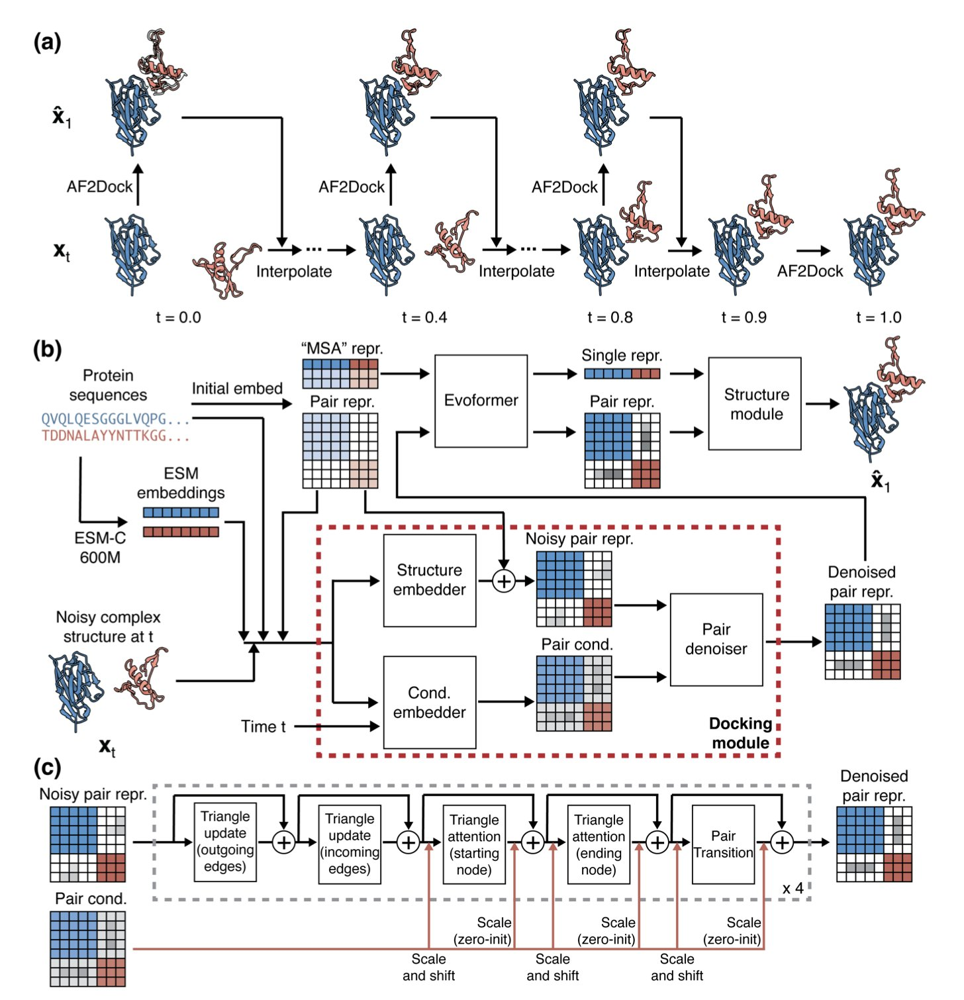
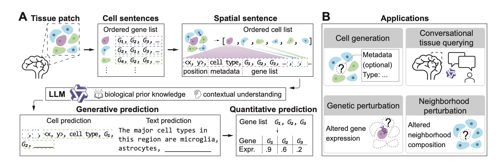
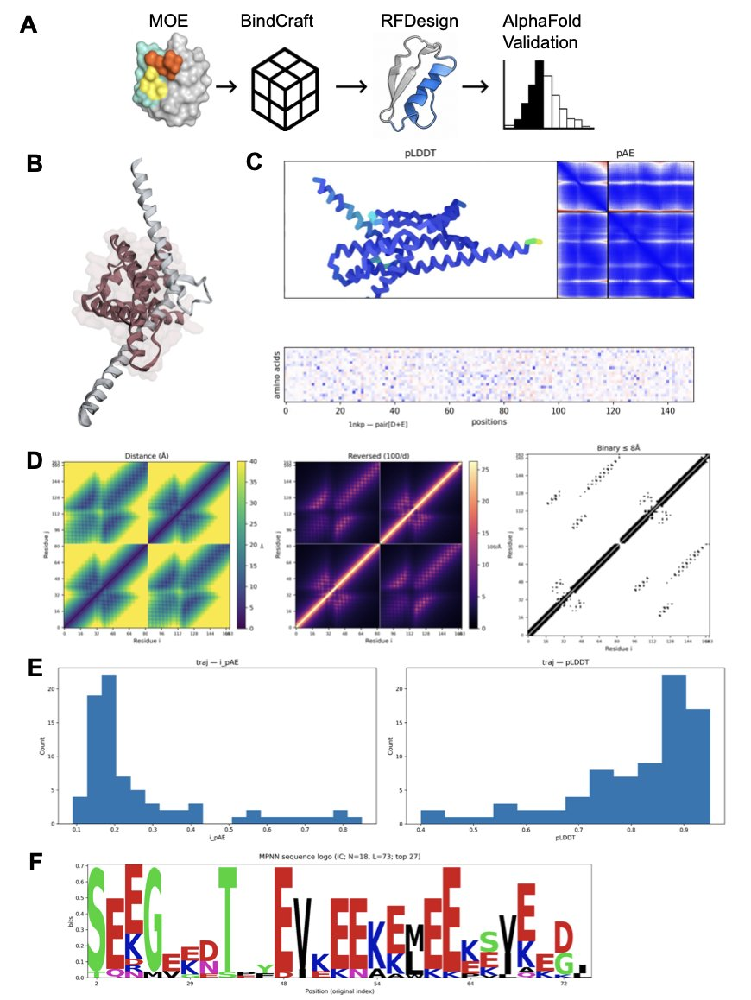
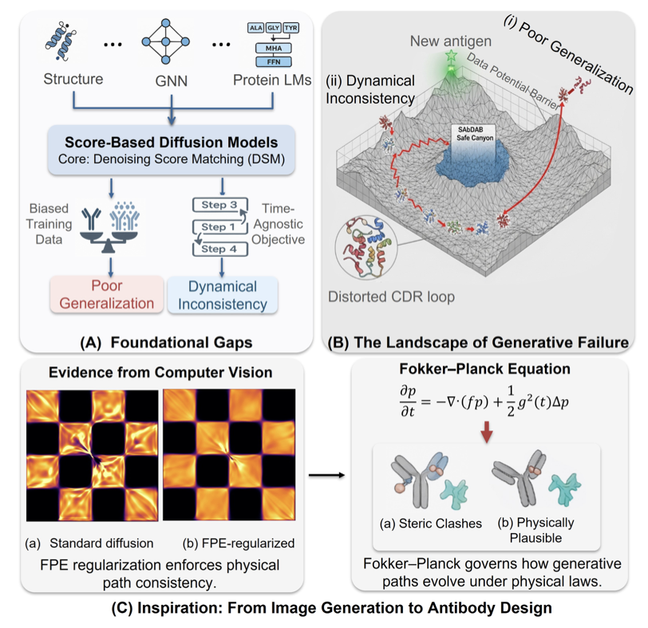
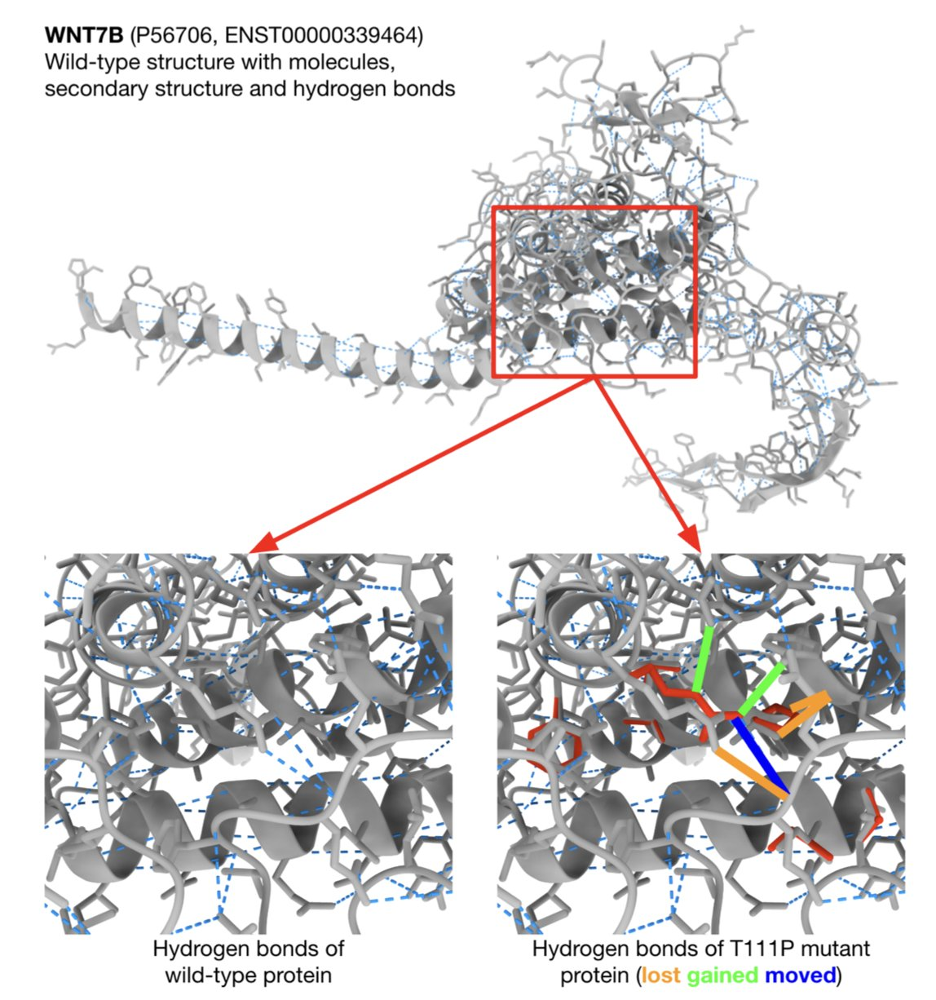

## Table of Contents
1. AF2Dock uses flow matching to turn AlphaFold-Multimer into a docking tool that doesn't need MSAs. It works well on tasks like antibody-antigen docking where co-evolutionary signals are missing, but it could still be better at handling protein flexibility.
2. TissueNarrator converts tissue slices into "spatial sentences," using a Large Language Model (LLM) to simulate how cells behave in their original tissue locations and to perform virtual perturbation analysis.
3. The DesignForge platform opens a new computational path for targeting hard-to-drug cancer targets like KRAS and MYC by designing miniproteins from scratch.
4. FP-AbDiff incorporates the Fokker–Planck equation from physics into a diffusion model to ensure the generation process is dynamically consistent, making de novo antibody design more precise and reliable.
5. The DAVE model combines biophysical features with explainable AI. It can predict if a missense genetic variant is disease-causing and also explain the "why" from a structural level, offering a new way to solve the clinical problem of VUS (Variants of Uncertain Significance).

## 1. AF2Dock: Adapting AlphaFold for Protein Docking with Flow Matching
  
  

AlphaFold 3 is known for co-folding, but structure-based rigid or semi-rigid docking is still essential in drug development. For cases like antibody-antigen complexes, where co-evolutionary relationships are missing and good multiple sequence alignments (MSAs) are unavailable, AlphaFold's co-folding often fails.
  
AF2Dock offers a new approach for this problem: it uses the structural understanding of AlphaFold-Multimer (AF-M) to learn how to fit two pre-folded proteins together.
  
**Modifying AlphaFold: From Folding to Docking**
  
The team kept AF-M's main architecture but replaced its template module with a docking module. They changed the training objective to **Flow Matching**. The model learns to guide two separate protein molecules smoothly from a random distribution to their correct binding pose. This end-to-end training allows AF2Dock to dock crystal or predicted monomer structures directly, bypassing the need for MSAs.
  
**Performance: Specializing in "No-Signal" Targets**
  
In drug discovery, you often only have the unbound (apo) structures of monomers or AI-predicted ones. In these realistic tests (non-holo inputs), AF2Dock outperformed diffusion-based models like DiffDock-PP and DFMDock, and it narrowed the gap with traditional physics-based docking methods. AF2Dock's advantage is particularly clear on **antibody-antigen complex** tasks that lack co-evolutionary signals.
  
**Limitations and Findings**
  
AF2Dock hasn't solved the **induced fit** problem in structural biology. Its success rate drops when the protein binding interface needs significant conformational changes, which is a common issue for rigid or semi-rigid docking models. Also, ablation studies showed that adding embedding features from a protein language model (ESM) sometimes reduced prediction accuracy. This suggests that lean, relevant input features are more important.
  
**Application Advice**
  
AF2Dock isn't meant to replace AlphaFold 3 or AF-M. The data shows a clear **orthogonality** between the correct predictions of AF2Dock and AF-M. When AF-M fails, AF2Dock might succeed. A good strategy is to combine them: use co-folding for targets with strong MSA signals and co-evolution, and use AF2Dock as a complement for cases with sparse MSAs, like antibody design or orphan receptors.
  
📜Title: Adapting Co-Folding Models for Structure-Based Protein-Protein Docking Through Flow Matching  
🌐Paper: <https://www.biorxiv.org/content/10.1101/2025.11.28.691195v1>  
💻Code: <https://github.com/Graylab/AF2Dock>  

## 2. TissueNarrator: Using a Large Language Model to Read the Cellular Landscape
  
  

AI is changing biology, and the TissueNarrator project offers an interesting perspective: think of human tissue as a book and cells as the words inside.
  
**Turning Cells into Sentences**
  
Researchers convert tissue slice data into "spatial sentences." This isn't just a metaphor. The TissueNarrator framework links a cell's spatial coordinates (X, Y position), metadata, and gene expression data into a sequence. It's like telling the model: "At coordinate (10, 20), there is a cell expressing gene A, and next to it is a neighbor expressing gene B."
  
There's a clever trick here: the method uses explicit number tokens for spatial coordinates. Many past models tried to make AI learn the concept of "location" from scratch. But Large Language Models (LLMs) have already seen countless numbers during their text training and have an existing prior for geometric knowledge. Giving them the location directly as numbers activates this built-in ability, helping them better understand spatial information.
  
**From Drawing to Predicting**
  
For drug developers, the most useful feature is "in silico perturbation."
  
To see how surrounding cells react when a gene is knocked out, the traditional way involves raising mice, preparing slices, and sequencing. This process costs time and money. TissueNarrator lets you run this experiment on a computer. You can ask the model: "What happens if I change this cell's gene expression or swap its neighboring cells?"
  
Studies show the model captures complex biological interactions well. It has been validated on various spatial transcriptomics platforms like MERFISH, Perturb-FISH, and CosMx SMI in complex scenarios, including non-neuronal cell interactions and immune-cancer communication.
  
**Analyzing Data Like a Conversation**
  
The paper also demonstrates a conversational tissue query feature. Current bioinformatics analysis usually requires writing code. This framework lets users ask directly: "What is the tissue structure here?" The model provides an answer based on the biological context it generates, combining data-driven modeling with a user-friendly way to explore.
  
**Future Potential**
  
This is a flexible framework that can generate cells and perform neighborhood and gene perturbation analyses. The researchers believe that as model capacity and dataset diversity grow, TissueNarrator could unlock more advanced reasoning abilities. Although it currently depends on the scale of available data, this approach of turning biological questions into language problems offers a clear new path for computational drug discovery.
  
📜Title: TissueNarrator: Generative Modeling of Spatial Transcriptomics with Large Language Models  
🌐Paper: <https://www.biorxiv.org/content/10.1101/2025.11.24.690325v1>  
💻Code: <https://github.com/Steven51516/tissuenarrator>  

## 3. AI-Powered Protein Design to Tackle "Undruggable" Targets
  
  

In drug development, some protein targets are like smooth glass spheres. They have flat, featureless surfaces, so small-molecule drugs can't find a clear "pocket" to bind to. The key cancer proteins MYC and KRAS are prime examples. Their disease-causing function relies on Protein-Protein Interactions (PPIs), and the interface for these interactions is large and flat.
  
Traditional small molecules struggle to effectively block two proteins from binding in such an open area. Antibody drugs can cover large surfaces, but they are too big to get inside cells to reach MYC or KRAS. For decades, these targets have been labeled "undruggable."
  
The `DesignForge` framework offers a new idea: designing specialized tools from scratch (de novo). These tools are called miniproteins. They are smaller than antibodies, so they might be able to enter cells. And they are larger than small molecules, big enough to cover the protein interaction interface.
  
#### The `DesignForge` Workflow
  
The platform's workflow is like a smart production line with a few key steps:
  
First, generate a backbone. The platform uses a deep learning model to build a new, complementary protein backbone directly on the target protein's interface. This is like an architect designing a new house based on the shape of the land.
  
Second, optimize the sequence. Once the backbone is designed, the platform computationally fills it with the best amino acid sequence to ensure it folds stably into the intended shape.
  
Third, target "hotspots." On a protein interaction interface, usually just a few key amino acid residues ("hotspots") contribute most of the binding energy. `DesignForge` uses energy calculations to make sure the designed miniprotein grabs onto these hotspots, like targeting an enemy's command center for maximum effect.
  
Fourth, use AlphaFold2 for a "quality check." After the design is complete, the platform inputs the designed miniprotein sequence and the target sequence into AlphaFold2. If the predicted complex structure from this tool closely matches the original design, it's like an independent expert has verified the design's feasibility, increasing its credibility.
  
#### Proof of Concept: Targeting Three Classic Targets
  
To validate the method, the researchers chose three challenging targets:
1.  **PD-1**: A well-known immune checkpoint. Designing a miniprotein that mimics its natural ligand, PD-L1, could lead to new therapeutic molecules for immuno-oncology.
2.  **MYC/MAX**: A notorious cancer-causing transcription factor pair. MYC must form a dimer with MAX to function. A miniprotein designed to fit between them could break up this cancer-causing alliance.
3.  **KRAS**: Another major "undruggable" target. While inhibitors for specific mutations (like G12C) have been a breakthrough, developing drugs that can broadly target KRAS protein interactions remains a huge challenge.
  
The results showed that `DesignForge` generated a series of high-confidence miniprotein designs for all three targets. These designs showed good structural stability and precise targeting of key hotspots in simulations.
  
The value of this work is that it provides a systematic and repeatable solution. It uses rational computational design to shorten the discovery cycle from target to candidate molecule. These computer-generated designs still need to be validated with biological experiments to test their activity, affinity, and ability to enter cells. But `DesignForge` has already provided a new set of tools for tackling "undruggable" targets.
  
📜Title: De novo protein design enables targeting of intractable oncogenic interfaces  
🌐Paper: https://www.biorxiv.org/content/10.1101/2025.10.22.683953v1  

## 4. FP-AbDiff: Boosting Antibody Design Accuracy by 25% with Physics
  
  

A common problem when designing antibodies with AI is that the generated local structures might look reasonable, but the overall combination lacks physical realism.
  
FP-AbDiff offers a solution. Protein folding and conformational changes follow physical processes. The researchers integrated the physical laws describing these processes directly into their model to make its learning more aligned with physical reality.
  
They applied the Fokker–Planck equation. This equation acts like a "navigation system," describing how amino acid residues move from a highly disordered, noisy state to a stable, ordered, and correct antibody structure. Traditional diffusion models tend to accumulate errors at each denoising step, causing the final result to deviate from the true conformation.
  
FP-AbDiff uses the residual of the Fokker–Planck Equation (FPE) as a loss function, minimizing this residual at every step of model training. This adds a physical constraint to the entire generation process, forcing the model to learn a denoising path that follows physical laws. The model therefore learns a globally coherent and dynamically consistent generation trajectory.
  
Technically, the researchers defined the FPE residual loss on a mixed manifold of CDR geometries, R³×SO(3). This considers both the translation of amino acid 3D coordinates (R³) and the rotation of their orientation (SO(3)), which matches the physical degrees of freedom of protein structures.
  
On the most challenging task of de novo CDRH3 loop design, FP-AbDiff achieved an RMSD of 0.99 Å. This means the average backbone deviation between the generated structures and the real ones was less than 1 angstrom, a 25% improvement over the previous state-of-the-art model. In the more complex task of co-designing all six CDR loops, its full-chain RMSD was reduced by about 15%. The data shows that adding physical constraints led to a significant leap in design accuracy.
  
Ablation studies confirmed that removing the FPE regularization term caused performance to drop, proving that the improvement came from applying the FPE.
  
The core value of FP-AbDiff is that it pulls AI design back into the framework of physical reality. This "correct-by-construction" approach makes AI-designed antibodies more reliable in both sequence and structure, and it provides a tool for designing more functionally complex molecules in the future.
  
📜Title: FP-AbDiff: Improving Score-based Antibody Design by Capturing Nonequilibrium Dynamics through the Underlying Fokker–Planck Equation  
🌐Paper: https://arxiv.org/abs/2511.03113v1  

## 5. DAVE: Using Explainable AI to Unbox Genetic Variants
  
  

One of the biggest challenges in genetic diagnostics is dealing with "Variants of Uncertain Significance" (VUS). It's like finding a typo in an airplane maintenance manual: you don't know if it will cause the engine to fail mid-air or if it's just a harmless printing error.
  
A new AI tool, DAVE, tackles this problem by using **Explainable AI** and **functional protein modeling**.
  
**From 'Guessing' to 'Reasoning'**
  
Existing prediction tools like CADD or REVEL are mostly based on sequence conservation—if an amino acid is preserved across species through evolution, changing it is probably a bad thing. This is a statistical guess.
  
DAVE takes a "structural biology" approach. It integrates 12 biophysics-based features, using tools like P2Rank, FoldX, and GeoNet to calculate changes in stability, hydrophobicity, electrostatic potential, and intermolecular interactions at the variant's location.
  
DAVE directly simulates the physical world: it calculates whether swapping an alanine for a tryptophan would cause the protein structure to collapse due to steric hindrance or disrupt the charge balance.
  
**Opening the AI Black Box**
  
DAVE uses SHAP values (a game theory method) to explain its output, making the model "speak human." It can tell a clinician that a variant was classified as pathogenic mainly because of a drastic shift in **ΔΔG (change in folding free energy)** or because it broke a key hydrogen bond network.
  
For example, with the T111P variant in the WNT7B gene, DAVE gives a high pathogenicity score and clearly states why: the mutation significantly alters folding energy and causes a loss of hydrogen bonds. This gives a precise direction for follow-up functional experiments, allowing researchers to directly test protein stability.
  
**Performance and Limitations**
  
The researchers trained the model on cleaned Dutch diagnostic data, achieving a ROC AUC of 86% on the test set. When processing VUS, DAVE successfully reclassified some variants, and the results matched later, more detailed analyses by expert panels, showing its potential to aid clinical decisions.
  
The tool isn't perfect. **Computational cost is a major drawback**.
  
Traditional sequence-based predictors are very fast because they just process strings. DAVE needs to run FoldX for structural modeling, which consumes significant computing power and time. The current version is difficult to integrate directly into routine hospital pipelines that process thousands of variants daily.
  
Future work must improve computational efficiency while retaining the advantage of "understanding the why." DAVE represents the right direction: in AI drug discovery and diagnostics, we need intelligent assistants that can discuss mechanisms, not just black boxes that give a score.
  
📜Title: DAVE: How to Use Explainable AI to Interpret Missense Variants for Genome Diagnostics Based on Functional Protein Modeling  
🌐Paper: <https://doi.org/10.1101/2025.11.25.25340947>
