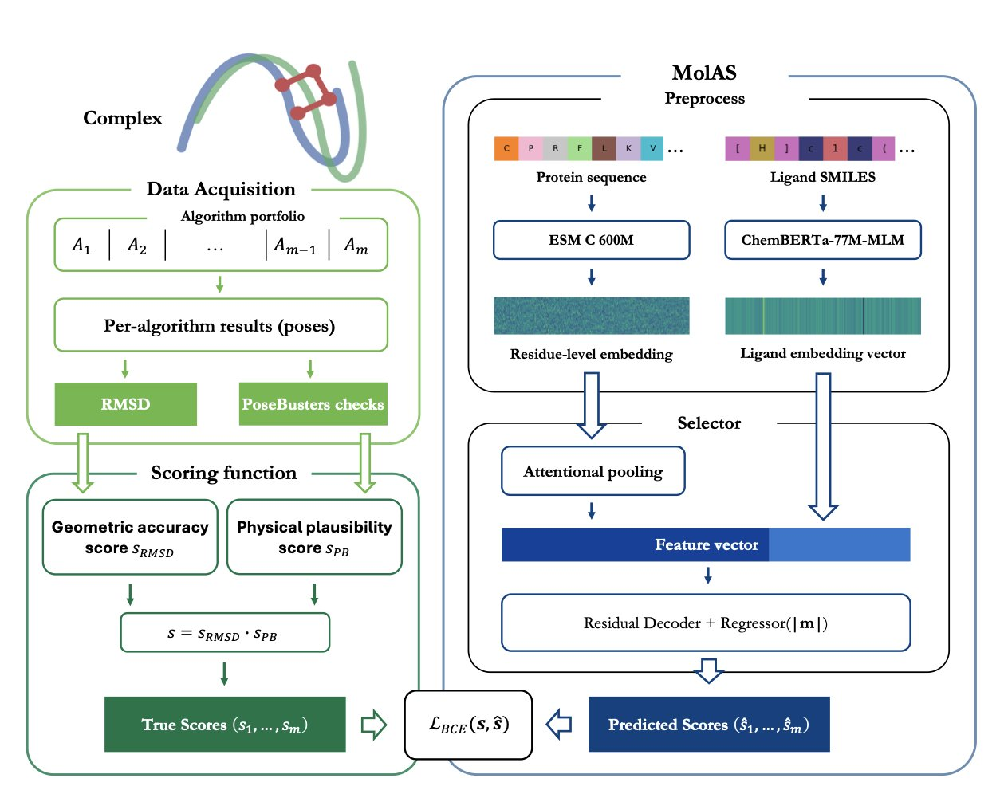
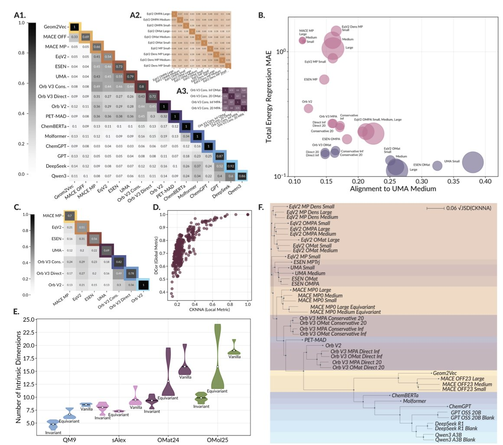
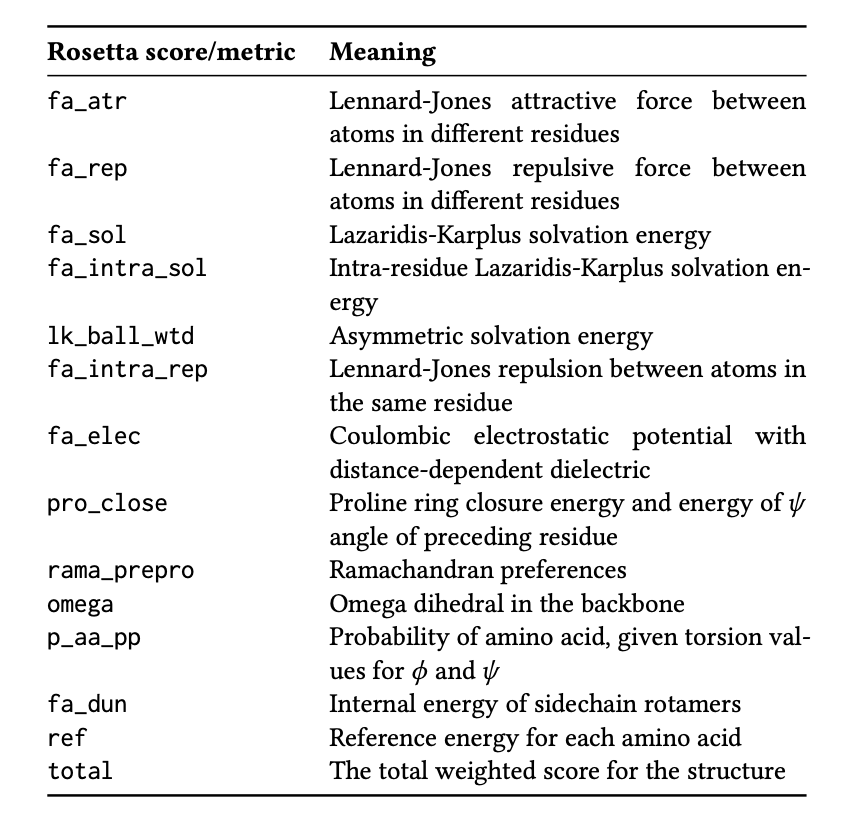
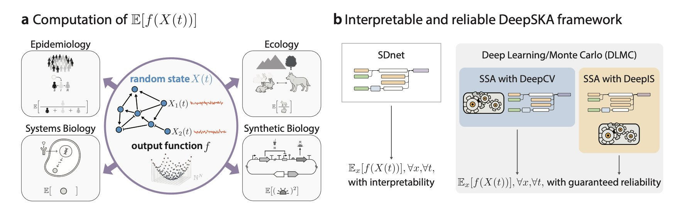
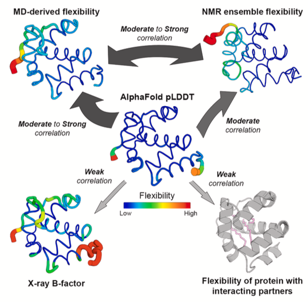

### 目录  
1. MolAS 用分子特征预测最佳对接算法，提升了准确率，但它也揭示了对接流程本身的不稳定性，才是更大的挑战。
2. 顶尖的科学 AI 模型，无论架构和训练数据有何不同，都在趋同，学习用一套相似的内部「语言」来描述物质世界。这背后可能隐藏着一种更普适的物理化学规律表示方法。
3. PRIMRose 模型利用深度学习，高效预测双 InDel 突变对每个氨基酸的能量影响，为理解蛋白质功能提供了高分辨率视角。
4. DeepSKA 框架融合了深度学习的速度与随机反应网络的数学严谨性，让复杂生物系统的模拟更快、更准、且过程透明。
5. AlphaFold 的 pLDDT 分数能大致反映蛋白的内在柔性，但无法捕捉由药物等分子诱导的构象变化，这对药物研发是一个关键盲区。

## 1. AI 选对接算法，准确率提升 15%，但有个前提  
  
  

药物研发离不开分子对接。选择 Glide、AutoDock Vina 还是 GOLD，往往依赖于研究者的习惯。但没有一种算法能适用于所有情况。  
  
一项研究开发了 MolAS 系统来解决这个选择问题。MolAS 如同一个项目主管，它不直接执行对接，而是先分析蛋白质和配体的分子特征，然后为其匹配最合适的对接算法，例如为某个任务选择 Vina，为另一个选择 Glide。  
  
该系统设计轻量。它直接使用预训练好的蛋白质和配体「分子嵌入」（molecular embeddings）。这些「嵌入」可以理解为分子的数字化指纹，包含了结构和化学信息。MolAS 将这些指纹输入一个简单模型，就能快速预测出哪种对接算法胜算最大。  
  
与单一最佳算法（Single-Best Solver, SBS）相比，MolAS 能将对接准确率绝对提升最多 15%。在理想情况下，即每次都知道最佳算法（Virtual Best Solver, VBS），MolAS 能将现实（SBS）与理想（VBS）间的差距缩小 17% 到 66%。  
  
这项研究也揭示了一个更深层的问题：继续提升 AI 模型的复杂度，并不能系统性地改善结果。真正的瓶颈在于对接流程（docking protocol）本身的脆弱性。  
  
研究者常会发现，微调对接盒子的大小或更换打分函数版本，就可能彻底改变不同算法的性能排名。当对接流程稳定一致时，MolAS 表现出色，因为算法的性能是可预测的。一旦流程改变，引起算法性能排名的剧烈波动（论文中称为「protocol-induced hierarchy shifts」），MolAS 的预测就会失效。  
  
这好比预测赛跑冠军。如果所有选手状态稳定、赛道标准，基于过往成绩的预测会很准。但如果赛道在晴天、雨天和泥地间切换，原有的预测模型就失去了意义。对接流程就是这里的「赛道状况」。  
  
因此，这项工作提供了一个可以直接使用的工具：只要内部对接流程标准化，MolAS 就能提升效率。更重要的是，它提供了一种诊断思路：它用数据证明，计算辅助药物发现的瓶颈，或许在于底层模拟方法的稳健性和可重复性，而非 AI 模型本身。  
  
未来的研究方向是，与其在模型架构上竞争，不如先巩固基础，建立更稳定、可靠的对接工作流。只有当「赛道」标准化，MolAS 这类预测工具才能发挥最大价值。  
  
📜Title: Molecular Embedding–Based Algorithm Selection in Protein–Ligand Docking  
🌐Paper: <https://arxiv.org/abs/2512.02328v1>  

## 2. 科学大模型的「集体智慧」：它们都在学习同一套物理规则  
  
  

在计算辅助药物发现（CADD）领域，我们总在比较各种模型：图神经网络（GNNs）、Transformer、3D 模型，争论哪种架构能更好地「理解」化学。MIT 的一项新研究提供了一个新视角，直接探究这些模型的内部运作，好比掀开它们的「头盖骨」一探究竟。  
  
结果出人意料。  
  
研究者分析了近 60 个主流的科学基础模型。这些模型的输入五花八门：有的读取 SMILES 字符串，有的将分子看作图，还有的直接处理分子的三维结构。按理说，它们内部处理信息的方式（即「表征」）应该千差万别。  
  
研究者通过典型相关分析 (Canonical Correlation Analysis, CCA) 发现，这些模型的内部表征高度一致。好比让一群来自不同国家、说不同语言的工程师独立设计一座桥，最终他们拿出的核心力学蓝图都遵循了相同的物理原理。这些 AI 模型，无论起点如何，都在殊途同归，收敛到了对物理世界相似的「理解」上。  
  
这种「英雄所见略同」的现象和模型性能直接相关。两个表现优异的模型，其内部表征几乎可以相互替换。而一个表现差的模型，它的「想法」就和所有人都格格不入。  
  
这对一线研发人员有几点启发。  
  
第一，模型架构的选择或许没那么关键。关键在于模型本身要足够强大，能学习到这套「通用的化学语言」。评估新模型时，除了测试准确率，还可以增加一个标准：其内部表征与顶尖模型的「对齐」程度。如果一个新模型能快速学会这套「通用语言」，就说明它抓住了问题本质。  
  
第二，研究也暴露了所有模型共同的「阿喀琉斯之踵」。当面对一个它们从未见过的全新分子（即「域外」数据）时，所有模型基本都会「投降」，给出一个模糊、低信息量的表征，相当于在说「我不知道这是什么」。  
  
这在药物研发领域是个大问题，因为我们的目标就是创造全新的、自然界不存在的分子。这说明当前 AI 的瓶颈是训练数据。模型们没见过足够多、足够奇特的分子，它们的「想象力」被数据限制住了。  
  
未来，或许能开发出更通用的科学大模型，同时理解小分子、蛋白质和新材料。一个模型能无缝地理解药物小分子和它的靶点蛋白，甚至还能预测它们结合后对材料性质的影响，这将彻底改变我们设计药物和材料的方式。  
  
📜Title: Universally Converging Representations of Matter Across Scientific Foundation Models  
🌐Paper: <https://arxiv.org/abs/2512.03750v1>  

## 3. AI 新工具 PRIMRose: 逐氨基酸破解 InDel 突变奥秘  
  
  

蛋白质工程与药物研发常涉及氨基酸的插入或删除 (InDel)。评估这类微小改动对整个蛋白质的影响至关重要。传统的 Rosetta 分子模拟软件虽然可靠，但速度慢，且通常只提供一个总能量变化值 (ΔΔG)，表明蛋白质整体稳定性的增减。  
  
这个总分如同诊断报告只说「情况不佳」，却未指明具体问题。研发人员需要了解更多细节：突变如何影响蛋白质的不同区域？哪个氨基酸残基承受的压力最大？哪个区域的结构发生了改变？  
  
PRIMRose 模型为此而生。它提供了一份详尽到每个氨基酸残基的「能量报告」，超越了单一的总分评估。  
  
**工作原理**  
  
PRIMRose 使用卷积神经网络 (Convolutional Neural Network, CNN)。这个模型的工作方式类似图像识别，但它分析的不是图片，而是蛋白质序列和突变信息。研究团队利用一个包含九种蛋白质、数十万个双 InDel 突变的数据集对模型进行训练，使其学会识别突变模式与氨基酸残基能量变化间的复杂关系。  
  
训练数据源自 Rosetta 的计算结果。这好比让一个学生 (PRIMRose) 学习一位资深教授 (Rosetta) 的知识，学成后，学生的解题速度远超教授。  
  
**高分辨率视角**  
  
PRIMRose 的核心价值是其「逐残基 (per-residue)」分析。它输出的是一张能量图谱，而非单一数值。通过这张图谱，可以看到一个 InDel 突变如何导致附近残基的能量不稳定，甚至影响到三维结构中空间距离近但序列位置远的残基。  
  
这张图谱让我们能够精确识别蛋白质的「结构弱点」，从而在设计突变时规避风险。分析致病突变时，它也能揭示关键功能域的能量平衡是如何被破坏的。  
  
**兼具速度与可解释性**  
  
Rosetta 计算一个复杂突变需要数小时或更长时间。PRIMRose 经过 1 到 6 小时初始训练后，预测新突变几乎是即时的。这种效率提升支持了大规模虚拟筛选，能在几分钟内评估成千上万种突变设计的影响。  
  
模型的预测结果与蛋白质的物理化学性质高度相关。例如，模型对暴露在溶剂中的表面残基和深埋于核心的残基采用了不同的预测模式。这表明 PRIMRose 学习到了关于蛋白质二级结构和溶剂可及性的物理规律，增强了其预测结果的可解释性和可信度。  
  
PRIMRose 并非要取代 Rosetta，而是一个高效的初筛工具。可以用它快速扫描大量突变，筛选出有潜力的候选者，再交由 Rosetta 进行精细验证。这是一种更高效的研究策略。  
  
📜Title: Primrose: Insights into the Per-Residue Energy Metrics of Proteins with Double InDel Mutations Using Deep Learning  
🌐Paper: https://arxiv.org/abs/2512.06496  

## 4. AI 加速化学反应模拟，结果可靠且可解释  
  
  

在药物研发和系统生物学中，我们常需处理随机过程，例如细胞内蛋白的表达量波动，或药物分子与靶点的结合解离。描述这些过程需要用到随机反应网络（Stochastic Reaction Networks, SRNs）。  
  
传统的蒙特卡洛（Monte Carlo）模拟方法虽然准确，但计算量巨大。如同通过投掷飞镖来估算靶心面积，要获得高精度结果，需要进行海量重复计算。这在药物筛选或模型优化等需要大量迭代的场景中，是一个严重瓶颈。  
  
DeepSKA 框架采用了一种新颖的思路，它将深度学习模型与传统模拟结合，发挥了二者的优势。  
  
框架的第一个核心组件是基于谱分解的网络（Spectral Decomposition-based network, SDnet）。SDnet 的设计使其预测结果可解释，它的结构直接反映了系统本身的数学性质——谱分解。这好比分析交响乐，我们可以一遍遍完整地听（蛮力模拟），也可以直接阅读乐谱，理解主旋律与和声结构（谱分解）。SDnet 学习的是系统内在的「衰减模式」（decay modes），即系统从一个状态恢复到平衡的几种基本方式。由于网络结构与数学原理直接关联，我们能够理解其预测的物理意义。  
  
第二个组件是深度学习/蒙特卡洛（Deep Learning/Monte Carlo, DLMC）估算器，它是提升效率的关键。传统蒙特卡洛模拟之所以慢，是因为其结果方差大。DLMC 将 SDnet 快速给出的近似解作为一个「控制变量」（control variate）。这相当于为蒙特卡洛模拟提供了一个智能向导，在其「盲目投掷飞镖」时，指明靶心的大致位置。如此一来，模拟过程中的随机误差被削减，收敛速度提升了几个数量级，同时结果依然保持了蒙特卡洛方法的无偏性。  
  
研究者在九个不同的随机反应网络上测试了 DeepSKA，其中包含复杂的非线性和非质量作用模型，物种数量最多达到十个。测试结果表明，该框架的预测精度与泛化能力出色，即使预测时间超出了训练数据范围，表现依然稳健。  
  
除了系统的瞬时动态，其长期的稳态（steady-state）行为往往更有意义。DeepSKA 提供了计算稳态均值和方差的工具，如 EM with DeepCV 和 DeepIPA 算法，这让它在实际应用中价值更高。  
  
在药物发现中，它能更高效地模拟药物与靶点结合的随机动力学，或预测信号通路的长期响应。在合成生物学中，它可以帮助设计更稳定、可预测的基因回路。通过结合 AI 的计算效率与物理化学原理，它让我们在探索复杂系统时，既能加快步伐，又能做到心中有数。  
  
📜Title: Interpretable Neural Approximation of Stochastic Reaction Dynamics with Guaranteed Reliability  
🌐Paper: https://arxiv.org/abs/2512.06294v1  

## 5. AlphaFold pLDDT：蛋白柔性的可靠指标吗？  
  
  

AlphaFold 预测的蛋白结构图中，蓝色区域 pLDDT 分数高，黄、红色区域分数低。很多人直觉地认为，低 pLDDT 就代表了蛋白的柔性区域。这个普遍的看法准确吗？尤其在药物发现中，药物分子与柔性蛋白口袋的相互作用至关重要。  
  
Vander Meersche 团队系统地验证了这一假设。他们将 AlphaFold 的 pLDDT 分数，与衡量蛋白柔性的两个「金标准」——分子动力学 (Molecular Dynamics, MD) 模拟和核磁共振 (Nuclear Magnetic Resonance, NMR)——进行了直接比较。  
  
结果显示，pLDDT 在一定程度上确实与蛋白柔性相关。pLDDT 分数低的区域，在 MD 模拟中通常也表现出更大的移动幅度（以 RMSF 值衡量）。因此，将 pLDDT 作为蛋白「内在」柔性的粗略参考是可行的。它甚至比晶体结构中的 B-factor 更能反映蛋白自身的动态特性，因为 B-factor 会受到晶体堆积等人为因素的干扰。  
  
然而，在药物研发领域，问题更为复杂。细胞中的蛋白并非孤立存在，它们与药物等各种分子相互作用，这些相互作用会改变蛋白的局部构象和柔性。一个原本灵活的环区（loop），在结合小分子药物后，可能会被「锁定」在特定构象上。这种「诱导契合」是药物设计的关键。  
  
研究发现，AlphaFold 在这方面存在盲区。  
  
AlphaFold 预测的是蛋白的单一状态，它无法预知配体的存在。因此，即使某个环区在结合药物后会变得稳定，AlphaFold 仍会因多序列比对中缺乏稳定模板，而给出低 pLDDT 分数，表示其预测置信度低。  
  
研究者通过 MD 模拟证明了这一点。模拟单个蛋白时，某个区域表现出高柔性。当把该蛋白的结合伴侣（如另一个蛋白或配体）加入模拟体系后，同一区域的柔性立即降低。而 AlphaFold 的 pLDDT 分数对结合伴侣的存在与否毫无反应，预测结果保持不变。  
  
pLDDT 反映的是模型对其预测静态结构的置信度，这与蛋白在特定生物环境下的动态柔性，是两个不同的概念。  
  
最新的 AlphaFold 3 是否解决了这个问题？该研究也进行了测试，答案是没有。AlphaFold 3 在反映结合诱导的柔性变化方面，与 AlphaFold 2 相比没有本质提升。  
  
那么，pLDDT 该如何使用？它可以作为一个起点，快速识别蛋白在「apo」状态（未结合任何配体）下的潜在柔性区域。但当研究涉及药物结合对蛋白构象的影响，或设计需要构象变化的变构抑制剂时，pLDDT 不再适用。此时，MD 模拟、NMR 或其他实验方法才是可靠的选择。  
  
📜Title: Structure Flexibility or Uncertainty? A Critical Assessment of AlphaFold 2 pLDDT  
🌐Paper: https://www.cell.com/structure/abstract/S0969-2126(25)00344-2
