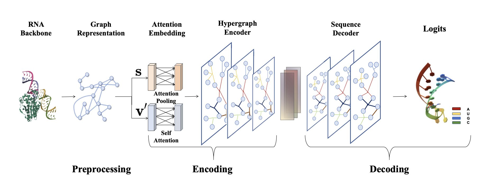
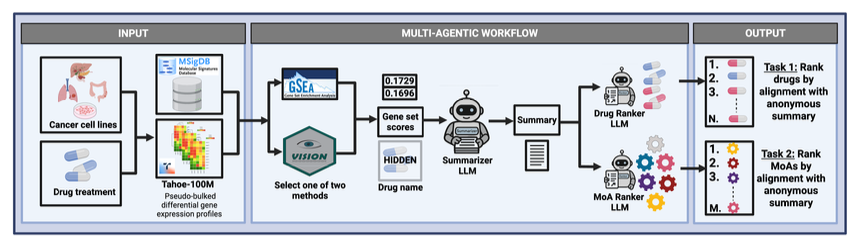
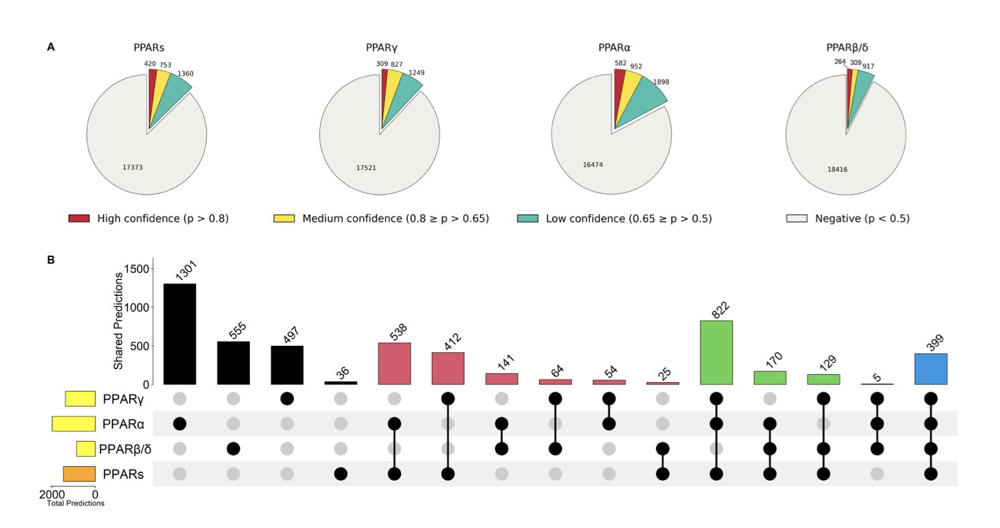
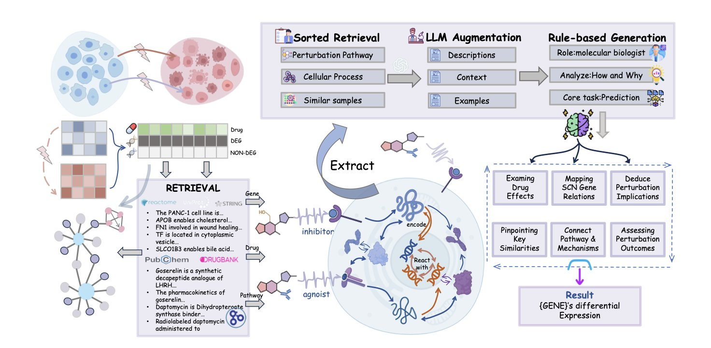
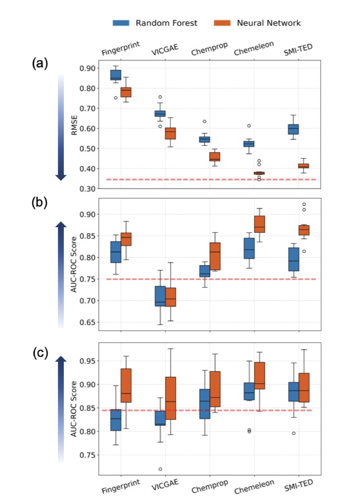

### Table of Contents  
1. The HyperRNA framework uses hypergraphs to capture complex internal interactions in RNA, offering a more precise solution to the 3D RNA inverse folding problem.
2. SigSpace is a large language model-based agent that automatically summarizes complex drug transcriptomic data into human-readable mechanism-of-action summaries, providing a new tool for drug discovery.
3. PPARgene 2.0 combines large language models and multi-omics data to provide a more accurate and practical tool for efficiently screening and predicting PPAR target genes.
4. VCWorld combines biological knowledge graphs with large language models to build a transparent "white-box" simulator that accurately predicts cellular responses to drug perturbations, even with scarce data, and provides mechanistic explanations.
5. Molecular foundation models can efficiently predict the self-assembly behavior of complex aqueous mixtures and generalize to unknown molecules, opening new shortcuts for materials discovery.

## 1. AI for RNA Design: Hypergraph Model Solves the 3D Inverse Folding Problem  
  
  

In RNA drug and engineering fields, a central challenge is this: given a target 3D structure, how do you design an RNA sequence that folds into it? This is called RNA inverse folding. Solving it means we can create custom RNA molecules on demand. The HyperRNA framework offers a new way to do this.  
  
When Graph Neural Networks (GNNs) process molecular structures, they usually simplify the interactions between nucleotides into pairwise connections, like a social network showing only direct relationships between two people. But RNA's 3D structure is far more complex. Multiple nucleotides often form local "groups" in space that act together. Traditional graph methods struggle to capture these many-body relationships.  
  
HyperRNA's key breakthrough is the introduction of the "hypergraph." In a traditional graph, an edge is a line connecting two points. In a hypergraph, a "hyperedge" is like a net that can connect three or more points at once. By describing an RNA structure with a hypergraph, the model can directly learn the complex spatial relationships formed by multiple nucleotides. This is closer to biophysical reality than simple pairwise matching.  
  
Here's how HyperRNA works:  
1.  **Build the hypergraph**: The model reads the backbone coordinates of an RNA molecule and groups spatially close nucleotides into a single hyperedge. This builds a hypergraph that reflects higher-order dependencies.  
2.  **Encode the structure**: An attention-based encoder analyzes this hypergraph to learn the key interactions. Ablation studies showed that considering both distance (scalar features) and direction (vector features) is crucial for success. It's not enough to know how far apart the groups are; their relative orientation also determines the structure.  
3.  **Generate the sequence**: Based on the learned structural information, a decoder autoregressively generates the most likely nucleotide bases (A, U, C, G) one by one. The process is like an AI writing a sentence, generating the next word based on the previous ones to ensure the sequence is coherent and accurate.  
  
Tests on two public datasets, PDBBind and RNAsolo, showed that HyperRNA outperforms existing methods in both sequence recovery rate and structural accuracy. It not only reconstructs the original sequences more accurately, but the sequences it generates are also more likely to fold into the target structure.  
  
HyperRNA shows the potential of hypergraphs in biomolecular modeling. For a complex system like RNA, choosing a data structure that properly describes the problem's nature is more effective than just stacking more model layers. This approach could also be applied to protein design or other drug discovery tasks.  
  
📜Title: Harnessing Hypergraphs in Geometric Deep Learning for 3D RNA Inverse Folding  
🌐Paper: <https://arxiv.org/abs/2512.03592v1>  

## 2. AI Interprets Drug Responses: SigSpace Uses a Large Model to Decipher Gene Signals  
  
  

In drug development, a common practice is to treat cancer cells with small molecules and then use sequencing to see which of the tens of thousands of genes are up- or down-regulated. This data forms a huge numerical table, known as a transcriptional response signature. Interpreting this table to figure out what the drug is actually doing is a major bottleneck in research. It’s like trying to decipher a codebook and find the main storyline.  
  
Researchers developed an agent system called SigSpace to tackle this problem. It acts like a professional "biology code translator."  
  
Here's how the system works: It connects to the Tahoe-100M database, which contains one million transcriptomic profiles. When you input a new drug's gene expression signature, SigSpace's tools run calculations, like using Gene Set Enrichment Analysis (GSEA) to identify known biological pathways that were activated or suppressed.  
  
Next, the system feeds the list of enriched pathways and other results to a Large Language Model (LLM). The LLM then acts like an experienced biologist, connecting these clues to write a fluent summary explaining the drug's potential Mechanism of Action (MoA). For example: "This drug may act by inhibiting DNA repair pathways, as several gene sets related to the DNA damage response were significantly activated."  
  
To check the system's performance, the researchers designed a test. They had SigSpace generate summaries while hiding the drug names and MoAs. Then, they tested whether they could accurately match the "blinded" summary back to the original drug or MoA from a list of options. The LLM-generated summaries had a match accuracy far better than random guessing, showing that it successfully captured the key biological information in the gene expression signatures.  
  
The study also found that the choice of LLM or gene feature calculation method (like GSEA scores versus Vision scores) made a big difference. GSEA scores were better at matching specific drugs, while Vision scores did better at matching MoA categories. This shows it's important to select and tune the right models and algorithms for a specific task; AI is not a plug-and-play tool.  
  
SigSpace performed well on drugs with well-defined mechanisms, such as DNA synthesis inhibitors or microtubule disruptors. These drugs tend to cause strong and distinct gene expression changes that are easy for the model to pick up on.  
  
The real test will be how SigSpace handles compounds with completely new mechanisms of action. Will it propose insightful new hypotheses, or will it just confidently generate nonsense? The answer will determine whether it can move from being a research project to a practical tool that truly aids new drug discovery.  
  
Future work for the system includes improving summary accuracy, exploring different data input formats, and applying it to a wider range of datasets. It has the potential to become a powerful assistant for scientists, freeing them from tedious data interpretation and speeding up hypothesis generation and experimental validation.  
  
📜Title: SigSpace: An LLM-based Agent for Drug Response Signature Interpretation  
🌐Paper: https://www.biorxiv.org/content/10.64898/2025.12.02.691945v1  

## 3. Upgrading PPAR Target Prediction: A Team-Up of Large Models and Multi-Omics  
  
  

When targeting the nuclear receptor PPAR (Peroxisome Proliferator-Activated Receptor) in drug development, a core question is which downstream genes the drug actually regulates. Answering this is key to understanding the drug's mechanism and potential off-target effects. Traditional methods rely on time-consuming literature mining and high-throughput experiments. PPARgene 2.0 offers a more efficient solution.  
  
#### Making Large Models Do the "Grunt Work" of Literature Review  
  
Early in a project, researchers have to sift through massive amounts of literature to find evidence linking targets to genes. It's an important but tedious job. PPARgene 2.0 uses a two-step method to automate this process.  
  
First, it uses Bioformer, a model specifically trained on biomedical texts, for a rough screening—like a junior researcher quickly filtering relevant papers. Then, it uses GPT-4 for a detailed screening to determine if a paper contains direct experimental evidence of a PPAR target gene.  
  
This "AI teaching assistant" workflow significantly reduced the number of papers that needed manual review. It helped add 112 new genes to the database, bringing the total to 337 and improving data collection efficiency.  
  
#### Upgrading the Prediction Model: From "Guessing" to "Seeing"  
  
Older prediction models relied mostly on gene expression data, for example, by looking at gene expression changes caused by a PPAR agonist. This method can't distinguish between direct and indirect effects, so it isn't very precise.  
  
PPARgene 2.0's model introduces two more dimensions of evidence to make predictions more reliable.  
  
1.  **ChIP-seq data**: This technique can determine if the PPAR protein binds directly to a specific gene's DNA region. It's like forensic "fingerprint evidence," proving the protein was at the "scene."  
2.  **PPRE motif analysis**: The PPAR protein recognizes a specific DNA sequence called a PPRE when it binds. Analyzing the genome for this "parking spot" provides supporting evidence from the sequence level.  
  
By combining these three types of evidence—gene expression, protein binding, and sequence features—the prediction accuracy improved dramatically. This is like solving a crime. You don't just see the suspect (the gene) near the scene at the time of the crime (expression change); you also find their fingerprints (ChIP-seq) and confirm they had the means to do it (PPRE sequence). The conclusion becomes much stronger.  
  
#### "Custom-Built" Models for Different Subtypes  
  
The PPAR family has three main subtypes: α, β/δ, and γ. They are found in different tissues and have very different functions. For example, PPARα is mainly in the liver and is the target for "fibrate" drugs that lower lipids. PPARγ is highly expressed in fat tissue and is the target for "glitazone" drugs that lower blood sugar.  
  
Because drug development often aims for selectivity for a specific subtype, a general "pan-PPAR model" has limited use. A key update in PPARgene 2.0 is that it built separate prediction models for each of these three subtypes.  
  
When developing a highly selective PPARα agonist, a researcher can directly use the PPARα-specific model to predict its downstream pathways. The data shows that the PPARα model performs the best, which makes sense as this subtype has the most research data available.  
  
PPARgene 2.0 provides a set of analytical tools tailored to the needs of drug development. It can help researchers form hypotheses faster and design validation experiments, speeding up the creation of new medicines.  
  
📜Title: PPARgene 2.0: Leveraging Large Language Models and Multi-Oomics Data for Enhanced Identification and Prediction of PPAR Target Genes  
🌐Paper: https://www.biorxiv.org/content/10.64898/2025.12.01.691485v1  

## 4. VCWorld: Building an Explainable 'White-Box' Virtual Cell with a Large Model  
  
  

In computational biology and drug discovery, we often face a choice: simple linear models are easy to explain but not very accurate, while deep learning "black-box" models are accurate but can't explain their reasoning. For drug developers, if you can't understand the "why," it's hard to optimize a molecule's structure or design experiments to verify its mechanism.  
  
The work on VCWorld offers a new way forward. The researchers built a **Biological World Model** instead of just feeding data into a Large Language Model (LLM) for training.  
  
**How It Works**  
  
A traditional AI model learns patterns, like trying to predict the weather by only looking at historical temperature data. VCWorld's approach is more like first teaching the AI the laws of physics and fluid dynamics, and then letting it see the data. For the cell simulation, the researchers directly integrated structured biological knowledge—like signaling pathways, Protein-Protein Interactions (PPIs), and gene regulatory networks—into the model.  
  
This transforms the model from a "black box" into a "white box." When VCWorld predicts that a certain drug will cause a specific gene's expression to go up, it's making a logical deduction based on known biological networks, not just guessing.  
  
**Solving the Data Scarcity Problem**  
  
Drug discovery, especially for completely new targets, often lacks the massive datasets needed to train a model.  
  
Because VCWorld has biological principles built in, it can generalize very well. Even with very little training data (few-shot), it can use its internal logic network to deduce a reasonable cellular response. This is valuable for predicting the activity of brand-new compounds.  
  
**From Prediction to Explanation**  
  
What makes VCWorld attractive to biologists is its explainability. It can show its reasoning process. For example: "Drug A inhibits protein X, which activates pathway Y, ultimately causing a change in gene Z's expression."  
  
These step-by-step mechanistic hypotheses are verifiable. Researchers can use the model's reasoning to design Western Blot or qPCR experiments. If the lab results match, it's a discovery. If they don't, it's also clear where the model's reasoning went wrong.  
  
To validate the model's performance, the researchers also created a new benchmark called GeneTAK, based on the Tahoe-100M dataset. In predicting both the magnitude and direction of gene expression changes, VCWorld currently performs better than other existing models.  
  
This represents a shift in computational biology from simple "input-output" models toward building digital twins that truly understand biological logic.  
  
📜Title: VCWorld: A Biological World Model for Virtual Cell Simulation  
🌐Paper: https://arxiv.org/abs/2512.00306v1  

## 5. AI Predicts Molecular Self-Assembly: Handling Complex Mixtures with Ease  
  
  

In the lab, predicting what will happen when you mix a bunch of chemicals has always been tough. Will they form micelles, separate into oil and water, or create liposomes for drug delivery? This usually requires a lot of trial-and-error experiments, which costs time and effort.  
  
The authors of this paper used off-the-shelf Molecular Foundation Models, like SMI-TED and CheMeleon. These models have already been pre-trained on huge amounts of chemical data and have a deep understanding of molecular structure.  
  
The way this method handles mixtures is clever. First, the researchers use a foundation model to generate a latent representation—like a digital "snapshot"—for each molecule in the mixture. Then, they take a weighted average of these "snapshots" based on the concentration of each component. The simple idea is that the overall property of a mixture is the weighted sum of its parts.  
  
The results were surprisingly good. This approach was more accurate than traditional binary fingerprints and even some Graph Neural Networks (GNNs) designed specifically for this task. The biggest advantage is computational cost. Although pre-training a foundation model is expensive, once it's done, using it for predictions is very fast. This saves the hours or even days needed to train a new GNN for each new system, making high-throughput virtual screening possible.  
  
The model's ability to generalize is a major highlight. It successfully predicted outcomes for mixtures containing amphiphiles it had never seen during training. Automated high-throughput experiments also confirmed these predictions. This suggests the model learned the universal principles of self-assembly, rather than just memorizing the data.  
  
The model also showed it can learn iteratively. The researchers fine-tuned the model with a small amount of new experimental data, which improved its accuracy and even helped them find new liposome-forming recipes in a chemical space previously thought to be unproductive. This creates an efficient cycle of "predict, experiment, fine-tune, predict again," which fits the rhythm of scientific discovery.  
  
The model's behavior suggests it learned some chemical principles. For example, the model discovered that PFAS-type amphiphiles are effective drivers of liposome formation. So, we can use the model for predictions, and we can also use it to figure out which molecular features are critical for a target property. This is a leap from screening to rational design.  
  
This method could change how formulations for drug delivery systems and consumer products are developed. We can screen thousands of combinations on a computer and then test only the most promising few in the lab, replacing the "brute-force" approach of blind trial and error. This work shows that large, pre-trained models are becoming fundamental tools for chemical R&D.  
  
📜Title: Molecular Foundation Models for Predicting Self-Assembly in Aqueous Mixtures  
🌐Paper: https://doi.org/10.26434/chemrxiv-2025-zs65x  
💻Code: N/A
