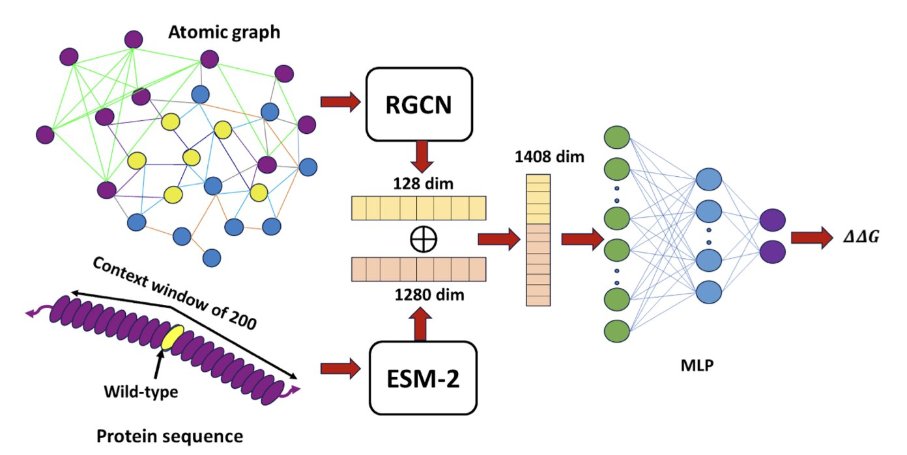
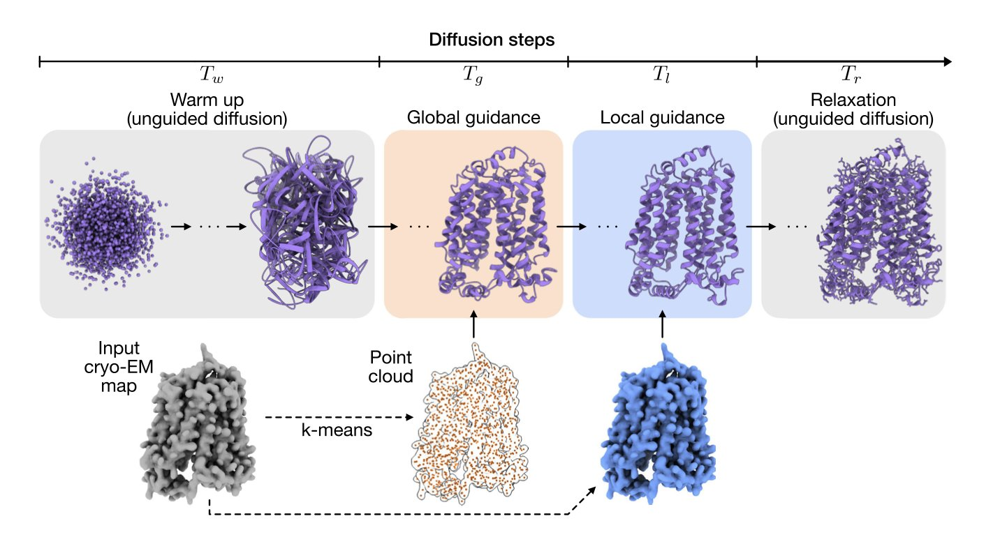
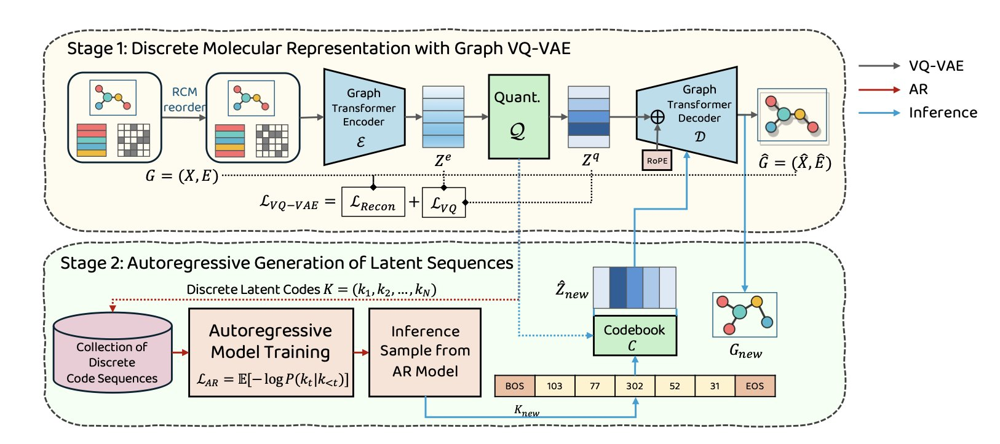
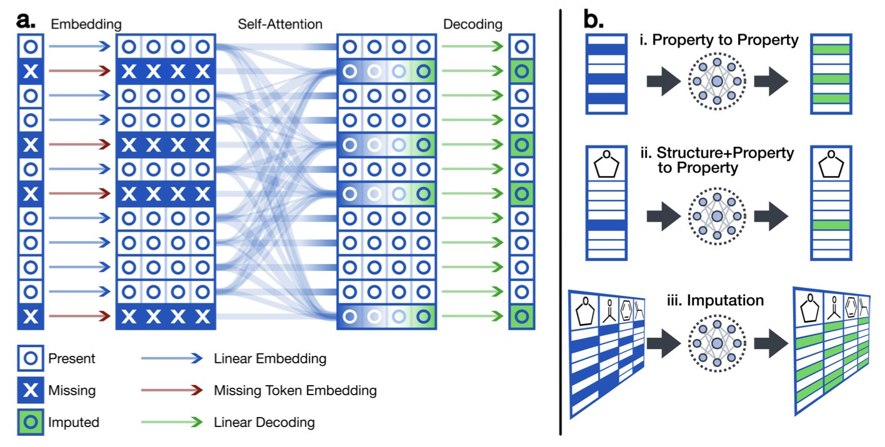
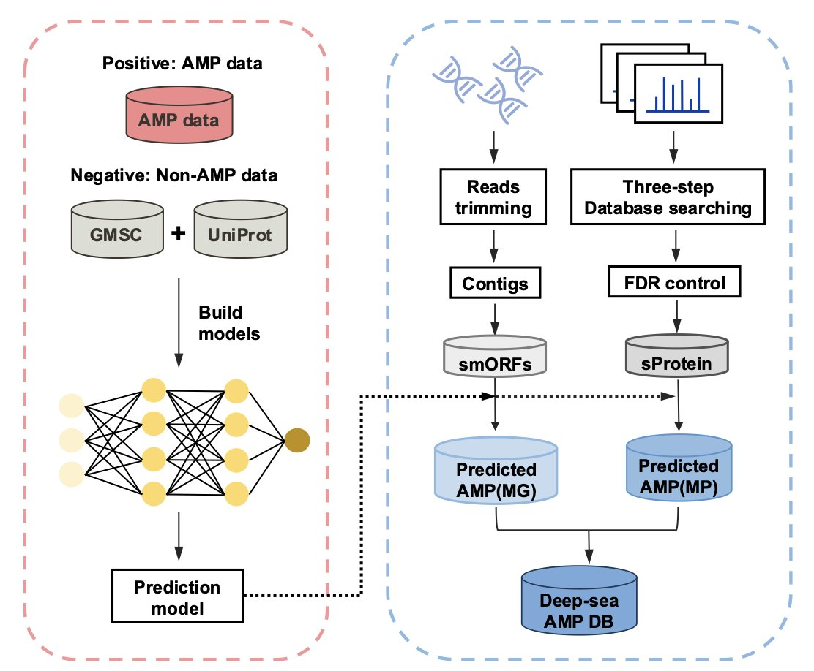
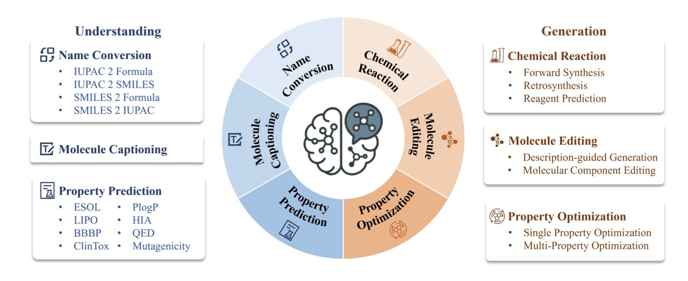

### Table of Contents
1. DeepPni uses the ESM-2 language model and an edge-aware graph network to accurately capture how mutations affect the binding energy of protein-nucleic acid complexes, outperforming existing SOTA methods on benchmarks.
2. CryoBoltz uses blurry cryo-EM data to guide an AI model in predicting multiple dynamic protein conformations, revealing how proteins function.
3. GVT converts molecular graphs into discrete sequences, generating molecules with accuracy that matches or exceeds diffusion models but at a much higher speed.
4. Researchers developed a flexible Transformer model that can predict unknown molecular properties using any combination of known properties, solving the problem of sparse chemical data in the real world.
5. The XAMP framework uses a dual-engine architecture with ESM-2 and a Transformer to overcome data bias, identifying 2,355 high-confidence antimicrobial peptides from deep-sea microbiomes.
6. BioMedGPT-Mol uses multi-task learning to understand different molecular languages and plan synthesis routes, taking a step toward a general-purpose AI chemist.

## 1. DeepPni: Fusing Sequence and Structure to Set a New Record in Binding Energy Prediction

In drug design for targets like transcription factors or RNA-binding proteins, a core challenge is **predicting how mutations affect binding affinity**. Traditional free energy perturbation (FEP) calculations take too long, and standard machine learning models often focus on just one dimension—either sequence or structure. DeepPni combines both to offer an efficient solution.

**Fusing Evolutionary Context and Spatial Structure**

DeepPni's logic is straightforward. It uses ESM-2, a protein language model developed by Meta, to process sequence information. Just like understanding text, ESM-2 can judge whether an amino acid mutation makes sense in an evolutionary context.

Chemical reactions happen in 3D space, so the authors introduced an edge-aware relational graph convolutional network (RGCN). Traditional graph models often treat atoms only as nodes, ignoring the edges that connect them. The protein-nucleic acid interface is full of complex interactions like hydrogen bonds, salt bridges, van der Waals forces, and water-mediated bridges. DeepPni specifically enhances the encoding of these "edges," using an algorithm to capture the precise physicochemical relationships between atoms to handle these different interactions accurately.

**Real-World Performance**

On a large dataset of 1,951 mutations, DeepPni achieved a Pearson correlation coefficient (PCC) of **0.76**. In the noisy field of binding energy prediction, this number represents a substantial improvement, outperforming leading models like DeePnaP and MutPni.

The model's ability to generalize is notable. It performs consistently whether the protein binds to DNA or RNA, and at experimental temperatures of 25°C or 37°C. DeepPni also maintained a high correlation on the ProNab external validation set, which includes data from both ITC (Isothermal Titration Calorimetry) and fluorescence polarization assays. For designing new mutants or new binding sites, this tool can provide high-confidence results and increase the success rate of wet-lab experiments.

📜Title: DeepPni: Language and graph-based model for mutation-driven protein nucleic acid energetics
🌐Paper: <https://arxiv.org/abs/2511.22239>

## 2. CryoBoltz: Using AI to See Protein Dynamics and Unlock New Drug Targets

Proteins are not static structures; they move and change shape to perform their functions. Tools like AlphaFold can generate a static "ID photo" of a protein, but drug development needs a "video" of how they work.

Cryo-electron microscopy (cryo-EM) can capture snapshots of these molecular machines. But when studying flexible proteins like ion channels or antibodies, the data is often "blurry." This is like taking a long-exposure photo of a dancer, which results in a motion blur instead of a clear pose. This blurry data, which contains multiple conformations, is known as "heterogeneity" and has long been an obstacle in structure determination.

The CryoBoltz method treats this blurriness as valuable information containing multiple conformations. It works with a diffusion-based AI model for structure prediction. You can think of this AI as a structure assembler, which starts with a random cloud of atoms and gradually builds a plausible protein structure.

During this process, CryoBoltz acts as a "guide." It uses the blurry cryo-EM density map to direct the "assembler," making sure the constructed structure fits within the corresponding areas of the map. Its core is a "multi-scale guidance" mechanism that pays attention to both the big picture and the small details.

1.  **Global Guidance**: Ensures the overall shape and orientation of the entire protein model match the overall outline of the cryo-EM density map.
2.  **Local Guidance**: Ensures that each small segment of the peptide chain and each amino acid side chain fits within its corresponding local density region.

This dual constraint is like an experienced craftsman who ensures the overall proportions are right while also polishing the fine details. As a result, when the AI model generates a structure, it explores conformations that are both physically and chemically sound and can fit inside the experimental data. Since the data itself contains the "ghostly image" of multiple conformations, CryoBoltz can guide the model to generate a series of different, valid structures, each corresponding to one of those conformations.

This method is particularly valuable in drug discovery. For example, a membrane transporter moves substances by switching between "open" and "closed" conformations, but a drug might only work on one of them. If a model can only predict a single, averaged structure, drug design is impossible. CryoBoltz can resolve both the "open" and "closed" states from the same blurry experimental data, providing clear, functionally relevant target structures for drug design.

CryoBoltz is an "inference-time" method, which means it doesn't require retraining huge AI models and can be applied directly. Any lab with cryo-EM data and a structure prediction model can integrate it into its workflow. This lowers the barrier to entry and makes resolving dynamic structures a tool available to more researchers.

📜Title: Multiscale guidance of protein structure prediction with heterogeneous cryo-EM data
🌐Paper: https://arxiv.org/abs/2506.04490v2

## 3. GVT: A New Paradigm for Molecular Generation, Faster and More Accurate Than Diffusion Models

The goal in molecular generation is to create novel chemical structures with good properties, while balancing speed and computational cost. Diffusion models have gained attention for their high-quality results, but they are computationally expensive. Generating a library of molecules can take days, creating a bottleneck in drug development.

The Graph VQ-Transformer (GVT) model offers a new approach. It uses a discrete method and has achieved excellent results.

**Learning Molecules Like a Language**

GVT's core idea has two steps, just like learning a language.

The first step is to "learn words." The model uses a Graph Vector-Quantized Variational Autoencoder (Graph VQ-VAE) to build a "molecular dictionary." The VQ-VAE reads a molecule's graph structure and compresses it into a series of discrete codes, or "words." Each "word" represents a specific chemical substructure or functional group.

The key is how to turn a non-linear graph structure into a linear sequence without losing connectivity information. The model uses the Reverse Cuthill-McKee (RCM) node-ordering algorithm. This algorithm systematically numbers the atoms to ensure that atoms that are close in 3D space are also adjacent in the sequence, converting a complex graph into an information-dense sequence.

This design allows GVT's VQ-VAE to achieve a near-perfect molecular reconstruction rate. If a model can't accurately reproduce molecules it has already seen, it can't be trusted to generate reliable new ones. GVT performs solidly on this front.

The second step is to "learn grammar." With the "dictionary" in place, an autoregressive Transformer learns how to combine these "words" into chemically valid "sentences" (i.e., molecules). The Transformer learns the patterns of how molecular "words" are arranged, such as which functional group typically follows another. When generating new molecules, it acts like a writer, outputting "words" one by one to form a complete new molecule.

**Performance and Speed, Without Compromise**

GVT performs well on standard benchmarks like ZINC250k, MOSES, and GuacaMol. On key metrics that measure the similarity between generated molecules and real drug molecules, such as Fréchet ChemNet Distance (FCD) and KL divergence, GVT scores better than top diffusion models.

This shows that the molecules generated by GVT are not only chemically sound, but their distribution in chemical space is also closer to that of drug-like molecules.

GVT's speed advantage comes from its discrete, autoregressive generation process, which avoids the time-consuming iterative denoising calculations of diffusion models. For computational-aided drug design (CADD) teams, this can shorten the time needed to explore chemical space and speed up R&D cycles.

GVT proves that with smart design, discrete latent space models can perform as well as continuous models (like diffusion models) while offering advantages in efficiency and practicality. It also suggests that while chasing new technologies, re-examining classic methods might lead to better solutions.

📜Title: Graph VQ-Transformer (GVT): Fast and Accurate Molecular Generation via High-Fidelity Discrete Latents
🌐Paper: https://arxiv.org/abs/2512.02667v1

## 4. A New Transformer Architecture: Predicting Unknown Molecular Properties from Known Ones

In drug development, we always have to deal with incomplete data.

A project might have hundreds of compounds. We might measure the solubility of some, the cell activity of others, and the metabolic stability of a small fraction. The final dataset looks like a block of Swiss cheese full of holes. Traditional quantitative structure-activity relationship (QSAR) models need a molecule's structure to predict its properties and cannot make use of this valuable measured data.

A new Transformer architecture can directly use known properties to predict unknown ones. For example, it can predict cell permeability (Caco-2) using only solubility (logS) and the lipophilicity (logP), without needing the molecule's chemical structure. It treats a molecule's set of physicochemical properties as a "sentence" and uses the Transformer's sequence-processing power to find the relationships between them.

First, the model has a special embedding layer that can clearly distinguish between "missing" data points and "zero" values. In chemical data, a value of zero is very different from a value that was "not measured."

Second, its self-attention mechanism learns the "chemical intuition" between different properties. For example, it will discover that molecules with high lipophilicity usually don't have high solubility. These intrinsic relationships between properties are the foundation of its predictions.

Finally, the model's output is flexible—it can output whatever property needs to be predicted. This allows a single model to handle all kinds of missing data situations, without needing to train a separate model for each case.

The model was validated on a dataset containing 16 million molecules and 23 properties. When provided only with properties and no structure, the model's predictions had an R² value between 0.75 and 0.85. This shows that reliable predictions can be made based on the relationships between properties alone. This performance is even better than many QSAR models that rely solely on structure, because many physicochemical properties are themselves a condensed representation of a molecule's structural features.

In the early stages of drug discovery, a compound's properties are often measured in batches and at different times. This tool can use the data available at any moment to "fill in the blanks" for properties that haven't been measured or were skipped due to high cost. This can speed up compound screening and optimization, saving time and money.

For example, if a lead compound has a long synthesis route and only a few basic parameters have been measured, this model could be used to predict its more complex ADME properties, helping to decide whether it's worth investing more resources to study it further.

📜Title: Generalized Molecular Property Imputation Using a Flexible Transformer Architecture
🌐Paper: https://doi.org/10.26434/chemrxiv-2025-ztp34

## 5. A Dual-Engine AI Drives Antimicrobial Peptide Discovery

The threat of drug-resistant bacteria is urgent, and with terrestrial resources dwindling, the search for new antibiotics is turning to the deep sea. The extreme environment of high pressure, low temperature, and darkness has forced microorganisms to evolve unique defense mechanisms—antimicrobial peptides (AMPs).

Previous prediction models often failed because of biases in their training data. The distribution of sequence lengths in databases is uneven, and they are full of artifacts like N-terminal methionines introduced by sequencing or expression technologies. If a model learns this noise, its predictions are worthless.

The first task of the XAMP framework is to clean the data. The team built a balanced dataset and removed interferences to ensure the model learned real biological features.

**The core of XAMP is its "dual-engine" design.**

It's like searching for treasure in a mine. Relying only on a high-precision scanner is inefficient, but using only the naked eye means you might miss something. XAMP combines the strengths of both:

1.  **XAMP-T (Transformer engine)**: Acts as an efficient prospector, using a Transformer architecture to quickly scan huge amounts of metagenomic data and identify potential regions of interest.
2.  **XAMP-E (ESM-2 engine)**: This engine brings in Large Language Model (LLM) technology. It uses the ESM-2 model to create deep representations of protein sequences and perform high-precision confirmation on the initial candidates.

This combined approach is effective: XAMP achieved a median AUC of 0.972, about a 10% improvement over the best existing tools. In drug development, that 10% often determines the success rate.

To prove its real-world capability, the researchers analyzed 238 deep-sea metagenome samples and successfully identified 2,355 high-confidence AMP candidates.

They cross-validated these findings with metaproteomic data, confirming that these predicted peptides are actually expressed in the deep-sea environment and are not just illusions generated by an algorithm.

This work demonstrates a promising pipeline for drug discovery: using protein language models like ESM-2 combined with multi-omics data can effectively mine bioactive molecules from extreme environments.

📜Title: A Global Discovery of Antimicrobial Peptides in Deep-Sea Microbiomes Driven by an ESM-2 and Transformer-based Dual-Engine Framework
🌐Paper: <https://www.biorxiv.org/content/10.1101/2025.11.20.689422v1>

## 6. BioMedGPT-Mol: An AI Chemist That Can Read Molecular Languages

Large Language Models (LLMs) often make basic mistakes in chemistry. For example, they can't correctly parse the parentheses and numbers in SMILES strings, leading them to output chemically invalid structures.

BioMedGPT-Mol takes a different approach. Instead of building a new model from scratch, it trains a general-purpose large model to become a chemistry expert.

Its core method is multi-task learning. BioMedGPT-Mol bundles multiple tasks—such as converting between molecular names, describing molecules, predicting properties, and predicting reactions—and trains the model on all of them at once using a single dataset.

This training approach forces the model to find the underlying patterns between the tasks. It learns the intrinsic connections between a molecule's IUPAC name, its linear SMILES representation, and its biological activity, building up a cognitive model of the chemical world.

The model introduces special tokens to label different types of chemical information, like SMILES strings and IUPAC names. This helps the model accurately distinguish and parse different chemical languages, reducing confusion and improving the accuracy of its outputs.

The model also needs to solve practical problems. Retrosynthesis planning is a complex chemical task. The researchers used a three-stage fine-tuning strategy to train the model: first, it learned forward reactions (from reactants to products), then it learned to work backward from products to reactants, and finally, it was trained on end-to-end planning.

The results show that BioMedGPT-Mol performs well on the RetroBench benchmark for retrosynthesis planning. This demonstrates that the model has the ability to solve real synthesis problems, not just act as a knowledge base.

The success of BioMedGPT-Mol shows that "grafting" the reasoning ability of a general-purpose large model onto a specific scientific domain, using specialized data and training methods, is a viable path. It may be better than developing entirely new AI models for every field.

📜Title: BioMedGPT-Mol: Multi-task Learning for Molecular Understanding and Generation
🌐Paper: https://arxiv.org/abs/2512.04629v1
