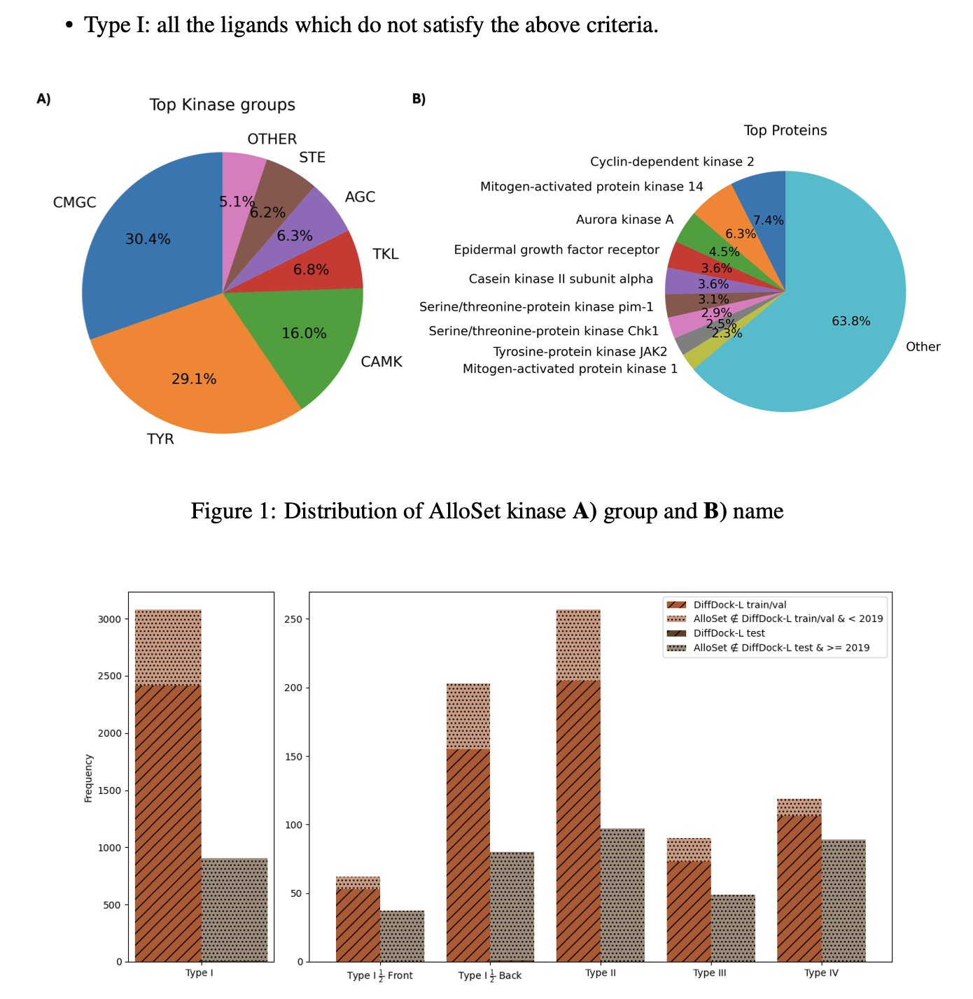
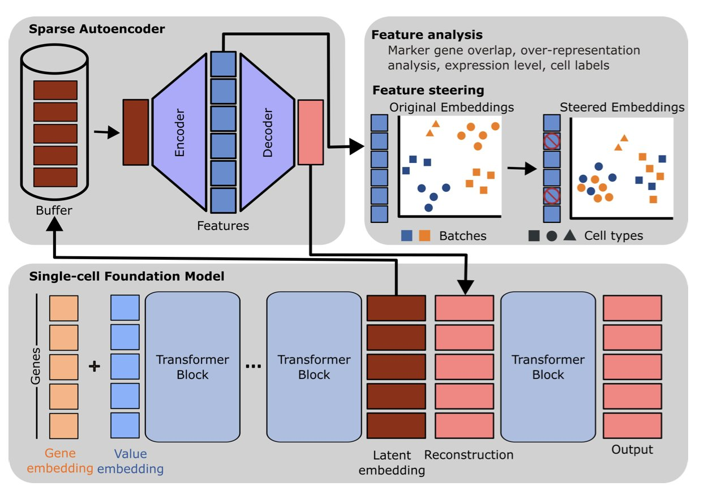
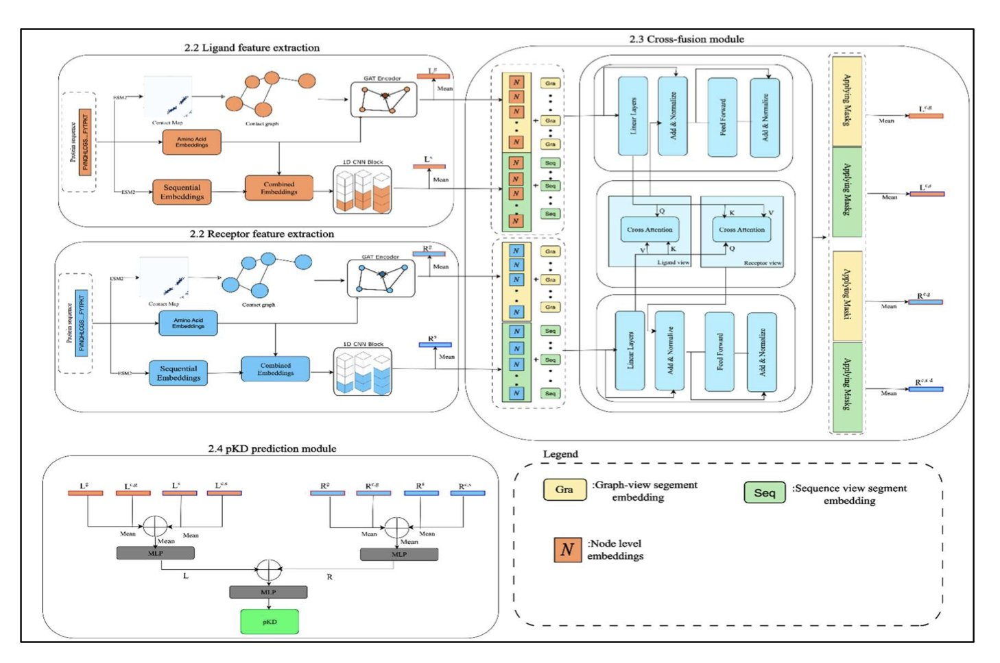
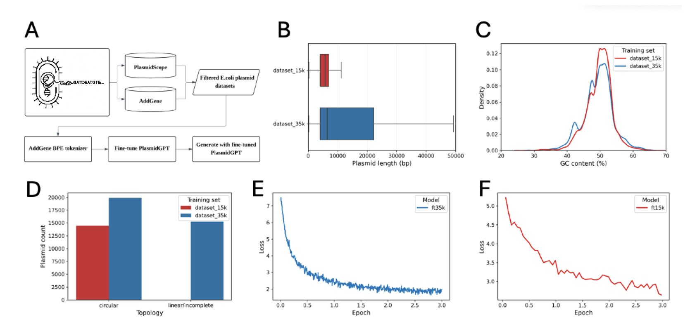
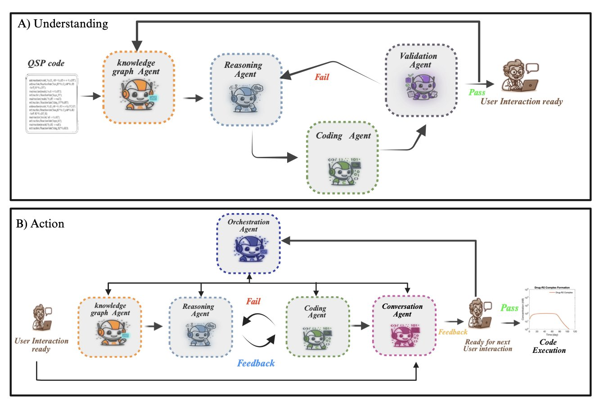
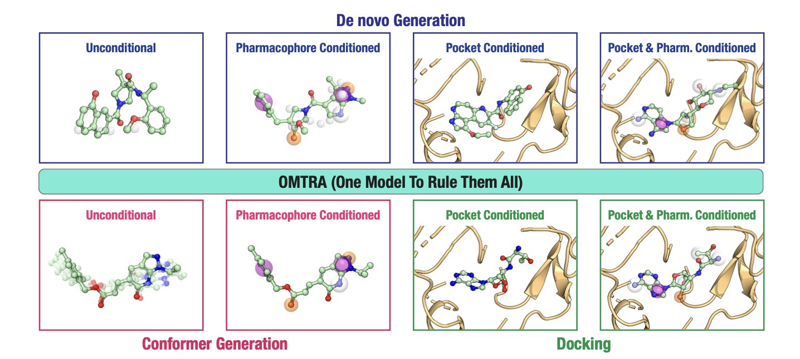

### 目录  
1. 针对棘手的别构激酶抑制剂，DiffDock-L 模型通过在特定数据集上精调，成功预测其结合构象的几率翻了一番，为解决这类对接难题提供了新范式。
2. 研究者用稀疏自编码器打开了单细胞基础模型的「黑匣子」，让我们能看懂并修正 AI 的学习内容。
3. CrossPPI 利用 Transformer 交叉融合模块，整合蛋白质结构图与序列特征，显著提升了结合亲和力预测准确性。
4. 这是 AI 第一次不仅生成 DNA 序列，还设计出能在活细胞中实际运作的完整功能性质粒。
5. GRASP 框架结合多智能体与图推理技术，让科学家能用自然语言直接构建和修改复杂的定量系统药理学模型，大幅降低了编程门槛。
6. OMTRA 用一个统一的生成模型，通过流匹配技术同时解决药物从头设计、分子对接和构象生成。模型性能出色，但多任务学习的增益效果有限。

## 1. 精调 DiffDock，解锁别构激酶对接难题  
  
  

激酶是药物研发的常见靶点，但过去研究大多集中在 ATP 结合口袋。这个口袋结构保守，针对它的抑制剂（I/II 型）设计思路明确。如今，别构位点 (allosteric sites) 正受到更多关注。  
  
别构位点能实现更高的选择性，甚至克服耐药性。但这些位点形态各异，通常又浅又疏水，不像 ATP 口袋那样深邃。传统分子对接软件面对这种开放地形，难以给出可靠的预测结果。  
  
为解决这个问题，研究者采用了一个实用策略：使用生成式 AI 对接模型 DiffDock-L，并对其进行「专科特训」。  
  
关键的第一步是准备训练数据。他们从蛋白质数据库 (Protein Data Bank, PDB) 搜集高质量的激酶 - 别构抑制剂复合物晶体结构，构建了专用数据集 AlloSet。高质量的数据是决定模型表现的基石。  
  
DiffDock 的工作原理是逐步「去噪」，从随机位置生成最合理的配体结合构象。由于它在训练中见过太多 ATP 口袋的例子，模型本身存在一种偏见，倾向于将抑制剂放入深口袋中。  
  
为纠正这种偏见，研究者采用了一种巧妙的精调策略：`tr/rot_only`。这个策略只调整分子的平移 (translation) 和旋转 (rotation)，暂时冻结了分子内部的可旋转键 (torsion)。  
  
这好比停车时，先将车开到车位的大致位置（平移和旋转），再微调方向盘停正（调整内部构象）。这种「先宏观，后微观」的思路，避免模型过早陷入局部最优的构象细节，帮助它先找到别构位点这个正确的大致区域。  
  
结果很显著。对于 III 型别构抑制剂，使用 `tr/rot_only` 策略精调后，模型预测的前 10 个构象中，均方根偏差 (Root Mean Square Deviation, RMSD) 小于 2Å 的正确构象比例，从基线模型的 18% 提升到 36%，成功率翻倍。  
  
这项工作表明，在 AI 辅助药物设计中，针对特定靶点家族或结合模式的「专家模型」可能比「通用模型」更有效。通过在小而精的数据集上巧妙精调，一个「通才」模型可以被快速训练成解决特定难题的「专才」。  
  
对于药物研发人员，这种方法有望在攻克新型别构靶点时，更快获得可靠的分子对接结果，从而指导后续的结构优化与合成。  
  
📜Title: Fine-Tuning DiffDock-L for Allosteric Kinase Docking  
🌐Paper: <https://doi.org/10.26434/chemrxiv-2025-b8k76>  
💻Code: <https://github.com/electrojustin/DiffDock-Fine-Tune>  

## 2. AI 黑匣子被打开：解密单细胞模型内部运作  
  
  

单细胞分析领域的大模型，如 scGPT，功能强大，但其内部运作如同一个黑匣子。模型能给出精准的细胞分群和注释，却无法解释其判断依据。在药物研发等高风险领域，这种不可解释性带来了信任问题，一个错误的判断可能导致数百万美元的损失。  
  
Pedrocchi 等人的研究，为解决这一问题提供了新思路，他们找到了让这个黑匣子「开口说话」的方法。  
  
他们使用的核心工具是**稀疏自编码器**（Sparse Autoencoder, SAE），可以看作一个高效的「信息压缩器」。**单细胞基础模型**（Single-cell Foundation Model, scFM）在处理数据时，内部会产生复杂的高维向量，即模型的「隐藏表征」，其中混合了有用的生物学信号和无用的技术噪音。  
  
SAE 的工作原理是，先输入这些复杂的隐藏表征，然后强制将其压缩为一组数量有限、信息高度浓缩的「特征」，最后再尝试用这些特征重构原始表征。这个过程迫使 SAE 学习到数据中最本质、最有代表性的模式。  
  
研究团队将 SAE 应用于 scGPT 和 scFoundation 这两个主流模型。他们发现，SAE 提取出的许多特征与明确的生物学概念直接对应。例如，某个特征只在 T 细胞相关的基因表达谱出现时被激活，代表了「T 细胞身份」；另一个特征则专门对应某个代谢通路。这表明模型内部学到的是真实的生物学知识，而非无法解释的统计巧合。  
  
这些特征具有因果关系。研究者识别出一个代表「**批次效应**」（batch effect）的特征——这是单细胞实验中常见的技术噪音。他们通过在模型中将这个特征的激活值手动设为零，进行了一次「神经外科手术」，成功切除了噪音信号。结果显示，模型输出数据中的批次效应被消除，不同批次的数据融合得更好。  
  
这好比音频工程师从录音中精确识别并抹掉空调的嗡嗡声，只留下清晰的人声。这说明我们不仅能「诊断」模型的问题，还能直接「修正」它。  
  
研究还发现，模型的训练方法和架构，决定了它学习知识的方式。不同的模型即使都能完成细胞注释任务，其内部的「思考逻辑」也可能千差万别。这提醒我们，理解模型的内在机制对于选择和优化模型至关重要，不能简单地将其视为即插即用的工具。  
  
研究也指出了现有模型的局限。scFM 能够识别不同数据集里的同一种细胞类型，但常常无法形成统一、通用的概念。例如，一个研究里的巨噬细胞和另一个研究里的巨噬细胞，在模型内部可能被编码成两个略有差异的特征。这说明模型的泛化能力仍需提高。  
  
这项研究提供了一套剖析和操控单细胞大模型的有效方法，让我们从模型使用者转变为能与模型「对话」的开发者。未来，基于这种可解释性，有望构建出更可靠、可控的 AI 工具，应用于药物靶点发现和临床转化。  
  
📜Title: Sparse Autoencoders Reveal Interpretable Features in Single-Cell Foundation Models  
🌐Paper: <https://www.biorxiv.org/content/10.1101/2025.10.22.681631v1>  

## 3. CrossPPI：结构与序列融合精准预测蛋白结合力  
  
  

药物研发中，预测两个蛋白质是否「相遇」相对容易，但判断它们「结合」得有多紧密（结合亲和力）才是成药关键。现有工具常受限于单一视角：仅看序列虽快但缺乏空间感，仅看 3D 结构虽准但受限于晶体数据匮乏。CrossPPI 将结构特征与序列特征直接融合，解决了这一难题。  
  
**工作原理**  
作者设计了基于 Transformer 的交叉融合模块。这如同拼装模型时兼顾说明书（序列特征）与零件图（结构特征）。模型利用图注意力网络 (GATs) 解析蛋白质空间几何结构，用卷积神经网络 (CNNs) 提取序列模式。  
  
核心在于「交互」。序列信息与结构信息在 Transformer 层深度融合，模型借此捕捉序列突变对三维空间电荷分布的复杂非线性影响。引入 ESM2 嵌入和接触图 (Contact Maps)，如同为模型装配了经过海量数据预训练的「大脑」，深化对蛋白质上下文的理解。  
  
**数据表现**  
在包含 300 个蛋白质 - 蛋白质对的独立测试集上，CrossPPI 表现稳健：皮尔逊相关系数 (PCC) 达到 0.7616，斯皮尔曼相关系数 (SCC) 为 0.7644，平均绝对误差 (MAE) 降至 1.2869。在充满噪声的亲和力预测领域，这一结果证实了模型的鲁棒性。  
  
**业界价值**  
对计算辅助药物设计 (CADD) 而言，CrossPPI 的模块化设计具备显著优势。其架构并非封闭黑盒，未来可随蛋白质语言模型发展替换 ESM2 模块，持续提升精度。这种灵活性适用于虚拟筛选、PPI 位点预测及从头蛋白设计，能有效在湿实验前过滤「假阳性」分子，降低研发成本。  
  
📜Title: CrossPPI: A Cross-Fusion Based Model for Protein–Protein Binding Affinity Prediction  
🌐Paper: <https://www.biorxiv.org/content/10.1101/2025.11.25.690371v1>  

## 4. AI 从零设计质粒，首次在活细胞中验证成功  
  
  

在合成生物学中，从头设计一个全新的质粒骨架是件难事，常规做法是在现有模板上修改。现在，有研究者尝试让 AI 从零开始设计，并获得了成功。  
  
这项研究的核心是一个名为 PlasmidGPT 的 DNA 大语言模型。它就像一个专读 DNA 序列的 GPT。研究者用海量质粒序列数据训练它，使其学习质粒的「语法」，例如功能性质粒必需的复制起始位点（origin of replication）、选择标记（如抗生素抗性基因）等元件的构成与排列方式。  
  
研究者尝试了两种方法指导 AI 设计。第一种方法是给模型一个简单的启动子 `ATG` 作为种子，让其自由生成。这种方法效果不佳，生成的序列质量参差不齐。  
  
第二种方法，是直接给模型一个完整的绿色荧光蛋白（Green Fluorescent Protein, GFP）表达盒作为提示（prompt）。这就像写文章时给 AI 一个核心段落，让它补完上下文。有了 GFP 这个明确的功能模块作为锚点，PlasmidGPT 生成的质粒骨架在结构上更为合理。  
  
AI 的输出需要筛选。研究团队生成了 1000 条序列，再用生物信息学工具进行过滤，检查序列是否包含必需元件、是否存在异常酶切位点等。经过筛选，最终得到 16 个候选序列。  
  
他们挑选了其中 3 个进行实验验证。研究者化学合成了这 3 条 DNA 序列，并将其转化进大肠杆菌（*E. coli*）。结果显示：  
1.  细菌在含有抗生素的培养基上成功生长，证明 AI 设计的抗性基因有效。  
2.  细菌在紫外光下发出绿色荧光，证明 AI 设计的质粒骨架能支持 GFP 基因的表达。  
  
这是首次将 AI 生成的质粒在活细胞中成功验证。计算机里的一串代码，变成了细胞内能发挥功能的生物元件。未来，或许可以直接向 AI 提出需求，例如设计一个在酵母中表达胰岛素的质粒，然后进行合成验证。尽管目前筛选成功率不高（1000 条序列中选出 16 个），但从设计到验证的整个流程已经打通。  
  
📜Title: Generative design and construction of functional plasmids with a DNA language model  
🌐Paper: https://www.biorxiv.org/content/10.64898/2025.12.06.692736v1  

## 5. GRASP：用对话构建复杂药理模型  
  
  

药物研发，特别是大分子或复杂机理药物的开发，离不开定量系统药理学（Quantitative Systems Pharmacology, QSP）模型。这类模型能预测药物在体内的动态过程，是指导决策的重要工具。但 QSP 建模门槛很高，通常需要药理学家和精通 MATLAB 编程的建模专家组成团队，整个过程耗时耗力，且依赖个人经验。  
  
GRASP 框架的出现，旨在改变这一现状。它的思路是让 AI 智能体处理编程和数学工作，领域专家只需用自然语言下达指令，专注于生物学问题。  
  
**GRASP 的工作方式分为两步**  
  
第一步是「理解」。建模工作常需要修改已有的 QSP 模型。这些 MATLAB 代码通常复杂且可读性差。GRASP 会先读取代码，将其「翻译」成一个结构化的知识图谱。这个图谱如同一张思维导图，展示了模型中所有组分、参数及其相互关系。为确保理解准确，GRASP 还会根据图谱反向生成新代码并运行验证，看结果是否与原始代码一致，此过程会不断迭代直至完美复现。  
  
第二步是「行动」。模型被转换成知识图谱后，药理学家就可以直接用自然语言向 GRASP 下达指令，例如：「给这个模型增加一个靶点介导的药物处置（TMDD）机制」。  
  
  
  
接到指令后，GRASP 的智能体会在知识图谱上推理。它知道 TMDD 需要引入药物 - 靶点复合物等新实体，并定义结合（kon）、解离（koff）和内化（kint）速率等新反应。它会自动更新图谱，并修改 MATLAB 代码，完成模型升级。  
  
**GRASP 的技术亮点：自动保持模型一致性**  
  
在复杂模型中增加新元素，最大的挑战是维持整个系统的一致性和准确性。这就像给一块精密手表增加一个齿轮，必须确保它和其他所有齿轮严丝合缝地协同工作。  
  
GRASP 使用「广度优先参数对齐系统」来解决这个问题。每当加入新实体或反应，系统会自动检查其对模型现有部分的所有依赖关系，确保物质平衡定律和生理学约束得到满足。系统甚至会根据已有参数，推荐一个生物学上合理的新参数取值范围。这让专家从繁琐的方程式和参数排错中解脱出来。  
  
论文中的一个案例研究展示了 GRASP 的实际能力。研究者让它处理从简单药物代谢到引入 TMDD，再到模拟多受体相互作用和协同结合等一系列愈发复杂的生物学场景。整个过程都通过自然语言指令完成，GRASP 始终能保证模型的药理学合理性和数学一致性。  
  
GRASP 就像一个既懂生物学又懂编程的虚拟助手。它让构建和迭代 QSP 模型变得像和同事讨论方案一样简单，将科学家从代码工作中解放出来。这项技术若能成熟应用，将加速药物的研发进程。  
  
📜Title: GRASP: Graph Reasoning Agents for Systems Pharmacology with Human-in-the-Loop  
🌐Paper: <https://arxiv.org/abs/2512.05502v1>  

## 6. OMTRA：一个模型搞定药物设计、对接和构象生成  
  
  

基于结构的药物设计（Structure-Based Drug Design, SBDD）通常需要多种专用工具：一个负责分子对接，一个生成新分子骨架，另一个则生成分子的三维构象。这些工具各自为战，流程繁琐。OMTRA 模型试图用一把「瑞士军刀」完成所有任务。  
  
OMTRA 的核心技术是流匹配（Flow Matching）。生成分子的过程好比雕刻。扩散模型等传统方法，如同从一团随机的「雾气」中凝聚出分子的形状，过程有效但路径曲折。流匹配则为模型设定了一条清晰、平滑的「轨道」，模型从一个简单的已知分布出发，沿轨道精确变换，最终得到目标分子的三维结构。  
  
这种方法能自然地同时处理两种不同数据：连续变化的三维原子坐标，和离散的原子类型（碳、氮、氧等）。OMTRA 在一个框架内解决了这两个问题。  
  
这把「瑞士军刀」的实战效果如何？研究者测试了 OMTRA 的具体任务能力。例如，给定一个蛋白的活性口袋，让它设计一个能与之结合的全新分子。结果显示，OMTRA 生成的分子化学结构合理，预测的结合模式可靠，在多个评价指标上超过了之前的模型，证明了模型的实用性。  
  
好的模型离不开好的数据。这项工作的另一亮点是构建了一个包含 5 亿个三维分子构象的大规模数据集。这本「百科全书」让模型见识了足够多样化的分子世界，对提升泛化能力至关重要。该数据集本身就是对整个领域的一大贡献。  
  
一个有趣的发现是，OMTRA 作为多任务模型，其任务间的协同效应并不明显。人们直觉上认为，同时学习分子设计、对接和构象生成能相互促进，产生「1+1 > 2」的效果。例如，学习生成合理的 3D 构象，应有助于更好地完成蛋白对接。但实验结果显示，这种协同增益有限，甚至没有。这揭示了一个重要问题：在分子生成领域，如何实现有效的多任务学习和知识迁移，依然是一个开放的挑战。简单地堆叠任务，并不能保证性能的飞跃。  
  
作者展望了模型的未来，计划让 OMTRA 学会生成蛋白质结构。如果实现，这将是巨大的突破，意味着模型可以处理柔性蛋白的对接问题，甚至在蛋白结构未知时进行药物设计。这就好比，我们不仅能为一把固定的锁设计钥匙，还能为一把可以变形的锁设计钥匙。  
  
总的来看，OMTRA 是一个设计精巧、性能扎实的生成模型，为统一 SBDD 的多个任务流提供了可行方案。同时，它用实验结果揭示了多任务学习在当前阶段的局限性，这种坦诚让这项工作更具价值。  
  
📜Title: OMTRA: A Multi-Task Generative Model for Structure-Based Drug Design  
🌐Paper: https://arxiv.org/abs/2512.05080  
💻Code: https://github.com/gnina/OMTRA
