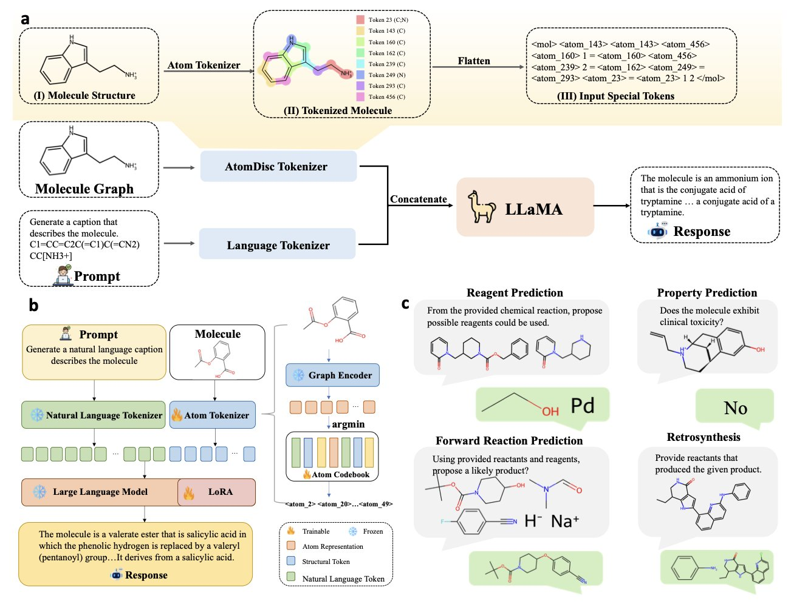
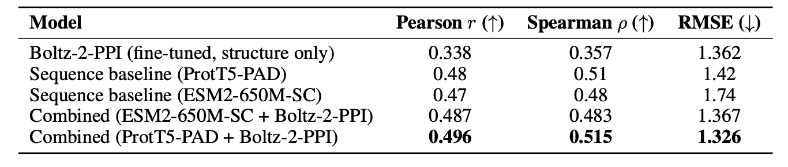
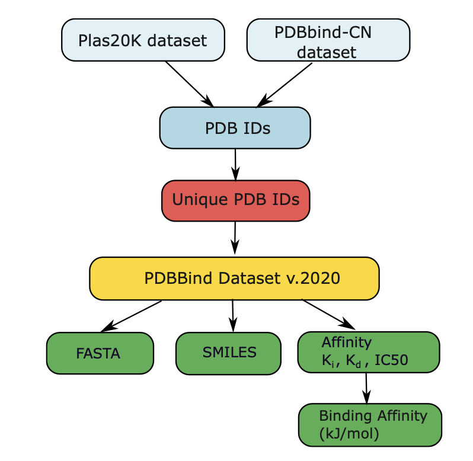
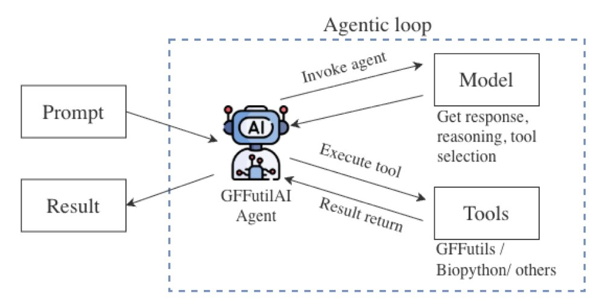
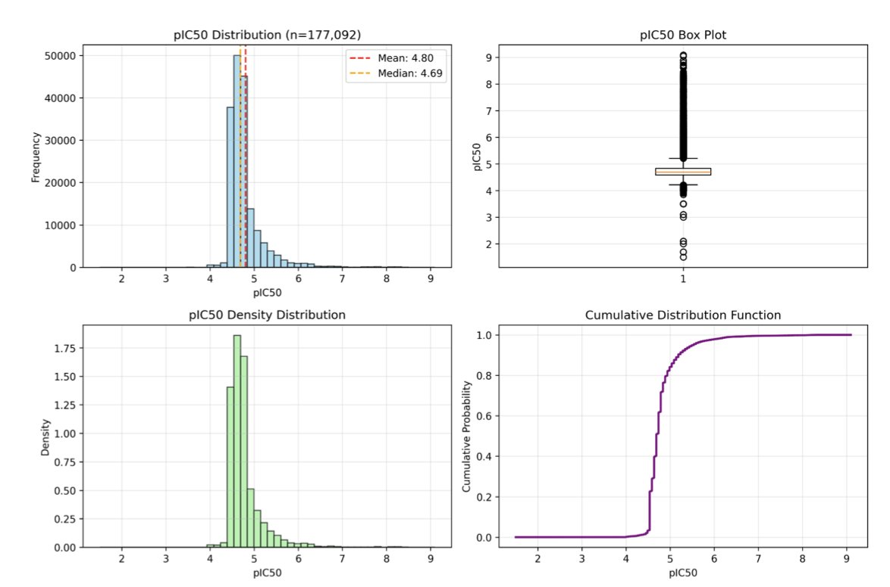
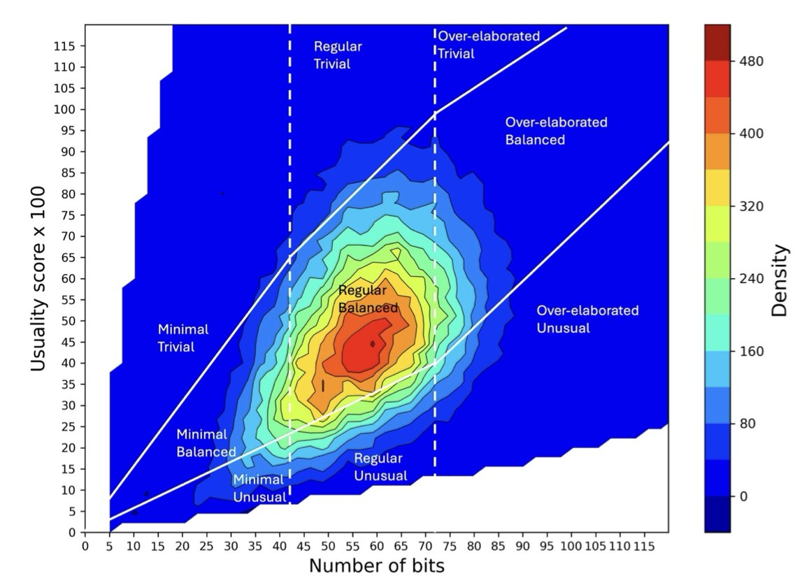

### Table of Contents  
1. AtomDisc is a new atomic-level tokenizer that encodes the precise chemical environment of each atom into discrete tokens, improving the performance and interpretability of molecular Large Language Models (LLMs).
2. Top-performing protein-small molecule structure models are surprisingly outperformed by simpler sequence-based models when predicting protein-protein interaction affinity.
3. Researchers developed AffinityNet, a sequence-only model that shows excellent generalization in predicting drug-target affinity, thanks to a more rigorous dataset and architecture design.
4. The core idea of this tool is an AI Agent framework. It breaks down natural language commands into tasks that specialized tools can execute, solving the "hallucination" and efficiency problems of large language models in bioinformatics.
5. With the right pre-training method, chemical language models can predict molecular activity from SMILES strings alone, improving the efficiency of virtual screening.
6. OiiSTER-map uses bioactivity data to calibrate molecular evaluation, helping us move beyond traditional metrics like QED to find promising, innovative molecules.

## 1. AtomDisc: A New Take on Molecular LLMs with an Atomic-level Tokenizer  
  
  

For the last few years, the most common way to teach large language models chemistry was to represent molecules as a line of text, known as a SMILES string. This method is direct, but it loses key details like the molecule's 3D structure and electronic environment. It’s like trying to describe a painting using only words. As a result, the model learns character patterns, not the underlying chemistry.  
  
AtomDisc goes back to the fundamentals of chemistry, treating a molecule as a collection of atoms.  
  
Its core idea is to create an "atomic dictionary." Each "word" (token) in this dictionary represents a specific local atomic environment, including the atom's electronic state, its bonds, and its neighbors. It’s like taking a high-resolution snapshot of each atom.  
  
Here's how it works:  
1.  **Train an atomic codebook**: A Graph Neural Network (GNN) learns to describe the local environment of each atom. These descriptions are then clustered into a discrete codebook using vector quantization. This codebook is the "atomic dictionary."  
2.  **Learn a projection network**: A projection network is trained to map a molecule's SMILES string directly to its sequence of atomic tokens. This allows the model to get a structurally rich, atom-level representation from a simple SMILES input.  
3.  **Pre-train and fine-tune**: This new tokenizer is integrated into a large language model for pre-training, then fine-tuned for specific tasks like predicting solubility or designing synthesis routes.  
  
This approach lets the model learn to "see" chemistry.  
  
For example, the model can distinguish between hydroxyl (-OH) groups in different chemical environments. A hydroxyl group on a ring structure and one on a chain structure are two different tokens in its "atomic dictionary." Chemically, these two groups have very different reactivity and physical properties (like pKa). Traditional SMILES representations struggle to capture this nuance, but AtomDisc can.  
  
The model learns this ability from data on its own, without needing pre-defined functional groups. This means it could discover new structure-property relationships that humans haven't yet identified, offering new perspectives for understanding reaction mechanisms and discovering new drugs. The model transforms from a "black box" mimic into a tool that provides chemical insights.  
  
AtomDisc achieved top results on multiple benchmarks, performing well on both basic tasks like property prediction and complex reasoning tasks like retrosynthesis. This shows that giving the model higher-quality input that is closer to the chemical reality can unlock its potential.  
  
In drug development, AtomDisc can help build more accurate models for predicting ADMET (absorption, distribution, metabolism, excretion, and toxicity) properties, filtering out unsuitable candidates early. It can also plan more reliable synthesis routes, helping researchers obtain target compounds faster. This shift from a "character game" to "chemical reasoning" is a key step for AI to mature in drug discovery.  
  
📜Title: AtomDisc: An Atom-level Tokenizer that Boosts Molecular LLMs and Reveals Structure–Property Associations  
🌐Paper: https://arxiv.org/abs/2512.03080v1  

## 2. Boltz-2 for Protein Interactions: Is Structural Information Enough?  
  
  

Boltz-2 is a model that excels at predicting the affinity between proteins and small molecules. A new study tested whether it could be adapted for the more complex task of predicting protein-protein interaction (PPI) affinity.  
  
The researchers fine-tuned the model, designing a loss function that combined Huber and ranking losses to handle PPI data. They also adjusted how data batches were constructed to avoid experimental bias. It’s like taking a model trained to recognize cats, making a few tweaks, and then asking it to identify dogs.  
  
On two datasets, TCR3d and PPB-affinity, the fine-tuned Boltz-2-PPI performed worse than models based only on amino acid sequences, such as ESM2 and ProtT5.  
  
On the TCR3d dataset, ESM2-650M achieved a Pearson correlation of 0.239, while Boltz-2-PPI scored 0.153. On the larger PPB-affinity dataset, ProtT5-PAD had a correlation of 0.48, compared to 0.338 for Boltz-2-PPI.  
  
This result is thought-provoking. 3D structural information is usually considered key to understanding molecular recognition, so why did 1D sequence models perform better?  
  
The reasons might be:  
  
Protein-small molecule binding and protein-protein interactions have different patterns. The former is like a "lock and key," where a small molecule fits into a well-defined pocket, a scenario Boltz-2 is good at capturing. PPI interfaces are larger, flatter, and more flexible, more like two pieces of clay sticking together. The features the model learned from small-molecule tasks may not apply to PPIs.  
  
Sequence models leverage evolutionary information. Large language models like ESM2 and ProtT5 have learned from billions of protein sequences, which contain evolutionary patterns. Interacting proteins often co-evolve, and these co-evolutionary signals in the sequence are strong indicators of affinity. By learning from massive amounts of sequence data, these models have picked up on these evolutionary rules.  
  
The study found that combining structural features from Boltz-2 with features from sequence models improved prediction performance, suggesting the two types of information are complementary. The structure model captures the "final form" of the binding, while the sequence model reveals the "evolutionary blueprint" that drives it. Together, they provide a more complete picture.  
  
High-resolution, static structures may not be enough. Models might need more diverse data to learn general rules. The future lies in fusing structural, sequence, and dynamic information, rather than relying on a single type of model.  
  
📜Title: On fine-tuning Boltz-2 for protein-protein affinity prediction  
🌐Paper: <https://arxiv.org/abs/2512.06592v1>  

## 3. Predicting Drug Affinity with AI: AffinityNet Moves Beyond 3D Structures  
  
  

A central question in drug discovery is: how strongly will a small molecule bind to a target protein? Traditional methods like molecular docking and physics-based simulations rely on precise 3D protein structures. But obtaining these structures is time-consuming and expensive, and many proteins have no solved structure.  
  
The authors of this paper tried a more direct approach: predicting binding affinity using only the small molecule's SMILES sequence and the protein's FASTA sequence.  
  
They developed two deep learning models.  
  
The first is called **AffinityLM**. It uses two pre-trained Large Language Models (LLMs): ESM-2 to read the protein sequence and MolFormer to read the chemical formula. AffinityLM feeds the protein and molecule sequences into their respective models, extracts feature vectors, and then combines them to predict binding affinity.  
  
The second model, **AffinityNet**, has a more tailored design. Instead of using existing large models, the researchers built an architecture specifically for this task. It uses a Graph Attention network to capture the local chemical environment within the small molecule and a Transformer module to understand long-range dependencies in the protein sequence. Finally, an attention mechanism allows the molecular and protein features to interact, identifying the key information that determines binding.  
  
To train and test their models, the authors also built a high-quality dataset. In machine learning, dataset quality is often more important than the model itself. Many existing models perform well because of information "leaks" between the training and test sets—for example, a protein in the test set is highly similar to one in the training set, so the model may have just "memorized" features instead of truly learning to predict.  
  
To prevent this, the authors built a new dataset of about 14,000 protein-ligand pairs and used a cluster-based split. This method ensures that proteins and ligands in the training, validation, and test sets have no structural overlap, providing a better test of the model's true ability to generalize.  
  
Under this rigorous test, **AffinityNet** performed well, achieving a Pearson correlation of 0.67 between its predictions and experimental values. AffinityLM performed slightly worse. This suggests that an end-to-end architecture designed for the specific task of predicting binding affinity works better than simply using general-purpose large language models.  
  
To further validate AffinityNet's capabilities, the researchers tested it on two independent external datasets. On the CSAR-HiQ dataset, it achieved a correlation coefficient of 0.78, outperforming other published models. This demonstrates that AffinityNet has learned generalizable biochemical principles, not just fit to its training data.  
  
This work shows that clean, rigorously evaluated data and benchmarks are key to making AI models practical for drug discovery. AffinityNet's success also proves that even without 3D structures, we can screen for drug candidates from sequence data, opening new doors for targets with no known structure.  
  
📜Title: Learning to Generalize: Deep Models and Robust Benchmarks for Drug–Target Affinity Prediction  
🌐Paper: https://doi.org/10.26434/chemrxiv-2025-gmrdb  

## 4. A New AI Agent Tool: Talk Directly to Your Genome GFF Files  
  
  

Researchers who work with genomic data are familiar with GFF (General Feature Format) files, which map features like genes, exons, and promoters to their locations on the genome. But extracting information from these files usually requires writing Python or Perl scripts or using complex command-line tools, which is a high barrier for many experimental scientists.  
  
The GFFUTILSAI tool aims to change this. It lets you query GFF files using everyday language. For example, you can ask: "Find all genes on chromosome 3 between 10,000 and 50,000 bp, and export their IDs and functional annotations to a CSV file."  
  
#### How It Works: The "Project Manager" Model  
  
You might think this is just a matter of feeding the question to a large model.  
  
It's not that simple. If you try to upload a multi-hundred-megabyte GFF file directly to a Large Language Model (LLM), the results are usually a mess. LLMs have several inherent weaknesses:  
  
1.  **Limited context window**: They can only process a limited amount of text at once and can't handle an entire GFF file.  
2.  **Lack of domain logic**: They don't understand the hierarchical relationship between genes and exons; they just match text patterns, which leads to errors.  
3.  **Computational inefficiency**: Using a model designed for language tasks to perform precise coordinate calculations and data filtering is like using a translation app to do math. It's slow and prone to "hallucinations."  
  
GFFUTILSAI's cleverness lies in its use of an "AI Agent" workflow, which prevents the LLM from performing tasks it's not good at.  
  
You can think of this agent as an experienced bioinformatics analyst. When you make a request:  
  
Throughout this process, the LLM's only jobs are "translation" and "direction." The actual analysis is handled efficiently by local code specifically designed for the task.  
  
#### "Zero-to-Hero" Performance Leap  
  
The researchers call this phenomenon the "Zero-to-Hero" effect. A standalone large model might have near-zero accuracy when processing a GFF query. But within an agent framework that directs specialized tools, its performance can match that of a domain expert.  
  
Data shows this method significantly improves efficiency. For a complex query, GFFUTILSAI can deliver a high-accuracy result in two minutes, while other methods might take eight minutes. More importantly, you can use a smaller, local model running on your own computer to achieve results comparable to expensive cloud-based LLM APIs. This is a huge advantage for protecting data privacy and controlling research costs.  
  
This tool is now open source on GitHub. For labs that want to explore data quickly or empower more team members to analyze data themselves, this is a new option worth trying. It won't replace professional bioinformaticians, but it can free them from many repetitive, basic queries while giving more frontline researchers the ability to talk directly to their data.  
  
📜Title: GFFUTILSAI: An AI-Agent for Interactive Genomic Feature Exploration in GFF Files  
🌐Paper: https://www.biorxiv.org/content/10.64898/2025.12.02.690645v1  
💻Code: https://github.com/ToyokoLabs/gffutilsAI  

## 5. Fine-Tuning ChemBERTa to Predict TDP1 Inhibitors with the MTR Strategy  
  
  

In drug development, finding effective inhibitors for a specific target is like finding a needle in a haystack. TDP1 (Tyrosyl-DNA Phosphodiesterase 1) is a promising cancer target; inhibiting it can enhance the effects of existing chemotherapy drugs. But how can we find TDP1 inhibitors from millions of molecules cheaply and efficiently? Traditional high-throughput screening (HTS) is expensive.  
  
This paper offers an AI screening solution. Researchers used the chemical Large Language Model (LLM) ChemBERTa, teaching it to "read" a molecule's SMILES string (a text-based representation) to understand its structure and predict its activity.  
  
#### Data Preparation: Even the Best Model Is Useless Without Data  
The foundation of any model is data. The researchers collected 177,092 test compounds for TDP1 from multiple databases to build their dataset. This dataset faced a classic problem: it was extremely imbalanced, with only 2.1% of the molecules being active compounds. If a model just learned to predict every molecule as "inactive," it could achieve 97.9% accuracy, but this would be useless in practice. To solve this, the researchers used stratified sampling and sample weighting to ensure the model could learn to identify the rare active molecules.  
  
#### Core Innovation: The Success of the MTR Pre-training Strategy  
The highlight of this work is the optimization of ChemBERTa's pre-training method. A common pre-training approach is Masked Language Modeling (MLM), which works like a fill-in-the-blanks exercise. The model is given a partial chemical structure, like `C-C-(=[MASK])-N`, and has to predict the missing part. This practice helps the model learn the basic rules of chemical structures.  
  
However, for regression tasks like predicting a continuous value such as pIC50, MLM is not the best approach. The researchers proposed Masked Token Regression (MTR) instead. MTR's objective is more direct: it asks the model to predict a relevant numerical property based on partial structural information.  
  
To make an analogy, MLM is like having a medical student memorize anatomy textbooks, while MTR is like having them practice making diagnoses from X-rays. The latter is more effective for developing diagnostic skills. Experiments confirmed that the model pre-trained with MTR and then fine-tuned consistently outperformed the MLM version in predicting pIC50.  
  
#### What Were the Results?  
The optimized ChemBERTa-MTR model performed well. Its enrichment factor (EF@1%) reached 17.4. This metric means that if you use this model to screen a compound library, you are 17.4 times more likely to find an active molecule in the top 1% of scored compounds than if you picked them randomly. This significantly reduces experimental costs.  
  
The model achieved this without needing 3D structural information or manually calculated molecular descriptors (like molecular weight or lipophilicity). It relied solely on the SMILES string. This lowers the technical and computational barriers to virtual screening. Complex calculations that used to take days can now be done in hours.  
  
Overall, this study shows that in AI-driven drug discovery, optimizing the model's training method for a specific task is critical. Text-based chemical language models are a powerful tool for accelerating the drug discovery pipeline.  
  
📜Title: Fine-Tuning ChemBERTa for Predicting Inhibitory Activity Against TDP1 Using Deep Learning  
🌐Paper: https://arxiv.org/abs/2512.04252v1  

## 6. A New Compass for AI Drug Discovery: Beyond Judging Molecular 'Beauty'  
  
  

Drug discovery, especially when aided by AI, generates a massive number of molecules. A core challenge is how to quickly screen them for promising candidates.  
  
In the past, we relied on tools like QED (Quantitative Estimate of Druglikeness) and the SA Score (Synthetic Accessibility Score). These tools tend to reward "average molecules" that look similar to known drugs. This is like using the Body Mass Index (BMI) to evaluate athletes; it can filter out extreme cases but might miss top talent. A novel molecular scaffold with breakthrough potential could be dismissed with a low score just because it doesn't look "mainstream."  
  
A preprint paper introduces a new tool called OiiSTER-map. It takes a different approach by evaluating a molecule's "position" in chemical space.  
  
OiiSTER-map is a 2D heatmap.  
  
The y-axis is the molecule's **structural complexity**, measured by the number of bits in its ECFP4 molecular fingerprint. More bits usually means the molecule is larger and structurally richer.  
  
The x-axis is the **usuality score**. This measures how frequently a molecule's chemical fragments appear in a database of known bioactive compounds (like ChEMBL). In short, are the "building blocks" of this molecule common or rare?  
  
Based on these two dimensions, any molecule can be plotted on the map. The map is divided into several main regions:  

When researchers used OiiSTER-map to analyze AI-generated molecules, they found that many molecules that scored highly on QED and SA Score were not located in the "sweet spot."  
  
This suggests that many AI models are simply imitating known drugs and generating mediocre molecules, not truly innovating. OiiSTER-map reveals the limitations of these models.  
  
The map can also reflect historical trends in drug discovery. Drugs that came to market in the early days tended to be "minimalist," while recent drugs have become increasingly complex. This aligns with the "molecular weight inflation" trend observed in the industry and validates the tool's effectiveness.  
  
When an AI model generates a batch of new molecules, we can now project them onto the OiiSTER-map in addition to checking their QED scores. The map provides richer information than a single number, helping us determine whether a molecule is a true innovation or just a mediocre one that looks good on the surface.  
  
📜Title: Rethinking Molecular Beauty in the Deep Learning Era  
🌐Paper: https://www.biorxiv.org/content/10.64898/2025.12.03.692079v1
