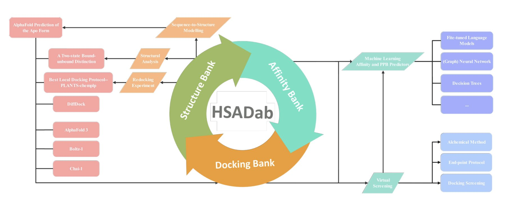
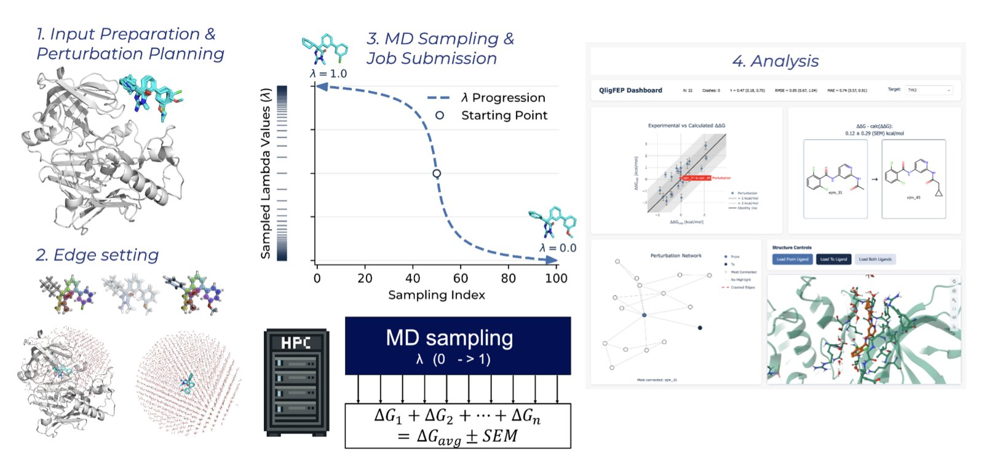
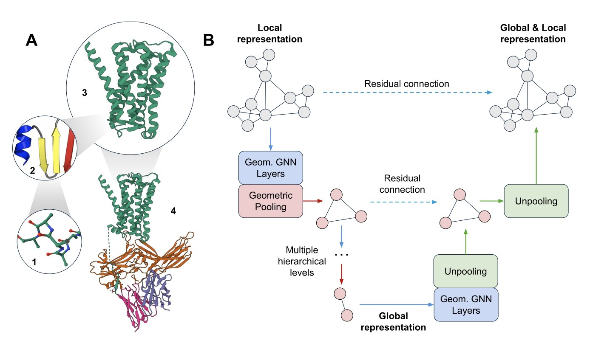
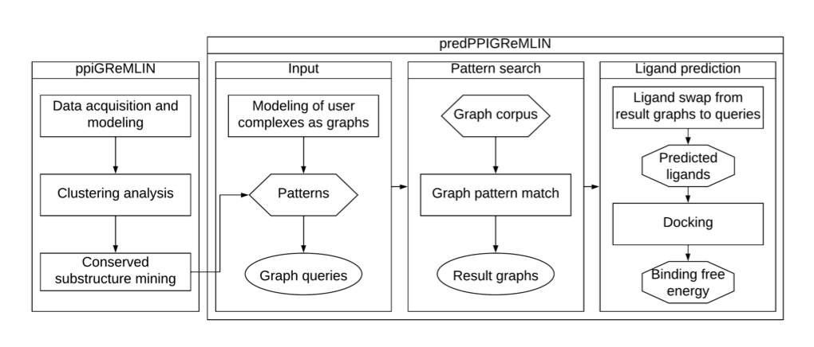
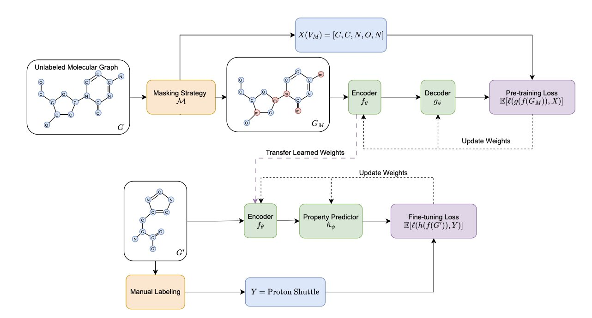
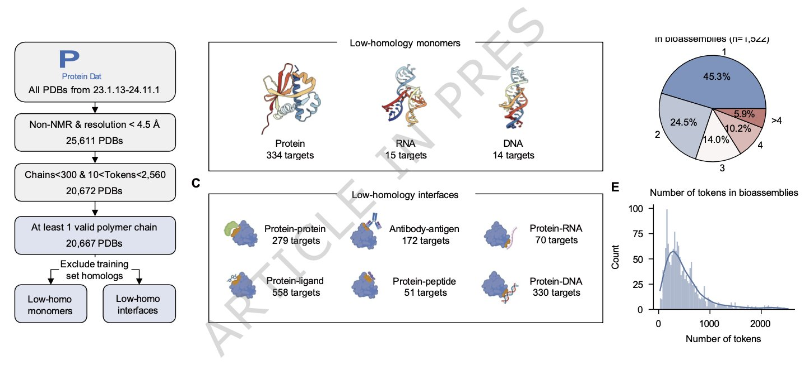

### 目录  
1. HSADab 数据库完成一项重要升级，利用人工智能填补了从化学结构到人血清白蛋白结合亲和力预测的结构空白。
2. QligFEP v2.1.0 只模拟关键的蛋白结合口袋，降低了自由能计算的成本和时间，让大规模应用成为可能。
3. 研究者设计了一种几何图 U-Net，通过模拟蛋白质从局部到整体的层级结构，提升了对蛋白质三维折叠模式的识别能力。
4. 一种名为 PredPPI-GReMLIN 的新方法，通过将蛋白质相互作用界面建模为二分图，并挖掘其中保守的结构模式，实现了高精度的蛋白质相互作用预测。
5. 在分子图自监督学习中，预测有化学意义的基元（Motif）比设计复杂的掩码（Masking）策略更能提升模型性能，尤其是在配合图注意力网络（Graph Transformer）时。
6. FoldBench 这个新基准表明，AlphaFold 3 等模型虽然进步巨大，但在抗体设计和核酸靶向等药物研发关键领域，可靠的预测能力依然遥远。

## 1. AI 重塑 HSA 数据库：精准预测药物血浆蛋白结合  
  
  

人血清白蛋白（HSA, Human Serum Albumin）是血液中的「万能出租车」，负责运输小分子药物。药物与它结合太紧，会释放不出药效；结合太松，则容易被过早清除。预测血浆蛋白结合率（PPB, Plasma Protein Binding）一直是药物研发的难点，过去依赖经验和繁琐的实验。  
  
HSADab 数据库的这次更新深度整合了 AI。现在，用户只需输入一个 SMILES 字符串，系统就能预测该分子与 HSA 的结合亲和力（Binding Affinity）及血浆蛋白结合率。这种端到端的预测，能在早期筛选阶段节省大量测试时间。  
  
一个重要的进展是对结构数据的补充。由于实验测定的复合物晶体结构有限，研究者使用 AlphaFold3 和 DiffDock 生成了一个包含 2000 多个复合物的对接库。这如同为每种药物分子在「出租车」内的坐姿都拍了快照，让我们能看清药物卡在哪个口袋（Pocket），为分子结构的理性优化提供了依据。  
  
HSA 的结构并非一成不变。分子模拟研究发现，HSA 存在「结合」与「游离」两种构象。当药物靠近时，蛋白会发生显著的构象变化来包裹药物。这种结构灵活性是过去静态对接难以捕捉的。  
  
在技术选型上，研究也提供了一个实用的结论。虽然 AutoDock 系列广为人知，但在 HSA 这个特定案例中，PLANTS 软件的表现更出色。  
  
这些工具已集成在 [hsadab.cn](http://www.hsadab.cn) 网站上。对于药物化学家而言，它将复杂的计算变为简单的线上操作，有助于在立项初期就规避那些成药性（Drug-likeness）差的分子。  
  
📜Title: Human Serum Albumin: AI-powered Modelling of Binding Affinities and Interactions  
🌐Paper: https://doi.org/10.26434/chemrxiv-2025-mx3fh-v3  
💻Code: http://www.hsadab.cn  

## 2. QligFEP v2.1：自由能微扰计算的平民化利器  
  
  

自由能微扰（Free Energy Perturbation, FEP）是药物发现中的一种高精度预测工具，但计算成本高、耗时长，限制了其广泛应用。  
  
开源平台 QligFEP 旨在解决这个问题。传统 FEP 计算将蛋白 - 配体复合物置于一个巨大的「水盒子」（water box）中模拟，大部分算力消耗在与结合关系不大的水分子上，造成了计算浪费。  
  
QligFEP 引入了球形边界条件（Spherical Boundary Conditions, SBC），像一束聚光灯，将计算精确限制在以结合口袋为中心的球形区域内，而对球外区域采用简化方式处理。  
  
这种方法减少了计算量，提升了速度。根据论文数据，单次扰动计算在常规集群上耗时不足 2 小时。在亚马逊云（AWS）上的计算成本，每条边低于 1 美元。这使得 FEP 技术不再是少数机构的专属，普通学术实验室也能负担。  
  
为验证其准确性，研究者在 16 个工业界常用蛋白靶点上，对 639 个配体转换进行了基准测试。结果表明，QligFEP 的预测精度与昂贵的商业软件（如 Schrödinger 的 FEP+）及其他开源工具相当，并未因简化计算而引入系统性偏差。  
  
QligFEP 也提升了易用性。它将配体映射、扰动网络生成等步骤自动化，用户只需提供配体和蛋白结构，简化了操作流程，为高通量虚拟筛选提供了便利。  
  
借助其内部可灵活配置的约束算法，QligFEP 还能处理开环、关环等复杂的化学结构转换，能够应对药物研发中的实际难题。  
  
未来，开发团队计划提升其处理复杂化学变换的稳定性，并开发 GPU 和云原生版本，以期进一步提高计算效率。  
  
QligFEP 通过算法改进，在保证精度的前提下，降低了 FEP 计算的门槛。这项技术变得更易获取，有望加速新药发现的进程。  
  
📜Title: Doing More with Less: Accurate and Scalable Ligand Free Energy Calculations by Focusing on the Binding Site  
🌐Paper: <https://doi.org/10.26434/chemrxiv-2025-x3r3z-v3>  

## 3. 几何图 U-Net：像搭乐高一样理解多尺度蛋白质结构  
  
  

蛋白质结构分析的关键在于尺度。一个氨基酸的侧链朝向，决定了它能否与药物分子结合；而这条氨基酸所在的 α-螺旋如何与其他二级结构堆叠，又决定了蛋白质的整体功能。药物研发需要同时洞察「树木」（局部原子相互作用）和「森林」（整体结构域折叠），但现有的计算工具难以兼顾。  
  
标准的几何图神经网络 (Geometric Graph Neural Networks, GNNs) 就像一个只能近看的放大镜。它们擅长捕捉原子间的键长、键角等局部几何关系，适合用来理解一个小的药物结合口袋。但如果想知道这个口袋在整个蛋白中的位置，以及蛋白的整体形变如何影响它，这些模型就显得力不从心了。它们缺乏一个自上而下的全局视角。  
  
这篇论文的工作，就是给 GNN 装上了一个「变焦镜头」。  
  
作者们引入的新模型叫作几何图 U-Net。U-Net 的工作方式源于图像处理：先通过「下采样」 (downsampling)，将高清图逐步压缩成模糊的小图，抓住最核心的全局特征；再通过「上采样」 (upsampling)，在全局特征的指导下，将细节逐一还原，最终得到精确的分割结果。  
  
研究者将这个思路应用到蛋白质结构上。他们设计的模型首先对蛋白质的原子图进行「粗化」 (coarsening)，可以理解为把几个相邻的氨基酸残基打包成一个「超级节点」，从而得到一个更宏观、分辨率更低的蛋白质视图。这个过程不断重复，模型就从原子尺度，看到了二级结构尺度，再到结构域尺度，获得了对蛋白质的全局理解。  
  
接着，模型再反向进行「精化」 (refining)。它把从宏观尺度学到的信息，逐层传递回微观尺度，让每个原子都能感知自己所处的全局环境。这样，模型就同时拥有了局部细节和全局视野。  
  
  
  
实现「粗化」和「精化」的核心，是两种新颖的池化层：点池化 (Point Pooling) 和稀疏池化 (Sparse Pooling)。池化是 GNN 中实现下采样的常用技术，但以往的方法大多忽略三维空间的几何信息，或者计算成本太高。作者设计的这两种新工具，既能高效聚合有几何意义的局部信息，又能与现有的 GNN 层无缝衔接。这就像找到了既能快速拼装、又能保证结构稳固的乐高积木连接件。  
  
模型的性能如何？在蛋白质折叠分类任务上，几何图 U-Net 的表现超过了那些只关注局部或只关注全局的基线模型。这证明了「先看森林，再看树木」的策略行之有效。  
  
作者还从理论上证明了这种多尺度架构的优越性。他们扩展了一种名为几何韦斯费勒 - 莱曼 (Geometric Weisfeiler-Leman, GWL) 的测试，证明经过池化操作后，模型的图区分能力（即「表达力」）可能得到增强。这从理论上保证了模型在「粗化」过程中不会丢失关键的结构信息。  
  
这项工作为设计更强大的蛋白质结构表征学习模型开辟了新路径。对于药物研发，未来或许能开发出更精准的工具，用于预测药物的脱靶效应、理解变构调节的远程机制，甚至从头设计全新的功能蛋白。  
  
📜Title: Multi-Scale Protein Structure Modelling with Geometric Graph U-Nets  
🌐Paper: https://arxiv.org/abs/2512.06752v1  

## 4. 图网络新玩法：挖掘蛋白质「握手」模式，预测药物靶点  
  
  

预测蛋白质之间的相互作用（Protein-Protein Interactions, PPIs）是药物研发的核心难题。仅依赖序列信息预测，信息量太少。决定蛋白质能否结合的关键，在于接触界面上原子级别的精确匹配，包括形状、电荷和疏水性。  
  
一个名为 PredPPI-GReMLIN 的新工具为此提供了新思路。  
  
**把「握手」过程画成图**  
  
研究者将两个蛋白质的接触界面看作一个二分图（bipartite graph）。可以想象成一个舞会，图的一边是蛋白质 A 界面上的所有氨基酸残基，另一边是蛋白质 B 界面上的残基。如果两个残基之间有相互作用，比如形成氢键或疏水接触，就在它们之间连一条线。  
  
这种方法将界面视为一个精确的关系网络，捕捉原子间的「对话」。这张图包含了具体的化学和物理信息，远超序列信息。  
  
**挖掘通用的「握手」模式**  
  
接着，研究者开发了一种图搜索算法，在大型蛋白质复合物数据库中，寻找反复出现的保守相互作用模式。  
  
这个过程类似语言学家研究对话、总结常用句式。PredPPI-GReMLIN 学习了数千种已知的蛋白质结合方式，建立了一个模式库。当遇到新的蛋白质对时，它会检查其界面是否符合库中的已知模式，以此预测二者能否相互作用。  
  
**数据表现如何**？  
  
在 CAMP 和 Yeast 等经典测试集上，该方法的精确率、召回率和 F1 分数均超过 97%。  
  
在更复杂的多类别分类任务中，模型需要区分氢键、盐桥、疏水作用等相互作用类型，准确率达到了 57.74%。虽然数字不高，但精确区分作用力类型极为困难，这个结果已属不易，证明模型理解了「是什么关系」。模型还加入了溶剂可及表面积（SASA, Solvent-Accessible Surface Area）等特征，增强了对化学环境的理解，提升了预测能力。  
  
**在新冠病毒上的实战演练**  
  
该工具在新冠病毒 Spike 蛋白与人体 ACE2 受体这一重要药物靶点上进行了应用验证。  
  
研究者使用 PredPPI-GReMLIN 预测能破坏 Spike-ACE2 相互作用的小分子配体，并通过分子对接（docking）进行验证。预测配体与 Spike 蛋白的结合能远优于随机分子（p = 5.1×10⁻⁹），表明预测结果有统计学意义。  
  
这证明 PredPPI-GReMLIN 找到的图模式对应着真实的物理化学规律，能指导有效的药物分子设计与筛选。  
  
该工具的代码和数据均已公开，方便研究者在自己的项目上验证和拓展。这种从结构细节出发、挖掘通用规律的方法，为 PPI 预测和药物设计提供了新方向。  
  
📜Title: PredPPI-GReMLIN: Prediction of Protein-Protein Interactions through Mining of Conserved Bipartite Graphs  
🌐Paper: https://www.biorxiv.org/content/10.64898/2025.12.03.692055v1  
💻Code: https://github.com/morufwork/predPPIGReMLIN.git  

## 5. 分子图预训练：预测化学基元比设计掩码更关键  
  
  

分子表征学习离不开自监督预训练（Self-Supervised Learning, SSL）。普遍的做法类似「完形填空」：将分子的一部分信息遮蔽（Masking），再让模型预测。许多研究一直试图设计更精巧的掩码策略，让模型学得更好。  
  
这项工作系统性地评估了这个问题，发现之前的努力可能偏离了方向。大量实验表明，精心设计的复杂掩码策略，和最简单的随机掩码相比，在下游任务上的表现并没有稳定优势。在如何「遮蔽」信息上投入过多精力，收益不大。  
  
提升模型性能的关键，在于我们让模型预测什么。  
  
传统做法是让模型预测被隐藏的单个原子。这好比教孩子学语言时，只让他猜字母，他能学会拼写，却难以理解词句。  
  
这项工作提出一个新思路：让模型预测的目标从单个原子升级为有化学意义的「基元」（Motif）。化学基元是分子的功能单元，如苯环、羧基，它们决定着分子的核心化学性质。让模型预测整个基元，就像让孩子猜测一个完整的单词。这能促使模型去理解化学的内在规律和上下文。  
  
从化学家角度看，这个思路很符合直觉。分子的活性、毒性等性质都与这些功能基元直接相关。模型若能学会识别和重构基元，便能更深刻地理解分子。研究者使用互信息（Mutual Information）等工具从数学上证明，基元标签与分子性质在统计上关联更强。  
  
好的学习任务也需要强大的模型来配合。研究发现，图注意力网络（Graph Transformer）比传统的消息传递神经网络（MPNN）更能从基元预测任务中获益。Graph Transformer 的注意力机制，允许模型在预测时动态关注分子的不同部分，这对于理解基元在整体结构中的作用至关重要。就像一个学生用一本好教材，学习效率会得到更显著的提升。  
  
这项工作为分子预训练提供了一个清晰的方向：与其投入精力设计复杂的掩码策略，不如专注于定义有化学意义的预测目标，并为其匹配合适的模型架构，这才是提升模型性能的有效路径。  
  
📜Title: Self-Supervised Learning on Molecular Graphs: A Systematic Investigation of Masking Design  
🌐Paper: https://arxiv.org/abs/2512.07064v1  

## 6. FoldBench 基准：AI 结构预测的「高考」来了  
  
  

AlphaFold 等 AI 模型在结构预测上的突破新闻频出，但一线药物研发人员总在问：这些模型在真实、复杂的研发场景中究竟多大用处？*Nature Communications*上关于 FoldBench 的论文，提供了一个更接近现实的答案。  
  
FoldBench 好比一场为 AI 模型准备的药物研发「高考」。以往的测试集多是单项测试，如预测蛋白质单体结构。药物研发面对的却是复杂体系：小分子与蛋白的结合、抗体对抗原的识别、靶向 RNA 药物的作用机制等。FoldBench 涵盖了这些真实的「应用题」，包括蛋白质、核酸、小分子配体及其相互作用的九大类任务。  
  
测试结果显示，AlphaFold 3 是目前表现最好的模型，在多个项目上得分领先，证明了 AI 的进步。  
  
但关键细节暴露了模型的局限，而这些细节决定了药物研发的成败。  
  
首先是抗体 - 抗原相互作用。抗体的关键是其高度可变的互补决定区（Complementarity-Determining Regions, CDR），这些区域构象灵活，决定了抗体识别抗原的精准度。FoldBench 的测试显示，现有模型预测 CDR 环区结构的能力不足。对于抗体药物开发，AI 尚不能替代高通量筛选和结构生物学实验，仅能提供初步的构象参考，依赖其精确设计抗体的风险过高。  
  
其次是别构（allosteric）体系。别构效应如同远程开关，许多药物通过这种方式间接调节靶点活性，通常伴随蛋白质发生微妙而关键的构象变化。AI 模型预测由小分子引起的这类构象变化时面临巨大挑战。无法识别这些细微变化，模型在别构药物的早期发现中作用有限。  
  
第三是核酸结构。靶向 RNA 的药物是当前热点，但 RNA 结构比蛋白质更灵活，预测难度更大。FoldBench 数据显示，AlphaFold 3 在预测核酸结构上的得分远低于其预测蛋白质单体的表现。根本原因是高质量的核酸结构数据稀少，模型缺乏足够的训练数据。  
  
一个更深层的问题是模型的泛化能力。当测试分子（特别是小分子配体）的化学结构与训练集差异较大时，预测准确率便急剧下降。这表明模型更像在「背题库」，而非真正理解了底层的物理化学原理。创新药研发恰恰需要预测全新的分子，如果 AI 在此不可靠，其价值将大打折扣。  
  
FoldBench 的出现提供了一个宝贵的「校准工具」。它告诉研发人员，AI 目前的能力边界在哪里，以及在哪些应用上需保持谨慎。它也为模型开发者指明了方向：将重心从蛋白质单体转向解决这些真实世界中的难题。  
  
📜Title: Benchmarking all-atom biomolecular structure prediction with FoldBench  
🌐Paper: https://www.nature.com/articles/s41467-024-49483-x
