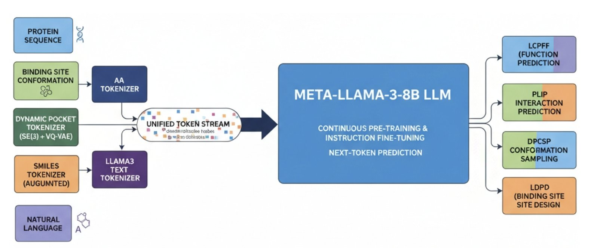
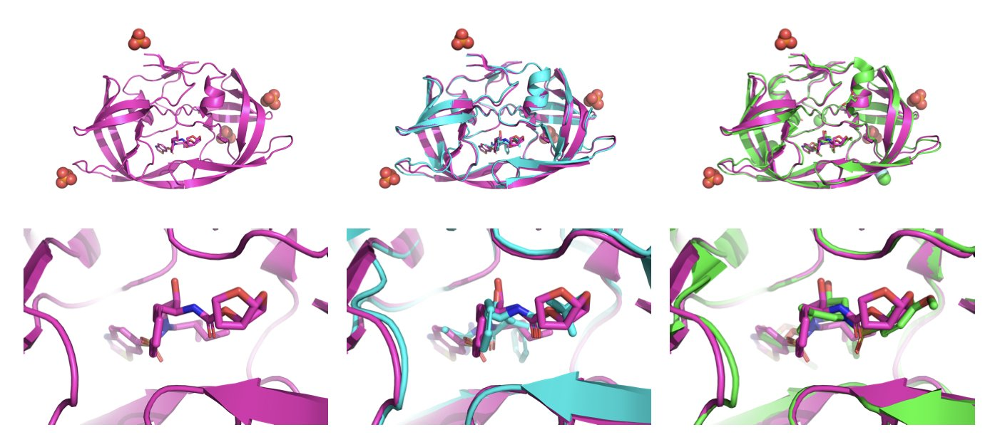
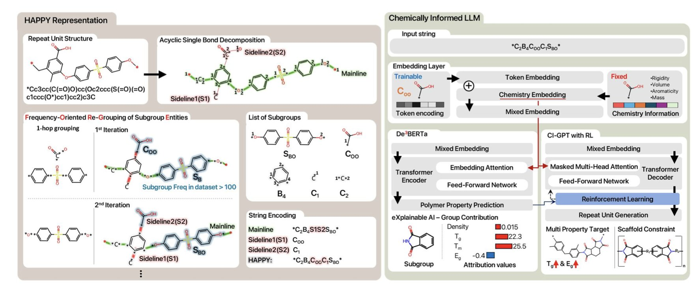
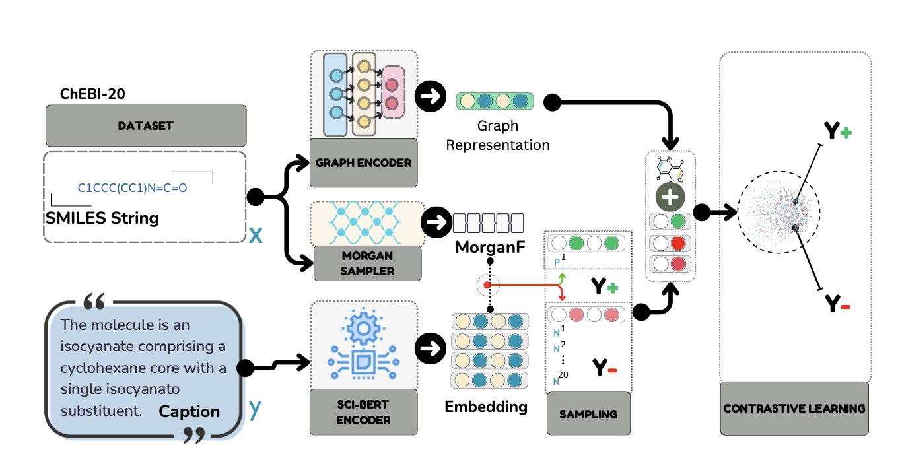
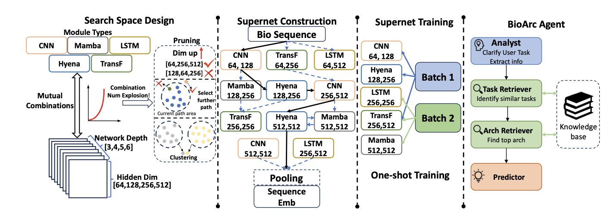
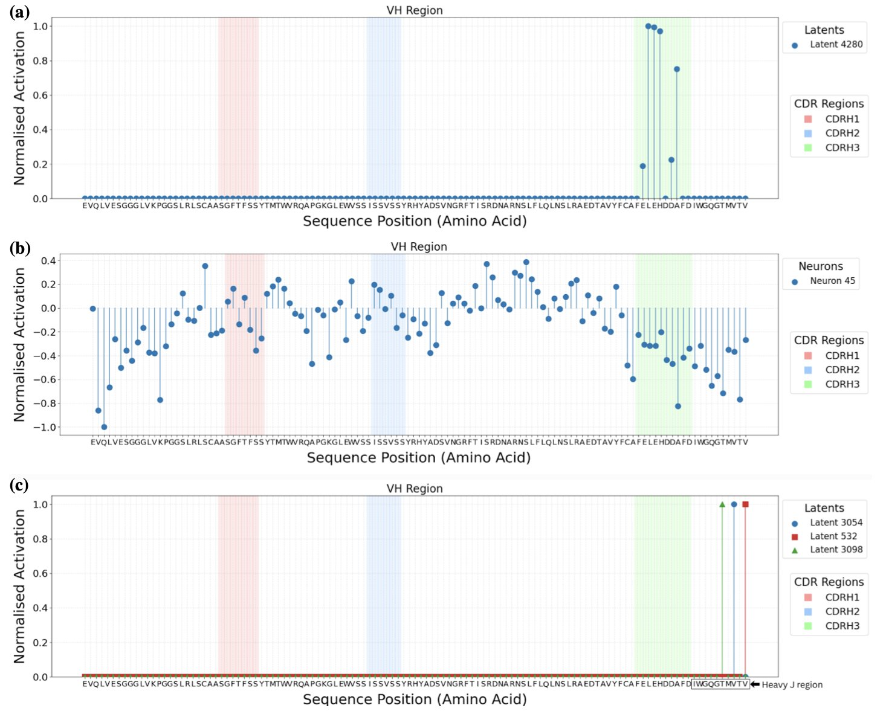

### 目录  
1. BioDynaGen 创造了一种统一语言，让 AI 能同时理解蛋白质、小分子及其动态结合过程，比静态模型更贴近生物学真实情况。
2. 当前机器学习打分函数在全新靶点上表现不佳，但大规模预训练和少量靶点特异性数据能显著提升其泛化能力。
3. CI-LLM 框架通过将高分子拆解为化学家熟悉的结构单元，教会了 AI 如何理解、预测并从头设计复杂的聚合物。
4. GAMIC 融合图神经网络与文本描述，让中等规模的大语言模型更懂化学，提升了分子性质预测的准确性。
5. BIOARC 证明，针对生物数据定制神经网络架构，能以极小的算力成本实现性能飞跃。
6. 稀疏自编码器能帮我们窥探抗体语言模型的内部运作，但要真正控制它生成指定的分子，仍有很长的路要走。

## 1. BioDynaGen：AI 首次看懂蛋白质与药物的动态结合  
  
  

药物发现中，蛋白质与药物分子的结合常被比作「钥匙和锁」，但这过于简化。真实的蛋白质靶点如同在水中蠕动的黏土，形状总在细微变化。当药物这把「钥匙」靠近，这块「黏土」会主动改变形状来更好地容纳它。这个动态过程称为「诱导契合」。  
  
以往的计算模型大多只能处理蛋白质的静态快照，例如 X 射线晶体衍射的图像。这虽然有用，却丢失了关键的时间维度信息，好比只看一张舞者的静止照片，去理解整支舞蹈。  
  
BioDynaGen 的目标，就是让 AI 看懂这场分子「舞蹈」。  
  
**它是怎么做到的**？  
  
研究思路是：将描述这场「舞蹈」的所有信息，都翻译成一种 AI 能理解的统一语言。这些信息包括：  
1.  **蛋白质序列**：蛋白质的氨基酸序列。  
2.  **小分子 SMILES**：表示分子结构的化学语言。  
3.  **自然语言**：科学家描述生物过程的文字。  
4.  **动态结合口袋构象**：工作的核心，即蛋白质口袋随时间变化的连续动画。  
  
前三类信息已有成熟方法转为 AI 使用的 token。挑战在于第四点：如何将连续变化的 3D 口袋形状，编码成离散的 token？  
  
BioDynaGen 设计了一个专门的动态结合位点构象编码器 (dynamic binding site conformation tokenizer)。可以把它想象成一个动画分析师，观看分子动力学模拟产生的口袋变化「视频」，然后完成两件事：  
  
**看懂「舞蹈」之后，能做什么**？  
  
掌握这门包含动态信息的统一语言后，AI 获得了新能力。  
  
首先是**预测能力**的提升。例如「配体条件下的蛋白质功能预测」，即回答：当药物分子结合到蛋白质上，蛋白质功能会发生什么变化？由于 BioDynaGen 理解动态结合过程，其预测准确率超过了只能分析静态图像的模型。  
  
**生成能力**也同样重要。  
  
BioDynaGen 将蛋白质 - 药物相互作用的认知，从「静态照片」带入了「动态视频」时代。它让计算工具更符合生物学现实，也让我们离精准的理性药物设计更近一步。  
  
📜Title: A Multi-modal LLM for Dynamic Protein-Ligand Interactions and Generative Molecular Design  
🌐Paper: https://www.biorxiv.org/content/10.64898/2025.12.01.691647v1  

## 2. AI 药物发现的「泛化鸿沟」：模型如何应对全新靶点？  
  
  

药物发现总是在面对新靶点。因此，一篇专门研究机器学习模型在「全新靶点」上表现的论文，引人关注。AI 模型在各种基准数据集上分数越来越高，但当它进入一个真实的研发项目时，是否依然有效？这篇论文的答案是：挑战很大，但有解决之道。  
  
首先，研究者构建了一个更严格的测试集，称为「分布外」（Out-of-Distribution, OOD）数据集。常规基准测试如同考前模拟题，知识点都在复习范围内。OOD 测试则像是解决一个从未见过的实际问题。研究者为此特意挑选了与训练数据中蛋白质结构差异巨大的靶点作为测试对象。  
  
结果显示，那些在常规测试中表现优异的机器学习打分函数，到了 OOD 测试中，性能大幅下降。这表明，许多模型可能只是记住了训练集的模式，而未真正学会蛋白 - 配体相互作用的底层物理化学原理。模型的泛化能力，是当前 AI 制药面临的最大挑战之一。如果模型只对「熟悉」的靶点家族有效，其在实际项目中的价值便会受限。  
  
那么，如何解决这个问题？文章提出了两个方向。  
  
第一个方向是「预训练」（Pretraining）。这个概念借鉴自自然语言处理领域。在学习预测结合亲和力这一具体任务前，模型会先学习海量的、无标注的分子和蛋白质结构数据。这好比医学生在诊断具体疾病前，必须先掌握解剖学、生物化学等基础知识。  
  
论文中，作者使用 ATOMICA 嵌入方法进行大规模自监督预训练，让模型在没有结合力「答案」的情况下，自主学习普适的结构规律，例如一个氢键受体周围的化学环境，或一个疏水性口袋的形态。有了这些基础知识，模型在学习预测结合力时，就更容易举一反三，将知识应用到全新靶点上。数据显示，预训练后的模型在 OOD 测试集上的表现得到改善。虽然未能完全弥补性能差距，但方向是正确的。  
  
第二个方向是「微调」（Fine-tuning），更贴近现实。在药物发现项目中，我们总会通过实验获得关于新靶点的一些分子活性数据，即使最初数量不多。研究发现，利用这些有限的、靶点特异性的实验数据对预训练模型进行微调，就能显著提升其对该靶点的预测准确性。  
  
这就像一位经验丰富的老医生，只需参考几个罕见病的病例，就能结合自身知识体系，对新病人做出准确诊断。这个策略与药物发现的实际流程契合：用 AI 模型进行大规模虚拟筛选，获得苗头化合物，通过实验验证，再将新的实验数据反馈给模型，让模型对这个项目越来越了解。  
  
这篇论文让我们对 AI 模型的局限保持清醒，也指明了可行的前进方向。它提醒我们，不应盲信模型在基准测试上的高分，并验证了「大规模预训练 + 少量项目数据微调」这一技术路线的可行性。如此一来，AI 模型有望从一个只能在特定数据集上运行的「黑匣子」，转变为一个能在项目中与研发科学家并肩作战、共同成长的工具。  
  
📜Title: Generalization Beyond Benchmarks: Evaluating Learnable Protein-Ligand Scoring Functions on Unseen Targets  
🌐Paper: https://arxiv.org/abs/2512.05386  

## 3. CI-LLM: 让大模型像化学家一样思考高分子  
  
  

如何让机器理解复杂的长链高分子，是该领域的一个难题。传统的 SMILES (Simplified Molecular Input Line Entry System) 字符串在描述高分子时，就像逐字背诵一部长篇小说，难以抓住重复单元、主链结构等化学核心概念。机器很难从一长串重复字符中，理解这些对化学家至关重要的结构信息。  
  
CI-LLM (Chemistry Integrated Language Model) 框架为此提出了一个解决方案：让 AI 用化学家的语言来学习高分子。  
  
**分层抽象，让 AI 看懂化学结构**  
  
研究者开发了一种名为 HAPPY (Hierarchically Abstracted Repeat Units) 的表征方法。它将一个复杂的高分子结构，像剥洋葱一样，层层分解为有化学意义的子结构或基团。  
  
这好比教一个孩子认识汽车，先告诉他这是轮子、那是车门、这是发动机，而不是从单个螺丝钉开始。HAPPY 将高分子聚合物分解为重复单元、端基等化学片段，让大语言模型（Large Language Model, LLM）能从宏观到微观，全面理解分子的构成。  
  
**正向预测：又快又准**  
  
基于这种新「语言」，性能预测变得简单。框架中的 De3BERTa 模型不仅处理文本序列，还直接整合了分子量、官能团数量等化学描述符。这就像在做阅读理解时，旁边附有一份详细的背景资料和名词解释。  
  
结果，模型在预测玻璃化转变温度、带隙等关键性能上，推理速度更快，准确性也超过了传统的 SMILES 模型。模型因此能够理解化学结构和性能之间的关系，不再盲人摸象。  
  
**逆向设计：从需求到分子的创造**  
  
预测性能之后，目标是实现「逆向设计」——根据所需性能，设计出相应的分子。  
  
框架中的 CI-GPT 模型便用于此。它通过强化学习 (Reinforcement Learning) 进行训练，不断试错，直到生成的高分子结构满足预设的性能目标，如同经验丰富的化学家在实验室里优化配方。  
  
它能处理多目标优化问题，比如同时要求高强度和高柔韧性，即使这两个属性在化学上通常相互矛盾。模型还能在保留特定化学骨架 (scaffold) 的基础上进行创新，这对药物化学和材料开发很实用。  
  
**可解释性：知道「为什么**」  
  
这个模型不是一个「黑箱」。研究者使用积分梯度 (Integrated Gradients) 分析方法，可以观察到模型在做决策时，是哪些化学基团起到了关键作用。  
  
例如，模型可能会指出，某个聚合物的高玻璃化转变温度，主要由其主链上的苯环结构贡献。这种洞察力能直接指导实验化学家进行更理性的分子设计和优化，减少对直觉和大量试错的依赖。CI-LLM 解决了数据和复杂性问题，并提供了一个理解高分子化学的新工具。  
  
📜Title: Chemistry Integrated Language Model using Hierarchically Abstracted Repeat Units for Polymer Informatics  
🌐Paper: https://arxiv.org/abs/2512.06301  

## 4. GAMIC：图神经网络助力大语言模型理解分子  
  
  

药物研发领域一直在寻找更高效的方式预测分子性质。传统方法将分子结构转为 SMILES 字符串等文本，再交由大语言模型（Large Language Models, LLMs）处理。该过程会丢失分子三维空间结构和原子间相互作用的关键信息。  
  
GAMIC 方法为此提出了新思路：同时向模型提供分子的文本信息与结构图。  
  
GAMIC 首先使用图神经网络（Graph Neural Networks, GNNs）学习分子的结构信息，解决了传统方法依赖摩根指纹（Morgan fingerprints）而丢失结构细节的问题。然后，它通过一个对比学习框架，将 GNN 学到的图形特征与分子的文本描述进行对齐。经此训练，模型便学会了关联抽象的分子图谱和具体的化学概念。  
  
在为模型挑选学习案例时，研究者采用了最大边界相关性（Maximum Marginal Relevance, MMR）策略。例如，为让模型认识「激酶抑制剂」，MMR 会挑选与目标分子相似的抑制剂作正面例子，同时选择结构差异大的抑制剂作补充，以防模型只认识特定结构。  
  
实验结果表明，在分子属性预测、化学反应产率预测等多个任务上，GAMIC 的表现优于此前的方法，部分指标提升达 20%。这证明了计算成本更低的中等规模大语言模型在整合结构信息后，性能可以得到显著增强，为在实际工作中部署 AI 工具提供了更可行的选择。  
  
消融研究证明了 GAMIC 各组成部分的必要性。引入图神经网络和使用 SciBERT 编码文本，都对最终性能有贡献。这项工作展示了如何利用图形信息增强大语言模型在分子科学领域的应用潜力。  
  
📜Title: GAMIC: Graph-Aligned Molecular In-context Learning for Molecule Analysis via LLMs  
🌐Paper: https://aclanthology.org/2025.findings-emnlp.996.pdf  
💻Code: Not provided  

## 5. BIOARC：用 NAS 重新定义生物基础模型，1/20 参数量超越 DNABERT-2  
  
  

AI for Science 领域常试图将 Transformer 直接应用于 DNA 或蛋白质序列。BIOARC 论文提出不同见解：通用的自然语言处理（NLP）架构并非生物数据的最优解。  
  
研究人员开发了 BIOARC 框架，让算法自动「进化」出最佳网络结构。  
  
**为什么要重新设计架构**？  
  
生物学「语言」遵循物理化学定律，异于人类语言的语法逻辑。BIOARC 构建了一个包含 DNA、蛋白质等多种模态的搜索空间，如同一个巨大的候选组件库。  
  
核心技术在于 **Supernet（超网络**）。BIOARC 采用权重共享机制，所有候选子网络共享同一个「大网」权重。这如同在同一栋大楼框架内通过调整房间布局进行测试，无需为每次设计重建大楼，从而使大规模探索具备可行性。  
  
**数据面前，大模型略显「虚胖**」  
  
参数量和计算资源存在浪费。数据显示，BIOARC 搜索出的模型 **参数量仅为 DNABERT-2 的 1/20，训练步数仅为 1/10**，但在生物学基准测试中性能反超。符合生物数据特征的小模型可以击败盲目堆料的大模型，这将大幅降低药物研发机构部署高性能 AI 模型的门槛和成本。  
  
**不仅仅是架构，还有分词（Tokenization**）  
  
BIOARC 深入研究了分词策略。最优的分词方式与网络架构高度耦合，并不存在通吃的「最佳分词法」。架构、分词和训练策略必须进行「联合优化」。  
  
**BIOARC Agent：你的架构设计师**  
  
为提升易用性，BIOARC Agent 允许用户输入任务描述（如「预测蛋白质溶解度」），基于知识库经验自动预测最适合该任务的模型架构，在迁移学习任务上表现出色。  
  
对于 AI 制药特别是序列建模任务，或许不需要数百张 A100 显卡，而是一个懂生物学的网络架构。  
  
📜Title: BIOARC: Discovering Optimal Neural Architectures for Biological Foundation Models  
🌐Paper: <https://arxiv.org/abs/2512.00283>  

## 6. 解剖抗体 AI 大脑：能否用 SAE 看懂并控制新药设计？  
  
  

抗体药物发现面临一个共同挑战。我们使用的抗体语言模型，如本文研究的 p-IgGen，能生成海量抗体序列，但其工作原理如同一个黑箱。我们不清楚它生成特定序列的原因，这给需要精准、可控设计的药物研发带来了问题。  
  
这篇论文尝试用稀疏自编码器（Sparse Autoencoders, SAEs）打开这个黑箱。  
  
SAE 像一个高效的压缩工具，它迫使模型用最精炼的少数几个「词汇」（即特征）来描述一个复杂的抗体序列。为了能将压缩后的信息无损还原，模型必须学会抓住真正有意义的生物学概念，例如「某个位置的特定氨基酸」或「某种特定结构」。  
  
研究者测试了两种 SAE。  
  
第一种是 TopK SAE，它在「解释」上表现出色，能找到一些我们直观能懂的特征。例如，某个特征的激活，强烈对应着 CDR-H3 环特定位置出现精氨酸。这让我们得以一窥 AI 的「思考过程」。  
  
但问题随之而来。当我们试图手动激活这个「精氨酸」特征，让模型生成带精氨酸的序列时，模型却不总听从指令。这揭示了研发中的一个核心困境：相关不等于因果。一个特征的出现，可能是精氨酸存在的结果，而非原因。如同看到地面湿了，可以推断刚下过雨；但往地上泼水，并不能让天开始下雨。这个发现让人们认识到，AI 的可解释性并不简单。  
  
于是，他们尝试了第二种工具，Ordered SAE。这个方法在「控制」模型生成方面效果更好。通过激活它找到的特征，可以更可靠地引导模型产生我们想要的变化，这有助于生成具有特定性质的抗体库。  
  
然而，这些「可控制」的特征，我们又看不懂了。它们不再简单对应某个氨基酸，而可能代表更抽象的概念，比如「一段适合与抗原结合的疏水表面」。这就像找到了一个能让汽车加速的按钮，却不清楚其背后是增加了喷油量还是调整了涡轮增压。能用，但原理未知。  
  
所以，这项工作将我们带到一个岔路口：我们有了一把能「看懂」的钥匙（TopK SAE）和一把能「操控」的钥匙（Ordered SAE），但它们还不是同一把。业界的最终目标是找到代表「高亲和力」的特征，然后直接增强这个特征，让模型持续生成高亲和力的抗体。  
  
这篇论文表明，实现这一目标道阻且长。同时，它也指出了一个关键瓶颈：我们需要更多、更高质量的标注数据。没有足够的数据告诉模型哪些序列是好的、好在哪里，我们找到再多特征，也只是盲人摸象。  
  
📜Title: Mechanistic Interpretability of Antibody Language Models Using SAEs  
🌐Paper: https://arxiv.org/abs/2512.05794
