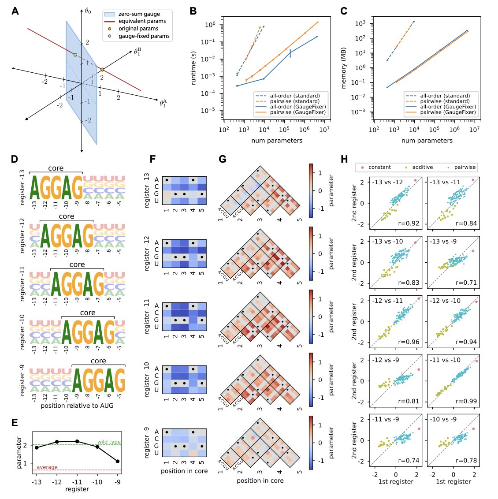
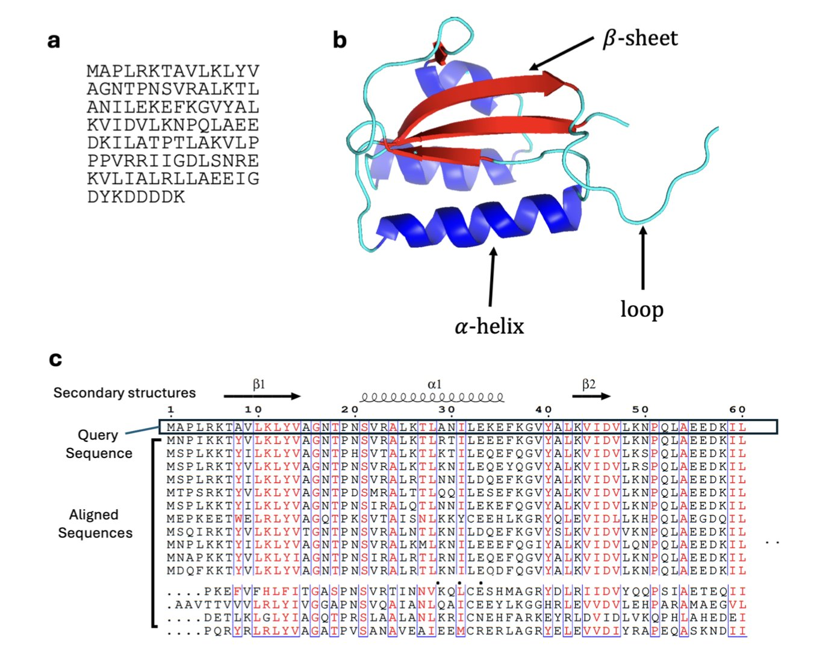
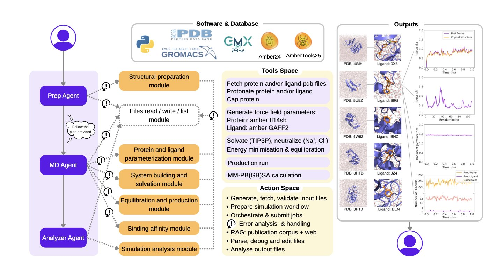
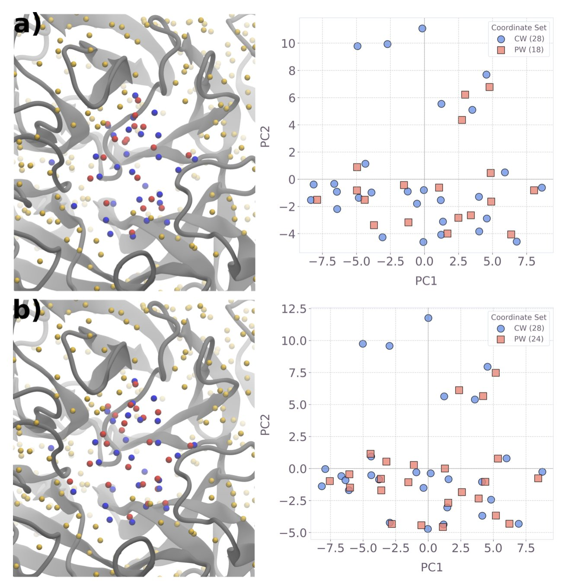
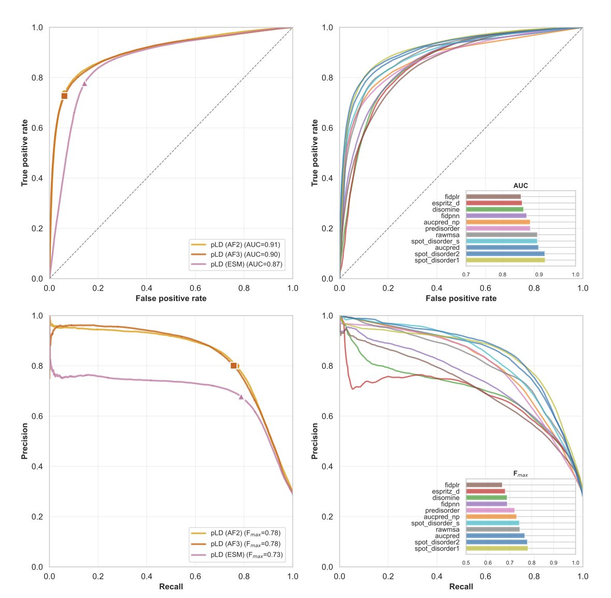
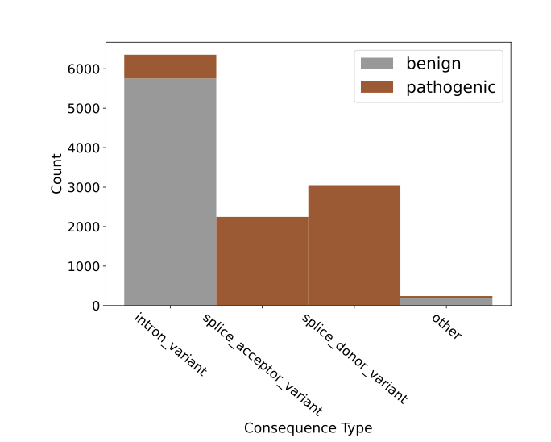

#### 目录  
1. GaugeFixer 通过一种高效算法解决了序列 - 功能模型的参数不确定性问题，让研究者能从海量数据中解读出可靠的生物学机制。
2. 研究者巧妙地「欺骗」AlphaFold2，让它生成多种蛋白质构象，再结合统计学方法，成功地从海量蛋白质中筛选出那些具有多种形态的「变形金刚」蛋白。
3. DynaMate 这个多智能体框架，能从头到尾自主完成蛋白质 - 配体系统的分子动力学模拟，让这个复杂繁琐的计算过程变得出奇地简单。
4. 研究人员成功利用现有量子计算机预测蛋白质口袋中的水合位点，其准确性已能媲美经典方法，预示着量子计算在药物发现领域的实用化正在到来。
5. AlphaFold3 在预测无序蛋白单体上表现出色，但在处理复杂的复合体相互作用时，表现出一种「自信的固执」，其预测结果往往难以捉摸。
6. 最新的 GUANinE v1.1 评测表明，监督和无监督基因组模型各有所长，二者结合才是未来基因组序列建模的方向。

## 1. GaugeFixer：高效校准生物模型，告别参数模糊  
  
  

在生物学建模，特别是研究序列如何决定功能时，我们经常遇到一个头疼的问题。想象一下，你训练了一个复杂的模型来预测蛋白质序列的活性。模型跑得很好，预测也很准。但当你打开模型的「黑箱」，想弄清楚每个氨基酸位点具体贡献了多少时，麻烦就来了。你可能会发现，好几套完全不同的参数组合，都能得到一模一样的预测结果。  
  
这就是所谓的「规范自由度」（gauge freedom），或者叫参数的非唯一性。这就像导航，几张不同的地图（参数集）都能把你带到目的地（正确预测），但每张地图的坐标系都不一样。如果你想根据这张地图去寻找下一个宝藏，你该信哪一张？这让模型的解释变得极其困难，我们无法确定参数的生物学意义。  
  
现在，一个名为 `GaugeFixer` 的新 Python 工具包就是来解决这个问题的。它的工作原理，可以理解成一个「地图校准器」。它能把所有这些坐标系不同的地图，都统一到一个标准的「规范」（gauge）上。这样一来，模型的参数就变得唯一且可比较了。  
  
这个工具最厉害的地方在于它的算法效率。作者们利用了规范固定投影（gauge-fixing projections）的数学结构，设计出一种算法，其计算时间和内存占用都与参数数量呈线性关系。  
  
这对我们做计算的人意味着什么？意味着这个工具跑得飞快。即使是拥有数百万参数的超大模型，你也可以在自己的工作站甚至笔记本电脑上完成校准，而不需要去抢超算中心的资源。这大大降低了应用门槛。  
  
口说无凭，作者用了一个经典的生物学问题来展示 `GaugeFixer` 的实力：分析大肠杆菌的 Shine-Dalgarno 序列。这是一个决定核糖体如何结合并启动翻译的关键序列。通过 `GaugeFixer` 校准模型后，他们清晰地揭示了起始密码子周围不同位置上，核糖体结合偏好的细微差异。这些精细的生物学洞见，在未经校准的模型中很可能就被参数的「噪音」淹没了。这就像擦亮了一块布满灰尘的宝石，让它原本的光彩显现出来。  
  
`GaugeFixer` 的设计也很灵活。它不仅支持全局模型，还支持层级模型（hierarchical models），让研究者可以选择最符合自己生物学问题的校准方式。  
  
对于想上手试试的同行来说，这个工具的获取和使用非常方便。它是一个开源的 Python 包，用 `pip` 就能直接安装。作者也提供了详尽的文档和源代码。这表明他们希望这个工具能成为社区的标准工作流程之一，帮助大家建立更可靠、更易于解读的生物模型。  
  
📜论文：GaugeFixer: Overcoming Parameter Non-identifiability in Models of Sequence-Function Relationships  
🌐Biorxiv: https://www.biorxiv.org/content/10.64898/2025.12.08.693054v1  

## 2. AlphaFold2 新玩法：预测蛋白质的「变形金刚」  
  
  

在我们的细胞里，大多数蛋白质就像是精密制造的零件，只有一个固定的三维形状来执行特定的功能。但总有些例外，它们是蛋白质世界的「变形金刚」，学术上称之为「变构蛋白」（Metamorphic Proteins）。这些蛋白可以像瑞士军刀一样，在两种或多种截然不同的稳定结构之间切换，每种结构对应一种不同的生物学功能。  
  
发现这些「变形金刚」一直是个难题。传统的实验方法，比如 X 射线晶体学或核磁共振，通常只能捕捉到蛋白质最稳定、最常见的那一个形态，很难看到它「变身」后的样子。  
  
AlphaFold2 的出现改变了蛋白质结构预测的游戏规则，但它也有自己的「脾气」。它的设计初衷是预测最可能、能量最低的那一个结构。你给它一个氨基酸序列，它会尽力给你一个最靠谱的答案。这对于绝大多数单结构蛋白质来说非常完美，但对于变构蛋白，这就意味着我们可能只能看到它的一种形态，而错过了其他同样重要的形态。  
  
**让 AlphaFold2「犹豫不决**」  
  
这项新研究的聪明之处在于，研究者们没有试图去改造 AlphaFold2 本身，而是想办法「操纵」它的输入。AlphaFold2 预测结构时，严重依赖一个叫作「多序列比对」（MSA）的输入信息，这相当于告诉它这个蛋白在进化长河中的亲戚们都长什么样。  
  
研究者开发了一种名为 SMICE 的采样方法。它不再是把所有进化亲戚的信息一股脑全喂给 AlphaFold2，而是有选择性地、分批次地喂给它不同的「亲戚圈子」。这就像是给一个侦探提供不同来源的线索，每次线索组合略有不同，侦探就可能推导出不同的案情结论。  
  
通过这种方式，他们诱导 AlphaFold2 对同一个蛋白质序列进行多次预测，每次都可能产生一个略有不同的、但同样合理的结构。最终，他们得到了一组蛋白质的「可能形态」集合，也就是构象系综（conformational ensemble）。  
  
**从一堆结构中找到规律**  
  
现在，我们有了一大堆预测出来的 3D 结构。下一步的关键是，如何判断这堆结构到底是因为蛋白质本身就是个「变形金刚」，还是仅仅是 AlphaFold2 预测时产生的随机「噪音」？  
  
作者在这里引入了统计学习。他们从这组结构中提取了几个关键的量化特征：  
  
1.  **结构的多样性**：这堆结构彼此之间有多大的差异？如果它们都挤在一起，形态很相似，那它可能就是个普通蛋白。如果它们能清晰地分成几个独立的「结构家族」，那它很可能就是个「变形金 Grafana 金刚」。  
2.  **聚类的形态**：这些结构是形成一个大的团块，还是两个或多个独立的团块？这直接反映了构象空间的模态。  
3.  **预测的置信度**：AlphaFold2 对自己预测的每个结构有多自信（pLDDT 分数）？一个真正的变构蛋白，可能会对它的两种或多种不同形态都给出很高的置信度。  
  
他们将这些特征数据喂给了一个随机森林分类器。经过在已知变构蛋白和单体蛋白数据集上的训练，这个模型学会了如何识别「变形金刚」的特征模式。最终，模型的区分能力相当不错，平均 AUC 达到了 0.869，也意味着它在绝大多数情况下都能做出正确的判断。  
  
**实战中的发现**  
  
理论和模型好不好，得拉出来遛遛。研究者们将这个分类器应用到了从蛋白质数据库（PDB）中随机抽取的 600 个蛋白上。结果令人兴奋，模型标记出了好几个新的潜在变构蛋白。其中一个例子是 40S 核糖体蛋白 S30，它已知具有抗菌功能，其功能的灵活性可能就与其结构的动态变化有关。  
  
这套方法的意义在于，为大规模筛选和发现变构蛋白提供了一个高效的计算工具。对于药物研发来说，这打开了一扇新的大门。传统药物设计通常是针对蛋白质的某个稳定结构上的结合口袋。但如果靶点是个「变形金刚」，我们或许可以设计一种药物，专门结合它的某一个特定形态，从而把它「锁死」在无功能或某种特定功能的状态。这为开发全新的药物作用机制提供了可能。  
  
当然，这个方法目前还只是一个强大的筛选工具，任何预测出的候选蛋白，最终都需要通过实验手段进行验证。但它无疑大大缩减了我们需要探索的范围，让我们能更精准地去寻找那些生物世界中最有趣、也可能在疾病中扮演关键角色的「变形金刚」。  
  
📜Title: Classifying Metamorphic versus Single-Fold Proteins with Statistical Learning and AlphaFold2  
🌐Paper: https://arxiv.org/abs/2512.10066v1  

## 3. DynaMate：能自我修复的 AI，搞定分子动力学全流程  
  
  

做分子动力学 (Molecular Dynamics, MD) 模拟的同行都清楚，这个活儿有多么繁琐。准备一个蛋白质 - 配体复合物系统，你需要处理 PDB 文件，给配体做参数化，选择合适的力场和水盒子，然后是能量最小化、升温、平衡，最后才是生产模拟。整个流程链条长，工具多（GROMACS、Amber、OpenMM 等），任何一步出错，几个小时甚至几天的计算时间就白费了。  
  
DynaMate 的出现，就是为了解决这个痛点。它不是一个简单的脚本，而是一个基于大语言模型的自主智能体 (Autonomous Agent) 系统。你可以把它想象成一个经验丰富的计算化学家。  
  
它的工作原理是这样的：你给它一个任务，比如「对这个蛋白质和这个配体进行 100 纳秒的 MD 模拟，并计算结合自由能」。  
  
DynaMate 内部的「规划智能体」 (Planner Agent) 会先把这个大任务拆解成一系列具体的小步骤。比如：  
1.  准备蛋白质结构。  
2.  准备配体结构并生成力场参数。  
3.  搭建复合物体系。  
4.  运行能量最小化。  
5.  ...  
6.  进行生产模拟。  
7.  计算 MM/PB(GB)SA 结合自由能。  
  
然后，它会把这些小任务分配给不同的「工作智能体」 (Worker Agent) 去执行。这些工作智能体懂得如何调用各种专业的生化计算软件。  
  
这套系统最厉害的地方在于它的「智能」。传统的自动化流程是线性的，一步出错，整个就崩了。DynaMate 不一样，它有自我纠错能力。比如，在为某个新颖的配体生成力场参数时，如果默认的 `antechamber` 工具失败了，系统不会直接报错停止。它会识别到错误，然后可能会去网上搜索这个错误代码，甚至通过集成的 PaperQA 工具去查阅相关文献，寻找处理这类分子的替代方案或参数。然后，它会尝试用新的方法重新执行任务。这种适应性让模拟的成功率大大提高。  
  
研究者们在 12 个不同复杂度的基准体系上测试了 DynaMate，结果证明它确实能独立完成从头到尾的模拟和分析。  
  
对于做药物发现的人来说，最关心的就是它计算结合自由能的准确性。  
  
论文里提到，用 MM/PB(GB)SA 方法计算出的结果与实验数据有不错的相关性。这意味着，我们可以用它来快速筛选和评估一系列化合物，判断哪个分子与靶点的结合可能更强，从而指导下一步的化学合成。  
  
这个框架的架构是模块化的，未来可以很方便地集成新工具，或者扩展到更复杂的体系，比如膜蛋白、DNA，甚至是含有多个配体的多聚体。如果这个工具能变得足够稳定和普及，将会把计算化学家从大量重复、繁琐的准备工作中解放出来，让我们能更专注于结果分析和科学洞见。  
  
📜Title: DynaMate: An Autonomous Agent for Protein-Ligand Molecular Dynamics Simulations  
🌐Paper: https://arxiv.org/abs/2512.10034v1  

## 4. 量子计算预测蛋白水合位点，药物发现新范式  
  
  

在药物设计中，蛋白质靶点口袋里的水分子是个让人又爱又恨的角色。它们就像是房间里看不见的家具，你设计的药物分子（配体）必须巧妙地避开或者利用它们，才能找到最舒服的结合构象。一个水分子位置的细微差异，可能决定了药物的活性是天上还是地下。问题是，准确预测这些水分子的位置，一直是个计算化学领域的硬骨头。  
  
我们目前使用的经典方法，比如 3D-RISM，能给出一个水分子可能出现的概率分布图，就像一团模糊的云。但它不会明确告诉你：「水分子就在这里，能量最低」。药物化学家需要的是一个更确定的答案。  
  
这篇论文的作者换了个思路。他们没有去硬解这个难题，而是把它重新包装成了一个量子计算机擅长解决的问题。  
  
**第一步，他们先用经典的 3D-RISM 方法进行计算**。这一步相当于圈定水分子的「可能活动范围」。  
  
**第二步，他们把问题转化**。他们问：「在这些可能的位点中，如何放置水分子才能让整个系统的能量最低？」这本质上是一个组合优化问题。在成千上万种可能性中找到那个最优解，正是量子计算的潜力所在。作者将这个问题构建成了一个二次无约束二元优化 (Quadratic Unconstrained Binary Optimization, QUBO) 模型。你可以把它想象成给每个可能的水分子位置一个开关（0 或 1，代表放或不放），然后找到一组开关组合，使得总能量最小。  
  
**第三步，把问题扔给量子计算机**。他们在 IBM 的 Heron 量子设备上运行了这个 QUBO 模型，系统规模最大用到了 123 个量子比特。这是一个混合策略：经典计算机负责粗算，量子计算机负责精算和优化。  
  
结果怎么样？相当不错。与经典的模拟退火 (simulated annealing) 算法相比，量子求解器找到最优解的成功率更高。这意味着，量子计算机在探索庞大的可能性空间时，比经典算法更不容易「迷路」，能更可靠地找到那个能量最低的「甜点」。  
  
这项工作最大的意义在于它的「实用性」。它没有停留在理论层面，而是直接在当今并不完美的含噪声中等规模量子 (Noisy Intermediate-Scale Quantum, NISQ) 硬件上跑出了有竞争力的结果。这证明了混合量子 - 经典方法是当前阶段一条走得通的路。  
  
作者还做了资源预测，他们认为随着量子硬件的进步，几年内我们或许就能处理更复杂、规模更大的蛋白质体系。对于一线研发人员来说，这意味着一个更强大的工具可能很快就会出现在我们的工具箱里，帮助我们更精准地设计药物分子，绕开那些讨厌的水分子陷阱。这不再是遥远的未来，而是一个清晰可见的路线图。  
  
📜Title: Practical protein-pocket hydration-site prediction for drug discovery on a quantum computer  
🌐Paper: https://arxiv.org/abs/2512.08390v1  

## 5. AF3 预测无序蛋白：单体稳如老狗，复合体仍是开盲盒  
  
  

我们在实验室里做药物研发，最怕的不是 AI 说「我不知道」，而是它言之凿凿地给出一个错误答案。最近的一项研究评估了 AlphaFold3 (AF3) 在预测内在无序蛋白 (IDPs) 时的表现。这些蛋白像飘动的面条，没有固定的三维结构，却在生命活动中扮演关键角色。  
  
先看单体的情况。如果你只是想知道一个蛋白里哪些地方是乱的，AF3 还是那个熟悉的优等生。它给出的置信度分数 (pLDDT) 非常好使，马修斯相关系数 (MCC) 达到了 0.69，表现和它的前辈 AF2 以及那些专门预测无序区域的工具不相上下。这种能力更像是从训练数据里「长」出来的，和模型本身的架构设计关系不大。  
  
但一旦进入复合体 (Multimer) 的领域，情况就变得微妙了。虽然 AF3 的整体评分 (DockQ) 和 AF2 差不多，都在 0.56 左右，但它的行为模式变了。研究者发现，当 AF3 预测错误时，它表现得极其「自信」。无论你运行多少次，它都会收敛到同一个错误的结构上。这就有点像一个学生，不管题目怎么变，他都死记硬背同一个标准答案。这种强硬的结构偏见掩盖了蛋白质本身的物理灵活性。  
  
为什么会这样？这可能和 AF3 引入的扩散模型 (Diffusion Model) 有关。以前我们还能用一些物理特征，比如疏水性或电荷，来解释为什么模型预测得好或坏。但在 AF3 身上，传统结构特征只能解释 42% 的表现差异。换句话说，模型内部变得更像一个黑盒，它的判断逻辑已经超出了传统的结构生物学描述符。  
  
还有一个让药物研发人员头疼的问题：诱导折叠。有些蛋白片段在游离状态下是无序的，只有遇到特定的结合对象才会折叠成固定形状。AF3 和 AF2 在这方面的表现都很挣扎。它们能预测出最终折叠好的状态，但很难准确识别出哪些片段是这种「分子识别特征」 (MoRFs)。  
  
也许光有算法创新（比如把 Transformer 换成扩散模型）是不够的。如果训练数据里依然缺乏无序蛋白的多样性，AI 还是会带着偏见去看世界。对于想利用 AI 寻找新靶点的人来说，盲目相信它的预测可能会带偏整个项目。我们可能需要更多样化的数据集，或者通过集成采样的方法，来打破这种「自信的错误」。  
  
📜Title: AlphaFold3 and Intrinsically Disordered Proteins: Reliable Monomer Prediction, Unpredictable Multimer Performance  
🌐Paper: https://www.biorxiv.org/content/10.1101/2024.12.05.627014v1  

## 6. GUANinE 1.1 揭示：基因组 AI 模型，鱼与熊掌可兼得  
  
  

做基因组研究，我们手上总有一大堆 AI 模型，个个都说自己最强。但到底该用哪个？这就像走进一个五金店，里面有各种锤子和扳手。选错工具，活儿就干砸了。GUANinE v1.1 这个新的基准测试，就是一份非常详尽的「工具评测报告」，帮我们搞清楚了这些模型的真实水平。  
  
这份报告最核心的发现是：不同类型的模型有不同的「舒适区」。  
  
监督模型就像是拿着标准答案复习的学生。你给它一段 DNA 序列，再告诉它这段序列对应的功能标签（比如「启动子」或「增强子」），它就去学习这个映射关系。所以，在染色质可及性这类有明确功能注释的任务上，它们表现得最好。这不意外，因为这正是它们被训练来做的事情。  
  
相比之下，无监督模型，也就是现在流行的基因组大语言模型 (Genomic Large Language Models)，更像一个语言学家。你把它扔到一个全是古籍（原始 DNA 序列）的图书馆里，不给字典，不给翻译。它自己去琢磨这门语言的语法、词汇和深层结构。结果就是，它们对进化的「语法」——也就是哪些序列在数百万年间被保留下来——有着惊人的直觉。因此，在进化保守性任务上，它们完胜监督模型。这告诉我们，它们不是竞争对手，而是各有专长的合作伙伴。  
  
报告还引入了两个新的、非常棘手的任务，直指药物研发和临床诊断的核心痛点：`cadd-snv`（预测代理有害性）和`clinvar-snv`（预测临床致病性）。这里的区别很微妙，但至关重要。一个模型或许能准确判断某个基因变异看起来「很糟糕」，比如它可能改变了某个关键氨基酸。这叫「有害性」 (deleteriousness)。但这就像修车师傅说「你这引擎里的某个零件看着不对劲」。这个零件到底会不会导致汽车抛锚？这就叫「致病性」 (pathogenicity)。从「看着不对劲」到「确定会抛锚」是巨大的跳跃。GUANinE v1.1 的测试结果证实了这个鸿沟依然存在。模型预测有害性还行，但一到临床致病性就常常失准。这对所有想用 AI 来解释基因变异的人来说，是个冷静的提醒。  
  
研究者还探讨了一个很实际的工程问题：在计算资源有限的情况下，我们是该把宝押在更多参数的模型上，还是押在能「看」得更远的模型（更大的上下文窗口）上？结果发现，并不是简单地「越大越好」。模型的参数密度和复杂度同样关键。这就像选择相机镜头，有时候，一个视野虽窄但极其锐利的微距镜头，比一个能拍下整个风景的广角镜头更有用。具体用哪个，取决于你要解决的问题。  
  
最后，这篇文章指明了前路：混合模型。既然监督和无监督模型各有千秋，把它们结合起来用岂不是更好？研究者将一个无监督模型（NT-v2-500m）和一个监督模型（Sei）组合起来，发现在变异效应预测上，这个「混血」组合的表现超过了任何一个单独的模型。这就好比一个团队里，既有通晓古籍的语言学家，又有熟读标准教材的尖子生。当面对一个复杂的难题时，他们的合力远大于一加一。这很可能就是下一代基因组序列建模的常态。  
  
📜Title: GUANinE v1.1 Reveals Complementarity of Supervised and Genomic Language Models  
🌐Paper: https://www.biorxiv.org/content/10.64898/2025.12.06.692772v1
