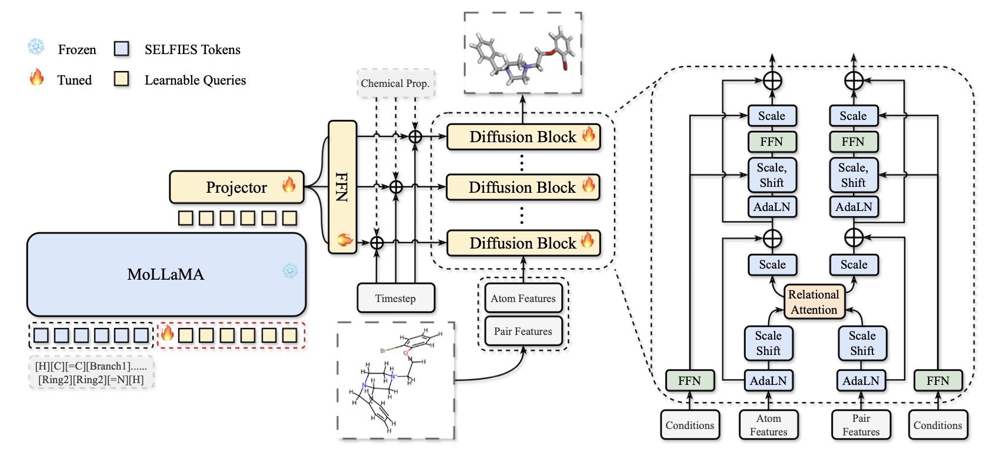
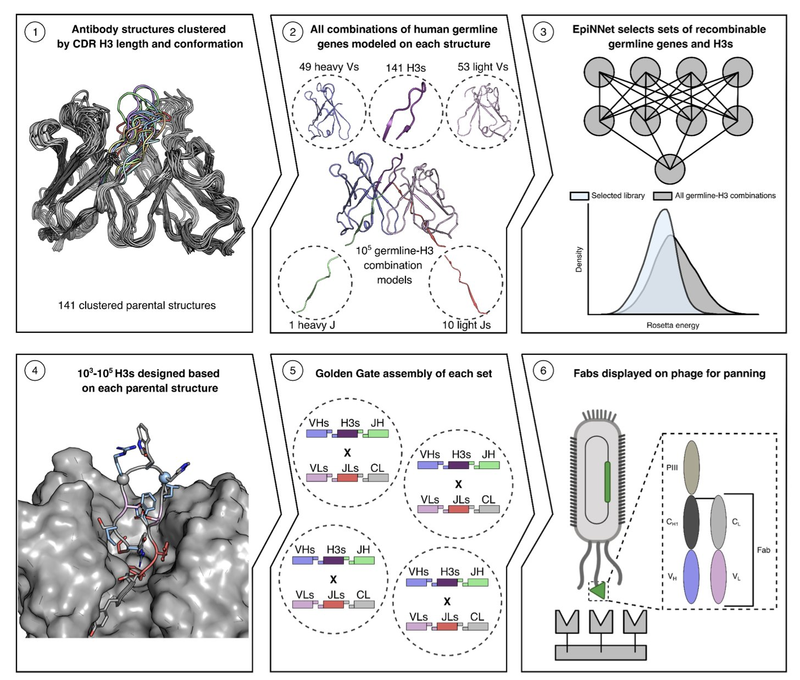
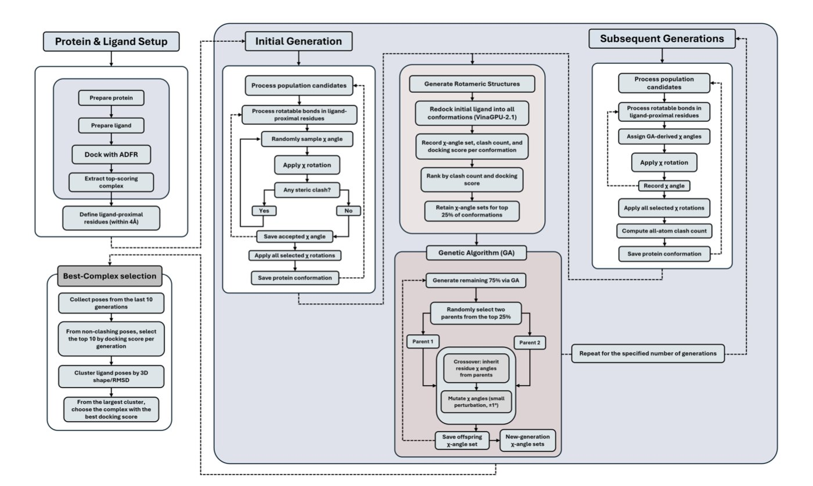
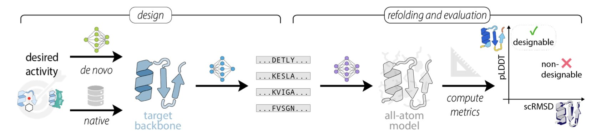
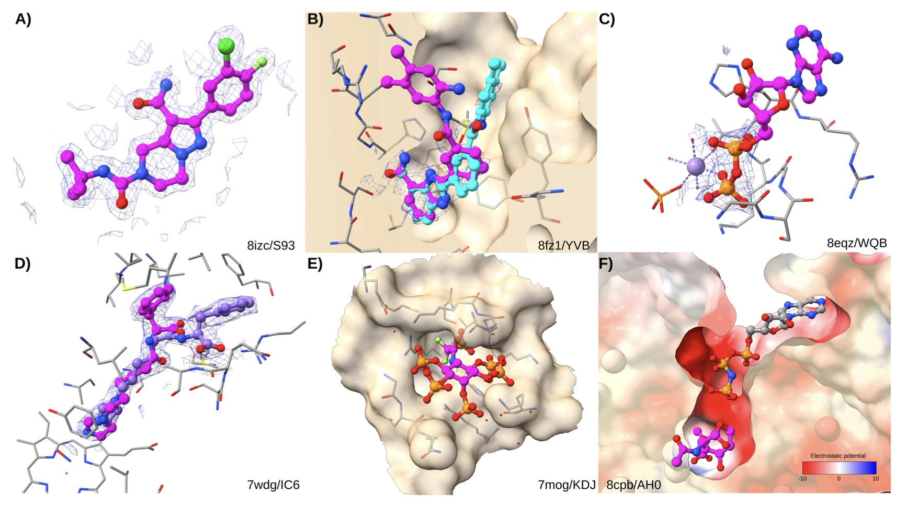
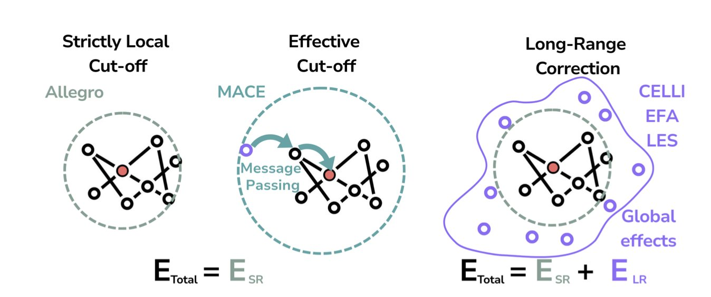

#### 目录  
1. MolSculpt 巧妙地利用一个「懂化学」的 1D 模型来指导 3D 扩散模型，能从化学式直接生成几何结构极其精准的三维分子。
2. 研究者们开发出一种计算策略 (CADAbRe)，通过结构设计，直接生成了兼具高稳定性和多样性的抗体库，其成药性媲美临床阶段分子。
3. 通过遗传算法让蛋白侧链在对接中连续运动，DRGSCROLL 找到了传统刚性对接方法会错过的、更真实的药物结合模式。
4. 依赖 AlphaFold2 重折叠来验证新蛋白设计的流程存在严重缺陷，特别是进化信息会掩盖真实的设计好坏。
5. 对于真正新颖的药物靶点，基于物理的分子对接（docking）方法，比依赖训练数据的 AI 共折叠（co-folding）模型更值得信赖。
6. 要让机器学习原子势（MLIPs）真正通用，长程相互作用模型是必需品，但现有方法在金属有机框架（MOFs）等复杂体系中依然力不从心。

## 1. MolSculpt: AI 从化学式「雕刻」出精准 3D 分子结构  
  
  

在药物发现领域，我们经常从一个一维的化学式，比如 SMILES 字符串开始。这就像拿到了一份分子零件清单。但真正的挑战是，如何把这些零件（原子）在三维空间里组装成一个稳定且具有生物活性的结构。过去的方法常常顾此失彼，要么生成的分子化学上不合理，要么三维结构不准确。  
  
MolSculpt 这项工作提供了一个非常解决方案。它的名字起得很好，叫「分子雕刻」，因为它真的是在精雕细琢一个分子。  
  
它的工作原理是这样的：研究者把任务拆分给了两个「专家」。  
  
第一个专家是一个已经训练好的、理解化学规则的 1D 分子基础模型。你可以把它想象成一位资深化学家，他看过海量的化学结构，对原子如何连接、成键规则了如指掌。最关键的一点是，这个模型是「冻结」的 (frozen)，在 MolSculpt 的训练中我们不再去动它。我们只是向它「请教」，而不是重新训练它，这大大节省了计算资源。  
  
第二个专家是一个 3D 扩散模型。它是个「雕刻家」，擅长在三维空间里摆放原子。它从一团随机的原子云开始，一步步地调整它们的位置，直到形成一个清晰的分子结构。但问题是，这位雕刻家自己并不懂化学，没人指导，它可能会造出一个四脚朝天的「怪物」。  
  
MolSculpt 的核心创新就在于搭建了一座沟通的桥梁，让化学家能指导雕刻家。这个桥梁由两个部分组成：可学习查询 (learnable queries) 和一个投影器 (projector)。  
  
整个过程是这样运作的：3D 雕刻家在每一步工作时，都会通过「可学习查询」向 1D 化学家提问。这些问题很具体，比如：「根据这个 SMILES 式，这个碳原子周围应该是什么样的化学环境？」「这个氮原子和那个氧原子之间应该是什么关系？」  
  
1D 化学家给出它的专业解答后，投影器就把这些化学知识「翻译」成三维空间里的具体坐标和几何约束，告诉雕刻家下一步该怎么做。这样一来，雕刻家走的每一步都在化学家的指导下，确保了最终作品不仅好看，而且符合所有的化学原理。  
  
那么，效果如何？在 GEOM-DRUGS 和 QM9 这两个标准数据集上的测试结果说明了一切。MolSculpt 生成的分子在化学有效性和稳定性上都达到了顶尖水平。  
  
更重要的是，它对局部几何结构的还原能力非常出色。比如键长、键角和二面角。在药物设计中，一个分子的构象，尤其是关键的二面角，如果错了一点点，整个分子的形状就全变了。它可能就无法嵌入靶点蛋白的活性口袋。MolSculpt 能精准还原这些细节，意味着它生成的分子构象更接近真实世界中的优势构象，这对于虚拟筛选和后续的湿实验验证来说，价值巨大。  
  
这项工作还探讨了架构上的一些细节，比如用多少个「查询」去提问效果最好。这表明研究者在追求一个平衡：既要从 1D 模型中提取足够的信息来指导 3D 生成，又要避免信息过载带来的噪音。  
  
MolSculpt 不是简单地把两个模型拼在一起，而是设计了一套优雅的协作机制，让各自的优势得以发挥。它为我们从零开始生成高质量、高精度的三维分子提供了一个强大且高效的工具。  
  
📜Title: MolSculpt: Sculpting 3D Molecular Geometries from Chemical Syntax  
🌐Paper: https://arxiv.org/abs/2512.10991v1  

## 2. 结构指导抗体设计：CADAbRe 新策略  
  
  

做抗体药的同行都知道，搞一个好的抗体库有多难。传统方法要么靠动物免疫，周期长、不可控；要么做合成库或半合成库，但经常被稳定性和有效多样性不足的问题困扰。一个抗体分子，如果框架（framework）本身不稳定，动不动就聚集，那即便它的互补决定区（Complementarity-Determining Regions, CDRs）能结合靶点，后续的成药性开发也是一场噩梦。  
  
这篇预印版文章提出的 CADAbRe 策略，就是想从根本上解决这个问题。它不是在已有的、可能有缺陷的抗体骨架上修修补补，而是从第一性原理出发，用计算的方法来「设计」一个理想的抗体库。  
  
**它的工作原理是这样的**：  
  
首先，解决抗体框架的稳定性。抗体由重链和轻链可变区（V-genes）配对组成。研究者们没有随机组合，而是用 Rosetta 能量计算软件，系统性地评估了人类基因库里所有重链和轻链 V-gene 组合的界面结合能。他们只挑选那些计算出来最稳定、最不容易解离的 V-gene 配对作为抗体库的骨架。这就好比建房子先打好一个无比坚固的地基，确保整个结构不会出问题。  
  
然后，处理最关键也最棘手的 CDR H3 环。CDR H3 是抗体识别靶点的核心，它的序列和结构多样性直接决定了抗体库能识别多少种抗原。但 H3 环的设计难度极大，过长的、结构不合理的 H3 环是导致抗体聚集的主要原因之一。作者在这里用了一个机器学习模型，来设计兼具结构多样性和稳定性的 H3 序列。这个模型能生成各种不同长度和构象的 H3 环，同时避开那些已知会引起麻烦的结构。  
  
**那么，这个设计出来的库效果如何**？  
  
研究者合成了超过 5 亿个独特的抗体，并用噬菌体展示技术进行验证。他们挑选了两个很有代表性的靶点：新冠病毒的受体结合域（SARS-CoV-2 RBD）和罕见的卢霍病毒（Lujo virus）的刺突蛋白。  
  
实验结果很扎实。他们成功筛选到了多个对靶点具有纳摩尔（nM）级别高亲和力的抗体。更重要的是，这些抗体的「可开发性」（developability）指标也很好。比如，它们在热稳定性、溶解性和非特异性结合等方面的表现，足以和已经进入临床阶段的治疗性抗体相媲美。  
  
这意味着，通过纯计算设计，我们有可能直接得到一批质量很高的先导分子，省去了动物免疫以及后续大量优化稳定性的工作。  
  
**这对做药的人意味着什么**？  
  
CADAbRe 的思路代表了一种转变：从「筛选」向「设计」的转变。它不是大海捞针，而是先画出「针」的理想图纸，再按图索骥。  
  
这个平台是可编程的。我们可以根据特定靶点的结构信息，对 CDR 的设计进行调整，构建针对某一类靶点（如 GPCR 或离子通道）的偏向性抗体库。  
  
同时，它形成了一个「设计 - 测试 - 学习」的闭环。每一轮筛选得到的数据，都可以反馈给最初的设计算法，让下一代抗体库的设计更精准、更高效。这大大加速了抗体发现的迭代速度，也减少了对动物实验的依赖。对于药物研发来说，任何能缩短周期、降低失败风险的技术，都有极高的价值。  
  
📜Title: Structure-based design of antibody repertoires with drug-like properties  
🌐Paper: https://www.biorxiv.org/content/10.64898/2025.12.10.693474v1  

## 3. DRGSCROLL: 遗传算法实现全柔性侧链分子对接  
  
  

做分子对接（Docking）的都清楚，我们长期以来都在做一个巨大的妥协。为了让计算跑得动，我们不得不假定蛋白靶点是块一动不动的石头。但现实是，蛋白是有弹性的，尤其是口袋里的氨基酸侧链，它们会扭转、摆动，为小分子「腾地方」，这个过程就是「诱导契合」（Induced fit）。如果忽略了这一点，很多本该结合得很好的分子，可能在计算中因为一点点空间碰撞就被判了死刑。  
  
DRGSCROLL 这项工作，就是想正面解决这个问题。它的核心思路很直接：别再让侧链「冻住」了，让它们动起来。  
  
**它是怎么做到的**？  
  
研究者用了一种叫「遗传算法」（Genetic Algorithm）的策略。你可以把这个过程想象成一个精密的演化系统。系统里不仅有小分子（配体）的各种构象（pose），还包括了蛋白口袋里所有侧链的扭转角度（χ angles）。  
  
算法的目标有两个：  
1.  找到能量最低的结合状态，也就是结合得最牢固。  
2.  避免任何不合理的原子碰撞（steric clash）。  
  
遗传算法会同时对配体构象和所有侧链角度进行「优生优育」。它不断生成新的组合，淘汰掉那些能量高或是有碰撞的「劣等」构象，保留并繁殖那些能量低、构象合理的「优等」构象。这样反复迭代，就能在一个巨大的构象空间里，高效地找到那个全局最优的结合模式。  
  
**效果到底怎么样**？  
  
口说无凭，我们看数据。研究者拿它和几个业内标杆软件，比如 Vina、Glide 和 IFD（诱导契合对接），在 PDBbind 数据集上跑了一遍。结果显示，DRGSCROLL 找到的构象里，原子碰撞的数量明显更少，对接打分也更优。这说明它确实能找到那些需要侧链精细调整才能形成的、更稳定且更真实的结合模式。  
  
接下来是更关键的实战测试——虚拟筛选。这是做药物发现最常用的场景，就是从成千上万个分子里，把真正有效的「苗子」找出来。研究者们针对 RET 激酶和 PARP1 这两个热门靶点，用 DRGSCROLL 去区分活性化合物和干扰分子（decoys）。  
  
结果很亮眼。无论是 AUC、F1 分数还是精确率，DRGSCROLL 都比 Vina GPU 2.1 更胜一筹。这意味着它「识别」真假化合物的能力更强，能帮我们把更多宝贵的实验资源，聚焦在那些真正有希望的分子上。  
  
**这东西能用吗**？  
  
灵活性和计算成本就像一个跷跷板。DRGSCROLL 的聪明之处在于，它针对 GPU 做了优化。这让它在处理全侧链柔性的同时，依然能保持一个可接受的计算速度，至少在中等通量的虚拟筛选项目中是可行的。  
  
当然，它也不是完美的。目前它只考虑了侧链的柔性，蛋白骨架（backbone）还是固定的，也没有显式地考虑水分子。不过，这已经是朝着「完全动态对接」迈出的坚实一步。对于那些我们已知侧链运动对结合至关重要的靶点，DRGSCROLL 提供了一个强大的新工具。  
  
📜Title: DRGSCROLL: Achieving Full Side-Chain Flexibility in Docking Simulations through Genetic Algorithm Framework  
🌐Paper: https://www.biorxiv.org/content/10.64898/2025.12.04.692419v1  

## 4. AlphaFold2 验证新蛋白？小心，有坑！  
  
  

你辛辛苦苦设计了一个全新的蛋白质序列，怎么知道它能不能正确折叠成你想要的结构？  
  
过去几年的标准答案是：把它扔进 AlphaFold2 里，看看预测结构和你的设计目标有多接近。这个过程我们叫「重折叠验证」 (refolding)。pLDDT 分数高、scRMSD 值低，似乎就万事大吉了。  
  
但最近一篇预印本文章给我们泼了盆冷水。研究者发现，这个我们习以为常的流程，可能正在系统性地误导我们。  
  
问题出在哪？主要是进化信息，也就是多序列比对 (Multiple Sequence Alignment, MSA)。AlphaFold2 在训练时学习了海量的天然蛋白质序列家族。当你给它一个和天然蛋白有点像的序列，再配上 MSA，它就像一个开了卷的考生，直接从记忆库里调取答案，而不是真正从头「推理」这个序列应该怎么折叠。  
  
这对于预测天然蛋白结构很管用。但对于想创造「地球上不存在的蛋白质」的设计者来说，这就成了个大麻烦。模型可能只是认出了你设计中与天然蛋白相似的「味道」，然后给出一个看似完美的结果，但这并不能证明你的设计本身是成功的。  
  
研究者的实验数据清晰地展示了这一点。一旦使用 MSA，AlphaFold2 区分好设计和坏设计的能力就显著下降了。pLDDT 分数（AlphaFold2 的置信度指标）会虚高，因为它找到了「熟人」，而不是因为你的序列本身蕴含了稳定的结构信息。  
  
另一个关键指标，scRMSD（侧链均方根偏差），也靠不住。特别是对于那些有柔性区域或者无规卷曲的蛋白，这个值会莫名其妙地变高，让你以为自己的设计失败了。这就像用一把硬尺子去量一根软面条，量不准还怪面条不行。好在，作者们提出了一个简单的重新对齐校准方法，能在一定程度上修正这个问题。  
  
所以，我们现在该怎么办？  
  
这篇论文的潜台词是：在评估全新的、从零开始 (*de novo*) 的设计时，别太迷信 MSA 模式下的 AlphaFold2。可以试试单序列模式。虽然它预测的结果可能没那么「惊艳」，但可能更「诚实」。它更能反映序列本身蕴含的结构信息，而不是模型从数据库里背出来的答案。  
  
这不意味着 AlphaFold2 没用了。它仍然是有用的工具。但这篇工作提醒我们，任何工具都有它的适用范围和局限性。作为一线的研发人员，我们必须像个老练的工匠，清楚自己手里的锤子什么时候该敲钉子，什么时候会砸到手。理解这些局限，才能让我们在创造新分子的路上走得更稳。  
  
📜Title: Limitations of the refolding pipeline for de novo protein design  
🌐Paper: https://www.biorxiv.org/content/10.64898/2025.12.09.693122v1  

## 5. AI 制药新思考：Co-folding 对决传统对接，谁更可靠？  
  
  

AI 在药物发现领域的热度居高不下，特别是 AlphaFold 的出现，让很多人觉得我们很快就能预测一切。但当 AI 模型从预测蛋白质结构转向预测小分子如何与蛋白质结合时，情况就变得复杂了。这项新研究把 AI 共折叠模型（比如 AlphaFold 3）和经典的分子对接方法拉到同一个擂台上，做了一次硬碰硬的比较。结果很有意思，也给这个领域泼了点冷水。  
  
大家普遍认为，AI 无所不能。但这项研究揭示了 AI 共折叠模型的一个「阿喀琉斯之踵」：它严重依赖于训练数据。如果一个蛋白质 - 配体复合物跟它在 PDB 数据库里「见过」的某个结构很像，那它的预测结果就非常准。作者通过逻辑回归分析发现，与训练集的相似度是预测共折叠成功与否的最强指标。这就像一个只会背题库的学生，遇到做过的原题或变体题能拿高分，但面对一个全新的、从未见过的题型，就束手无策了。在药物研发中，我们最感兴趣的恰恰是那些全新的靶点和全新的化学骨架，这正是 AI 共折叠模型的软肋。  
  
相比之下，传统的分子对接方法虽然「老派」，但更稳健。它不依赖于「记忆」，而是基于物理化学原理——比如范德华力、静电相互作用——去计算配体在口袋里的最佳姿势和结合能。它的成功与否，更多地与配体本身的物理性质有关，比如分子是否柔性太大（可旋转键太多）、结合口袋是否埋得太深。研究表明，采用更彻底采样算法和更优评分函数的对接软件（比如 Attracting Cavities）表现更好。这种基于第一性原理的方法，在探索未知化学空间时，显然更靠谱。  
  
这项研究还有一个重要的贡献，就是建立了一个更干净、更可靠的基准测试集 RNP-F。作者们发现，现有的很多数据集里充满了「噪音」，比如一些解析度很差的晶体结构，或者一些被过度研究的「明星」配体。他们把这些有问题的数据剔除掉，确保了这次对决的公平性。这对于整个行业来说，都是一件好事，以后大家评估新算法时，就有了一个更可靠的标尺。  
  
最后，研究还指出了一个残酷的现实：无论是 AI 还是传统对接，都面临着「垃圾进，垃圾出」的困境。分析发现，两种方法都有很高的「评分失败率」，很多时候问题根源在于输入的 PDB 结构本身就有问题。这提醒我们，再强大的算法也无法凭空变出高质量的结果，扎实的实验数据永远是计算辅助药物设计的基石。  
  
所以，未来的方向是什么？研究者们认为，不是简单地二选一，而是将两者结合。或许可以先用共折叠快速生成一个初始构象，然后再用更严谨的分子对接方法进行优化和打分。这就像让一个经验丰富的侦探（对接）去指导一个记忆力超群的新手（共折叠），各取所长，才能更高效地找到我们想要的分子。  
  
📜Title: Comparative Assessment of the Utility of Co-Folding and Docking for Small-Molecule Drug Design  
🌐Paper: https://www.biorxiv.org/content/10.64898/2025.12.09.693161v1  

## 6. AI 模拟化学：长程作用是关键，但还不够  
  
  

做计算化学的人都清楚，机器学习原子间势（Machine Learning Interatomic Potentials, MLIPs）这几年很火。它用神经网络来预测原子间的能量和作用力，速度比传统的量子化学计算快上好几个数量级，精度又比经典力场高。这听起来像是完美的解决方案，但它有个致命的阿喀琉斯之踵：**泛化能力**。  
  
很多 MLIPs 的视野很「短浅」。它们在计算一个原子的能量时，只看它周围一小圈（比如 5-10 埃）的邻居。这种纯「局部」模型，比如 Allegro，对于训练数据里的情况处理得很好。但如果你让它去预测一个它没见过的、化学环境完全不同的体系，它很可能会错得离谱。这就像一个只熟悉自己街区的出租车司机，你让他去城市的另一端，他就完全懵了。因为化学世界里，很多关键的作用力，比如静电相互作用，是长程的。几十埃外的原子，依然能对你当前的位置产生影响。  
  
这篇论文的作者们就抓住了这个痛点。他们没有采用常规的随机划分训练集和测试集的方法，而是设计了一种更苛刻的测试方案。他们先用 SOAP 描述符（一种给原子周围环境「画像」的数学工具）对整个数据集进行分析，然后刻意地将那些化学环境最「奇特」、与主流数据差异最大的分子挑出来，放进测试集。这相当于直接把那位只熟悉自己街区的司机，扔到他最不熟悉的路况去考试。这才能真正考验一个模型的泛化能力。  
  
结果不出所料。纯局部模型在这样的「偏门」测试中表现糟糕。但当作者们给这些模型加上长程校正模块后——比如 CELLI 或 EFA，你可以把它们想象成给司机装上了 GPS 导航——性能就有了显著提升。这证明了，要想让模型具备真正的泛化能力，看得远是硬性要求。  
  
论文还有一个有趣的发现，直接给业内一些不切实际的幻想泼了冷水。有人曾希望，只要喂给模型足够多的能量和力的数据，神经网络就能自己「悟」出原子局部电荷这个物理概念。作者们用实验证明，这行不通。模型并不能凭空推断出准确的原子电荷。你必须在训练数据里明确地告诉它每个原子的参考电荷是多少，它才能学会正确地分配电荷。这就像教一个孩子画画，你不能指望他只通过看黑白照片就学会色彩搭配，你得给他看彩色的范本。  
  
最后，作者们用一个真正复杂的体系——金属有机框架（MOFs）——来检验这些加入了长程校正的「优等生」。MOFs 内部的孔道结构和金属 - 有机配体界面，创造出了极其复杂的静电环境。在这里，即便是最好的长程模型也开始显得力不从心。这说明，我们目前的长程校正方案还比较初级，对于模拟这类高度不均匀的复杂材料，还有很长的路要走。  
  
这篇工作提供了一个的视角：追求 MLIPs 的泛化能力，长程作用力是绕不过去的坎。同时，它也为我们指明了方向：开发更强大的长程物理模型，并用更严苛的、非随机的测试基准来检验它们。对于从事药物发现或材料设计的人来说，这意味着在应用这些 AI 工具时，必须清楚它们的适用边界。  
  
📜Title: Generalization of Long-Range Machine Learning Potentials in Complex Chemical Spaces  
🌐Paper: <https://arxiv.org/abs/2512.10989v1>  
💻Code: <https://github.com/tummfm/chemtrain>
