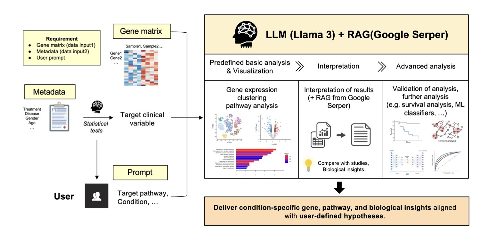
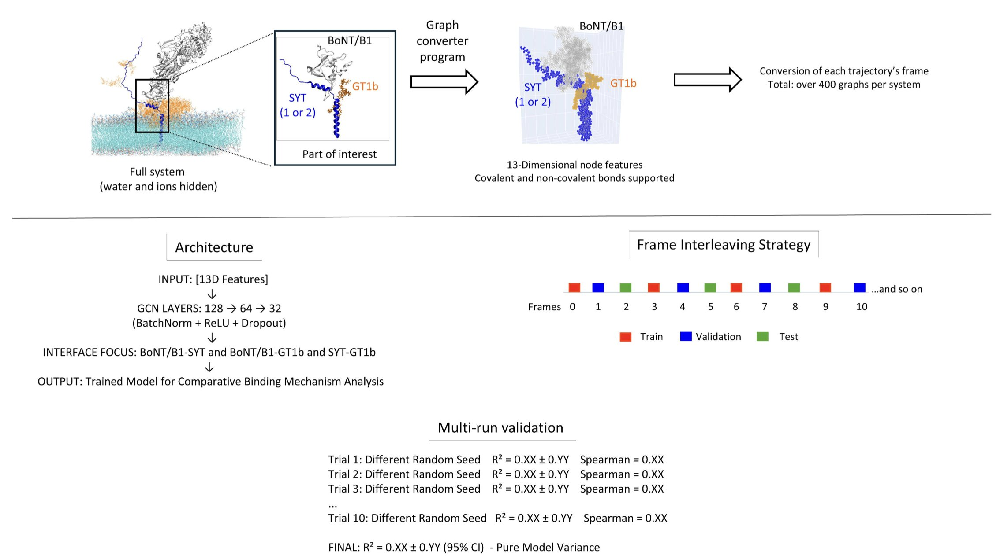
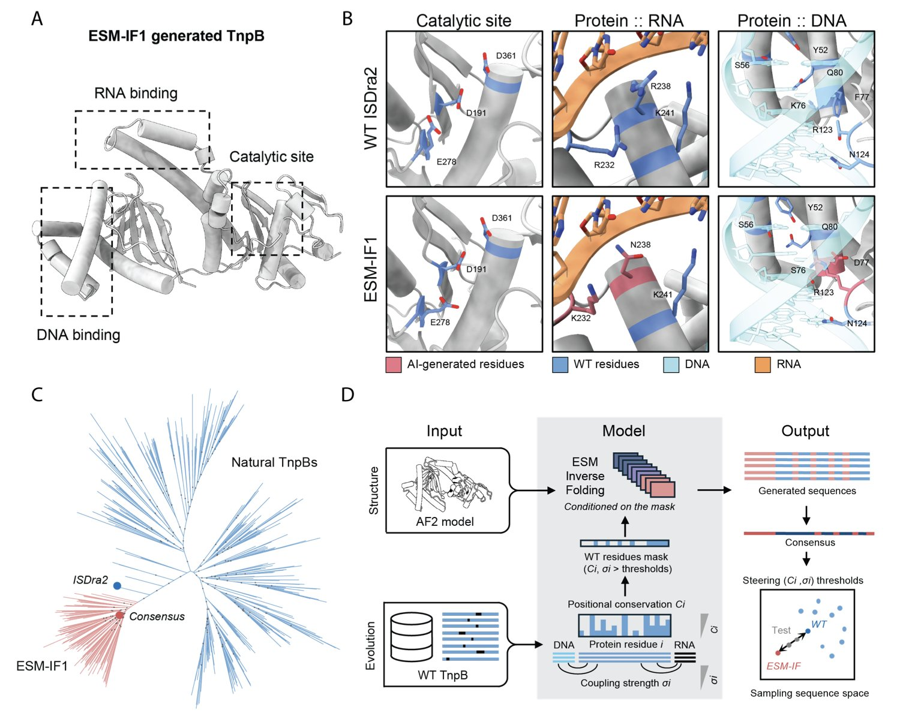
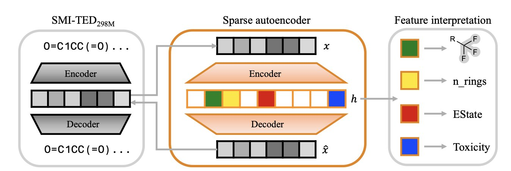
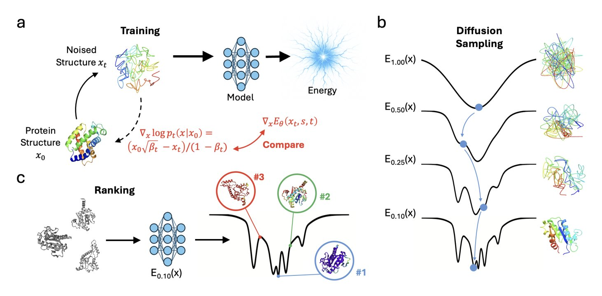
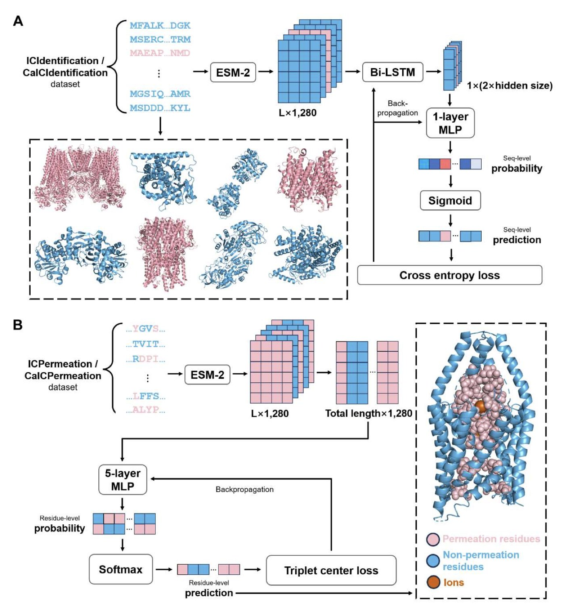

#### 目录  
1. 这款 AI Agent 就像一个内置的生物信息学家，能自主完成从原始数据到生物学洞察的全套 NGS 分析流程。
2. 这是一种新的 AI 框架，它能像拍电影一样，实时分解出分子识别和结合过程中的关键物理作用力，效率极高。
3. 结合 AI 结构预测和进化数据，我们能设计出全新的、比自然界对应物活性更高的基因编辑工具。
4. 通过稀疏自动编码器，我们终于能像解剖大脑一样，将化学语言模型中混杂的知识拆解成可理解、可操控的化学概念，让 AI 从黑箱走向白盒。
5. ProteinEBM 将扩散模型转化为蛋白质的通用能量函数，不仅在结构打分上超越 Rosetta，更在无多序列比对（MSA）的情况下实现了优于 AlphaFold 的从头折叠。
6. ICFinder 利用蛋白质语言模型，不依赖三维结构就能高精度识别离子通道及其关键功能残基，为药物发现开辟了新路径。

## 1. AI Agent 搞定 NGS 分析，不懂生物也能发文章  
  
  

搞生物研究，尤其是做新药研发的，谁没被下一代测序 (Next-Generation Sequencing, NGS) 数据折磨过？实验做完，你会得到一个巨大的基因表达矩阵，然后呢？通常，你需要去找专业的生物信息分析师，把数据和需求交给他们，然后就是漫长的等待。这个过程往往是新药发现项目中的一个关键瓶颈。  
  
这篇论文提出的东西，就是想把这个瓶颈给砸开。他们开发了一个所谓的「智能体 AI」 (Agentic AI) 模型，试图让生物信息分析这件事变得像和人聊天一样简单。  
  
我们来看看它是怎么工作的。  
  
首先，你把数据喂给它。这些数据包括基因表达矩阵和相关的临床信息，比如哪些样本是药物处理过的，哪些是对照组。然后，你用自然语言给它下指令，比如「帮我比较一下用药组和对照组的基因表达差异」。  
  
接下来就是这个 Agent 的表演时间了。它和普通脚本不一样，它会自己「规划」工作流程。  
1.  **它会先做一些基础分析**。比如，通过主成分分析 (Principal Component Analysis, PCA) 看看你的样本能不能根据分组清晰地分开，这能帮你判断数据质量。  
2.  **然后，它执行核心任务**。它会自动运行差异表达分析，找出那些在统计上显著上调或下调的基因，并生成我们都熟悉的火山图 (Volcano Plot)。  
3.  **最关键的一步来了：解读**。只给出一张基因列表没什么用。这个 Agent 集成了一个大语言模型 (Large Language Model, LLM)，具体用的是 Llama 3-70B，并且结合了检索增强生成 (Retrieval-Augmented Generation, RAG) 技术。它会拿着这张差异基因列表，自动去检索相关的科学文献，然后告诉你这些基因可能参与了哪些生物学通路，和你的研究背景有什么联系。它不是简单地列出通路名称，而是会尝试把这些信息整合成一个有逻辑的故事。比如，它可能会告诉你：「上调最显著的基因 A 是 MAPK 通路的关键节点，而现有文献表明，抑制该通路是治疗这类癌症的有效策略。这或许能解释你的药物为何有效。」  
  
这种从数据到洞察的自动化能力，对于不擅长生物信息分析的化学家或临床医生来说，价值巨大。  
  
如果你还想挖得更深，比如用这些基因表达数据建一个预测模型，来判断哪些病人对治疗会产生响应。这个 Agent 也能帮忙。它会推荐合适的机器学习模型，比如生存分析或分类器，并且直接生成可执行的 Python 代码。你几乎不需要懂太多编程，只要把代码复制到你的环境里就能运行。这极大地降低了高级数据分析的门槛。  
  
那么，这东西会取代专业的生物信息学家吗？  
  
我认为短期内不会。它更像一个能力超强的初级分析员，能帮你搞定 80% 的常规分析任务，让专业的分析师能集中精力去解决那 20% 最棘手的问题。  
  
对于药物研发来说，这意味着从拿到测序数据到形成一个可验证的生物学假设，这个周期被大大缩短了。做靶点发现和验证的团队，可以更快地迭代自己的想法。  
  
当然，模型还有提升空间。研究者也提到了，未来会支持多组学数据（比如蛋白质组、代谢组）的整合分析，并且会加入药物响应预测功能。如果真能实现，那它就不仅仅是个分析工具，而是一个真正的药物发现引擎了。  
  
📜Title: Development of an Agentic AI Model for NGS Downstream Analysis Targeting Researchers with Limited Biological Background  
🌐Paper: https://arxiv.org/abs/2512.09964v1  

## 2. AI 新工具 TPS：实时透视分子结合机理，颠覆药物发现  
  
  

在药物研发领域，我们总是在问一个核心问题：两个分子是如何相互识别并结合的？只知道它们结合的强度（亲和力）远远不够，我们想知道的是结合过程中的「故事」——哪个氨基酸在什么时候起了什么作用。传统方法要么看静态的 X 射线晶体结构，要么做大量耗时耗力的分子动力学（Molecular Dynamics, MD）模拟，成本很高。  
  
现在，研究者们开发了一个名为「时间扰动扫描」（Temporal Perturbation Scanning, TPS）的 AI 框架，试图解决这个问题。  
  
它的工作原理是这样的。首先，它利用一次分子动力学模拟，生成一个分子结合过程的「动态电影」。然后，一个图神经网络（Graph Neural Network）会学习这个电影里所有原子间的相互作用。  
  
最妙的部分来了：它会在这个动态过程中，系统地对每个氨基酸残基进行「虚拟突变」（in silico mutagenesis）。这就像在电影的每一帧，都去戳一下某个演员，看看他被戳了之后，整个剧情会发生什么变化。通过观察这种变化，TPS 就能告诉你，在结合的初期、中期和末期，某个特定的氨基酸残基究竟是通过静电吸引、疏水作用还是空间位阻来发挥作用的。  
  
这种方法的价值在于它的效率和深度。以前，如果想知道 10 个氨基酸的作用，你可能需要跑几十次独立的、漫长的模拟。现在，TPS 只需要一次模拟就能提取出同样详细的机理信息。这让没有庞大计算资源的实验室也能进行深入的机理研究。  
  
研究者们把它用在了神经毒素和受体的相互作用体系上。结果很有意思。他们发现，两种结构相似的肉毒杆菌毒素（BoNT/B1）在与两种不同的突触囊泡蛋白（SYT1 和 SYT2）结合时，采用了完全不同的策略。一种是「补偿性组装」，即各个部分灵活互补，协同完成结合。另一种则是「模块化结合」，每个部分像乐高积木一样，独立完成自己的任务。这种细致的洞察对于设计高特异性的药物至关重要。  
  
考虑到不是所有人都能方便地进行分子动力学模拟，作者还提供了一个简化版——TPS-Lite。它直接利用蛋白质数据库（PDB）中的静态结构进行分析，虽然信息量少了些，但对于快速筛选界面上的关键残基或者教学来说，是个非常实用的工具。  
  
这个框架的适用性很广。论文展示了它在蛋白质 - 蛋白质、蛋白质 - 脂质等多种体系中的应用。这意味着无论是做酶工程、药物发现还是研究膜生物学，TPS 都可能成为一个有力的分析工具。  
  
作者认为，TPS 将分子识别从一门「观察科学」转变为一门「工程学科」。这个说法不夸张。当我们能清晰地描绘出分子结合的每一步蓝图时，我们就有可能去主动设计和调控这个过程，而不仅仅是观察和预测结果。  
  
📜Title: Temporal Perturbation Scanning: AI-Driven Deconstruction of Universal Biomolecular Recognition Mechanisms  
🌐Paper: https://www.biorxiv.org/content/10.64898/2025.12.09.692808v1  
💻Code: https://github.com/fodil13  

## 3. AI+ 进化：设计超越自然的基因编辑工具  
  
  

在蛋白质工程领域，我们一直有个梦想：像设计机械零件一样，从头设计一个全新的蛋白质来执行特定任务。但蛋白质太复杂了，氨基酸序列的组合空间是天文数字。多年来，我们更多是像修补匠，在自然界已有的蛋白质上做点小修改。现在，情况开始变了。  
  
这项研究把目光投向了 TnpB，一类 RNA 引导的核酸酶。你可以把它看作是 CRISPR-Cas9 系统一个更小、更古老的祖先。它的优势是小巧，更容易递送到细胞内。研究者们想做的不是小修小补，而是大刀阔斧地重新设计它。  
  
他们的方法很聪明，把两股强大的力量拧在了一起：结构和进化。  
  
首先，他们用上了 AI 驱动的「反向蛋白质折叠」 (inverse protein folding) 技术。这就像你手里有一个完美的 3D 乐高模型（蛋白质结构），然后让电脑反向推算出哪些乐高积木（氨基酸序列）可以拼出这个模型。这个过程能产生海量的、自然界从未见过的序列。  
  
但这里有个大问题：AI 产生的绝大多数序列都是「死的」，折叠不出来，或者折叠出来了却没有生物活性。蛋白质的很多关键功能位点，就像机器上的核心齿轮，一动就坏。  
  
这时，第二股力量——进化，就派上用场了。研究者们分析了 TnpB 家族在漫长进化史中成千上万个天然变体。他们发现，有些氨基酸位置几乎从不改变，这些是维持结构和功能的核心支柱。还有些位置则与 RNA 或 DNA 结合紧密相关。  
  
于是，他们提出了一个「掩蔽策略」 (masking strategy)：在 AI 进行序列设计时，把这些进化上保守的、功能上关键的位置「锁死」，不允许 AI 改变它们。而在其他非核心区域，则放手让 AI 自由发挥，尽情创造。  
  
这套组合拳的效果怎么样？出奇地好。他们设计并测试了大量全新的 TnpB 变体，实验成功率达到了 24%，也就是四分之一的设计是有活性的。更惊人的是，其中 8% 的新酶，活性比天然的野生型 TnpB 还要高。这在细菌、植物甚至人类细胞里都得到了验证。  
  
为了搞清楚这些全新设计的酶为什么能工作，他们用冷冻电 - 镜 (Cryo-EM) 解析了其中一个差异最大、但活性很强的变体的三维结构。结果证实，AI 的设计确实精准地形成了预期的结构。不仅如此，结构分析还揭示了一些新的、用于稳定 RNA/DNA 结合的相互作用，甚至捕捉到了一个以前从未观察到的、与靶标 DNA 结合的关键瞬间。这不仅证明了设计的成功，还加深了我们对 TnpB 工作机理的理解。  
  
这个「结构引导 + 进化约束」的策略，为蛋白质设计开辟了一条新路。它就像给一个极富创造力但有时会天马行空的设计师（AI），配上了一个经验丰富、知道底线在哪里的总工程师（进化数据）。这种方法不仅限于 TnpB，理论上可以推广到其他任何多结构域蛋白质的设计上，为创造全新的生物分子工具提供了强大的武器。  
  
📜Title: Structure and evolution-guided design of minimal RNA-guided nucleases  
🌐Paper: https://www.biorxiv.org/content/10.64898/2025.12.08.692503v1  

## 4. 解密 AI 大脑：SAEs 让化学语言模型变得可解释  
  
  

我们在药物研发中使用大语言模型时，一直有个绕不开的问题：它们就像个黑箱。模型告诉你这个分子有活性、那个分子有毒性，但你问它为什么，它却答不上来。你不知道它到底是学到了真实的化学规律，还是仅仅记住了几个碰巧相关的统计模式。在药物发现这个人命关天的领域，这种「知其然，而不知其所以然」的状态是无法接受的。  
  
现在，一篇新论文为我们递上了一把解剖刀，或者说是一台「大脑显微镜」，它就是稀疏自动编码器 (Sparse Autoencoders, SAEs)。这东西能帮我们撬开化学语言模型 (Chemistry Language Models, CLMs) 的黑箱，看看里面到底是怎么想的。  
  
**SAE 的工作原理很简单**。  
  
想象一下，模型内部对一个分子的「理解」，就像一杯混合了各种水果的果汁。你只知道它是甜的，但分不清里面具体有什么。SAE 的作用，就是把这杯混合果汁重新分离成纯粹的草莓、香蕉、苹果。在化学模型里，这些「纯粹的成分」就是一个个独立的化学概念，比如一个苯环、一个磺酰胺基、或者「高脂溶性」这个属性。  
  
研究者们将一个顶尖的化学模型 SMI-TED 的内部表征，喂给了 SAE。SAE 被设计成「稀疏」的，意思是它在分析任何一个分子时，只能激活其中极少数的几个特征检测器。这种机制会迫使每一个检测器都变得高度专业化，专注于识别一个特定的、有意义的化学概念。  
  
**结果令人兴奋**。  
  
论文中的图表显示，某个 SAE 特征只在包含特定官能团（比如磺酰胺）的分子输入时才会被激活。这就像在模型的「大脑」里找到了一个专门负责识别「磺酰胺」的神经元。  
  
更有意思的是，SAE 构建的这些特征检测器，比模型原生的单个神经元更「纯粹」。模型里的一个神经元可能同时对苯环和羧基都有反应，这种现象叫「多义性」 (Polysemanticity)。SAE 通过组合多个这样的「不纯」神经元，创造出一个只对苯环有反应的「纯粹」特征。正因为如此，它甚至能捕捉到那些在数据集中出现很少，但对成药性至关重要的稀有化学基团。  
  
**从「读懂」到「操控**」  
  
这篇工作最大的亮点在于「特征操控」 (Feature Steering) 实验。这让 SAE 从一个观测工具，变成了一个手术刀。  
  
研究者可以锁定代表某个化学基团的特征，然后命令模型：「给我生成一个类似的分子，但要把这个基团拿掉。」或者「增强这个分子的水溶性。」模型真的就能在保持分子骨架基本有效的前提下，实现这些定点改造。这就证明了这些特征和化学概念之间，不是简单的相关性，而是直接的因果关系。对于药物化学家来说，这意味着我们未来或许能对 AI 设计出的分子进行「精装修」，而不是像现在这样，只能让模型「盲目」地生成一大堆分子再慢慢筛选。  
  
当然，这项技术还处于早期。解读每个特征具体代表什么化学含义，目前还需要大量人工操作。而且，它只在一个模型上得到了验证，能否推广到其他模型和更大规模的化学空间，还是个未知数。  
  
不过，这无疑是 AI 辅助药物发现领域一个扎实的进步。它让我们离真正理解并信任 AI 伙伴的目标，又近了一步。我们终于有办法对 AI 进行「认知神经科学」研究了。  
  
📜Title: Unveiling Latent Knowledge in Chemistry Language Models through Sparse Autoencoders  
🌐Paper: https://arxiv.org/abs/2512.08077  

## 5. ProteinEBM: 用扩散模型定义能量，无 MSA 击败 AlphaFold  
  
  

过去几年，我们见证了 AlphaFold 如何改变结构生物学。但它的一个核心依赖是多序列比对（Multiple Sequence Alignments, MSA），这像是开卷考试，通过海量同源序列的进化信息来推断结构。如果一个蛋白家族很新或者很小，没有足够的序列信息，AlphaFold 的威力就会大打折扣。所以，大家一直在寻找一种更接近「第一性原理」的方法，不依赖进化信息，直接从物理化学规则出发预测结构。这个叫 ProteinEBM 的模型，看起来就在这条路上迈出了一大步。  
  
它的思路很巧妙。我们知道，扩散模型通过不断给数据加噪音再学习如何去噪来生成新数据。ProteinEBM 的研究者们意识到，这个「去噪」过程本身就蕴含了能量信息。一个结构越接近天然构象，它在能量地貌上就越处于「低谷」，模型「修复」它的方向也就越明确。他们把这个去噪的「力」直接定义为能量的梯度。这样一来，整个扩散模型就变成了一个能量函数，或者说一个统计势能（statistical potential）。  
  
这个能量函数有什么用？首先是给蛋白质结构「打分」。你给我一个构象，我能告诉你它有多「合理」。研究者们在 Rosetta decoy set 上做了测试，这个数据集里混杂着正确和错误的蛋白质结构。ProteinEBM 的能量分数与真实结构相似度（TM-score）的斯皮尔曼相关性达到了 0.815。作为对比，经典的 Rosetta 能量函数自己只有 0.757。更重要的是，ProteinEBM 的计算速度快了 10 倍，因为它不需要进行耗时的侧链重排（side-chain packing）。  
  
真正的亮点在于从头折叠（*de-novo* folding）。在没有 MSA 的情况下，他们用郎之万退火（Langevin annealing）算法在 ProteinEBM 定义的能量地貌上进行搜索，然后用 AlphaFold 进行最后的精修。结果，在一些困难的单体蛋白靶点上，平均 TM-score 达到了 0.620。这个数字超过了同样没有 MSA、但尝试了 10000 次随机种子（seed）的 AlphaFold2（0.561），甚至超过了尝试 15000 次的 AlphaFold3（0.512）。这说明，ProteinEBM 提供的能量景观，确实能有效地引导结构搜索走向正确的方向，弥补了 AlphaFold 在信息不足时的短板。  
  
此外，这个模型还能做一些更偏生物物理的事情。比如，它能预测蛋白质突变后稳定性变化（∆∆G），其结果与实验数据的相关性达到了 0.554，这和一些有监督模型相当。它还能重现一些小蛋白的折叠漏斗（folding funnels），这证明它不仅仅是在拟合静态结构，而是在一定程度上学到了驱动蛋白质折叠的能量规律。  
  
我觉得这个模型最核心的优势在于它把打分和采样分开了。AlphaFold 这类模型，生成一个结构就是一次性的端到端过程。而 ProteinEBM 提供的是一个能量场。这意味着，在推理阶段，我们可以投入任意多的计算资源，用更复杂的采样算法去探索这个能量场，理论上就能找到更好的结构。这有点像给你一张藏宝图（能量场），你可以选择开一辆普通吉普车（快速采样），也可以选择派出一支专业的探险队（慢速但精细的采样）去寻宝。这种灵活性，对于设计自然界中不存在的全新蛋白质（*de-novo* design）来说，价值极大。  
  
📜Title: Protein Diffusion Models as Statistical Potentials  
🌐Paper: https://www.biorxiv.org/content/10.64898/2025.12.09.693073v1  
💻Code: https://github.com/jproney/ProteinEBM  

## 6. AI 精准识别离子通道，新药靶点发现提速  
  
  

离子通道 (Ion Channels) 是我们这个行业里公认的「富矿」，许多重磅药物都作用于这类靶点。但它们也是出了名的难啃。一个核心挑战是，即便我们拿到了蛋白质的序列，甚至用 AlphaFold 预测出了三维结构，也很难一眼看出哪些氨基酸残基围成了那个让离子通过的「孔道」 (pore)。确定这些关键残基，对理解通道功能和设计药物至关重要。  
  
现在，一篇新论文介绍了一个叫 ICFinder 的计算框架，它试图用一种新思路来解决这个问题。  
  
它的工作原理是这样的：ICFinder 并没有上来就去分析复杂的三维结构，而是回头利用了最基础的蛋白质序列信息。它把蛋白质序列看作一种「语言」，然后用一个强大的蛋白质大语言模型 (Protein Language Model)，具体来说是 ESM-2，来「阅读」这些序列。  
  
ESM-2 经过海量蛋白质序列的预训练，已经学会了蛋白质语言的语法和语义。这意味着它能理解一个氨基酸在特定序列上下文中的含义。ICFinder 在此基础上进行微调，专门训练它识别两件事：第一，这条序列是不是一个离子通道？第二，如果是，序列里的哪些残基是负责离子通透的？  
  
做这件事有个很大的技术障碍：数据不平衡。在任何一个离子通道蛋白中，真正构成孔道的残基只占一小部分，绝大部分都是「非孔道」残基。如果直接拿来训练，模型很容易就学会偷懒，把所有残基都预测成「非孔道」，准确率看起来还挺高，但完全没用。  
  
研究者在这里用了一个很方法：对比学习 (contrastive learning) 和三重中心损失 (triplet center loss)。你可以把它想象成给模型增加训练难度。它不只是让模型区分「是」与「不是」，而是同时给模型一个「孔道残基」，一个「非孔道残基」，还有一个长得有点像「孔道残基」但实际不是的「干扰项」。通过这种方式，模型被迫去学习那些最细微但最关键的特征，从而真正理解什么是孔道残基。  
  
结果怎么样？ICFinder 的表现非常出色。在多个测试集上，它的性能指标（马修斯相关系数）比现有最好的方法提升了高达 171%。这意味着它的预测结果可靠性有了质的飞跃。  
  
这个工具的价值体现在两个方面：  
  
首先，它能和 AlphaFold3 这样的结构预测工具形成完美互补。AlphaFold 给我们一个静态的 3D 结构模型，像一张建筑蓝图。而 ICFinder 能在这张蓝图上，用红笔圈出哪些是「承重墙」、哪些是「门窗」，也就是功能最关键的残基。两者结合，我们对一个新靶点的理解会快得多。  
  
其次，它摆脱了对实验结构的依赖。这意味着我们可以把它应用到海量的、只有序列信息、功能未知的蛋白质上。研究者已经用它扫描了 UniRef50 数据库，并把预测出的潜在离子通道都放在了公开的网站服务器上。这为寻找全新的药物靶点提供了一个巨大的候选池。  
  
此外，研究者还做了可解释性分析。他们能反过来问模型：「你为什么认为这个残基是孔道的一部分？」模型会高亮出那些对它做出判断最重要的序列特征。这不仅让我们更相信它的预测，也可能启发我们对通道工作机制的新理解。  
  
ICFinder 提供了一个强大、易用的新工具。它利用大语言模型从序列中挖掘功能信息，精准定位离子通道的核心区域，这将直接加速我们发现和验证新靶点的进程。  
  
📜Title: ICFinder: Ion Channel Identification and Ion Permeation Residue Prediction Using Protein Language Models  
🌐Paper: https://www.biorxiv.org/content/10.64898/2025.12.09.693328v1
