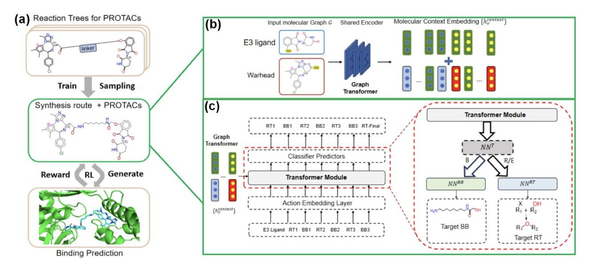
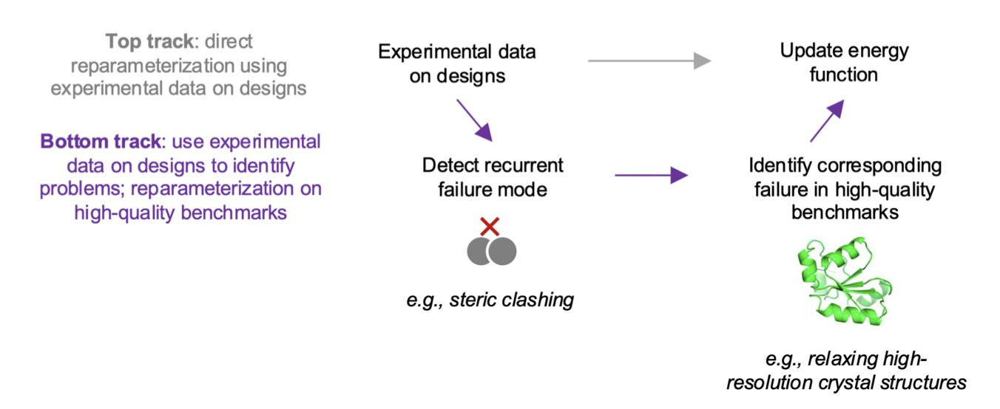
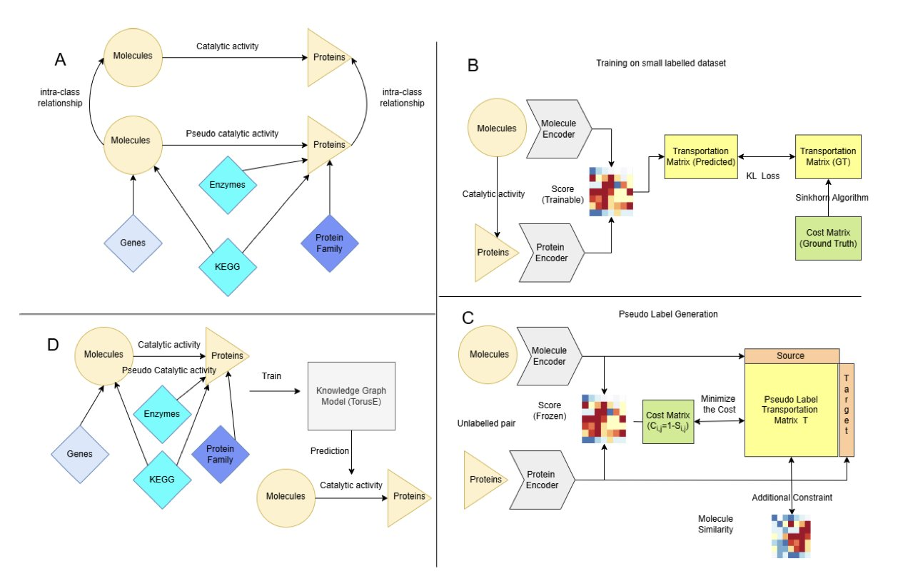
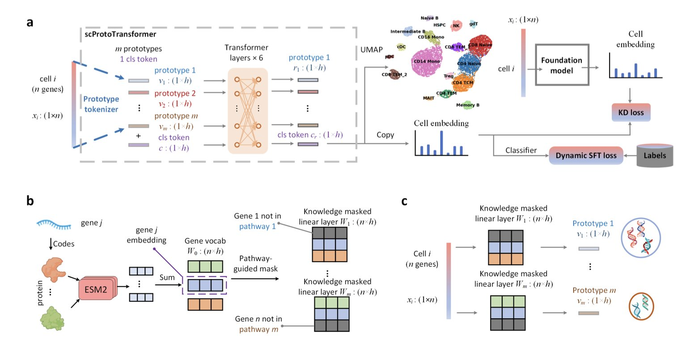
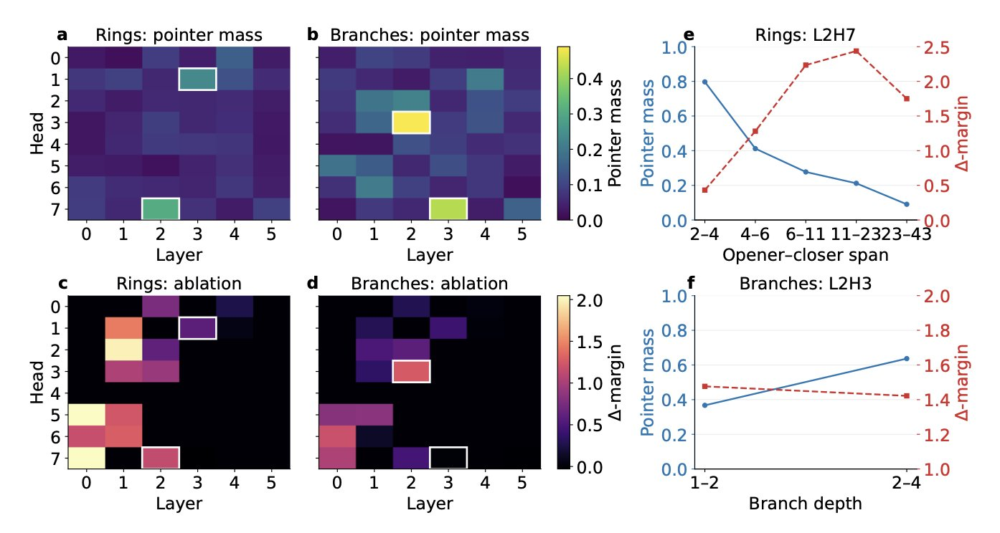
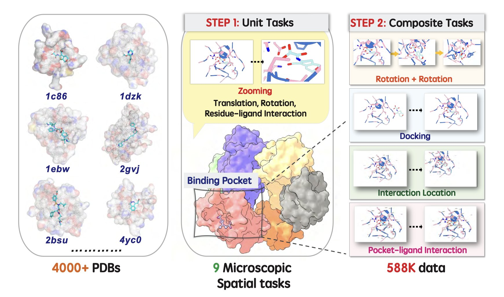

#### Table of Contents
1. SynPROTAC solves a core problem in drug design—the difficulty of synthesizing AI-designed PROTAC molecules—by simultaneously building the synthesis route during generation.
2. By analyzing the experimental failures of de novo designed proteins, researchers identified and fixed a systemic bias in the Rosetta energy function that caused core overpacking.
3. The KGOT framework addresses the scarcity of labeled data by fusing a multimodal knowledge graph with optimal transport pseudo-labeling, significantly improving the accuracy of molecule-protein interaction prediction.
4. This work integrates biological pathway knowledge into a Transformer architecture to build a scalable and interpretable single-cell reference map across molecules, cells, and donors.
5. This paper opens up the "black box" of molecular generation models, not only showing how AI understands chemical grammar but also giving us a knob to directly control its "chemical thinking."
6. Current large Vision-Language Models (VLMs) cannot yet truly understand the three-dimensional spatial structure of molecules, but a smaller, specially fine-tuned model proves that injecting domain knowledge is a key step toward scientific intelligence.

## 1. SynPROTAC: Making AI-Designed PROTACs Actually Synthesizable

Anyone in computational drug design knows the feeling. You run a complex model for days, finally get a molecule with a great score and a perfect-looking structure, and excitedly show it to a synthetic chemist. They glance at it, shake their head, and say, "We can't make this." Or worse: "We can, but it'll take six months and cost you two more postdocs."

This problem is especially acute for PROTACs (Proteolysis-Targeting Chimeras). PROTACs are inherently complex molecules. They're like a dumbbell: one end has to grab the target protein, the other has to grab an E3 ligase, and a linker connects them. All three parts have to be just right, which gives you a lot of design freedom but also causes the synthesis complexity to rise exponentially. If an AI model doesn't consider synthesis, it can easily design "pie-in-the-sky" molecules that look good but never leave the computer screen.

**How SynPROTAC Works**

The SynPROTAC model in this paper has an approach that will appeal to R&D scientists on the front lines. It doesn't design the molecule first and then figure out how to make it. It does the reverse. At every step of the design process, it treats "can this be synthesized?" as a primary constraint.

You can think of it like a chemist playing with Legos. They don't have an infinite supply of bricks, only what's on the shelf (known chemical building blocks). And they can't just stick them together any way they want; they have to follow specific assembly rules (known chemical reactions).

SynPROTAC does exactly this. It starts with a Graphormer encoder to understand the molecule's 3D structural information, then uses a Transformer decoder to make decisions. First, the model picks a suitable chemical reaction from a library of reaction templates. Second, it selects reactant molecules from a huge database of building blocks that can participate in that reaction. It "builds" step-by-step, with each step based on a real, feasible chemical reaction. When the process is finished, a PROTAC molecule has been designed, and its synthesis route has been generated naturally alongside it.

**Making It Work and Making It Good**

Of course, just being synthesizable isn't enough. The ultimate goal is to make an effective drug. If a molecule is easy to make but has zero activity on the target, it's a waste of time.

This is where reinforcement learning comes in. During the molecular construction process, the model constantly predicts the binding affinity of the current structure to the target protein. If a design path looks promising (for example, it has a high binding score), the model gets a "reward" and is encouraged to continue down that path. If a path looks unpromising, the model receives a "penalty" and turns back to try something else.

This reward-penalty mechanism is like training a search dog. It learns through trial and error, eventually figuring out how to precisely find molecules that are both easy to synthesize and have high biological activity.

**What Were the Results?**

The researchers used a score called SYBA to evaluate the synthetic feasibility of molecules; a higher score means it's easier to make. The results showed that SynPROTAC-generated molecules had very high SYBA scores, meaning synthetic chemists won't be frowning when they see them.

At the same time, the physicochemical properties of the generated molecules were very similar to those in the known PROTAC database (PROTAC-DB 3.0), indicating they have basic drug-like properties. More importantly, these molecules are novel, and their predicted binding affinities are better than many known molecules.

For people on the front lines of drug R&D, tools like SynPROTAC are incredibly valuable. It doesn't boast about finding a miracle drug in one shot. Instead, it solves a fundamental bottleneck: bridging the gap between computational design and chemical synthesis. It turns AI from just a blue-sky designer into an experienced chemist who understands the pains of the lab. Tools like this are what will actually speed up our research.

📜Title: SynPROTAC: Synthesizable PROTACs Design Through Synthesis Constrained Generative Model and Reinforcement Learning
🌐Paper: https://www.biorxiv.org/content/10.64898/2025.12.10.693572v1

## 2. Learning from Failure: How the Rosetta Energy Function Evolves

Anyone doing computer-aided drug discovery (CADD) or biomolecular simulation knows their tools aren't perfect. Whether it's molecular docking, free energy perturbation (FEP), or protein design, every model has its quirks and blind spots. The question is, how do we pinpoint these blind spots and systematically fix them? This paper provides a very elegant demonstration.

Their approach is direct: give the model a challenging task, see where it stumbles, and then learn from the failure.

Specifically, the researchers used Rosetta's energy function for the de novo design of new proteins. This is like asking a construction AI to design an unprecedented skyscraper. According to the model's calculations, these proteins should have had the lowest-energy, most stable folded structures.

But the experimental results told a different story. Many of the designed proteins were completely unstable in reality; they just fell apart.

This is where the most critical step comes in. They didn't just throw away the failed designs. Instead, they used deep mutational scanning to carefully study *why* they failed. This technique is like stress-testing every single load-bearing beam in the skyscraper. They discovered that changing just one amino acid in the core region—for instance, swapping a "fat" amino acid for a "skinny" one—could miraculously stabilize the entire protein structure.

This got to the heart of the problem: Rosetta's energy function wasn't penalizing steric clashing enough. It had a tendency to pack the protein's hydrophobic core too tightly, like trying to cram too many clothes into a suitcase. In the computer, atoms can overlap a little and the energy score still looks good. But in the real world, these clashing atoms create tension throughout the structure, causing it to collapse.

This tendency for "core overpacking" wasn't just in their de novo designs. The researchers went back and checked high-resolution crystal structures that had been refined with Rosetta and found the same problem. This showed it was a systemic bias embedded in the energy function's parameters.

Once you find the root cause, the fix is straightforward. They used a set of high-quality crystal structures as the "ground truth" and retrained the energy function's parameters, specifically increasing the penalty for atomic collisions. The result was a new version of the energy function, codenamed `beta_jan25`.

This new version performed better on multiple benchmarks. It not only reduced the core clashing problem but did so without hurting the model's accuracy on other tasks, like structure prediction.

The value of this work goes far beyond just improving Rosetta. It demonstrates a powerful, closed-loop paradigm: computational design → experimental validation → failure analysis → model improvement. This logic is highly informative for improving any complex predictive model, including the popular large language models or protein design AIs of today. It's a reminder that model progress depends not just on bigger datasets and more complex algorithms, but also on contact with the real world and the wisdom gained from learning from failure.

The authors have already integrated the new `beta_jan25` energy function into the Rosetta software package, which is great news for the whole community. They also acknowledge that the model still has other issues to solve, such as an overestimation of polar interactions. But this is undoubtedly a solid step forward.

📜Title: Using Experimental Results of Protein Design to Guide Biomolecular Energy-Function Development
🌐Paper: https://www.biorxiv.org/content/10.64898/2025.12.12.691241v1
💻Code: https://github.com/Haddox/design_guided_optE

## 3. A New Idea for AI Drug Discovery: Using Knowledge Graphs and Optimal Transport to Predict Molecular Interactions

In drug discovery, we're always playing a matching game: finding the "chosen one" from a massive library of molecules that can bind to a specific disease-causing protein. Traditional wet-lab screening is expensive and slow, so people are increasingly turning to computational methods like virtual screening. But there's a persistent problem: training an accurate predictive model requires a lot of high-quality "molecule-protein binding" data, and that kind of data is very scarce.

The KGOT framework proposed in this paper offers a smart solution. It's not a single breakthrough but a two-pronged attack.

**First Move: Build a Giant "Relationship Network"—the Knowledge Graph**

Imagine trying to understand a person. You can't just look at their ID card; you need to know about their family, friends, job, and hobbies. Similarly, to predict whether a molecule and a protein will hit it off, looking at their individual structures isn't enough.

The researchers did something fundamental but extremely important: they integrated six high-quality public databases to connect all the dots between molecules, proteins, genes, and biological pathways, building a massive multimodal Knowledge Graph.

This graph is like a huge map of biological relationships. Even if we don't have direct data on molecule A binding to protein B, the model can find indirect clues through this network. For example, maybe molecule A acts on pathway C, and protein B happens to be a key node in pathway C. Or maybe protein B belongs to the same family as another protein, D, which molecule A is known to bind. This indirect information provides valuable context for the model to make inferences when data is sparse.

**Second Move: Use "Optimal Transport" for High-Quality "Pseudo-Labeling"**

Having the relationship network isn't enough. Model training ultimately needs clear labels ("binds" or "doesn't bind"). When real labels are scarce, a common strategy is Pseudo-Labeling: let the model make predictions on a large set of unlabeled data, then take the high-confidence predictions as "pseudo-labels" and add them back to the training set for "self-learning."

But this method has a risk: if the initial model is inaccurate, the pseudo-labels it generates are "garbage." Training on garbage will only make the model more biased.

This is where KGOT shines. It introduces the Optimal Transport algorithm to ensure the quality of the pseudo-labels. You can think of Optimal Transport as an efficient "mover." The problem it solves is how to move a pile of sand (the model's predicted interaction scores) into a predefined shape (the true distribution of known biological interactions) at the lowest possible cost.

This way, it doesn't just apply a simple threshold (like "label as 'binds' if score > 0.9"). Instead, it looks at the global distribution to ensure that the generated pseudo-labels as a whole align with our prior knowledge of biological systems. The pseudo-labels created this way are higher quality and more reliable.

**How Well Does This Combo Work?**

The experimental results are solid. In both virtual screening and protein retrieval tasks, KGOT outperformed several current mainstream methods. Its advantage is particularly clear in early enrichment—that is, its ability to concentrate more positive hits at the top of the screening list, which is extremely valuable for practical drug screening. It also has good zero-shot learning capabilities, meaning it has the potential to predict interactions for molecules and proteins it has never seen in training.

From an R&D scientist's perspective, KGOT's approach is worth learning from. It doesn't get caught up in fancy model architectures. Instead, it tackles the problem at its data roots, combining sparse biological data with rigorous mathematical tools to solve a very practical pain point. This method not only improves prediction accuracy but also offers a new direction for how we can more intelligently use massive, multi-source biomedical data.

📜Title: KGOT: Unified Knowledge Graph and Optimal Transport Pseudo-Labeling for Molecule-Protein Interaction Prediction
🌐Paper: https://arxiv.org/abs/2512.09365v1

## 4. ScProtoTransformer: Teaching AI to Read Single-Cell Data Using Biological Pathways

Anyone doing single-cell analysis knows we are drowning in data. Massive amounts of single-cell data are generated every day, but how to effectively integrate these "data islands" from different technology platforms, batches, and even individuals to build a unified Reference Map remains a difficult problem. It's like trying to stitch countless partial photos, taken with different cameras under different lighting, into a single, clear panoramic image. The challenge is huge.

A recent paper proposes a model called ScProtoTransformer that offers a very clever solution. It doesn't just throw more computing power at the problem; it tries to teach the model to "think" like a biologist.

The model's core innovation is a "knowledge-guided prototype tokenizer." Let's break that down. Traditional models process gene expression data by reading one letter at a time, making it hard to grasp the meaning of words and sentences. ScProtoTransformer's approach is to first bundle thousands of genes into a few hundred "Prototypes" with clear biological meaning, based on our existing biological knowledge (like KEGG or GO pathways).

Here’s an analogy: the model no longer looks at the individual expression levels of genes A, B, and C as 1.2, 3.4, and 0.5. Instead, it directly sees whether the overall activity of the "NF-κB signaling pathway" prototype, which they form together, is high or low. This has at least two immediate benefits:

1.  **Cleaner Data**. Individual gene expression levels are easily affected by technical noise like batch effects. But the overall trend of dozens or hundreds of genes in a pathway is much more stable, providing a built-in noise reduction feature.
2.  **Interpretable Results**. When the model tells you that the key feature of a cell population is "Prototype 57," you're not left scratching your head. You can look up "Prototype 57" and see it corresponds to the "glycolysis pathway," instantly connecting the computational result to biological meaning. This is crucial for forming new scientific hypotheses.

After solving the input problem, let's look at model training. Training a large model like a Transformer from scratch is computationally expensive, far beyond what most labs can afford. Here, the researchers used another clever trick: knowledge distillation. They had an "expert" foundation model, already pre-trained on a massive dataset, "teach" the ScProtoTransformer "student." This way, ScProtoTransformer doesn't have to repeat the expert's long learning process and can efficiently inherit its learned knowledge, significantly lowering the training barrier.

So, how does this "quick and smart learner" perform in practice? The paper's benchmarks show that at the molecular level (gene embedding), cell level (cell type annotation), and the higher donor level (integrating samples from different donors), ScProtoTransformer's performance matched or even exceeded the current top methods in the field.

Even more impressive is its versatility. It can handle not only standard single-cell transcriptomics data but is also effective at integrating different modalities (like CITE-seq) or processing spatial transcriptomics data. When dealing with spatial data, it doesn't even need to rely on spatial coordinate information. It can uncover biologically relevant spatial features based on gene expression patterns alone. This suggests the model has truly captured the underlying biological principles in the data, rather than just relying on superficial physical information.

ScProtoTransformer's approach represents a trend: moving away from blindly applying deep learning black-box models to biological data, and instead, purposefully integrating prior knowledge from biology into the model's architecture. This makes the models not only powerful but also efficient and interpretable. For researchers on the front lines, these are the tools we really need.

📜Title: ScProtoTransformer: Scalable Reference Mapping Across Molecules, Cells and Donors
🌐Paper: https://www.biorxiv.org/content/10.64898/2025.12.06.692735v1

## 5. Dissecting the AI Chemist: The Thought Circuits of a Molecular Transformer

Those of us in computational chemistry and drug discovery use various deep learning models every day. Tools like the molecular transformer are very good at generating new molecules, but we've always used them as a "black box." You give it a task, it gives you results, but we knew very little about how it was "thinking" internally. This work is like lifting the hood on this complex machine for the first time, letting us see how the gears turn inside.

First, the researchers solved a basic question: how does the AI learn the grammar of a chemical language like SMILES? SMILES uses parentheses `()` for branches and numbers (like `1` and `2`) to mark the opening and closing of rings. One mistake, and the whole molecular structure is invalid. This paper found that specific attention heads in the transformer model are dedicated to this job. They act like "pointers": one attention head connects an opening parenthesis to its corresponding closing one, while another pairs up the atoms that form a ring. This shows the model isn't just memorizing patterns; it has actually learned the grammatical rules of the language.

Going deeper, they investigated how the model understands a fundamental chemical concept like valence. For example, carbon typically forms four bonds. The researchers found that in the model's high-dimensional internal space, there is a specific "direction" that represents valence capacity. If you push an atom's internal representation along this direction, the model becomes more likely to predict a double or triple bond in the next step. Pushing it in the opposite direction favors a single bond. This is very cool. It's as if we've found a "knob" to control valence, allowing us to fine-tune the model's output to ensure chemical rules are followed as it generates a molecule.

So how were these "pointers" and "knobs" found? They used a tool called Sparse Autoencoders (SAEs). You can think of a transformer's complex internal activations as a rich, but complicated, soup. An SAE acts like a super-filter that can separate out the most critical and essential "flavors"—the interpretable features. The results were surprising. Many of these extracted features correspond directly to concepts familiar to chemists, like a benzene ring, a carbonyl group, or a specific heterocycle. It's like we've installed a translator on the AI's "subconscious," turning its vague internal language into chemical terms we can understand.

These findings aren't just for academic curiosity; they have real practical value.

First, using these SAE-extracted features for downstream tasks, like predicting molecular activity, works even better than using commonly used Morgan fingerprints. This means the features the AI learns on its own capture the essence of a molecule better than the features we design ourselves.

Second, and most exciting, we can use these features to "guide" molecule generation. For instance, say we want to optimize a lead compound. We want the new molecules to keep certain key scaffolds while exploring new side chains. Traditional methods might require complex model retraining. Now, we can just tell the model: "Please generate some new molecules with more 'aromatic ring' features and fewer 'flexible chain' features." The model can explore in the direction we want in real time, without changing any of its weights. This gives medicinal chemists an unprecedented tool for interactive molecular design with an AI.

📜Title: Circuits, Features, and Heuristics in Molecular Transformers
🌐Paper: https://arxiv.org/abs/2512.09757

## 6. Can AI Understand 3D Molecules? A New Benchmark, MiSI-Bench, Reveals the Gap

As drug discovery professionals, we work with molecular structures every day. We use software like PyMOL or Chimera to rotate and zoom, trying to understand a molecule from different angles and find potential binding sites on a target protein. This is a kind of 3D spatial intuition, developed over years of training.

The question now is, can Vision-Language Models (VLMs) like GPT-4V, which can recognize almost anything in the world, have this kind of "spatial sense" at the microscopic level? Can they "see" and understand a molecule like a chemist does?

A recent study, using a new benchmark test called MiSI-Bench, gives us a clear answer: not yet, but the potential is huge.

#### The Gap Between Macro Vision and Micro Rules

VLMs are powerful because they have learned from massive amounts of image and text data. A VLM can recognize a cat because it has seen thousands of pictures of cats. But the molecular world is completely different.

When you look at a picture of a molecule, you're not just seeing how atoms and bonds are connected. Your mind immediately conjures its 3D conformation, which groups can rotate freely, where hydrogen bonds might form, which parts are hydrophilic, and which are hydrophobic. Much of this information isn't visible in a static 2D image; it's governed by a whole set of physical and chemical rules.

General-purpose VLMs lack this underlying knowledge. They might see a molecular image as just a collection of lines and spheres, without understanding the chemical meaning behind the arrangement. This causes them to make absurd mistakes on questions that are simple for a chemist.

#### MiSI-Bench: A Precise Ruler

The design of MiSI-Bench is to break down this complex "spatial sense" into a series of specific, quantifiable tasks. It doesn't just ask "What molecule is this?" like a standard image recognition test. It asks deeper questions, such as:

*   Are these two molecules stereoisomers or the same compound?
*   Are these two images different conformers of the same molecule?
*   What would this molecule look like if we rotated this specific bond by 90 degrees?

It's like a customized competency test for an AI chemist. The researchers used this benchmark to evaluate some of the top VLMs, including GPT-4V and Gemini. As expected, their performance was far below human level. This confirms the suspicion: general visual training does not directly transfer to the microscopic world, which requires precise physical rules.

#### Domain Knowledge is Key

The most interesting part of this work is that they fine-tuned a 7B-parameter model on the MiSI-Bench data. As a result, this "small" model's performance improved dramatically, even surpassing human experts on some spatial transformation tasks.

What does this tell us? It shows that the VLM architecture itself is capable of learning 3D spatial relationships, but it needs the right "textbook." Fine-tuning on specialized data is like giving the model an intensive course in molecular structure and chemical principles.

The hydrogen bond recognition task mentioned in the study is a classic example. A hydrogen bond isn't just "two atoms are close together"; it has strict requirements for the donor, acceptor, and the angle between them. A general VLM doesn't know this, but a fine-tuned model can learn it.

The takeaway is that the path to a scientific AGI may not be through one single, all-encompassing super-model. Instead, it may require "distilling" precise domain knowledge and injecting it into models. Work like MiSI-Bench gives us a ruler to measure progress, letting us know what a model has actually learned and what it still doesn't know. For drug discovery, this means we can train AI assistants that have a better understanding of chemistry and biology, helping us analyze structures and design molecules faster.

📜Title: From Macro to Micro: Benchmarking Microscopic Spatial Intelligence on Molecules via Vision-Language Models
🌐Paper: https://arxiv.org/abs/2512.10867v1
