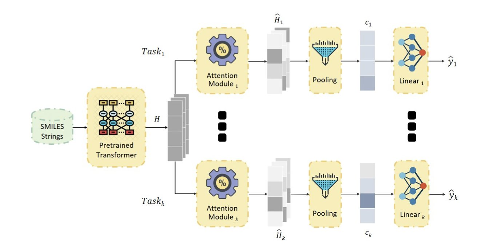
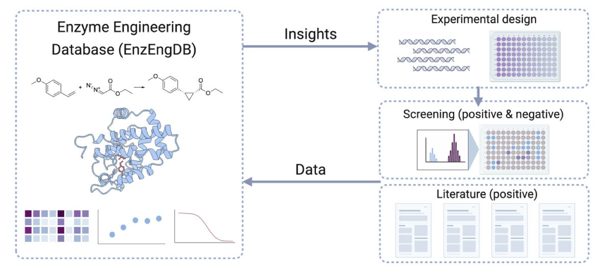
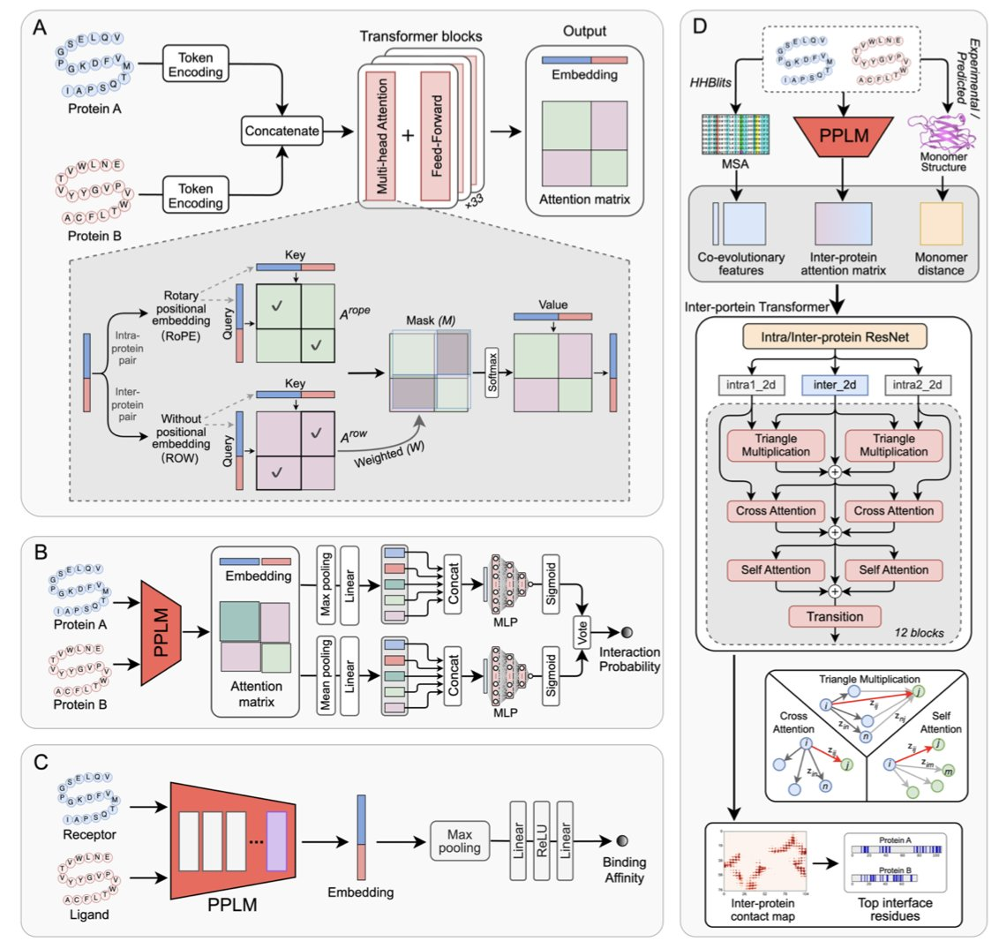
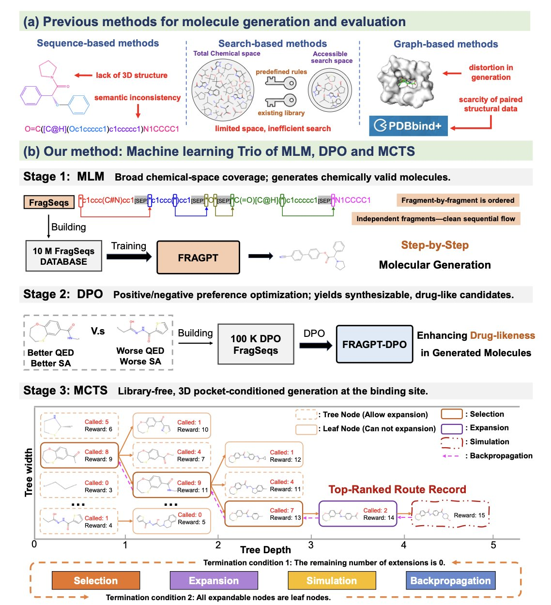
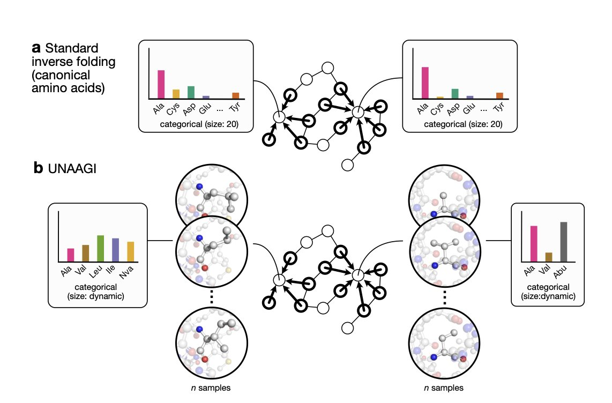
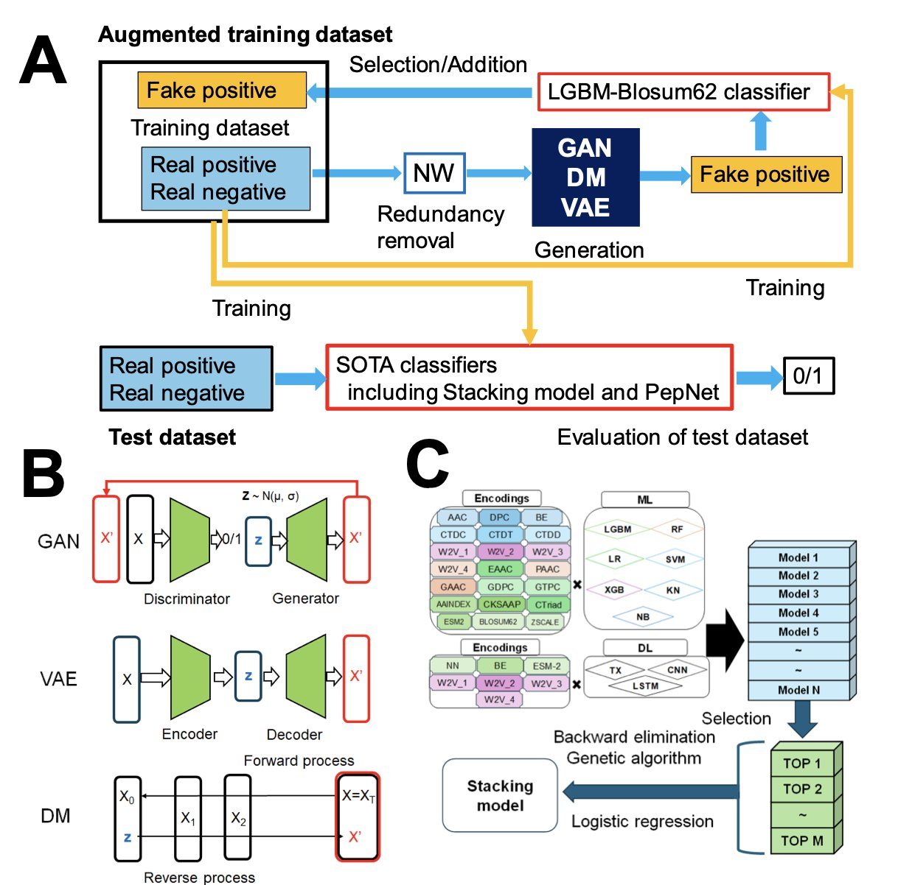

#### 目录  
1. 通过给多任务学习模型戴上特制的「稀疏面具」，我们不仅提升了毒性预测的准确性，还首次看清了 AI 做出判断的化学依据。
2. EnzEngDB 提供了一个集数据存储、3D 可视化分析和 AI 数据提取于一体的平台，解决了酶工程领域数据分散和利用效率低的痛点。
3. 这项工作展示了，一个专门为蛋白质对设计的语言模型，仅从序列就能高效预测相互作用、亲和力及结合界面，在某些任务上甚至优于依赖结构的方法。
4. Trio 框架将三种 AI 技术巧妙结合，解决了传统生成模型的老大难问题，让 AI 设计的分子更像「人」设计的，也更有成药潜力。
5. UNAAGI 模型通过原子级扩散，让 AI 能设计含非天然氨基酸的蛋白质，这本质上是将小分子药物设计的思路，应用到了蛋白质工程领域。
6. 用生成式人工智能（特别是 GAN）来扩增小分子肽数据集，可以显著提升功能预测模型的准确性，尤其是在实验数据有限的情况下。

## 1. AI 预测分子毒性：不仅更准，还能看懂  
  
  

做计算毒理预测，我们经常会遇到一个很头疼的问题：模型告诉我们这个分子「有毒」，但它不解释为什么。这就好像一个资深的老法医只给结论，却不告诉你推理过程，这让一线的药物化学家没法干活。我们想知道的，是分子上哪个部分是「罪魁祸首」。  
  
这篇论文提出了一个很巧妙的解决方案。  
  
首先，研究者用了一个叫做多任务学习 (Multi-task Learning, MTL) 的框架。你可以把它想象成同时教一个 AI 模型识别多种不同的毒性。比如，同时教它判断肝毒性、心脏毒性、致癌性等等。这样做的目的是让模型学会化学结构与毒性之间更普适的、更底层的规律，而不是针对某个单一任务死记硬背。  
  
但多任务学习有个老毛病，就是「负迁移」 (negative transfer)。有时候，学习 A 任务的知识反而会干扰 B 任务的判断。这就像一个学生学了太多杂七杂八的东西，结果考试的时候张冠李戴。  
  
这篇论文的第一个亮点就是解决了这个问题。他们设计的架构是这样的：所有任务共享一个强大的化学语言模型作为「大脑」，用来理解分子的基本化学语言。然后，针对每一种毒性任务，都给它配一个独立的「注意力模块」。这个大脑负责输入，各个注意力模块负责在自己的领域里输出。这样一来，大家既能共享知识，又不会互相打架。  
  
第二个，也是最核心的亮点，是他们给每个注意力模块加了一个 L1 稀疏惩罚。这个听起来很专业，但原理很简单。你可以把它想象成给模型一支「墨水很贵」的笔。模型在分析分子结构时，不能随意涂鸦，必须把有限的「墨水」用在刀刃上，也就是只标记出与特定毒性最相关的那个或那几个原子团。  
  
结果出人意料。通常我们认为，给模型加的限制越多，它的性能（比如准确率）就会下降。但在这里，这个「稀疏面具」不仅让模型的预测结果变得可以解释了——我们可以清楚地看到它到底关注了分子的哪个部分——还让模型的预测变得更准了。  
  
为什么会这样？因为它迫使模型去学习真正的因果关系，而不是依赖于数据中的某些巧合。模型不再是记住「长这样的分子都有毒」，而是学会了「因为分子里有这个硝基芳环，所以它可能有这种毒性」。  
  
你看这张图里的可视化结果。对于同一个分子，在预测不同毒性终点时，模型关注的区域完全不同。这完全符合一个药物化学家的直觉。更厉害的是，对于不同的分子，只要它们含有相同的「毒性基团」（toxicophore），模型就能准确地把它们识别出来。  
  
这意味着什么？这意味着我们手里的工具，正从一个只会给出「是」或「否」答案的黑箱，变成一个可以和我们对话的智能伙伴。它能告诉我们：「我认为这个化合物有肝毒性风险，问题可能出在它的这个酰胺结构上，你要不要考虑修改一下这里？」  
  
这才是 AI 辅助药物研发真正该有的样子。它提供的不是一个冷冰冰的分数，而是可以指导我们进行下一步分子设计的、有化学意义的洞见。  
  
📜Title: Task-Specific Sparse Feature Masks for Molecular Toxicity Prediction with Chemical Language Models  
🌐Paper: <https://arxiv.org/abs/2512.11412v1>  

## 2. EnzEngDB：集成数据与 AI，加速酶工程创新  
  
  

做酶工程的人都有一个共同的烦恼：数据太散了。  
  
每个实验室、每篇论文里的数据都像一座孤岛。我们做了几十个突变体，测量了它们的活性、稳定性，这些宝贵的数据最后大多只留在了实验记录本或者论文的补充材料里。想把不同研究的数据拿来做个比较，或者系统性地分析一下哪些突变真正起作用，几乎是不可能完成的任务。  
  
EnzEngDB 这个新平台看起来是冲着解决这个核心问题来的。它不只是一个存放数据的仓库，而是一个真正为酶工程研发流程设计的工具。  
  
首先，它建立了一个标准化的数据框架。一个酶工程项目最核心的信息，比如氨基酸序列、催化的反应（用反应 SMILES 表示，这很关键），以及衡量性能的指标（比如产量、kcat/Km），都可以被系统地记录下来。这意味着，如果你在研究一个特定的酶家族，比如酮还原酶，你可以把不同来源的几十个突变体数据整合在一起，进行横向比较。这在以前需要耗费数周时间去翻阅文献，现在一个平台就搞定了。  
  
它真正的亮点在于那个交互式的 3D 可视化分析工具。这是最能打动一线研发人员的功能。假设你筛选到 10 个活性提高的突变体，单纯看一个像 `A123G`, `F45Y` 这样的突变列表，你很难发现规律。但如果把这些突变位点直接标记在蛋白质的三维结构上，情况就完全不同了。你可能会立刻看到，所有高活性的突变都集中在底物结合口袋的入口处。这个发现马上就能给你下一个实验提供清晰的方向：或许应该系统性地改造这个入口，来优化底物的进出。这种从数据到结构再到新假设的闭环，是加速研发的关键。它把抽象的序列信息，变成了直观的、可操作的结构见解。  
  
另一个聪明之处是他们用上了大语言模型（Large Language Models, LLMs）来自动从文献中提取数据。手动整理文献数据是一项极其枯燥且耗时的工作，也是所有数据库建设的瓶颈。研究者们训练 LLM 去阅读论文，并把关键的序列 - 功能关系数据提取出来。为了保证质量，他们还专门建立了一个「黄金标准」数据集来验证 AI 的准确性。虽然 AI 不可能做到 100% 完美，但哪怕它能完成 80% 的初步整理工作，也极大地解放了人力，让数据库的更新速度和覆盖范围有了质的飞跃。  
  
最后，作者考虑到了数据的私密性问题，平台同时支持公共和私有化部署。公司内部的敏感数据可以在本地服务器上使用这套工具进行分析，而公开的数据则可以贡献给社区。这种模式很务实，有利于工具的推广。一个好的数据库需要社区的共同建设，EnzEngDB 提供了一个很好的起点。  
  
📜**Title**: Enzyme Engineering Database (EnzEngDB): a platform for sharing and interpreting sequence–function relationships across protein engineering campaigns  
🌐**Paper**: https://academic.oup.com/nar/article/doi/10.1093/nar/gkaf1142/8373944  

## 3. PPLM：AI 不看 3D 结构，也能预测蛋白如何「社交」？  
  
  

在药物发现领域，我们总是在玩一个极其复杂的乐高游戏。我们想知道两个蛋白质「积木」能否拼在一起，拼得有多牢固，以及它们的接触点在哪里。传统上，我们认为必须先拿到每个积木的精确 3D 蓝图（蛋白质结构），才能回答这些问题。获取结构既昂贵又耗时。AlphaFold 解决了单个积木的蓝图问题，但理解两个积木如何互动，又是另一座大山。  
  
现在，一篇新论文提出的蛋白质对语言模型 (Protein-Protein Language Model, PPLM) 似乎在说：也许我们不需要那么依赖 3D 蓝图。  
  
**核心思路：从「独白」到「对话**」  
  
过去的蛋白质语言模型，比如明星级的 ESM2，更像是语言学家在分析单个人的演讲稿。它们能很好地理解单个蛋白质的语法和词汇（氨基酸序列），但要让它们理解两个蛋白质之间的「对话」，就有点勉为其难。它们只能分别读取两个「演讲稿」，然后猜测这两人是不是在交流。  
  
PPLM 的做法完全不同。它把两个蛋白质的序列从一开始就放在一起，让模型直接学习它们共同的语言模式。这就像是让 AI 直接去听一段两人对话的录音，而不是分别听两个人的独白。模型内部的注意力机制 (attention mechanism) 也被设计成混合模式，既能关注每个蛋白自身的内部结构信息（intra-protein），也能同时关注两个蛋白之间可能产生互动的区域（inter-protein）。这样一来，模型就能在无监督的预训练中，自己「悟出」哪些氨基酸残基是跨蛋白交流的关键。  
  
**实战效果怎么样**？  
  
这项研究用 PPLM 分别构建了三个专用模型，来回答我们最关心的三个问题：  
  
1.  **它们会结合吗？(PPLM-PPI**)  
    这个模型就像一个分子「婚介所」。结果显示，它在判断两种蛋白是否会相互作用方面，达到了顶尖水平，并且在不同物种的数据集上都表现稳定。这对绘制细胞内复杂的信号网络、寻找新的药物靶点至关重要。  
  
2.  **结合有多强？(PPLM-Affinity**)  
    这部分最让做药的人兴奋。预测结合亲和力是药物设计的核心，难度也极大。PPLM-Affinity 不仅超过了 ESM2，甚至在一些测试中击败了依赖 3D 结构的方法。特别是在抗体 - 抗原这种柔性大、构象变化多的复合物上，它的表现尤其亮眼。这意味着我们或许可以用一种计算成本更低、速度更快的方式，来大规模筛选和优化抗体药物。  
  
3.  **在哪里结合？(PPLM-Contact**)  
    知道了会结合，我们还得知道具体的结合位点，才能设计小分子或多肽去干预。PPLM-Contact 在预测蛋白间接触残基方面的表现，同样超越了现有方法。  
    更有意思的是，研究者们还做了一个升级版 PPLM-Contact2。他们把 PPLM 从序列中学到的「互动知识」（interaction-aware features），与 AlphaFold 预测的复合物结构信息融合在一起。结果如何？这个「混血」模型在接触预测任务上，居然打败了最新的 AlphaFold2.3 和 AlphaFold3。  
  
一个重要的趋势：纯序列模型和纯结构模型可能都不是终点。真正的强大来自于将两者智能地结合起来。序列模型可以高效地从海量数据中学习互作的「化学直觉」，而结构模型则提供了物理空间的精确约束。  
  
对于药物研发一线的人来说，PPLM 这样的工具价值巨大。它意味着我们可以在实验前进行更大规模、更快速的虚拟筛选，来缩小候选范围，把宝贵的实验资源集中在最有希望的分子上。这再次证明，优秀的 AI 模型能够从看似简单的一维序列信息中，挖掘出深刻的、关乎三维世界互作的物理化学规律。  
  
📜Title: A Corporative Language Model for Protein–Protein Interaction, Binding Affinity, and Interface Contact Prediction  
🌐Paper: https://www.biorxiv.org/content/10.1101/2025.07.07.663595v2  

## 4. Trio 框架：AI 分子发现新思路，设计更优药物  
  
  

做药物发现，我们经常和各种 AI 生成模型打交道。这些模型能快速给出海量的新分子结构，但很多时候，它们就像一个不懂化学规则的艺术家，画出的分子要么合成起来极其困难，要么成药性一塌糊涂。我们拿到这些结果，往往还得花大量时间去筛选和修改。  
  
最近看到一篇新文章，提出了一个叫 Trio 的框架，思路很有意思。它没有发明一个全新的算法，而是把三个成熟的技术——片段语言模型、强化学习和蒙特卡洛树搜索——像搭乐高一样组合起来，试图解决前面说的那些问题。  
  
**第一步：用化学家的语言来构建分子**  
  
Trio 的基础是一个叫 FRAGPT 的语言模型。它和传统的生成模型有个本质区别：它不是一个原子一个原子地拼接分子，而是用「分子片段」作为基本单元。  
  
这就像我们化学家思考问题的方式。我们设计分子时，脑子里想的是苯环、酰胺键、羟基这些功能基团，而不是单个的碳原子或氧原子。用片段来构建，有几个直接的好处：  
1.  **化学合理性更高**：因为片段本身就是稳定存在的化学结构，所以拼接出来的分子更不容易出现奇怪的键角或不稳定的结构。  
2.  **效率更高**：用大模块盖房子，肯定比用沙子一粒一粒堆要快。  
  
这个 FRAGPT 模型在数百万个已知分子的 SMILES 式上进行了训练，学会了分子片段之间正确的「语法」。  
  
**第二步：给模型一个清晰的「好分子」标准**  
  
有了构建分子的能力，接下来就要告诉模型，什么样的分子才是我们想要的「好分子」。这就是强化学习 (Reinforcement Learning, RL) 的用武之地。  
  
研究者设定了一个奖励函数，这个函数包含了我们最关心的几个成药性指标，比如类药性 (QED) 和合成可及性 (SA)。  
  
通过这种方式，模型在生成新分子的过程中，会自发地向着成药性更好的方向「进化」。  
  
**第三部：在巨大的化学空间里聪明地搜索**  
  
化学空间的浩瀚程度超乎想象。如果我们只是让模型漫无目的地生成，很容易陷入局部最优，也就是反复生成一些相似的高分分子，却错过了其他更有潜力的全新骨架。  
  
Trio 引入了蒙特卡洛树搜索 (Monte Carlo Tree Search, MCTS) 来解决这个问题。这个算法因为在 AlphaGo 中一战成名而被大家熟知。  
  
这种策略性的搜索，确保了 Trio 不仅能优化已知的优秀结构，还能高效地发现全新的、有潜力的化学骨架 (chemotypes)。  
  
从结果来看，Trio 的表现确实不错。和现有的一流模型相比，它生成的分子在结合亲和力、类药性和合成可及性上都有显著提升，分别提高了 7.85%、11.10% 和 12.05%。更关键的是，分子多样性扩大了四倍。这意味着它真的在探索更广阔的化学空间。  
  
总的来说，Trio 提供了一个更接近我们实际工作流的闭环系统。它用化学家熟悉的片段语言构建分子，用明确的成药性指标进行引导，再用搜索策略去发现新大陆。这种「人机协作」的思路，也许能让 AI 生成的分子，更快地从电脑屏幕走向实验室的烧瓶。  
  
📜Title: Toward Closed-loop Molecular Discovery via Language Model, Property Alignment and Strategic Search  
🌐Paper: https://arxiv.org/abs/2512.09566v1  

## 5. UNAAGI: AI 在原子层面设计非天然氨基酸  
  
  

在蛋白质工程领域，我们过去的工作很像是在玩一套只有 20 种标准积木的乐高。虽然能搭建出各种奇妙的结构，但想象力总归受限于这 20 种基本单元。引入非天然氨基酸 (non-canonical amino acids, ncAAs)，就相当于给这套乐高补充了成百上千种特殊形状的积木，潜力巨大。但问题也随之而来：这么多新积木，该往哪里放才能恰到好处？  
  
传统的计算方法，在处理这 20 种标准氨基酸时还算得心应手，可一旦遇到 ncAA 就常常束手无策。因为它们大多将氨基酸残基看作一个整体，而不是一堆原子。  
  
现在，这个叫 UNAAGI 的新模型提供了一个全新的解法。  
  
它的工作原理很直接。它不像传统方法那样，试图在已有的结构上做「积木替换」，而是更彻底：直接抹掉某个位置的氨基酸，然后在原子层面，一点点地「重新画」出来。这就是所谓的扩散模型 (diffusion model) 的思路，从一团无序的原子坐标开始，逐步生成一个化学上合理、结构上匹配的侧链。  
  
这个模型是一个 E(3) 等变 (E(3)-equivariant) 框架。用大白话说，就是它懂 3D 空间。你把整个蛋白质在空间里旋转一下，它依然知道哪个氨基酸最适合那个位置。这是任何严肃的结构生物学模型都必须具备的基本素养。  
  
让我觉得巧妙的是它处理不同大小侧链的方式。你想想，一个甘氨酸的侧链只有一个氢原子，而一个色氨酸的侧链则是一个庞大的芳香环。想让同一个模型处理这两种尺寸差异巨大的东西，非常棘手。研究者用了一个「虚拟节点」 (virtual node) 策略来解决。这就像是在搭建结构前，先放一个通用的「占位符」，让模型先学习这个位置需要什么样的化学性质和空间形状，然后再根据这些信息去生成具体的原子。这是一个很工程设计。  
  
当然，模型再漂亮，最终还是要看效果。研究者的数据显示，在处理 ncAA 时，UNAAGI 的性能比当前最好的方法还要好。更关键的一点是，它的预测结果和真实的实验数据有不错的相关性。这说明它不是在自说自话，而是确实捕捉到了一些底层的物理化学规律。  
  
对我来说，这篇工作最有启发性的一点是，它模糊了蛋白质工程和结构化药物设计的边界。本质上，这两个领域都在解决同一个问题：如何在一个蛋白质的特定口袋里，找到一组合适的原子来执行特定功能。UNAAGI 所做的，其实就是把药物设计中基于原子、基于 3D 结构的思路，成功地应用到了构建蛋白质本身这件事上。  
  
这预示着一个方向：未来，我们设计新蛋白质，可能会越来越像我们现在设计小分子药物一样，精确到每一个原子的相互作用。  
  
📜Title: UNAAGI: Atom-Level Diffusion for Generating Non-Canonical Amino Acid Substitutions  
🌐Paper: https://arxiv.org/abs/2512.10515v1  

## 6. AI 造数据，预测免疫肽新思路  
  
  

在肽类药物的发现中，我们总会遇到一个老问题：手头上的阳性数据太少。没有足够的数据，机器学习模型就很难学到东西，预测效果自然大打折扣。  
  
这篇论文的作者们想了个办法：既然真实数据不够，那就用生成式人工智能（Generative AI）自己「造」一些。  
  
他们这个框架叫 GDA-Pred。具体来说，他们试了三种当下热门的生成模型：生成对抗网络（GANs）、扩散模型（diffusion models）和变分自编码器（VAEs）。你可以把这想象成雇了三个不同风格的「学徒」，来模仿大师（也就是已知的活性肽）的作品。  

结果怎么样？GANs 胜出了。它生成的序列不仅看起来「像那么回事」，而且多样性也足够好。这对我们训练模型至关重要，因为我们不希望新数据只是对老数据的简单复制粘贴，而是要能填补序列空间中的空白地带，让模型的决策边界更平滑、更合理。  
  
这里有个很巧妙的设计。作者们没有直接在目标数据集（IL-6 和 IL-13 诱导肽）上调整模型参数，因为数据太少，这样做很容易过拟合。他们先拿了一个中等大小的抗炎肽（AIPs）数据集来「练手」，把序列一致性、概率阈值这些关键参数的最佳设置找出来。这种做法就像在校准仪器，先用一个标准品把参数定好，再拿去测未知样本，结果自然更可靠。  
  
当然，只说不练是不行的。他们用了严格的分层 5 折交叉验证来评估效果，而且为了防止训练集和测试集之间有「亲戚关系」导致性能虚高，还做了基于序列相似度的聚类划分。这保证了模型看到的测试数据是真正「陌生」的。  
  
结果显示，经过 GDA 扩增数据训练的模型，在预测 IL-6 和 IL-13 诱导肽方面的性能大幅提升，把传统的数据扩增方法，比如 SMOTE 和 KDE，都甩在了后面。  
  
这意味着，即使我们只有少量实验数据，也有可能训练出强大的预测模型。对于很多冷门靶点或者新的肽功能研究来说，这无疑是个好消息。它能帮我们更快地从海量序列中筛选出有潜力的候选分子，加速早期药物发现的进程。  
  
📜Title: GDA-Pred: Generative AI-Driven Data Augmentation for Improved Prediction of IL-6 and IL-13 Inducing Peptides  
🌐Paper: https://www.biorxiv.org/content/10.64898/2025.12.07.692883v1
