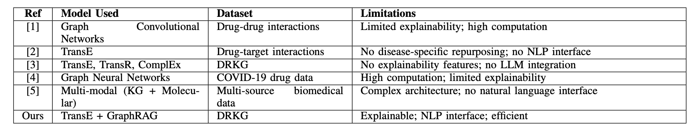
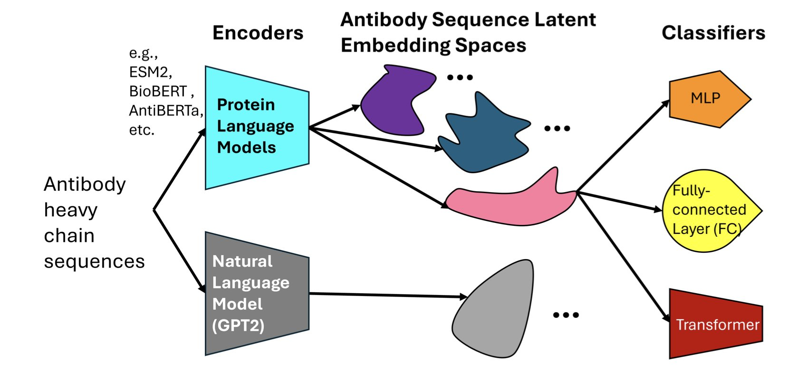
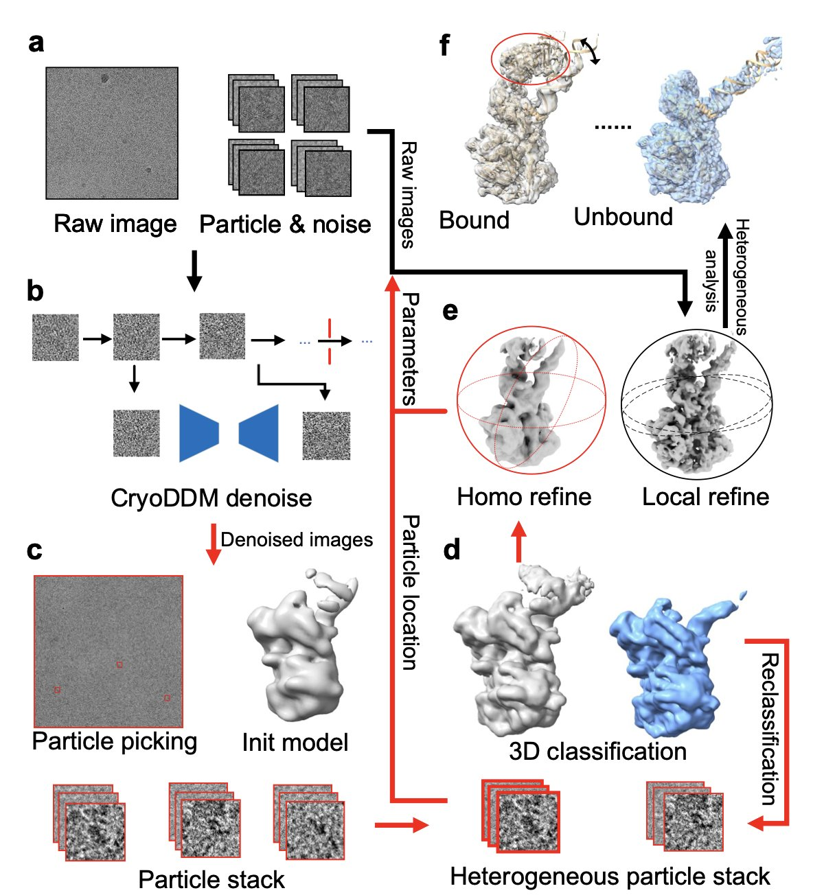
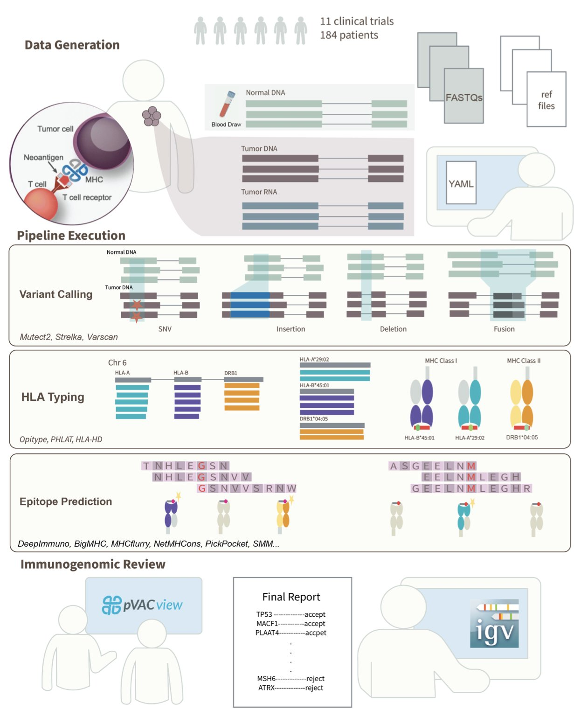
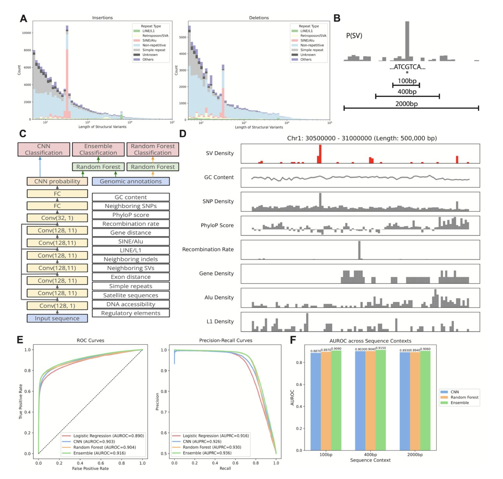

#### Table of Contents
1. Researchers combine knowledge graph embeddings with large language models to provide explainable reasoning for drug repurposing predictions, making AI's "why" less of a secret.
2. Protein language models aren't black boxes. They learn key biological features of antibodies, and understanding their biases helps us build better tools for antibody drug discovery.
3. This denoising diffusion model, designed specifically for Cryo-EM, removes image noise precisely, letting us capture the complex and varied dynamic conformations of proteins with new levels of clarity.
4. ImmunoNX combines automated computation with expert manual review to create a clinically validated, reliable workflow that delivers high-quality neoantigen candidates within three months.
5. Researchers used a machine learning model to successfully locate "hotspot regions" in the human genome that are prone to breaks and rearrangements, showing that a DNA's local sequence holds key clues to its stability.

## 1. AI Drug Repurposing: GraphRAG Makes Black Box Models Explain Themselves

In drug development, we're always looking for a needle in a haystack of information. There is so much data, from genes to diseases to compounds, with tangled relationships. Drug repurposing—finding new uses for old drugs—is a shortcut, but the challenge is efficiently spotting potential links between drugs and new indications. Traditional computational methods often act like a black box. They give you a "might be effective" answer, but if you ask why, they go silent. For scientists who need to validate their work, that's not good enough.

This study offers a solution that's like installing a transparent window into that black box.

Here's how it works:

First, it builds a solid foundation. The researchers used a Drug Repurposing Knowledge Graph (DRKG), which is like a giant map of biological relationships connecting entities like drugs, genes, and diseases. They then used an algorithm called TransE to "embed" this complex network into a mathematical space. You can think of it as a galaxy map where each entity (a drug or disease) is a star, and their relationships determine their positions. If two stars are close together in this space, they likely have a strong biological connection. This process is pre-computed, so future queries are very fast.

Second, it goes from "what" to "why." When a user types in a disease like "Alzheimer's disease," the system first uses the pre-trained embeddings to quickly find drug molecules that are "closest" to the disease on the galaxy map. This is the first filter, telling you which drugs are worth looking at.

But the next part is the system's real highlight: Graph-Retrieved Augmented Generation (GraphRAG). For each candidate drug, the system doesn't just stop at a proximity score. It goes back to the original knowledge graph to actively find the shortest, most relevant paths connecting the drug to the target disease. For instance, it might find a path like: "Drug A -> inhibits -> Protein X -> participates in -> Signaling Pathway Y -> is associated with -> Alzheimer's disease."

The final step brings in a Large Language Model (LLM). The system feeds these paths to an LLM like GPT. The LLM acts like a professional science translator, turning the dry path of nodes and connections into a smooth, readable explanation. It tells you that, based on the knowledge graph, this drug might work on the disease by affecting a specific target or pathway.

The whole process gives you not just a list of drugs, but a clear, traceable biological story behind each suggestion. For a research scientist, this is enormously valuable. It transforms a purely computational result into a scientific hypothesis that can be tested in the lab. You can also use the explanation it provides to judge the strength of the logical chain and decide on your next experimental steps.

Of course, the system isn't perfect. Its knowledge is based on the pre-trained DRKG embeddings, which means the information is static. If a major paper was published yesterday with updated target information, this model wouldn't know about it unless you spent significant computing resources to retrain the entire embedding model. It also relies on OpenAI's API, which is a consideration for cost and data privacy.

Still, this is an exciting direction. It shows how AI can be not just a prediction tool, but a research partner. It makes the AI's thought process transparent, helping us pull valuable insights from massive amounts of data more quickly.

📜Title: Deep Learning-Based Drug Repurposing Using Knowledge Graph Embeddings and GraphRAG  
🌐Paper: https://www.biorxiv.org/content/10.64898/2025.12.08.693009v1

## 2. How Do Protein Language Models 'See' Antibodies? Deconstructing AI Bias

When developing drugs, we often wonder if AI models truly "understand" biology or are just performing advanced pattern matching. A recent paper dives into this question, comparing several major Protein Language Models (PLMs) to see how they "view" antibody sequences.

You can think of a protein sequence as a language and amino acids as its letters. A protein language model works just like a large language model does for human language: it learns the grammar and meaning of this biological language.

The researchers selected a few models: AntiBERTa, designed specifically for antibodies, and general protein models like ESM2 and BioBERT. They gave these models the task of predicting which antigen an antibody would bind to based on its sequence.

The results showed that all models did well on prediction accuracy. But that's just the surface. The key question is, how did they make their decisions?

To figure this out, the researchers used a technique called "attention attribution." This is like opening the model's hood to see which parts (amino acid residues) it pays the most attention to while it's running.

They found that the antibody-specific model, AntiBERTa, naturally focused its attention on the Complementarity-Determining Regions (CDRs). This makes perfect sense from a biology standpoint, because CDRs are the key areas on an antibody that bind to an antigen, like the teeth on a key that fit a lock.

In contrast, a general model like ESM2 had more scattered attention. This is also understandable, as it was trained to handle all kinds of proteins, not just antibodies.

So, the researchers tried an experiment: when training the general models, they guided them to pay attention to the CDR regions, especially CDR3, which determines most of the specificity.

This was a simple change, but it worked well. The performance of ESM2 and BioBERT improved significantly. This teaches us an important lesson: integrating prior biological knowledge (like "CDRs are important") into model training is an effective way to improve performance. It’s like giving a generalist a clear briefing, telling them where to focus to solve a specific problem.

There was another, even more exciting discovery in this work. Even without specific training, these models could capture deeper biological information from sequence data. For example, they could implicitly "sense" an antibody's V-gene origin, patterns of somatic hypermutation, and even its isotype.

This suggests the model isn't just memorizing patterns. In the process of learning sequence patterns, it builds its own internal representations that reflect the biological nature of antibodies. It's like a child who, through extensive reading, not only learns words but also begins to understand grammar, style, and tone.

For people who make medicines, the value of this research is that it shows protein language models are more than just black-box predictors. They are powerful partners that can be understood, guided, and can even help us discover new biological principles. By understanding the architectural biases of different models, we can choose the best one for a specific task and make it smarter by injecting domain knowledge.

📜Title: Exploring Protein Language Model Architecture-Induced Biases for Antibody Comprehension  
🌐Paper: <https://arxiv.org/abs/2512.09894>

## 3. CryoDDM: AI Helps Cryo-EM See the Dynamic Details of Proteins

Anyone working in structural biology, especially with Cryo-Electron Microscopy (Cryo-EM), knows one thing: the raw data is everything.

The micrographs you get are essentially faint outlines of proteins in a sea of static. If you stack these images directly, any dynamic changes in the protein's conformation get averaged out, leaving you with a blurry blob. It’s like trying to see a person’s dance moves by overlaying all their poses onto a single photograph—you end up seeing nothing clearly.

Traditional denoising methods are often like an overly aggressive filter. They either fail to clean up the noise or wipe away useful high-frequency structural information along with it. This is a major problem for studying conformational heterogeneity, because the most interesting biological stories are hidden in these subtle, dynamic changes.

Now, this paper's CryoDDM offers a new approach. It uses a denoising diffusion model, a popular technique today. You can understand how it works like this: first, the model learns how to take a clear image of a protein and turn it, step-by-step, into complete noise. Then, it learns the reverse process: how to start with a pile of noise and reconstruct the clear image, step-by-step. Through this process, the model learns what is real "signal" and what is "noise" that should be discarded.

CryoDDM is clever because it doesn't just apply a generic model designed for regular photos. The researchers found that the noise in Cryo-EM images has a unique distribution and can't be modeled as simple Gaussian noise. So, they designed a two-stage diffusion process. In the first stage, the model does a quick, rough denoising to get rid of the most obvious noise. In the second stage, it performs fine-tuning to handle the subtle noise that's mixed in with the protein's structural signal. This approach has two benefits: first, the denoising is more effective because it understands the specific nature of Cryo-EM data; second, it's more computationally efficient because it optimizes the diffusion steps, avoiding redundant calculations.

So, how were the results? The authors tested it on several tough cases, including a proteasome, a membrane protein, and a spike protein. These are all known for their complex and dynamic conformations. The results showed that after processing with CryoDDM, downstream tasks like particle picking and 3D classification became much easier. The software could more accurately "pick" protein particles from the micrographs and more clearly sort them into different conformational states. Ultimately, they successfully resolved conformational states and dynamic details that were previously hidden by noise and had never been seen before.

This is significant for anyone in drug discovery. Often, a drug target is not a rigid, static structure but is dynamically changing between different conformations. An allosteric pocket might only appear in a transient conformation. If your technology can only see a blurry, averaged structure, you'll miss this perfect drug development opportunity. A tool like CryoDDM is like giving us a higher-definition camera, allowing us to see a protein's "slow-motion" movements and discover new targets and drug design opportunities.

📜Title: CryoDDM: CryoEM denoising diffusion model for heterogeneous conformational reconstruction  
🌐Paper: <https://www.biorxiv.org/content/10.64898/2025.12.10.693455v1>

## 4. ImmunoNX: A Clinically Validated Engine for Personalized Vaccine Design

In the field of personalized cancer vaccines, we are always racing against time. The entire process, from receiving a patient's tumor sample to designing a vaccine that targets only their cancer cells, has to be both fast and accurate. Finding neoantigens—the tumor-specific mutations that the immune system can recognize as foreign—is like finding a specific needle in a haystack. This is not just a computational problem; it's a biological one.

Recently, a paper introducing ImmunoNX caught my attention. It's not just another new algorithm, but a complete, end-to-end bioinformatics workflow. More importantly, it's not just theoretical; it has been tested in 11 clinical trials on over 185 patients. For people in R&D, the words "clinically tested" carry more weight than any fancy performance metric.

#### How does it work?

The workflow's design is clear: automate the complex parts but leave the critical decisions to humans.

First, they moved all computations to the cloud. The researchers used the Workflow Definition Language (WDL) to build the entire process on the Google Cloud Platform. This ensures reproducibility and scalability. Whether you're processing one sample or hundreds, the workflow is consistent and the results are reliable, free from errors caused by different computing environments. This is fundamental for rigorous clinical trials.

The first step is processing the raw sequencing data. They analyze the tumor DNA/RNA alongside the patient's normal tissue DNA. By comparing them, they identify mutations unique to the tumor. Here, they use a smart strategy: consensus-based variant calling. They use multiple different algorithms to find mutations and only keep the results that are agreed upon by several of them. This is like a medical consultation; if multiple experts agree, the diagnosis is considered reliable, which greatly reduces false positives.

#### Manual Review: The Algorithm's "Safety Belt"

Once the mutations are found, the next step is to predict whether the resulting protein fragments can be presented by the patient's immune system (specifically, their HLA molecules) and activate T cells. This is the core of neoantigen prediction. ImmunoNX integrates multiple prediction algorithms for this task as well.

But what I appreciate is that they didn't stop there. The list of candidates predicted by the computer goes through a strict, two-stage manual review process.

In the first stage, researchers use a tool called pVACview for a visual initial screening. This helps them quickly filter out some obviously unreliable candidates.

The second and most critical stage is when they go back to the raw data. Using the Integrative Genomics Viewer (IGV), they check the most promising neoantigen candidates one by one. The reviewing scientist personally examines whether the sequencing reads supporting the mutation are sufficient and of high quality, and whether the corresponding gene is actually expressed at the RNA level.

This step cannot be fully replaced by an algorithm. It ensures that every neoantigen selected for the final vaccine is backed by solid raw data. This is a guarantee for both efficacy and patient safety. You could say this manual review is the "safety belt" and "quality valve" of the entire workflow.

#### Speed and Openness

One of the most attractive features of ImmunoNX is its ability to complete the entire vaccine design process within three months. In personalized medicine, time is life. Shortening the cycle to this extent means patients can receive treatment sooner and clinical trials can move faster.

The researchers have also made the entire workflow, code, documentation, and sample data open source. This means any lab in the world with the necessary computing resources can reproduce, use, and even improve this process. This open approach is hugely valuable for advancing the entire field of personalized cancer vaccines. It's no longer a "black box" technology owned by a few companies, but a tool the entire scientific community can use together.

ImmunoNX provides a very pragmatic solution. It doesn't chase perfection in a single algorithm but instead builds a robust, efficient system that combines automation with human oversight. For those dedicated to turning science into medicine, a reliable, field-tested tool like this is far more valuable than a theoretically perfect algorithm.

📜Title: ImmunoNX: A Robust Bioinformatics Workflow to Support Personalized Neoantigen Vaccine Trials  
🌐Paper: <https://arxiv.org/pdf/2512.08226v1.pdf>

## 5. AI Predicts Genomic 'Breakpoints': Machine Learning Reveals the Sequence Code for Structural Variants

Our genome isn't a static, unchanging strand of DNA. It can break, delete, duplicate, or rearrange. We call these large-scale changes Structural Variants (SVs), and they are the root of many genetic diseases. For a long time, predicting where these variants will occur in the genome has been as hard as predicting earthquakes. We know some regions are more "fragile" than others, but what exactly determines this has never been clear.

This new study offers a fresh perspective. The researchers trained two types of machine learning models to "read" the genome and identify these potentially unstable regions.

The first is a Convolutional Neural Network (CNN). You can think of it as an image recognition expert. Just as a CNN can recognize the outline of a cat in a photo, here it directly scans the raw A, T, C, G sequence, learning to identify specific sequence patterns that signal instability.

The second is a Random Forest model. This model is more like a seasoned expert who looks at the overall context, not just isolated sequences. It considers factors like a region's gene density, known regulatory elements, and other genomic annotations to make a comprehensive judgment.

The real breakthrough came from combining the two. The CNN handles digging up subtle clues from the raw sequence, while the Random Forest integrates high-level, global features. When these two perspectives work together, the accuracy of predicting where SVs occur exceeds 90%. This is a huge step forward, bringing us closer to understanding the "rules" of genomic breakpoints.

What's more exciting is that this isn't an unexplainable "black box." By analyzing what the models learned, the researchers were able to validate and uncover some of the biological mechanisms that cause genomic instability. For instance, the models confirmed that "microhomology sequences"—short, repetitive segments—are hotspots for errors during break repair.

It also specifically pointed out the role of non-canonical DNA structures like G-quadruplexes. You can imagine a G-quadruplex as a knot that a single strand of DNA ties in itself. When a cell replicates its DNA, untying this knot can be tricky, which increases the risk of errors and breaks. The model accurately captured this feature, flagging these "bumps" on the DNA as potential troublemakers.

These findings aren't just theoretical. The model's predictions are highly correlated with data from real human populations. The hotspot regions predicted by the model do in fact show higher frequencies of variation across different populations. This shows that the model has captured real biological principles that drive genome evolution.

This tool has broad potential applications. In drug development, if a target gene happens to be in an SV hotspot, its stability and expression levels might vary between individuals, affecting a drug's effectiveness. In personalized medicine, this model might one day be used to assess the stability of an individual's genome and predict their risk for certain genetic diseases.

Simply put, the authors have developed a detailed "seismic risk map" for our DNA. It not only tells us where collapses might happen but also explains why.

📜Title: Machine Learning-Based Prediction of Human Structural Variation and Characterization of Associated Sequence Determinants  
🌐Paper: <https://www.biorxiv.org/content/10.64898/2025.12.09.693295v1>
