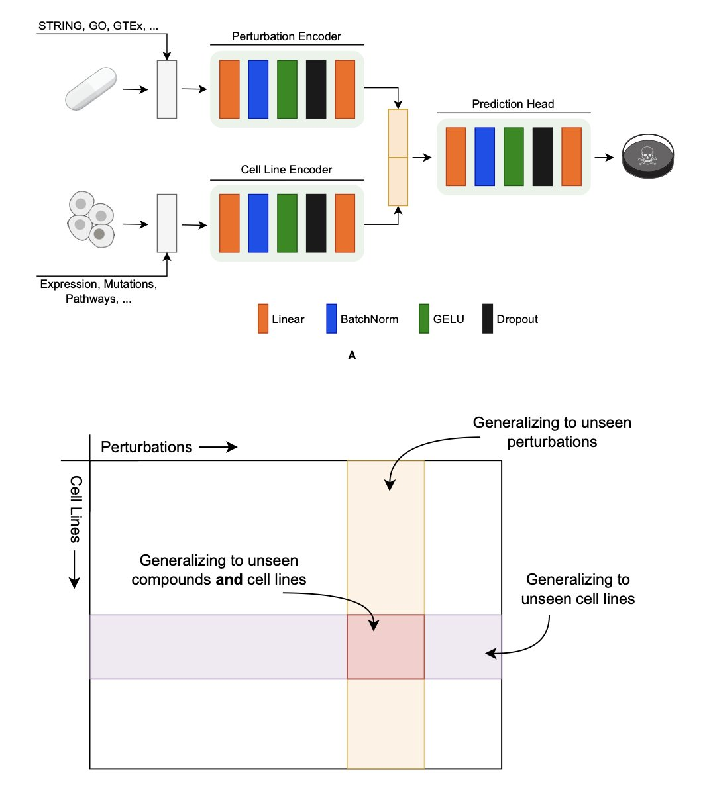
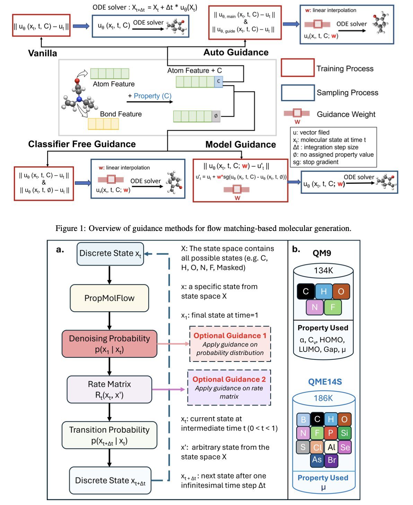
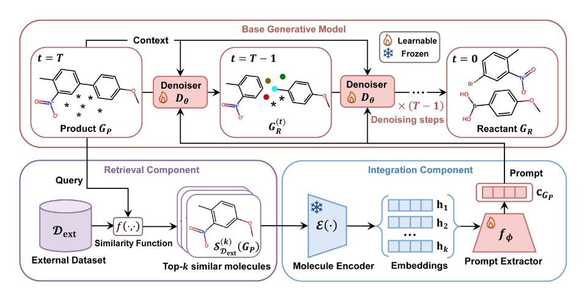
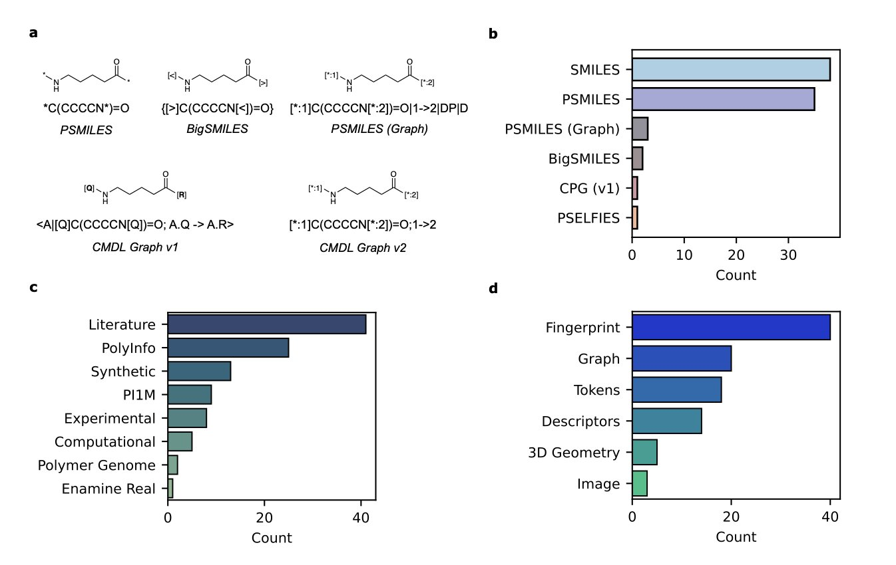
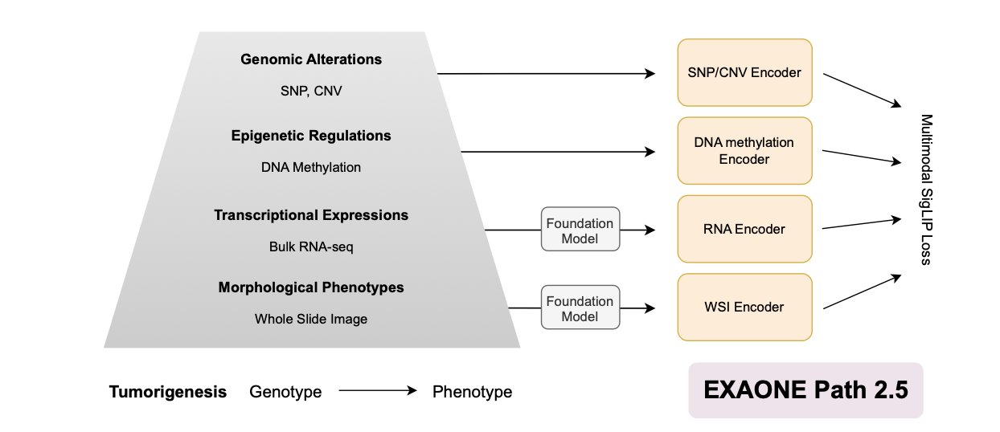

#### Contents
1. To predict how cancer responds to drugs or gene editing, you have to pick the right "language" for genes, compounds, and cell lines. This study shows STRING, MiniMol, and raw gene expression data are the winners in their respective fields.
2. MolGuidance uses a hybrid guidance strategy to show that discrete features like atom and bond types are more critical for controlling molecular properties than 3D structure, achieving unprecedented generation accuracy.
3. By retrieving similar reactions to "remind" the AI, the RARB framework significantly improves the accuracy and generalization of retrosynthesis predictions.
4. This study built a high-performance polymer foundation model but found it might rely on data interpolation instead of chemical understanding, a warning to carefully assess what AI truly "understands."
5. EXAONE Path 2.5 integrates pathology images with multi-omics data to build more biologically meaningful patient models for precision oncology.
6. The HeMeNet model uses multi-task learning and all-atom graph representations to excel at multiple prediction tasks like protein affinity, offering a new way to solve the problem of sparse data in drug discovery.

## 1. The AI Drug Discovery Encoding Battle: To Predict Cancer Response, the Right Method Is Everything

In precision medicine, we want to answer one core question: which drug works best for which cancer cell? To find out, we've built huge databases like DepMap and PRISM, which record how thousands of cell lines react to various drugs (chemical perturbations) or gene knockouts (genetic perturbations). Once we have the data, the next step is to build predictive models. The first and most critical step for any model is translating biological entities like genes, compounds, and cell lines into a language machines can understand. We call this process "encoding."

Choose the wrong encoding method, and it's like giving the machine the wrong dictionary. Everything that follows could be useless. A recent paper did something extremely valuable: it systematically compared the mainstream encoding methods on the market in a kind of encoding showdown to find the real winners.

**Gene Encoding: Network Is Everything**

When we want to predict the effect of knocking out a gene, how do we describe that gene to a model? The direct approach is to use its functional classification (like GO-terms) or a protein language model to generate a "digital fingerprint."

But the researchers found that the most effective encoding method is STRING. STRING is essentially a giant map of protein-protein interactions, showing which other proteins a given protein "interacts" with inside a cell. Encoding a gene with STRING describes its position and relationships within its entire social network. This result shows that a gene's function is largely determined by its "circle of friends." Other encoding methods are more like a gene's personal resume; they ignore its social connections and thus contain far less information.

Interestingly, when the researchers tried combining multiple gene encoders, thinking more was better, they found almost no performance improvement. This suggests that the network information from STRING is already so rich that other methods offer very little new information.

**Compound Encoding: Domain Knowledge Is King**

For compounds, we typically use chemical fingerprints or molecular graphs to describe their structure. But the winner this time was MiniMol.

MiniMol's secret is pre-training. It wasn't trained on a general database of chemical molecules but on bio-assay data directly related to drug discovery. This is like teaching a student by having them read real case reports instead of a general encyclopedia. A model trained this way is naturally better at interpreting the likely biological effect of a chemical structure. This finding tells us that for chemical encoding, a pure chemical description without biological context has limited predictive power. Context is crucial.

**Cell Line Encoding: Simplicity Wins**

The most surprising finding may have come from encoding cell lines. We usually think a cell line's state is extremely complex and requires a complex model. For example, there are now specialized transcriptomics foundation models that try to learn a deeper, more abstract representation of cell state from massive amounts of gene expression data.

However, the results went back to basics: using the raw gene expression profile directly worked best. It beat out encoders that used complex processing and abstraction, and it was also better than genotype-based encoders.

What does this mean? For predicting perturbation responses, the most direct and subtle signals in the raw gene expression data might be the most important. In their attempts to "reduce noise" and "find the main point," complex models may have accidentally thrown out these key signals. It's like looking at a high-definition photo, where you can see many details. If you convert it into a simple cartoon sketch, the outline is there, but a huge amount of information is lost. For some tasks, those lost details are exactly what determines success or failure.

This research provides a practical guide for anyone developing these kinds of models. It clearly shows there is no one-size-fits-all "universal encoder." For different biological problems—genes, compounds, or cell lines—we need to choose the right tool for the job.

📜Title: Benchmarking Chemical, Genetic, and Cell Line Encodings for Cancer Perturbation Response Prediction  
🌐Paper: https://www.biorxiv.org/content/10.64898/2025.12.15.694331v1

## 2. MolGuidance: A Breakthrough in AI Molecular Generation for Fine-Tuning Properties

In computational chemistry and drug design, we all share a common goal: designing molecules on demand. You give a computer a command like, "I want a molecule with a HOMO-LUMO gap in a specific range," and it generates the structure. It sounds simple, but it's very hard to do. Existing generative models have always struggled with this "on-demand" part.

A recent paper, MolGuidance, gives us a new approach. The authors developed a new molecular generation method based on the Flow Matching framework. Flow matching is powerful on its own. You can think of it as a smooth transformation process that takes a cloud of random noise and gradually "sculpts" it into a chemically valid molecule with a clear structure. It has an edge over diffusion models in ensuring diversity and novelty.

But the real highlight of this paper is its deep dive into "guidance" strategies. When we need to generate a molecule with a specific property, we need a guide to tell the model which direction to go.

The researchers discovered something counter-intuitive. We usually assume that a molecule's 3D spatial conformation (the coordinates of its atoms) has a huge impact on its properties, so we spend a lot of computational resources training models to learn this SE(3) equivariance. But the experiments with MolGuidance showed that for controlling molecular properties, the decisive factors are actually discrete features, like the atom type (carbon, oxygen, or nitrogen?) and the bond type (single or double?).

It's like baking a cake. We used to spend a lot of energy designing a perfectly shaped pan (3D geometry), thinking that would produce a delicious cake. It turns out that what really determines the cake's taste is whether you added sugar or salt (atom and bond types).

Once they figured that out, the rest was straightforward. The authors designed a hybrid guidance strategy. They integrated several mainstream guidance methods, like classifier-free guidance, autoguidance, and model guidance.

You can think of the process this way:

The clever part of MolGuidance is that it doesn't just rely on one method. It uses Bayesian optimization to dynamically find the best combination of weights. It knows when to listen to the navigator's fine-tuning and when to follow the guide's general direction.

To test if the method actually works, the authors ran extensive experiments. They didn't just generate molecules; they used Density Functional Theory (DFT), the "gold standard" in computational chemistry, to calculate the properties of the generated molecules. The results showed that on standard datasets like QM9 and QMe14S, the molecules generated by MolGuidance had the best property matching to date. At the same time, the generated molecules maintained a high level of chemical validity, stability, and diversity.

This work opens a new door for precisely designing molecules with specific functions. Whether it's finding more active lead compounds in drug discovery or designing new materials with specific optoelectronic properties in materials science, this kind of precise "molecular customization" is exactly what we've been looking for.

📜Title: MolGuidance: Advanced Guidance Strategies for Conditional Molecular Generation with Flow Matching  
🌐Paper: <https://arxiv.org/abs/2512.12198v1>  
💻Code: <https://github.com/Liu-Group-UF/MolGuidance>

## 3. Giving AI a Search Library Boosts Retrosynthesis Accuracy by 15%

Retrosynthesis analysis is a tough problem for both humans and AI. It's like being handed a chair and asked, "Which pieces of wood was this originally made from, and how were they put together?" An experienced chemist would immediately go look through the literature to see if anyone has made a similar chair. The authors of this paper wondered if they could teach an AI to do the same.

The vast majority of chemical reactions don't involve breaking a molecule apart and starting from scratch. Instead, they preserve most of the core scaffold and only make modifications in specific places. This means if I want to synthesize a new molecule A, looking at how a very similar molecule B was synthesized will likely give me excellent clues. This is what chemists do every day in the lab when they use SciFinder or Reaxys to look up papers. What the authors did was build a dedicated "literature search system" right into their AI model.

The new framework is called RARB (Retrieval-Augmented RetroBridge), and it works in three steps:

First is retrieval. You give the model a target product, and its retrieval module immediately gets to work. This module uses Morgan fingerprints—a classic way to encode molecular structure—to quickly find a few of the target's closest structural "relatives" in a massive reaction database. This is like wanting to bake a special cake and first finding a few recipes that look the most similar.

Second is information integration. This is the cleverest part. The system doesn't just dump the "reference recipes" it found on the AI. It first uses an "information extractor" to pick out the most useful parts. This extractor is based on a multi-head self-attention mechanism, the core technology behind large language models like GPT. It can precisely identify the common substructures between the target and reference molecules, as well as the likely reaction sites. It then packages this key information into a concise "prompt" and passes it to the generation model.

Third is generation. RARB uses the RetroBridge diffusion model to generate the reactant structures. But unlike before, it's not guessing blindly. It has the prompt from the previous step in hand, like a detailed memo that says: "Pay attention, this part of the molecule's scaffold is unlikely to change, and the reaction will probably happen at that functional group over there."

What were the results? On the standard USPTO-50k dataset, the Top-1 accuracy saw a relative improvement of 14.8%. This means the probability that the model's first answer is the correct one increased substantially.

But the most impressive part was its ability to handle "out-of-distribution" molecules. This is the real test of whether an AI model is just memorizing things. Many models see their performance plummet when they encounter a completely new type of molecule they didn't see during training. RARB was very robust here. The reason is that even if a new molecule is unfamiliar as a whole, some of its local structures likely have precedents in the database. The retrieval mechanism acts like an anchor, always giving the model a starting point grounded in known chemical knowledge and preventing it from making wild guesses.

This "retrieval-augmented" approach may represent an important direction for AI in synthesis planning. We are moving from training a super-brain that tries to "remember" all chemical reactions to building an expert system that knows how to "look things up" and reason. This is much closer to how human chemists work.

The framework is also very extensible. The underlying generation model is replaceable. This means this "external brain" system has the potential to be integrated with other retrosynthesis tools to make them smarter too. It shows us that the drug discovery platforms of the future may not be single-function models, but a collection of intelligent agents that know how to collaborate, search the literature, and reason.

📜Title: Advancing Retrosynthesis with Retrieval-Augmented Graph Generation  
🌐Paper: https://ojs.aaai.org/index.php/AAAI/article/download/34203/36358

## 4. A Polymer AI Model: Great Performance, but Does It Really Understand Chemistry?

Foundation models are taking over every field, and now it's polymer science's turn. We all hope that an AI can one day look at a molecular structure and know its properties, just like a seasoned chemist. A recent study took a step in this direction, but its results also serve as a reality check.

First, the work itself is commendable. Designing a good structural representation for polymers is tricky. Unlike small molecules, their structures aren't fixed. Polymers have repeating units, different chain lengths, branching, and complex topologies. The researchers proposed a novel graph representation based on SMILES that tries to encode all these key features.

Using this representation, they trained a model called SMI-TEDPOLYMER289M. The results? Quite good. On 28 benchmark datasets, the model achieved state-of-the-art or near state-of-the-art performance in predicting a wide range of properties, including electronic, physical, optical, and gas barrier properties. At this point, you might think that an AI that understands polymer chemistry is just around the corner.

But the researchers didn't stop there. They did something crucial: a control experiment. This is the most fascinating part of the paper. They intentionally fed the model chemically or semantically incorrect "gibberish" SMILES strings.

What happened next was unexpected. The model's performance was still strong even when processing these invalid inputs.

This raises a core question. It's like teaching a student physics, giving them a problem written in complete gibberish, and they still give you the right answer. You wouldn't praise them for being smart; you would suspect they just memorized the answers to the entire problem set and are just matching a few stray numbers or symbols in the question to their memory bank.

Through error analysis and attention maps, the researchers found that this seems to be exactly what the model was doing. It wasn't "understanding" chemical grammar; it was interpolating across the entire sequence space. As long as an input string "looked similar" in some way to sequences in the training data, it could "guess" the answer based on statistical patterns, regardless of whether the string made any chemical sense.

This tells us that, at least for now, these models are more like well-read apprentices who are great at imitation, rather than masters who have grasped first principles. Their success depends heavily on the distribution of the training data, not on an intrinsic understanding of chemical rules.

The real value of this paper isn't just that it released a high-performance model. It's a warning. It reminds us that while we celebrate the performance of AI models, we must design rigorous control experiments to investigate what the model has actually learned. Otherwise, we risk being fooled by impressive test scores.

📜Title: Understanding Structural Representation in Foundation Models for Polymers  
🌐Paper: <https://arxiv.org/abs/2512.11881>

## 5. EXAONE Path 2.5: Connecting Pathology Images with Multi-Omics Data

In computational pathology, we have massive amounts of Whole-Slide Images (WSI). These images are intuitive, but they only tell half the story—the tumor's "phenotype." What it looks like, its cell morphology. But what is the "genotype" driving it all? That's the core question we've been trying to answer.

The EXAONE Path 2.5 model was designed to answer this question.

It's like solving a crime. The pathology slide is the photo of the crime scene. It has a lot of information, but the photo alone isn't enough. You also need DNA evidence (genomics), fingerprints (epigenetics), and witness testimony (transcriptomics). Most AI models are only good at analyzing the photos, but EXAONE Path 2.5 aims to integrate all the clues.

Aligning these completely different types of data is a huge challenge. An image is a matrix of pixels, while RNA-seq is a list of gene expression counts. It's like asking a painter and a stock analyst to communicate in the same language.

The researchers used a few clever methods to solve this puzzle.

First is the **multimodal SigLIP loss function**. Traditional contrastive learning methods are a bit like forced matchmaking. They compel an image to pair with its corresponding text while pushing away all other options. When you have five different data types (images, genes, transcripts, etc.), this approach runs into problems. For example, pairing an image with a gene might "compete" with pairing the same image with a transcriptome, causing the model to get confused. SigLIP's approach is to let each positive pair (like this image patch and its corresponding gene expression profile) form its own group and only compare it against negative samples. This way, the complementary information between different modalities can be better preserved and encoded, rather than being lost to internal competition.

Second is the **F-RoPE (Fragment-aware Rotary Positional Encoding) module**. The tissue on a pathology slide isn't just a random assortment of cells; its spatial structure is critical. Where the tumor cells are, where the stromal cells are, how immune cells infiltrate—this positional information reflects the tumor's biological behavior. F-RoPE is like giving the model a high-precision GPS, allowing it to understand the spatial topological relationships between different regions on the slide. This enables the model to accurately link the histological features of a specific area with potential changes in its molecular state.

The framework also has a practical design: it uses domain-specific foundation models for WSI and RNA-seq data separately. This is like first bringing in two experts—an experienced pathologist to interpret the images and a top bioinformatician to analyze the transcriptomic data. With the stable, high-quality initial information (the embeddings) provided by these experts, the subsequent multimodal alignment becomes much more effective, especially when training data is limited.

With fewer parameters and less pre-training data, EXAONE Path 2.5 performed better than or equal to the current best models on the Patho-Bench benchmark, which includes 80 tasks. This demonstrates its design efficiency, suggesting the model is better at capturing the underlying biology rather than just relying on brute-force computation.

After multimodal alignment, the representation space learned by the model is more biologically meaningful. For example, the clustering of different organs and tissues improved. This means the model truly understands the relationship between genotype and phenotype.

What does this mean for people in drug discovery? This isn't just another new algorithm. It's a step toward building a "digital twin" of a patient's tumor. We can use this kind of model to more accurately screen for biomarkers or select the right patients for clinical trials. You can even imagine a future where we are not just doing virtual screening against a single protein target, but against a complex tumor microenvironment model that incorporates multi-omics information. That's what makes this work truly exciting.

📜Paper: <https://arxiv.org/abs/2512.14019v1>

## 6. HeMeNet: One Model to Tackle Six Protein Prediction Tasks at Once

In drug discovery, we often face a practical problem: too little data, especially high-quality labeled data. For example, we might have a lot of data on protein stability, but very little affinity data for a new target. If we could get a model to transfer what it learns from one task to another, it could go a long way in solving this problem. This is exactly where Multi-task Learning comes in.

The HeMeNet model was designed with this idea in mind. Instead of training a model to do just one thing, it has one model learn six biologically related tasks at the same time, including protein-protein affinity, solubility, and thermal stability.

Here's how it works.

First, how does the model "see" a protein? Traditional models might simplify things, for example, by only looking at the central carbon atom (Cα) of each amino acid residue. But HeMeNet is different. It constructs a "heterogeneous all-atom graph." This means the model sees every single atom in the protein—carbon, hydrogen, oxygen, nitrogen—and the chemical bonds between them. This high-resolution view is critical because subtle events like drug binding ultimately come down to interactions at the atomic level. If you only look at the backbone, you lose too much crucial chemical information.

Second, proteins are free to move and rotate in 3D space. Their biological function doesn't change just because you look at them from a different angle. A good computational model has to respect this physical reality. HeMeNet uses an E(3)-equivariant architecture. It sounds complicated, but the core idea is simple: if you rotate the input protein molecule in space, the model's prediction (like the binding energy, which is a single number) stays the same. This prevents the model from wasting computational power learning all possible spatial orientations, putting it on the right physical track from the start.

How can one model handle six different tasks without getting confused? The researchers designed a "task-aware readout mechanism." You can think of it like this: the core of the model is a knowledgeable generalist with a deep, universal understanding of protein structure. Then, for each specific task (like predicting affinity or stability), there is a dedicated "specialist" module. This specialist module gets information from the generalist and then provides a targeted answer. This design prevents different tasks from interfering with each other during training and ensures that each task can achieve excellent results.

The experimental results prove this. On a newly constructed benchmark dataset, HeMeNet outperformed existing single-task models on several tasks, especially on affinity prediction. This shows that making a model "well-rounded" can actually help it become more of an expert in a specific area. For researchers on the front lines, this means that in the future, we might be able to train more powerful and reliable predictive models with less data.

📜**Title**: HeMeNet: Heterogeneous Multichannel Equivariant Network for Protein Multi-task Learning  
🌐**Paper**: https://ojs.aaai.org/index.php/AAAI/article/view/32000/34155  
💻**Code**: https://github.com/hanrthu/HeMeNet
