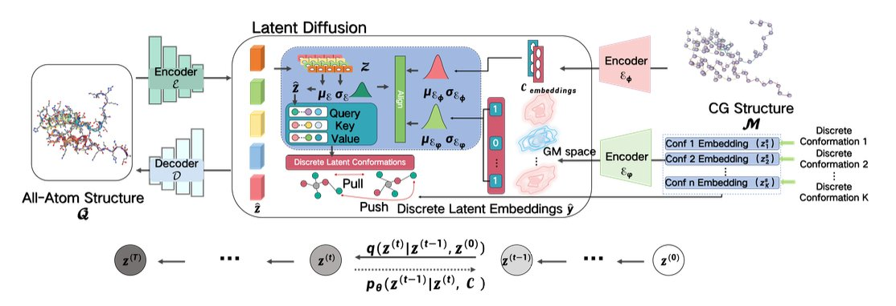
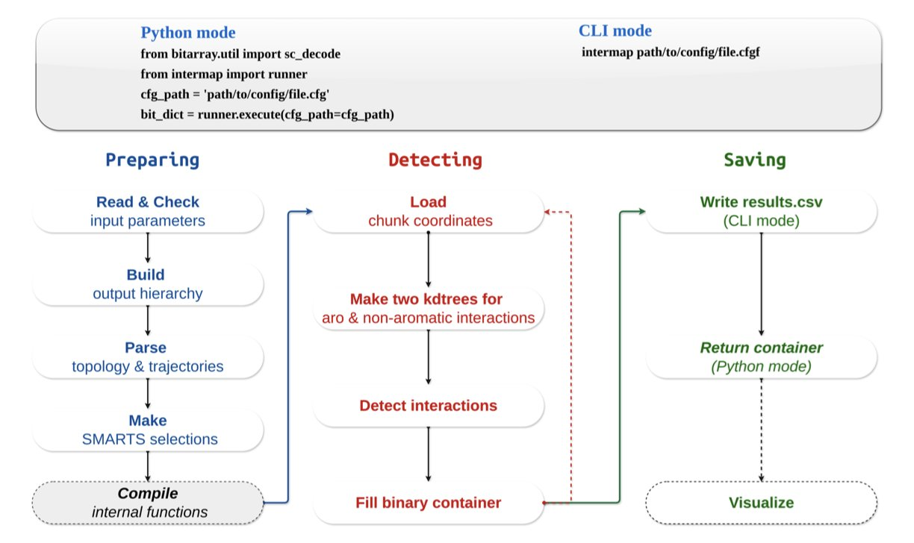
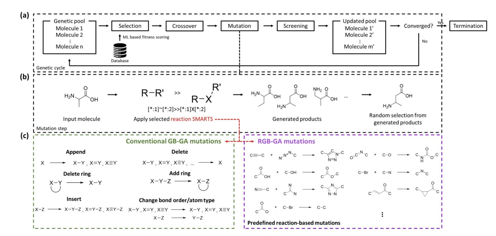
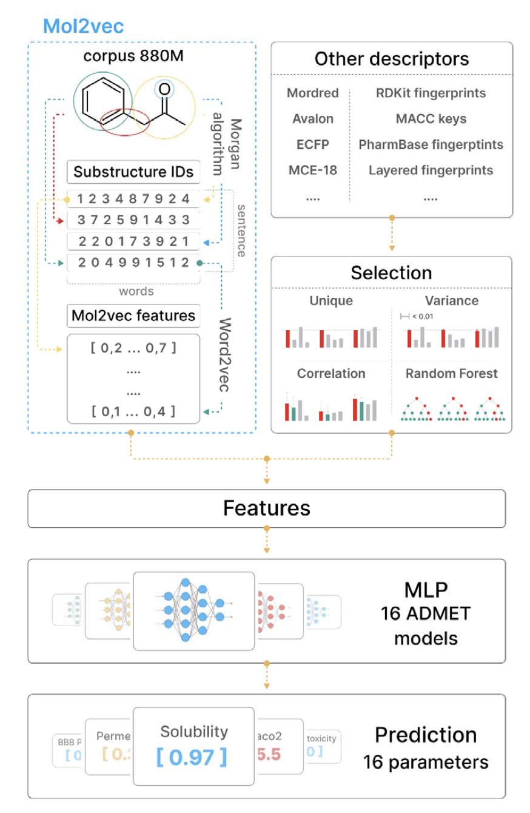
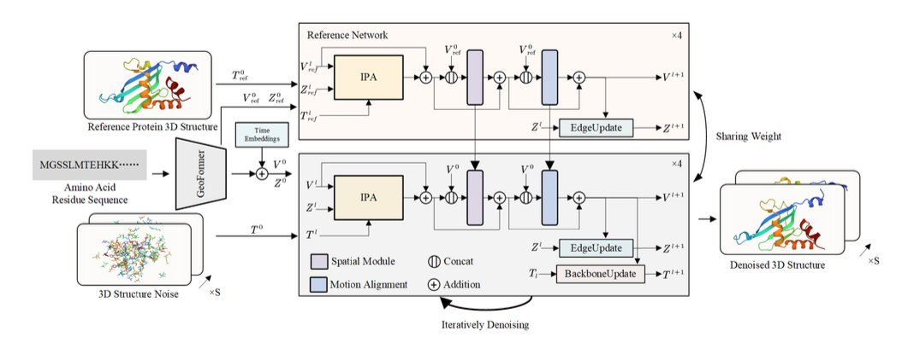
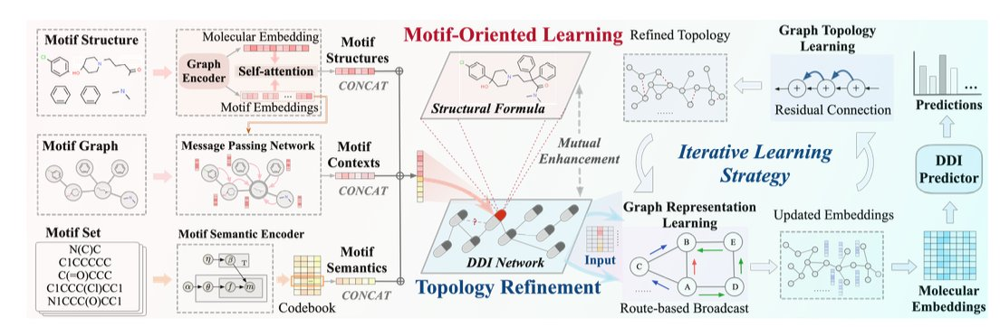

#### Table of Contents  
1. This study presents a latent diffusion model called LatCPB that can rebuild detailed, all-atom protein structures from blurry, coarse-grained (CG) models.
2. InterMap uses a k-d tree algorithm to cut down the analysis of molecular interactions from days to minutes, solving a major bottleneck for large-scale molecular dynamics simulations.
3. The R2GB-GA algorithm incorporates real chemical reaction rules into the molecule generation process, making sure that computer-designed molecules can actually be synthesized in the real world.
4. Combining classic molecular descriptors with modern Mol2Vec embeddings can build top-tier ADMET prediction models in a simpler and more efficient way.
5. This 4D diffusion model is the first to let AI predict the dynamic trajectories of both a protein's backbone and its side chains at the same time, offering a new path to replace traditional, slow molecular dynamics simulations.
6. The MOTOR model deconstructs molecular "building blocks" (motifs) and dynamically adjusts the drug-drug interaction network, making DDI predictions more accurate and transparent.

## 1. Latent Diffusion Models: Putting Together a Protein’s Atomic Puzzle with Precision  
  
  

In drug discovery, we're always fighting a battle with "scale." On one hand, we need atomic-level precision to understand how a drug molecule interacts with its target protein. On the other hand, proteins are dynamic, and their function and shape changes happen on timescales of microseconds or longer. All-Atom Molecular Dynamics simulations are precise, but the computational cost is too high. Running a long simulation can take months.  
  
To solve this, people came up with a compromise: Coarse-Grained (CG) models. This is like turning a high-resolution photo into pixel art. You keep only the key information, like the protein backbone, and ignore most of the atomic details. This can speed up simulations by several orders of magnitude, allowing us to finally see a protein's slow movements.  
  
But this creates a new problem. When we find an interesting conformation from a coarse-grained simulation, what we see is a blurry "outline." To move on to drug design or docking, we have to restore this outline back into a high-resolution, all-atom picture. We call this process "backmapping." Traditional backmapping methods rely on preset geometric rules or simple energy optimization. The process is tedious, and the results are often not great; the generated structures might not follow the laws of physics and chemistry.  
  
This paper introduces a model called LatCPB that offers a very elegant solution. The authors didn't follow the old path. Instead, they borrowed from diffusion models, which are popular in image generation right now.  
  
Here's how it works:  
  
The first step is "encoding." The model learns how to "compress" a high-resolution, all-atom protein structure into a low-dimensional, information-rich representation in a latent space. You can think of it as creating a unique digital "fingerprint" for each protein conformation. The authors made a key design choice here: they aligned this "fingerprint" with the protein's amino acid sequence, making it a discrete embedding. This ensures the model doesn't "forget" the protein's most basic primary structure during compression, which effectively avoids the "posterior collapse" problem that many generative models face.  
  
The second step is "diffusion and denoising." The model operates in a continuous latent space. It takes a compressed protein "fingerprint" and deliberately adds some random noise to it, making it "blurry." Then, the model's job is to learn how to perfectly restore the original, clear fingerprint from the noisy one. This process is repeated over and over. By learning to "denoise," the model is actually mastering the internal rules for building a realistic protein conformation.  
  
To help the model learn better, the authors also brought in Contrastive Learning. This method teaches the model to tell the difference between the "fingerprints" of different molecules, and even between different conformations of the same molecule. This is like training an art expert who can not only distinguish between a Van Gogh and a Monet but also tell the difference between Van Gogh's early and late works. This greatly improves the model's ability to represent molecular diversity.  
  
So, how well does it work? The authors used metrics like Root Mean Square Deviation (RMSD) to measure the accuracy of the generated structures. The results show that LatCPB-generated structures have a lower RMSD compared to existing methods like CGVAE and GenZProt. In structural biology, a lower RMSD means the generated structure is closer to the real, experimental structure.  
  
The authors tested the model on a tough case: Intrinsically Disordered Proteins (IDPs). Because IDPs don't have a stable 3D structure, they are a nightmare for structure prediction and simulation. LatCPB performed well on these proteins too. This shows it's not just "memorizing" common protein folds but has actually learned some underlying physical and chemical rules.  
  
For people in drug discovery, a tool like LatCPB is very valuable. It means we can use fast, coarse-grained simulations to explore a protein's conformational space with more confidence. Once we find a promising drug-binding pocket or a functional conformation, we can use LatCPB to quickly and accurately rebuild it into an all-atom model. Then we can seamlessly move on to precise docking and free energy calculations. This will definitely speed up our research and development process.  
  
📜Title: Exploit your Latents: Coarse-Grained Protein Backmapping with Latent Diffusion Models  
🌐Paper: https://ojs.aaai.org/index.php/AAAI/article/view/32098/34253  

## 2. InterMap: Analyzing Molecular Dynamics Simulations in Minutes, Not Days  
  
  

Anyone in computer-aided drug discovery knows that running a molecular dynamics (MD) simulation for a few microseconds can generate terabytes of data. But the real challenge comes after: how to quickly and accurately analyze the changes in molecular interactions from this mountain of data.  
  
We want to know which hydrogen bond between a ligand and a protein is the most stable, or which hydrophobic interaction exists most of the time. Traditional tools do this directly: for every frame, they calculate the distance between every atom and all other atoms. This is a classic O(N²) problem. As the number of atoms (N) increases, the calculation time gets out of control. It's common to wait for days to analyze the trajectory of a large protein system, which seriously slows down the pace of research.  
  
The new tool InterMap is clever because it changes the rules of the game. Instead of calculating all atom pairs by brute force, it uses a data structure called a k-d tree to index the atoms in 3D space.  
  
It's like looking for all the restaurants near an address on a map. A brute-force search would be to look at every single location in the city and check if it's a restaurant and if it's close enough. The k-d tree method is like first dividing the city into different areas (like by zip code). You only need to search within the small area where your address is located. This drastically shrinks the search space.  
  
InterMap uses this approach to reduce the computational complexity of finding interacting atoms from O(N²) to O(log N). The results are impressive. Performance tests show that it reduces calculations that took other tools hours or even days down to just a few minutes. A task that used to run all day might now be finished in the time it takes to make a cup of tea.  
  
This is about more than just speed. It means we can analyze larger and more complex systems that we wouldn't have considered before, like membrane proteins or PROTAC ternary complexes. We can also analyze longer trajectories to get statistically more reliable conclusions without worrying about computational resources being the bottleneck.  
  
What's even better for researchers on the front lines is that InterMap is designed to be very practical. It integrates directly with MDAnalysis, which is the most common library we use to handle MD trajectories. There's no need to convert file formats; it fits right into existing workflows.  
  
It also supports using SMARTS expressions to define interactions. This means we can use the language chemists are most familiar with to precisely define any interaction between chemical groups we care about, instead of being limited to a few presets in the software. This flexibility is crucial for studying specific mechanisms in depth.  
  
Finally, InterMap provides a local web application that can directly visualize the calculated Interaction Fingerprints (IFPs) as heatmaps, bar charts, and network diagrams. Complex data relationships become clear at a glance, which is much more intuitive than looking at a pile of numbers and text files. And with its deep compression technology for fingerprint data, memory usage is also very low, so many analyses can be done on a personal laptop.  
  
InterMap solves a long-standing pain point in computational chemistry and drug design. With a clever algorithm, it turns a computational bottleneck into a routine analysis step, allowing researchers to spend more time thinking about scientific questions instead of waiting for results.  
  
📜Title: InterMap: Accelerated Detection of Interaction Fingerprints on Large-Scale Molecular Ensembles  
🌐Paper: https://www.biorxiv.org/content/10.64898/2025.12.15.694195v1  
💻Code: https://github.com/Delta-Research-Team/intermap.git  

## 3. Beyond Blueprints: R2GB-GA Grounds AI Molecular Design in Reality  
  
  

In drug discovery, we often run into a frustrating problem. A computational chemist excitedly shows off a new molecule designed by an AI model. On the screen, its predicted activity is off the charts, and its structure is novel. But when you show the structure to a synthetic chemist, they often frown and tell you that it's impossible to make in the lab, or that the synthesis route is ridiculously long. This is the huge gap between theoretical design and real-world synthesis.  
  
This new work from Moon and colleagues, proposing the R2GB-GA algorithm, aims to bridge this gap. This isn't just another model that generates molecules out of thin air. It operates under the constraints of chemical synthesis, making sure every step it takes is within the rules.  
  
The most brilliant part of this algorithm is its "reaction-driven mutation operator." Let's use an analogy. A traditional genetic algorithm for molecule generation is like a child randomly snapping Lego bricks together. They might stick a wheel directly onto a minifigure's head. It's connected, but the whole thing is strange and doesn't make sense.  
  
R2GB-GA doesn't work that way. It's more like a child building with an instruction manual. This "manual" is a pre-defined library of chemical reaction rules. When the algorithm needs to "mutate" a molecule, it doesn't just randomly swap an atom or break a bond. It first scans the entire molecule to find a "reaction site" where a chemical reaction can occur according to the rulebook. Then, it carries out a real chemical transformation to generate a new, structurally related molecule.  
  
The benefit of this is huge. Every newly generated molecule is, in principle, just one synthetic step away from its "parent" molecule. This means the entire exploration of the molecular library proceeds along viable synthetic routes, instead of wandering aimlessly in the vast chemical space.  
  
The researchers backed this up with data. On standard datasets like ChEMBL and QM8, the "synthesizability" scores of molecules generated by R2GB-GA were significantly higher than those from traditional graph-based genetic algorithms. Even more convincing, in goal-oriented tasks, like asking it to "rediscover" marketed drugs such as celecoxib and troglitazone, it was about 10% more efficient.  
  
Why is it more efficient? Because every step it takes is more meaningful. Random mutations might require many small, ineffective attempts to stumble upon a good direction. A reaction-based mutation can introduce a functional group or form a ring in a single step, which is a much larger and more chemically significant structural leap. It's the difference between navigating a city with a map versus wandering around with your eyes closed.  
  
What's exciting about this work is that they applied R2GB-GA to a real drug target, HSP90. HSP90 is a classic anti-cancer target, and designing inhibitors for it is challenging. The ligand molecules generated by their algorithm not only showed high binding affinity in docking calculations but also adopted very reasonable conformations in HSP90's ATP binding pocket. This shows that R2GB-GA has evolved from a purely algorithmic concept into a tool with the potential to be useful in real drug discovery projects.  
  
We don't need more AI that can only draw "castles in the sky." We need AI that understands how chemists work and can help bring molecules from the screen to the flask. R2GB-GA is a solid step in that direction. It turns the constraint of synthesizability from a retroactive "filter" into a proactive "navigator." This is a better way to work.  
  
📜Title: R2GB-GA: A Reaction-Regulated Graph-Based Genetic Algorithm for Exploring Synthesizable Chemical Space  
🌐Paper: https://doi.org/10.26434/chemrxiv-2025-x5wt5  

## 4. Classic Descriptors Plus Mol2Vec: A Pragmatic Win for ADMET Prediction  
  
  

In drug discovery, we are always searching for a "crystal ball" to predict ADMET (Absorption, Distribution, Metabolism, Excretion, and Toxicity). Countless promising molecules fail in the preclinical stage because of poor ADMET properties. In recent years, trendy tools like Graph Neural Networks (GNNs) and large language models have captured everyone's attention, but are they always the best choice? This paper offers a different answer, one that is more pragmatic and possibly better.  
  
The authors' core idea is simple: combine two types of technology, one new and one classic.  
  
The first is Mol2Vec. You can think of it as building a "vocabulary" for molecules. Just as word2vec in natural language processing can convert words into vectors, Mol2Vec treats chemical substructures (like Morgan fingerprints) as "words" and entire molecules as "sentences." By training on a massive amount of molecular data, it learns the "grammar" of chemistry and then represents each molecule as a numerical vector, or embedding, that condenses its structural information. This method can capture patterns hidden deep within the structure that are hard for humans to articulate.  
  
The second is classic molecular descriptors. These are the old tools that chemists have been using for decades. Things like molecular weight, logP, and the number of hydrogen bond donors/acceptors. They are simple, intuitive, and each one clearly corresponds to a physical or chemical property we can understand.  
  
The authors' work was to merge these two. It's like building a team with both an artist who can perceive complex patterns (Mol2Vec) and a meticulous engineer who excels at calculations (classic descriptors).  
  
First, they did something fundamental but important: they upgraded Mol2Vec itself. They used a larger molecular database to train the model and increased the dimension of the embedding vectors from 300 to 512. This is like upgrading a camera's sensor, allowing it to capture more and finer details, which laid a good foundation for the next steps.  
  
The most clever part was the feature engineering. They didn't just throw all the features at the model. For 16 different ADMET prediction tasks (like a drug's inhibition of the hERG channel or Caco-2 cell permeability), they ran an independent feature selection process. First, they filtered out useless and redundant features using variance and correlation. Then they used a random forest model to assess the importance of each feature, and finally, they selected only the combination of features most critical for the task at hand. This "tailor-made" approach ensures that each model uses the best tools for the job.  
  
What were the results? They tested their models on the public benchmarks from the Therapeutics Data Commons (TDC) at the National Institutes of Health (NIH). This platform is a recognized testing ground in the field. The authors' best model (Mol2Vec Best) took first place in 10 of the 16 tasks, outperforming all other published models on the leaderboard.  
  
What's most exciting is that they achieved this using just a simple multi-layer perceptron (MLP). They didn't need to use computationally intensive and complex GNNs or large models. This proves a point: feature engineering, combined with an understanding of the problem's nature, can sometimes be just as powerful as a complex model architecture.  
  
This work sends an important message. It reminds us not to blindly chase the latest technology, but to think about how to combine the strengths of new and old tools. Classic descriptors are highly interpretable. When a model tells me that logP is a key factor in predicting a certain toxicity, as a chemist, I immediately understand how I might modify the molecule. This direct feedback from the model is something many "black-box" models cannot provide. This efficient, pragmatic, and high-performing method is good news for teams with limited resources.  
  
📜Title: Improving ADMET prediction with descriptor augmentation of Mol2Vec embeddings  
🌐Paper: https://www.biorxiv.org/content/10.1101/2025.07.14.664363v2  

## 5. AI Makes Proteins Move: The 4D Diffusion Model Arrives  
  
  

In drug discovery, we all know that proteins are not static building blocks. They are tiny machines that breathe, twist, and change shape. Whether a drug molecule can bind often depends on whether it can catch a "pocket" that a protein reveals at a specific dynamic moment. Traditionally, to observe this dynamic process, we rely on Molecular Dynamics (MD) simulations. MD is powerful, but it's also very "expensive," requiring huge computational resources. Running one simulation can take days or even weeks.  
  
This paper introduces a new method called "4D Diffusion" that tries to solve this problem with AI. The "4D" here is simply 3D space plus the dimension of time. Its goal isn't to predict a single, most stable 3D structure like AlphaFold does, but to generate a "short movie" of a protein's movement.  
  
**How does it work?**  
  
The core of this model is a diffusion model. You can think of this process like restoring a blurry picture. You start with a clear picture of a protein structure, continuously add random "noise" to it until it becomes a chaotic cloud of points. Then, you train an AI model to learn how to restore the clear structure from this cloud of noise, step by step.  
  
What makes this 4D diffusion model powerful is that it restores not a static image, but a series of continuous, dynamic protein conformations. To make this "short movie" both realistic and coherent, the researchers designed two key modules:  
  
1.  **Reference Network**: To prevent the AI from "improvising" too much while generating the dynamic structure—to the point where the protein's basic fold falls apart—the model uses an initial 3D structure (from AlphaFold or experimental data) as an "anchor." This reference network constantly reminds the generation model: "Hey, no matter how you move, you can't stray too far from this basic shape." This ensures the structural integrity of the entire dynamic process.  
  
2.  **Motion Alignment Module**: How do you ensure the protein's movement is smooth, not like a laggy animation where it teleports from one position to another? That's what this module does. It uses a Temporal Attention mechanism. When generating frame N, it simultaneously "looks" at frame N-1 and frame N+1. This way, the model can understand the context of the motion and ensure that the displacement of atoms between adjacent time points is physically plausible, avoiding abrupt and disconnected jumps.  
  
To improve efficiency, the model doesn't predict the 3D coordinates of every single atom, which would be too complex. Instead, it takes a smarter approach by predicting the changes in atomic groups and side-chain dihedral angles to drive the motion. It's like controlling a puppet; you only need to pull a few key strings (the joints), not control every single point on the puppet's body.  
  
**How were the results?**  
  
The data looks quite good. On the ATLAS and some fast-folding protein datasets, the dynamic trajectories generated by this model had a Cα root-mean-square error (Cα-RMSE) of under 2 Å compared to traditional MD simulation results. On the molecular scale, 2 Å is a very small difference, which means the dynamic process generated by the AI has largely captured the real movement patterns.  
  
What does this mean? While this model can't yet completely replace MD simulations that require precise energy calculations, it gives us an extremely fast alternative. For example, when we need to quickly screen whether a molecule will induce a certain conformational change in a protein, or want to quickly observe the potential movement patterns of a protein's flexible regions, 4D Diffusion can provide an answer in minutes or hours, instead of weeks. This has huge potential for speeding up target validation and hit compound screening in early-stage drug discovery.  
  
📜Title: 4D Diffusion for Dynamic Protein Structure Prediction with Reference and Motion Guidance  
🌐Paper: https://ojs.aaai.org/index.php/AAAI/article/view/31984/34139  

## 6. MOTOR: Deconstructing Molecular Motifs for More Accurate DDI Prediction  
  
  

In drug development, predicting Drug-Drug Interactions (DDI) is a persistent headache. It's common for patients to take multiple drugs at the same time, and if these drugs interact in unexpected ways, it can range from reducing a drug's effectiveness to causing serious adverse reactions. Using computational models to predict DDIs is very appealing, but many models are like a black box, making it hard for us to know why they made a certain prediction.  
  
A recent paper proposes a new framework called MOTOR with a clever approach that's worth our attention.  
  
Its first smart move is "motif-oriented" learning.  
  
When traditional Graph Neural Networks (GNNs) process a molecule, it's a bit like throwing all the letters of a sentence into a bag and shaking it. They look at the overall atomic composition but ignore how those atoms are organized into functional chemical groups. This loses a lot of structural information that chemists care about.  
  
MOTOR takes a different approach. It first uses an algorithm called BRICS to break down complex drug molecules into meaningful chemical fragments, or "motifs." This is like how we recognize words and phrases when we read a sentence, instead of just individual letters.  
  
After the deconstruction, MOTOR learns about these "molecular building blocks" on three levels:  
1.  **Inside the motif**: Analyzing the atomic connections within each motif.  
2.  **Local environment**: Looking at how a motif is connected to its neighboring motifs.  
3.  **Global distribution**: Tracking the patterns of how often a motif appears across all drug molecules.  
  
This changes the model's understanding of a molecule from a blurry whole into a well-defined blueprint made of functional parts.  
  
MOTOR's second highlight is iterative topology refinement.  
  
Most DDI prediction models take a known network of drug interactions and treat it as the ground truth, a static map. But this map itself might not be perfect. It could contain noise or be missing some undiscovered connections.  
  
MOTOR does something different here: it doesn't completely trust this initial map. During the training process, it dynamically and iteratively "corrects" this map based on its own understanding of molecular motif similarity. If the model thinks two drugs are very likely to interact based on their chemical structures, but there's no connection on the map, it will strengthen the association between them in its internal representation. And it does the opposite if they seem unrelated.  
  
This is like a detective constantly updating a network of suspects during an investigation, rather than sticking to the initial clues. This dynamic adjustment makes the model more resistant to data noise and its predictions more robust.  
  
The researchers tested MOTOR on three real-world datasets, and the results showed that its performance surpassed current state-of-the-art models, with significant improvements in key metrics like AUROC and F1 score.  
  
More importantly, this model has good interpretability. We can look back and see which molecular motifs contributed the most to a specific interaction. For instance, the researchers found that the key motifs identified by the model were highly correlated with known pharmacological functions. This elevates the model from a simple prediction tool to a partner that can provide us with chemical intuition and aid in decision-making.  
  
This "deconstruct motifs + dynamic network" approach has great potential for designing combination therapies and preemptively flagging adverse reactions. It brings us one step closer to more reliable and trustworthy AI-assisted drug discovery.  
  
📜Title: Motif-Oriented Representation Learning with Topology Refinement for Drug-Drug Interaction Prediction  
🌐Paper: https://ojs.aaai.org/index.php/AAAI/article/view/32097/34252
